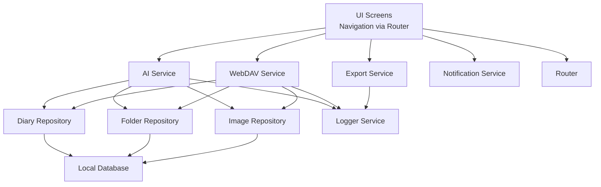
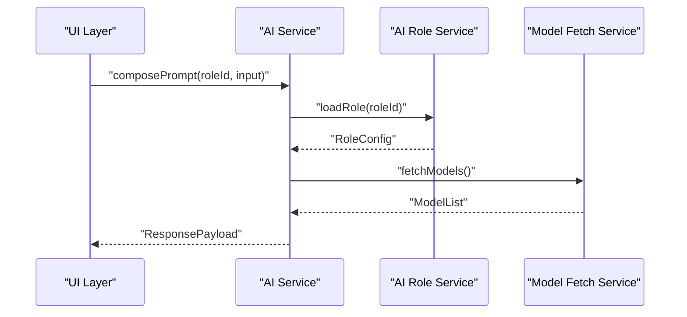
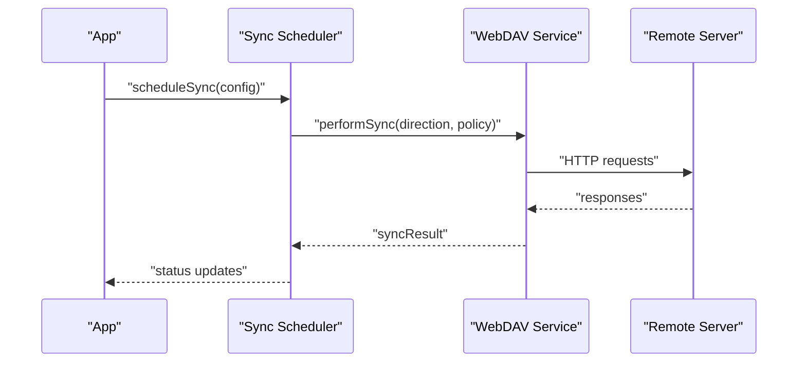
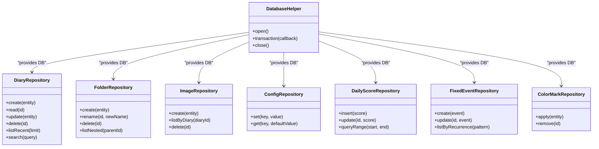
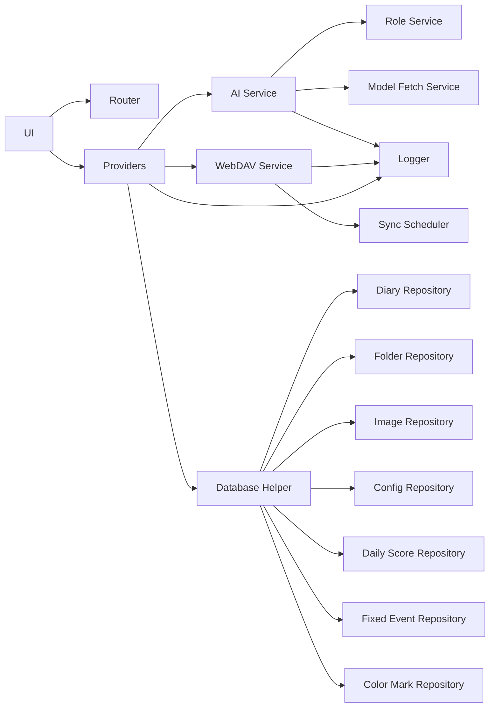

# API Reference

<cite>
**Referenced Files in This Document**
- [app.dart](file://lib/app.dart)
- [main.dart](file://lib/main.dart)
- [ai_service.dart](file://lib/core/ai/ai_service.dart)
- [ai_role_service.dart](file://lib/core/ai/ai_role_service.dart)
- [model_fetch_service.dart](file://lib/core/ai/model_fetch_service.dart)
- [webdav_service.dart](file://lib/core/network/webdav_service.dart)
- [sync_scheduler.dart](file://lib/core/network/sync_scheduler.dart)
- [export_service.dart](file://lib/core/export/export_service.dart)
- [logger_service.dart](file://lib/core/logger/logger_service.dart)
- [notification_service.dart](file://lib/core/notification/notification_service.dart)
- [app_router.dart](file://lib/core/router/app_router.dart)
- [database_helper.dart](file://lib/core/storage/database_helper.dart)
- [diary_repository.dart](file://lib/core/storage/diary_repository.dart)
- [folder_repository.dart](file://lib/core/storage/folder_repository.dart)
- [image_repository.dart](file://lib/core/storage/image_repository.dart)
- [config_repository.dart](file://lib/core/storage/config_repository.dart)
- [daily_score_repository.dart](file://lib/core/storage/daily_score_repository.dart)
- [fixed_event_repository.dart](file://lib/core/storage/fixed_event_repository.dart)
- [color_mark_repository.dart](file://lib/core/storage/color_mark_repository.dart)
- [models.dart](file://lib/config/models.dart)
- [defaults.dart](file://lib/config/defaults.dart)
</cite>

## Table of Contents
1. [Introduction](#introduction)
2. [Project Structure](#project-structure)
3. [Core Components](#core-components)
4. [Architecture Overview](#architecture-overview)
5. [Detailed Component Analysis](#detailed-component-analysis)
6. [Dependency Analysis](#dependency-analysis)
7. [Performance Considerations](#performance-considerations)
8. [Troubleshooting Guide](#troubleshooting-guide)
9. [Conclusion](#conclusion)
10. [Appendices](#appendices)

## Introduction
This document provides a comprehensive API reference for QNote Flutter’s public interfaces and internal APIs. It covers:
- AI service APIs for role-aware prompting and model fetching
- WebDAV synchronization APIs and scheduling
- Storage repository interfaces for domain entities
- Provider APIs for state management and data access patterns
- Internal component communication, event systems, and data exchange formats
- Versioning, backward compatibility, and deprecation considerations
- Performance characteristics, rate limiting, and best practices
- Extension points for integrating external components

## Project Structure
QNote Flutter organizes APIs by functional domains under lib/core. Public entry points are exposed via app initialization and routing. The core modules include:
- ai: AI orchestration and model selection
- network: WebDAV connectivity and sync scheduling
- storage: Repositories for domain entities backed by a local database
- export, logger, notification, router: Supporting services
- config: Shared models and defaults

```mermaid
graph TB
subgraph "App Entry"
MAIN["lib/main.dart"]
APP["lib/app.dart"]
end
subgraph "AI Services"
AIS["lib/core/ai/ai_service.dart"]
AIR["lib/core/ai/ai_role_service.dart"]
MFS["lib/core/ai/model_fetch_service.dart"]
end
subgraph "Network"
WDS["lib/core/network/webdav_service.dart"]
SCS["lib/core/network/sync_scheduler.dart"]
end
subgraph "Storage Repositories"
DBH["lib/core/storage/database_helper.dart"]
DIO["lib/core/storage/diary_repository.dart"]
FDR["lib/core/storage/folder_repository.dart"]
IMD["lib/core/storage/image_repository.dart"]
CFR["lib/core/storage/config_repository.dart"]
DSR["lib/core/storage/daily_score_repository.dart"]
FER["lib/core/storage/fixed_event_repository.dart"]
CMR["lib/core/storage/color_mark_repository.dart"]
end
subgraph "Supporting Services"
EXP["lib/core/export/export_service.dart"]
LOG["lib/core/logger/logger_service.dart"]
NOTI["lib/core/notification/notification_service.dart"]
RTR["lib/core/router/app_router.dart"]
end
MAIN --> APP
APP --> RTR
APP --> AIS
AIS --> AIR
AIS --> MFS
APP --> WDS
APP --> SCS
APP --> DBH
DBH --> DIO
DBH --> FDR
DBH --> IMD
DBH --> CFR
DBH --> DSR
DBH --> FER
DBH --> CMR
APP --> EXP
APP --> LOG
APP --> NOTI
```

**Diagram sources**
- [main.dart](file://lib/main.dart)
- [app.dart](file://lib/app.dart)
- [ai_service.dart](file://lib/core/ai/ai_service.dart)
- [ai_role_service.dart](file://lib/core/ai/ai_role_service.dart)
- [model_fetch_service.dart](file://lib/core/ai/model_fetch_service.dart)
- [webdav_service.dart](file://lib/core/network/webdav_service.dart)
- [sync_scheduler.dart](file://lib/core/network/sync_scheduler.dart)
- [database_helper.dart](file://lib/core/storage/database_helper.dart)
- [diary_repository.dart](file://lib/core/storage/diary_repository.dart)
- [folder_repository.dart](file://lib/core/storage/folder_repository.dart)
- [image_repository.dart](file://lib/core/storage/image_repository.dart)
- [config_repository.dart](file://lib/core/storage/config_repository.dart)
- [daily_score_repository.dart](file://lib/core/storage/daily_score_repository.dart)
- [fixed_event_repository.dart](file://lib/core/storage/fixed_event_repository.dart)
- [color_mark_repository.dart](file://lib/core/storage/color_mark_repository.dart)
- [export_service.dart](file://lib/core/export/export_service.dart)
- [logger_service.dart](file://lib/core/logger/logger_service.dart)
- [notification_service.dart](file://lib/core/notification/notification_service.dart)
- [app_router.dart](file://lib/core/router/app_router.dart)

**Section sources**
- [main.dart](file://lib/main.dart)
- [app.dart](file://lib/app.dart)

## Core Components
This section documents the primary service and repository interfaces that form QNote Flutter’s public API surface.

- AI Service APIs
  - Role-aware prompting and model selection orchestration
  - Methods: prompt with role context, fetch available models
  - Parameters: role identifiers, input prompts, optional model preferences
  - Returns: structured responses suitable for UI rendering
  - Errors: propagate underlying transport and parsing errors
  - Example usage: compose a note using a predefined role and render the response

- WebDAV Synchronization APIs
  - Remote synchronization operations and scheduling
  - Methods: initiate sync, schedule periodic sync, cancel pending sync
  - Parameters: credentials, remote base URL, sync direction, conflict resolution policy
  - Returns: sync status and metadata
  - Errors: handle network failures, authentication errors, and server-side conflicts
  - Example usage: configure sync on startup and run periodic sync

- Storage Repository Interfaces
  - Diary entries, folders, images, configuration, daily scores, fixed events, color marks
  - Methods: create, read, update, delete, list, query with filters
  - Parameters: entity-specific DTOs, pagination, sorting, filtering
  - Returns: typed entities, counts, lists, and transactional results
  - Errors: handle constraint violations, concurrency conflicts, and database exceptions
  - Example usage: persist a new diary entry and query recent items

- Export, Logger, Notification, Router
  - Export: export data to supported formats
  - Logger: structured logging with levels and categories
  - Notification: push notifications and reminders
  - Router: navigation and route management
  - Example usage: log diagnostic events, trigger notifications, navigate between screens

**Section sources**
- [ai_service.dart](file://lib/core/ai/ai_service.dart)
- [ai_role_service.dart](file://lib/core/ai/ai_role_service.dart)
- [model_fetch_service.dart](file://lib/core/ai/model_fetch_service.dart)
- [webdav_service.dart](file://lib/core/network/webdav_service.dart)
- [sync_scheduler.dart](file://lib/core/network/sync_scheduler.dart)
- [diary_repository.dart](file://lib/core/storage/diary_repository.dart)
- [folder_repository.dart](file://lib/core/storage/folder_repository.dart)
- [image_repository.dart](file://lib/core/storage/image_repository.dart)
- [config_repository.dart](file://lib/core/storage/config_repository.dart)
- [daily_score_repository.dart](file://lib/core/storage/daily_score_repository.dart)
- [fixed_event_repository.dart](file://lib/core/storage/fixed_event_repository.dart)
- [color_mark_repository.dart](file://lib/core/storage/color_mark_repository.dart)
- [export_service.dart](file://lib/core/export/export_service.dart)
- [logger_service.dart](file://lib/core/logger/logger_service.dart)
- [notification_service.dart](file://lib/core/notification/notification_service.dart)
- [app_router.dart](file://lib/core/router/app_router.dart)

## Architecture Overview
The system follows a layered architecture:
- Presentation layer: Flutter UI and routes
- Application layer: Orchestrators (AI, sync, export)
- Domain layer: Repositories and entities
- Infrastructure layer: Local database, WebDAV client, logging, notifications

**Diagram sources**
- [app_router.dart](file://lib/core/router/app_router.dart)
- [ai_service.dart](file://lib/core/ai/ai_service.dart)
- [webdav_service.dart](file://lib/core/network/webdav_service.dart)
- [export_service.dart](file://lib/core/export/export_service.dart)
- [diary_repository.dart](file://lib/core/storage/diary_repository.dart)
- [folder_repository.dart](file://lib/core/storage/folder_repository.dart)
- [image_repository.dart](file://lib/core/storage/image_repository.dart)
- [database_helper.dart](file://lib/core/storage/database_helper.dart)
- [logger_service.dart](file://lib/core/logger/logger_service.dart)
- [notification_service.dart](file://lib/core/notification/notification_service.dart)

## Detailed Component Analysis

### AI Service APIs
The AI service composes role-aware prompts and orchestrates model selection. Typical operations include:
- Prompt composition with role context
- Model availability retrieval
- Streaming or batch response handling

**Diagram sources**
- [ai_service.dart](file://lib/core/ai/ai_service.dart)
- [ai_role_service.dart](file://lib/core/ai/ai_role_service.dart)
- [model_fetch_service.dart](file://lib/core/ai/model_fetch_service.dart)

**Section sources**
- [ai_service.dart](file://lib/core/ai/ai_service.dart)
- [ai_role_service.dart](file://lib/core/ai/ai_role_service.dart)
- [model_fetch_service.dart](file://lib/core/ai/model_fetch_service.dart)

### WebDAV Synchronization APIs
The WebDAV service manages remote synchronization with scheduling support:
- Connect and authenticate
- Upload/download operations
- Conflict resolution and retry policies
- Schedule periodic sync tasks

**Diagram sources**
- [sync_scheduler.dart](file://lib/core/network/sync_scheduler.dart)
- [webdav_service.dart](file://lib/core/network/webdav_service.dart)

**Section sources**
- [webdav_service.dart](file://lib/core/network/webdav_service.dart)
- [sync_scheduler.dart](file://lib/core/network/sync_scheduler.dart)

### Storage Repository Interfaces
Repositories encapsulate CRUD and query operations for domain entities. Representative operations include:
- DiaryRepository: create, read, update, delete, list recent, search
- FolderRepository: create, rename, delete, list nested
- ImageRepository: upload metadata, list by diary, delete
- ConfigRepository: set/get configuration keys
- DailyScoreRepository: insert/update score, query date range
- FixedEventRepository: create, update, list by recurrence
- ColorMarkRepository: apply/remove color markers

**Diagram sources**
- [database_helper.dart](file://lib/core/storage/database_helper.dart)
- [diary_repository.dart](file://lib/core/storage/diary_repository.dart)
- [folder_repository.dart](file://lib/core/storage/folder_repository.dart)
- [image_repository.dart](file://lib/core/storage/image_repository.dart)
- [config_repository.dart](file://lib/core/storage/config_repository.dart)
- [daily_score_repository.dart](file://lib/core/storage/daily_score_repository.dart)
- [fixed_event_repository.dart](file://lib/core/storage/fixed_event_repository.dart)
- [color_mark_repository.dart](file://lib/core/storage/color_mark_repository.dart)

**Section sources**
- [database_helper.dart](file://lib/core/storage/database_helper.dart)
- [diary_repository.dart](file://lib/core/storage/diary_repository.dart)
- [folder_repository.dart](file://lib/core/storage/folder_repository.dart)
- [image_repository.dart](file://lib/core/storage/image_repository.dart)
- [config_repository.dart](file://lib/core/storage/config_repository.dart)
- [daily_score_repository.dart](file://lib/core/storage/daily_score_repository.dart)
- [fixed_event_repository.dart](file://lib/core/storage/fixed_event_repository.dart)
- [color_mark_repository.dart](file://lib/core/storage/color_mark_repository.dart)

### Provider APIs and Data Access Patterns
Providers manage reactive state and coordinate data access across UI layers. Typical patterns include:
- Stream-based state updates
- Repository-driven queries
- Batch updates with transactions
- Error propagation to UI

Integration patterns:
- UI subscribes to provider streams
- Providers call repositories for data
- Errors are normalized and surfaced to UI

[No sources needed since this section describes conceptual patterns]

### Supporting Services
- Export Service: exports current data to a selected format
- Logger Service: structured logs with levels and categories
- Notification Service: triggers notifications and reminders
- Router: navigational state and deep linking

**Section sources**
- [export_service.dart](file://lib/core/export/export_service.dart)
- [logger_service.dart](file://lib/core/logger/logger_service.dart)
- [notification_service.dart](file://lib/core/notification/notification_service.dart)
- [app_router.dart](file://lib/core/router/app_router.dart)

## Dependency Analysis
Key dependencies and coupling:
- UI depends on Router and Providers
- AI Service depends on Role Service and Model Fetch Service
- WebDAV Service depends on Sync Scheduler
- Repositories depend on Database Helper
- All services depend on Logger for diagnostics

**Diagram sources**
- [app_router.dart](file://lib/core/router/app_router.dart)
- [ai_service.dart](file://lib/core/ai/ai_service.dart)
- [ai_role_service.dart](file://lib/core/ai/ai_role_service.dart)
- [model_fetch_service.dart](file://lib/core/ai/model_fetch_service.dart)
- [webdav_service.dart](file://lib/core/network/webdav_service.dart)
- [sync_scheduler.dart](file://lib/core/network/sync_scheduler.dart)
- [database_helper.dart](file://lib/core/storage/database_helper.dart)
- [diary_repository.dart](file://lib/core/storage/diary_repository.dart)
- [folder_repository.dart](file://lib/core/storage/folder_repository.dart)
- [image_repository.dart](file://lib/core/storage/image_repository.dart)
- [config_repository.dart](file://lib/core/storage/config_repository.dart)
- [daily_score_repository.dart](file://lib/core/storage/daily_score_repository.dart)
- [fixed_event_repository.dart](file://lib/core/storage/fixed_event_repository.dart)
- [color_mark_repository.dart](file://lib/core/storage/color_mark_repository.dart)
- [logger_service.dart](file://lib/core/logger/logger_service.dart)

**Section sources**
- [app_router.dart](file://lib/core/router/app_router.dart)
- [ai_service.dart](file://lib/core/ai/ai_service.dart)
- [webdav_service.dart](file://lib/core/network/webdav_service.dart)
- [database_helper.dart](file://lib/core/storage/database_helper.dart)

## Performance Considerations
- AI Service
  - Prefer batch operations for multiple prompts
  - Cache role configurations and model lists
  - Limit concurrent requests to avoid throttling
- WebDAV Service
  - Use incremental sync where possible
  - Apply exponential backoff on transient errors
  - Compress payloads and limit file sizes
- Storage Repositories
  - Use indexed queries and pagination
  - Batch writes within transactions
  - Avoid large in-memory collections
- General
  - Minimize UI rebuilds by using fine-grained provider streams
  - Log only necessary telemetry to reduce overhead

[No sources needed since this section provides general guidance]

## Troubleshooting Guide
Common issues and resolutions:
- Authentication failures
  - Verify credentials and server endpoint
  - Retry with refreshed tokens if applicable
- Network timeouts
  - Increase timeout thresholds for large transfers
  - Enable offline mode and queue operations
- Sync conflicts
  - Implement merge strategies or manual resolution
  - Use timestamps and ETags for conflict detection
- Database errors
  - Inspect transaction rollbacks and constraint violations
  - Rebuild indices if query performance degrades
- Logging
  - Use structured logs to capture request IDs and error codes
  - Avoid logging sensitive data

**Section sources**
- [logger_service.dart](file://lib/core/logger/logger_service.dart)
- [webdav_service.dart](file://lib/core/network/webdav_service.dart)
- [database_helper.dart](file://lib/core/storage/database_helper.dart)

## Conclusion
QNote Flutter exposes a clean separation of concerns through service and repository APIs. By leveraging role-aware AI prompts, robust WebDAV synchronization, and strongly-typed repositories, applications can integrate seamlessly. Follow the recommended patterns for state management, error handling, and performance to ensure reliable operation.

[No sources needed since this section summarizes without analyzing specific files]

## Appendices

### API Versioning and Compatibility
- Versioning strategy
  - Semantic versioning for breaking changes
  - Feature flags for experimental APIs
- Backward compatibility
  - Maintain stable interfaces for major releases
  - Deprecate APIs with migration timelines
- Deprecation policy
  - Announce deprecations in release notes
  - Provide alternative APIs and migration helpers

[No sources needed since this section provides general guidance]

### Extension Points
- Custom AI roles
  - Extend role configuration and prompt templates
- Custom WebDAV backends
  - Implement adapter interfaces for alternate servers
- Custom export formats
  - Add new export handlers while preserving existing ones
- Custom repositories
  - Implement repository interfaces for new entities

[No sources needed since this section provides general guidance]

### Data Exchange Formats
- JSON payloads for AI responses and WebDAV metadata
- Binary formats for images and attachments
- Structured logs with standardized fields

[No sources needed since this section provides general guidance]