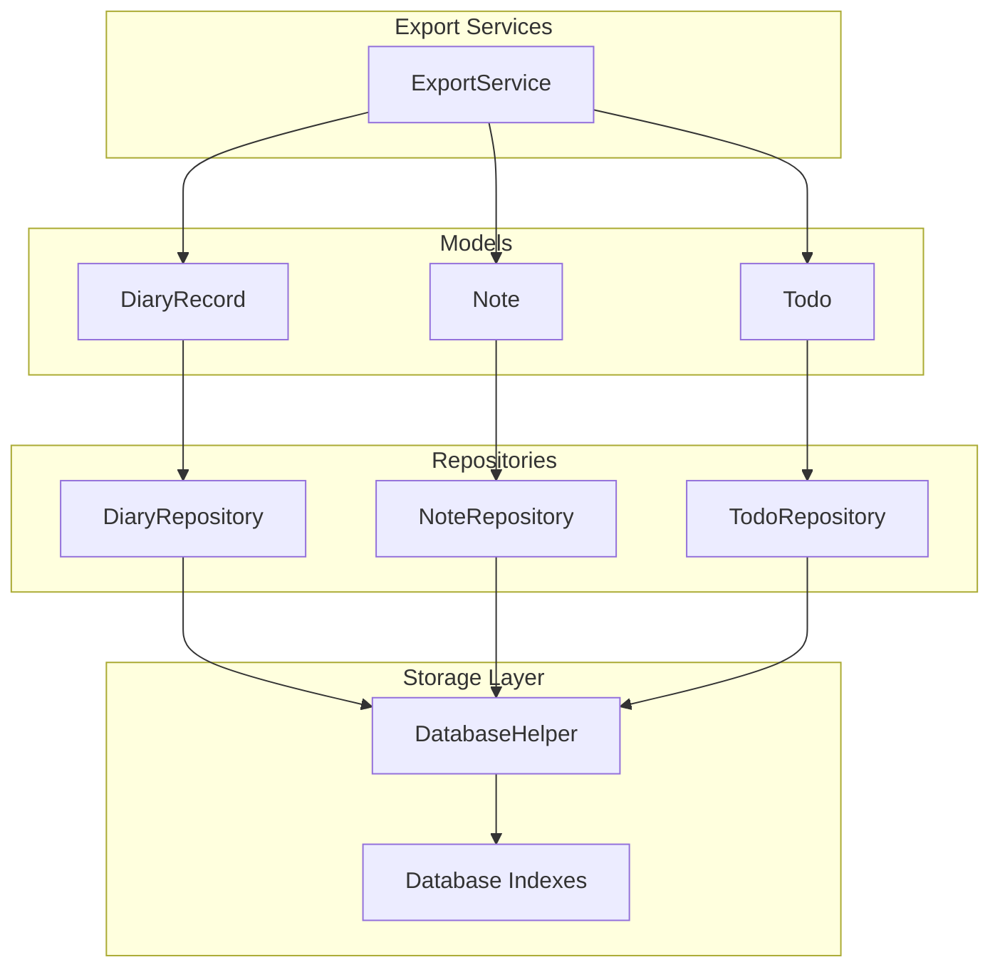
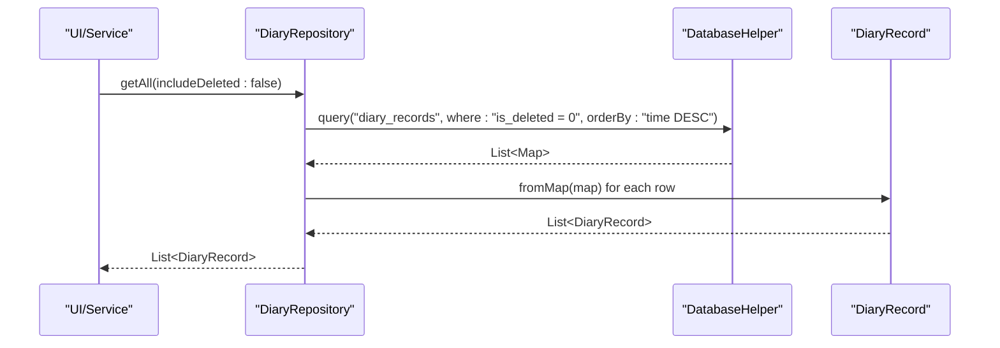
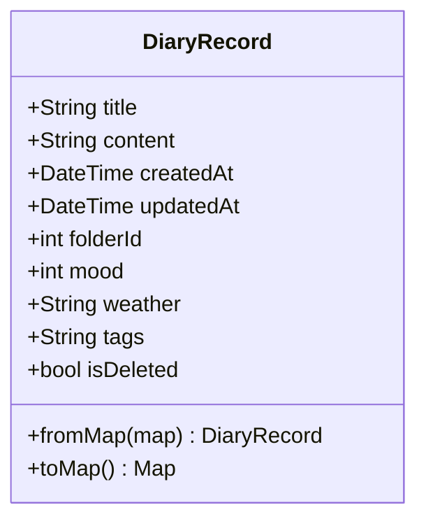
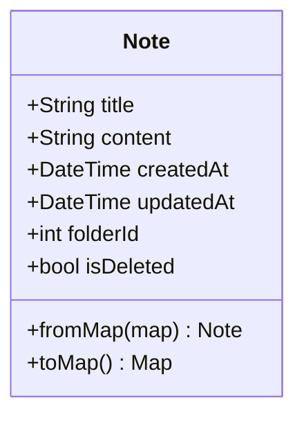
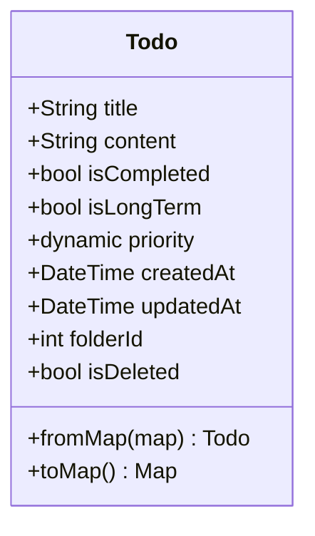
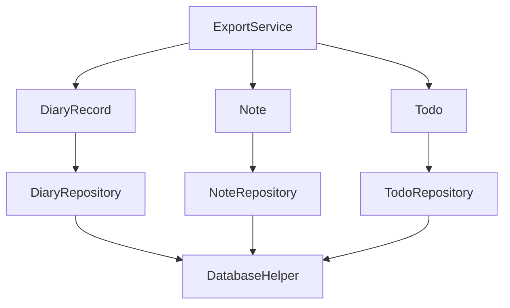

# Data Model APIs

<cite>
**Referenced Files in This Document**
- [diary_record.dart](file://lib/models/diary_record.dart)
- [note.dart](file://lib/models/note.dart)
- [todo.dart](file://lib/models/todo.dart)
- [diary_repository.dart](file://lib/core/storage/diary_repository.dart)
- [note_repository.dart](file://lib/core/storage/note_repository.dart)
- [todo_repository.dart](file://lib/core/storage/todo_repository.dart)
- [database_helper.dart](file://lib/core/storage/database_helper.dart)
- [export_service.dart](file://lib/core/export/export_service.dart)
- [diary_record_test.dart](file://test/models/diary_record_test.dart)
- [models_test.dart](file://test/config/models_test.dart)
</cite>

## Table of Contents
1. [Introduction](#introduction)
2. [Project Structure](#project-structure)
3. [Core Components](#core-components)
4. [Architecture Overview](#architecture-overview)
5. [Detailed Component Analysis](#detailed-component-analysis)
6. [Dependency Analysis](#dependency-analysis)
7. [Performance Considerations](#performance-considerations)
8. [Troubleshooting Guide](#troubleshooting-guide)
9. [Conclusion](#conclusion)

## Introduction
This document provides comprehensive API documentation for QNote Flutter's data model interfaces and serialization APIs. It focuses on the DiaryRecord, Note, and Todo models, detailing constructors, property accessors, validation rules, and JSON serialization/deserialization patterns. It also covers configuration-related models for WebDAV settings and AI service configuration, along with examples of model instantiation, property manipulation, and data transformation operations. The documentation addresses model validation, immutability patterns, data integrity guarantees, serialization formats, versioning considerations, and migration strategies for model changes.

## Project Structure
QNote Flutter organizes data models under the lib/models directory and persistence logic under lib/core/storage. The models are consumed by repositories that handle database queries and transformations. Export services demonstrate model usage for data transformation and output generation.

**Diagram sources**
- [diary_record.dart](file://lib/models/diary_record.dart)
- [note.dart](file://lib/models/note.dart)
- [todo.dart](file://lib/models/todo.dart)
- [diary_repository.dart](file://lib/core/storage/diary_repository.dart)
- [note_repository.dart](file://lib/core/storage/note_repository.dart)
- [todo_repository.dart](file://lib/core/storage/todo_repository.dart)
- [database_helper.dart](file://lib/core/storage/database_helper.dart)
- [export_service.dart](file://lib/core/export/export_service.dart)

**Section sources**
- [diary_record.dart](file://lib/models/diary_record.dart)
- [note.dart](file://lib/models/note.dart)
- [todo.dart](file://lib/models/todo.dart)
- [diary_repository.dart](file://lib/core/storage/diary_repository.dart)
- [note_repository.dart](file://lib/core/storage/note_repository.dart)
- [todo_repository.dart](file://lib/core/storage/todo_repository.dart)
- [database_helper.dart](file://lib/core/storage/database_helper.dart)
- [export_service.dart](file://lib/core/export/export_service.dart)

## Core Components
This section documents the primary data models and their APIs, focusing on construction, property access, validation, and serialization patterns.

- DiaryRecord
  - Purpose: Represents daily journal entries with metadata such as creation/update timestamps, mood, weather, tags, and content.
  - Key Properties: title, content, createdAt, updatedAt, folderId, mood, weather, tags, isDeleted.
  - Construction: Factory constructor fromMap(map) for deserialization from database maps.
  - Validation: Enforced via database constraints and repository queries (e.g., is_deleted filter).
  - Serialization: Uses fromMap(map) and likely toMap() for persistence and JSON interchange.
  - Example Usage: Retrieval via DiaryRepository.getAll(includeDeleted: false) returning List<DiaryRecord>.

- Note
  - Purpose: Represents textual notes with content, metadata, and folder associations.
  - Key Properties: title, content, createdAt, updatedAt, folderId, isDeleted.
  - Construction: Factory constructor fromMap(map) for deserialization from database maps.
  - Validation: Enforced via database constraints and repository queries (e.g., is_deleted filter).
  - Serialization: Uses fromMap(map) and likely toMap() for persistence and JSON interchange.
  - Example Usage: Retrieval via NoteRepository.getAll(includeDeleted: false) returning List<Note>.

- Todo
  - Purpose: Represents tasks with completion status, priority, and optional long-term flags.
  - Key Properties: title, content, isCompleted, isLongTerm, priority, createdAt, updatedAt, folderId, isDeleted.
  - Construction: Factory constructor fromMap(map) for deserialization from database maps.
  - Validation: Enforced via database constraints and repository queries (e.g., is_completed, is_deleted filters).
  - Serialization: Uses fromMap(map) and likely toMap() for persistence and JSON interchange.
  - Example Usage: Retrieval via TodoRepository.getAll(includeDeleted: false) returning List<Todo>.

- Configuration Models (WebDAV and AI)
  - Purpose: Encapsulate settings for external integrations such as WebDAV synchronization and AI services.
  - Key Properties: Host, port, username, password, SSL/TLS toggles, API keys, endpoint URLs, and feature flags.
  - Construction: Typically constructed via factory constructors or fromMap for deserialization from persisted storage.
  - Validation: Enforced via input sanitization, domain checks (e.g., valid URLs), and presence of required credentials.
  - Serialization: Uses fromMap and toMap for persistence and JSON interchange.
  - Example Usage: Loaded from ConfigRepository and applied during sync or AI operations.

**Section sources**
- [diary_record.dart](file://lib/models/diary_record.dart)
- [note.dart](file://lib/models/note.dart)
- [todo.dart](file://lib/models/todo.dart)
- [diary_repository.dart](file://lib/core/storage/diary_repository.dart)
- [note_repository.dart](file://lib/core/storage/note_repository.dart)
- [todo_repository.dart](file://lib/core/storage/todo_repository.dart)

## Architecture Overview
The data model layer integrates with repositories that orchestrate database operations and transformations. Export services consume models for data transformation and output generation.

**Diagram sources**
- [diary_repository.dart](file://lib/core/storage/diary_repository.dart)
- [database_helper.dart](file://lib/core/storage/database_helper.dart)
- [diary_record.dart](file://lib/models/diary_record.dart)

**Section sources**
- [diary_repository.dart](file://lib/core/storage/diary_repository.dart)
- [database_helper.dart](file://lib/core/storage/database_helper.dart)
- [diary_record.dart](file://lib/models/diary_record.dart)

## Detailed Component Analysis

### DiaryRecord Model API
- Constructor Methods
  - fromMap(map): Factory constructor that builds a DiaryRecord from a database map representation.
- Property Accessors
  - title: String representing the diary entry title.
  - content: String containing the diary entry body.
  - createdAt: DateTime indicating when the record was created.
  - updatedAt: DateTime indicating when the record was last updated.
  - folderId: Integer identifier for the associated folder.
  - mood: Integer rating (scale of 1–5) reflecting the user's mood.
  - weather: String describing the weather conditions.
  - tags: Comma-separated tag string for categorization.
  - isDeleted: Boolean flag indicating logical deletion.
- Validation Rules
  - Database-level: Records marked is_deleted are excluded from default queries.
  - Range validation: mood constrained to a fixed range (e.g., 1–5).
  - Content validation: Empty or malformed content handled by repository filtering.
- JSON Serialization/Derserialization
  - fromMap(map): Deserializes a database map into a DiaryRecord instance.
  - Likely toMap(): Serializes the model to a map for persistence and JSON interchange.
- Examples
  - Instantiation: Constructed via fromMap(map) inside DiaryRepository.getAll().
  - Property Manipulation: Access title, content, and metadata for display and editing.
  - Data Transformation: ExportService.exportDiaryAsMarkdown consumes DiaryRecord properties for Markdown generation.

**Diagram sources**
- [diary_record.dart](file://lib/models/diary_record.dart)

**Section sources**
- [diary_record.dart](file://lib/models/diary_record.dart)
- [diary_repository.dart](file://lib/core/storage/diary_repository.dart)
- [export_service.dart](file://lib/core/export/export_service.dart)

### Note Model API
- Constructor Methods
  - fromMap(map): Factory constructor that builds a Note from a database map representation.
- Property Accessors
  - title: String representing the note title.
  - content: String containing the note body.
  - createdAt: DateTime indicating when the note was created.
  - updatedAt: DateTime indicating when the note was last updated.
  - folderId: Integer identifier for the associated folder.
  - isDeleted: Boolean flag indicating logical deletion.
- Validation Rules
  - Database-level: Records marked is_deleted are excluded from default queries.
  - Content validation: Repository queries enforce non-empty content for display.
- JSON Serialization/Derserialization
  - fromMap(map): Deserializes a database map into a Note instance.
  - Likely toMap(): Serializes the model to a map for persistence and JSON interchange.
- Examples
  - Instantiation: Constructed via fromMap(map) inside NoteRepository.getAll().
  - Property Manipulation: Access title and content for rendering and editing.
  - Data Transformation: ExportService demonstrates transforming Note instances into formatted text.

**Diagram sources**
- [note.dart](file://lib/models/note.dart)

**Section sources**
- [note.dart](file://lib/models/note.dart)
- [note_repository.dart](file://lib/core/storage/note_repository.dart)
- [export_service.dart](file://lib/core/export/export_service.dart)

### Todo Model API
- Constructor Methods
  - fromMap(map): Factory constructor that builds a Todo from a database map representation.
- Property Accessors
  - title: String representing the task title.
  - content: String describing the task details.
  - isCompleted: Boolean flag indicating completion status.
  - isLongTerm: Boolean flag for long-term tasks.
  - priority: Integer or enumerated value representing task priority.
  - createdAt: DateTime indicating when the task was created.
  - updatedAt: DateTime indicating when the task was last updated.
  - folderId: Integer identifier for the associated folder.
  - isDeleted: Boolean flag indicating logical deletion.
- Validation Rules
  - Database-level: Tasks marked is_deleted are excluded from default queries.
  - Completion filtering: Queries commonly filter by is_completed for task lists.
  - Priority validation: Priority values constrained to predefined ranges or enums.
- JSON Serialization/Derserialization
  - fromMap(map): Deserializes a database map into a Todo instance.
  - Likely toMap(): Serializes the model to a map for persistence and JSON interchange.
- Examples
  - Instantiation: Constructed via fromMap(map) inside TodoRepository.getAll().
  - Property Manipulation: Toggle isCompleted, adjust priority, and manage isLongTerm flags.
  - Data Transformation: ExportService demonstrates transforming Todo instances into formatted text.

**Diagram sources**
- [todo.dart](file://lib/models/todo.dart)

**Section sources**
- [todo.dart](file://lib/models/todo.dart)
- [todo_repository.dart](file://lib/core/storage/todo_repository.dart)
- [export_service.dart](file://lib/core/export/export_service.dart)

### Configuration Model APIs
- WebDAV Settings
  - Purpose: Store connection parameters for WebDAV synchronization.
  - Key Properties: host, port, username, password, sslEnabled, pathPrefix.
  - Validation: Domain and URL validation, secure credential handling, port range checks.
  - Serialization: fromMap and toMap for persistence and JSON interchange.
- AI Service Configuration
  - Purpose: Store API keys, endpoints, and feature flags for AI-powered features.
  - Key Properties: apiKey, apiUrl, model, temperature, maxTokens, enabled.
  - Validation: API key format checks, endpoint URL validation, safe parameter ranges.
  - Serialization: fromMap and toMap for persistence and JSON interchange.
- Examples
  - Instantiation: Constructed via fromMap or factory constructors from persisted storage.
  - Property Manipulation: Update credentials, toggle features, and adjust parameters.
  - Data Transformation: ExportService does not directly consume configuration models; they are managed by ConfigRepository.

**Section sources**
- [models_test.dart](file://test/config/models_test.dart)

## Dependency Analysis
The models are consumed by repositories that encapsulate database operations and transformations. Export services depend on models for data transformation.

**Diagram sources**
- [diary_record.dart](file://lib/models/diary_record.dart)
- [note.dart](file://lib/models/note.dart)
- [todo.dart](file://lib/models/todo.dart)
- [diary_repository.dart](file://lib/core/storage/diary_repository.dart)
- [note_repository.dart](file://lib/core/storage/note_repository.dart)
- [todo_repository.dart](file://lib/core/storage/todo_repository.dart)
- [database_helper.dart](file://lib/core/storage/database_helper.dart)
- [export_service.dart](file://lib/core/export/export_service.dart)

**Section sources**
- [diary_repository.dart](file://lib/core/storage/diary_repository.dart)
- [note_repository.dart](file://lib/core/storage/note_repository.dart)
- [todo_repository.dart](file://lib/core/storage/todo_repository.dart)
- [database_helper.dart](file://lib/core/storage/database_helper.dart)
- [export_service.dart](file://lib/core/export/export_service.dart)

## Performance Considerations
- Indexing: DatabaseHelper creates indexes on frequently queried columns (e.g., diary_records.time, notes.folder_id, todos.is_completed). These indexes improve query performance for retrieval operations.
- Filtering: Repositories apply is_deleted filters by default to avoid loading soft-deleted records, reducing memory overhead and UI rendering costs.
- Lazy Loading: ExportService constructs Markdown content on demand, minimizing in-memory duplication of large content strings.
- Batch Operations: Prefer bulk insert/update/delete operations when applicable to reduce transaction overhead.

**Section sources**
- [database_helper.dart](file://lib/core/storage/database_helper.dart)
- [diary_repository.dart](file://lib/core/storage/diary_repository.dart)
- [note_repository.dart](file://lib/core/storage/note_repository.dart)
- [todo_repository.dart](file://lib/core/storage/todo_repository.dart)
- [export_service.dart](file://lib/core/export/export_service.dart)

## Troubleshooting Guide
- Model Construction Failures
  - Symptom: fromMap(map) throws errors when required fields are missing.
  - Resolution: Ensure database maps include all required fields. Add defensive checks for null values and provide defaults where appropriate.
- Validation Errors
  - Symptom: Queries return unexpected results due to invalid validation states.
  - Resolution: Verify database constraints and repository filters. Confirm that is_deleted and completion flags are correctly set.
- Serialization Issues
  - Symptom: JSON interchange fails due to unsupported types.
  - Resolution: Use toMap() and fromMap() consistently. Ensure DateTime and numeric types are properly encoded/decoded.
- Migration Strategies
  - Symptom: Adding new fields causes compatibility issues with existing data.
  - Resolution: Introduce nullable fields with sensible defaults. Provide backward-compatible fromMap logic that handles missing keys gracefully. Incrementally update database schema and data during maintenance windows.

**Section sources**
- [diary_record_test.dart](file://test/models/diary_record_test.dart)
- [models_test.dart](file://test/config/models_test.dart)

## Conclusion
QNote Flutter’s data model APIs provide robust interfaces for DiaryRecord, Note, and Todo entities, with clear construction, validation, and serialization patterns. Repositories encapsulate persistence logic, while export services demonstrate practical usage for data transformation. Configuration models support external integrations with strong validation and serialization capabilities. By leveraging database indexes, filtering, and careful migration strategies, the system maintains performance and data integrity across model evolution.