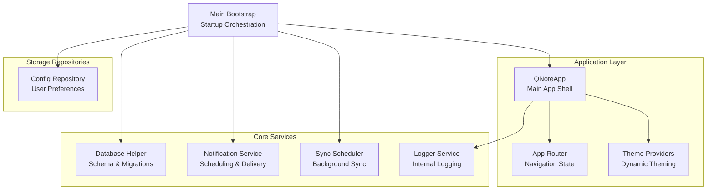
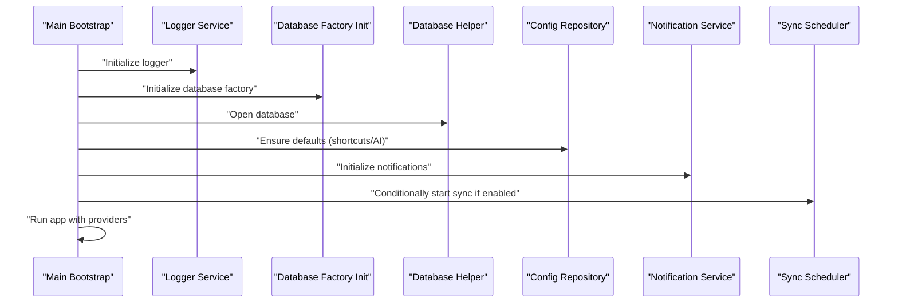
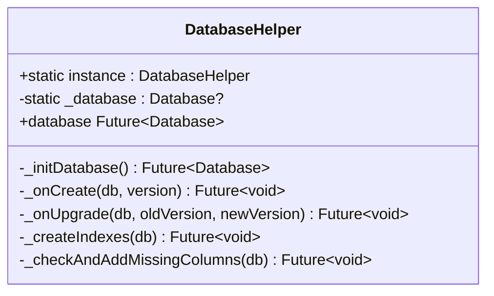
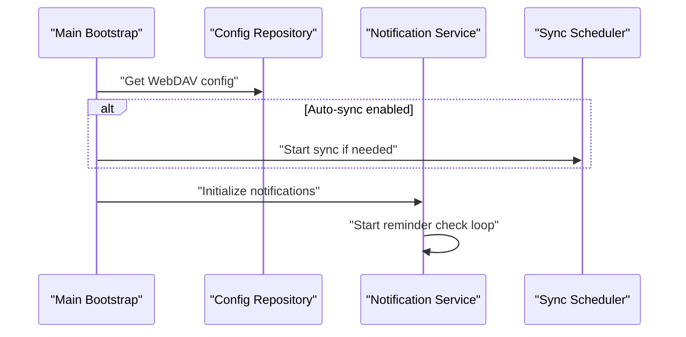
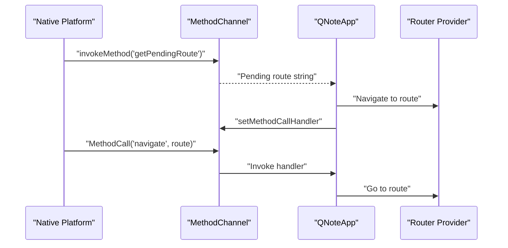
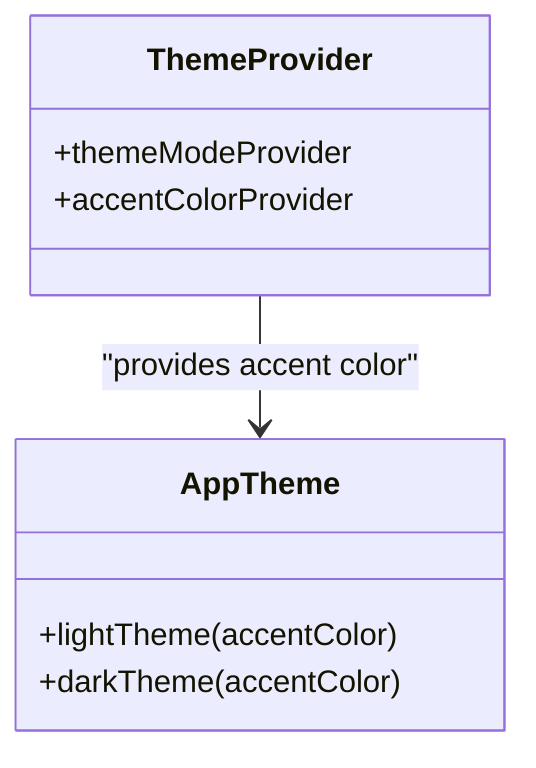
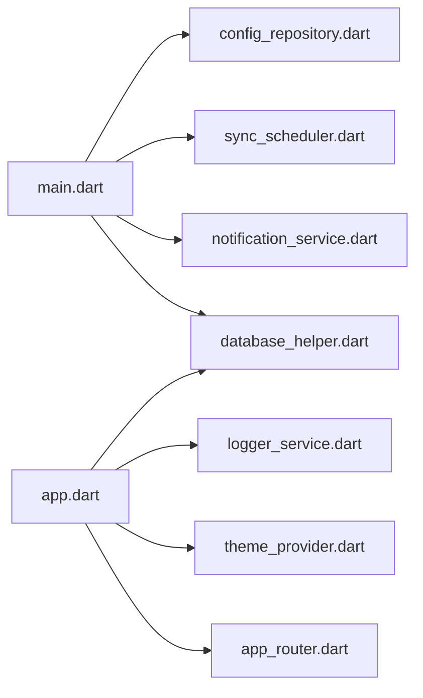

# Internal Communication APIs

<cite>
**Referenced Files in This Document**
- [app.dart](file://lib/app.dart)
- [main.dart](file://lib/main.dart)
- [database_init.dart](file://lib/database_init.dart)
- [database_init_io.dart](file://lib/database_init_io.dart)
- [database_helper.dart](file://lib/core/storage/database_helper.dart)
- [notification_service.dart](file://lib/core/notification/notification_service.dart)
- [app_router.dart](file://lib/core/router/app_router.dart)
- [theme_provider.dart](file://lib/providers/theme_provider.dart)
- [app_theme.dart](file://lib/core/theme/app_theme.dart)
- [logger_service.dart](file://lib/core/logger/logger_service.dart)
- [sync_scheduler.dart](file://lib/core/network/sync_scheduler.dart)
- [config_repository.dart](file://lib/core/storage/config_repository.dart)
</cite>

## Table of Contents
1. [Introduction](#introduction)
2. [Project Structure](#project-structure)
3. [Core Components](#core-components)
4. [Architecture Overview](#architecture-overview)
5. [Detailed Component Analysis](#detailed-component-analysis)
6. [Dependency Analysis](#dependency-analysis)
7. [Performance Considerations](#performance-considerations)
8. [Troubleshooting Guide](#troubleshooting-guide)
9. [Conclusion](#conclusion)

## Introduction
This document describes the internal communication APIs that enable QNote Flutter to coordinate database operations, notifications, routing, theming, and cross-platform integration. It focuses on:
- Database helper APIs for schema initialization, migrations, query construction, transactions, and result mapping
- Notification service APIs for scheduling, delivery, and user preference integration
- Routing APIs for navigation state management, route guards, and deep linking support
- Theme configuration APIs for dynamic theming, color management, and style customization
- Inter-component communication patterns, event propagation, and callback mechanisms
- Internal API contracts, version compatibility, extension points, and debugging utilities

## Project Structure
The internal APIs are organized around cohesive domains:
- Core storage: database initialization and helper utilities
- Core notification: scheduled reminders and delivery pipeline
- Core router: navigation state and deep linking
- Core theme: dynamic theming and color management
- Providers: Riverpod-based state management for UI and configuration
- Application bootstrap: startup orchestration and lifecycle integration

**Diagram sources**
- [main.dart:12-30](file://lib/main.dart#L12-L30)
- [app.dart:78-121](file://lib/app.dart#L78-L121)

**Section sources**
- [main.dart:12-30](file://lib/main.dart#L12-L30)
- [app.dart:12-124](file://lib/app.dart#L12-L124)

## Core Components
This section documents the primary internal APIs and their responsibilities.

- Database Helper
  - Purpose: Initialize database factory, manage schema creation and upgrades, maintain indexes, and expose shared database instance
  - Key capabilities: Schema initialization, migration handling, index creation, column addition, and database lifecycle management
  - Versioning: Database version set to 15 with incremental upgrade steps

- Notification Service
  - Purpose: Manage scheduled reminders, integrate with user preferences, and coordinate delivery mechanisms
  - Key capabilities: Initialization, periodic reminder checks, and integration with configuration repositories

- Routing APIs
  - Purpose: Provide navigation state management, route guards, and deep linking support via a method channel bridge
  - Key capabilities: Route navigation, pending route handling, and lifecycle-aware refresh

- Theme Configuration APIs
  - Purpose: Enable dynamic theming, color management, and style customization through Riverpod providers and theme models
  - Key capabilities: Light/dark theme switching, accent color updates, and global theme application

- Cross-Platform Integration
  - Purpose: Bridge native platform channels with Flutter for deep linking and lifecycle-aware actions
  - Key capabilities: Method channel communication, pending route retrieval, and navigation invocation

**Section sources**
- [database_helper.dart:5-456](file://lib/core/storage/database_helper.dart#L5-L456)
- [notification_service.dart](file://lib/core/notification/notification_service.dart)
- [app_router.dart](file://lib/core/router/app_router.dart)
- [theme_provider.dart](file://lib/providers/theme_provider.dart)
- [app_theme.dart](file://lib/core/theme/app_theme.dart)
- [app.dart:19-75](file://lib/app.dart#L19-L75)

## Architecture Overview
The internal architecture integrates multiple subsystems through well-defined entry points and providers. The main bootstrap initializes logging, database factory, database instance, and essential configurations. The application shell manages theming, routing, and lifecycle events while delegating specialized tasks to dedicated services.

**Diagram sources**
- [main.dart:12-30](file://lib/main.dart#L12-L30)

**Section sources**
- [main.dart:12-30](file://lib/main.dart#L12-L30)

## Detailed Component Analysis

### Database Helper API
The Database Helper centralizes all database operations and lifecycle management. It exposes a singleton instance and manages schema creation, upgrades, and index maintenance.

Key responsibilities:
- Database initialization and path resolution (local vs web)
- Schema creation for multiple tables (diary records, notes, folders, todos, AI configs, shortcuts, user profiles, chat sessions, WebDAV configs, app configs, color marks, sync log, daily scores, body states, fixed event templates)
- Migration handling across versions with incremental ALTER TABLE statements
- Index creation for performance optimization
- Column validation and safe addition with fallbacks
- Database versioning set to 15

API contract highlights:
- Singleton pattern with lazy initialization
- Asynchronous database opening with onCreate/onUpgrade callbacks
- Safe schema modification with try/catch blocks
- Version compatibility maintained through incremental upgrades

**Diagram sources**
- [database_helper.dart:5-456](file://lib/core/storage/database_helper.dart#L5-L456)

**Section sources**
- [database_helper.dart:5-456](file://lib/core/storage/database_helper.dart#L5-L456)
- [database_init.dart:4-6](file://lib/database_init.dart#L4-L6)
- [database_init_io.dart:1](file://lib/database_init_io.dart#L1)

### Notification Service API
The Notification Service manages scheduled reminders and integrates with user preferences. It is initialized during application startup and periodically checks for reminders.

Key responsibilities:
- Initialization routine
- Periodic reminder check loop
- Integration with configuration repository for user preferences
- Coordination with sync scheduler for automatic synchronization conditions

API contract highlights:
- Singleton-like access via instance property
- Initialization method for setup
- Background reminder checking mechanism
- Conditional startup based on WebDAV configuration

**Diagram sources**
- [main.dart:18-28](file://lib/main.dart#L18-L28)
- [notification_service.dart](file://lib/core/notification/notification_service.dart)

**Section sources**
- [main.dart:18-28](file://lib/main.dart#L18-L28)
- [notification_service.dart](file://lib/core/notification/notification_service.dart)

### Routing APIs
The routing system provides navigation state management, route guards, and deep linking support. It integrates with a method channel for native-to-flutter navigation commands.

Key responsibilities:
- Navigation listener via MethodChannel
- Pending route handling after cold start
- Route navigation delegation to router provider
- Lifecycle-aware refresh of providers on resume
- Global pop prevention with shell route awareness

API contract highlights:
- Method channel named "com.appone.qnote_flutter/widgets"
- Navigation command "navigate" with route argument
- Pending route retrieval "getPendingRoute"
- Router provider integration for navigation state
- Shell route detection for pop prevention

**Diagram sources**
- [app.dart:49-75](file://lib/app.dart#L49-L75)

**Section sources**
- [app.dart:19-75](file://lib/app.dart#L19-L75)

### Theme Configuration APIs
The theming system enables dynamic color management and style customization through Riverpod providers and theme models.

Key responsibilities:
- Light and dark theme generation with accent color
- Theme mode provider for runtime switching
- Global theme application in MaterialApp.router
- Accent color provider for consistent styling
- Localizations and internationalization support

API contract highlights:
- Provider-based state management for theme mode and accent color
- Theme model with light/dark theme factories
- MaterialApp.router integration with theme providers
- Locale support for Chinese and English

**Diagram sources**
- [theme_provider.dart](file://lib/providers/theme_provider.dart)
- [app_theme.dart](file://lib/core/theme/app_theme.dart)
- [app.dart:78-89](file://lib/app.dart#L78-L89)

**Section sources**
- [app.dart:78-89](file://lib/app.dart#L78-L89)
- [theme_provider.dart](file://lib/providers/theme_provider.dart)
- [app_theme.dart](file://lib/core/theme/app_theme.dart)

### Cross-Platform Integration
The application uses a MethodChannel to communicate with native platforms for deep linking and lifecycle-aware actions.

Key responsibilities:
- Method channel setup for widget interactions
- Pending route retrieval after cold start
- Navigation command handling
- Lifecycle observation for provider refresh

API contract highlights:
- Channel name: "com.appone.qnote_flutter/widgets"
- Methods: "navigate", "getPendingRoute"
- Arguments: route string for navigation
- Exception handling for robustness

**Section sources**
- [app.dart:20-75](file://lib/app.dart#L20-L75)

## Dependency Analysis
The internal APIs exhibit clear separation of concerns with minimal coupling between modules. Dependencies flow from the main bootstrap into specialized services, with providers mediating UI state and configuration.

**Diagram sources**
- [main.dart:12-30](file://lib/main.dart#L12-L30)
- [app.dart:78-121](file://lib/app.dart#L78-L121)

**Section sources**
- [main.dart:12-30](file://lib/main.dart#L12-L30)
- [app.dart:78-121](file://lib/app.dart#L78-L121)

## Performance Considerations
- Database initialization is deferred until needed via lazy singleton pattern
- Index creation is performed during onCreate and onOpen to optimize query performance
- Migration operations are wrapped in try/catch blocks to prevent failures from blocking startup
- Method channel handlers include error handling to avoid crashes from native platform calls
- Theme switching leverages Riverpod providers for efficient re-rendering

## Troubleshooting Guide
Common issues and resolutions:
- Database initialization failures: Verify database factory initialization for target platform (FFI for desktop/web, default for mobile)
- Migration errors: Check logs for failed ALTER TABLE statements; ensure schema compatibility
- Notification scheduling not working: Confirm notification service initialization and reminder check loop
- Navigation not responding: Verify method channel setup and route provider availability
- Theme not updating: Ensure theme providers are properly wired in MaterialApp.router

Debugging utilities:
- Logger service initialization during app startup for internal diagnostics
- Debug mode prints for index creation failures and migration errors
- Exception handling in navigation listeners and provider refresh routines

**Section sources**
- [main.dart:14-17](file://lib/main.dart#L14-L17)
- [database_helper.dart:351-354](file://lib/core/storage/database_helper.dart#L351-L354)
- [app.dart:42-47](file://lib/app.dart#L42-L47)

## Conclusion
QNote Flutter's internal communication APIs are structured around clear domain boundaries with robust initialization, lifecycle management, and error handling. The Database Helper provides a reliable foundation for data persistence, the Notification Service ensures timely reminders, the Routing APIs enable seamless navigation and deep linking, and the Theme APIs deliver dynamic styling. Together, these APIs form a cohesive internal ecosystem that supports extensibility, maintainability, and cross-platform integration.