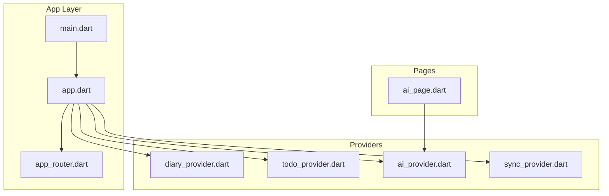
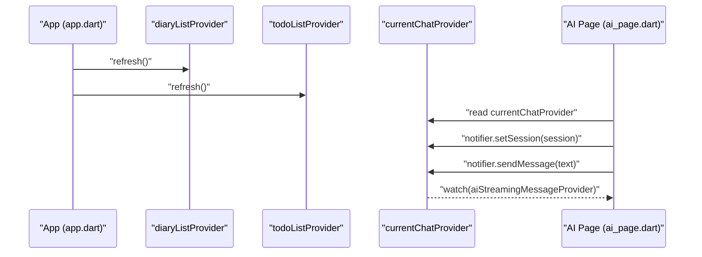
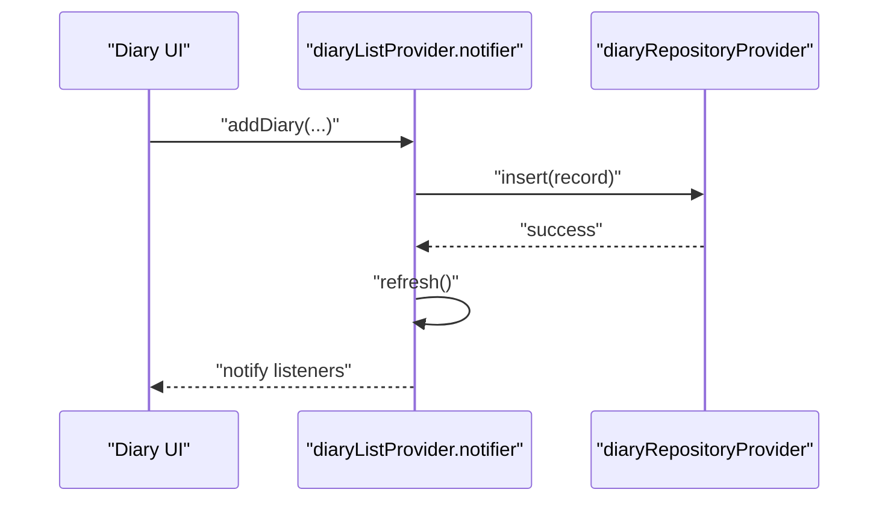
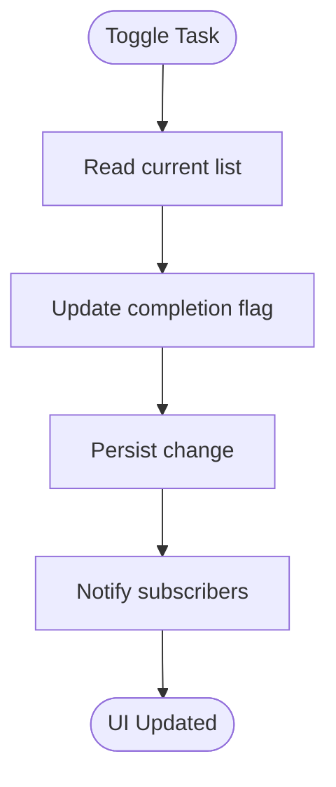
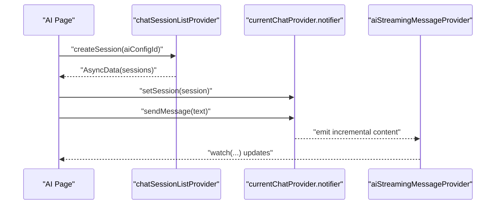
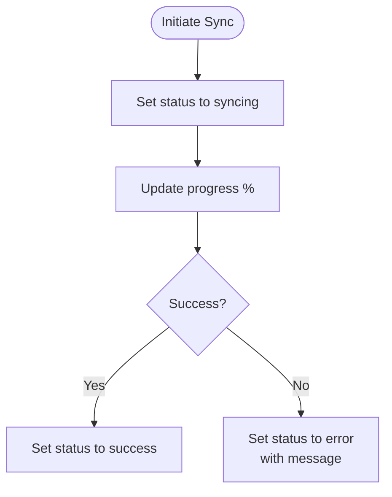
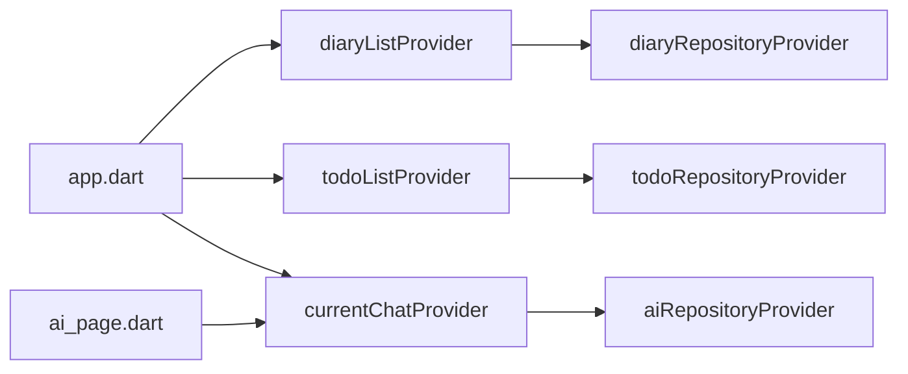

# Provider APIs

<cite>
**Referenced Files in This Document**
- [diary_provider.dart](file://lib/providers/diary_provider.dart)
- [ai_provider.dart](file://lib/providers/ai_provider.dart)
- [todo_provider.dart](file://lib/providers/todo_provider.dart)
- [sync_provider.dart](file://lib/providers/sync_provider.dart)
- [app.dart](file://lib/app.dart)
- [main.dart](file://lib/main.dart)
- [app_router.dart](file://lib/core/router/app_router.dart)
- [ai_page.dart](file://lib/pages/ai_page.dart)
- [AGENTS.md](file://AGENTS.md)
</cite>

## Table of Contents
1. [Introduction](#introduction)
2. [Project Structure](#project-structure)
3. [Core Components](#core-components)
4. [Architecture Overview](#architecture-overview)
5. [Detailed Component Analysis](#detailed-component-analysis)
6. [Dependency Analysis](#dependency-analysis)
7. [Performance Considerations](#performance-considerations)
8. [Troubleshooting Guide](#troubleshooting-guide)
9. [Conclusion](#conclusion)

## Introduction
This document describes the Riverpod provider APIs used by QNote Flutter for state management. It covers:
- Diary provider for managing diary entries (list, creation, editing, deletion)
- Todo provider for task management, completion tracking, and filtering
- AI provider for chat sessions, streaming content, and context export
- Sync provider for cloud synchronization status, progress, and error reporting
It also explains provider constructors, state getters/setters, reactive updates, lifecycle, memory management, and performance optimization techniques.

## Project Structure
QNote organizes providers under the lib/providers directory and integrates them via Consumer widgets and Riverpod’s ref.read/ref.watch. Providers are composed with repositories and services to manage asynchronous data and side effects.

**Diagram sources**
- [main.dart](file://lib/main.dart)
- [app.dart](file://lib/app.dart)
- [app_router.dart](file://lib/core/router/app_router.dart)
- [diary_provider.dart](file://lib/providers/diary_provider.dart)
- [todo_provider.dart](file://lib/providers/todo_provider.dart)
- [ai_provider.dart](file://lib/providers/ai_provider.dart)
- [sync_provider.dart](file://lib/providers/sync_provider.dart)
- [ai_page.dart](file://lib/pages/ai_page.dart)

**Section sources**
- [main.dart](file://lib/main.dart)
- [app.dart](file://lib/app.dart)
- [app_router.dart](file://lib/core/router/app_router.dart)

## Core Components
This section summarizes the primary provider APIs and their responsibilities.

- Diary provider
  - Manages a list of diary entries and exposes operations to add, update, delete, and refresh entries.
  - Uses a repository abstraction for persistence and triggers UI widget updates after changes.

- Todo provider
  - Handles tasks with completion toggles and filtering (all/completed/pending).
  - Supports refreshing and reactive UI updates.

- AI provider
  - Manages chat sessions and current session state.
  - Provides streaming message state and context export functionality.
  - Exposes creation, update, and deletion of chat sessions.

- Sync provider
  - Tracks synchronization status, progress, and errors for cloud sync operations.
  - Integrates with the sync scheduler and WebDAV service.

**Section sources**
- [diary_provider.dart](file://lib/providers/diary_provider.dart)
- [todo_provider.dart](file://lib/providers/todo_provider.dart)
- [ai_provider.dart](file://lib/providers/ai_provider.dart)
- [sync_provider.dart](file://lib/providers/sync_provider.dart)

## Architecture Overview
The app initializes providers at the root and consumes them in pages and widgets. Providers use repositories/services for data access and trigger reactive updates through Riverpod’s watch/read model.

**Diagram sources**
- [app.dart](file://lib/app.dart)
- [ai_page.dart](file://lib/pages/ai_page.dart)
- [ai_provider.dart](file://lib/providers/ai_provider.dart)

## Detailed Component Analysis

### Diary Provider API
Responsibilities:
- Maintain and expose a list of diary entries
- Add new entries with metadata (title, content, mood, weather, tags, photos, time range)
- Update existing entries
- Delete entries
- Refresh the list and notify listeners

Key operations:
- addDiary(title, content, mood, weather, tags, folderId, time, startTime, endTime, displayTag, bodyState, tagEntries, photos)
- updateDiary(record)
- refresh()

Reactive usage:
- Pages and widgets watch the diary list provider to render updates automatically.
- After add/update/delete, the provider refreshes and updates home widgets.

**Diagram sources**
- [diary_provider.dart](file://lib/providers/diary_provider.dart)

**Section sources**
- [diary_provider.dart](file://lib/providers/diary_provider.dart)

### Todo Provider API
Responsibilities:
- Manage a list of tasks
- Toggle completion status
- Filter tasks (all/completed/pending)
- Refresh task list reactively

Key operations:
- refresh()
- toggle completion state
- apply filters

Reactive usage:
- Widgets watch the todo list provider to reflect changes instantly.

**Diagram sources**
- [todo_provider.dart](file://lib/providers/todo_provider.dart)

**Section sources**
- [todo_provider.dart](file://lib/providers/todo_provider.dart)

### AI Provider API
Responsibilities:
- Manage chat sessions (list, create, update, delete)
- Track current session state
- Stream AI-generated content incrementally
- Export contextual diary data for AI prompts

Key providers and notifiers:
- chatSessionListProvider (AsyncNotifierProvider)
- currentChatProvider (StateNotifierProvider)
- aiStreamingMessageProvider (StateProvider)

Notable operations:
- chatSessionListProvider.refresh()
- chatSessionListProvider.createSession(aiConfigId)
- chatSessionListProvider.updateSession(session)
- chatSessionListProvider.deleteSession(id)
- currentChatNotifier.setSession(session)
- currentChatNotifier.exportContext()

Reactive usage:
- Pages watch currentChatProvider and aiStreamingMessageProvider to render live updates.
- Listeners can subscribe to async session lists and scroll to bottom on new messages.

**Diagram sources**
- [ai_provider.dart](file://lib/providers/ai_provider.dart)
- [ai_page.dart](file://lib/pages/ai_page.dart)

**Section sources**
- [ai_provider.dart](file://lib/providers/ai_provider.dart)
- [ai_page.dart](file://lib/pages/ai_page.dart)

### Sync Provider API
Responsibilities:
- Track synchronization status (idle, syncing, success, error)
- Report progress percentage and error messages
- Coordinate with the sync scheduler and WebDAV service

Typical usage:
- Pages watch sync status to show progress and handle errors gracefully.
- Triggers can be initiated from actions like “Sync now” and observed reactively.

**Diagram sources**
- [sync_provider.dart](file://lib/providers/sync_provider.dart)

**Section sources**
- [sync_provider.dart](file://lib/providers/sync_provider.dart)

## Dependency Analysis
Provider dependencies and composition:
- Providers depend on repositories/services for data access.
- Pages consume providers via ref.watch and ref.read.
- Some providers are initialized at app startup and refreshed during app lifecycle.

**Diagram sources**
- [app.dart](file://lib/app.dart)
- [ai_page.dart](file://lib/pages/ai_page.dart)
- [diary_provider.dart](file://lib/providers/diary_provider.dart)
- [ai_provider.dart](file://lib/providers/ai_provider.dart)

**Section sources**
- [app.dart](file://lib/app.dart)
- [ai_page.dart](file://lib/pages/ai_page.dart)

## Performance Considerations
- Prefer AsyncNotifierProvider for asynchronous data to avoid redundant fetches and to leverage caching semantics.
- Use ref.invalidate or notifier.refresh to propagate updates after mutations.
- Keep a single provider per concern; derive computed state via Provider composition.
- Avoid heavy work on hot paths; defer to background threads and update state via providers.
- Minimize unnecessary rebuilds by watching only the required slices of state.

**Section sources**
- [AGENTS.md](file://AGENTS.md)

## Troubleshooting Guide
Common issues and resolutions:
- Asynchronous loading states: Use AsyncValue patterns to handle loading, data, and error states in UI.
- Streaming updates: Subscribe to aiStreamingMessageProvider to render incremental content.
- Session changes: Listen to currentChatProvider to update UI on session switches or new messages.
- Sync failures: Observe sync provider status and display user-friendly error messages.

**Section sources**
- [ai_page.dart](file://lib/pages/ai_page.dart)
- [ai_provider.dart](file://lib/providers/ai_provider.dart)
- [sync_provider.dart](file://lib/providers/sync_provider.dart)

## Conclusion
QNote’s Riverpod providers encapsulate state management for diaries, todos, AI chat sessions, and cloud sync. They follow reactive patterns with clear separation of concerns, enabling efficient UI updates and maintainable code. Adhering to the documented usage patterns ensures robust, scalable state management across the application.