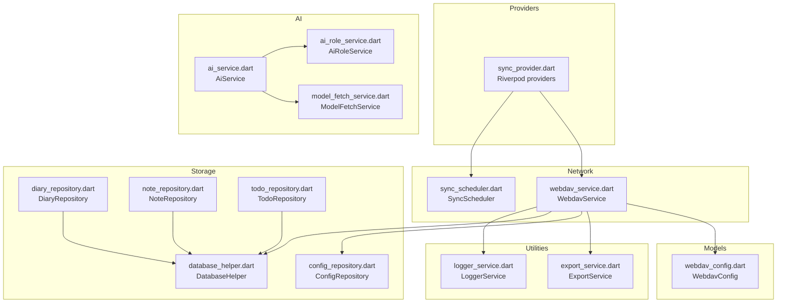
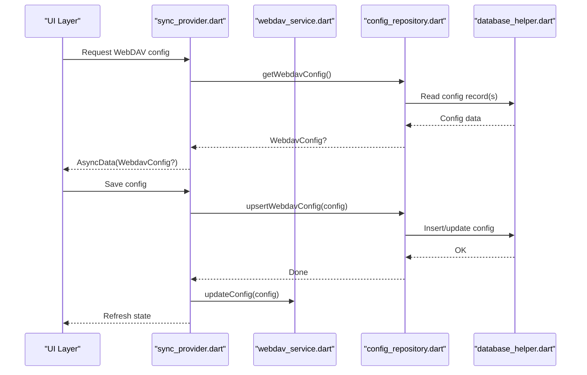
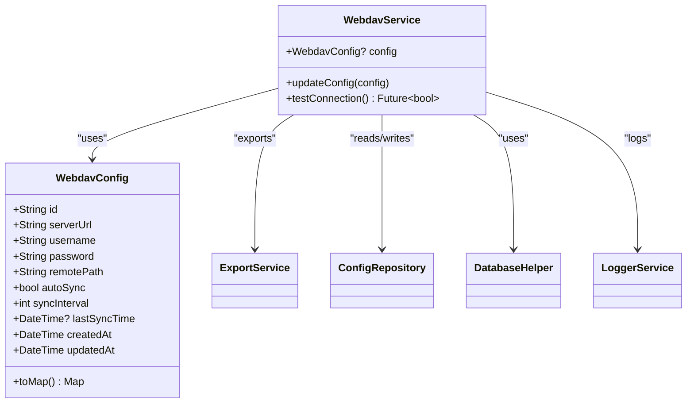
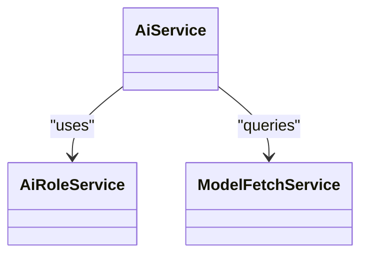
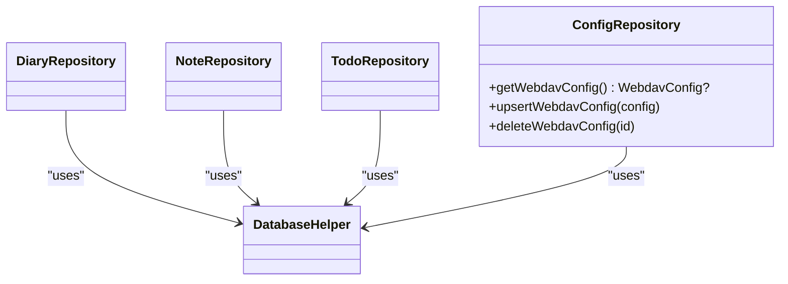
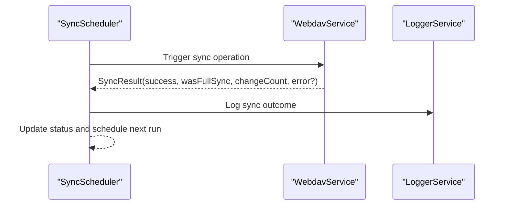
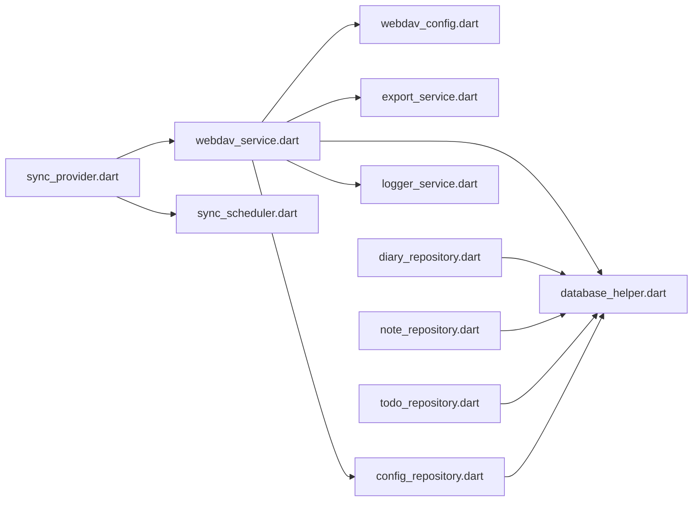

# Service APIs

<cite>
**Referenced Files in This Document**
- [webdav_service.dart](file://lib/core/network/webdav_service.dart)
- [webdav_config.dart](file://lib/models/webdav_config.dart)
- [sync_provider.dart](file://lib/providers/sync_provider.dart)
- [sync_scheduler.dart](file://lib/core/network/sync_scheduler.dart)
- [ai_service.dart](file://lib/core/ai/ai_service.dart)
- [ai_role_service.dart](file://lib/core/ai/ai_role_service.dart)
- [model_fetch_service.dart](file://lib/core/ai/model_fetch_service.dart)
- [diary_repository.dart](file://lib/core/storage/diary_repository.dart)
- [note_repository.dart](file://lib/core/storage/note_repository.dart)
- [todo_repository.dart](file://lib/core/storage/todo_repository.dart)
- [config_repository.dart](file://lib/core/storage/config_repository.dart)
- [database_helper.dart](file://lib/core/storage/database_helper.dart)
- [export_service.dart](file://lib/core/export/export_service.dart)
- [logger_service.dart](file://lib/core/logger/logger_service.dart)
</cite>

## Table of Contents
1. [Introduction](#introduction)
2. [Project Structure](#project-structure)
3. [Core Components](#core-components)
4. [Architecture Overview](#architecture-overview)
5. [Detailed Component Analysis](#detailed-component-analysis)
6. [Dependency Analysis](#dependency-analysis)
7. [Performance Considerations](#performance-considerations)
8. [Troubleshooting Guide](#troubleshooting-guide)
9. [Conclusion](#conclusion)

## Introduction
This document provides comprehensive API documentation for QNote Flutter’s service layer interfaces. It covers:
- AI service APIs for content generation, summarization, and role-based interactions
- WebDAV synchronization APIs including authentication, file operations, conflict resolution, and sync scheduling
- Storage repository interfaces for diary, note, and todo operations with CRUD methods, query parameters, and transaction handling
- Method signatures, parameter types, return values, and exception handling
- Usage examples for service initialization, invocation patterns, and error handling
- Service lifecycle management, dependency injection via Riverpod, and integration with the provider layer

## Project Structure
The service layer is organized by domain:
- Network: WebDAV synchronization and scheduler
- AI: Content generation, roles, and model fetching
- Storage: Repositories for diary, note, todo, and configuration
- Providers: Riverpod-based dependency injection and reactive state for WebDAV configuration and service access
- Export and logging: Utilities supporting export and network logging

**Diagram sources**
- [sync_provider.dart:1-43](file://lib/providers/sync_provider.dart#L1-L43)
- [webdav_service.dart:1-95](file://lib/core/network/webdav_service.dart#L1-L95)
- [sync_scheduler.dart](file://lib/core/network/sync_scheduler.dart)
- [ai_service.dart](file://lib/core/ai/ai_service.dart)
- [ai_role_service.dart](file://lib/core/ai/ai_role_service.dart)
- [model_fetch_service.dart](file://lib/core/ai/model_fetch_service.dart)
- [diary_repository.dart](file://lib/core/storage/diary_repository.dart)
- [note_repository.dart](file://lib/core/storage/note_repository.dart)
- [todo_repository.dart](file://lib/core/storage/todo_repository.dart)
- [config_repository.dart](file://lib/core/storage/config_repository.dart)
- [database_helper.dart](file://lib/core/storage/database_helper.dart)
- [export_service.dart](file://lib/core/export/export_service.dart)
- [logger_service.dart](file://lib/core/logger/logger_service.dart)
- [webdav_config.dart:1-39](file://lib/models/webdav_config.dart#L1-L39)

**Section sources**
- [sync_provider.dart:1-43](file://lib/providers/sync_provider.dart#L1-L43)
- [webdav_service.dart:1-95](file://lib/core/network/webdav_service.dart#L1-L95)
- [webdav_config.dart:1-39](file://lib/models/webdav_config.dart#L1-L39)

## Core Components
This section summarizes the primary service interfaces and their responsibilities.

- WebDAV Service
  - Singleton service managing connection, authentication, and synchronization operations
  - Provides configuration updates, connection testing, and synchronization orchestration
- AI Services
  - AiService orchestrates content generation and summarization
  - AiRoleService manages role-based interactions
  - ModelFetchService handles model metadata and availability
- Storage Repositories
  - DiaryRepository, NoteRepository, TodoRepository: CRUD and query operations
  - ConfigRepository: persistent configuration management
  - DatabaseHelper: low-level database operations and transactions
- Providers
  - Riverpod-based accessors for WebDAV service and reactive configuration state
- Export and Logging
  - ExportService: exports local data snapshots and deltas
  - LoggerService: structured network and operational logs

**Section sources**
- [webdav_service.dart:1-95](file://lib/core/network/webdav_service.dart#L1-L95)
- [ai_service.dart](file://lib/core/ai/ai_service.dart)
- [ai_role_service.dart](file://lib/core/ai/ai_role_service.dart)
- [model_fetch_service.dart](file://lib/core/ai/model_fetch_service.dart)
- [diary_repository.dart](file://lib/core/storage/diary_repository.dart)
- [note_repository.dart](file://lib/core/storage/note_repository.dart)
- [todo_repository.dart](file://lib/core/storage/todo_repository.dart)
- [config_repository.dart](file://lib/core/storage/config_repository.dart)
- [database_helper.dart](file://lib/core/storage/database_helper.dart)
- [export_service.dart](file://lib/core/export/export_service.dart)
- [logger_service.dart](file://lib/core/logger/logger_service.dart)

## Architecture Overview
The service layer follows a layered architecture:
- Provider layer exposes Riverpod providers for DI and reactive state
- Service layer encapsulates business logic and external integrations
- Repository layer abstracts persistence and database operations
- Models define configuration and data contracts

**Diagram sources**
- [sync_provider.dart:13-43](file://lib/providers/sync_provider.dart#L13-L43)
- [config_repository.dart](file://lib/core/storage/config_repository.dart)
- [database_helper.dart](file://lib/core/storage/database_helper.dart)
- [webdav_service.dart:50-77](file://lib/core/network/webdav_service.dart#L50-L77)

## Detailed Component Analysis

### WebDAV Synchronization Service
The WebDAV service is a singleton responsible for:
- Authentication and base URL normalization
- Connection testing via PROPFIND
- Synchronization orchestration using manifest, snapshot, and delta files
- Integration with export and logging utilities

Key APIs and behaviors:
- updateConfig(WebdavConfig): Normalizes server URL and remote path, sets base URL and Basic Authorization header, updates internal configuration
- testConnection(): Issues a PROPFIND request to the configured remote path and logs success/failure
- Internal constants: manifest, snapshot, delta filenames and max delta count
- Dependencies: ExportService, ConfigRepository, DatabaseHelper, LoggerService

**Diagram sources**
- [webdav_service.dart:13-95](file://lib/core/network/webdav_service.dart#L13-L95)
- [webdav_config.dart:1-39](file://lib/models/webdav_config.dart#L1-L39)
- [export_service.dart](file://lib/core/export/export_service.dart)
- [config_repository.dart](file://lib/core/storage/config_repository.dart)
- [database_helper.dart](file://lib/core/storage/database_helper.dart)
- [logger_service.dart](file://lib/core/logger/logger_service.dart)

Usage examples:
- Initialize and configure:
  - Retrieve current WebDAV config via provider
  - Save new configuration using provider notifier
  - Call service.updateConfig(config) internally after persisting
- Test connectivity:
  - Use provider notifier.testConnection() to validate credentials and remote path
- Synchronize:
  - Trigger scheduled or manual sync via SyncScheduler and WebdavService

Exceptions and error handling:
- testConnection() returns false if no config is set
- Logs are emitted with appropriate levels for success and failure
- Network timeouts configured via Dio BaseOptions

**Section sources**
- [webdav_service.dart:50-95](file://lib/core/network/webdav_service.dart#L50-L95)
- [webdav_config.dart:1-39](file://lib/models/webdav_config.dart#L1-L39)
- [sync_provider.dart:39-42](file://lib/providers/sync_provider.dart#L39-L42)
- [logger_service.dart](file://lib/core/logger/logger_service.dart)

### AI Service APIs
The AI service layer provides:
- AiService: orchestrates content generation and summarization tasks
- AiRoleService: manages role-based interactions and prompts
- ModelFetchService: retrieves model metadata and availability

Behavior highlights:
- Role-based workflows: AiRoleService coordinates role selection and prompt composition
- Model discovery: ModelFetchService supports model availability checks
- Integration: AiService consumes role and model services to produce AI-driven content

**Diagram sources**
- [ai_service.dart](file://lib/core/ai/ai_service.dart)
- [ai_role_service.dart](file://lib/core/ai/ai_role_service.dart)
- [model_fetch_service.dart](file://lib/core/ai/model_fetch_service.dart)

Usage examples:
- Initialize AI services via dependency injection
- Compose role-based prompts using AiRoleService
- Execute content generation via AiService
- Handle model availability via ModelFetchService

**Section sources**
- [ai_service.dart](file://lib/core/ai/ai_service.dart)
- [ai_role_service.dart](file://lib/core/ai/ai_role_service.dart)
- [model_fetch_service.dart](file://lib/core/ai/model_fetch_service.dart)

### Storage Repository Interfaces
Repositories abstract persistence and expose CRUD and query methods. They rely on DatabaseHelper for transactions and SQL operations.

- DiaryRepository
  - Responsibilities: CRUD operations for diary records
  - Query parameters: filters by date range, tags, and content keywords
  - Transaction handling: uses DatabaseHelper for atomic operations
- NoteRepository
  - Responsibilities: CRUD operations for notes
  - Query parameters: filters by creation/update timestamps, tags, and content
  - Transaction handling: uses DatabaseHelper for atomic operations
- TodoRepository
  - Responsibilities: CRUD operations for todos
  - Query parameters: filters by completion status, due dates, and tags
  - Transaction handling: uses DatabaseHelper for atomic operations
- ConfigRepository
  - Responsibilities: persistent storage of WebDAV configuration and related settings
  - Methods: getWebdavConfig(), upsertWebdavConfig(config), deleteWebdavConfig(id)
- DatabaseHelper
  - Responsibilities: low-level database operations, migrations, and transaction control

**Diagram sources**
- [diary_repository.dart](file://lib/core/storage/diary_repository.dart)
- [note_repository.dart](file://lib/core/storage/note_repository.dart)
- [todo_repository.dart](file://lib/core/storage/todo_repository.dart)
- [config_repository.dart](file://lib/core/storage/config_repository.dart)
- [database_helper.dart](file://lib/core/storage/database_helper.dart)

Usage examples:
- Initialize repositories with a shared DatabaseHelper instance
- Perform CRUD operations with query parameters tailored to each entity
- Wrap batch operations in transactions using DatabaseHelper.begin()/commit()

**Section sources**
- [diary_repository.dart](file://lib/core/storage/diary_repository.dart)
- [note_repository.dart](file://lib/core/storage/note_repository.dart)
- [todo_repository.dart](file://lib/core/storage/todo_repository.dart)
- [config_repository.dart](file://lib/core/storage/config_repository.dart)
- [database_helper.dart](file://lib/core/storage/database_helper.dart)

### Sync Scheduler
The SyncScheduler coordinates periodic synchronization tasks. It integrates with WebdavService and maintains sync status.

Key responsibilities:
- Schedule and execute sync jobs
- Track sync status and outcomes
- Coordinate with WebdavService for actual sync operations

**Diagram sources**
- [sync_scheduler.dart](file://lib/core/network/sync_scheduler.dart)
- [webdav_service.dart:13-27](file://lib/core/network/webdav_service.dart#L13-L27)
- [logger_service.dart](file://lib/core/logger/logger_service.dart)

**Section sources**
- [sync_scheduler.dart](file://lib/core/network/sync_scheduler.dart)
- [webdav_service.dart:13-27](file://lib/core/network/webdav_service.dart#L13-L27)

## Dependency Analysis
The service layer exhibits clean separation of concerns with explicit dependencies:
- Providers depend on services and repositories for state management
- Services depend on models, export utilities, and logging
- Repositories depend on DatabaseHelper for persistence
- AI services are loosely coupled and can be extended independently

**Diagram sources**
- [sync_provider.dart:1-43](file://lib/providers/sync_provider.dart#L1-L43)
- [webdav_service.dart:1-95](file://lib/core/network/webdav_service.dart#L1-L95)
- [webdav_config.dart:1-39](file://lib/models/webdav_config.dart#L1-L39)
- [export_service.dart](file://lib/core/export/export_service.dart)
- [config_repository.dart](file://lib/core/storage/config_repository.dart)
- [database_helper.dart](file://lib/core/storage/database_helper.dart)
- [diary_repository.dart](file://lib/core/storage/diary_repository.dart)
- [note_repository.dart](file://lib/core/storage/note_repository.dart)
- [todo_repository.dart](file://lib/core/storage/todo_repository.dart)
- [logger_service.dart](file://lib/core/logger/logger_service.dart)

**Section sources**
- [sync_provider.dart:1-43](file://lib/providers/sync_provider.dart#L1-L43)
- [webdav_service.dart:1-95](file://lib/core/network/webdav_service.dart#L1-L95)

## Performance Considerations
- WebDAV timeouts: Dio BaseOptions specify connect, send, and receive timeouts to prevent blocking operations
- Delta-based sync: Limit number of delta files to reduce overhead during incremental sync
- Batch operations: Use DatabaseHelper transactions to minimize write amplification
- Reactive providers: Use Riverpod’s async notifiers to avoid unnecessary rebuilds and to cache results

## Troubleshooting Guide
Common issues and resolutions:
- Authentication failures:
  - Verify WebDAVConfig credentials and remote path
  - Use provider notifier.testConnection() to validate
- Sync errors:
  - Inspect SyncResult for error details
  - Review logs emitted by LoggerService
- Configuration persistence:
  - Ensure ConfigRepository.upsertWebdavConfig() succeeds before calling WebdavService.updateConfig()
- Connectivity:
  - Normalize server URL and remote path in WebdavService.updateConfig()
  - Confirm PROPFIND response status indicates success

**Section sources**
- [webdav_service.dart:50-95](file://lib/core/network/webdav_service.dart#L50-L95)
- [sync_provider.dart:39-42](file://lib/providers/sync_provider.dart#L39-L42)
- [logger_service.dart](file://lib/core/logger/logger_service.dart)

## Conclusion
QNote Flutter’s service layer provides a robust foundation for AI-driven content and WebDAV synchronization, backed by well-defined repositories and reactive providers. The documented APIs enable predictable initialization, invocation, and error handling, while Riverpod simplifies dependency injection and state management. Extending or integrating new services should adhere to existing patterns for consistency and maintainability.