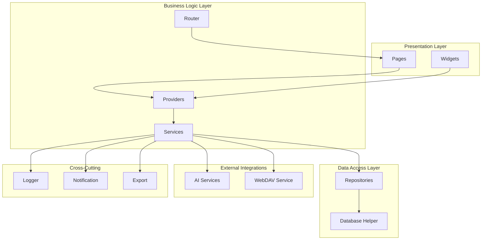
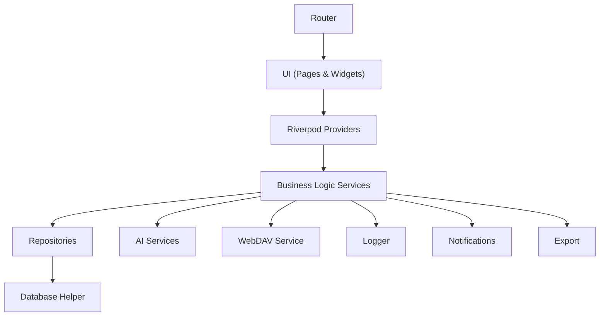
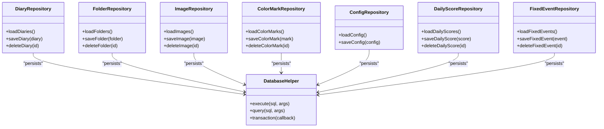
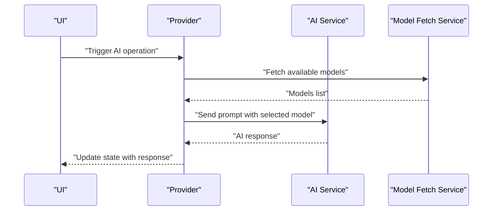
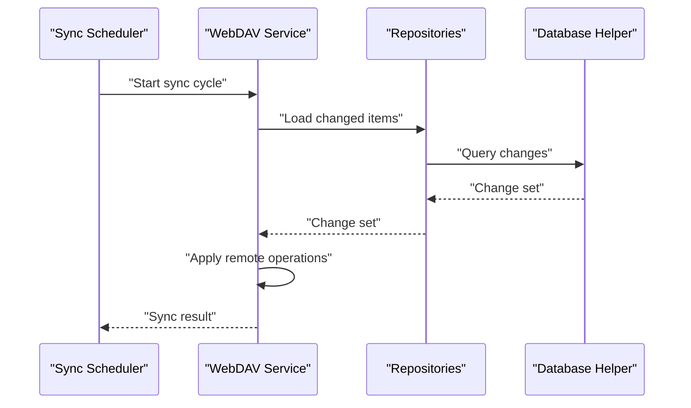
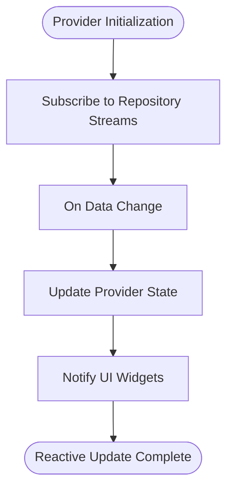
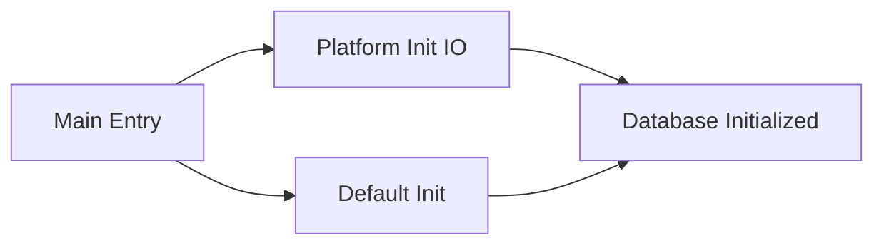
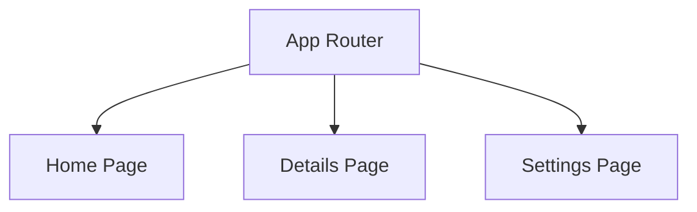
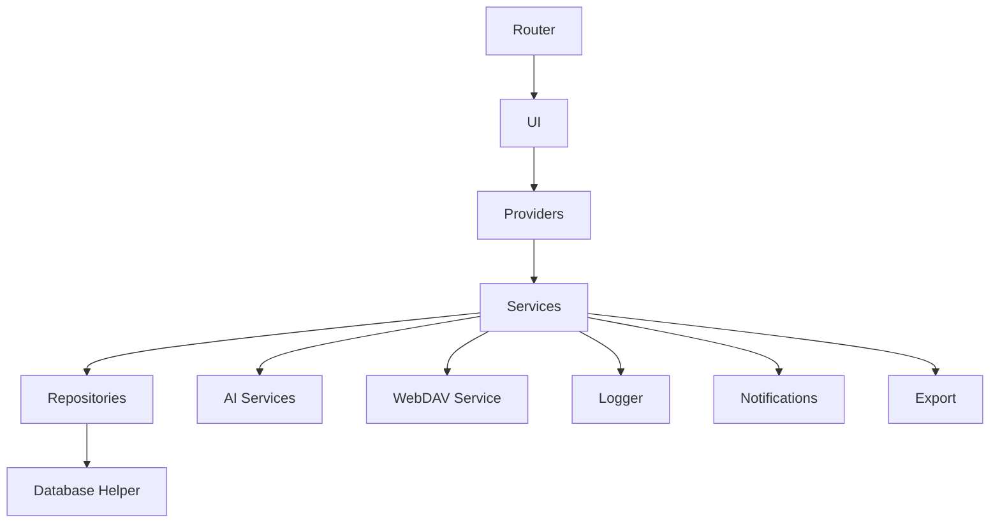

# Architecture Overview

<cite>
**Referenced Files in This Document**
- [main.dart](file://lib/main.dart)
- [app.dart](file://lib/app.dart)
- [database_init.dart](file://lib/database_init.dart)
- [database_init_io.dart](file://lib/database_init_io.dart)
- [ai_service.dart](file://lib/core/ai/ai_service.dart)
- [model_fetch_service.dart](file://lib/core/ai/model_fetch_service.dart)
- [webdav_service.dart](file://lib/core/network/webdav_service.dart)
- [sync_scheduler.dart](file://lib/core/network/sync_scheduler.dart)
- [diary_repository.dart](file://lib/core/storage/diary_repository.dart)
- [folder_repository.dart](file://lib/core/storage/folder_repository.dart)
- [image_repository.dart](file://lib/core/storage/image_repository.dart)
- [database_helper.dart](file://lib/core/storage/database_helper.dart)
- [color_mark_repository.dart](file://lib/core/storage/color_mark_repository.dart)
- [config_repository.dart](file://lib/core/storage/config_repository.dart)
- [daily_score_repository.dart](file://lib/core/storage/daily_score_repository.dart)
- [fixed_event_repository.dart](file://lib/core/storage/fixed_event_repository.dart)
- [notification_service.dart](file://lib/core/notification/notification_service.dart)
- [logger_service.dart](file://lib/core/logger/logger_service.dart)
- [app_router.dart](file://lib/core/router/app_router.dart)
- [export_service.dart](file://lib/core/export/export_service.dart)
</cite>

## Table of Contents
1. [Introduction](#introduction)
2. [Project Structure](#project-structure)
3. [Core Components](#core-components)
4. [Architecture Overview](#architecture-overview)
5. [Detailed Component Analysis](#detailed-component-analysis)
6. [Dependency Analysis](#dependency-analysis)
7. [Performance Considerations](#performance-considerations)
8. [Troubleshooting Guide](#troubleshooting-guide)
9. [Conclusion](#conclusion)

## Introduction
This document presents the architectural design of QNote Flutter, focusing on a clean architecture implementation with a repository pattern, layered architecture, and Riverpod-based state management. The system separates concerns across presentation, business logic, data access, and external integrations (AI services and WebDAV). It also documents cross-cutting concerns such as dependency injection, error handling, and reactive updates, along with the technical decisions and trade-offs that shape the current design.

## Project Structure
QNote Flutter organizes code into distinct layers and domains:
- Presentation Layer: Pages and Widgets for UI composition
- Business Logic Layer: Services and Providers for orchestration
- Data Access Layer: Repositories backed by a local database helper
- External Integrations: AI services and WebDAV synchronization
- Cross-Cutting Services: Logging, notifications, export, routing

**Diagram sources**
- [main.dart](file://lib/main.dart)
- [app.dart](file://lib/app.dart)
- [database_init.dart](file://lib/database_init.dart)
- [database_init_io.dart](file://lib/database_init_io.dart)
- [ai_service.dart](file://lib/core/ai/ai_service.dart)
- [webdav_service.dart](file://lib/core/network/webdav_service.dart)
- [diary_repository.dart](file://lib/core/storage/diary_repository.dart)
- [database_helper.dart](file://lib/core/storage/database_helper.dart)
- [logger_service.dart](file://lib/core/logger/logger_service.dart)
- [notification_service.dart](file://lib/core/notification/notification_service.dart)
- [export_service.dart](file://lib/core/export/export_service.dart)
- [app_router.dart](file://lib/core/router/app_router.dart)

**Section sources**
- [main.dart](file://lib/main.dart)
- [app.dart](file://lib/app.dart)

## Core Components
This section outlines the primary building blocks of the architecture and their responsibilities:
- Presentation Layer: Pages and Widgets render UI and delegate actions to providers
- Business Logic Layer: Services encapsulate domain workflows; Providers manage reactive state
- Data Access Layer: Repositories abstract persistence; Database helper handles storage
- External Integrations: AI services provide model fetching and role-based assistance; WebDAV synchronizes data with remote servers
- Cross-Cutting Services: Logger records events; Notification service manages alerts; Export service supports data export

Key implementation anchors:
- Entry points initialize the app and configure platform-specific database initialization
- AI services coordinate model retrieval and role-based prompting
- WebDAV service orchestrates synchronization with remote storage
- Repositories expose typed operations over the local database
- Router defines navigation and page composition

**Section sources**
- [main.dart](file://lib/main.dart)
- [database_init.dart](file://lib/database_init.dart)
- [database_init_io.dart](file://lib/database_init_io.dart)
- [ai_service.dart](file://lib/core/ai/ai_service.dart)
- [model_fetch_service.dart](file://lib/core/ai/model_fetch_service.dart)
- [webdav_service.dart](file://lib/core/network/webdav_service.dart)
- [sync_scheduler.dart](file://lib/core/network/sync_scheduler.dart)
- [diary_repository.dart](file://lib/core/storage/diary_repository.dart)
- [folder_repository.dart](file://lib/core/storage/folder_repository.dart)
- [image_repository.dart](file://lib/core/storage/image_repository.dart)
- [database_helper.dart](file://lib/core/storage/database_helper.dart)
- [color_mark_repository.dart](file://lib/core/storage/color_mark_repository.dart)
- [config_repository.dart](file://lib/core/storage/config_repository.dart)
- [daily_score_repository.dart](file://lib/core/storage/daily_score_repository.dart)
- [fixed_event_repository.dart](file://lib/core/storage/fixed_event_repository.dart)
- [notification_service.dart](file://lib/core/notification/notification_service.dart)
- [logger_service.dart](file://lib/core/logger/logger_service.dart)
- [app_router.dart](file://lib/core/router/app_router.dart)
- [export_service.dart](file://lib/core/export/export_service.dart)

## Architecture Overview
QNote Flutter follows a clean architecture with bounded contexts:
- Presentation Layer: Composed of pages and widgets that react to provider state
- Business Logic Layer: Services encapsulate workflows; providers expose reactive state to the UI
- Data Access Layer: Repositories define interfaces for domain operations; database helper implements persistence
- External Integrations: AI services and WebDAV integrate via dedicated services
- Cross-Cutting Concerns: Logging, notifications, export, and routing support all layers

**Diagram sources**
- [main.dart](file://lib/main.dart)
- [app.dart](file://lib/app.dart)
- [ai_service.dart](file://lib/core/ai/ai_service.dart)
- [webdav_service.dart](file://lib/core/network/webdav_service.dart)
- [diary_repository.dart](file://lib/core/storage/diary_repository.dart)
- [database_helper.dart](file://lib/core/storage/database_helper.dart)
- [logger_service.dart](file://lib/core/logger/logger_service.dart)
- [notification_service.dart](file://lib/core/notification/notification_service.dart)
- [export_service.dart](file://lib/core/export/export_service.dart)
- [app_router.dart](file://lib/core/router/app_router.dart)

## Detailed Component Analysis

### Clean Architecture and Repository Pattern
The repository pattern isolates domain logic from data sources. Each repository exposes domain-focused methods while delegating persistence to the database helper. This separation enables testing, maintainability, and platform abstraction.

**Diagram sources**
- [diary_repository.dart](file://lib/core/storage/diary_repository.dart)
- [folder_repository.dart](file://lib/core/storage/folder_repository.dart)
- [image_repository.dart](file://lib/core/storage/image_repository.dart)
- [color_mark_repository.dart](file://lib/core/storage/color_mark_repository.dart)
- [config_repository.dart](file://lib/core/storage/config_repository.dart)
- [daily_score_repository.dart](file://lib/core/storage/daily_score_repository.dart)
- [fixed_event_repository.dart](file://lib/core/storage/fixed_event_repository.dart)
- [database_helper.dart](file://lib/core/storage/database_helper.dart)

**Section sources**
- [diary_repository.dart](file://lib/core/storage/diary_repository.dart)
- [folder_repository.dart](file://lib/core/storage/folder_repository.dart)
- [image_repository.dart](file://lib/core/storage/image_repository.dart)
- [color_mark_repository.dart](file://lib/core/storage/color_mark_repository.dart)
- [config_repository.dart](file://lib/core/storage/config_repository.dart)
- [daily_score_repository.dart](file://lib/core/storage/daily_score_repository.dart)
- [fixed_event_repository.dart](file://lib/core/storage/fixed_event_repository.dart)
- [database_helper.dart](file://lib/core/storage/database_helper.dart)

### AI Services Integration
AI services provide model fetching and role-based assistance. Model fetch service retrieves available models, while AI service coordinates prompts and roles.

**Diagram sources**
- [ai_service.dart](file://lib/core/ai/ai_service.dart)
- [model_fetch_service.dart](file://lib/core/ai/model_fetch_service.dart)

**Section sources**
- [ai_service.dart](file://lib/core/ai/ai_service.dart)
- [model_fetch_service.dart](file://lib/core/ai/model_fetch_service.dart)

### WebDAV Synchronization
WebDAV service integrates remote synchronization with scheduling capabilities. Sync scheduler triggers periodic synchronization tasks.

**Diagram sources**
- [sync_scheduler.dart](file://lib/core/network/sync_scheduler.dart)
- [webdav_service.dart](file://lib/core/network/webdav_service.dart)
- [diary_repository.dart](file://lib/core/storage/diary_repository.dart)
- [database_helper.dart](file://lib/core/storage/database_helper.dart)

**Section sources**
- [sync_scheduler.dart](file://lib/core/network/sync_scheduler.dart)
- [webdav_service.dart](file://lib/core/network/webdav_service.dart)
- [diary_repository.dart](file://lib/core/storage/diary_repository.dart)
- [database_helper.dart](file://lib/core/storage/database_helper.dart)

### Riverpod State Management
Riverpod providers manage application state reactively. Providers subscribe to repositories and expose state updates to pages and widgets. This decouples UI from data sources and simplifies testing.

[No sources needed since this diagram shows conceptual workflow, not actual code structure]

### Platform-Specific Initialization
Platform-specific database initialization ensures correct setup for mobile/desktop environments.

**Diagram sources**
- [main.dart](file://lib/main.dart)
- [database_init.dart](file://lib/database_init.dart)
- [database_init_io.dart](file://lib/database_init_io.dart)

**Section sources**
- [main.dart](file://lib/main.dart)
- [database_init.dart](file://lib/database_init.dart)
- [database_init_io.dart](file://lib/database_init_io.dart)

### Router and Navigation
The router composes pages and manages navigation across the application.

**Diagram sources**
- [app_router.dart](file://lib/core/router/app_router.dart)

**Section sources**
- [app_router.dart](file://lib/core/router/app_router.dart)

## Dependency Analysis
Dependencies flow from presentation to business logic, then to data access and external integrations. Repositories depend on the database helper, while services depend on repositories and external services. Cross-cutting services are consumed by business logic.

**Diagram sources**
- [main.dart](file://lib/main.dart)
- [app.dart](file://lib/app.dart)
- [ai_service.dart](file://lib/core/ai/ai_service.dart)
- [webdav_service.dart](file://lib/core/network/webdav_service.dart)
- [diary_repository.dart](file://lib/core/storage/diary_repository.dart)
- [database_helper.dart](file://lib/core/storage/database_helper.dart)
- [logger_service.dart](file://lib/core/logger/logger_service.dart)
- [notification_service.dart](file://lib/core/notification/notification_service.dart)
- [export_service.dart](file://lib/core/export/export_service.dart)
- [app_router.dart](file://lib/core/router/app_router.dart)

**Section sources**
- [main.dart](file://lib/main.dart)
- [app.dart](file://lib/app.dart)

## Performance Considerations
- Reactive Updates: Riverpod providers update UI efficiently on state changes, minimizing unnecessary rebuilds
- Repository Abstraction: Centralized persistence logic reduces duplication and improves testability
- External Integrations: AI and WebDAV calls should be batched and debounced to avoid excessive network usage
- Database Transactions: Use transactions for bulk operations to reduce I/O overhead
- Logging Overhead: Keep logs at appropriate levels to avoid impacting UI responsiveness

[No sources needed since this section provides general guidance]

## Troubleshooting Guide
Common issues and resolutions:
- Synchronization Failures: Verify WebDAV credentials and network connectivity; check sync scheduler logs
- Repository Errors: Confirm database helper initialization and transaction boundaries
- AI Service Failures: Validate model availability and role configurations
- State Not Updating: Ensure providers are subscribed to repository streams and state is properly exposed to UI
- Platform Initialization: Confirm platform-specific database initialization runs before repository usage

**Section sources**
- [webdav_service.dart](file://lib/core/network/webdav_service.dart)
- [sync_scheduler.dart](file://lib/core/network/sync_scheduler.dart)
- [database_helper.dart](file://lib/core/storage/database_helper.dart)
- [ai_service.dart](file://lib/core/ai/ai_service.dart)
- [logger_service.dart](file://lib/core/logger/logger_service.dart)

## Conclusion
QNote Flutter employs a clean architecture with a repository pattern, layered design, and Riverpod state management. The separation of concerns across presentation, business logic, data access, and external integrations yields a maintainable and testable system. Cross-cutting services support robust logging, notifications, and export capabilities. The architecture balances modularity with practicality, enabling scalable enhancements while preserving performance and reliability.