# Component Interactions and Communication

<cite>
**Referenced Files in This Document**
- [main.dart](file://lib/main.dart)
- [app.dart](file://lib/app.dart)
- [database_init.dart](file://lib/database_init.dart)
- [database_init_io.dart](file://lib/database_init_io.dart)
- [app_router.dart](file://lib/core/router/app_router.dart)
- [notification_service.dart](file://lib/core/notification/notification_service.dart)
- [logger_service.dart](file://lib/core/logger/logger_service.dart)
- [webdav_service.dart](file://lib/core/network/webdav_service.dart)
- [sync_scheduler.dart](file://lib/core/network/sync_scheduler.dart)
- [diary_repository.dart](file://lib/core/storage/diary_repository.dart)
- [database_helper.dart](file://lib/core/storage/database_helper.dart)
- [ai_service.dart](file://lib/core/ai/ai_service.dart)
- [ai_role_service.dart](file://lib/core/ai/ai_role_service.dart)
- [model_fetch_service.dart](file://lib/core/ai/model_fetch_service.dart)
- [export_service.dart](file://lib/core/export/export_service.dart)
- [diary_provider.dart](file://lib/providers/diary_provider.dart)
- [diary_page.dart](file://lib/pages/diary_page.dart)
- [diary_item.dart](file://lib/widgets/diary/diary_item.dart)
- [animated_gradient_border.dart](file://lib/widgets/animated_gradient_border.dart)
- [diary_batch_manage_view.dart](file://lib/widgets/diary/diary_batch_manage_view.dart)
- [diary_editor_view.dart](file://lib/widgets/diary/diary_editor_view.dart)
</cite>

## Update Summary
**Changes Made**
- Added documentation for enhanced user interaction patterns in diary components
- Documented animated tag selection behavior with AnimatedContainer transitions
- Added documentation for smooth transition effects between collapsed and expanded states
- Included AnimatedGradientBorder widget for enhanced visual feedback
- Updated component interaction patterns to reflect improved user experience

## Table of Contents
1. [Introduction](#introduction)
2. [Project Structure](#project-structure)
3. [Core Components](#core-components)
4. [Architecture Overview](#architecture-overview)
5. [Enhanced User Interaction Patterns](#enhanced-user-interaction-patterns)
6. [Detailed Component Analysis](#detailed-component-analysis)
7. [Animation and Transition Systems](#animation-and-transition-systems)
8. [Dependency Analysis](#dependency-analysis)
9. [Performance Considerations](#performance-considerations)
10. [Troubleshooting Guide](#troubleshooting-guide)
11. [Conclusion](#conclusion)

## Introduction
This document explains how components interact and communicate in QNote Flutter. It focuses on the interaction patterns between pages and providers, provider-to-repository communication, service coordination for business logic, event-driven reactive updates, and end-to-end data flow from user input to persistence. It also covers dependency injection patterns, error propagation, cancellation handling, and asynchronous operation management across component boundaries. Recent enhancements include improved user interaction patterns with animated tag selection behavior and smooth transition effects.

## Project Structure
QNote Flutter organizes functionality by domain capabilities under the lib/core directory, with supporting infrastructure in lib/config, lib/widgets, and lib/core. The application bootstraps through lib/main.dart and initializes platform-specific database layers via lib/database_init.dart and lib/database_init_io.dart. Routing is centralized in lib/core/router/app_router.dart, while notification and logging services are available globally. Diary components now feature enhanced user interaction patterns with animation support.

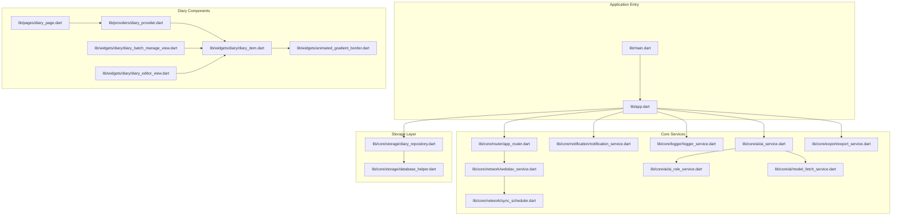

**Diagram sources**
- [main.dart](file://lib/main.dart)
- [app.dart](file://lib/app.dart)
- [app_router.dart](file://lib/core/router/app_router.dart)
- [webdav_service.dart](file://lib/core/network/webdav_service.dart)
- [sync_scheduler.dart](file://lib/core/network/sync_scheduler.dart)
- [notification_service.dart](file://lib/core/notification/notification_service.dart)
- [logger_service.dart](file://lib/core/logger/logger_service.dart)
- [ai_service.dart](file://lib/core/ai/ai_service.dart)
- [ai_role_service.dart](file://lib/core/ai/ai_role_service.dart)
- [model_fetch_service.dart](file://lib/core/ai/model_fetch_service.dart)
- [export_service.dart](file://lib/core/export/export_service.dart)
- [database_helper.dart](file://lib/core/storage/database_helper.dart)
- [diary_repository.dart](file://lib/core/storage/diary_repository.dart)
- [diary_page.dart](file://lib/pages/diary_page.dart)
- [diary_provider.dart](file://lib/providers/diary_provider.dart)
- [diary_item.dart](file://lib/widgets/diary/diary_item.dart)
- [animated_gradient_border.dart](file://lib/widgets/animated_gradient_border.dart)
- [diary_batch_manage_view.dart](file://lib/widgets/diary/diary_batch_manage_view.dart)
- [diary_editor_view.dart](file://lib/widgets/diary/diary_editor_view.dart)

**Section sources**
- [main.dart](file://lib/main.dart)
- [app.dart](file://lib/app.dart)
- [database_init.dart](file://lib/database_init.dart)
- [database_init_io.dart](file://lib/database_init_io.dart)

## Core Components
- Application bootstrap and initialization: lib/main.dart sets up the environment and delegates to lib/app.dart for app construction. Platform-specific database initialization is handled by lib/database_init.dart and lib/database_init_io.dart.
- Routing: lib/core/router/app_router.dart centralizes navigation and route handling.
- Network synchronization: lib/core/network/webdav_service.dart and lib/core/network/sync_scheduler.dart coordinate remote synchronization tasks.
- Notifications and logging: lib/core/notification/notification_service.dart and lib/core/logger/logger_service.dart provide cross-cutting concerns for user feedback and diagnostics.
- AI services: lib/core/ai/ai_service.dart orchestrates AI-related operations, with supporting services for roles and model fetching.
- Export: lib/core/export/export_service.dart handles export workflows.
- Storage: lib/core/storage/diary_repository.dart abstracts data access, backed by lib/core/storage/database_helper.dart.
- **Enhanced Diary Components**: New animated components including AnimatedGradientBorder for visual feedback and enhanced tag selection behavior.

**Section sources**
- [main.dart](file://lib/main.dart)
- [app.dart](file://lib/app.dart)
- [app_router.dart](file://lib/core/router/app_router.dart)
- [webdav_service.dart](file://lib/core/network/webdav_service.dart)
- [sync_scheduler.dart](file://lib/core/network/sync_scheduler.dart)
- [notification_service.dart](file://lib/core/notification/notification_service.dart)
- [logger_service.dart](file://lib/core/logger/logger_service.dart)
- [ai_service.dart](file://lib/core/ai/ai_service.dart)
- [ai_role_service.dart](file://lib/core/ai/ai_role_service.dart)
- [model_fetch_service.dart](file://lib/core/ai/model_fetch_service.dart)
- [export_service.dart](file://lib/core/export/export_service.dart)
- [diary_repository.dart](file://lib/core/storage/diary_repository.dart)
- [database_helper.dart](file://lib/core/storage/database_helper.dart)
- [animated_gradient_border.dart](file://lib/widgets/animated_gradient_border.dart)

## Architecture Overview
QNote follows a layered architecture:
- Presentation layer: Pages and widgets consume reactive state from providers and dispatch actions to services. Enhanced with animated transitions and smooth state changes.
- Domain services: Business logic is encapsulated in services such as WebDAV synchronization, AI processing, and export.
- Data access: Repositories abstract storage operations, delegating to a database helper for persistence.
- Cross-cutting services: Notification and logging services support the entire stack.
- **Enhanced UI Layer**: New animated components provide visual feedback and smooth transitions for user interactions.

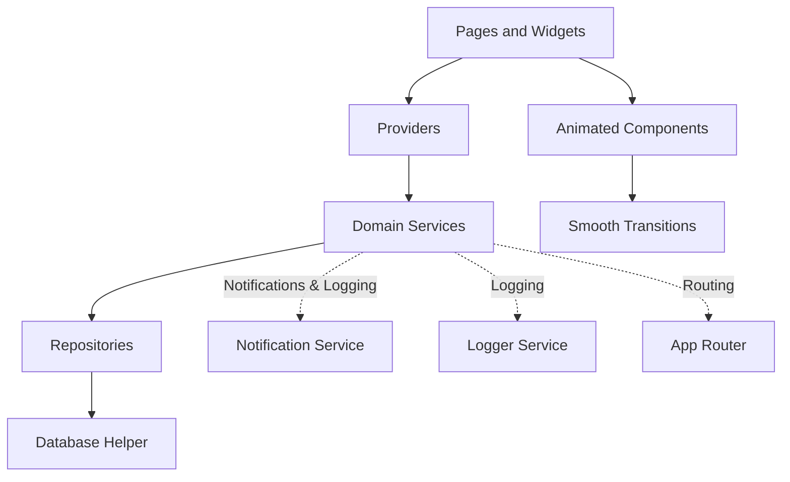

[No sources needed since this diagram shows conceptual architecture, not a direct code mapping]

## Enhanced User Interaction Patterns

### Animated Tag Selection Behavior
Recent enhancements include smooth animated tag selection with visual feedback. The system now uses AnimatedContainer widgets with 200ms duration for seamless state transitions when users select or deselect tags.

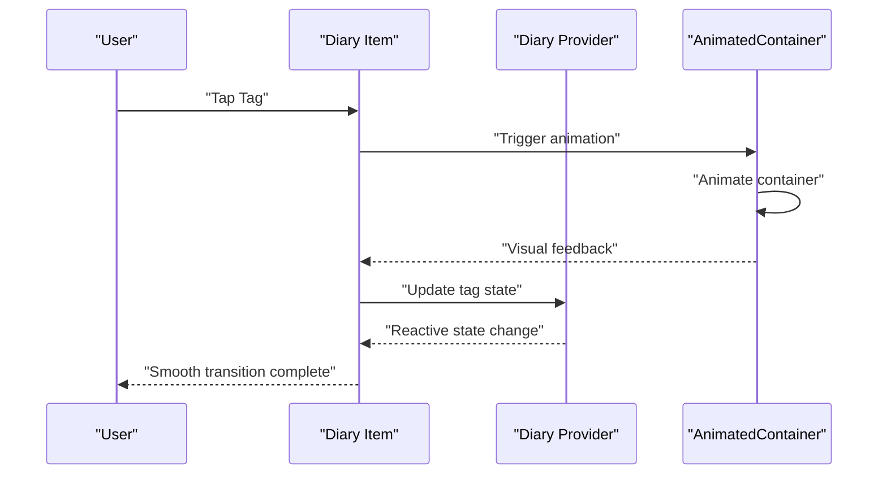

**Diagram sources**
- [diary_item.dart](file://lib/widgets/diary/diary_item.dart)
- [diary_batch_manage_view.dart](file://lib/widgets/diary/diary_batch_manage_view.dart)
- [diary_editor_view.dart](file://lib/widgets/diary/diary_editor_view.dart)

### Smooth Transition Effects Between States
The system implements smooth transitions between collapsed and expanded states using AnimatedBuilder patterns. These transitions provide better user experience during content expansion and collapse operations.

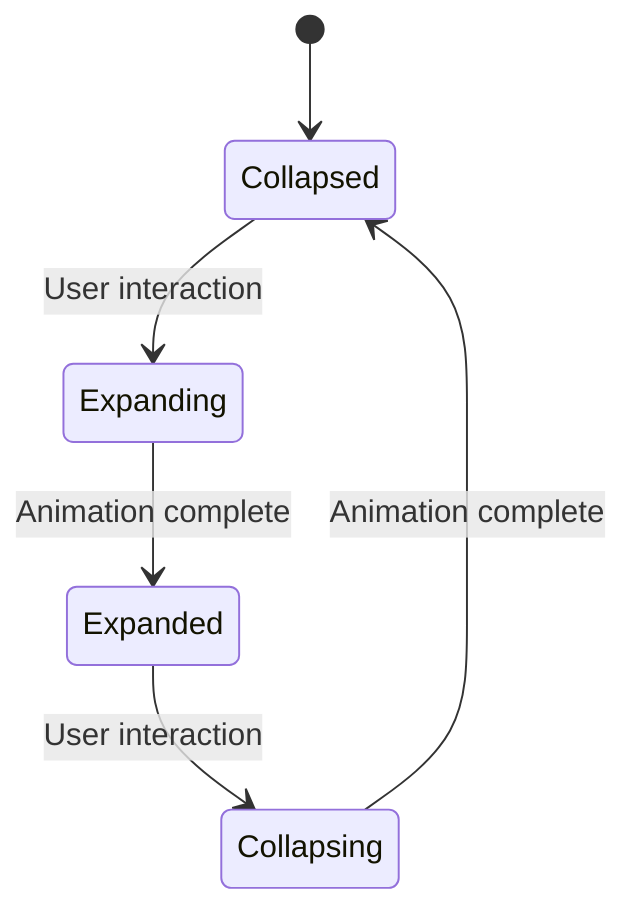

**Diagram sources**
- [diary_item.dart](file://lib/widgets/diary/diary_item.dart)
- [diary_page.dart](file://lib/pages/diary_page.dart)

### Enhanced Visual Feedback System
The AnimatedGradientBorder widget provides dynamic visual feedback for AI processing states and other important operations. This creates a more engaging user experience with flowing gradient animations.

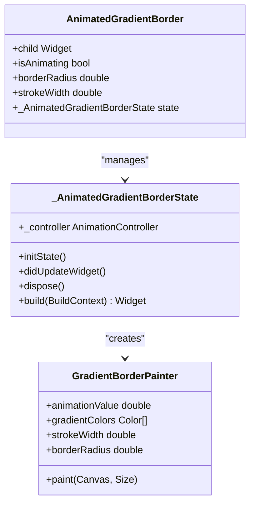

**Diagram sources**
- [animated_gradient_border.dart](file://lib/widgets/animated_gradient_border.dart)

**Section sources**
- [diary_item.dart](file://lib/widgets/diary/diary_item.dart)
- [diary_batch_manage_view.dart](file://lib/widgets/diary/diary_batch_manage_view.dart)
- [diary_editor_view.dart](file://lib/widgets/diary/diary_editor_view.dart)
- [animated_gradient_border.dart](file://lib/widgets/animated_gradient_border.dart)
- [diary_page.dart](file://lib/pages/diary_page.dart)

## Detailed Component Analysis

### Page-to-Provider Interaction Pattern
Pages trigger user actions that update provider state. Providers own reactive state and delegate business operations to services. This pattern ensures UI remains responsive and state updates propagate reactively.

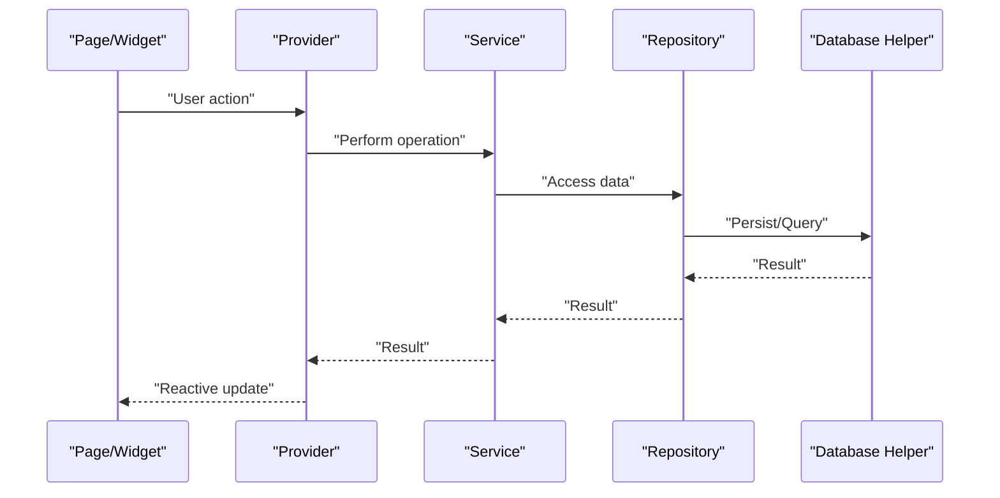

[No sources needed since this diagram shows conceptual interaction pattern]

### Provider-to-Repository Communication
Repositories encapsulate data operations and expose typed APIs to providers. They rely on a database helper for low-level persistence, ensuring separation of concerns and testability.

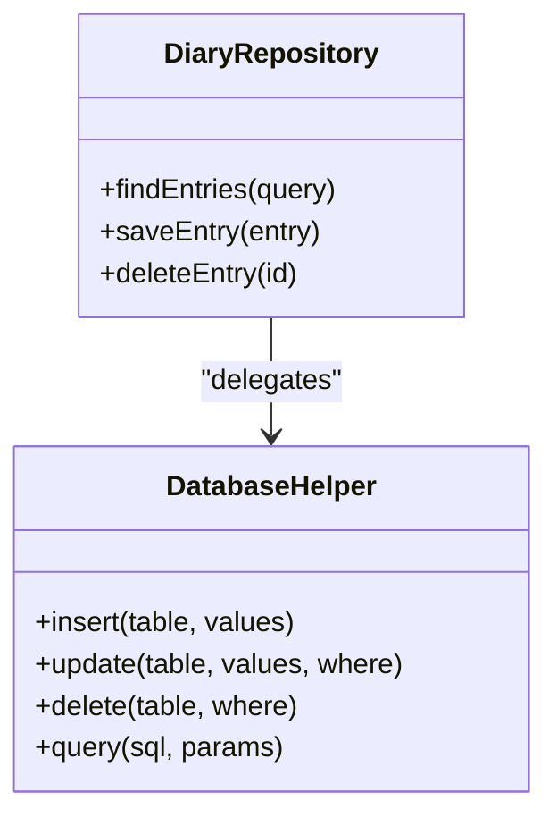

**Diagram sources**
- [diary_repository.dart](file://lib/core/storage/diary_repository.dart)
- [database_helper.dart](file://lib/core/storage/database_helper.dart)

### Service Coordination for Business Logic
Services coordinate complex workflows, such as AI processing, export operations, and network synchronization. They depend on repositories for data and on cross-cutting services for notifications and logging.

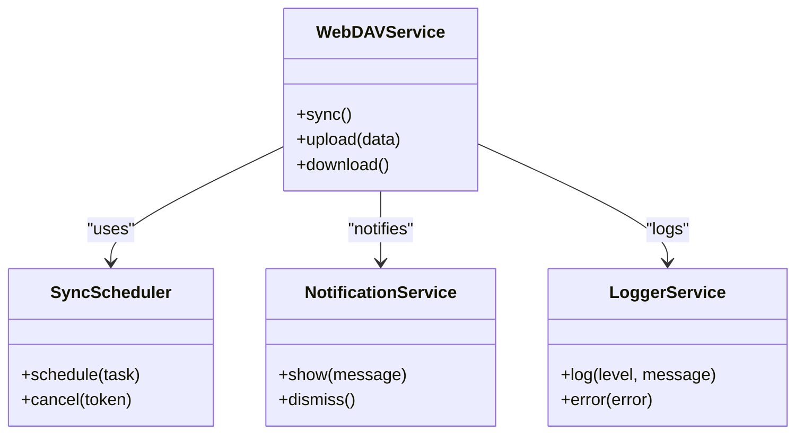

**Diagram sources**
- [webdav_service.dart](file://lib/core/network/webdav_service.dart)
- [sync_scheduler.dart](file://lib/core/network/sync_scheduler.dart)
- [notification_service.dart](file://lib/core/notification/notification_service.dart)
- [logger_service.dart](file://lib/core/logger/logger_service.dart)

### Event-Driven Reactive Updates
Reactive updates occur when providers receive results from services and repositories. Pages rebuild based on provider state changes, enabling declarative UI updates without manual DOM manipulation.

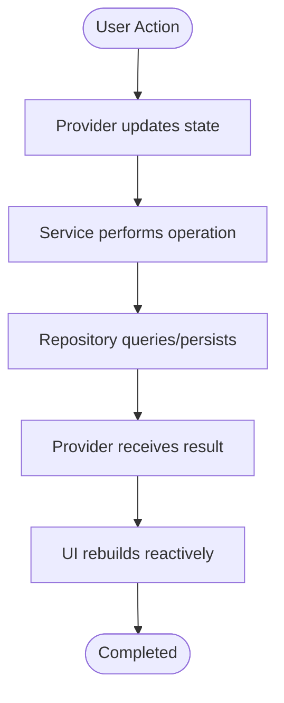

[No sources needed since this diagram shows conceptual reactive flow]

### Data Flow: From Input to Persistence
End-to-end data flow from user input to database persistence involves pages, providers, repositories, and the database helper.

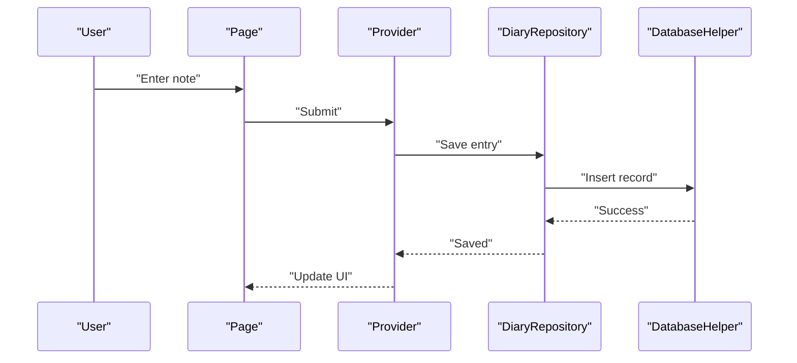

**Diagram sources**
- [diary_repository.dart](file://lib/core/storage/diary_repository.dart)
- [database_helper.dart](file://lib/core/storage/database_helper.dart)

### Dependency Injection Patterns
Dependency injection is achieved through constructor injection of services and repositories into higher-level components. This promotes testability and modularity.

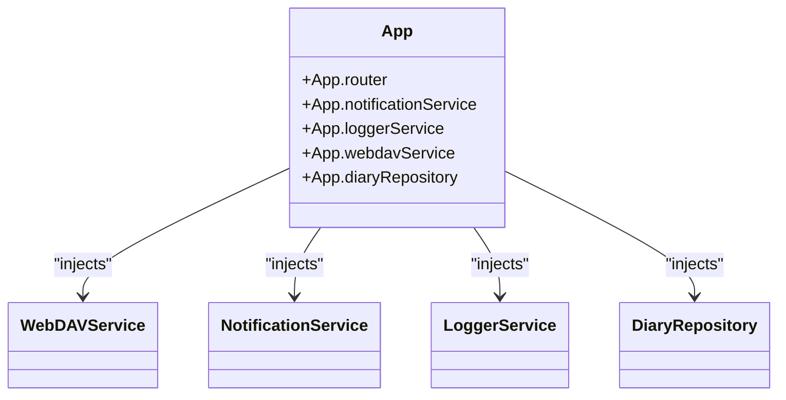

**Diagram sources**
- [app.dart](file://lib/app.dart)
- [webdav_service.dart](file://lib/core/network/webdav_service.dart)
- [notification_service.dart](file://lib/core/notification/notification_service.dart)
- [logger_service.dart](file://lib/core/logger/logger_service.dart)
- [diary_repository.dart](file://lib/core/storage/diary_repository.dart)

### Asynchronous Operations, Cancellation, and Error Propagation
Asynchronous operations are coordinated across components. Cancellation tokens enable cooperative cancellation, while error propagation ensures failures surface to UI through providers and notification/logging services.

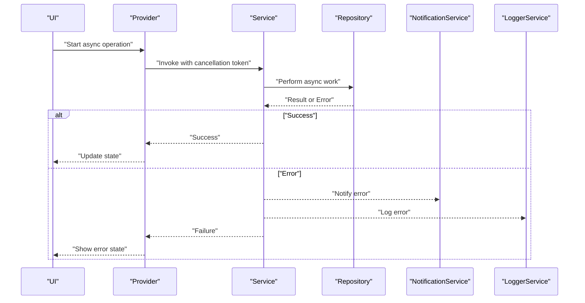

[No sources needed since this diagram shows conceptual async/cancellation/error flow]

## Animation and Transition Systems

### Animated Container Implementation
The system uses AnimatedContainer widgets for smooth state transitions in tag selection. These containers animate property changes over 200 milliseconds, providing immediate visual feedback to user interactions.

**Updated** Enhanced tag selection now includes AnimatedContainer with 200ms duration for seamless state transitions.

### AnimatedGradientBorder System
The AnimatedGradientBorder widget provides dynamic visual feedback through rotating gradient borders. It uses AnimationController with 3-second duration and supports both static and animated states.

**Updated** Added AnimatedGradientBorder for enhanced visual feedback during AI processing and other important operations.

### Timeline Height Management
The timeline system now includes sophisticated height management using TimelineItemWrapper with post-frame callbacks for accurate height reporting and smooth animations.

**Updated** Improved timeline item height management for better animation performance and accurate layout calculations.

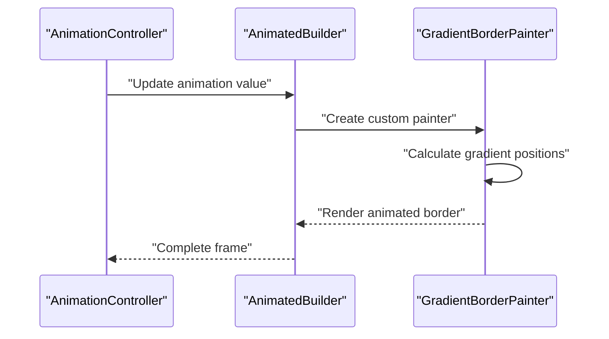

**Diagram sources**
- [animated_gradient_border.dart](file://lib/widgets/animated_gradient_border.dart)

**Section sources**
- [animated_gradient_border.dart](file://lib/widgets/animated_gradient_border.dart)
- [diary_item.dart](file://lib/widgets/diary/diary_item.dart)
- [diary_batch_manage_view.dart](file://lib/widgets/diary/diary_batch_manage_view.dart)
- [diary_page.dart](file://lib/pages/diary_page.dart)

## Dependency Analysis
The following diagram maps key dependencies among core components, highlighting how services, repositories, and helpers collaborate.

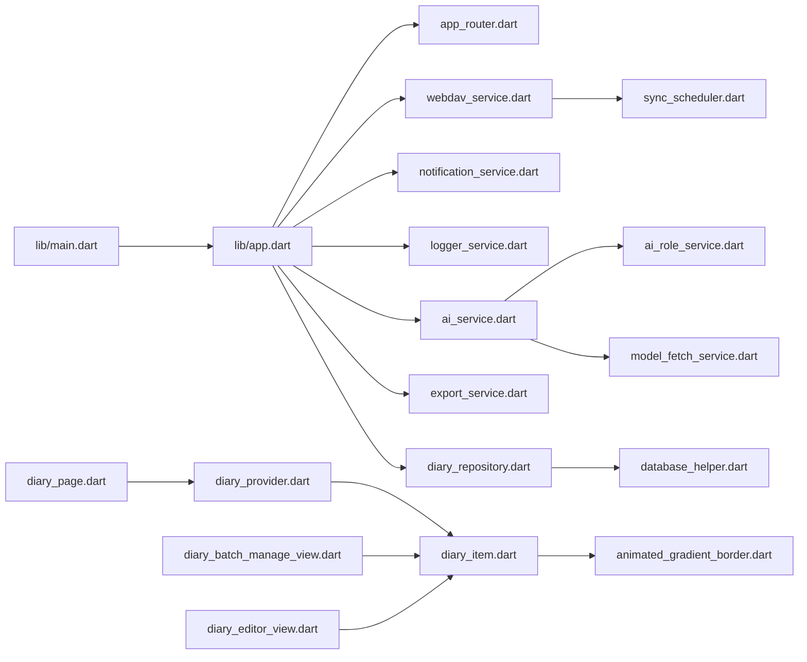

**Diagram sources**
- [main.dart](file://lib/main.dart)
- [app.dart](file://lib/app.dart)
- [app_router.dart](file://lib/core/router/app_router.dart)
- [webdav_service.dart](file://lib/core/network/webdav_service.dart)
- [sync_scheduler.dart](file://lib/core/network/sync_scheduler.dart)
- [notification_service.dart](file://lib/core/notification/notification_service.dart)
- [logger_service.dart](file://lib/core/logger/logger_service.dart)
- [ai_service.dart](file://lib/core/ai/ai_service.dart)
- [ai_role_service.dart](file://lib/core/ai/ai_role_service.dart)
- [model_fetch_service.dart](file://lib/core/ai/model_fetch_service.dart)
- [export_service.dart](file://lib/core/export/export_service.dart)
- [diary_repository.dart](file://lib/core/storage/diary_repository.dart)
- [database_helper.dart](file://lib/core/storage/database_helper.dart)
- [diary_page.dart](file://lib/pages/diary_page.dart)
- [diary_provider.dart](file://lib/providers/diary_provider.dart)
- [diary_item.dart](file://lib/widgets/diary/diary_item.dart)
- [animated_gradient_border.dart](file://lib/widgets/animated_gradient_border.dart)
- [diary_batch_manage_view.dart](file://lib/widgets/diary/diary_batch_manage_view.dart)
- [diary_editor_view.dart](file://lib/widgets/diary/diary_editor_view.dart)

**Section sources**
- [main.dart](file://lib/main.dart)
- [app.dart](file://lib/app.dart)
- [app_router.dart](file://lib/core/router/app_router.dart)
- [webdav_service.dart](file://lib/core/network/webdav_service.dart)
- [sync_scheduler.dart](file://lib/core/network/sync_scheduler.dart)
- [notification_service.dart](file://lib/core/notification/notification_service.dart)
- [logger_service.dart](file://lib/core/logger/logger_service.dart)
- [ai_service.dart](file://lib/core/ai/ai_service.dart)
- [ai_role_service.dart](file://lib/core/ai/ai_role_service.dart)
- [model_fetch_service.dart](file://lib/core/ai/model_fetch_service.dart)
- [export_service.dart](file://lib/core/export/export_service.dart)
- [diary_repository.dart](file://lib/core/storage/diary_repository.dart)
- [database_helper.dart](file://lib/core/storage/database_helper.dart)

## Performance Considerations
- Minimize unnecessary UI rebuilds by structuring provider state granularly and using efficient reactive patterns.
- Batch repository writes to reduce database overhead; leverage transaction-like operations where appropriate.
- Use cancellation tokens for long-running operations to avoid wasted work when UI navigates away.
- Cache frequently accessed data in providers to reduce repeated network or database calls.
- Offload heavy computations (e.g., AI processing) to background threads and avoid blocking the UI thread.
- **Optimize animations**: Use appropriate animation durations and consider performance impact of complex gradient animations.
- **Memory management**: Dispose of AnimationControllers properly in stateful widgets to prevent memory leaks.
- **Animation throttling**: Consider reducing animation complexity on lower-end devices for optimal performance.

[No sources needed since this section provides general guidance]

## Troubleshooting Guide
- Logging: Use the logger service to capture diagnostic messages and errors during development and production.
- Notifications: Surface actionable errors to users via the notification service when operations fail.
- Synchronization: Monitor sync scheduler tasks and handle retries gracefully; ensure cancellation tokens are respected.
- Repository failures: Wrap repository calls in try-catch blocks within providers to convert exceptions into UI-friendly states.
- Network issues: Implement retry logic and fallback strategies in webdav service for transient failures.
- **Animation issues**: Check AnimationController lifecycle and ensure proper disposal to prevent memory leaks.
- **Tag selection problems**: Verify AnimatedContainer duration settings and ensure state updates occur before animations complete.
- **Gradient border rendering**: Confirm gradient colors and stroke widths are properly configured for the current theme.

**Section sources**
- [logger_service.dart](file://lib/core/logger/logger_service.dart)
- [notification_service.dart](file://lib/core/notification/notification_service.dart)
- [sync_scheduler.dart](file://lib/core/network/sync_scheduler.dart)
- [webdav_service.dart](file://lib/core/network/webdav_service.dart)
- [animated_gradient_border.dart](file://lib/widgets/animated_gradient_border.dart)

## Conclusion
QNote Flutter employs a clean separation of concerns with providers owning reactive state, services coordinating business logic, and repositories abstracting data access. The system supports event-driven updates, robust error handling, and cooperative cancellation for asynchronous operations. Recent enhancements include improved user interaction patterns with animated tag selection behavior, smooth transition effects between collapsed and expanded states, and enhanced visual feedback through AnimatedGradientBorder widgets. By following the documented patterns and leveraging the provided services, developers can extend functionality reliably while maintaining performance and deliver engaging user experiences through thoughtful animation and transition systems.