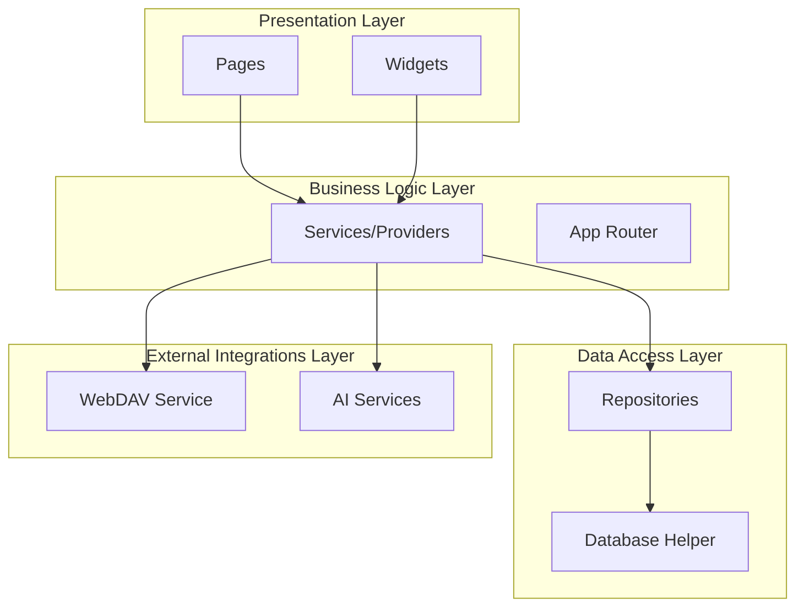
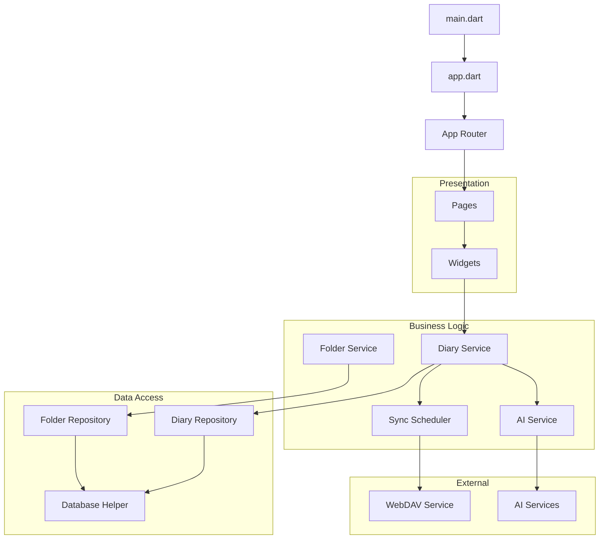
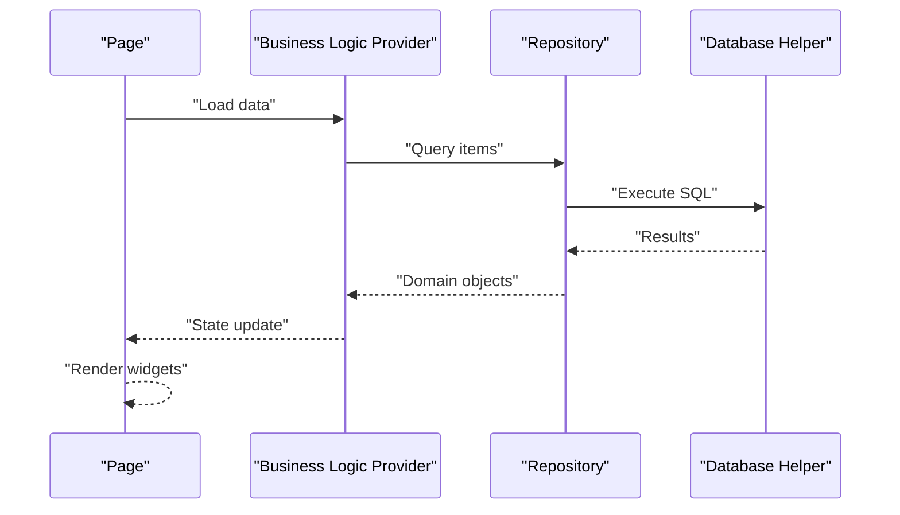
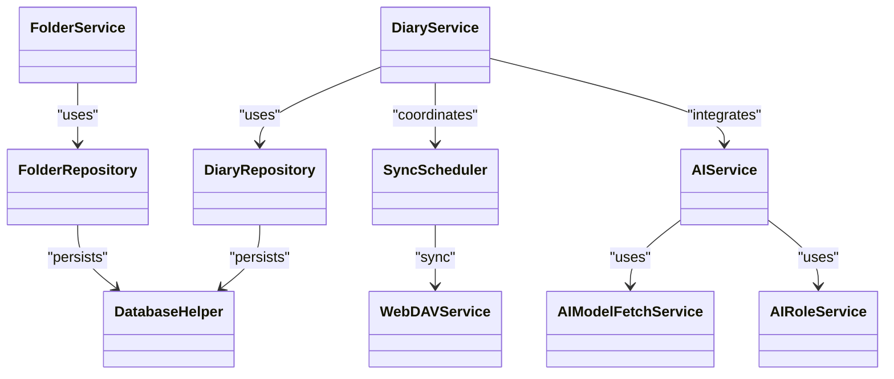
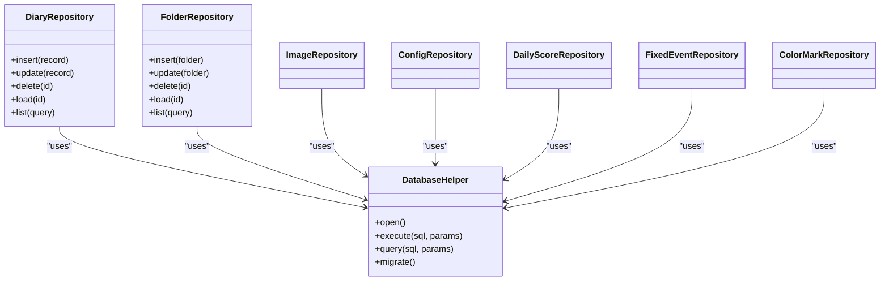
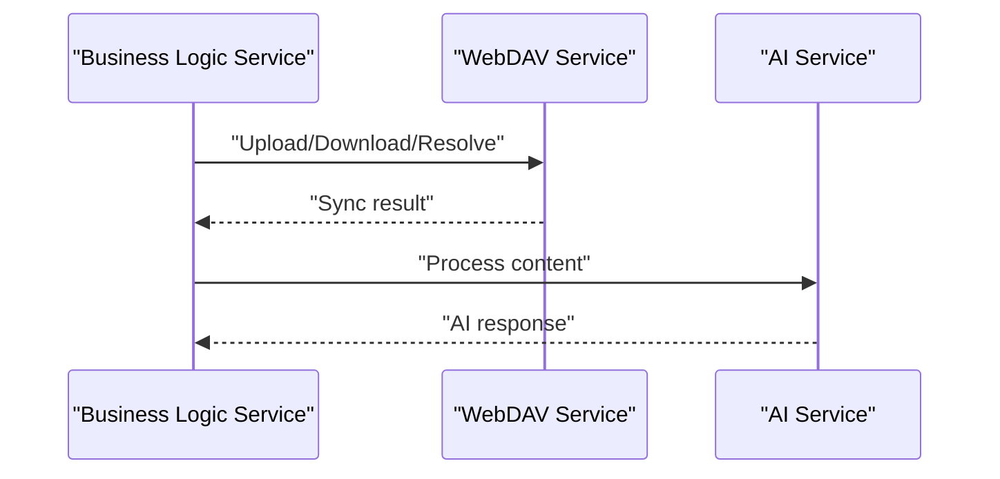
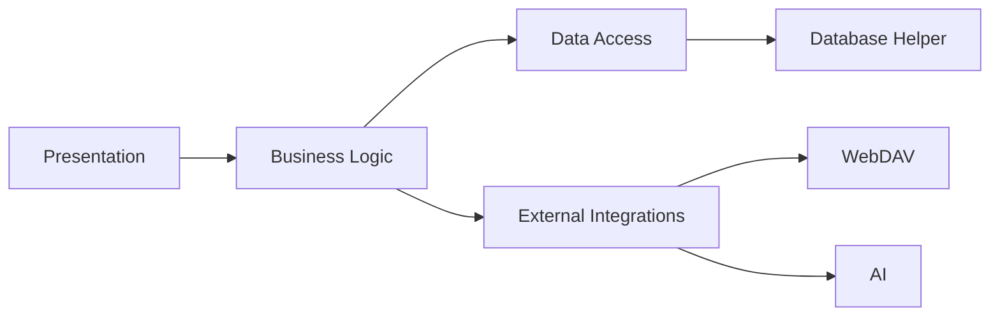

# Layered Architecture

<cite>
**Referenced Files in This Document**
- [main.dart](file://lib/main.dart)
- [app.dart](file://lib/app.dart)
- [app_router.dart](file://lib/core/router/app_router.dart)
- [webdav_service.dart](file://lib/core/network/webdav_service.dart)
- [sync_scheduler.dart](file://lib/core/network/sync_scheduler.dart)
- [ai_service.dart](file://lib/core/ai/ai_service.dart)
- [ai_role_service.dart](file://lib/core/ai/ai_role_service.dart)
- [model_fetch_service.dart](file://lib/core/ai/model_fetch_service.dart)
- [diary_repository.dart](file://lib/core/storage/diary_repository.dart)
- [database_helper.dart](file://lib/core/storage/database_helper.dart)
- [folder_repository.dart](file://lib/core/storage/folder_repository.dart)
- [image_repository.dart](file://lib/core/storage/image_repository.dart)
- [config_repository.dart](file://lib/core/storage/config_repository.dart)
- [daily_score_repository.dart](file://lib/core/storage/daily_score_repository.dart)
- [fixed_event_repository.dart](file://lib/core/storage/fixed_event_repository.dart)
- [color_mark_repository.dart](file://lib/core/storage/color_mark_repository.dart)
- [export_service.dart](file://lib/core/export/export_service.dart)
- [notification_service.dart](file://lib/core/notification/notification_service.dart)
- [logger_service.dart](file://lib/core/logger/logger_service.dart)
- [models.dart](file://lib/config/models.dart)
- [defaults.dart](file://lib/config/defaults.dart)
</cite>

## Table of Contents
1. [Introduction](#introduction)
2. [Project Structure](#project-structure)
3. [Core Components](#core-components)
4. [Architecture Overview](#architecture-overview)
5. [Detailed Component Analysis](#detailed-component-analysis)
6. [Dependency Analysis](#dependency-analysis)
7. [Performance Considerations](#performance-considerations)
8. [Troubleshooting Guide](#troubleshooting-guide)
9. [Conclusion](#conclusion)

## Introduction
This document explains QNote Flutter’s layered architecture, focusing on how the application separates concerns across four distinct layers:
- Presentation layer: UI rendering and user interaction via pages and widgets
- Business logic layer: Services and providers orchestrating workflows and rules
- Data access layer: Repositories and database helpers implementing the repository pattern
- External integrations layer: AI services and WebDAV for cloud synchronization

We describe component interactions, dependency flow, and maintain separation of concerns through clear layer boundaries and communication patterns.

## Project Structure
QNote Flutter organizes code by functional layers under lib/, with supporting directories:
- lib/pages: UI pages for navigation and screen composition
- lib/widgets: Reusable UI components
- lib/providers: Business logic providers/services
- lib/core: Cross-cutting concerns (AI, network, storage, router, export, notification, logger)
- lib/models: Domain models and configuration models
- lib/config: Application configuration and defaults

**Section sources**
- [main.dart](file://lib/main.dart)
- [app.dart](file://lib/app.dart)
- [app_router.dart](file://lib/core/router/app_router.dart)

## Core Components
This section introduces the primary building blocks per layer and their responsibilities.

- Presentation Layer
  - Pages: Screen-level UI compositions and navigation targets
  - Widgets: Reusable UI components used by pages
- Business Logic Layer
  - Services: Orchestrate workflows, integrate repositories, and coordinate external services
  - Providers: Stateful business logic providers (e.g., diary management, folder management)
- Data Access Layer
  - Repositories: Implement CRUD and domain-specific queries using a repository pattern
  - Database Helper: Encapsulate database operations and schema management
- External Integrations Layer
  - WebDAV Service: Cloud synchronization and remote storage operations
  - AI Services: LLM orchestration, role management, and model fetching

**Section sources**
- [diary_repository.dart](file://lib/core/storage/diary_repository.dart)
- [database_helper.dart](file://lib/core/storage/database_helper.dart)
- [webdav_service.dart](file://lib/core/network/webdav_service.dart)
- [ai_service.dart](file://lib/core/ai/ai_service.dart)
- [ai_role_service.dart](file://lib/core/ai/ai_role_service.dart)
- [model_fetch_service.dart](file://lib/core/ai/model_fetch_service.dart)

## Architecture Overview
The application initializes in main.dart, constructs the app shell in app.dart, and wires routing, services, and repositories. Business logic services depend on repositories for data access and on external services for cloud and AI capabilities. Presentation components consume services and providers to render UI and handle user interactions.

**Diagram sources**
- [main.dart](file://lib/main.dart)
- [app.dart](file://lib/app.dart)
- [app_router.dart](file://lib/core/router/app_router.dart)
- [diary_repository.dart](file://lib/core/storage/diary_repository.dart)
- [folder_repository.dart](file://lib/core/storage/folder_repository.dart)
- [database_helper.dart](file://lib/core/storage/database_helper.dart)
- [sync_scheduler.dart](file://lib/core/network/sync_scheduler.dart)
- [webdav_service.dart](file://lib/core/network/webdav_service.dart)
- [ai_service.dart](file://lib/core/ai/ai_service.dart)

## Detailed Component Analysis

### Presentation Layer: Pages and Widgets
- Pages: Screen-level compositions that declare routes and bind to business logic providers
- Widgets: Reusable UI components that receive data and callbacks from providers/services

Interaction pattern:
- Pages trigger provider/service methods to load/update data
- Providers expose reactive state and update UI via setState or streams
- Widgets render lists, forms, and controls using data from providers

**Diagram sources**
- [diary_repository.dart](file://lib/core/storage/diary_repository.dart)
- [database_helper.dart](file://lib/core/storage/database_helper.dart)

**Section sources**
- [app_router.dart](file://lib/core/router/app_router.dart)

### Business Logic Layer: Services and Providers
- Diary Service: Manages diary records, integrates with repositories and external services
- Folder Service: Manages folders and related metadata
- Sync Scheduler: Coordinates periodic synchronization with WebDAV
- AI Service: Orchestrates AI workflows and interacts with AI roles and model fetchers

Communication patterns:
- Services depend on repositories for persistence
- Services depend on WebDAV for cloud sync
- Services depend on AI services for content processing

**Diagram sources**
- [diary_repository.dart](file://lib/core/storage/diary_repository.dart)
- [folder_repository.dart](file://lib/core/storage/folder_repository.dart)
- [database_helper.dart](file://lib/core/storage/database_helper.dart)
- [sync_scheduler.dart](file://lib/core/network/sync_scheduler.dart)
- [webdav_service.dart](file://lib/core/network/webdav_service.dart)
- [ai_service.dart](file://lib/core/ai/ai_service.dart)
- [ai_role_service.dart](file://lib/core/ai/ai_role_service.dart)
- [model_fetch_service.dart](file://lib/core/ai/model_fetch_service.dart)

**Section sources**
- [sync_scheduler.dart](file://lib/core/network/sync_scheduler.dart)
- [webdav_service.dart](file://lib/core/network/webdav_service.dart)
- [ai_service.dart](file://lib/core/ai/ai_service.dart)
- [ai_role_service.dart](file://lib/core/ai/ai_role_service.dart)
- [model_fetch_service.dart](file://lib/core/ai/model_fetch_service.dart)

### Data Access Layer: Repositories and Database Helper
- Repository Pattern: Each domain entity has a dedicated repository exposing typed operations
- Database Helper: Centralizes SQL execution, migrations, and schema management

Key repositories:
- Diary Repository: CRUD and queries for diary records
- Folder Repository: CRUD and queries for folders
- Image Repository: Media-related operations
- Config Repository: Application configuration persistence
- Daily Score Repository: Metrics and scoring persistence
- Fixed Event Repository: Calendar/event persistence
- Color Mark Repository: Tagging and marking persistence

**Diagram sources**
- [database_helper.dart](file://lib/core/storage/database_helper.dart)
- [diary_repository.dart](file://lib/core/storage/diary_repository.dart)
- [folder_repository.dart](file://lib/core/storage/folder_repository.dart)
- [image_repository.dart](file://lib/core/storage/image_repository.dart)
- [config_repository.dart](file://lib/core/storage/config_repository.dart)
- [daily_score_repository.dart](file://lib/core/storage/daily_score_repository.dart)
- [fixed_event_repository.dart](file://lib/core/storage/fixed_event_repository.dart)
- [color_mark_repository.dart](file://lib/core/storage/color_mark_repository.dart)

**Section sources**
- [database_helper.dart](file://lib/core/storage/database_helper.dart)
- [diary_repository.dart](file://lib/core/storage/diary_repository.dart)
- [folder_repository.dart](file://lib/core/storage/folder_repository.dart)
- [image_repository.dart](file://lib/core/storage/image_repository.dart)
- [config_repository.dart](file://lib/core/storage/config_repository.dart)
- [daily_score_repository.dart](file://lib/core/storage/daily_score_repository.dart)
- [fixed_event_repository.dart](file://lib/core/storage/fixed_event_repository.dart)
- [color_mark_repository.dart](file://lib/core/storage/color_mark_repository.dart)

### External Integrations Layer: AI Services and WebDAV
- WebDAV Service: Provides upload/download, conflict resolution, and sync coordination
- AI Services: LLM orchestration, role management, and model availability checks

**Diagram sources**
- [webdav_service.dart](file://lib/core/network/webdav_service.dart)
- [ai_service.dart](file://lib/core/ai/ai_service.dart)

**Section sources**
- [webdav_service.dart](file://lib/core/network/webdav_service.dart)
- [ai_service.dart](file://lib/core/ai/ai_service.dart)
- [ai_role_service.dart](file://lib/core/ai/ai_role_service.dart)
- [model_fetch_service.dart](file://lib/core/ai/model_fetch_service.dart)

## Dependency Analysis
Layered dependency flow:
- Presentation depends on Business Logic
- Business Logic depends on Data Access and External Integrations
- Data Access depends on Database Helper
- External Integrations are independent but consumed by Business Logic

**Diagram sources**
- [main.dart](file://lib/main.dart)
- [app.dart](file://lib/app.dart)
- [app_router.dart](file://lib/core/router/app_router.dart)
- [diary_repository.dart](file://lib/core/storage/diary_repository.dart)
- [database_helper.dart](file://lib/core/storage/database_helper.dart)
- [webdav_service.dart](file://lib/core/network/webdav_service.dart)
- [ai_service.dart](file://lib/core/ai/ai_service.dart)

**Section sources**
- [main.dart](file://lib/main.dart)
- [app.dart](file://lib/app.dart)
- [app_router.dart](file://lib/core/router/app_router.dart)
- [diary_repository.dart](file://lib/core/storage/diary_repository.dart)
- [database_helper.dart](file://lib/core/storage/database_helper.dart)
- [webdav_service.dart](file://lib/core/network/webdav_service.dart)
- [ai_service.dart](file://lib/core/ai/ai_service.dart)

## Performance Considerations
- Repository pattern reduces duplication and centralizes database logic, improving maintainability and testability
- Business logic services encapsulate workflows, minimizing UI thread work and enabling async operations
- External service calls (WebDAV/AI) should be executed off the UI thread and batched when possible
- Database transactions and migrations should be optimized to avoid blocking the main thread

## Troubleshooting Guide
- Logging: Use the logger service to capture errors and trace execution paths
- Notifications: Use the notification service to surface user-relevant events and failures
- Export: Use the export service to diagnose data issues and validate persistence correctness

Common areas to inspect:
- Repository method calls and SQL execution
- WebDAV sync outcomes and conflicts
- AI service prompts and responses
- Logger entries around service invocations

**Section sources**
- [logger_service.dart](file://lib/core/logger/logger_service.dart)
- [notification_service.dart](file://lib/core/notification/notification_service.dart)
- [export_service.dart](file://lib/core/export/export_service.dart)

## Conclusion
QNote Flutter’s layered architecture cleanly separates presentation, business logic, data access, and external integrations. The repository pattern and service-layer abstractions enable scalable development, clear testing boundaries, and robust extensibility for cloud synchronization and AI-driven features.