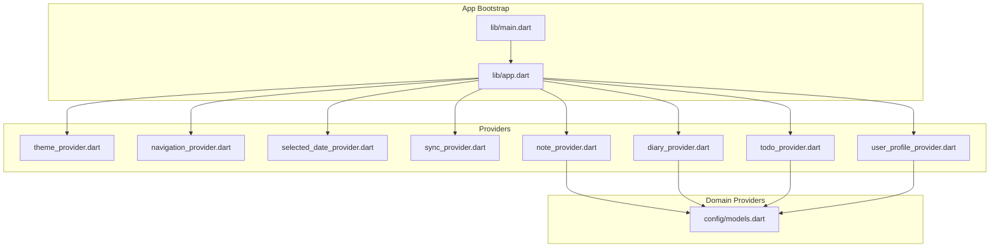
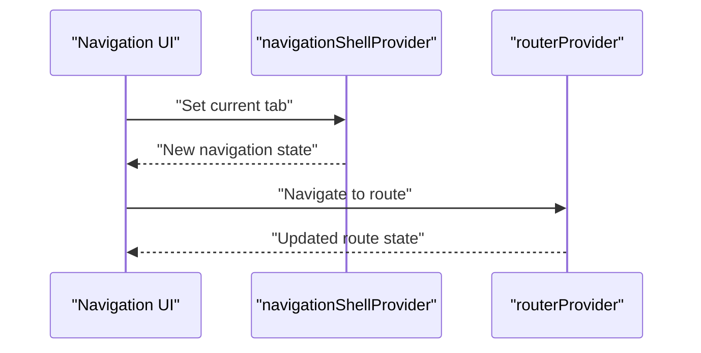
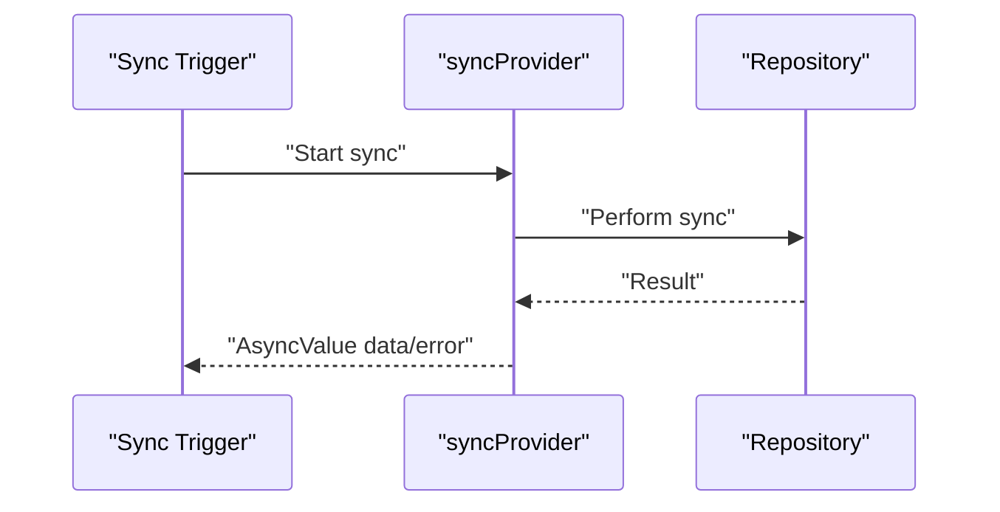
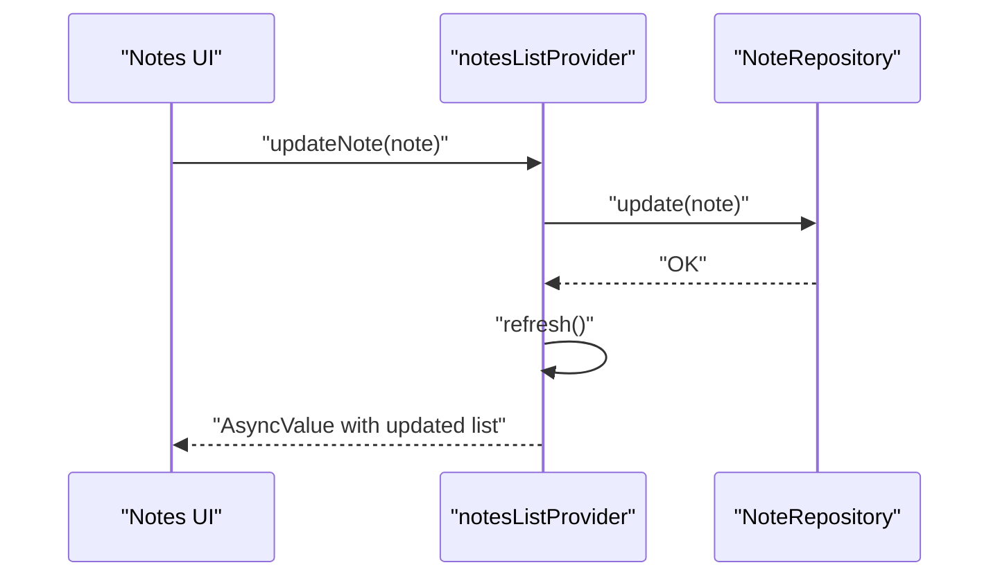
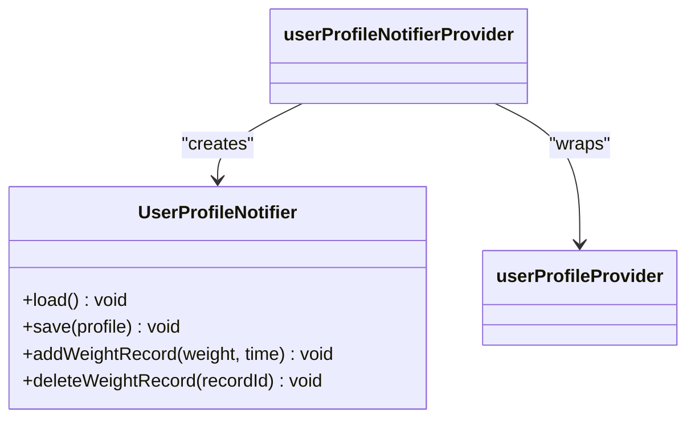
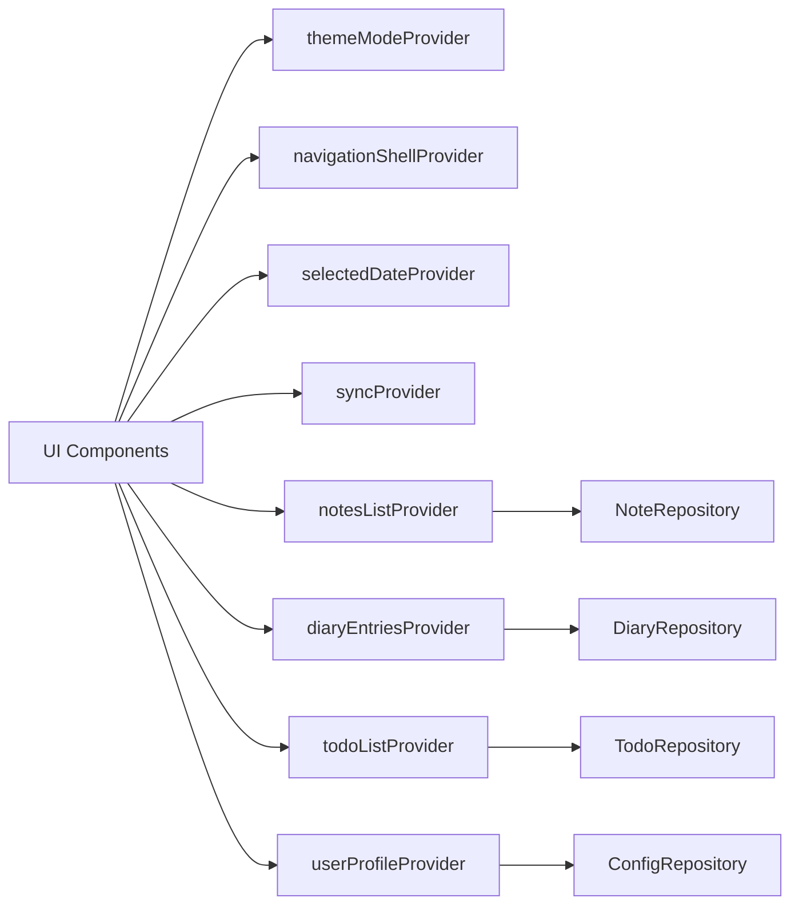

# State Management Architecture

<cite>
**Referenced Files in This Document**
- [AGENTS.md](file://AGENTS.md)
- [app.dart](file://lib/app.dart)
- [main.dart](file://lib/main.dart)
- [user_profile_provider.dart](file://lib/providers/user_profile_provider.dart)
- [note_provider.dart](file://lib/providers/note_provider.dart)
- [diary_provider.dart](file://lib/providers/diary_provider.dart)
- [todo_provider.dart](file://lib/providers/todo_provider.dart)
- [theme_provider.dart](file://lib/providers/theme_provider.dart)
- [navigation_provider.dart](file://lib/providers/navigation_provider.dart)
- [selected_date_provider.dart](file://lib/providers/selected_date_provider.dart)
- [sync_provider.dart](file://lib/providers/sync_provider.dart)
- [app_router.dart](file://lib/core/router/app_router.dart)
- [models.dart](file://lib/config/models.dart)
</cite>

## Table of Contents
1. [Introduction](#introduction)
2. [Project Structure](#project-structure)
3. [Core Components](#core-components)
4. [Architecture Overview](#architecture-overview)
5. [Detailed Component Analysis](#detailed-component-analysis)
6. [Dependency Analysis](#dependency-analysis)
7. [Performance Considerations](#performance-considerations)
8. [Troubleshooting Guide](#troubleshooting-guide)
9. [Conclusion](#conclusion)

## Introduction
This document explains QNote Flutter's Riverpod-based state management architecture. It covers the provider pattern implementation, reactive updates, and how Riverpod manages state across different scopes. It documents the separation between state providers, future providers, and stream providers, and demonstrates practical patterns for loading states, error handling, and asynchronous state management. Guidance on performance, memory management, and best practices for organizing providers in large applications is also included.

## Project Structure
QNote organizes state management under a dedicated providers directory, with each domain-specific provider encapsulating state and logic. The application bootstraps Riverpod via a global ProviderScope in the main entry point and uses Consumer widgets/components to subscribe to providers reactively.

**Diagram sources**
- [main.dart](file://lib/main.dart)
- [app.dart](file://lib/app.dart)
- [theme_provider.dart](file://lib/providers/theme_provider.dart)
- [navigation_provider.dart](file://lib/providers/navigation_provider.dart)
- [selected_date_provider.dart](file://lib/providers/selected_date_provider.dart)
- [sync_provider.dart](file://lib/providers/sync_provider.dart)
- [note_provider.dart](file://lib/providers/note_provider.dart)
- [diary_provider.dart](file://lib/providers/diary_provider.dart)
- [todo_provider.dart](file://lib/providers/todo_provider.dart)
- [user_profile_provider.dart](file://lib/providers/user_profile_provider.dart)
- [models.dart](file://lib/config/models.dart)

**Section sources**
- [main.dart](file://lib/main.dart)
- [app.dart](file://lib/app.dart)

## Core Components
QNote leverages Riverpod’s provider ecosystem to separate concerns and enable reactive updates:

- StateProvider: for simple, local state values (e.g., theme mode, selected date).
- FutureProvider: for asynchronous initialization and one-time reads (e.g., user profile).
- StateNotifierProvider: for complex mutable state with methods to mutate state (e.g., note list operations).
- Provider: for service instances and derived state (e.g., router, repositories).
- AsyncNotifierProvider/AsyncNotifier: recommended for async state with refresh semantics.

The project guidelines emphasize:
- Using AsyncNotifierProvider/AsyncNotifier for async data.
- Using StateProvider for simple state.
- Using FutureProvider.family for one-time reads keyed by parameters.
- Avoiding StateNotifierProvider when possible; prefer ref.invalidate() or Notifier.refresh() after mutations.
- One provider per concern; compose providers for derived state.

**Section sources**
- [AGENTS.md](file://AGENTS.md)

## Architecture Overview
The app initializes Riverpod at the top level and exposes providers globally. UI components watch providers to reactively rebuild when state changes. Domain-specific providers encapsulate CRUD operations and maintain lists or single items. The router provider coordinates navigation state.

```mermaid
graph TB
subgraph "Global Scope"
PS["ProviderScope"]
ROUTER["routerProvider (Provider)"]
end
subgraph "Theme & UI"
THEME_MODE["themeModeProvider (StateProvider)"]
ACCENT["accentColorProvider (StateProvider)"]
end
subgraph "Navigation"
NAV_SHELL["navigationShellProvider (StateProvider)"]
end
subgraph "Date & Sync"
SELECTED_DATE["selectedDateProvider (StateProvider)"]
SYNC_STATE["syncProvider (AsyncNotifierProvider)"]
end
subgraph "Domain State"
NOTES["notesListProvider (AsyncNotifierProvider)"]
DIARY["diaryEntriesProvider (AsyncNotifierProvider)"]
TODO["todoListProvider (AsyncNotifierProvider)"]
USER_PROFILE["userProfileProvider (FutureProvider)"]
end
PS --> ROUTER
PS --> THEME_MODE
PS --> ACCENT
PS --> NAV_SHELL
PS --> SELECTED_DATE
PS --> SYNC_STATE
PS --> NOTES
PS --> DIARY
PS --> TODO
PS --> USER_PROFILE
```

**Diagram sources**
- [app.dart](file://lib/app.dart)
- [app_router.dart](file://lib/core/router/app_router.dart)
- [theme_provider.dart](file://lib/providers/theme_provider.dart)
- [navigation_provider.dart](file://lib/providers/navigation_provider.dart)
- [selected_date_provider.dart](file://lib/providers/selected_date_provider.dart)
- [sync_provider.dart](file://lib/providers/sync_provider.dart)
- [note_provider.dart](file://lib/providers/note_provider.dart)
- [diary_provider.dart](file://lib/providers/diary_provider.dart)
- [todo_provider.dart](file://lib/providers/todo_provider.dart)
- [user_profile_provider.dart](file://lib/providers/user_profile_provider.dart)

## Detailed Component Analysis

### Theme and UI State Providers
- themeModeProvider and accentColorProvider are StateProviders managing UI preferences.
- They enable reactive rebuilds when theme settings change, ensuring the entire app adapts instantly.

**Section sources**
- [theme_provider.dart](file://lib/providers/theme_provider.dart)
- [app.dart](file://lib/app.dart)

### Navigation State Provider
- navigationShellProvider maintains the current shell route state for tabbed navigation.
- Combined with routerProvider, it orchestrates navigation state reactively.

**Diagram sources**
- [navigation_provider.dart](file://lib/providers/navigation_provider.dart)
- [app_router.dart](file://lib/core/router/app_router.dart)

**Section sources**
- [navigation_provider.dart](file://lib/providers/navigation_provider.dart)
- [app_router.dart](file://lib/core/router/app_router.dart)

### Selected Date Provider
- selectedDateProvider is a StateProvider storing the currently selected date.
- Used across calendar and diary views to keep selection in sync.

**Section sources**
- [selected_date_provider.dart](file://lib/providers/selected_date_provider.dart)

### Sync State Provider
- syncProvider is an AsyncNotifierProvider managing synchronization state.
- Supports loading, success, and error states for sync operations.

**Diagram sources**
- [sync_provider.dart](file://lib/providers/sync_provider.dart)

**Section sources**
- [sync_provider.dart](file://lib/providers/sync_provider.dart)

### Notes List Provider
- notesListProvider is an AsyncNotifierProvider managing a list of notes with async operations.
- Provides methods to update, delete, pin, search, move to folder, and reorder notes.
- Uses refresh() to re-fetch data after write operations.

**Diagram sources**
- [note_provider.dart](file://lib/providers/note_provider.dart)

**Section sources**
- [note_provider.dart](file://lib/providers/note_provider.dart)

### Diary Entries Provider
- diaryEntriesProvider is an AsyncNotifierProvider managing diary entries.
- Supports async initialization and refresh semantics similar to notes.

**Section sources**
- [diary_provider.dart](file://lib/providers/diary_provider.dart)

### Todo List Provider
- todoListProvider is an AsyncNotifierProvider managing todos.
- Provides mutation methods and refresh after updates.

**Section sources**
- [todo_provider.dart](file://lib/providers/todo_provider.dart)

### User Profile Provider
- userProfileProvider is a FutureProvider returning a user profile asynchronously.
- userProfileNotifierProvider is a StateNotifierProvider for mutating the profile and managing weight records.

**Diagram sources**
- [user_profile_provider.dart](file://lib/providers/user_profile_provider.dart)

**Section sources**
- [user_profile_provider.dart](file://lib/providers/user_profile_provider.dart)

### AI Provider Configuration Model
- AiProviderConfig defines available AI providers with metadata.
- Used by AI-related providers to configure provider-specific behavior.

**Section sources**
- [models.dart](file://lib/config/models.dart)

## Dependency Analysis
Providers depend on repositories and services injected via Provider. The app’s global scope ensures all providers share the same Riverpod instance. UI components consume providers through Consumer widgets, enabling fine-grained rebuilds.

**Diagram sources**
- [app.dart](file://lib/app.dart)
- [note_provider.dart](file://lib/providers/note_provider.dart)
- [diary_provider.dart](file://lib/providers/diary_provider.dart)
- [todo_provider.dart](file://lib/providers/todo_provider.dart)
- [user_profile_provider.dart](file://lib/providers/user_profile_provider.dart)

**Section sources**
- [app.dart](file://lib/app.dart)

## Performance Considerations
- Prefer StateProvider for primitive values to minimize overhead.
- Use FutureProvider.family for one-time reads with keys to avoid unnecessary recomputation.
- Avoid StateNotifierProvider when mutation can be handled via AsyncNotifierProvider with refresh().
- Keep providers focused (single responsibility) to reduce cascade rebuilds.
- Use refresh() strategically after writes to avoid stale UI.
- Cache frequently accessed data in memory-backed providers to reduce IO.
- Leverage Provider for singleton services to prevent redundant instances.

## Troubleshooting Guide
Common issues and remedies:
- Empty or stale lists after mutations: ensure refresh() is called after write operations in AsyncNotifier-based providers.
- Frequent full rebuilds: split providers by domain and scope; avoid watching unrelated providers in widgets.
- Async errors: handle AsyncValue.error in UI using AsyncValue.when(error: ...) and show user-friendly messages.
- Memory leaks: dispose of long-lived subscriptions and timers inside Notifiers; avoid holding large collections unnecessarily.
- Router state inconsistencies: verify routerProvider is initialized in ProviderScope and navigationShellProvider is updated consistently.

**Section sources**
- [AGENTS.md](file://AGENTS.md)
- [note_provider.dart](file://lib/providers/note_provider.dart)
- [app.dart](file://lib/app.dart)

## Conclusion
QNote’s Riverpod architecture cleanly separates state, logic, and UI. By using StateProvider for simple values, FutureProvider for async initialization, and AsyncNotifierProvider for complex async state with refresh semantics, the app achieves predictable, reactive updates. Following the documented patterns—avoiding StateNotifierProvider when possible, composing providers, and handling loading/error states—ensures scalability and maintainability in larger applications.