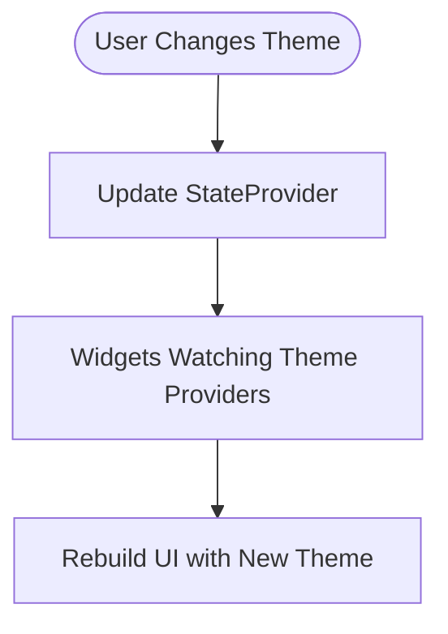
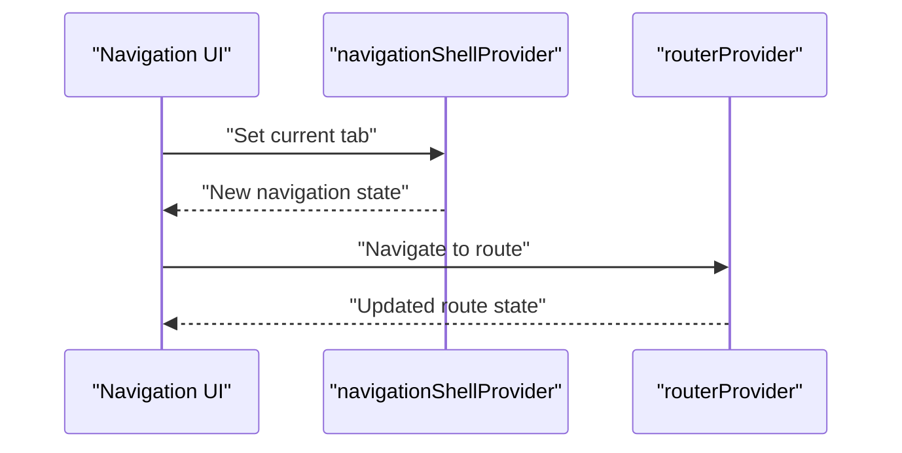
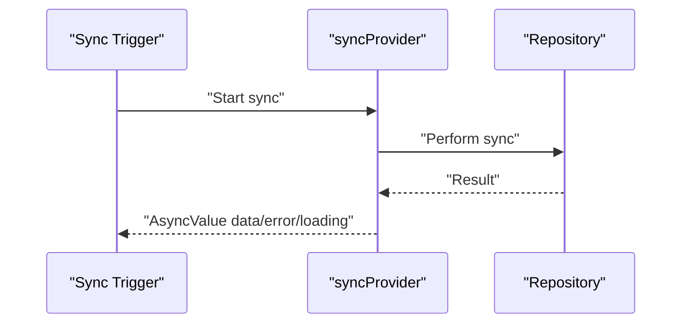
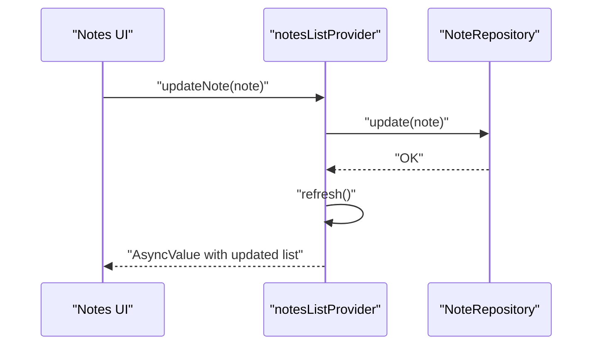
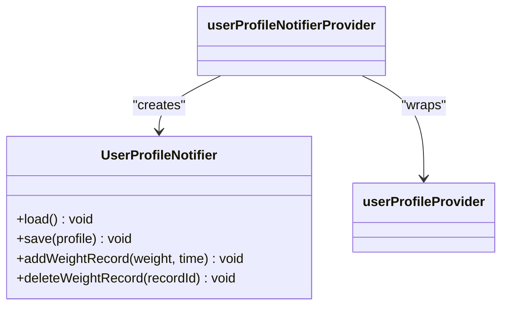
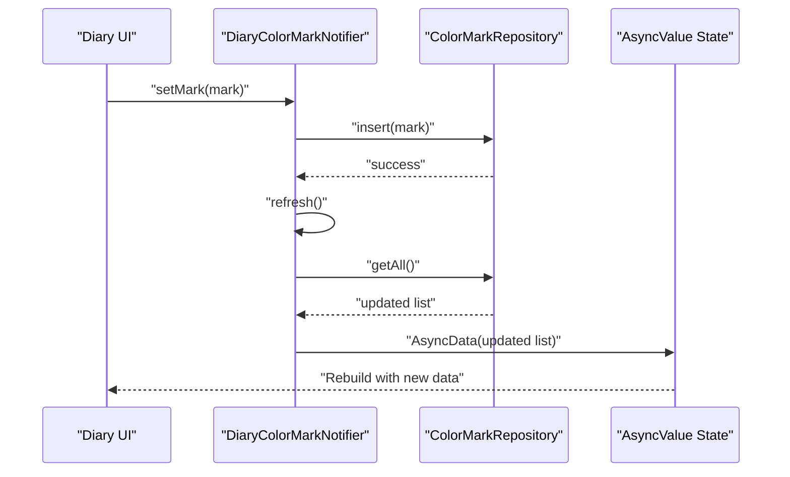
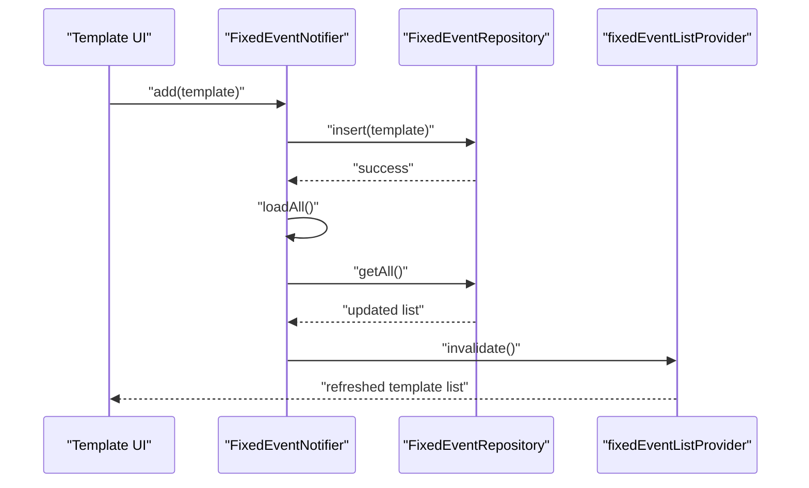
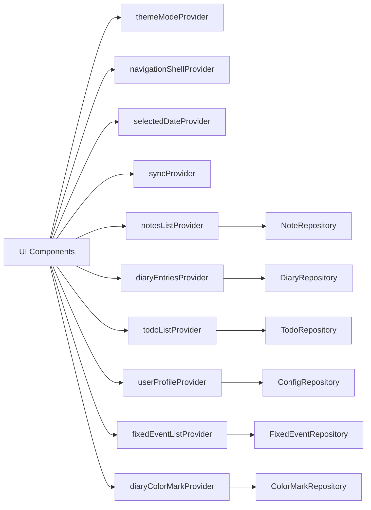

# State Management Architecture

<cite>
**Referenced Files in This Document**
- [main.dart](file://lib/main.dart)
- [app.dart](file://lib/app.dart)
- [diary_provider.dart](file://lib/providers/diary_provider.dart)
- [fixed_event_provider.dart](file://lib/providers/fixed_event_provider.dart)
- [user_profile_provider.dart](file://lib/providers/user_profile_provider.dart)
- [note_provider.dart](file://lib/providers/note_provider.dart)
- [todo_provider.dart](file://lib/providers/todo_provider.dart)
- [theme_provider.dart](file://lib/providers/theme_provider.dart)
- [navigation_provider.dart](file://lib/providers/navigation_provider.dart)
- [selected_date_provider.dart](file://lib/providers/selected_date_provider.dart)
- [sync_provider.dart](file://lib/providers/sync_provider.dart)
- [app_router.dart](file://lib/core/router/app_router.dart)
- [models.dart](file://lib/config/models.dart)
- [AGENTS.md](file://AGENTS.md)
</cite>

## Update Summary
**Changes Made**
- Updated Core Components section to reflect conversion from StateNotifier to AsyncNotifier for improved error handling and loading states
- Enhanced Diary Color Mark Provider documentation with AsyncData support and AsyncNotifier implementation
- Updated architecture overview to show AsyncNotifierProvider usage patterns
- Revised troubleshooting guidance for AsyncNotifier-based providers
- Added AsyncNotifier best practices and error handling patterns

## Table of Contents
1. [Introduction](#introduction)
2. [Project Structure](#project-structure)
3. [Core Components](#core-components)
4. [Architecture Overview](#architecture-overview)
5. [Detailed Component Analysis](#detailed-component-analysis)
6. [Diary Color Mark Provider](#diary-color-mark-provider)
7. [Fixed Event Template Provider](#fixed-event-template-provider)
8. [Dependency Analysis](#dependency-analysis)
9. [Performance Considerations](#performance-considerations)
10. [Troubleshooting Guide](#troubleshooting-guide)
11. [Conclusion](#conclusion)

## Introduction
This document explains QNote Flutter's Riverpod-based state management architecture. It covers the provider pattern implementation, reactive updates, and how Riverpod manages state across different scopes. The architecture has been enhanced with AsyncNotifier implementations for better error handling and loading state management. It documents the separation between state providers, future providers, and stream providers, and demonstrates practical patterns for loading states, error handling, and asynchronous state management. Guidance on performance, memory management, and best practices for organizing providers in large applications is also included.

## Project Structure
QNote organizes state management under a dedicated providers directory, with each domain-specific provider encapsulating state and logic. The application bootstraps Riverpod via a global ProviderScope in the main entry point and uses Consumer widgets/components to subscribe to providers reactively.

```mermaid
graph TB
subgraph "App Bootstrap"
MAIN["lib/main.dart"]
APP["lib/app.dart"]
end
subgraph "Core Providers"
THEME["theme_provider.dart"]
NAV["navigation_provider.dart"]
DATE["selected_date_provider.dart"]
SYNC["sync_provider.dart"]
END
subgraph "Domain Providers"
NOTE["note_provider.dart"]
DIARY["diary_provider.dart"]
TODO["todo_provider.dart"]
USER["user_profile_provider.dart"]
FIXED_EVENT["fixed_event_provider.dart"]
END
subgraph "Model Definitions"
MODELS["config/models.dart"]
END
MAIN --> APP
APP --> THEME
APP --> NAV
APP --> DATE
APP --> SYNC
APP --> NOTE
APP --> DIARY
APP --> TODO
APP --> USER
APP --> FIXED_EVENT
NOTE --> MODELS
DIARY --> MODELS
TODO --> MODELS
USER --> MODELS
FIXED_EVENT --> MODELS
```

**Diagram sources**
- [main.dart](file://lib/main.dart)
- [app.dart](file://lib/app.dart)
- [theme_provider.dart](file://lib/providers/theme_provider.dart)
- [navigation_provider.dart](file://lib/providers/navigation_provider.dart)
- [selected_date_provider.dart](file://lib/providers/selected_date_provider.dart)
- [sync_provider.dart](file://lib/providers/sync_provider.dart)
- [note_provider.dart](file://lib/providers/note_provider.dart)
- [diary_provider.dart](file://lib/providers/diary_provider.dart)
- [todo_provider.dart](file://lib/providers/todo_provider.dart)
- [user_profile_provider.dart](file://lib/providers/user_profile_provider.dart)
- [fixed_event_provider.dart](file://lib/providers/fixed_event_provider.dart)
- [models.dart](file://lib/config/models.dart)

**Section sources**
- [main.dart](file://lib/main.dart)
- [app.dart](file://lib/app.dart)

## Core Components
QNote leverages Riverpod's provider ecosystem to separate concerns and enable reactive updates. The architecture has been enhanced with AsyncNotifier implementations for improved error handling and loading state management:

- StateProvider: for simple, local state values (e.g., theme mode, selected date).
- FutureProvider: for asynchronous initialization and one-time reads (e.g., user profile, fixed event templates).
- AsyncNotifierProvider/AsyncNotifier: for complex mutable state with async operations and built-in loading/error state management.
- Provider: for service instances and derived state (e.g., router, repositories).

**Updated** The project now emphasizes AsyncNotifierProvider/AsyncNotifier for async state management, providing automatic loading and error state handling through AsyncValue types. This eliminates the need for manual loading flags and improves error handling consistency.

The project guidelines emphasize:
- Using AsyncNotifierProvider/AsyncNotifier for async data with refresh semantics.
- Using StateProvider for simple state.
- Using FutureProvider.family for one-time reads keyed by parameters.
- Avoiding StateNotifierProvider when possible; prefer ref.invalidate() or Notifier.refresh() after mutations.
- One provider per concern; compose providers for derived state.
- Leveraging AsyncData, AsyncError, and AsyncLoading states for comprehensive UI handling.

**Section sources**
- [AGENTS.md](file://AGENTS.md)

## Architecture Overview
The app initializes Riverpod at the top level and exposes providers globally. UI components watch providers to reactively rebuild when state changes. Domain-specific providers encapsulate CRUD operations and maintain lists or single items. The router provider coordinates navigation state. The enhanced architecture now uses AsyncNotifierProvider for providers that require refresh semantics and comprehensive async state management.

```mermaid
graph TB
subgraph "Global Scope"
PS["ProviderScope"]
ROUTER["routerProvider (Provider)"]
END
subgraph "Theme & UI"
THEME_MODE["themeModeProvider (StateProvider)"]
ACCENT["accentColorProvider (StateProvider)"]
END
subgraph "Navigation"
NAV_SHELL["navigationShellProvider (StateProvider)"]
END
subgraph "Date & Sync"
SELECTED_DATE["selectedDateProvider (StateProvider)"]
SYNC_STATE["syncProvider (AsyncNotifierProvider)"]
END
subgraph "Domain State"
NOTES["notesListProvider (AsyncNotifierProvider)"]
DIARY["diaryEntriesProvider (AsyncNotifierProvider)"]
TODO["todoListProvider (AsyncNotifierProvider)"]
USER_PROFILE["userProfileProvider (FutureProvider)"]
FIXED_EVENTS["fixedEventListProvider (FutureProvider)"]
END
subgraph "Enhanced Async State Management"
DIARY_COLOR_MARK["diaryColorMarkProvider (AsyncNotifierProvider)"]
AI_CONFIGS["aiConfigListProvider (AsyncNotifierProvider)"]
DAILY_SCORE["dailyScoreProvider (AsyncNotifierProvider)"]
END
PS --> ROUTER
PS --> THEME_MODE
PS --> ACCENT
PS --> NAV_SHELL
PS --> SELECTED_DATE
PS --> SYNC_STATE
PS --> NOTES
PS --> DIARY
PS --> TODO
PS --> USER_PROFILE
PS --> FIXED_EVENTS
PS --> DIARY_COLOR_MARK
PS --> AI_CONFIGS
PS --> DAILY_SCORE
```

**Diagram sources**
- [app.dart](file://lib/app.dart)
- [app_router.dart](file://lib/core/router/app_router.dart)
- [theme_provider.dart](file://lib/providers/theme_provider.dart)
- [navigation_provider.dart](file://lib/providers/navigation_provider.dart)
- [selected_date_provider.dart](file://lib/providers/selected_date_provider.dart)
- [sync_provider.dart](file://lib/providers/sync_provider.dart)
- [note_provider.dart](file://lib/providers/note_provider.dart)
- [diary_provider.dart](file://lib/providers/diary_provider.dart)
- [todo_provider.dart](file://lib/providers/todo_provider.dart)
- [user_profile_provider.dart](file://lib/providers/user_profile_provider.dart)
- [fixed_event_provider.dart](file://lib/providers/fixed_event_provider.dart)

## Detailed Component Analysis

### Theme and UI State Providers
- themeModeProvider and accentColorProvider are StateProviders managing UI preferences.
- They enable reactive rebuilds when theme settings change, ensuring the entire app adapts instantly.



**Section sources**
- [theme_provider.dart](file://lib/providers/theme_provider.dart)
- [app.dart](file://lib/app.dart)

### Navigation State Provider
- navigationShellProvider maintains the current shell route state for tabbed navigation.
- Combined with routerProvider, it orchestrates navigation state reactively.



**Diagram sources**
- [navigation_provider.dart](file://lib/providers/navigation_provider.dart)
- [app_router.dart](file://lib/core/router/app_router.dart)

**Section sources**
- [navigation_provider.dart](file://lib/providers/navigation_provider.dart)
- [app_router.dart](file://lib/core/router/app_router.dart)

### Selected Date Provider
- selectedDateProvider is a StateProvider storing the currently selected date.
- Used across calendar and diary views to keep selection in sync.

**Section sources**
- [selected_date_provider.dart](file://lib/providers/selected_date_provider.dart)

### Sync State Provider
- syncProvider is an AsyncNotifierProvider managing synchronization state.
- Supports loading, success, and error states for sync operations through AsyncValue.



**Diagram sources**
- [sync_provider.dart](file://lib/providers/sync_provider.dart)

**Section sources**
- [sync_provider.dart](file://lib/providers/sync_provider.dart)

### Notes List Provider
- notesListProvider is an AsyncNotifierProvider managing a list of notes with async operations.
- Provides methods to update, delete, pin, search, move to folder, and reorder notes.
- Uses refresh() to re-fetch data after write operations with automatic loading state management.



**Diagram sources**
- [note_provider.dart](file://lib/providers/note_provider.dart)

**Section sources**
- [note_provider.dart](file://lib/providers/note_provider.dart)

### Diary Entries Provider
- diaryEntriesProvider is an AsyncNotifierProvider managing diary entries with comprehensive async state handling.
- Supports async initialization, refresh semantics, and automatic loading/error state management.

**Section sources**
- [diary_provider.dart](file://lib/providers/diary_provider.dart)

### Todo List Provider
- todoListProvider is an AsyncNotifierProvider managing todos with async operations and refresh semantics.
- Provides mutation methods and refresh after updates with proper loading state management.

**Section sources**
- [todo_provider.dart](file://lib/providers/todo_provider.dart)

### User Profile Provider
- userProfileProvider is a FutureProvider returning a user profile asynchronously.
- userProfileNotifierProvider is a StateNotifierProvider for mutating the profile and managing weight records.



**Diagram sources**
- [user_profile_provider.dart](file://lib/providers/user_profile_provider.dart)

**Section sources**
- [user_profile_provider.dart](file://lib/providers/user_profile_provider.dart)

### AI Provider Configuration Model
- AiProviderConfig defines available AI providers with metadata.
- Used by AI-related providers to configure provider-specific behavior.

**Section sources**
- [models.dart](file://lib/config/models.dart)

## Diary Color Mark Provider

**Updated** Enhanced with AsyncNotifier implementation for improved error handling and loading states

The DiaryColorMarkProvider represents a significant architectural improvement, transitioning from StateNotifier to AsyncNotifier for better async state management. This change provides automatic loading state handling, improved error management, and more robust async operations.

### AsyncNotifier Implementation
The DiaryColorMarkNotifier extends AsyncNotifier<List<DateColorMark>> instead of StateNotifier<List<DateColorMark>>. This provides:

- **Automatic Loading States**: Built-in AsyncLoading, AsyncData, and AsyncError state management
- **Refresh Semantics**: Native refresh() method for re-fetching data
- **State Management**: Automatic state updates through AsyncData/AsyncError wrappers
- **Error Handling**: Comprehensive error propagation and recovery mechanisms

### Key Methods and Enhancements:
- **build()**: Initializes provider with repository data and sets initial state
- **refresh()**: Explicitly refreshes data with AsyncData wrapper
- **setMark()**: Creates new color marks with automatic refresh and error handling
- **removeMark()**: Deletes color marks with cascading refresh operations
- **removeMarkByDate()**: Batch deletion by date with refresh semantics

### Async State Management Flow
The provider now handles async operations through Riverpod's AsyncValue system:



**Diagram sources**
- [diary_provider.dart](file://lib/providers/diary_provider.dart)

**Section sources**
- [diary_provider.dart](file://lib/providers/diary_provider.dart)

## Fixed Event Template Provider

**Updated** Added comprehensive documentation for the new fixed event template provider system

The fixed event template provider manages reusable event templates that users can create, customize, and apply to their scheduling. This provider enhances the application's state management architecture by introducing specialized template management capabilities.

### Fixed Event Template List Provider
- fixedEventListProvider is a FutureProvider that retrieves only enabled fixed event templates
- Optimized for scenarios where disabled templates should not be displayed
- Returns a List<FixedEventTemplate> for immediate consumption

### Fixed Event Template Manager Notifier
- FixedEventNotifier extends StateNotifier<List<FixedEventTemplate>>
- Manages the complete lifecycle of fixed event templates
- Provides comprehensive CRUD operations with automatic state invalidation

#### Key Operations:
- **loadAll()**: Loads all templates (enabled and disabled) and refreshes dependent providers
- **add()**: Creates new templates with proper validation and persistence
- **update()**: Modifies existing templates with atomic operations
- **delete()**: Removes templates with cascading cleanup
- **reorder()**: Handles complex sorting with database updates and state synchronization

### Template Management Architecture
The fixed event template system follows Riverpod best practices with clear separation between data retrieval and manipulation:



**Diagram sources**
- [fixed_event_provider.dart](file://lib/providers/fixed_event_provider.dart)

**Section sources**
- [fixed_event_provider.dart](file://lib/providers/fixed_event_provider.dart)

## Dependency Analysis
Providers depend on repositories and services injected via Provider. The app's global scope ensures all providers share the same Riverpod instance. UI components consume providers through Consumer widgets, enabling fine-grained rebuilds.



**Diagram sources**
- [app.dart](file://lib/app.dart)
- [note_provider.dart](file://lib/providers/note_provider.dart)
- [diary_provider.dart](file://lib/providers/diary_provider.dart)
- [todo_provider.dart](file://lib/providers/todo_provider.dart)
- [user_profile_provider.dart](file://lib/providers/user_profile_provider.dart)
- [fixed_event_provider.dart](file://lib/providers/fixed_event_provider.dart)

**Section sources**
- [app.dart](file://lib/app.dart)

## Performance Considerations
- Prefer StateProvider for primitive values to minimize overhead.
- Use FutureProvider.family for one-time reads with keys to avoid unnecessary recomputation.
- Avoid StateNotifierProvider when mutation can be handled via AsyncNotifierProvider with refresh().
- Keep providers focused (single responsibility) to reduce cascade rebuilds.
- Use refresh() strategically after writes to avoid stale UI.
- Cache frequently accessed data in memory-backed providers to reduce IO.
- Leverage Provider for singleton services to prevent redundant instances.
- **AsyncNotifier Benefits**: Automatic state caching, efficient error handling, and reduced boilerplate code for async operations.
- **Memory Management**: AsyncNotifier automatically manages state lifecycle and cleanup through Riverpod's provider system.

## Troubleshooting Guide
Common issues and remedies:
- Empty or stale lists after mutations: ensure refresh() is called after write operations in AsyncNotifier-based providers.
- Frequent full rebuilds: split providers by domain and scope; avoid watching unrelated providers in widgets.
- Async errors: handle AsyncValue.error in UI using AsyncValue.when(error: ...) and show user-friendly messages.
- Memory leaks: dispose of long-lived subscriptions and timers inside Notifiers; avoid holding large collections unnecessarily.
- Router state inconsistencies: verify routerProvider is initialized in ProviderScope and navigationShellProvider is updated consistently.
- **AsyncNotifier Issues**: Use AsyncValue.hasError and AsyncValue.isLoading helpers for comprehensive state checking.
- **State Invalidation**: Prefer ref.invalidate() over manual state clearing for better performance and consistency.
- **Error Propagation**: Ensure async operations properly propagate exceptions to enable AsyncError state management.

**Section sources**
- [AGENTS.md](file://AGENTS.md)
- [note_provider.dart](file://lib/providers/note_provider.dart)
- [app.dart](file://lib/app.dart)
- [diary_provider.dart](file://lib/providers/diary_provider.dart)
- [fixed_event_provider.dart](file://lib/providers/fixed_event_provider.dart)

## Conclusion
QNote's Riverpod architecture has been significantly enhanced with AsyncNotifier implementations for improved error handling and loading state management. The transition from StateNotifier to AsyncNotifier provides automatic state management through AsyncValue types, eliminating the need for manual loading flags and improving error handling consistency. By using StateProvider for simple values, FutureProvider for async initialization, and AsyncNotifierProvider for complex async state with refresh semantics, the app achieves predictable, reactive updates with comprehensive state lifecycle management. The enhanced DiaryColorMarkProvider demonstrates the benefits of AsyncNotifier adoption, providing robust async state handling with minimal boilerplate code. Following the documented patterns—avoiding StateNotifierProvider when possible, composing providers, and leveraging AsyncValue for loading/error states—ensures scalability and maintainability in larger applications.