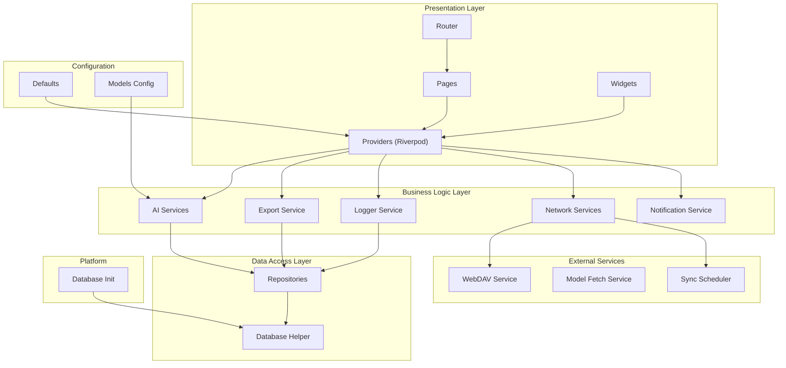
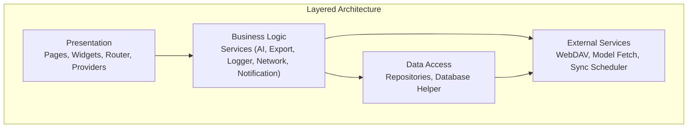
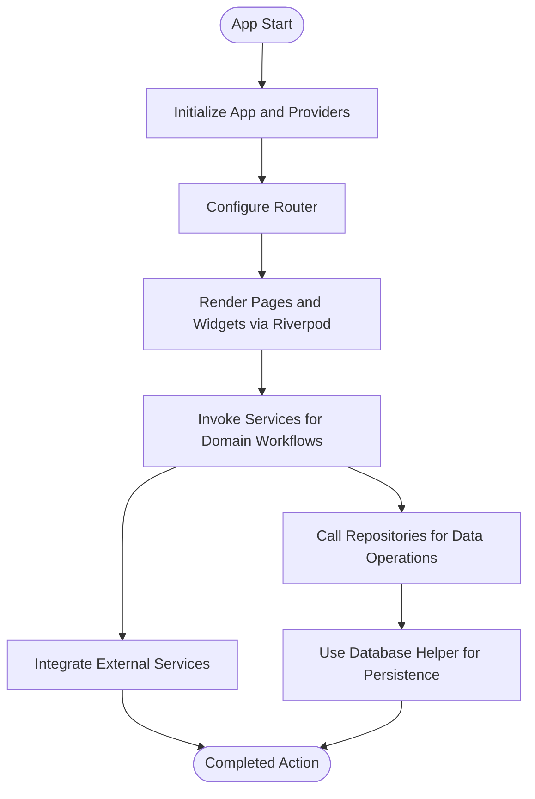
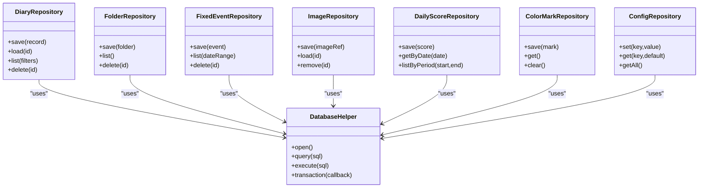
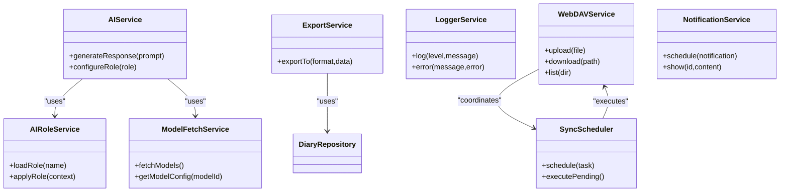
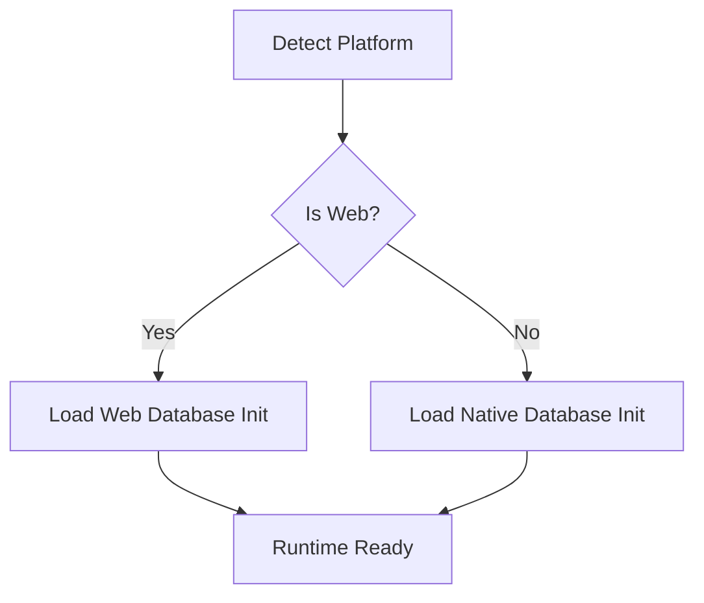
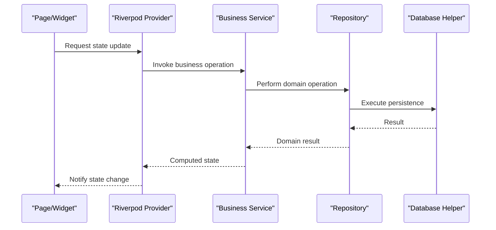
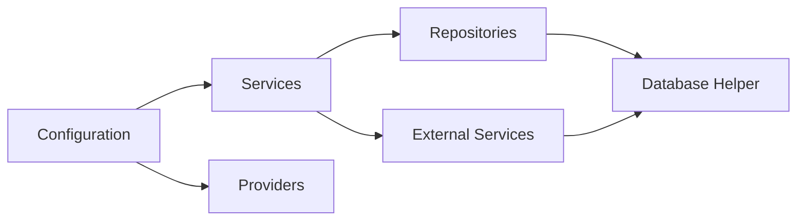
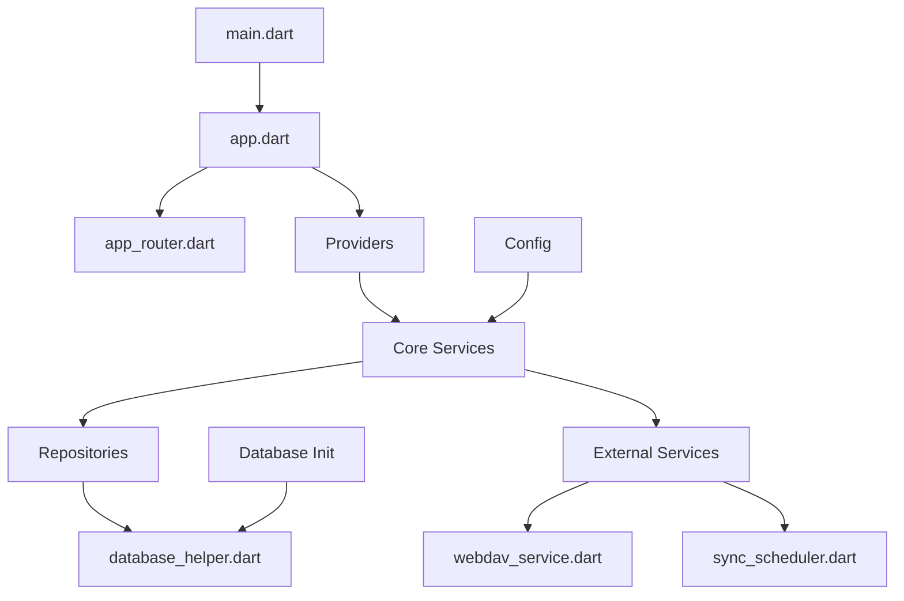

# System Design and Patterns

<cite>
**Referenced Files in This Document**
- [app.dart](file://lib/app.dart)
- [main.dart](file://lib/main.dart)
- [database_init.dart](file://lib/database_init.dart)
- [database_init_io.dart](file://lib/database_init_io.dart)
- [defaults.dart](file://lib/config/defaults.dart)
- [models.dart](file://lib/config/models.dart)
- [ai_role_service.dart](file://lib/core/ai/ai_role_service.dart)
- [ai_service.dart](file://lib/core/ai/ai_service.dart)
- [model_fetch_service.dart](file://lib/core/ai/model_fetch_service.dart)
- [export_service.dart](file://lib/core/export/export_service.dart)
- [logger_service.dart](file://lib/core/logger/logger_service.dart)
- [sync_scheduler.dart](file://lib/core/network/sync_scheduler.dart)
- [webdav_service.dart](file://lib/core/network/webdav_service.dart)
- [notification_service.dart](file://lib/core/notification/notification_service.dart)
- [app_router.dart](file://lib/core/router/app_router.dart)
- [color_mark_repository.dart](file://lib/core/storage/color_mark_repository.dart)
- [config_repository.dart](file://lib/core/storage/config_repository.dart)
- [daily_score_repository.dart](file://lib/core/storage/daily_score_repository.dart)
- [database_helper.dart](file://lib/core/storage/database_helper.dart)
- [diary_repository.dart](file://lib/core/storage/diary_repository.dart)
- [fixed_event_repository.dart](file://lib/core/storage/fixed_event_repository.dart)
- [folder_repository.dart](file://lib/core/storage/folder_repository.dart)
- [image_repository.dart](file://lib/core/storage/image_repository.dart)
</cite>

## Table of Contents
1. [Introduction](#introduction)
2. [Project Structure](#project-structure)
3. [Core Components](#core-components)
4. [Architecture Overview](#architecture-overview)
5. [Detailed Component Analysis](#detailed-component-analysis)
6. [Dependency Analysis](#dependency-analysis)
7. [Performance Considerations](#performance-considerations)
8. [Troubleshooting Guide](#troubleshooting-guide)
9. [Conclusion](#conclusion)

## Introduction
This document explains QNote Flutter’s system design patterns and architectural principles with a focus on clean architecture and separation of concerns across presentation, business logic, data access, and external services layers. It documents the repository pattern for data persistence abstraction, the service layer pattern for encapsulating business logic, and the factory pattern for platform-specific implementations. It also describes the MVVM-like structure using Riverpod for state management and how components communicate through well-defined interfaces. Architectural diagrams illustrate component relationships and data flow, and the document concludes with design decisions, trade-offs, and benefits for maintainability, testability, and scalability.

## Project Structure
QNote Flutter organizes code by functional domains and layers:
- Presentation layer: Pages, Widgets, Providers (Riverpod), and Router
- Business logic layer: Core services (AI, Export, Logger, Network, Notification)
- Data access layer: Repositories and Database Helper
- External services: WebDAV, Model Fetch, Sync Scheduler
- Configuration: Defaults and Models
- Platform initialization: Database initialization for web and native

**Diagram sources**
- [app.dart](file://lib/app.dart)
- [main.dart](file://lib/main.dart)
- [database_init.dart](file://lib/database_init.dart)
- [database_init_io.dart](file://lib/database_init_io.dart)
- [defaults.dart](file://lib/config/defaults.dart)
- [models.dart](file://lib/config/models.dart)
- [ai_service.dart](file://lib/core/ai/ai_service.dart)
- [export_service.dart](file://lib/core/export/export_service.dart)
- [logger_service.dart](file://lib/core/logger/logger_service.dart)
- [webdav_service.dart](file://lib/core/network/webdav_service.dart)
- [sync_scheduler.dart](file://lib/core/network/sync_scheduler.dart)
- [notification_service.dart](file://lib/core/notification/notification_service.dart)
- [app_router.dart](file://lib/core/router/app_router.dart)
- [database_helper.dart](file://lib/core/storage/database_helper.dart)
- [diary_repository.dart](file://lib/core/storage/diary_repository.dart)

**Section sources**
- [main.dart](file://lib/main.dart)
- [app.dart](file://lib/app.dart)

## Core Components
- Application bootstrap and routing orchestrate the presentation layer and wire up Riverpod providers.
- Core services encapsulate cross-cutting business logic and integrate with external systems.
- Repositories abstract persistent storage and expose domain-focused APIs.
- Database Helper centralizes database operations and schema management.
- Platform-specific initialization ensures correct runtime behavior for web/native environments.

Key responsibilities:
- Presentation: Pages and Widgets render state from Riverpod providers; Router navigates between screens.
- Business logic: AI, Export, Logger, Network, and Notification services coordinate domain workflows.
- Data access: Repositories provide CRUD and query APIs; Database Helper manages connections and migrations.
- External services: WebDAV and model fetch services handle remote synchronization and model provisioning.
- Configuration: Defaults and Models define environment and domain constants.

**Section sources**
- [app.dart](file://lib/app.dart)
- [main.dart](file://lib/main.dart)
- [database_helper.dart](file://lib/core/storage/database_helper.dart)
- [diary_repository.dart](file://lib/core/storage/diary_repository.dart)

## Architecture Overview
QNote Flutter follows a layered clean architecture:
- Presentation depends on business logic abstractions
- Business logic depends on repositories and external services
- Repositories depend on the Database Helper
- External services encapsulate platform integrations
- Configuration informs behavior without leaking into layers

**Diagram sources**
- [app_router.dart](file://lib/core/router/app_router.dart)
- [ai_service.dart](file://lib/core/ai/ai_service.dart)
- [export_service.dart](file://lib/core/export/export_service.dart)
- [logger_service.dart](file://lib/core/logger/logger_service.dart)
- [webdav_service.dart](file://lib/core/network/webdav_service.dart)
- [sync_scheduler.dart](file://lib/core/network/sync_scheduler.dart)
- [database_helper.dart](file://lib/core/storage/database_helper.dart)
- [diary_repository.dart](file://lib/core/storage/diary_repository.dart)

## Detailed Component Analysis

### Clean Architecture Layers and Separation of Concerns
- Presentation layer: Pages and Widgets consume Riverpod providers; Router defines navigation and routes.
- Business logic layer: Services encapsulate workflows and coordinate repositories and external services.
- Data access layer: Repositories expose domain operations; Database Helper handles persistence primitives.
- External services: WebDAV, model fetch, and sync scheduler provide platform integrations.

**Diagram sources**
- [main.dart](file://lib/main.dart)
- [app.dart](file://lib/app.dart)
- [app_router.dart](file://lib/core/router/app_router.dart)
- [ai_service.dart](file://lib/core/ai/ai_service.dart)
- [webdav_service.dart](file://lib/core/network/webdav_service.dart)
- [database_helper.dart](file://lib/core/storage/database_helper.dart)

**Section sources**
- [main.dart](file://lib/main.dart)
- [app.dart](file://lib/app.dart)
- [app_router.dart](file://lib/core/router/app_router.dart)

### Repository Pattern for Data Persistence Abstraction
Repositories provide domain-focused APIs over raw storage operations:
- Diary Repository: Encapsulates diary record persistence and queries
- Folder Repository: Manages folder metadata
- Fixed Event Repository: Handles fixed events
- Image Repository: Stores and retrieves image references
- Daily Score Repository: Tracks daily metrics
- Color Mark Repository: Manages color marking preferences
- Config Repository: Centralizes configurable settings

**Diagram sources**
- [database_helper.dart](file://lib/core/storage/database_helper.dart)
- [diary_repository.dart](file://lib/core/storage/diary_repository.dart)
- [folder_repository.dart](file://lib/core/storage/folder_repository.dart)
- [fixed_event_repository.dart](file://lib/core/storage/fixed_event_repository.dart)
- [image_repository.dart](file://lib/core/storage/image_repository.dart)
- [daily_score_repository.dart](file://lib/core/storage/daily_score_repository.dart)
- [color_mark_repository.dart](file://lib/core/storage/color_mark_repository.dart)
- [config_repository.dart](file://lib/core/storage/config_repository.dart)

**Section sources**
- [database_helper.dart](file://lib/core/storage/database_helper.dart)
- [diary_repository.dart](file://lib/core/storage/diary_repository.dart)
- [folder_repository.dart](file://lib/core/storage/folder_repository.dart)
- [fixed_event_repository.dart](file://lib/core/storage/fixed_event_repository.dart)
- [image_repository.dart](file://lib/core/storage/image_repository.dart)
- [daily_score_repository.dart](file://lib/core/storage/daily_score_repository.dart)
- [color_mark_repository.dart](file://lib/core/storage/color_mark_repository.dart)
- [config_repository.dart](file://lib/core/storage/config_repository.dart)

### Service Layer Pattern for Business Logic Encapsulation
Services encapsulate domain workflows and coordinate repositories and external services:
- AI Service: Coordinates AI role service and model fetch service for AI-driven features
- Export Service: Provides export capabilities leveraging repositories
- Logger Service: Centralized logging for diagnostics
- WebDAV Service: Integrates with remote storage via WebDAV
- Sync Scheduler: Schedules and orchestrates synchronization tasks
- Notification Service: Manages notifications and reminders

**Diagram sources**
- [ai_service.dart](file://lib/core/ai/ai_service.dart)
- [ai_role_service.dart](file://lib/core/ai/ai_role_service.dart)
- [model_fetch_service.dart](file://lib/core/ai/model_fetch_service.dart)
- [export_service.dart](file://lib/core/export/export_service.dart)
- [logger_service.dart](file://lib/core/logger/logger_service.dart)
- [webdav_service.dart](file://lib/core/network/webdav_service.dart)
- [sync_scheduler.dart](file://lib/core/network/sync_scheduler.dart)
- [notification_service.dart](file://lib/core/notification/notification_service.dart)
- [diary_repository.dart](file://lib/core/storage/diary_repository.dart)

**Section sources**
- [ai_service.dart](file://lib/core/ai/ai_service.dart)
- [ai_role_service.dart](file://lib/core/ai/ai_role_service.dart)
- [model_fetch_service.dart](file://lib/core/ai/model_fetch_service.dart)
- [export_service.dart](file://lib/core/export/export_service.dart)
- [logger_service.dart](file://lib/core/logger/logger_service.dart)
- [webdav_service.dart](file://lib/core/network/webdav_service.dart)
- [sync_scheduler.dart](file://lib/core/network/sync_scheduler.dart)
- [notification_service.dart](file://lib/core/notification/notification_service.dart)

### Factory Pattern for Platform-Specific Implementations
Platform-specific initialization ensures correct runtime behavior:
- Database Initialization: Separate implementations for web and native platforms
- These initializations configure platform adapters and runtime dependencies

**Diagram sources**
- [database_init.dart](file://lib/database_init.dart)
- [database_init_io.dart](file://lib/database_init_io.dart)

**Section sources**
- [database_init.dart](file://lib/database_init.dart)
- [database_init_io.dart](file://lib/database_init_io.dart)

### MVVM-like Structure Using Riverpod for State Management
- Pages and Widgets observe Riverpod providers for reactive UI updates
- Providers encapsulate state and expose change notifications
- Services and Repositories remain stateless and dependency-injected via providers

**Diagram sources**
- [app_router.dart](file://lib/core/router/app_router.dart)
- [ai_service.dart](file://lib/core/ai/ai_service.dart)
- [diary_repository.dart](file://lib/core/storage/diary_repository.dart)
- [database_helper.dart](file://lib/core/storage/database_helper.dart)

**Section sources**
- [app_router.dart](file://lib/core/router/app_router.dart)

### Component Communication Through Well-Defined Interfaces
- Services depend on repository interfaces, not concrete implementations
- Repositories depend on Database Helper for persistence primitives
- External services are injected and configured via dependency injection
- Configuration is centralized and consumed by services/providers

**Diagram sources**
- [ai_service.dart](file://lib/core/ai/ai_service.dart)
- [diary_repository.dart](file://lib/core/storage/diary_repository.dart)
- [database_helper.dart](file://lib/core/storage/database_helper.dart)
- [webdav_service.dart](file://lib/core/network/webdav_service.dart)
- [defaults.dart](file://lib/config/defaults.dart)
- [models.dart](file://lib/config/models.dart)

**Section sources**
- [defaults.dart](file://lib/config/defaults.dart)
- [models.dart](file://lib/config/models.dart)

## Dependency Analysis
- Coupling: Low coupling between layers; dependencies point inward toward abstractions
- Cohesion: High cohesion within repositories, services, and configuration modules
- External dependencies: WebDAV, model fetch, and sync scheduler are isolated and replaceable
- Circular dependencies: None observed; clear directional dependencies

**Diagram sources**
- [main.dart](file://lib/main.dart)
- [app.dart](file://lib/app.dart)
- [app_router.dart](file://lib/core/router/app_router.dart)
- [ai_service.dart](file://lib/core/ai/ai_service.dart)
- [diary_repository.dart](file://lib/core/storage/diary_repository.dart)
- [database_helper.dart](file://lib/core/storage/database_helper.dart)
- [webdav_service.dart](file://lib/core/network/webdav_service.dart)
- [sync_scheduler.dart](file://lib/core/network/sync_scheduler.dart)
- [database_init.dart](file://lib/database_init.dart)

**Section sources**
- [main.dart](file://lib/main.dart)
- [app.dart](file://lib/app.dart)

## Performance Considerations
- Repository-level caching: Consider adding lightweight caches in repositories for frequently accessed data
- Batch operations: Group database writes to reduce transaction overhead
- Lazy loading: Defer heavy computations until UI requires them
- Debounced sync: Coalesce frequent sync triggers to avoid thrashing external services
- Memory footprint: Keep provider state minimal; avoid holding large objects in memory unnecessarily

## Troubleshooting Guide
- Database initialization failures: Verify platform-specific initialization files and ensure correct runtime detection
- Repository query errors: Confirm SQL statements and schema versions; use transaction wrappers for atomicity
- External service timeouts: Add retry policies and circuit breakers for WebDAV operations
- State inconsistencies: Ensure provider updates are dispatched after repository and service operations complete
- Logging: Use logger service to capture actionable diagnostics during development and production

**Section sources**
- [database_init.dart](file://lib/database_init.dart)
- [database_init_io.dart](file://lib/database_init_io.dart)
- [database_helper.dart](file://lib/core/storage/database_helper.dart)
- [logger_service.dart](file://lib/core/logger/logger_service.dart)

## Conclusion
QNote Flutter’s architecture applies clean architecture principles with clear separation of concerns. The repository pattern abstracts persistence, the service layer encapsulates business logic, and platform-specific initialization leverages a factory-style approach. Riverpod enables an MVVM-like state management model with reactive UI updates. These patterns collectively improve maintainability, testability, and scalability by enforcing low coupling, high cohesion, and explicit interfaces across layers.