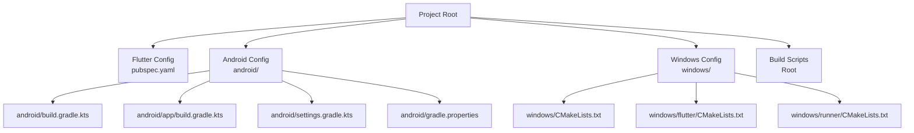
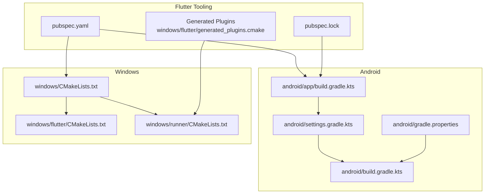
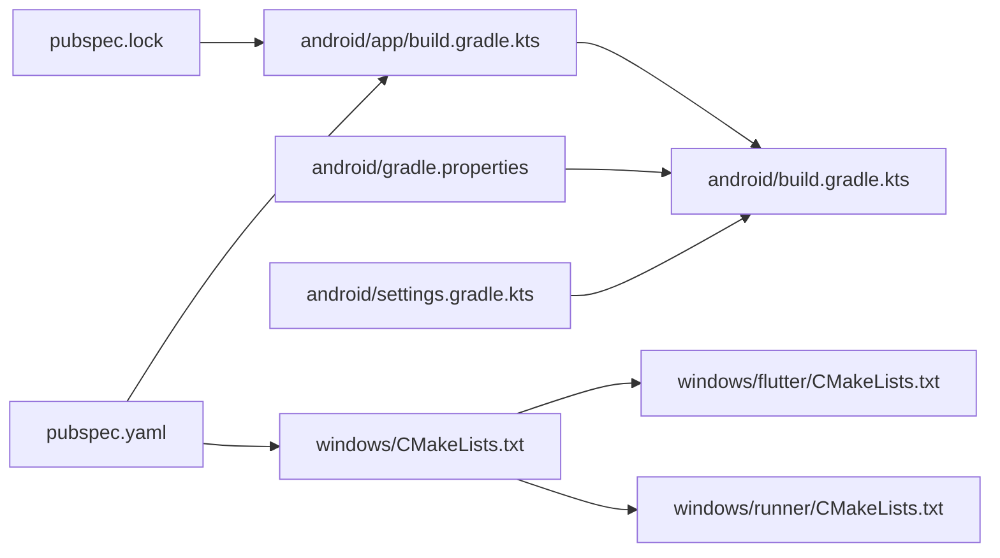

# Build Configuration

<cite>
**Referenced Files in This Document**
- [pubspec.yaml](file://pubspec.yaml)
- [pubspec.lock](file://pubspec.lock)
- [android/build.gradle.kts](file://android/build.gradle.kts)
- [android/app/build.gradle.kts](file://android/app/build.gradle.kts)
- [android/settings.gradle.kts](file://android/settings.gradle.kts)
- [android/gradle.properties](file://android/gradle.properties)
- [windows/CMakeLists.txt](file://windows/CMakeLists.txt)
- [windows/flutter/CMakeLists.txt](file://windows/flutter/CMakeLists.txt)
- [windows/runner/CMakeLists.txt](file://windows/runner/CMakeLists.txt)
- [build_install.bat](file://build_install.bat)
- [build_send.bat](file://build_send.bat)
</cite>

## Table of Contents
1. [Introduction](#introduction)
2. [Project Structure](#project-structure)
3. [Core Components](#core-components)
4. [Architecture Overview](#architecture-overview)
5. [Detailed Component Analysis](#detailed-component-analysis)
6. [Dependency Analysis](#dependency-analysis)
7. [Performance Considerations](#performance-considerations)
8. [Troubleshooting Guide](#troubleshooting-guide)
9. [Conclusion](#conclusion)

## Introduction
This document provides comprehensive build configuration documentation for QNote Flutter across platforms. It covers Flutter dependencies and assets, Android Gradle configuration, Windows CMake configuration, platform-specific requirements, build variants, optimization flags, and troubleshooting guidance. The goal is to help developers configure, optimize, and troubleshoot builds consistently and efficiently.

## Project Structure
QNote Flutter uses a standard Flutter project layout with platform-specific build files:
- Flutter application and assets are defined in the root pubspec.yaml.
- Android build configuration resides under android/, including Gradle settings and per-module build.gradle.kts.
- Windows desktop build configuration resides under windows/, including top-level CMakeLists.txt and runner/CMakeLists.txt.
- Build automation scripts exist under the project root for convenience.

**Diagram sources**
- [pubspec.yaml](file://pubspec.yaml)
- [android/build.gradle.kts](file://android/build.gradle.kts)
- [android/app/build.gradle.kts](file://android/app/build.gradle.kts)
- [android/settings.gradle.kts](file://android/settings.gradle.kts)
- [android/gradle.properties](file://android/gradle.properties)
- [windows/CMakeLists.txt](file://windows/CMakeLists.txt)
- [windows/flutter/CMakeLists.txt](file://windows/flutter/CMakeLists.txt)
- [windows/runner/CMakeLists.txt](file://windows/runner/CMakeLists.txt)

**Section sources**
- [pubspec.yaml](file://pubspec.yaml)
- [android/build.gradle.kts](file://android/build.gradle.kts)
- [android/app/build.gradle.kts](file://android/app/build.gradle.kts)
- [android/settings.gradle.kts](file://android/settings.gradle.kts)
- [android/gradle.properties](file://android/gradle.properties)
- [windows/CMakeLists.txt](file://windows/CMakeLists.txt)
- [windows/flutter/CMakeLists.txt](file://windows/flutter/CMakeLists.txt)
- [windows/runner/CMakeLists.txt](file://windows/runner/CMakeLists.txt)

## Core Components
This section summarizes the primary build configuration components and their roles.

- Flutter dependencies and assets
  - Declared in pubspec.yaml, including production dependencies, dev dependencies, and Flutter-specific assets and fonts.
  - Version pinning and lock file presence indicate deterministic dependency resolution.

- Android Gradle configuration
  - Centralized repository configuration and shared build directory management in android/build.gradle.kts.
  - Application module configuration in android/app/build.gradle.kts defines compile/target SDK, Java/Kotlin compatibility, linting, minSdk, targetSdk, multiDex, signing configuration, and desugaring.
  - Plugin management and inclusion in android/settings.gradle.kts.
  - Gradle JVM memory and AndroidX settings in android/gradle.properties.

- Windows CMake configuration
  - Top-level windows/CMakeLists.txt defines build modes (Debug, Profile, Release), compiler settings, installation rules, and asset bundling.
  - windows/flutter/CMakeLists.txt integrates Flutter’s engine and wrapper libraries.
  - windows/runner/CMakeLists.txt defines the desktop runner executable, linking, and dependencies.

**Section sources**
- [pubspec.yaml](file://pubspec.yaml)
- [pubspec.lock](file://pubspec.lock)
- [android/build.gradle.kts](file://android/build.gradle.kts)
- [android/app/build.gradle.kts](file://android/app/build.gradle.kts)
- [android/settings.gradle.kts](file://android/settings.gradle.kts)
- [android/gradle.properties](file://android/gradle.properties)
- [windows/CMakeLists.txt](file://windows/CMakeLists.txt)
- [windows/flutter/CMakeLists.txt](file://windows/flutter/CMakeLists.txt)
- [windows/runner/CMakeLists.txt](file://windows/runner/CMakeLists.txt)

## Architecture Overview
The build pipeline orchestrates Flutter tooling, platform compilers, and packaging steps.

**Diagram sources**
- [pubspec.yaml](file://pubspec.yaml)
- [pubspec.lock](file://pubspec.lock)
- [android/app/build.gradle.kts](file://android/app/build.gradle.kts)
- [android/settings.gradle.kts](file://android/settings.gradle.kts)
- [android/gradle.properties](file://android/gradle.properties)
- [android/build.gradle.kts](file://android/build.gradle.kts)
- [windows/CMakeLists.txt](file://windows/CMakeLists.txt)
- [windows/flutter/CMakeLists.txt](file://windows/flutter/CMakeLists.txt)
- [windows/runner/CMakeLists.txt](file://windows/runner/CMakeLists.txt)

## Detailed Component Analysis

### Flutter pubspec.yaml Configuration
- Environment and SDK
  - Dart SDK constraint ensures compatibility with the specified Flutter SDK.
- Dependencies
  - Includes UI, routing, networking, rich text editing, charts, notifications, file handling, localization, persistence, utilities, and animations.
- Dev dependencies
  - Testing framework, linters, and launcher icon generation.
- Flutter assets and fonts
  - Assets directory included for images.
  - Fonts configured with multiple weights for Inter font family.
- Launcher icons
  - Android enabled, iOS disabled, pointing to a PNG icon asset.
  - Minimum Android SDK requirement for launcher icons is set.

**Section sources**
- [pubspec.yaml](file://pubspec.yaml)

### Android Gradle Configuration
- Repositories and build directory
  - Google and Maven Central repositories declared globally.
  - Shared build directory relocated to a central location and propagated to subprojects.
- Subproject evaluation
  - Ensures evaluation order depends on the app module.
- Clean task
  - Deletes the centralized build directory.
- Application module
  - Plugins: Android application, Kotlin Android, Flutter Gradle Plugin (applied last).
  - Android block:
    - Namespace and compile SDK derived from Flutter.
    - NDK version from Flutter.
    - Java 17 compatibility for desugaring and Kotlin.
    - Linting flags for deprecations and unchecked operations.
    - Default config:
      - Application ID, minSdk, targetSdk, version code/name from Flutter.
      - MultiDex enabled.
    - Build types:
      - Release uses debug signing configuration by default.
  - Flutter source path set to root.
  - Desugaring dependency included.

**Section sources**
- [android/build.gradle.kts](file://android/build.gradle.kts)
- [android/app/build.gradle.kts](file://android/app/build.gradle.kts)

### Android Settings and Plugin Management
- Plugin management
  - Locates Flutter SDK path from local.properties and includes Flutter’s Gradle build script.
  - Repositories include Google, Maven Central, and Gradle Plugin Portal.
- Plugins
  - Flutter plugin loader, Android Gradle Plugin, and Kotlin Android plugins declared with versions and applied conditionally.
- Included module
  - Includes the app module.

**Section sources**
- [android/settings.gradle.kts](file://android/settings.gradle.kts)

### Android Gradle Properties
- JVM memory and heap settings
  - Increased heap and metaspace sizes, reserved code cache size, and heap dump on OOM.
- AndroidX
  - AndroidX migration enabled.

**Section sources**
- [android/gradle.properties](file://android/gradle.properties)

### Windows CMake Configuration
- Top-level configuration
  - Minimum CMake version and project definition.
  - Build types: Debug, Profile, Release; Profile mirrors Release flags.
  - Unicode definitions.
  - Standard compiler settings applied via a helper function:
    - C++17 standard, warning level, external warnings, exception model, and debug definitions.
  - Flutter managed directory and subdirectories:
    - Adds Flutter managed directory and runner subdirectory.
  - Generated plugins included.
  - Installation rules:
    - Installs runtime binaries and libraries to the executable directory.
    - Copies ICU data and Flutter engine library.
    - Installs native assets and Flutter assets.
    - Installs AOT library only for Profile and Release.
- Flutter integration
  - Includes generated_config.cmake and sets Flutter library and headers.
  - Adds Flutter wrapper libraries and links them into the app.
  - Assembles Flutter artifacts via a phony command.
- Runner
  - Defines the executable with source files and resources.
  - Applies standard settings and links Flutter wrappers and system libraries.
  - Adds dependency on Flutter assembly.

**Section sources**
- [windows/CMakeLists.txt](file://windows/CMakeLists.txt)
- [windows/flutter/CMakeLists.txt](file://windows/flutter/CMakeLists.txt)
- [windows/runner/CMakeLists.txt](file://windows/runner/CMakeLists.txt)

### Build Variants and Purposes
- Android
  - Debug: default development variant.
  - Release: production variant; currently shares debug signing configuration for convenience during development.
  - Profile: not explicitly defined in the app module; defaults mirror Release behavior.
- Windows
  - Debug: development with debug symbols and definitions.
  - Profile: optimized production-like build with mirrored Release flags.
  - Release: optimized production build.

**Section sources**
- [android/app/build.gradle.kts](file://android/app/build.gradle.kts)
- [windows/CMakeLists.txt](file://windows/CMakeLists.txt)

### Platform-Specific Build Requirements and Compatibility
- Android
  - Compile SDK and NDK version sourced from Flutter.
  - Java 17 compatibility and desugaring enabled.
  - minSdk and targetSdk defined in the app module.
  - MultiDex enabled.
- Windows
  - C++17 standard enforced.
  - Unicode definitions enabled.
  - Flutter engine and wrapper libraries linked.
  - AOT library installed for Profile/Release.

**Section sources**
- [android/app/build.gradle.kts](file://android/app/build.gradle.kts)
- [windows/CMakeLists.txt](file://windows/CMakeLists.txt)
- [windows/flutter/CMakeLists.txt](file://windows/flutter/CMakeLists.txt)
- [windows/runner/CMakeLists.txt](file://windows/runner/CMakeLists.txt)

### Build Optimization Flags and Settings
- Android
  - Java 17 compatibility and desugaring enabled.
  - Lint flags for deprecations and unchecked operations.
  - MultiDex enabled for larger apps.
- Windows
  - Warning level and external warning suppression.
  - Exception model disabled at target level.
  - Standard compiler features and definitions applied via helper function.

**Section sources**
- [android/app/build.gradle.kts](file://android/app/build.gradle.kts)
- [windows/CMakeLists.txt](file://windows/CMakeLists.txt)

### Build Cache Optimization and Incremental Compilation
- Centralized build directory
  - Android: build directory redirected to a shared location for unified caching.
- Gradle JVM settings
  - Android: increased heap, metaspace, and code cache sizes to support larger builds.
- Flutter asset and AOT installation
  - Windows: assets and AOT libraries installed conditionally to reduce unnecessary rebuilds.

**Section sources**
- [android/build.gradle.kts](file://android/build.gradle.kts)
- [android/gradle.properties](file://android/gradle.properties)
- [windows/CMakeLists.txt](file://windows/CMakeLists.txt)

### Build Automation Scripts
- Convenience scripts automate repeated tasks:
  - build_install.bat: cleans cache, builds APK for a specific architecture, and installs via ADB.
  - build_send.bat: builds APK for a specific architecture.
- These scripts streamline developer workflows for quick iteration and distribution.

**Section sources**
- [build_install.bat](file://build_install.bat)
- [build_send.bat](file://build_send.bat)

## Dependency Analysis
This section maps key build-time dependencies and their roles.

**Diagram sources**
- [pubspec.yaml](file://pubspec.yaml)
- [pubspec.lock](file://pubspec.lock)
- [android/app/build.gradle.kts](file://android/app/build.gradle.kts)
- [android/settings.gradle.kts](file://android/settings.gradle.kts)
- [android/gradle.properties](file://android/gradle.properties)
- [android/build.gradle.kts](file://android/build.gradle.kts)
- [windows/CMakeLists.txt](file://windows/CMakeLists.txt)
- [windows/flutter/CMakeLists.txt](file://windows/flutter/CMakeLists.txt)
- [windows/runner/CMakeLists.txt](file://windows/runner/CMakeLists.txt)

**Section sources**
- [pubspec.yaml](file://pubspec.yaml)
- [pubspec.lock](file://pubspec.lock)
- [android/app/build.gradle.kts](file://android/app/build.gradle.kts)
- [android/settings.gradle.kts](file://android/settings.gradle.kts)
- [android/gradle.properties](file://android/gradle.properties)
- [android/build.gradle.kts](file://android/build.gradle.kts)
- [windows/CMakeLists.txt](file://windows/CMakeLists.txt)
- [windows/flutter/CMakeLists.txt](file://windows/flutter/CMakeLists.txt)
- [windows/runner/CMakeLists.txt](file://windows/runner/CMakeLists.txt)

## Performance Considerations
- Android
  - Increase Gradle JVM memory limits to handle large dependency graphs.
  - Keep desugaring enabled for modern Java APIs on older minSdk.
  - Use multiDex for large applications; consider code shrinking in release builds.
- Windows
  - Use Release or Profile builds for production performance.
  - Rely on standard compiler settings and disable exceptions only where necessary.
  - Ensure assets and AOT libraries are installed conditionally to minimize rebuild overhead.

[No sources needed since this section provides general guidance]

## Troubleshooting Guide
- Android signing configuration
  - Release build currently uses debug signing; configure proper keystore for distribution.
- Android SDK and NDK versions
  - Ensure Flutter SDK and Android NDK versions align with the project’s compile/NDK settings.
- Windows AOT and assets
  - Verify AOT library installation only for Profile/Release configurations.
  - Confirm Flutter assets are copied during installation.
- Gradle memory issues
  - Increase JVM heap and metaspace sizes in gradle.properties if builds fail with out-of-memory errors.
- Build cache and incremental compilation
  - Use centralized build directory and clean tasks to resolve cache corruption.
  - Re-run Flutter tooling to regenerate platform-specific build artifacts when necessary.

**Section sources**
- [android/app/build.gradle.kts](file://android/app/build.gradle.kts)
- [android/gradle.properties](file://android/gradle.properties)
- [windows/CMakeLists.txt](file://windows/CMakeLists.txt)

## Conclusion
QNote Flutter’s build configuration integrates Flutter tooling with platform-specific Gradle and CMake setups. The Android configuration emphasizes modern Java compatibility and desugaring, while the Windows configuration enforces strict compiler standards and streamlined installation. By leveraging centralized build directories, optimized Gradle settings, and platform-specific flags, teams can achieve reliable and efficient builds across devices and operating systems.