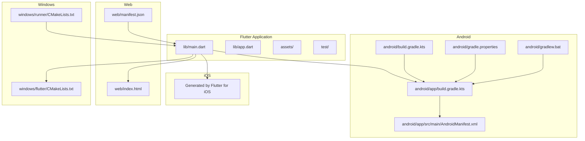
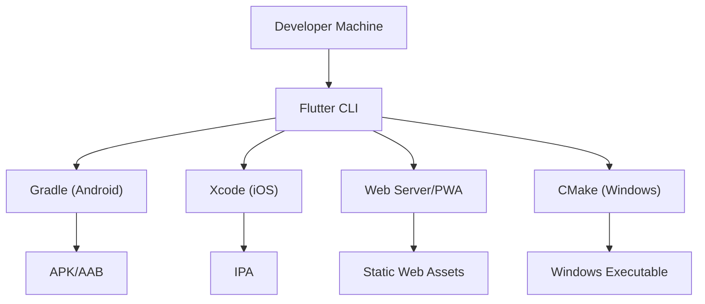
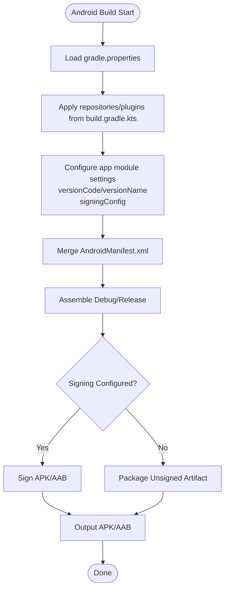
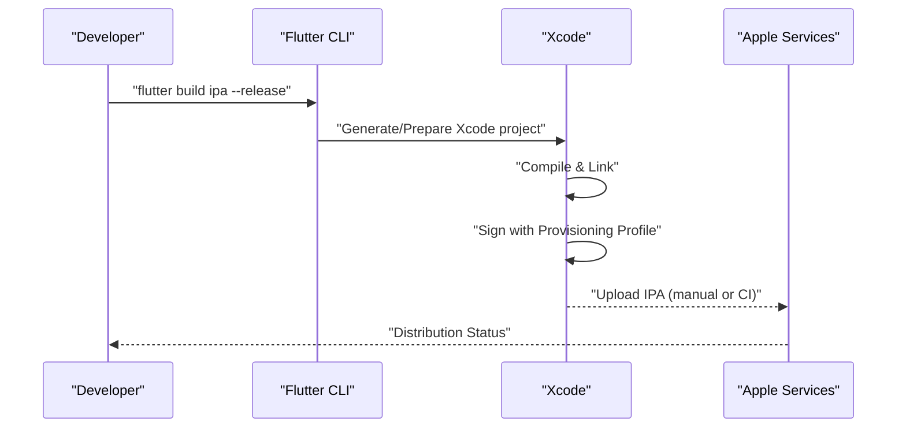
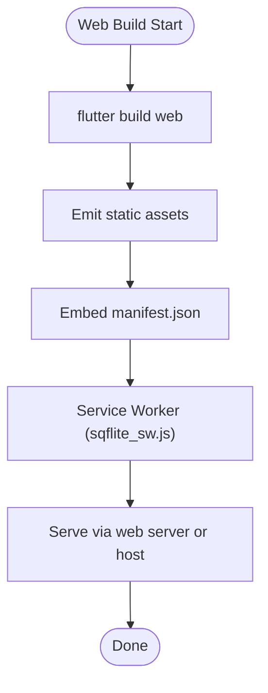
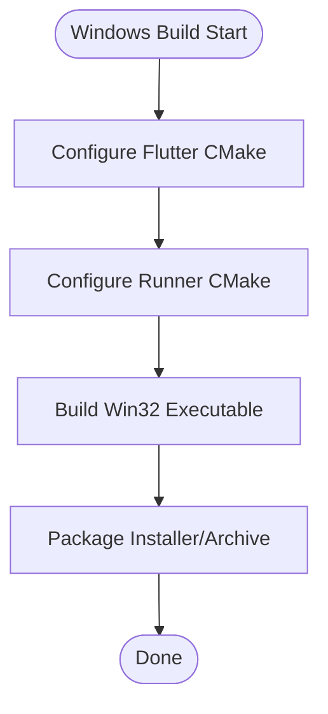
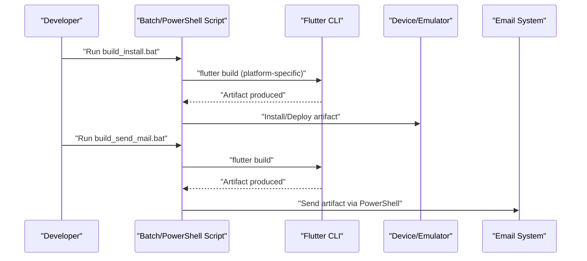
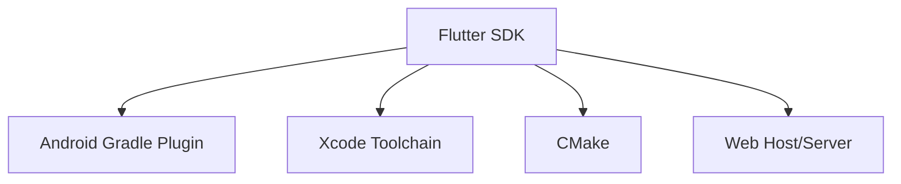

# Build and Deployment

<cite>
**Referenced Files in This Document**
- [pubspec.yaml](file://pubspec.yaml)
- [android/app/build.gradle.kts](file://android/app/build.gradle.kts)
- [android/build.gradle.kts](file://android/build.gradle.kts)
- [android/gradle.properties](file://android/gradle.properties)
- [android/gradlew.bat](file://android/gradlew.bat)
- [android/AndroidManifest.xml](file://android/app/src/main/AndroidManifest.xml)
- [windows/flutter/CMakeLists.txt](file://windows/flutter/CMakeLists.txt)
- [windows/runner/CMakeLists.txt](file://windows/runner/CMakeLists.txt)
- [web/index.html](file://web/index.html)
- [web/manifest.json](file://web/manifest.json)
- [lib/main.dart](file://lib/main.dart)
- [lib/app.dart](file://lib/app.dart)
- [build_install.bat](file://build_install.bat)
- [build_send.bat](file://build_send.bat)
- [build_send_mail.bat](file://build_send_mail.bat)
- [send_email.ps1](file://send_email.ps1)
- [send_email_split.ps1](file://send_email_split.ps1)
- [sync_to_share.ps1](file://sync_to_share.ps1)
- [一键归纳更新.bat](file://一键归纳更新.bat)
- [01构建到手机命令.md](file://01构建到手机命令.md)
</cite>

## Table of Contents
1. [Introduction](#introduction)
2. [Project Structure](#project-structure)
3. [Core Components](#core-components)
4. [Architecture Overview](#architecture-overview)
5. [Detailed Component Analysis](#detailed-component-analysis)
6. [Dependency Analysis](#dependency-analysis)
7. [Performance Considerations](#performance-considerations)
8. [Troubleshooting Guide](#troubleshooting-guide)
9. [Conclusion](#conclusion)
10. [Appendices](#appendices)

## Introduction
This document provides comprehensive build and deployment guidance for QNote Flutter across Android, iOS (via Flutter for iOS), web, and Windows platforms. It covers build configuration, signing and certificates, deployment channels, release preparation, automation scripts, optimization strategies, and troubleshooting. The goal is to enable reliable, repeatable builds and deployments for development, testing, and production environments.

## Project Structure
QNote Flutter is a Flutter application with platform-specific configurations under android/, ios (generated via Flutter), web/, and windows/. The primary application entry points are lib/main.dart and lib/app.dart. Platform packaging and signing are configured in Gradle for Android and Xcode for iOS. Web deployment uses web/ assets and PWA manifests. Windows packaging uses CMake-based runners.

**Diagram sources**
- [lib/main.dart](file://lib/main.dart)
- [lib/app.dart](file://lib/app.dart)
- [android/app/build.gradle.kts](file://android/app/build.gradle.kts)
- [android/build.gradle.kts](file://android/build.gradle.kts)
- [android/gradle.properties](file://android/gradle.properties)
- [android/AndroidManifest.xml](file://android/app/src/main/AndroidManifest.xml)
- [android/gradlew.bat](file://android/gradlew.bat)
- [windows/flutter/CMakeLists.txt](file://windows/flutter/CMakeLists.txt)
- [windows/runner/CMakeLists.txt](file://windows/runner/CMakeLists.txt)
- [web/index.html](file://web/index.html)
- [web/manifest.json](file://web/manifest.json)

**Section sources**
- [pubspec.yaml](file://pubspec.yaml)
- [lib/main.dart](file://lib/main.dart)
- [lib/app.dart](file://lib/app.dart)

## Core Components
- Flutter application entry points: lib/main.dart and lib/app.dart define the runtime application structure and initialization.
- Android build system: Gradle Kotlin DSL files configure compile SDK, target SDK, signing, and packaging.
- Web deployment: web/index.html and web/manifest.json support Progressive Web App deployment.
- Windows packaging: CMakeLists.txt files in windows/ configure the Win32 runner and Flutter integration.
- Automation scripts: Batch and PowerShell scripts orchestrate local builds, installation, sending builds, and notifications.

Key build configuration anchors:
- Application metadata and dependencies: pubspec.yaml
- Android app module build: android/app/build.gradle.kts
- Android project-wide build: android/build.gradle.kts
- Android Gradle properties: android/gradle.properties
- Android Gradle wrapper launcher: android/gradlew.bat
- Android manifest: android/app/src/main/AndroidManifest.xml
- Windows Flutter integration CMake: windows/flutter/CMakeLists.txt
- Windows runner CMake: windows/runner/CMakeLists.txt
- Web assets and manifest: web/index.html, web/manifest.json

**Section sources**
- [pubspec.yaml](file://pubspec.yaml)
- [android/app/build.gradle.kts](file://android/app/build.gradle.kts)
- [android/build.gradle.kts](file://android/build.gradle.kts)
- [android/gradle.properties](file://android/gradle.properties)
- [android/AndroidManifest.xml](file://android/app/src/main/AndroidManifest.xml)
- [windows/flutter/CMakeLists.txt](file://windows/flutter/CMakeLists.txt)
- [windows/runner/CMakeLists.txt](file://windows/runner/CMakeLists.txt)
- [web/index.html](file://web/index.html)
- [web/manifest.json](file://web/manifest.json)

## Architecture Overview
The build pipeline integrates Flutter tooling with platform-native toolchains:
- Flutter compiles Dart code to platform-specific binaries/runners.
- Android uses Gradle to assemble APK/AAB artifacts with optional signing.
- iOS builds are produced via Xcode (managed by Flutter).
- Web builds produce static assets with service worker support.
- Windows builds use CMake to produce a Win32 executable.

[No sources needed since this diagram shows conceptual workflow, not actual code structure]

## Detailed Component Analysis

### Android Build Configuration
Android builds are defined in Gradle Kotlin DSL files. The app-level build.gradle.kts configures applicationId, versionCode/versionName, compile/target SDK, signingConfig, and packaging options. The root build.gradle.kts defines repositories and plugin versions. Gradle properties centralize sensitive settings like keystore location and passwords. The Gradle wrapper launcher simplifies invoking Gradle tasks.

**Diagram sources**
- [android/app/build.gradle.kts](file://android/app/build.gradle.kts)
- [android/build.gradle.kts](file://android/build.gradle.kts)
- [android/gradle.properties](file://android/gradle.properties)
- [android/AndroidManifest.xml](file://android/app/src/main/AndroidManifest.xml)

Key configuration anchors:
- Versioning and identifiers: applicationId, versionCode, versionName in app build script.
- Signing: keystore path and credentials in gradle.properties.
- Packaging: APK vs AAB selection and minify/proguard settings in app build script.
- Manifest merging: permissions and activities in AndroidManifest.xml.

**Section sources**
- [android/app/build.gradle.kts](file://android/app/build.gradle.kts)
- [android/build.gradle.kts](file://android/build.gradle.kts)
- [android/gradle.properties](file://android/gradle.properties)
- [android/AndroidManifest.xml](file://android/app/src/main/AndroidManifest.xml)

### iOS Build Configuration
iOS builds are managed by Flutter and Xcode. The project integrates with Xcode for compilation, signing, and packaging. Ensure valid provisioning profiles and certificates are installed in Xcode. Flutter generates the necessary Xcode project files and manages dependencies.

[No sources needed since this diagram shows conceptual workflow, not actual code structure]

### Web Build Configuration
Web builds produce static assets and a PWA manifest. The web/index.html serves as the HTML entry, while web/manifest.json defines PWA metadata and icons. Service worker logic is present for offline capabilities.

**Diagram sources**
- [web/index.html](file://web/index.html)
- [web/manifest.json](file://web/manifest.json)
- [web/sqflite_sw.js](file://web/sqflite_sw.js)

**Section sources**
- [web/index.html](file://web/index.html)
- [web/manifest.json](file://web/manifest.json)

### Windows Build Configuration
Windows builds rely on CMake to produce a Win32 executable. The Flutter integration CMakeLists.txt configures Flutter engine linkage, and the runner CMakeLists.txt configures the Win32 application entry and resources.

**Diagram sources**
- [windows/flutter/CMakeLists.txt](file://windows/flutter/CMakeLists.txt)
- [windows/runner/CMakeLists.txt](file://windows/runner/CMakeLists.txt)

**Section sources**
- [windows/flutter/CMakeLists.txt](file://windows/flutter/CMakeLists.txt)
- [windows/runner/CMakeLists.txt](file://windows/runner/CMakeLists.txt)

### Build Commands and Scripts
Automated scripts streamline local builds and distribution:
- build_install.bat: Builds and installs the app on a connected device/emulator.
- build_send.bat: Builds and sends the artifact to recipients.
- build_send_mail.bat: Builds and emails the artifact.
- send_email.ps1: PowerShell script for email delivery.
- send_email_split.ps1: PowerShell script for split-email delivery.
- sync_to_share.ps1: Synchronizes build outputs to shared locations.
- 一键归纳更新.bat: Aggregates updates and prepares releases.

**Diagram sources**
- [build_install.bat](file://build_install.bat)
- [build_send.bat](file://build_send.bat)
- [build_send_mail.bat](file://build_send_mail.bat)
- [send_email.ps1](file://send_email.ps1)
- [send_email_split.ps1](file://send_email_split.ps1)
- [sync_to_share.ps1](file://sync_to_share.ps1)
- [一键归纳更新.bat](file://一键归纳更新.bat)

**Section sources**
- [build_install.bat](file://build_install.bat)
- [build_send.bat](file://build_send.bat)
- [build_send_mail.bat](file://build_send_mail.bat)
- [send_email.ps1](file://send_email.ps1)
- [send_email_split.ps1](file://send_email_split.ps1)
- [sync_to_share.ps1](file://sync_to_share.ps1)
- [一键归纳更新.bat](file://一键归纳更新.bat)

## Dependency Analysis
The build system depends on:
- Flutter SDK for cross-platform compilation.
- Android Gradle Plugin for Android packaging.
- Xcode toolchain for iOS builds.
- CMake for Windows packaging.
- Web server/hosting for web deployment.

[No sources needed since this diagram shows conceptual dependencies, not specific code structure]

## Performance Considerations
- Enable tree shaking and minification for production builds to reduce bundle size.
- Optimize image assets and font loading for web and mobile.
- Use AAB for Android distribution to benefit from Play Store dynamic delivery.
- Leverage precompilation and ahead-of-time optimizations where supported by the platform.
- Monitor build times and cache Gradle and Flutter artifacts to speed up CI runs.

[No sources needed since this section provides general guidance]

## Troubleshooting Guide
Common build and deployment issues:
- Android signing failures: Verify keystore path and credentials in gradle.properties; ensure signingConfig is applied in the app build script.
- Missing Android SDK/NDK: Confirm SDK paths and NDK availability; set JAVA_HOME and ANDROID_SDK_ROOT appropriately.
- iOS code signing errors: Ensure valid provisioning profiles and certificates are installed; check team ID and bundle identifier alignment.
- Web build errors: Validate web/index.html and web/manifest.json; confirm service worker registration and caching strategy.
- Windows build failures: Ensure CMake and Visual Studio build tools are installed; verify Flutter doctor output for Windows setup.
- Automation script failures: Check script permissions, PowerShell execution policy, and network connectivity for email delivery.

**Section sources**
- [android/gradle.properties](file://android/gradle.properties)
- [android/app/build.gradle.kts](file://android/app/build.gradle.kts)
- [web/index.html](file://web/index.html)
- [web/manifest.json](file://web/manifest.json)
- [windows/flutter/CMakeLists.txt](file://windows/flutter/CMakeLists.txt)
- [windows/runner/CMakeLists.txt](file://windows/runner/CMakeLists.txt)

## Conclusion
QNote Flutter supports multi-platform builds with platform-specific configurations and automation scripts. By aligning versioning, signing, and packaging settings with the referenced configuration files and leveraging the provided scripts, teams can achieve reliable, repeatable builds and deployments across Android, iOS, web, and Windows.

[No sources needed since this section summarizes without analyzing specific files]

## Appendices

### Release Preparation and Version Management
- Update versionCode/versionName in the Android app build script for each release.
- Align pubspec.yaml version with release tags for Flutter packages.
- Tag releases in version control and publish release notes.
- Prepare changelogs and update web manifest for PWA updates.

**Section sources**
- [android/app/build.gradle.kts](file://android/app/build.gradle.kts)
- [pubspec.yaml](file://pubspec.yaml)
- [web/manifest.json](file://web/manifest.json)

### Deployment Channels
- Android: Publish AAB to Google Play Console; configure internal/test/release tracks.
- iOS: Upload IPA via Xcode Organizer or Transporter; manage TestFlight and App Store Connect.
- Web: Deploy static assets to hosting; ensure HTTPS and proper caching headers.
- Windows: Distribute executables or installers via website or package managers.

[No sources needed since this section provides general guidance]

### Continuous Integration and Automated Deployment
- Configure CI jobs to run Flutter doctor, tests, and platform-specific builds.
- Cache Gradle and Flutter artifacts to speed up pipelines.
- Automate signing secrets storage and retrieval in CI environments.
- Integrate email or notification steps after successful builds.

[No sources needed since this section provides general guidance]