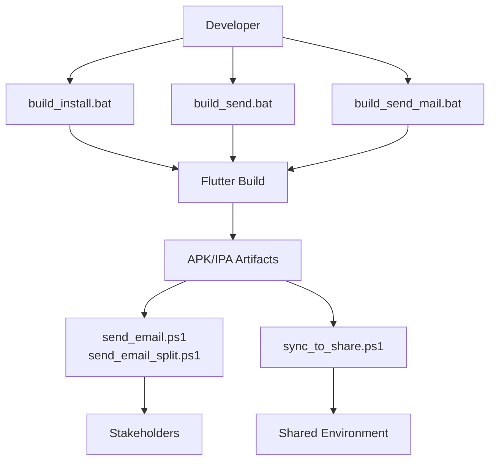
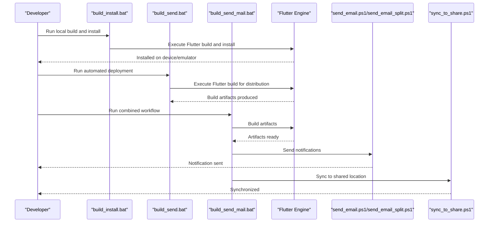
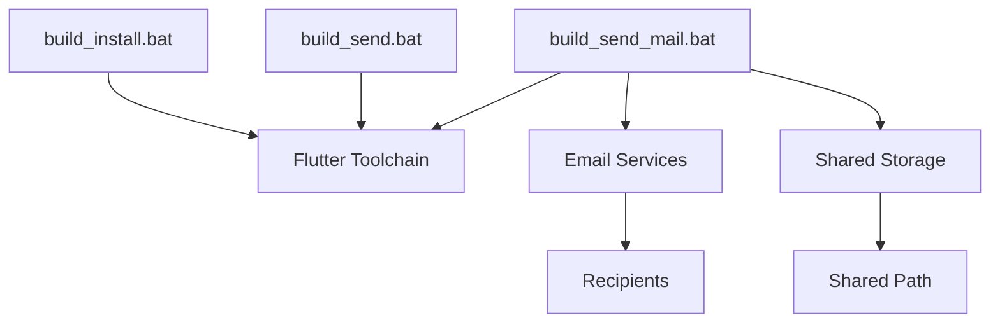

# Deployment Process

<cite>
**Referenced Files in This Document**
- [build_install.bat](file://build_install.bat)
- [build_send.bat](file://build_send.bat)
- [build_send_mail.bat](file://build_send_mail.bat)
- [send_email.ps1](file://send_email.ps1)
- [send_email_split.ps1](file://send_email_split.ps1)
- [sync_to_share.ps1](file://sync_to_share.ps1)
- [pubspec.yaml](file://pubspec.yaml)
- [应用分享/pubspec.yaml](file://应用分享/pubspec.yaml)
- [01构建到手机命令.md](file://01构建到手机命令.md)
</cite>

## Table of Contents
1. [Introduction](#introduction)
2. [Project Structure](#project-structure)
3. [Core Components](#core-components)
4. [Architecture Overview](#architecture-overview)
5. [Detailed Component Analysis](#detailed-component-analysis)
6. [Dependency Analysis](#dependency-analysis)
7. [Performance Considerations](#performance-considerations)
8. [Troubleshooting Guide](#troubleshooting-guide)
9. [Conclusion](#conclusion)

## Introduction
This document describes the complete deployment workflow for QNote Flutter, covering build, testing, distribution, and post-deployment verification. It explains the automated scripts for local installation and testing, automated deployment processes, email notifications, and synchronization to shared environments. It also covers release preparation, channel-specific deployments, rollback procedures, monitoring, and security considerations for deployment artifacts.

## Project Structure
The deployment pipeline centers around several Windows batch and PowerShell scripts alongside Flutter configuration files. The primary scripts orchestrate building, installing, sending builds, notifying stakeholders via email, and synchronizing artifacts to shared locations. Versioning and metadata are managed through Flutter package configuration files.

**Diagram sources**
- [build_install.bat](file://build_install.bat)
- [build_send.bat](file://build_send.bat)
- [build_send_mail.bat](file://build_send_mail.bat)
- [send_email.ps1](file://send_email.ps1)
- [send_email_split.ps1](file://send_email_split.ps1)
- [sync_to_share.ps1](file://sync_to_share.ps1)

**Section sources**
- [build_install.bat](file://build_install.bat)
- [build_send.bat](file://build_send.bat)
- [build_send_mail.bat](file://build_send_mail.bat)
- [send_email.ps1](file://send_email.ps1)
- [send_email_split.ps1](file://send_email_split.ps1)
- [sync_to_share.ps1](file://sync_to_share.ps1)
- [pubspec.yaml](file://pubspec.yaml)
- [应用分享/pubspec.yaml](file://应用分享/pubspec.yaml)
- [01构建到手机命令.md](file://01构建到手机命令.md)

## Core Components
- Local build and install automation: build_install.bat
- Automated deployment pipeline: build_send.bat
- Combined build, send, and email workflow: build_send_mail.bat
- Email notification: send_email.ps1 and send_email_split.ps1
- Shared environment synchronization: sync_to_share.ps1
- Version and metadata management: pubspec.yaml and 应用分享/pubspec.yaml
- Device build commands reference: 01构建到手机命令.md

**Section sources**
- [build_install.bat](file://build_install.bat)
- [build_send.bat](file://build_send.bat)
- [build_send_mail.bat](file://build_send_mail.bat)
- [send_email.ps1](file://send_email.ps1)
- [send_email_split.ps1](file://send_email_split.ps1)
- [sync_to_share.ps1](file://sync_to_share.ps1)
- [pubspec.yaml](file://pubspec.yaml)
- [应用分享/pubspec.yaml](file://应用分享/pubspec.yaml)
- [01构建到手机命令.md](file://01构建到手机命令.md)

## Architecture Overview
The deployment architecture integrates developer actions with automated scripts to produce build artifacts, notify stakeholders, and distribute to shared environments. The flow supports local testing and remote distribution channels.

**Diagram sources**
- [build_install.bat](file://build_install.bat)
- [build_send.bat](file://build_send.bat)
- [build_send_mail.bat](file://build_send_mail.bat)
- [send_email.ps1](file://send_email.ps1)
- [send_email_split.ps1](file://send_email_split.ps1)
- [sync_to_share.ps1](file://sync_to_share.ps1)

## Detailed Component Analysis

### Local Installation and Testing Script (build_install.bat)
Purpose:
- Automates building and installing the application locally for testing on connected devices or emulators.

Key capabilities:
- Executes Flutter build commands tailored for local installation.
- Installs the resulting artifact on target devices/emulators.
- Supports quick iteration during development and QA phases.

Operational flow:
- Developer triggers the script.
- Script invokes Flutter build/install steps.
- On completion, the app is installed and ready for immediate testing.

Security considerations:
- Ensure device/emulator trust and signing configurations are appropriate.
- Limit script execution to trusted development environments.

Post-installation verification:
- Launch the app manually or via automated tests.
- Confirm logs and device connectivity.

**Section sources**
- [build_install.bat](file://build_install.bat)
- [01构建到手机命令.md](file://01构建到手机命令.md)

### Automated Deployment Script (build_send.bat)
Purpose:
- Produces distribution-ready artifacts and prepares them for release channels.

Key capabilities:
- Builds optimized artifacts suitable for internal testing and production.
- Coordinates artifact generation and packaging.
- Integrates with downstream distribution and notification steps.

Operational flow:
- Developer runs the script to initiate the build process.
- Script compiles the application for distribution.
- Artifacts are prepared for sharing and notification.

Channel considerations:
- Internal testing: Use staging or internal distribution links.
- Production: Use secure release channels with signed artifacts.

**Section sources**
- [build_send.bat](file://build_send.bat)

### Combined Workflow Script (build_send_mail.bat)
Purpose:
- Orchestrates building, artifact preparation, email notifications, and shared synchronization in one workflow.

Key capabilities:
- Executes build_send.bat internally.
- Sends email notifications to stakeholders.
- Synchronizes artifacts to a shared environment.

Operational flow:
- Developer runs the script to automate the entire release pipeline.
- Script coordinates build, email, and share steps.
- Ensures timely communication and artifact availability.

**Section sources**
- [build_send_mail.bat](file://build_send_mail.bat)

### Email Notification Scripts (send_email.ps1 and send_email_split.ps1)
Purpose:
- Sends email notifications upon successful build completion and artifact availability.
- Provides split notification support for targeted stakeholder groups.

Key capabilities:
- Integrates with email servers or APIs to dispatch notifications.
- Supports splitting recipients for internal and external stakeholders.
- Can attach or reference build artifacts in notifications.

Operational flow:
- After build completion, the script is invoked to send notifications.
- Recipients receive updates with links or attachments to artifacts.

**Section sources**
- [send_email.ps1](file://send_email.ps1)
- [send_email_split.ps1](file://send_email_split.ps1)

### Shared Environment Synchronization (sync_to_share.ps1)
Purpose:
- Synchronizes build artifacts to a shared environment for wider access.

Key capabilities:
- Copies or moves artifacts to a designated shared location.
- Maintains organized artifact storage with version-aware naming.
- Supports access control and permissions for the shared environment.

Operational flow:
- Invoked after build completion.
- Artifacts are synchronized to the shared drive/network location.
- Stakeholders access artifacts from the shared environment.

**Section sources**
- [sync_to_share.ps1](file://sync_to_share.ps1)

### Version Management and Release Preparation
Versioning:
- Version and build metadata are defined in pubspec.yaml and 应用分享/pubspec.yaml.
- Ensure version increments align with release cadence and semantic versioning.

Changelog generation:
- Maintain a changelog reflecting features, fixes, and breaking changes.
- Include pre-release notes for internal testing and production release notes separately.

Asset verification:
- Verify icon assets, splash screens, and platform-specific resources.
- Validate signing certificates and entitlements for iOS/APK signatures.

Release preparation checklist:
- Confirm version bump and changelog entries.
- Run final tests on representative devices.
- Archive artifacts with timestamps and checksums.
- Prepare release notes per channel (internal vs production).

**Section sources**
- [pubspec.yaml](file://pubspec.yaml)
- [应用分享/pubspec.yaml](file://应用分享/pubspec.yaml)

### Channel-Specific Deployment Procedures
Internal testing:
- Use build_send.bat to create internal-test artifacts.
- Distribute via internal links or shared environment.
- Notify testers via send_email.ps1.

Production release:
- Use build_send_mail.bat to trigger build, email, and share.
- Ensure signed and hardened artifacts.
- Publish to production distribution channels.

Shared environment distribution:
- Use sync_to_share.ps1 to publish artifacts.
- Maintain versioned folders and update pointers as needed.

**Section sources**
- [build_send.bat](file://build_send.bat)
- [build_send_mail.bat](file://build_send_mail.bat)
- [send_email.ps1](file://send_email.ps1)
- [sync_to_share.ps1](file://sync_to_share.ps1)

### Rollback Procedures
Rollback steps:
- Revert to the last known good artifact stored in the shared environment.
- Update version pointers and notify stakeholders.
- Validate rollback on internal testing channels before production.

Monitoring:
- Track artifact delivery and access logs from the shared environment.
- Monitor email delivery confirmations.

**Section sources**
- [sync_to_share.ps1](file://sync_to_share.ps1)

### Post-Deployment Verification
Verification steps:
- Confirm app launches and core functionality on multiple devices.
- Validate network connectivity and backend integrations.
- Review crash reports and analytics if available.

**Section sources**
- [build_install.bat](file://build_install.bat)

## Dependency Analysis
The deployment scripts depend on Flutter tooling and platform-specific build outputs. Email and synchronization rely on external services configured in the respective scripts.

**Diagram sources**
- [build_install.bat](file://build_install.bat)
- [build_send.bat](file://build_send.bat)
- [build_send_mail.bat](file://build_send_mail.bat)
- [send_email.ps1](file://send_email.ps1)
- [send_email_split.ps1](file://send_email_split.ps1)
- [sync_to_share.ps1](file://sync_to_share.ps1)

**Section sources**
- [build_install.bat](file://build_install.bat)
- [build_send.bat](file://build_send.bat)
- [build_send_mail.bat](file://build_send_mail.bat)
- [send_email.ps1](file://send_email.ps1)
- [send_email_split.ps1](file://send_email_split.ps1)
- [sync_to_share.ps1](file://sync_to_share.ps1)

## Performance Considerations
- Optimize build times by caching dependencies and incremental builds.
- Parallelize email and share operations where safe and supported.
- Minimize artifact sizes while preserving quality and functionality.

## Troubleshooting Guide
Common issues and resolutions:
- Build failures: Review script logs and Flutter doctor output; ensure environment variables and SDK paths are set.
- Email delivery failures: Verify SMTP settings and recipient lists in the email scripts.
- Share synchronization errors: Confirm network connectivity and write permissions to the shared location.
- Device installation issues: Check device compatibility, USB debugging, and driver installations.

**Section sources**
- [build_install.bat](file://build_install.bat)
- [build_send.bat](file://build_send.bat)
- [send_email.ps1](file://send_email.ps1)
- [send_email_split.ps1](file://send_email_split.ps1)
- [sync_to_share.ps1](file://sync_to_share.ps1)

## Conclusion
QNote Flutter’s deployment process combines automated scripts for building, distributing, notifying, and sharing artifacts. By following the outlined procedures—local testing, release preparation, channel-specific distribution, monitoring, and rollback—the team can maintain reliable and secure releases across internal and production environments.