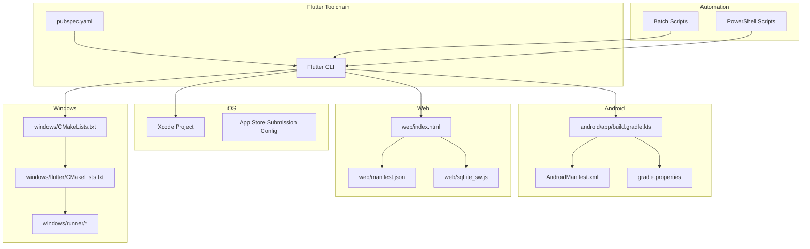
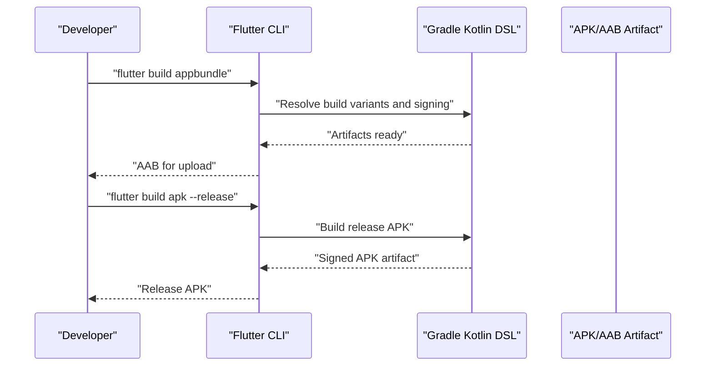
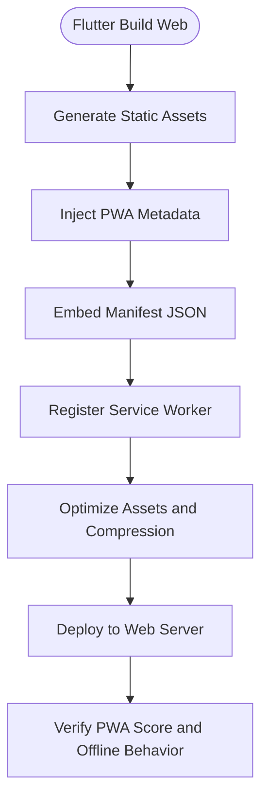
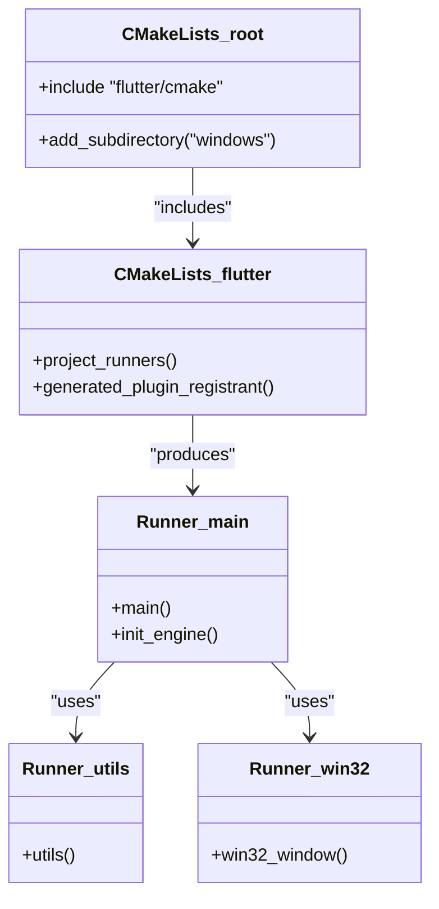
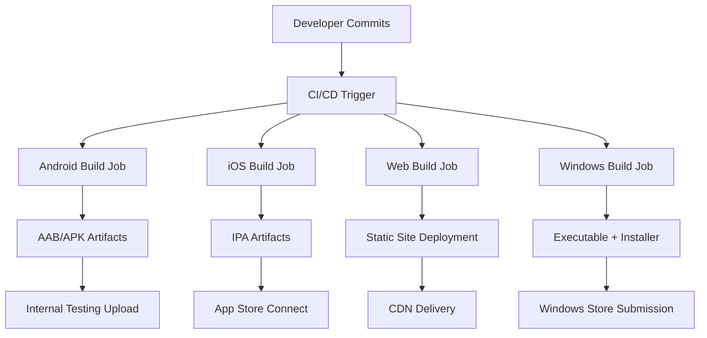
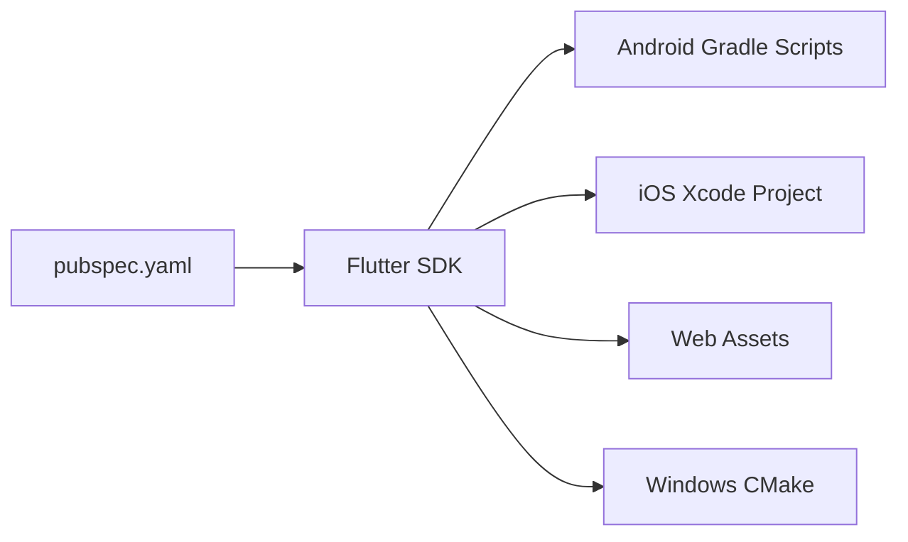

# Platform-Specific Builds

<cite>
**Referenced Files in This Document**
- [pubspec.yaml](file://pubspec.yaml)
- [android/app/build.gradle.kts](file://android/app/build.gradle.kts)
- [android/app/src/main/AndroidManifest.xml](file://android/app/src/main/AndroidManifest.xml)
- [android/build.gradle.kts](file://android/build.gradle.kts)
- [android/gradle.properties](file://android/gradle.properties)
- [android/settings.gradle.kts](file://android/settings.gradle.kts)
- [web/index.html](file://web/index.html)
- [web/manifest.json](file://web/manifest.json)
- [web/sqflite_sw.js](file://web/sqflite_sw.js)
- [windows/CMakeLists.txt](file://windows/CMakeLists.txt)
- [windows/flutter/CMakeLists.txt](file://windows/flutter/CMakeLists.txt)
- [windows/runner/main.cpp](file://windows/runner/main.cpp)
- [windows/runner/utils.cpp](file://windows/runner/utils.cpp)
- [windows/runner/win32_window.cpp](file://windows/runner/win32_window.cpp)
- [build_install.bat](file://build_install.bat)
- [build_send.bat](file://build_send.bat)
- [build_send_mail.bat](file://build_send_mail.bat)
- [send_email.ps1](file://send_email.ps1)
- [send_email_split.ps1](file://send_email_split.ps1)
- [sync_to_share.ps1](file://sync_to_share.ps1)
- [01构建到手机命令.md](file://01构建到手机命令.md)
</cite>

## Table of Contents
1. [Introduction](#introduction)
2. [Project Structure](#project-structure)
3. [Core Components](#core-components)
4. [Architecture Overview](#architecture-overview)
5. [Detailed Component Analysis](#detailed-component-analysis)
6. [Dependency Analysis](#dependency-analysis)
7. [Performance Considerations](#performance-considerations)
8. [Troubleshooting Guide](#troubleshooting-guide)
9. [Conclusion](#conclusion)
10. [Appendices](#appendices)

## Introduction
This document provides comprehensive platform-specific build documentation for QNote Flutter. It covers Android (APK/AAB), iOS (Xcode configuration), Web (PWA), Windows Desktop (executable and installer), and CI/CD automation. The guide focuses on build commands, signing configuration, asset bundling, platform-specific optimizations, verification procedures, and troubleshooting derived from the repository's configuration files.

## Project Structure
QNote Flutter supports multiple platforms with dedicated configuration files:
- Android: Gradle Kotlin DSL build scripts and AndroidManifest.xml
- Web: HTML entry, PWA manifest, and service worker
- Windows: CMake-based Flutter and native runner configurations
- Build automation: Batch and PowerShell scripts for local builds and distribution

```mermaid
graph TB
Root["Project Root"]
Android["Android"]
Web["Web"]
Windows["Windows"]
Scripts["Build Scripts"]
Root --> Android
Root --> Web
Root --> Windows
Root --> Scripts
Android --> A_App["android/app/build.gradle.kts"]
Android --> A_Manifest["android/app/src/main/AndroidManifest.xml"]
Android --> A_Gradle["android/build.gradle.kts"]
Android --> A_Props["android/gradle.properties"]
Android --> A_Settings["android/settings.gradle.kts"]
Web --> W_Index["web/index.html"]
Web --> W_Manifest["web/manifest.json"]
Web --> W_SW["web/sqflite_sw.js"]
Windows --> Win_CMakeRoot["windows/CMakeLists.txt"]
Windows --> Win_FlutterCMake["windows/flutter/CMakeLists.txt"]
Windows --> Win_RunnerMain["windows/runner/main.cpp"]
Windows --> Win_RunnerUtils["windows/runner/utils.cpp"]
Windows --> Win_RunnerWin32["windows/runner/win32_window.cpp"]
Scripts --> S_BatchInstall["build_install.bat"]
Scripts --> S_BatchSend["build_send.bat"]
Scripts --> S_BatchMail["build_send_mail.bat"]
Scripts --> S_PS_Email["send_email.ps1"]
Scripts --> S_PS_Split["send_email_split.ps1"]
Scripts --> S_PS_Sync["sync_to_share.ps1"]
Scripts --> S_Doc["01构建到手机命令.md"]
```

**Diagram sources**
- [android/app/build.gradle.kts](file://android/app/build.gradle.kts)
- [android/app/src/main/AndroidManifest.xml](file://android/app/src/main/AndroidManifest.xml)
- [android/build.gradle.kts](file://android/build.gradle.kts)
- [android/gradle.properties](file://android/gradle.properties)
- [android/settings.gradle.kts](file://android/settings.gradle.kts)
- [web/index.html](file://web/index.html)
- [web/manifest.json](file://web/manifest.json)
- [web/sqflite_sw.js](file://web/sqflite_sw.js)
- [windows/CMakeLists.txt](file://windows/CMakeLists.txt)
- [windows/flutter/CMakeLists.txt](file://windows/flutter/CMakeLists.txt)
- [windows/runner/main.cpp](file://windows/runner/main.cpp)
- [windows/runner/utils.cpp](file://windows/runner/utils.cpp)
- [windows/runner/win32_window.cpp](file://windows/runner/win32_window.cpp)
- [build_install.bat](file://build_install.bat)
- [build_send.bat](file://build_send.bat)
- [build_send_mail.bat](file://build_send_mail.bat)
- [send_email.ps1](file://send_email.ps1)
- [send_email_split.ps1](file://send_email_split.ps1)
- [sync_to_share.ps1](file://sync_to_share.ps1)
- [01构建到手机命令.md](file://01构建到手机命令.md)

**Section sources**
- [pubspec.yaml](file://pubspec.yaml)
- [android/app/build.gradle.kts](file://android/app/build.gradle.kts)
- [web/index.html](file://web/index.html)
- [windows/CMakeLists.txt](file://windows/CMakeLists.txt)
- [build_install.bat](file://build_install.bat)

## Core Components
Key build configuration files and their roles:
- pubspec.yaml: Defines Flutter SDK constraints, dependencies, and platform-specific metadata
- Android Gradle scripts: Configure build variants, signing, and packaging
- AndroidManifest.xml: Declares app components and permissions
- Web assets: PWA manifest and service worker for offline and installability
- Windows CMake: Flutter and native runner build configuration
- Build scripts: Local automation for installation, sending, and distribution

**Section sources**
- [pubspec.yaml](file://pubspec.yaml)
- [android/app/build.gradle.kts](file://android/app/build.gradle.kts)
- [android/app/src/main/AndroidManifest.xml](file://android/app/src/main/AndroidManifest.xml)
- [web/manifest.json](file://web/manifest.json)
- [web/sqflite_sw.js](file://web/sqflite_sw.js)
- [windows/CMakeLists.txt](file://windows/CMakeLists.txt)
- [windows/flutter/CMakeLists.txt](file://windows/flutter/CMakeLists.txt)

## Architecture Overview
The build architecture integrates Flutter tooling with platform-specific build systems:
- Android: Gradle Kotlin DSL orchestrates compilation, resource packaging, and signing
- Web: Flutter generates static assets with PWA metadata and service worker registration
- Windows: CMake compiles Flutter engine and native runner, producing executable and installer artifacts
- iOS: Xcode project managed via Flutter tooling; configuration files prepared for App Store submission
- Automation: Batch and PowerShell scripts streamline local builds and distribution tasks

**Diagram sources**
- [pubspec.yaml](file://pubspec.yaml)
- [android/app/build.gradle.kts](file://android/app/build.gradle.kts)
- [android/app/src/main/AndroidManifest.xml](file://android/app/src/main/AndroidManifest.xml)
- [android/gradle.properties](file://android/gradle.properties)
- [web/index.html](file://web/index.html)
- [web/manifest.json](file://web/manifest.json)
- [web/sqflite_sw.js](file://web/sqflite_sw.js)
- [windows/CMakeLists.txt](file://windows/CMakeLists.txt)
- [windows/flutter/CMakeLists.txt](file://windows/flutter/CMakeLists.txt)
- [windows/runner/main.cpp](file://windows/runner/main.cpp)
- [build_install.bat](file://build_install.bat)
- [send_email.ps1](file://send_email.ps1)

## Detailed Component Analysis

### Android Build (APK and AAB)
Android build configuration is defined in Gradle Kotlin DSL files. The app module script configures build variants, compileSdk, targetSdk, minSdk, and signing. The root Gradle script defines repositories and plugin versions. Gradle properties centralize build settings. Settings script includes the app module.

Key build commands:
- Debug APK: flutter build apk
- Release APK: flutter build apk --release
- AAB (App Bundle): flutter build appbundle
- Specific ABI split: flutter build appbundle --split-per-abi

Signing configuration:
- Place keystore file and configure signingConfig in the app module Gradle script
- Set keystore path, alias, and passwords in gradle.properties or environment variables
- Ensure signingConfig references the configured release variant

Play Store deployment preparation:
- Generate signed release APK/AAB using the release build command
- Verify bundle size and optimize assets
- Prepare store listing assets and changelog
- Upload via internal testing track or production console

**Diagram sources**
- [android/app/build.gradle.kts](file://android/app/build.gradle.kts)
- [android/gradle.properties](file://android/gradle.properties)
- [android/build.gradle.kts](file://android/build.gradle.kts)

**Section sources**
- [android/app/build.gradle.kts](file://android/app/build.gradle.kts)
- [android/app/src/main/AndroidManifest.xml](file://android/app/src/main/AndroidManifest.xml)
- [android/gradle.properties](file://android/gradle.properties)
- [android/build.gradle.kts](file://android/build.gradle.kts)
- [android/settings.gradle.kts](file://android/settings.gradle.kts)

### iOS Build (Xcode Configuration)
iOS builds are managed through Xcode projects generated by Flutter. Prepare the project for App Store submission by configuring:
- Bundle identifier and versioning in pubspec.yaml and Xcode project
- Signing certificates and provisioning profiles
- App Store Connect metadata (version number, release notes)
- Asset catalog and Info.plist entries
- Archive and validate using Xcode Organizer
- Upload via Xcode Organizer or Application Loader

Build commands:
- flutter build ios --release --strip
- flutter build ipa --release --export-options-plist=<path>

Verification steps:
- Run archive in Xcode and validate warnings
- Test on physical device for push notifications and permissions
- Confirm entitlements match app requirements

**Section sources**
- [pubspec.yaml](file://pubspec.yaml)

### Web Build (PWA, Service Worker, Browser Compatibility)
Web platform configuration includes:
- HTML entry with meta tags for theme color and viewport
- PWA manifest defining app identity, icons, and behavior
- Service worker for caching and offline support

Build commands:
- flutter build web
- Optimize assets and enable compression for production

PWA configuration highlights:
- Manifest entries for name, short_name, icons, start_url, display mode
- Service worker registration and cache strategy
- Browser compatibility: modern browsers with ES6 support

**Diagram sources**
- [web/index.html](file://web/index.html)
- [web/manifest.json](file://web/manifest.json)
- [web/sqflite_sw.js](file://web/sqflite_sw.js)

**Section sources**
- [web/index.html](file://web/index.html)
- [web/manifest.json](file://web/manifest.json)
- [web/sqflite_sw.js](file://web/sqflite_sw.js)

### Windows Desktop Build (Executable, Installer, Windows Store)
Windows build relies on CMake to compile Flutter engine and native runner:
- Root CMakeLists.txt configures project and includes Flutter subdirectory
- Flutter CMakeLists.txt manages engine and plugin registration
- Runner contains main.cpp, window utilities, and Win32 window implementation
- Build produces executable and installer artifacts

Build commands:
- flutter build windows
- flutter build windows --release
- Generate installer using external tools after executable build

Windows Store submission:
- Package using MSIX or traditional installer
- Provide store listing assets and compliance checks
- Submit via Partner Center

**Diagram sources**
- [windows/CMakeLists.txt](file://windows/CMakeLists.txt)
- [windows/flutter/CMakeLists.txt](file://windows/flutter/CMakeLists.txt)
- [windows/runner/main.cpp](file://windows/runner/main.cpp)
- [windows/runner/utils.cpp](file://windows/runner/utils.cpp)
- [windows/runner/win32_window.cpp](file://windows/runner/win32_window.cpp)

**Section sources**
- [windows/CMakeLists.txt](file://windows/CMakeLists.txt)
- [windows/flutter/CMakeLists.txt](file://windows/flutter/CMakeLists.txt)
- [windows/runner/main.cpp](file://windows/runner/main.cpp)
- [windows/runner/utils.cpp](file://windows/runner/utils.cpp)
- [windows/runner/win32_window.cpp](file://windows/runner/win32_window.cpp)

### Build Commands Reference
- Android
  - Debug APK: flutter build apk
  - Release APK: flutter build apk --release
  - AAB: flutter build appbundle
  - ABI splits: flutter build appbundle --split-per-abi
- iOS
  - IPA: flutter build ipa --release --export-options-plist=<path>
  - Simulator: flutter build ios --simulator --release
- Web
  - Web: flutter build web
- Windows
  - Windows: flutter build windows
  - Release: flutter build windows --release

Asset bundling strategies:
- Android: Use vector drawables and adaptive icons; optimize PNG/JPEG
- Web: Enable gzip/brotli compression; lazy-load heavy assets
- Windows: Embed resources via CMake; minimize payload size

**Section sources**
- [android/app/build.gradle.kts](file://android/app/build.gradle.kts)
- [pubspec.yaml](file://pubspec.yaml)
- [web/index.html](file://web/index.html)
- [windows/CMakeLists.txt](file://windows/CMakeLists.txt)

### Build Verification Procedures
- Android
  - Install debug APK on device/emulator
  - Verify signing and permissions in AndroidManifest
  - Test AAB upload to internal testing track
- iOS
  - Archive and validate in Xcode Organizer
  - Test on physical device for push notifications
- Web
  - Lighthouse audit for PWA score
  - Offline behavior testing with service worker
- Windows
  - Run executable locally
  - Verify installer creation and UAC prompts

Testing requirements:
- Unit and widget tests for platform-specific logic
- Platform channel tests for native integrations
- Device farm testing for Android/iOS real devices

**Section sources**
- [android/app/src/main/AndroidManifest.xml](file://android/app/src/main/AndroidManifest.xml)
- [web/sqflite_sw.js](file://web/sqflite_sw.js)
- [windows/runner/main.cpp](file://windows/runner/main.cpp)

### Platform-Specific Troubleshooting
- Android
  - Signing errors: verify keystore path and passwords in gradle.properties
  - Proguard/R8 issues: check minification settings and keep rules
  - ABI mismatch: ensure correct --split-per-abi configuration
- iOS
  - Code signing failures: confirm certificate/provisioning profile
  - Archive validation errors: review Xcode Organizer logs
- Web
  - Service worker caching: inspect network tab and cache storage
  - PWA manifest errors: validate manifest.json schema
- Windows
  - CMake errors: ensure Flutter SDK path and toolchain availability
  - Missing plugins: verify generated_plugin_registrant registration

**Section sources**
- [android/gradle.properties](file://android/gradle.properties)
- [android/app/build.gradle.kts](file://android/app/build.gradle.kts)
- [web/manifest.json](file://web/manifest.json)
- [windows/CMakeLists.txt](file://windows/CMakeLists.txt)

### Build Automation and CI/CD Integration
Local automation scripts:
- build_install.bat: Build and install to connected device
- build_send.bat: Build and send artifacts
- build_send_mail.bat: Build and email artifacts
- send_email.ps1: Email automation
- send_email_split.ps1: Split and email large artifacts
- sync_to_share.ps1: Sync build outputs to shared location
- 01构建到手机命令.md: Developer build command reference

CI/CD recommendations:
- Android: Automate AAB generation and upload to internal testing
- iOS: Automate archive and export options for IPA
- Web: Automate static site deployment with CDN
- Windows: Automate executable and installer creation

**Diagram sources**
- [build_install.bat](file://build_install.bat)
- [build_send.bat](file://build_send.bat)
- [build_send_mail.bat](file://build_send_mail.bat)
- [send_email.ps1](file://send_email.ps1)
- [send_email_split.ps1](file://send_email_split.ps1)
- [sync_to_share.ps1](file://sync_to_share.ps1)
- [01构建到手机命令.md](file://01构建到手机命令.md)

**Section sources**
- [build_install.bat](file://build_install.bat)
- [build_send.bat](file://build_send.bat)
- [build_send_mail.bat](file://build_send_mail.bat)
- [send_email.ps1](file://send_email.ps1)
- [send_email_split.ps1](file://send_email_split.ps1)
- [sync_to_share.ps1](file://sync_to_share.ps1)
- [01构建到手机命令.md](file://01构建到手机命令.md)

## Dependency Analysis
Flutter dependencies and platform plugins influence build outputs. Review pubspec.yaml for SDK constraints and platform-specific dependencies. Android/iOS/Web/Windows configurations depend on Flutter tooling and platform SDKs.

**Diagram sources**
- [pubspec.yaml](file://pubspec.yaml)
- [android/app/build.gradle.kts](file://android/app/build.gradle.kts)
- [windows/CMakeLists.txt](file://windows/CMakeLists.txt)

**Section sources**
- [pubspec.yaml](file://pubspec.yaml)

## Performance Considerations
- Android: Enable R8/D8 shrinking, use vector assets, and split ABIs
- Web: Enable compression, lazy load assets, and optimize images
- Windows: Minimize dependencies and use release builds
- Shared: Use asset optimization tools and avoid unnecessary resources

## Troubleshooting Guide
- Android signing failures: verify keystore and passwords
- iOS code signing: confirm certificates and provisioning profiles
- Web PWA issues: validate manifest and service worker registration
- Windows build errors: ensure CMake and Flutter toolchain are present

**Section sources**
- [android/gradle.properties](file://android/gradle.properties)
- [web/manifest.json](file://web/manifest.json)
- [windows/CMakeLists.txt](file://windows/CMakeLists.txt)

## Conclusion
QNote Flutter provides robust multi-platform build support. Android builds leverage Gradle for APK/AAB generation and signing. iOS uses Xcode-managed Flutter projects for App Store submission. Web targets PWA readiness with manifest and service worker. Windows uses CMake to produce executables and installers. Local automation scripts streamline developer workflows, while CI/CD pipelines can automate platform-specific releases.

## Appendices
- Additional developer commands and notes are documented in 01构建到手机命令.md

**Section sources**
- [01构建到手机命令.md](file://01构建到手机命令.md)