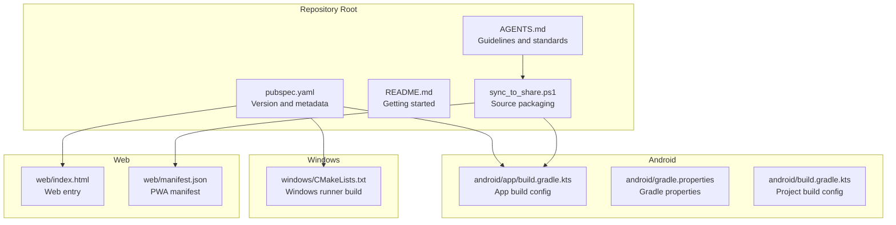
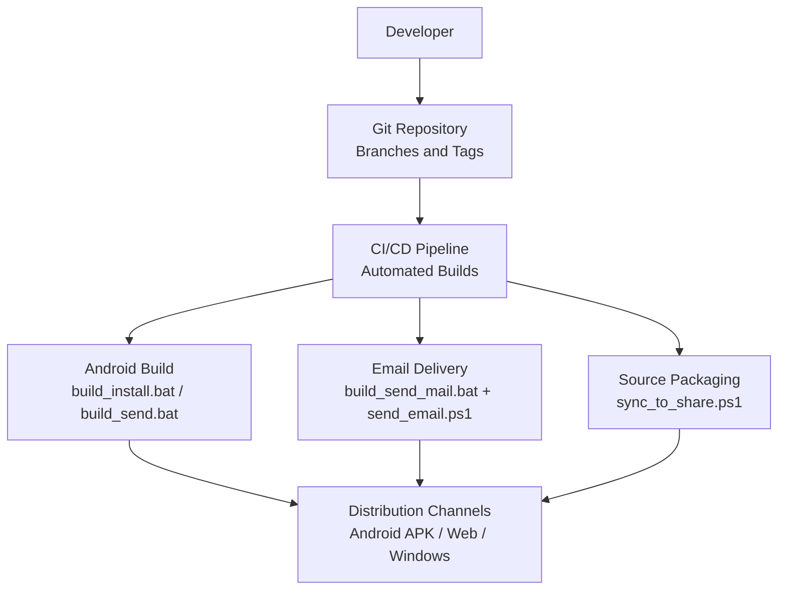
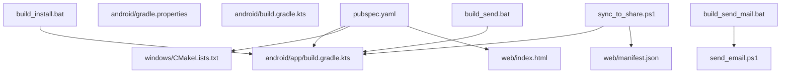

# Release Management

<cite>
**Referenced Files in This Document**
- [pubspec.yaml](file://pubspec.yaml)
- [AGENTS.md](file://AGENTS.md)
- [README.md](file://README.md)
- [build_install.bat](file://build_install.bat)
- [build_send.bat](file://build_send.bat)
- [build_send_mail.bat](file://build_send_mail.bat)
- [send_email.ps1](file://send_email.ps1)
- [sync_to_share.ps1](file://sync_to_share.ps1)
- [android/build.gradle.kts](file://android/build.gradle.kts)
- [android/gradle.properties](file://android/gradle.properties)
- [android/app/build.gradle.kts](file://android/app/build.gradle.kts)
- [windows/CMakeLists.txt](file://windows/CMakeLists.txt)
- [web/index.html](file://web/index.html)
- [web/manifest.json](file://web/manifest.json)
</cite>

## Table of Contents
1. [Introduction](#introduction)
2. [Project Structure](#project-structure)
3. [Core Components](#core-components)
4. [Architecture Overview](#architecture-overview)
5. [Detailed Component Analysis](#detailed-component-analysis)
6. [Dependency Analysis](#dependency-analysis)
7. [Performance Considerations](#performance-considerations)
8. [Troubleshooting Guide](#troubleshooting-guide)
9. [Conclusion](#conclusion)
10. [Appendices](#appendices)

## Introduction
This document defines a comprehensive release management process for QNote Flutter. It covers version management, branching and release strategies, release planning, quality assurance, release notes and documentation updates, rollback and hotfix procedures, cross-platform distribution, metrics and post-release evaluation, and compliance considerations.

## Project Structure
QNote Flutter is a Flutter multiplatform application supporting Android, Web, and Windows targets. The repository includes platform-specific build configurations and automation scripts for building, installing, sharing, and distributing builds.

**Diagram sources**
- [pubspec.yaml](file://pubspec.yaml)
- [AGENTS.md](file://AGENTS.md)
- [sync_to_share.ps1](file://sync_to_share.ps1)
- [android/app/build.gradle.kts](file://android/app/build.gradle.kts)
- [android/gradle.properties](file://android/gradle.properties)
- [android/build.gradle.kts](file://android/build.gradle.kts)
- [windows/CMakeLists.txt](file://windows/CMakeLists.txt)
- [web/index.html](file://web/index.html)
- [web/manifest.json](file://web/manifest.json)

**Section sources**
- [pubspec.yaml](file://pubspec.yaml)
- [AGENTS.md](file://AGENTS.md)
- [README.md](file://README.md)
- [sync_to_share.ps1](file://sync_to_share.ps1)
- [android/app/build.gradle.kts](file://android/app/build.gradle.kts)
- [android/gradle.properties](file://android/gradle.properties)
- [android/build.gradle.kts](file://android/build.gradle.kts)
- [windows/CMakeLists.txt](file://windows/CMakeLists.txt)
- [web/index.html](file://web/index.html)
- [web/manifest.json](file://web/manifest.json)

## Core Components
- Version and metadata: The application version and build metadata are defined in the package manifest. The version follows a numeric scheme with an optional build identifier.
- Platform targets: Android, Web, and Windows are supported. Platform-specific build scripts and configurations exist for building and distributing artifacts.
- Automation: PowerShell and batch scripts automate build, install, email delivery, and source packaging tasks.
- Standards and change logging: Contribution guidelines specify commit message conventions and require maintaining a changelog for significant changes.

Key implementation references:
- Version and metadata definition: [pubspec.yaml](file://pubspec.yaml)
- Commit message convention and changelog policy: [AGENTS.md](file://AGENTS.md)
- Android build configuration: [android/app/build.gradle.kts](file://android/app/build.gradle.kts)
- Windows build configuration: [windows/CMakeLists.txt](file://windows/CMakeLists.txt)
- Web entry and manifest: [web/index.html](file://web/index.html), [web/manifest.json](file://web/manifest.json)
- Build/install scripts: [build_install.bat](file://build_install.bat), [build_send.bat](file://build_send.bat), [build_send_mail.bat](file://build_send_mail.bat), [send_email.ps1](file://send_email.ps1)
- Source packaging script: [sync_to_share.ps1](file://sync_to_share.ps1)

**Section sources**
- [pubspec.yaml](file://pubspec.yaml)
- [AGENTS.md](file://AGENTS.md)
- [android/app/build.gradle.kts](file://android/app/build.gradle.kts)
- [windows/CMakeLists.txt](file://windows/CMakeLists.txt)
- [web/index.html](file://web/index.html)
- [web/manifest.json](file://web/manifest.json)
- [build_install.bat](file://build_install.bat)
- [build_send.bat](file://build_send.bat)
- [build_send_mail.bat](file://build_send_mail.bat)
- [send_email.ps1](file://send_email.ps1)
- [sync_to_share.ps1](file://sync_to_share.ps1)

## Architecture Overview
The release pipeline integrates source control, automated builds, artifact generation, and distribution channels. The diagram below maps the actual files involved in the release workflow.

**Diagram sources**
- [build_install.bat](file://build_install.bat)
- [build_send.bat](file://build_send.bat)
- [build_send_mail.bat](file://build_send_mail.bat)
- [send_email.ps1](file://send_email.ps1)
- [sync_to_share.ps1](file://sync_to_share.ps1)

## Detailed Component Analysis

### Version Management and Numbering
- Current scheme: The application version is defined in the package manifest. It uses a numeric version number with an optional build identifier. This supports patch-level releases and build metadata tracking.
- Suggested strategy: Adopt semantic versioning (SemVer) with major.minor.patch [+ build metadata]. Increment major for breaking changes, minor for backward-compatible features, and patch for fixes. Use build metadata to record internal build identifiers.
- Tagging: Create annotated Git tags for each release (e.g., v1.2.3) to mark release points.

Implementation references:
- Version field: [pubspec.yaml](file://pubspec.yaml)

**Section sources**
- [pubspec.yaml](file://pubspec.yaml)

### Release Branching Strategy
- Recommended model: Use a trunk-based or feature-branch model with release branches cut from the mainline at release points. Feature branches merge to main after review. Release branches are used for stabilization and last-minute fixes.
- Hotfixes: Create hotfix branches from the latest tagged release, apply minimal changes, and merge back to both main and the current release branch.
- Tagging: Tag releases on the release branch to freeze versions.

[No sources needed since this section provides general guidance]

### Release Planning
- Feature prioritization: Maintain a prioritized backlog. Use milestones to group features for each release.
- Milestone planning: Define acceptance criteria and dependencies per feature. Track progress using issue labels and project boards.
- Release scheduling: Align release dates with capability drops and external constraints. Communicate cadence to stakeholders.

[No sources needed since this section provides general guidance]

### Quality Assurance Procedures
- Testing requirements: Ensure tests mirror library structure and cover new functionality. Maintain a healthy test coverage baseline.
- Bug fixing workflow: Fix issues in feature branches, include tests, and target the appropriate release branch. Use hotfixes for production-critical defects.
- Release candidate validation: Build and smoke-test Android APK, Web, and Windows artifacts. Verify installation, basic navigation, and core features.

Implementation references:
- Test structure guidance: [AGENTS.md](file://AGENTS.md)
- Android build and install scripts: [build_install.bat](file://build_install.bat), [build_send.bat](file://build_send.bat)
- Email-based delivery script: [build_send_mail.bat](file://build_send_mail.bat), [send_email.ps1](file://send_email.ps1)

**Section sources**
- [AGENTS.md](file://AGENTS.md)
- [build_install.bat](file://build_install.bat)
- [build_send.bat](file://build_send.bat)
- [build_send_mail.bat](file://build_send_mail.bat)
- [send_email.ps1](file://send_email.ps1)

### Release Notes, Changelog, and Documentation Updates
- Changelog maintenance: Record significant changes in a changelog with dates and categories (added, fixed, changed). Keep entries concise and link to relevant files.
- Documentation updates: Update project README and agent guidelines as needed for new capabilities or operational changes.

Implementation references:
- Changelog policy: [AGENTS.md](file://AGENTS.md)
- README: [README.md](file://README.md)

**Section sources**
- [AGENTS.md](file://AGENTS.md)
- [README.md](file://README.md)

### Rollback Procedures and Hotfix Deployment
- Rollback: Revert to the previous tagged release. Recreate the Android APK from the prior tag and redeploy. For Web/Windows, re-deploy the last known-good build.
- Hotfix deployment: Create a hotfix branch from the release tag, apply minimal changes, build, validate, and merge to main and the release branch. Tag and distribute the patched version.

[No sources needed since this section provides general guidance]

### Emergency Release Protocols
- Escalation: Define roles and escalation paths for critical incidents. Limit changes to essential fixes only.
- Communication: Notify stakeholders of the incident, mitigation steps, and expected resolution time.
- Post-mortem: Document root causes, actions taken, and preventive measures.

[No sources needed since this section provides general guidance]

### Cross-Platform Distribution
- Android: Build and distribute APKs via local install or email delivery. Use the provided scripts to produce and optionally email the artifact.
- Web: Serve the Web build from a static host or CDN. Ensure the manifest and service worker are configured for offline caching and updates.
- Windows: Build the Windows runner and distribute the executable. Ensure CMake configuration is correct for the target environment.

Implementation references:
- Android build and install: [build_install.bat](file://build_install.bat), [build_send.bat](file://build_send.bat), [build_send_mail.bat](file://build_send_mail.bat), [send_email.ps1](file://send_email.ps1)
- Web entry and manifest: [web/index.html](file://web/index.html), [web/manifest.json](file://web/manifest.json)
- Windows build: [windows/CMakeLists.txt](file://windows/CMakeLists.txt)

**Section sources**
- [build_install.bat](file://build_install.bat)
- [build_send.bat](file://build_send.bat)
- [build_send_mail.bat](file://build_send_mail.bat)
- [send_email.ps1](file://send_email.ps1)
- [web/index.html](file://web/index.html)
- [web/manifest.json](file://web/manifest.json)
- [windows/CMakeLists.txt](file://windows/CMakeLists.txt)

### Release Metrics and Post-Release Evaluation
- Metrics: Track build success rate, time-to-release, download/install rates, crash reports, and user feedback.
- Post-release evaluation: Review defects found in the first week, customer support volume, and regression reports. Adjust planning and QA processes accordingly.

[No sources needed since this section provides general guidance]

### Compliance and Regulatory Considerations
- Data privacy: Ensure compliance with applicable regulations (e.g., GDPR, CCPA) for data collection and processing. Include required notices and controls in the app.
- Accessibility: Follow WCAG guidelines for Web and mobile accessibility.
- Security: Apply secure coding practices, keep dependencies updated, and perform vulnerability scans.

[No sources needed since this section provides general guidance]

## Dependency Analysis
The release process depends on several configuration and automation files. The diagram below highlights key dependencies among files that participate in the release workflow.

**Diagram sources**
- [pubspec.yaml](file://pubspec.yaml)
- [android/app/build.gradle.kts](file://android/app/build.gradle.kts)
- [android/gradle.properties](file://android/gradle.properties)
- [android/build.gradle.kts](file://android/build.gradle.kts)
- [windows/CMakeLists.txt](file://windows/CMakeLists.txt)
- [web/index.html](file://web/index.html)
- [web/manifest.json](file://web/manifest.json)
- [sync_to_share.ps1](file://sync_to_share.ps1)
- [build_install.bat](file://build_install.bat)
- [build_send.bat](file://build_send.bat)
- [build_send_mail.bat](file://build_send_mail.bat)
- [send_email.ps1](file://send_email.ps1)

**Section sources**
- [pubspec.yaml](file://pubspec.yaml)
- [android/app/build.gradle.kts](file://android/app/build.gradle.kts)
- [android/gradle.properties](file://android/gradle.properties)
- [android/build.gradle.kts](file://android/build.gradle.kts)
- [windows/CMakeLists.txt](file://windows/CMakeLists.txt)
- [web/index.html](file://web/index.html)
- [web/manifest.json](file://web/manifest.json)
- [sync_to_share.ps1](file://sync_to_share.ps1)
- [build_install.bat](file://build_install.bat)
- [build_send.bat](file://build_send.bat)
- [build_send_mail.bat](file://build_send_mail.bat)
- [send_email.ps1](file://send_email.ps1)

## Performance Considerations
- Build optimization: Use incremental builds and cache dependencies to reduce build times. Prefer release builds for distribution.
- Artifact size: Monitor APK/Web/Windows sizes; optimize assets and remove unused resources.
- Distribution latency: Choose reliable CDNs and hosting for Web and Windows; ensure fast email delivery for APKs.

[No sources needed since this section provides general guidance]

## Troubleshooting Guide
Common release issues and resolutions:
- Android build failure: Verify SDK/NDK and Gradle settings. Confirm platform targets and signing configurations.
- Email delivery failure: Check SMTP credentials and firewall settings. Validate the email configuration file and attachment path.
- Source packaging errors: Ensure the share folder and archive paths are writable. Confirm required files exist before archiving.

Implementation references:
- Android build scripts: [build_install.bat](file://build_install.bat), [build_send.bat](file://build_send.bat)
- Email delivery: [build_send_mail.bat](file://build_send_mail.bat), [send_email.ps1](file://send_email.ps1)
- Source packaging: [sync_to_share.ps1](file://sync_to_share.ps1)

**Section sources**
- [build_install.bat](file://build_install.bat)
- [build_send.bat](file://build_send.bat)
- [build_send_mail.bat](file://build_send_mail.bat)
- [send_email.ps1](file://send_email.ps1)
- [sync_to_share.ps1](file://sync_to_share.ps1)

## Conclusion
This document outlines a practical release management framework for QNote Flutter, grounded in the repository’s existing configuration and automation. By adopting SemVer, disciplined branching, robust QA, and clear distribution procedures, the team can deliver reliable updates across Android, Web, and Windows while maintaining compliance and transparency.

## Appendices
- Commit message convention: Use conventional prefixes (e.g., feat, fix, refactor, docs, test, chore) to categorize changes consistently.
- Changelog format: Include date, categories (Added, Fixed, Changed), and affected file paths for traceability.

**Section sources**
- [AGENTS.md](file://AGENTS.md)