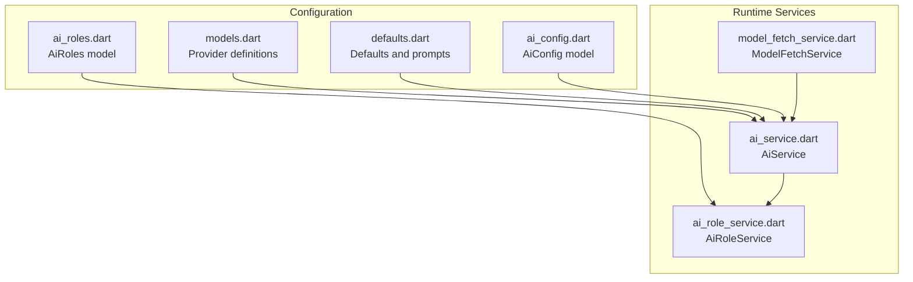
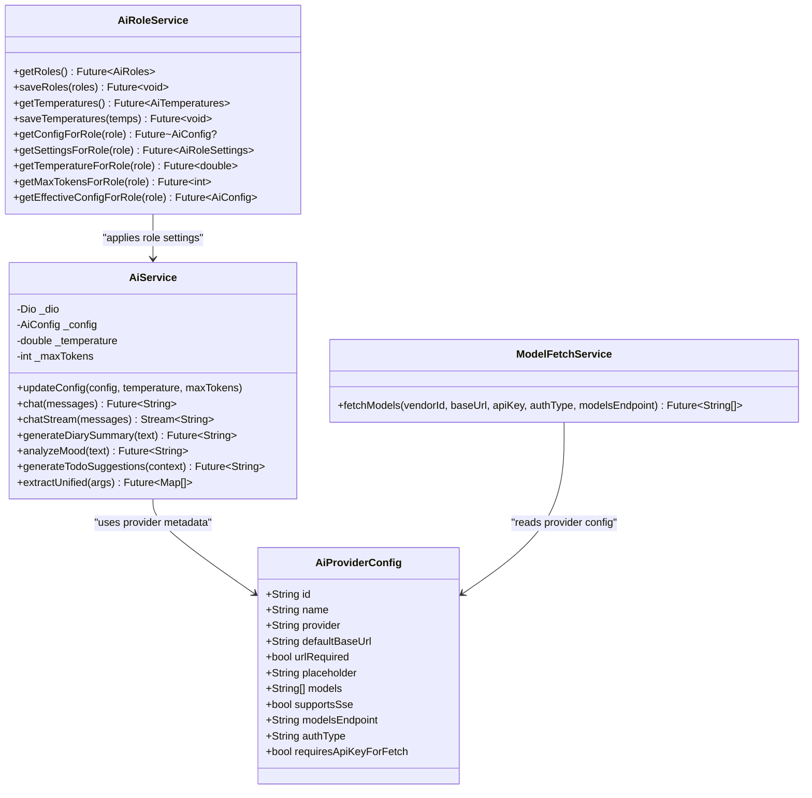
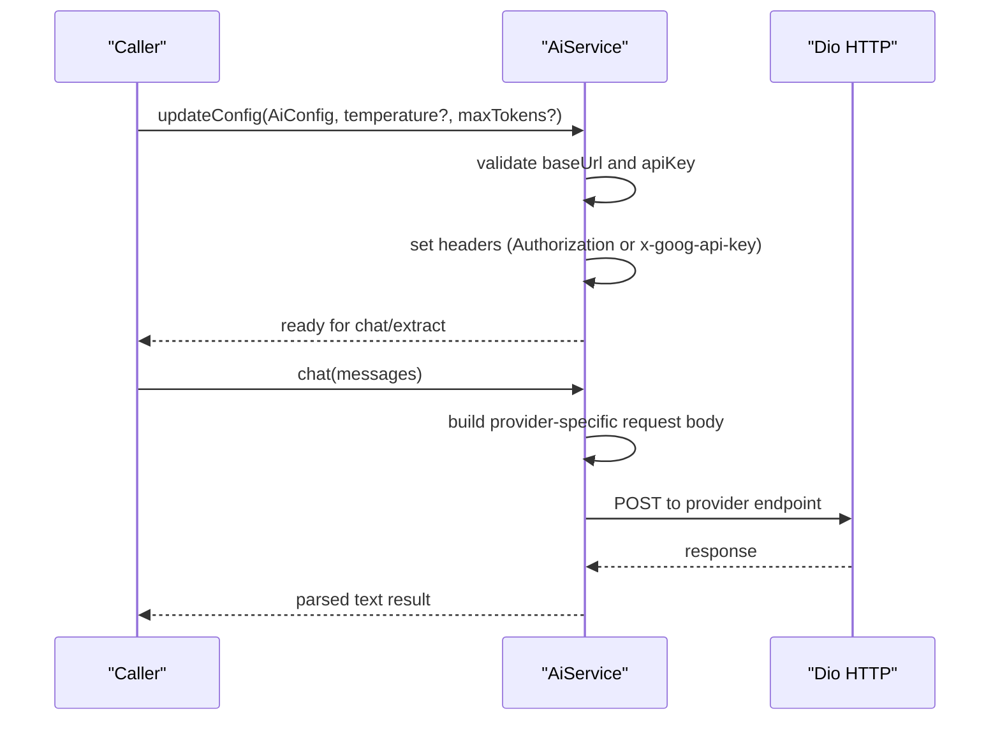
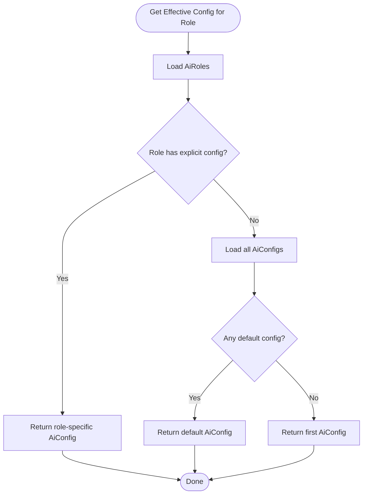
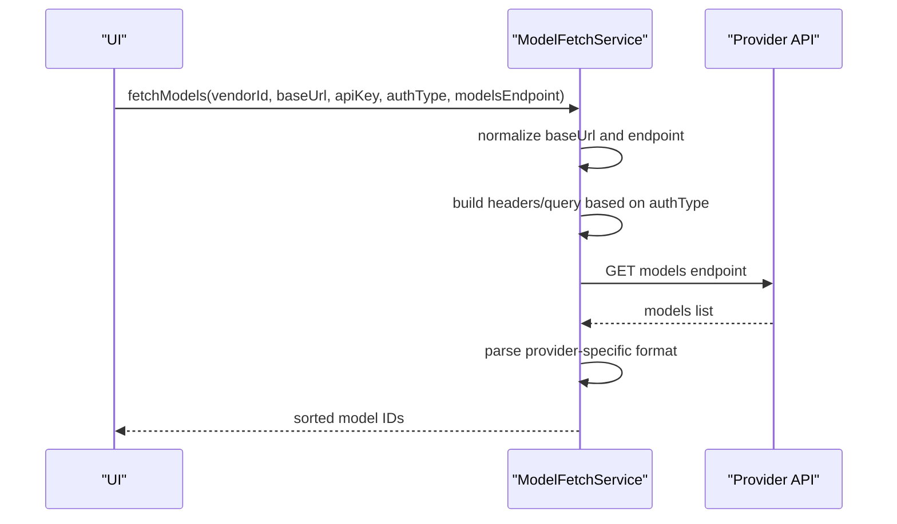
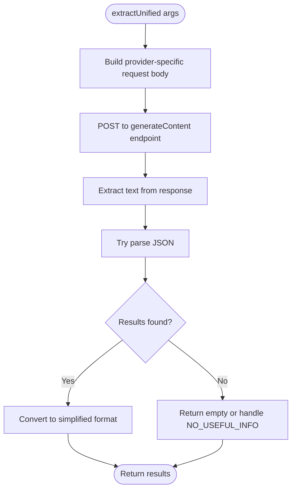
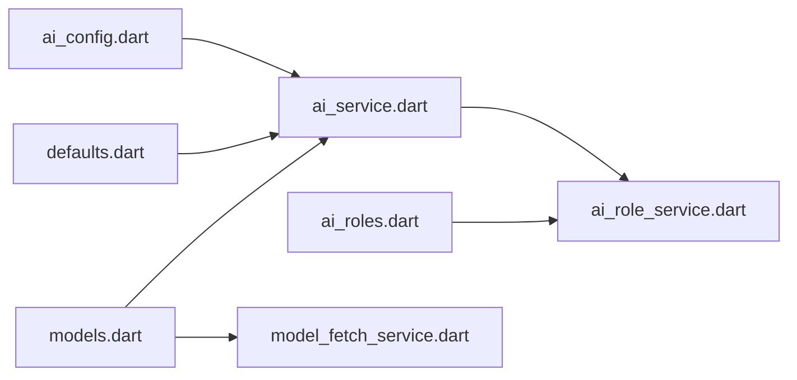

# AI Service Configuration

<cite>
**Referenced Files in This Document**
- [ai_service.dart](file://lib/core/ai/ai_service.dart)
- [ai_role_service.dart](file://lib/core/ai/ai_role_service.dart)
- [model_fetch_service.dart](file://lib/core/ai/model_fetch_service.dart)
- [models.dart](file://lib/config/models.dart)
- [defaults.dart](file://lib/config/defaults.dart)
- [ai_config.dart](file://lib/models/ai_config.dart)
- [ai_roles.dart](file://lib/models/ai_roles.dart)
</cite>

## Table of Contents
1. [Introduction](#introduction)
2. [Project Structure](#project-structure)
3. [Core Components](#core-components)
4. [Architecture Overview](#architecture-overview)
5. [Detailed Component Analysis](#detailed-component-analysis)
6. [Dependency Analysis](#dependency-analysis)
7. [Performance Considerations](#performance-considerations)
8. [Troubleshooting Guide](#troubleshooting-guide)
9. [Conclusion](#conclusion)
10. [Appendices](#appendices)

## Introduction
This document explains the AI service configuration system in QNote Flutter. It covers how AI providers and models are configured, how authentication and endpoints are handled, how roles and temperatures are managed, and how content processing (summarization, extraction, suggestions) is parameterized. It also documents model fetching, provider-specific behaviors, and privacy considerations for AI data processing.

## Project Structure
The AI configuration system spans three main areas:
- Provider and model metadata: provider definitions, defaults, and model lists
- Runtime AI service: chat, streaming, multimodal extraction, and content generation
- Role and temperature management: per-role AI configuration and tuning

**Diagram sources**
- [models.dart:31-232](file://lib/config/models.dart#L31-L232)
- [defaults.dart:7-87](file://lib/config/defaults.dart#L7-L87)
- [ai_service.dart:22-79](file://lib/core/ai/ai_service.dart#L22-L79)
- [ai_role_service.dart:5-79](file://lib/core/ai/ai_role_service.dart#L5-L79)
- [model_fetch_service.dart:4-140](file://lib/core/ai/model_fetch_service.dart#L4-L140)

**Section sources**
- [models.dart:1-241](file://lib/config/models.dart#L1-L241)
- [defaults.dart:1-285](file://lib/config/defaults.dart#L1-L285)
- [ai_service.dart:1-1189](file://lib/core/ai/ai_service.dart#L1-L1189)
- [ai_role_service.dart:1-80](file://lib/core/ai/ai_role_service.dart#L1-L80)
- [model_fetch_service.dart:1-236](file://lib/core/ai/model_fetch_service.dart#L1-L236)

## Core Components
- AiService: central runtime for chat, streaming, and structured extraction; handles provider-specific request formatting, authentication headers, and response parsing
- AiRoleService: manages role-based AI configurations and per-role temperature/maxTokens settings
- ModelFetchService: retrieves available models from provider APIs, normalizes URLs, and parses provider-specific responses
- Provider metadata: AiProviderConfig defines supported providers, default endpoints, auth modes, and model list endpoints
- Defaults and prompts: default system prompts and default AI configurations for quick start

Key responsibilities:
- Authentication: bearer keys for most providers; Gemini via query param or header depending on provider definition
- Endpoint routing: provider-aware chat and generate endpoints with automatic suffix selection
- Content processing: unified extraction supporting text, image, and multimodal inputs with JSON response shaping
- Role-based tuning: per-role temperature and maxTokens overrides

**Section sources**
- [ai_service.dart:22-391](file://lib/core/ai/ai_service.dart#L22-L391)
- [ai_role_service.dart:5-79](file://lib/core/ai/ai_role_service.dart#L5-L79)
- [model_fetch_service.dart:4-140](file://lib/core/ai/model_fetch_service.dart#L4-L140)
- [models.dart:16-29](file://lib/config/models.dart#L16-L29)
- [defaults.dart:260-277](file://lib/config/defaults.dart#L260-L277)

## Architecture Overview
The AI configuration architecture connects provider metadata, runtime services, and storage-backed role settings.

**Diagram sources**
- [models.dart:16-29](file://lib/config/models.dart#L16-L29)
- [ai_service.dart:22-391](file://lib/core/ai/ai_service.dart#L22-L391)
- [ai_role_service.dart:5-79](file://lib/core/ai/ai_role_service.dart#L5-L79)
- [model_fetch_service.dart:4-140](file://lib/core/ai/model_fetch_service.dart#L4-L140)

## Detailed Component Analysis

### AI Service Configuration and Authentication
AiService validates and applies AI configuration, sets up HTTP client headers, and routes requests to provider-specific endpoints. It supports:
- Provider detection and endpoint selection
- Authentication header management (Bearer vs x-goog-api-key for Gemini)
- Temperature and maxTokens applied to requests
- Logging and error diagnostics

**Diagram sources**
- [ai_service.dart:36-79](file://lib/core/ai/ai_service.dart#L36-L79)
- [ai_service.dart:88-217](file://lib/core/ai/ai_service.dart#L88-L217)

**Section sources**
- [ai_service.dart:22-79](file://lib/core/ai/ai_service.dart#L22-L79)
- [ai_service.dart:88-217](file://lib/core/ai/ai_service.dart#L88-L217)

### Role-Based AI Configuration and Personalized Assistant Settings
AiRoleService persists and resolves role-specific AI configurations and per-role temperature/maxTokens. It:
- Loads/saves AiRoles and AiTemperatures from storage
- Resolves effective AiConfig for a role, falling back to default or first available
- Provides per-role temperature and maxTokens overrides

**Diagram sources**
- [ai_role_service.dart:28-78](file://lib/core/ai/ai_role_service.dart#L28-L78)

**Section sources**
- [ai_role_service.dart:5-79](file://lib/core/ai/ai_role_service.dart#L5-L79)
- [ai_roles.dart:1-200](file://lib/models/ai_roles.dart#L1-L200)

### Model Management and Version Control
ModelFetchService retrieves provider model lists and normalizes endpoints:
- Validates auth requirements and builds appropriate headers/query params
- Handles provider-specific response parsing (OpenAI-compatible, Gemini, GLM, OpenRouter free models)
- Merges base URL and models endpoint safely, preserving query parameters

**Diagram sources**
- [model_fetch_service.dart:11-140](file://lib/core/ai/model_fetch_service.dart#L11-L140)
- [model_fetch_service.dart:142-235](file://lib/core/ai/model_fetch_service.dart#L142-L235)

**Section sources**
- [model_fetch_service.dart:4-140](file://lib/core/ai/model_fetch_service.dart#L4-L140)
- [models.dart:31-232](file://lib/config/models.dart#L31-L232)

### Content Processing Preferences and Extraction
AiService provides several content processing capabilities:
- Summarization: generates concise diary summaries
- Mood analysis: assesses emotional tone
- Todo suggestions: productivity-driven suggestions
- Unified extraction: extracts structured data from text/image/multimodal inputs with JSON output shaping

**Diagram sources**
- [ai_service.dart:518-699](file://lib/core/ai/ai_service.dart#L518-L699)
- [ai_service.dart:788-806](file://lib/core/ai/ai_service.dart#L788-L806)

**Section sources**
- [ai_service.dart:393-445](file://lib/core/ai/ai_service.dart#L393-L445)
- [ai_service.dart:518-699](file://lib/core/ai/ai_service.dart#L518-L699)

### AI Provider Configuration and Endpoints
Provider metadata defines:
- Supported providers and their default base URLs
- Whether a URL is required and placeholder hints
- Available models and model list endpoints
- Authentication type and whether API key is required to fetch models
- SSE support flag

Examples of providers include OpenAI-compatible vendors, Gemini, OpenRouter, and others, each with tailored defaults and endpoints.

**Section sources**
- [models.dart:31-232](file://lib/config/models.dart#L31-L232)

### Default AI Configurations and Prompts
Defaults include:
- Default system prompts for assistant greeting, analysis, unified extraction, and daily score evaluation
- Default AI configurations (e.g., Agnes 2.0 Flash) and default roles/temperatures
- Historical default model IDs for cleanup

These defaults enable quick-start scenarios and provide baseline behavior when no user configuration exists.

**Section sources**
- [defaults.dart:7-87](file://lib/config/defaults.dart#L7-L87)
- [defaults.dart:260-277](file://lib/config/defaults.dart#L260-L277)

## Dependency Analysis
The AI configuration system exhibits clear separation of concerns:
- AiService depends on provider metadata and configuration models
- AiRoleService depends on storage-backed configuration persistence
- ModelFetchService depends on provider metadata and network layer
- Defaults provide initial state and prompts

**Diagram sources**
- [models.dart:16-29](file://lib/config/models.dart#L16-L29)
- [defaults.dart:7-87](file://lib/config/defaults.dart#L7-L87)
- [ai_service.dart:22-79](file://lib/core/ai/ai_service.dart#L22-L79)
- [ai_role_service.dart:5-79](file://lib/core/ai/ai_role_service.dart#L5-L79)
- [model_fetch_service.dart:4-140](file://lib/core/ai/model_fetch_service.dart#L4-L140)

**Section sources**
- [ai_service.dart:1-1189](file://lib/core/ai/ai_service.dart#L1-L1189)
- [ai_role_service.dart:1-80](file://lib/core/ai/ai_role_service.dart#L1-L80)
- [model_fetch_service.dart:1-236](file://lib/core/ai/model_fetch_service.dart#L1-L236)
- [models.dart:1-241](file://lib/config/models.dart#L1-L241)
- [defaults.dart:1-285](file://lib/config/defaults.dart#L1-L285)

## Performance Considerations
- Streaming support: AiService supports server-sent events for real-time response streaming, reducing perceived latency
- Request timeouts: configurable connection, send, and receive timeouts for robustness
- Endpoint routing: provider-aware endpoint selection avoids unnecessary retries and misrouted requests
- Model list caching: consider caching model lists locally to reduce repeated network calls during configuration

[No sources needed since this section provides general guidance]

## Troubleshooting Guide
Common issues and diagnostics:
- Invalid configuration: missing apiKey or baseUrl, malformed URL, or missing protocol/host
- Authentication failures: incorrect authType or missing API key for providers requiring it
- Network errors: inspect DioException details, request payload, and response body
- Extraction failures: ensure response_format is set for JSON outputs and handle NO_USEFUL_INFO gracefully

Recommended steps:
- Verify provider metadata and endpoint correctness
- Confirm authType and API key presence for the selected provider
- Enable logging to capture request/response payloads
- Validate model compatibility and endpoint suffixes

**Section sources**
- [ai_service.dart:44-56](file://lib/core/ai/ai_service.dart#L44-L56)
- [ai_service.dart:190-216](file://lib/core/ai/ai_service.dart#L190-L216)
- [model_fetch_service.dart:18-21](file://lib/core/ai/model_fetch_service.dart#L18-L21)
- [model_fetch_service.dart:125-139](file://lib/core/ai/model_fetch_service.dart#L125-L139)

## Conclusion
QNote Flutter’s AI configuration system provides a flexible, provider-agnostic framework for chat, streaming, and structured extraction. It supports role-based personalization, robust authentication, and extensible model management. Defaults and prompts streamline onboarding, while logging and diagnostics aid troubleshooting.

[No sources needed since this section summarizes without analyzing specific files]

## Appendices

### Example: Configure Different AI Providers
- OpenAI-compatible providers: select provider ID, enter base URL and API key, choose model from list
- Gemini: leave base URL empty for official endpoint or supply custom; use query param auth as per provider config
- OpenRouter: no API key required to fetch models; pick free model variants
- Custom provider: set custom base URL and model identifier

**Section sources**
- [models.dart:31-232](file://lib/config/models.dart#L31-L232)
- [defaults.dart:260-277](file://lib/config/defaults.dart#L260-L277)

### Privacy and Consent Considerations
- Data minimization: avoid sending sensitive user content unless necessary; prefer scoped extraction prompts
- Logging: sanitize request/response logs; avoid persisting raw API keys or PII
- Provider choice: select providers aligned with privacy policies; use official endpoints when available
- User control: expose opt-out toggles for AI-powered features and clearly communicate data usage

[No sources needed since this section provides general guidance]