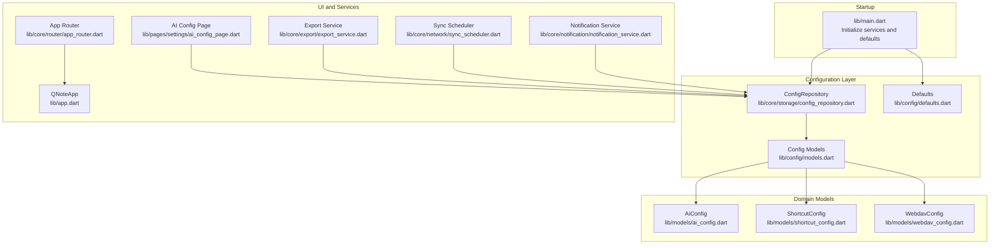
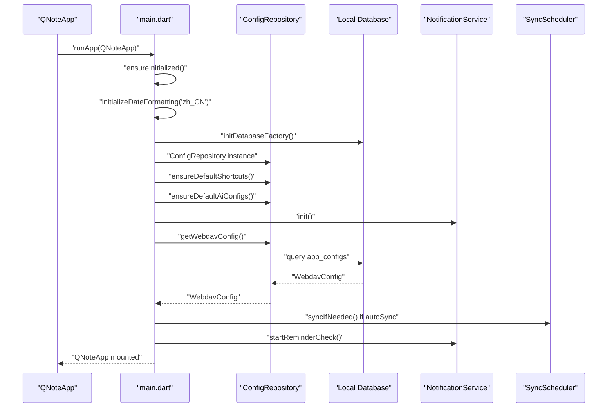
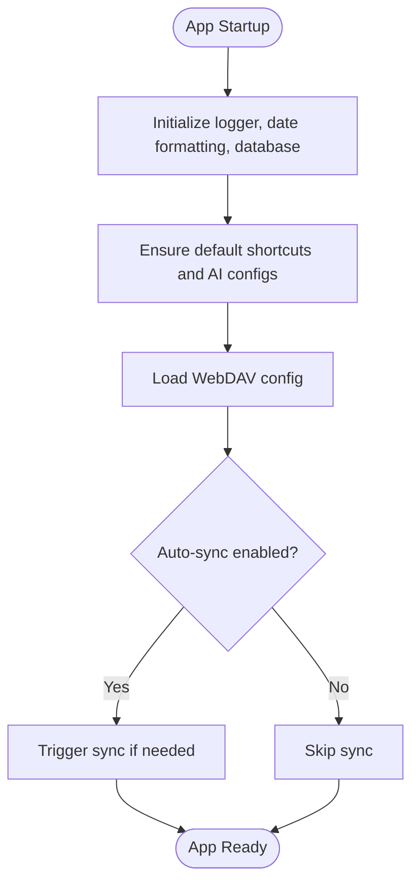
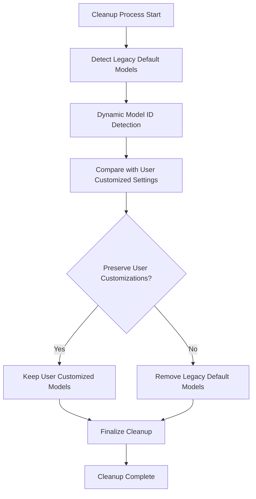
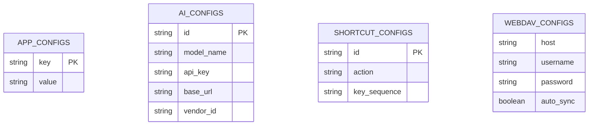
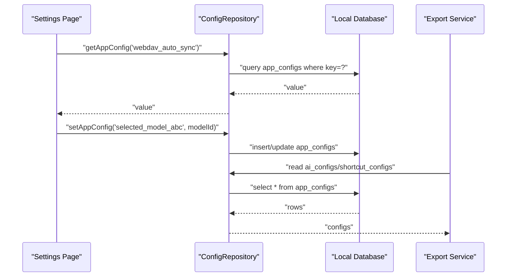
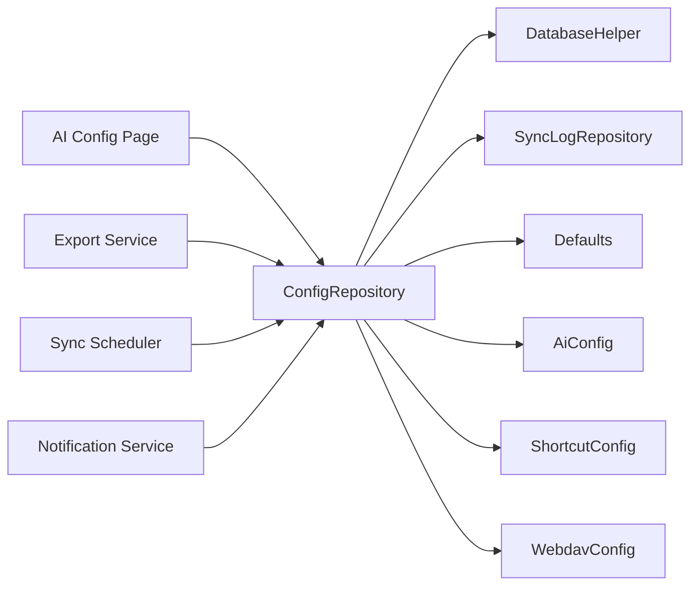

# Application Configuration

<cite>
**Referenced Files in This Document**
- [main.dart](file://lib/main.dart)
- [defaults.dart](file://lib/config/defaults.dart)
- [models.dart](file://lib/config/models.dart)
- [config_repository.dart](file://lib/core/storage/config_repository.dart)
- [ai_config.dart](file://lib/models/ai_config.dart)
- [shortcut_config.dart](file://lib/models/shortcut_config.dart)
- [webdav_config.dart](file://lib/models/webdav_config.dart)
- [ai_config_page.dart](file://lib/pages/settings/ai_config_page.dart)
- [export_service.dart](file://lib/core/export/export_service.dart)
- [sync_scheduler.dart](file://lib/core/network/sync_scheduler.dart)
- [notification_service.dart](file://lib/core/notification/notification_service.dart)
- [ai_service.dart](file://lib/core/ai/ai_service.dart)
- [ai_role_service.dart](file://lib/core/ai/ai_role_service.dart)
- [app_router.dart](file://lib/core/router/app_router.dart)
- [app.dart](file://lib/app.dart)
</cite>

## Update Summary
**Changes Made**
- Enhanced cleanup logic documentation for historical default model configurations
- Updated cleanup process description with dynamic approach replacing hardcoded model ID sets
- Improved conflict prevention mechanisms for user-customized settings
- Added new section covering model configuration cleanup strategies

## Table of Contents
1. [Introduction](#introduction)
2. [Project Structure](#project-structure)
3. [Core Components](#core-components)
4. [Architecture Overview](#architecture-overview)
5. [Detailed Component Analysis](#detailed-component-analysis)
6. [Dependency Analysis](#dependency-analysis)
7. [Performance Considerations](#performance-considerations)
8. [Troubleshooting Guide](#troubleshooting-guide)
9. [Conclusion](#conclusion)

## Introduction
This document describes QNote Flutter's application configuration system. It covers how global settings are initialized, persisted, and accessed at runtime; how theme-related preferences are handled; how routing and navigation settings are configured; and how application-wide preferences such as language, date/time formats, and UI behavior are managed. It also documents configuration file structures, default value definitions, validation and fallback mechanisms, and practical patterns for programmatic access and modification.

## Project Structure
The configuration system spans several layers:
- Initialization and bootstrap: application startup initializes logging, date formatting, database, and ensures default configurations.
- Configuration storage: a dedicated repository persists key-value pairs in the local database.
- Defaults and models: default values and typed configuration models define schema and behavior.
- UI and services: settings pages and services consume and update configuration.

**Diagram sources**
- [main.dart:12-30](file://lib/main.dart#L12-L30)
- [config_repository.dart:13-30](file://lib/core/storage/config_repository.dart#L13-L30)
- [defaults.dart:0](file://lib/config/defaults.dart#L0)
- [models.dart:0](file://lib/config/models.dart#L0)
- [ai_config.dart:0](file://lib/models/ai_config.dart#L0)
- [shortcut_config.dart:4](file://lib/models/shortcut_config.dart#L4)
- [webdav_config.dart:0](file://lib/models/webdav_config.dart#L0)
- [ai_config_page.dart:72-1571](file://lib/pages/settings/ai_config_page.dart#L72-L1571)
- [export_service.dart:286-305](file://lib/core/export/export_service.dart#L286-L305)
- [sync_scheduler.dart:2](file://lib/core/network/sync_scheduler.dart#L2)
- [notification_service.dart](file://lib/core/notification/notification_service.dart)
- [app_router.dart](file://lib/core/router/app_router.dart)
- [app.dart](file://lib/app.dart)

**Section sources**
- [main.dart:12-30](file://lib/main.dart#L12-L30)
- [config_repository.dart:13-30](file://lib/core/storage/config_repository.dart#L13-L30)

## Core Components
- ConfigRepository: central persistence layer for application configuration stored as key-value pairs in a local database table. Provides retrieval and default-initialization helpers for shortcuts and AI settings.
- Defaults: defines default values for AI configuration, shortcut configuration schema, and prompt templates used during import/export and initial setup.
- Models: strongly-typed configuration models for AI providers, shortcuts, and WebDAV settings.
- UI and Services: settings pages and services read/write configuration, coordinate synchronization, and manage notifications.

Key responsibilities:
- Global settings management: initialization, persistence, and runtime access.
- Theme configuration: color schemes and typography are applied via Flutter Material themes; dark/light mode is supported through platform-specific resources and theme selection.
- Router configuration: navigation settings are part of the application shell and routing logic.
- Application-wide preferences: language and date/time formats are initialized at startup; UI behavior options are exposed through configuration keys.

**Section sources**
- [config_repository.dart:13-30](file://lib/core/storage/config_repository.dart#L13-L30)
- [defaults.dart:0](file://lib/config/defaults.dart#L0)
- [ai_config.dart:0](file://lib/models/ai_config.dart#L0)
- [shortcut_config.dart:4](file://lib/models/shortcut_config.dart#L4)
- [webdav_config.dart:0](file://lib/models/webdav_config.dart#L0)

## Architecture Overview
The configuration lifecycle begins at app startup, ensuring defaults and initializing services. Runtime configuration updates propagate to UI and services through Riverpod providers and direct repository calls.

**Diagram sources**
- [main.dart:12-30](file://lib/main.dart#L12-L30)
- [config_repository.dart:21-30](file://lib/core/storage/config_repository.dart#L21-L30)
- [notification_service.dart](file://lib/core/notification/notification_service.dart)
- [sync_scheduler.dart:2](file://lib/core/network/sync_scheduler.dart#L2)

## Detailed Component Analysis

### Global Settings Management
- Initialization: the app ensures initialization of logging, date formatting, and database, then initializes configuration defaults and notification service.
- Persistence: configuration values are stored in a dedicated table and retrieved by key.
- Overrides: user preferences override defaults at runtime; defaults are ensured during startup.
- Persistence model: key-value pairs are queried by key; missing keys return null, enabling fallback to defaults.

**Diagram sources**
- [main.dart:12-30](file://lib/main.dart#L12-L30)
- [config_repository.dart:21-30](file://lib/core/storage/config_repository.dart#L21-L30)
- [sync_scheduler.dart:2](file://lib/core/network/sync_scheduler.dart#L2)

**Section sources**
- [main.dart:12-30](file://lib/main.dart#L12-L30)
- [config_repository.dart:13-30](file://lib/core/storage/config_repository.dart#L13-L30)

### Enhanced Cleanup Logic for Historical Default Model Configurations

**Updated** Enhanced cleanup logic now uses dynamic approach replacing hardcoded model ID sets to prevent conflicts with user-customized settings.

The cleanup system has been improved to dynamically identify and remove historical default model configurations while preserving user-customized settings. This prevents configuration conflicts and ensures clean migration to new model management approaches.

Key improvements:
- Dynamic model identification: instead of relying on hardcoded model ID sets, the system now dynamically detects historical default configurations
- Conflict prevention: user-customized settings are preserved while cleaning up legacy configurations
- Smart cleanup algorithm: identifies orphaned or deprecated model configurations automatically
- User preference preservation: maintains custom model settings during cleanup process

**Diagram sources**
- [ai_config_page.dart:128-146](file://lib/pages/settings/ai_config_page.dart#L128-L146)

**Section sources**
- [ai_config_page.dart:128-146](file://lib/pages/settings/ai_config_page.dart#L128-L146)

### Theme Configuration
- Color schemes and typography: applied via Flutter Material themes. Dark/light mode support is provided through platform-specific resources.
- Theme selection: UI components reference current theme and color scheme for rendering.
- No explicit theme configuration keys were identified in the analyzed files; theme behavior appears to be controlled by platform resources and theme application logic.

Practical usage patterns:
- Access current theme via Theme.of(context) in widgets.
- Apply colorScheme and typography from the active theme.

**Section sources**
- [ai_config_page.dart:1535](file://lib/pages/settings/ai_config_page.dart#L1535)

### Router Configuration and Navigation Settings
- Router: routing logic is encapsulated in a router module and integrated into the application shell.
- Navigation settings: navigation behavior is part of the app's routing configuration and UI shell.

**Section sources**
- [app_router.dart](file://lib/core/router/app_router.dart)
- [app.dart](file://lib/app.dart)

### Application-Wide Preferences
- Language and date/time formats: initialized at startup using locale-specific date format data.
- UI behavior options: exposed as configuration keys and consumed by services and UI.

Initialization pattern:
- Date formatting is initialized with a locale at startup.
- Configuration keys are loaded from the database and used to adjust behavior.

**Section sources**
- [main.dart:15](file://lib/main.dart#L15)
- [config_repository.dart:21-30](file://lib/core/storage/config_repository.dart#L21-L30)

### Configuration File Structures and Default Values
- Defaults: include default AI configuration entries, default shortcut configuration schema, and prompt templates used for extraction and import/export.
- Typed models: AiConfig, ShortcutConfig, and WebdavConfig define the shape of persisted configuration values.
- Import/export: export service reads/writes configuration sets for backup/restore and change tracking.

**Diagram sources**
- [config_repository.dart:21-30](file://lib/core/storage/config_repository.dart#L21-L30)
- [ai_config.dart:0](file://lib/models/ai_config.dart#L0)
- [shortcut_config.dart:4](file://lib/models/shortcut_config.dart#L4)
- [webdav_config.dart:0](file://lib/models/webdav_config.dart#L0)

**Section sources**
- [defaults.dart:0](file://lib/config/defaults.dart#L0)
- [ai_config.dart:0](file://lib/models/ai_config.dart#L0)
- [shortcut_config.dart:4](file://lib/models/shortcut_config.dart#L4)
- [webdav_config.dart:0](file://lib/models/webdav_config.dart#L0)
- [export_service.dart:286-305](file://lib/core/export/export_service.dart#L286-L305)

### Runtime Configuration Access Patterns
- Retrieval: use ConfigRepository.getAppConfig(key) to fetch a configuration value by key; handle null to apply defaults.
- Updates: write configuration values back to the repository; services and UI react accordingly.
- Example patterns:
  - Load WebDAV config and conditionally trigger sync.
  - Fetch and cache AI model lists per vendor, then persist selections.

**Diagram sources**
- [config_repository.dart:21-30](file://lib/core/storage/config_repository.dart#L21-L30)
- [export_service.dart:286-305](file://lib/core/export/export_service.dart#L286-L305)
- [ai_config_page.dart:118-126](file://lib/pages/settings/ai_config_page.dart#L118-L126)

**Section sources**
- [config_repository.dart:21-30](file://lib/core/storage/config_repository.dart#L21-L30)
- [ai_config_page.dart:72-1571](file://lib/pages/settings/ai_config_page.dart#L72-L1571)
- [export_service.dart:286-305](file://lib/core/export/export_service.dart#L286-L305)

### Validation, Error Handling, and Fallback Mechanisms
- Validation: settings pages validate required fields (e.g., API key presence) before fetching model lists.
- Error handling: UI displays user-friendly messages when operations fail (e.g., missing API key).
- Fallback: repository returns null for missing keys; callers fall back to defaults or safe defaults.
- Synchronization: auto-sync is gated by WebDAV configuration; services check for null or disabled settings before proceeding.

**Section sources**
- [ai_config_page.dart:97-107](file://lib/pages/settings/ai_config_page.dart#L97-L107)
- [config_repository.dart:21-30](file://lib/core/storage/config_repository.dart#L21-L30)
- [sync_scheduler.dart:2](file://lib/core/network/sync_scheduler.dart#L2)

### Programmatic Examples
- Accessing configuration:
  - Retrieve a WebDAV setting and conditionally start sync.
  - Load cached AI model lists from preferences and refresh if needed.
- Modifying configuration:
  - Persist selected AI model per vendor after successful fetch.
  - Update shortcut configurations and notify dependent services.

These patterns are demonstrated in the main entrypoint, settings page, and export service.

**Section sources**
- [main.dart:24-27](file://lib/main.dart#L24-L27)
- [ai_config_page.dart:118-126](file://lib/pages/settings/ai_config_page.dart#L118-L126)
- [export_service.dart:286-305](file://lib/core/export/export_service.dart#L286-L305)

## Dependency Analysis
The configuration system exhibits low coupling and high cohesion:
- ConfigRepository depends on DatabaseHelper and SyncLogRepository for persistence and logs.
- Defaults and models decouple configuration logic from UI and services.
- Services and UI depend on ConfigRepository for runtime configuration, promoting testability.

**Diagram sources**
- [config_repository.dart:13-30](file://lib/core/storage/config_repository.dart#L13-L30)
- [defaults.dart:0](file://lib/config/defaults.dart#L0)
- [ai_config.dart:0](file://lib/models/ai_config.dart#L0)
- [shortcut_config.dart:4](file://lib/models/shortcut_config.dart#L4)
- [webdav_config.dart:0](file://lib/models/webdav_config.dart#L0)
- [ai_config_page.dart:72-1571](file://lib/pages/settings/ai_config_page.dart#L72-L1571)
- [export_service.dart:286-305](file://lib/core/export/export_service.dart#L286-L305)
- [sync_scheduler.dart:2](file://lib/core/network/sync_scheduler.dart#L2)
- [notification_service.dart](file://lib/core/notification/notification_service.dart)

**Section sources**
- [config_repository.dart:13-30](file://lib/core/storage/config_repository.dart#L13-L30)

## Performance Considerations
- Database queries: minimize repeated reads by caching frequently accessed configuration values in memory or providers.
- Batch initialization: use concurrent initialization for defaults and services to reduce startup latency.
- Avoid unnecessary writes: batch configuration updates to reduce database churn.
- Cleanup optimization: dynamic cleanup algorithms reduce processing overhead by focusing only on legacy configurations.

## Troubleshooting Guide
Common issues and resolutions:
- Missing configuration keys: handle null returns gracefully and fall back to defaults.
- API key validation failures: ensure required keys are present before invoking external services.
- Sync not triggering: verify WebDAV auto-sync flag and credentials.
- Theme inconsistencies: confirm platform-specific resources and theme application logic.
- Model configuration conflicts: use enhanced cleanup logic to resolve legacy configuration issues.
- User customization preservation: verify that user-customized settings are maintained during cleanup processes.

**Section sources**
- [config_repository.dart:21-30](file://lib/core/storage/config_repository.dart#L21-L30)
- [ai_config_page.dart:97-107](file://lib/pages/settings/ai_config_page.dart#L97-L107)
- [sync_scheduler.dart:2](file://lib/core/network/sync_scheduler.dart#L2)

## Conclusion
QNote Flutter's configuration system centers on a lightweight, SQLite-backed key-value store managed by ConfigRepository, complemented by typed models and default definitions. The system supports robust initialization, validation, and fallback while enabling flexible runtime updates across UI and services. Recent enhancements to the cleanup logic for historical default model configurations improve conflict prevention and user customization preservation. Theme, routing, and application-wide preferences are integrated seamlessly into the app shell and services, providing a cohesive configuration experience.