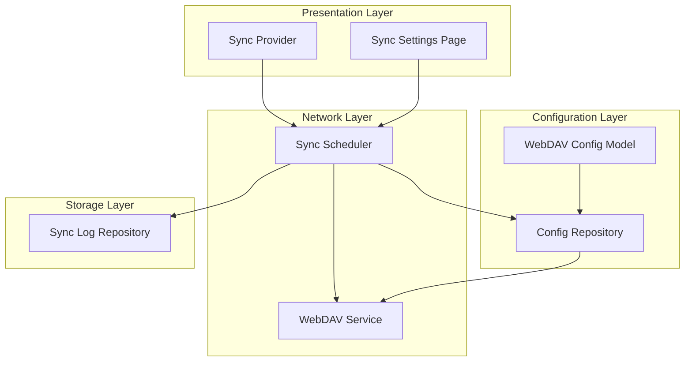
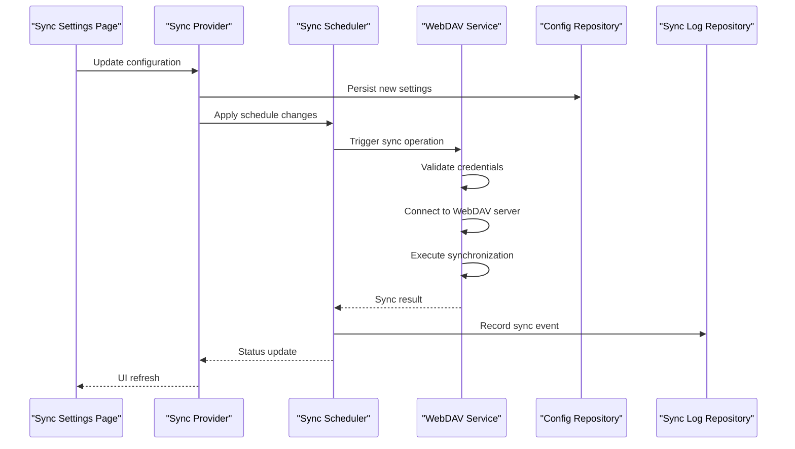
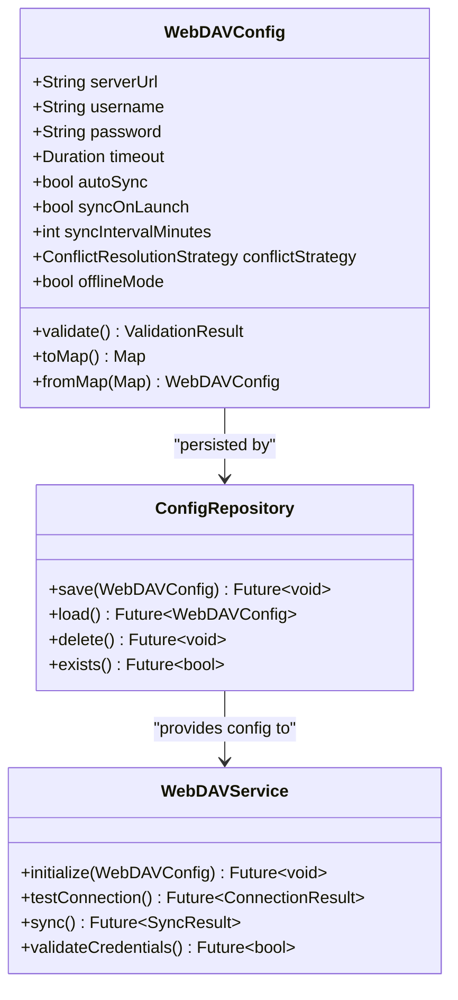
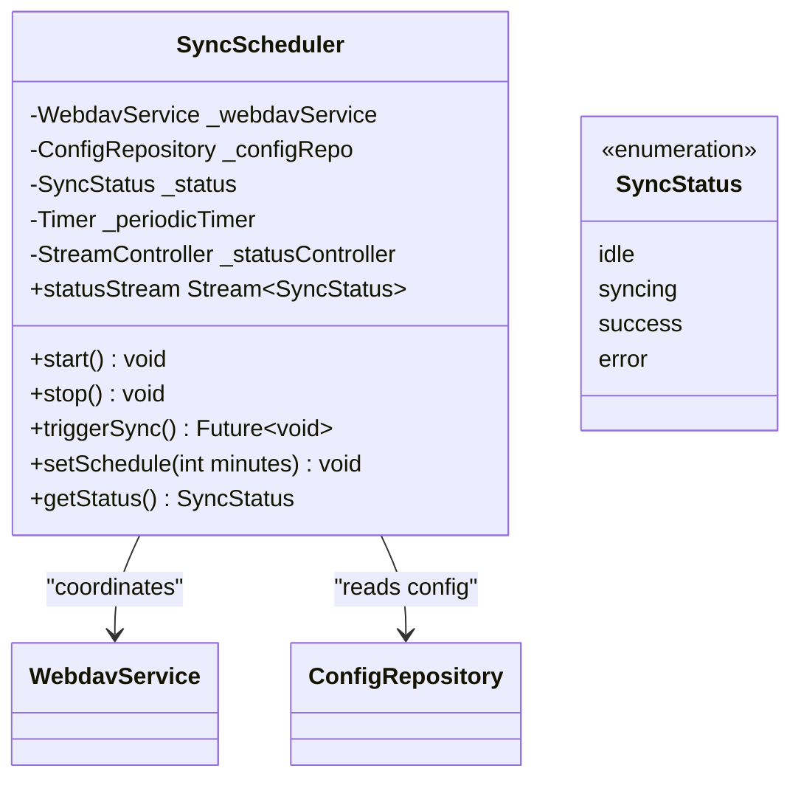
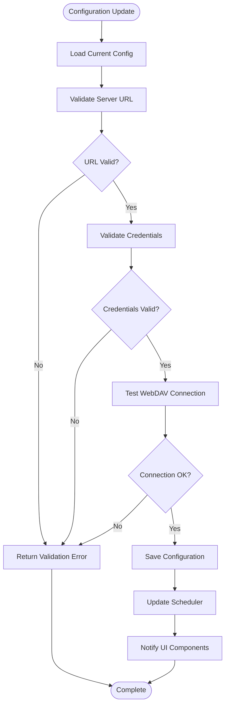
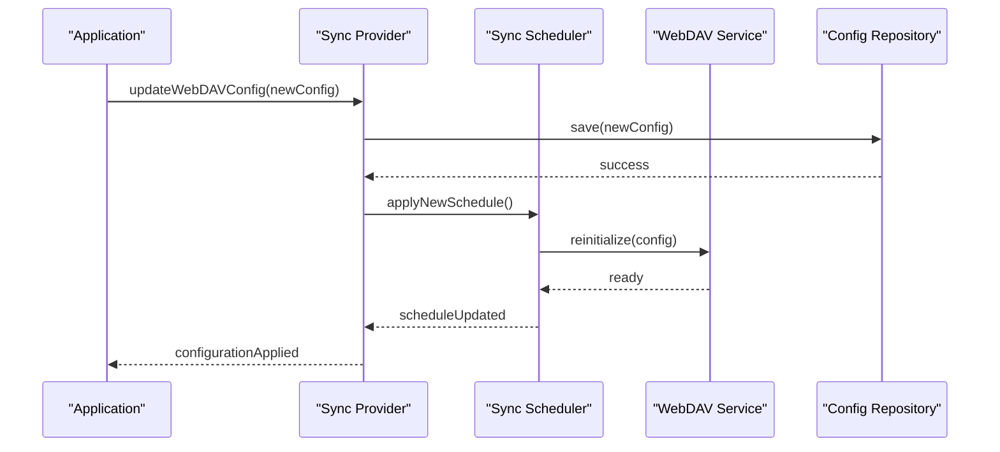
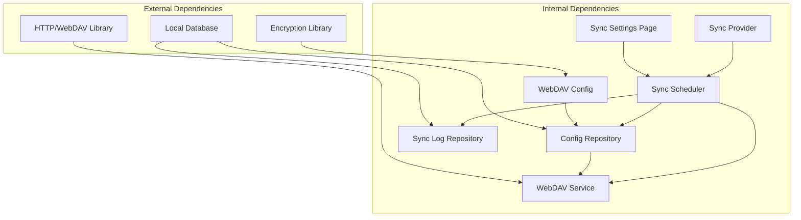

# Cloud Sync Configuration

<cite>
**Referenced Files in This Document**
- [webdav_config.dart](file://lib/models/webdav_config.dart)
- [webdav_service.dart](file://lib/core/network/webdav_service.dart)
- [sync_scheduler.dart](file://lib/core/network/sync_scheduler.dart)
- [config_repository.dart](file://lib/core/storage/config_repository.dart)
- [sync_log_repository.dart](file://lib/core/storage/sync_log_repository.dart)
- [sync_settings_page.dart](file://lib/pages/settings/sync_settings_page.dart)
- [sync_provider.dart](file://lib/providers/sync_provider.dart)
- [export_service.dart](file://lib/core/export/export_service.dart)
</cite>

## Table of Contents
1. [Introduction](#introduction)
2. [Project Structure](#project-structure)
3. [Core Components](#core-components)
4. [Architecture Overview](#architecture-overview)
5. [Detailed Component Analysis](#detailed-component-analysis)
6. [Dependency Analysis](#dependency-analysis)
7. [Performance Considerations](#performance-considerations)
8. [Troubleshooting Guide](#troubleshooting-guide)
9. [Conclusion](#conclusion)

## Introduction
This document provides comprehensive documentation for QNote Flutter's cloud synchronization configuration system with a focus on WebDAV integration. It covers configuration parameters, synchronization preferences, security considerations, scheduler behavior, validation mechanisms, and troubleshooting procedures. The goal is to enable developers and advanced users to configure, monitor, and troubleshoot cloud synchronization effectively.

## Project Structure
The cloud synchronization system is organized around several key modules:
- Configuration models define WebDAV settings and preferences
- Network service handles WebDAV protocol operations
- Scheduler manages timing and triggers for synchronization
- Storage repositories persist configuration and logs
- Settings UI exposes configuration controls to users
- Provider coordinates UI state and sync operations

**Diagram sources**
- [webdav_config.dart](file://lib/models/webdav_config.dart)
- [config_repository.dart](file://lib/core/storage/config_repository.dart)
- [webdav_service.dart](file://lib/core/network/webdav_service.dart)
- [sync_scheduler.dart](file://lib/core/network/sync_scheduler.dart)
- [sync_log_repository.dart](file://lib/core/storage/sync_log_repository.dart)
- [sync_settings_page.dart](file://lib/pages/settings/sync_settings_page.dart)
- [sync_provider.dart](file://lib/providers/sync_provider.dart)

**Section sources**
- [webdav_config.dart](file://lib/models/webdav_config.dart)
- [sync_scheduler.dart](file://lib/core/network/sync_scheduler.dart)
- [config_repository.dart](file://lib/core/storage/config_repository.dart)

## Core Components
This section documents the primary components involved in cloud synchronization configuration and operation.

### WebDAV Configuration Model
The WebDAV configuration model encapsulates all necessary parameters for connecting to a WebDAV server, including:
- Server URL endpoint
- Authentication credentials (username/password)
- Connection parameters (timeout, retry policies)
- Synchronization preferences (auto-sync, interval, conflict resolution)
- Offline mode settings

Key responsibilities:
- Validate configuration inputs
- Provide defaults for optional parameters
- Support serialization/deserialization for persistence
- Enforce security constraints for credential handling

### WebDAV Service
The WebDAV service implements the core protocol operations:
- Establish secure connections to WebDAV endpoints
- Authenticate using configured credentials
- Perform CRUD operations on remote resources
- Handle network errors and retries
- Manage session state and connection pooling

### Sync Scheduler
The sync scheduler orchestrates timing and execution of synchronization tasks:
- Periodic synchronization based on configurable intervals
- Launch-time synchronization trigger
- Background sync capabilities
- Status tracking and progress reporting
- Error propagation and logging

### Configuration Repository
The configuration repository persists and retrieves synchronization settings:
- Store WebDAV configuration securely
- Maintain sync preferences and state
- Provide atomic updates for configuration changes
- Support migration and validation of stored settings

### Sync Log Repository
The sync log repository maintains historical records of synchronization events:
- Track successful and failed sync attempts
- Record timestamps and sizes of synchronized data
- Store error messages and diagnostic information
- Support audit trails for troubleshooting

**Section sources**
- [webdav_config.dart](file://lib/models/webdav_config.dart)
- [webdav_service.dart](file://lib/core/network/webdav_service.dart)
- [sync_scheduler.dart](file://lib/core/network/sync_scheduler.dart)
- [config_repository.dart](file://lib/core/storage/config_repository.dart)
- [sync_log_repository.dart](file://lib/core/storage/sync_log_repository.dart)

## Architecture Overview
The synchronization architecture follows a layered approach with clear separation of concerns:

**Diagram sources**
- [sync_settings_page.dart](file://lib/pages/settings/sync_settings_page.dart)
- [sync_provider.dart](file://lib/providers/sync_provider.dart)
- [sync_scheduler.dart](file://lib/core/network/sync_scheduler.dart)
- [webdav_service.dart](file://lib/core/network/webdav_service.dart)
- [config_repository.dart](file://lib/core/storage/config_repository.dart)
- [sync_log_repository.dart](file://lib/core/storage/sync_log_repository.dart)

## Detailed Component Analysis

### WebDAV Configuration Management
The WebDAV configuration system provides structured management of synchronization parameters:

**Diagram sources**
- [webdav_config.dart](file://lib/models/webdav_config.dart)
- [config_repository.dart](file://lib/core/storage/config_repository.dart)
- [webdav_service.dart](file://lib/core/network/webdav_service.dart)

### Sync Scheduler Implementation
The sync scheduler manages timing and execution of synchronization tasks:

**Diagram sources**
- [sync_scheduler.dart](file://lib/core/network/sync_scheduler.dart)

### Configuration Validation Flow
The configuration validation process ensures data integrity and security:

**Diagram sources**
- [webdav_config.dart](file://lib/models/webdav_config.dart)
- [webdav_service.dart](file://lib/core/network/webdav_service.dart)
- [config_repository.dart](file://lib/core/storage/config_repository.dart)

**Section sources**
- [sync_scheduler.dart](file://lib/core/network/sync_scheduler.dart)
- [webdav_config.dart](file://lib/models/webdav_config.dart)
- [webdav_service.dart](file://lib/core/network/webdav_service.dart)

### Programmatic Configuration Updates
The system supports dynamic configuration updates through provider interfaces:

**Diagram sources**
- [sync_provider.dart](file://lib/providers/sync_provider.dart)
- [sync_scheduler.dart](file://lib/core/network/sync_scheduler.dart)
- [config_repository.dart](file://lib/core/storage/config_repository.dart)

**Section sources**
- [sync_provider.dart](file://lib/providers/sync_provider.dart)
- [sync_settings_page.dart](file://lib/pages/settings/sync_settings_page.dart)

## Dependency Analysis
The synchronization system exhibits clean dependency boundaries with minimal coupling:

**Diagram sources**
- [webdav_config.dart](file://lib/models/webdav_config.dart)
- [webdav_service.dart](file://lib/core/network/webdav_service.dart)
- [sync_scheduler.dart](file://lib/core/network/sync_scheduler.dart)
- [config_repository.dart](file://lib/core/storage/config_repository.dart)
- [sync_log_repository.dart](file://lib/core/storage/sync_log_repository.dart)
- [sync_settings_page.dart](file://lib/pages/settings/sync_settings_page.dart)
- [sync_provider.dart](file://lib/providers/sync_provider.dart)

**Section sources**
- [sync_scheduler.dart](file://lib/core/network/sync_scheduler.dart)
- [webdav_service.dart](file://lib/core/network/webdav_service.dart)

## Performance Considerations
- Connection pooling reduces overhead for frequent sync operations
- Incremental sync minimizes bandwidth usage by synchronizing only changed records
- Background sync scheduling prevents UI blocking during network operations
- Retry mechanisms with exponential backoff handle transient network failures
- Local caching reduces server load and improves responsiveness
- Progress reporting enables user feedback during long-running operations

## Troubleshooting Guide

### Common Configuration Issues
**Invalid Server URL**
- Verify the URL includes proper protocol (https://) and endpoint path
- Ensure the server supports WebDAV protocol
- Check for typos in domain names or paths

**Authentication Failures**
- Confirm username and password are correct
- Verify the user account has sufficient permissions
- Check if two-factor authentication is required

**Connection Timeouts**
- Increase timeout values in configuration
- Verify network connectivity and firewall settings
- Check server availability and response times

**Section sources**
- [webdav_service.dart](file://lib/core/network/webdav_service.dart)
- [sync_log_repository.dart](file://lib/core/storage/sync_log_repository.dart)

### Diagnostic Procedures
1. **Connection Testing**: Use the built-in connection tester to validate server reachability
2. **Credential Validation**: Verify authentication credentials work with the WebDAV server
3. **Network Diagnostics**: Check proxy settings and SSL certificate validity
4. **Server Logs**: Review server-side WebDAV logs for error details
5. **Local Logs**: Examine client-side sync logs for error patterns

### Error Handling Mechanisms
The system implements comprehensive error handling:
- Network exceptions are caught and logged with context
- Authentication errors trigger credential validation prompts
- Timeout errors initiate retry sequences with backoff
- Permission errors guide users to fix access rights
- Configuration errors prevent invalid state transitions

**Section sources**
- [sync_scheduler.dart](file://lib/core/network/sync_scheduler.dart)
- [sync_log_repository.dart](file://lib/core/storage/sync_log_repository.dart)

## Conclusion
QNote Flutter's cloud synchronization system provides a robust, configurable solution for WebDAV-based data synchronization. The modular architecture ensures maintainability while the comprehensive validation and error handling mechanisms support reliable operation. Users can configure synchronization preferences through the intuitive settings interface, while developers can integrate programmatic control for advanced scenarios. The system's emphasis on security, performance, and diagnostics makes it suitable for production environments requiring dependable cloud synchronization capabilities.