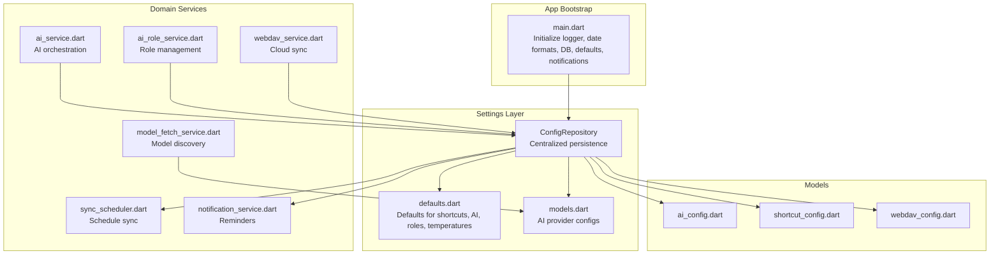
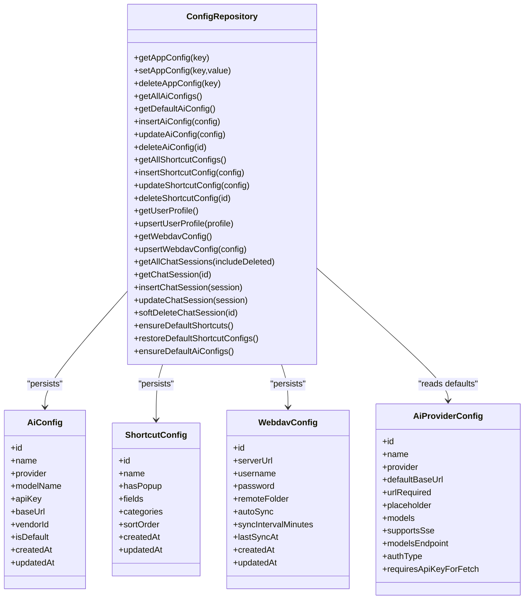
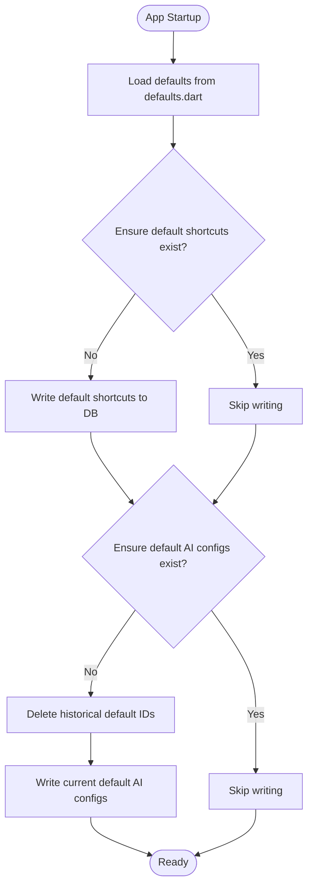
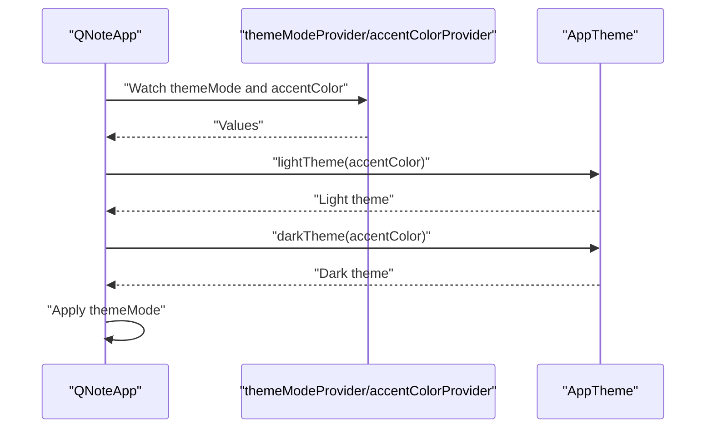
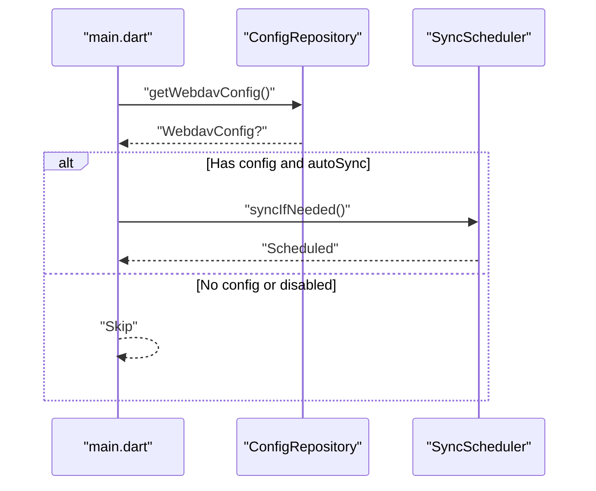
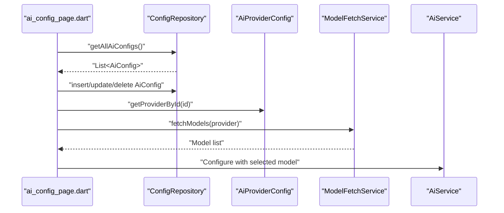
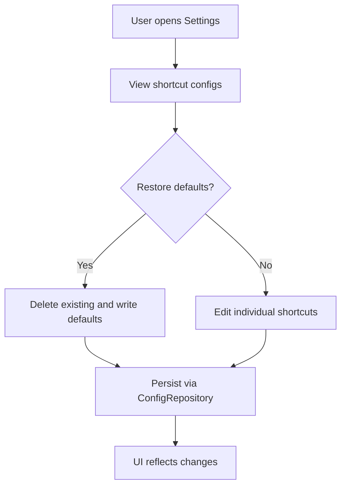
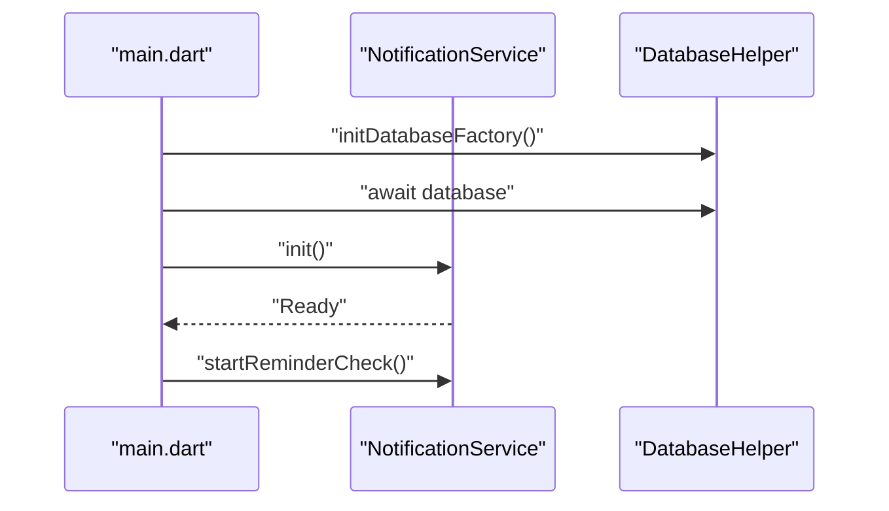
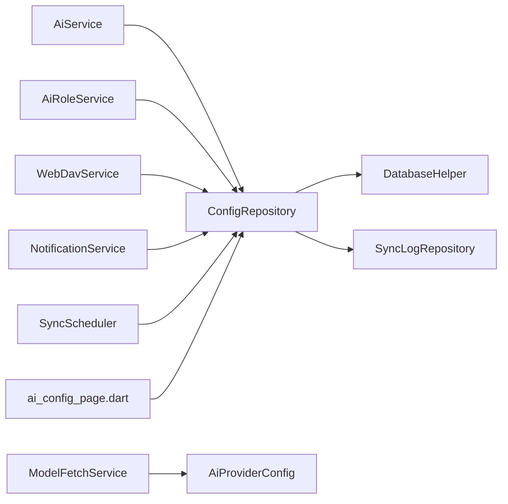
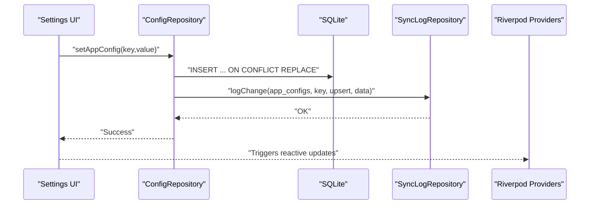

# Configuration and Settings

<cite>
**Referenced Files in This Document**
- [defaults.dart](file://lib/config/defaults.dart)
- [models.dart](file://lib/config/models.dart)
- [config_repository.dart](file://lib/core/storage/config_repository.dart)
- [ai_config.dart](file://lib/models/ai_config.dart)
- [shortcut_config.dart](file://lib/models/shortcut_config.dart)
- [webdav_config.dart](file://lib/models/webdav_config.dart)
- [ai_config_page.dart](file://lib/pages/settings/ai_config_page.dart)
- [main.dart](file://lib/main.dart)
- [app.dart](file://lib/app.dart)
- [database_helper.dart](file://lib/core/storage/database_helper.dart)
- [sync_scheduler.dart](file://lib/core/network/sync_scheduler.dart)
- [notification_service.dart](file://lib/core/notification/notification_service.dart)
- [ai_service.dart](file://lib/core/ai/ai_service.dart)
- [ai_role_service.dart](file://lib/core/ai/ai_role_service.dart)
- [model_fetch_service.dart](file://lib/core/ai/model_fetch_service.dart)
- [webdav_service.dart](file://lib/core/network/webdav_service.dart)
</cite>

## Table of Contents
1. [Introduction](#introduction)
2. [Project Structure](#project-structure)
3. [Core Components](#core-components)
4. [Architecture Overview](#architecture-overview)
5. [Detailed Component Analysis](#detailed-component-analysis)
6. [Dependency Analysis](#dependency-analysis)
7. [Performance Considerations](#performance-considerations)
8. [Security Considerations](#security-considerations)
9. [Persistence and Propagation](#persistence-and-propagation)
10. [Programmatic Access Examples](#programmatic-access-examples)
11. [Troubleshooting Guide](#troubleshooting-guide)
12. [Conclusion](#conclusion)

## Introduction
This document describes QNote Flutter's configuration and settings system. It covers global settings management, user preferences, theme customization, WebDAV cloud synchronization configuration, AI service configuration and model management, application-wide settings (language, notifications, performance), configuration file structures, defaults, overrides, persistence strategy, propagation mechanisms, and security considerations for sensitive data.

## Project Structure
The configuration system spans several layers:
- Defaults and provider models define built-in configurations and provider metadata
- A centralized repository persists and retrieves settings from the local database
- Domain-specific services consume these settings for AI, WebDAV, and notifications
- UI pages allow users to modify settings
- Application bootstrap ensures defaults are established and initial sync conditions are evaluated

**Diagram sources**
- [main.dart:12-31](file://lib/main.dart#L12-L31)
- [config_repository.dart:13-360](file://lib/core/storage/config_repository.dart#L13-L360)
- [defaults.dart:1-285](file://lib/config/defaults.dart#L1-L285)
- [models.dart:1-241](file://lib/config/models.dart#L1-L241)
- [ai_service.dart](file://lib/core/ai/ai_service.dart)
- [ai_role_service.dart](file://lib/core/ai/ai_role_service.dart)
- [model_fetch_service.dart](file://lib/core/ai/model_fetch_service.dart)
- [webdav_service.dart](file://lib/core/network/webdav_service.dart)
- [sync_scheduler.dart](file://lib/core/network/sync_scheduler.dart)
- [notification_service.dart](file://lib/core/notification/notification_service.dart)
- [ai_config.dart](file://lib/models/ai_config.dart)
- [shortcut_config.dart](file://lib/models/shortcut_config.dart)
- [webdav_config.dart](file://lib/models/webdav_config.dart)

**Section sources**
- [main.dart:12-31](file://lib/main.dart#L12-L31)
- [config_repository.dart:13-360](file://lib/core/storage/config_repository.dart#L13-L360)

## Core Components
- Defaults and provider metadata: Define default AI prompts, shortcut configurations, AI provider list, and default labels
- ConfigRepository: Central persistence layer for app_configs, AI configs, shortcut configs, user profiles, WebDAV configs, chat sessions
- Models: Strongly typed settings models for AI, shortcuts, WebDAV, and related domain entities
- Domain services: AI orchestration, role management, model fetching, WebDAV sync, notification scheduling, and sync scheduler
- UI pages: Settings screens for AI configuration and related preferences

Key responsibilities:
- Provide default values and ensure they are written on first run
- Persist user overrides and expose getters/setters
- Support model discovery via provider metadata
- Enforce security boundaries for sensitive data
- Propagate changes to UI and services

**Section sources**
- [defaults.dart:1-285](file://lib/config/defaults.dart#L1-L285)
- [models.dart:1-241](file://lib/config/models.dart#L1-L241)
- [config_repository.dart:13-360](file://lib/core/storage/config_repository.dart#L13-L360)

## Architecture Overview
The configuration architecture follows a layered approach:
- Data layer: Sqflite-backed ConfigRepository
- Domain layer: AI, WebDAV, notification, and sync services
- Presentation layer: Riverpod providers and settings UI
- Bootstrap layer: Ensures defaults and initial conditions

**Diagram sources**
- [config_repository.dart:13-360](file://lib/core/storage/config_repository.dart#L13-L360)
- [ai_config.dart](file://lib/models/ai_config.dart)
- [shortcut_config.dart](file://lib/models/shortcut_config.dart)
- [webdav_config.dart](file://lib/models/webdav_config.dart)
- [models.dart:1-241](file://lib/config/models.dart#L1-L241)

## Detailed Component Analysis

### Global Settings Management and Defaults
- Default AI prompts and roles: System prompts for assistant greeting, unified extraction, daily score calculation, and analysis are defined centrally
- Default shortcut configurations: Predefined shortcut categories (sleep, diet, activity, health, consumption, other) with fields and sort order
- Default labels: Mood labels, priority labels, and symptom types
- Default AI provider list: Comprehensive list of AI providers with base URLs, model lists, SSE support, and authentication requirements
- Default AI configs: Built-in AI configurations with default provider and model selection

**Diagram sources**
- [defaults.dart:1-285](file://lib/config/defaults.dart#L1-L285)
- [config_repository.dart:326-358](file://lib/core/storage/config_repository.dart#L326-L358)

**Section sources**
- [defaults.dart:7-285](file://lib/config/defaults.dart#L7-L285)
- [config_repository.dart:326-358](file://lib/core/storage/config_repository.dart#L326-L358)

### Theme Customization
- Theme mode and accent color are provided via Riverpod providers and applied in the Material app
- Supported locales include Chinese and English
- Theme is applied globally in the app shell

**Diagram sources**
- [app.dart:78-89](file://lib/app.dart#L78-L89)

**Section sources**
- [app.dart:78-99](file://lib/app.dart#L78-L99)

### WebDAV Configuration and Cloud Synchronization
- WebDAV settings include server URL, username, password, remote folder, auto-sync toggle, sync interval, and last sync timestamp
- On startup, if auto-sync is enabled and a WebDAV config exists, the sync scheduler triggers a sync check
- ConfigRepository persists and retrieves WebDAV configuration

**Diagram sources**
- [main.dart:24-27](file://lib/main.dart#L24-L27)
- [config_repository.dart:188-204](file://lib/core/storage/config_repository.dart#L188-L204)
- [sync_scheduler.dart](file://lib/core/network/sync_scheduler.dart)

**Section sources**
- [webdav_config.dart](file://lib/models/webdav_config.dart)
- [config_repository.dart:188-204](file://lib/core/storage/config_repository.dart#L188-L204)
- [main.dart:24-27](file://lib/main.dart#L24-L27)

### AI Service Configuration and Model Management
- AI provider metadata defines base URLs, model lists, SSE support, authentication type, and whether model fetch requires an API key
- ConfigRepository stores multiple AI configurations; a default AI config can be identified
- UI page allows managing AI configurations
- Model discovery leverages provider metadata and endpoints

**Diagram sources**
- [ai_config_page.dart](file://lib/pages/settings/ai_config_page.dart)
- [config_repository.dart:56-111](file://lib/core/storage/config_repository.dart#L56-L111)
- [models.dart:31-241](file://lib/config/models.dart#L31-L241)
- [model_fetch_service.dart](file://lib/core/ai/model_fetch_service.dart)
- [ai_service.dart](file://lib/core/ai/ai_service.dart)

**Section sources**
- [models.dart:1-241](file://lib/config/models.dart#L1-L241)
- [config_repository.dart:56-111](file://lib/core/storage/config_repository.dart#L56-L111)
- [ai_config_page.dart](file://lib/pages/settings/ai_config_page.dart)

### User Preferences and Shortcuts
- Shortcut configurations define categories and fields for quick data entry
- ConfigRepository manages CRUD operations for shortcuts and ensures defaults on first run
- Users can restore defaults or customize shortcut categories and fields

**Diagram sources**
- [config_repository.dart:113-159](file://lib/core/storage/config_repository.dart#L113-L159)
- [config_repository.dart:334-340](file://lib/core/storage/config_repository.dart#L334-L340)
- [defaults.dart:89-251](file://lib/config/defaults.dart#L89-L251)

**Section sources**
- [config_repository.dart:113-159](file://lib/core/storage/config_repository.dart#L113-L159)
- [config_repository.dart:334-340](file://lib/core/storage/config_repository.dart#L334-L340)
- [defaults.dart:89-251](file://lib/config/defaults.dart#L89-L251)

### Application-Wide Settings
- Language preferences: Supported locales configured in the app shell
- Notifications: Notification service initialized during bootstrap; reminder checks started after configuration load
- Performance optimizations: Database initialization and date format initialization occur at startup

**Diagram sources**
- [main.dart:12-31](file://lib/main.dart#L12-L31)
- [notification_service.dart](file://lib/core/notification/notification_service.dart)
- [database_helper.dart](file://lib/core/storage/database_helper.dart)

**Section sources**
- [app.dart:90-99](file://lib/app.dart#L90-L99)
- [main.dart:12-31](file://lib/main.dart#L12-L31)

## Dependency Analysis
- ConfigRepository depends on DatabaseHelper and SyncLogRepository for persistence and change logging
- AI services depend on ConfigRepository for model and provider configuration
- WebDAV service depends on ConfigRepository for credentials and sync preferences
- UI pages depend on ConfigRepository for reading/writing settings
- Bootstrap depends on ConfigRepository to ensure defaults and evaluate initial sync conditions

**Diagram sources**
- [config_repository.dart:18-19](file://lib/core/storage/config_repository.dart#L18-L19)
- [ai_service.dart](file://lib/core/ai/ai_service.dart)
- [ai_role_service.dart](file://lib/core/ai/ai_role_service.dart)
- [model_fetch_service.dart](file://lib/core/ai/model_fetch_service.dart)
- [webdav_service.dart](file://lib/core/network/webdav_service.dart)
- [notification_service.dart](file://lib/core/notification/notification_service.dart)
- [sync_scheduler.dart](file://lib/core/network/sync_scheduler.dart)
- [ai_config_page.dart](file://lib/pages/settings/ai_config_page.dart)

**Section sources**
- [config_repository.dart:18-19](file://lib/core/storage/config_repository.dart#L18-L19)

## Performance Considerations
- Batch initialization: Defaults and services are initialized concurrently at startup to reduce boot time
- Minimal queries: Defaults are ensured once per app lifecycle; subsequent runs skip writes
- Efficient updates: Timestamps are updated atomically during writes to maintain consistency
- Avoid unnecessary refreshes: UI providers refresh only on lifecycle resume to minimize work

[No sources needed since this section provides general guidance]

## Security Considerations
- Sensitive data handling: WebDAV credentials and AI API keys are stored in the local database. Treat the device storage as sensitive and secure
- Authentication types: Some providers require bearer tokens, others query parameters, and some do not require API keys for model discovery. Respect provider authType and requirements
- Least privilege: Prefer provider endpoints that do not require API keys for read-only operations when possible
- Secure transport: Ensure WebDAV server URLs use HTTPS and validate certificates appropriately
- Secrets rotation: Provide mechanisms to update API keys and WebDAV passwords without reinstallation

[No sources needed since this section provides general guidance]

## Persistence and Propagation
- Persistence strategy: Settings are persisted in the local SQLite database via ConfigRepository with upsert semantics and conflict resolution
- Change logging: Sync log repository records changes to app_configs and other tables for synchronization
- Propagation: UI updates react to Riverpod providers; services read settings on demand; bootstrap evaluates initial conditions

**Diagram sources**
- [config_repository.dart:32-44](file://lib/core/storage/config_repository.dart#L32-L44)
- [config_repository.dart:38-43](file://lib/core/storage/config_repository.dart#L38-L43)

**Section sources**
- [config_repository.dart:21-54](file://lib/core/storage/config_repository.dart#L21-L54)

## Programmatic Access Examples
- Get a generic app configuration value:
  - [config_repository.dart:21-30](file://lib/core/storage/config_repository.dart#L21-L30)
- Set a generic app configuration value:
  - [config_repository.dart:32-44](file://lib/core/storage/config_repository.dart#L32-L44)
- Delete a generic app configuration value:
  - [config_repository.dart:46-54](file://lib/core/storage/config_repository.dart#L46-L54)
- Manage AI configurations:
  - [config_repository.dart:56-111](file://lib/core/storage/config_repository.dart#L56-L111)
- Manage shortcut configurations:
  - [config_repository.dart:113-159](file://lib/core/storage/config_repository.dart#L113-L159)
- Manage WebDAV configuration:
  - [config_repository.dart:188-204](file://lib/core/storage/config_repository.dart#L188-L204)
- Ensure defaults on first run:
  - [config_repository.dart:326-358](file://lib/core/storage/config_repository.dart#L326-L358)
- Retrieve and apply theme settings:
  - [app.dart:78-89](file://lib/app.dart#L78-L89)
- Initialize notifications and schedule reminders:
  - [main.dart:22-28](file://lib/main.dart#L22-L28)

**Section sources**
- [config_repository.dart:21-358](file://lib/core/storage/config_repository.dart#L21-L358)
- [app.dart:78-89](file://lib/app.dart#L78-L89)
- [main.dart:22-28](file://lib/main.dart#L22-L28)

## Troubleshooting Guide
- Defaults not applied:
  - Verify ensureDefaultShortcuts and ensureDefaultAiConfigs are called during bootstrap
  - Check for exceptions during concurrent initialization
  - References: [main.dart:19-23](file://lib/main.dart#L19-L23), [config_repository.dart:326-358](file://lib/core/storage/config_repository.dart#L326-L358)
- WebDAV sync not triggering:
  - Confirm WebDAV config exists and autoSync is enabled
  - Verify SyncScheduler is invoked after config retrieval
  - References: [main.dart:24-27](file://lib/main.dart#L24-L27), [config_repository.dart:188-204](file://lib/core/storage/config_repository.dart#L188-L204)
- AI model list empty:
  - Ensure provider metadata includes modelsEndpoint and correct authType
  - Verify API key availability if required for model fetch
  - References: [models.dart:31-241](file://lib/config/models.dart#L31-L241), [model_fetch_service.dart](file://lib/core/ai/model_fetch_service.dart)
- Theme not updating:
  - Confirm themeModeProvider and accentColorProvider are wired in the app shell
  - References: [app.dart:78-89](file://lib/app.dart#L78-L89)

**Section sources**
- [main.dart:19-27](file://lib/main.dart#L19-L27)
- [config_repository.dart:326-358](file://lib/core/storage/config_repository.dart#L326-L358)
- [models.dart:31-241](file://lib/config/models.dart#L31-L241)
- [app.dart:78-89](file://lib/app.dart#L78-L89)

## Conclusion
QNote Flutter’s configuration system centers on a robust, database-backed repository that manages defaults, user overrides, and domain-specific settings. AI, WebDAV, and UI components consume these settings reactively, ensuring a consistent and secure configuration experience across the application.