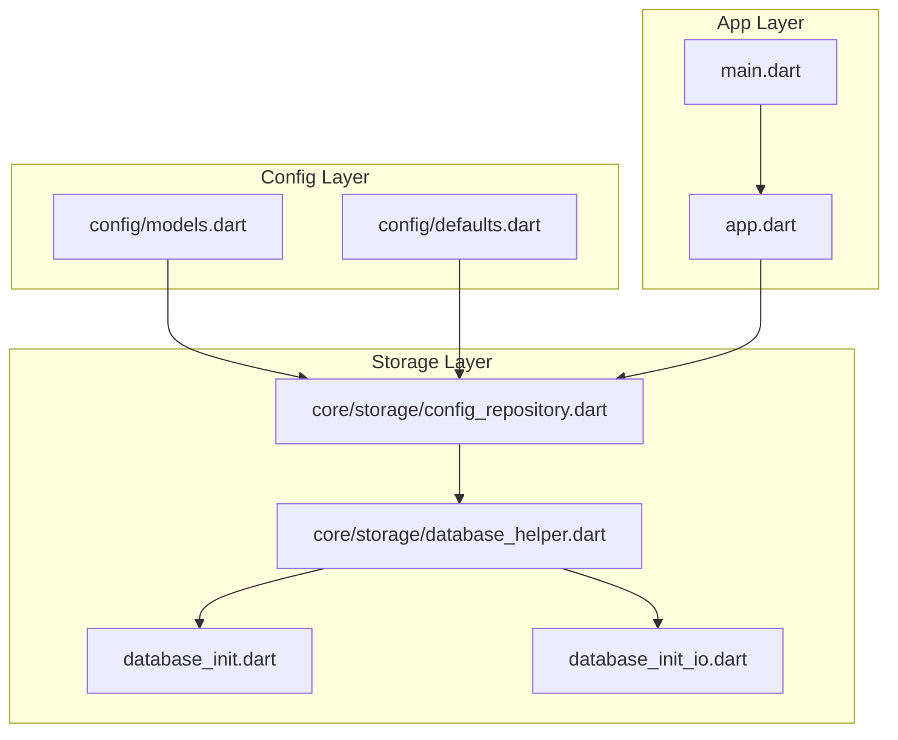
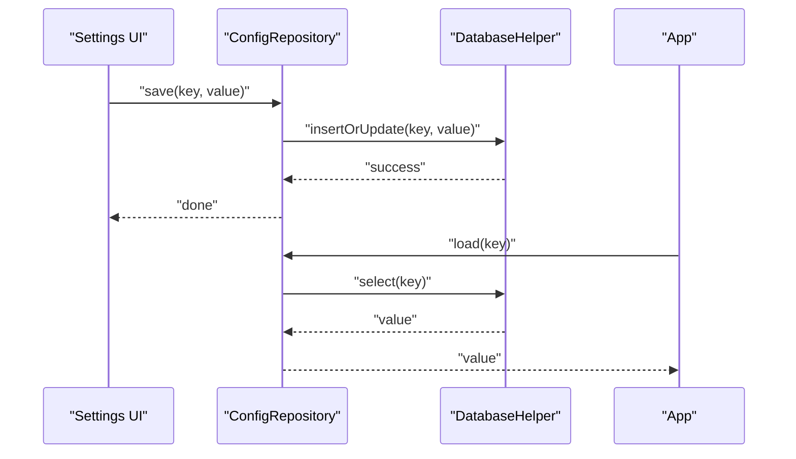
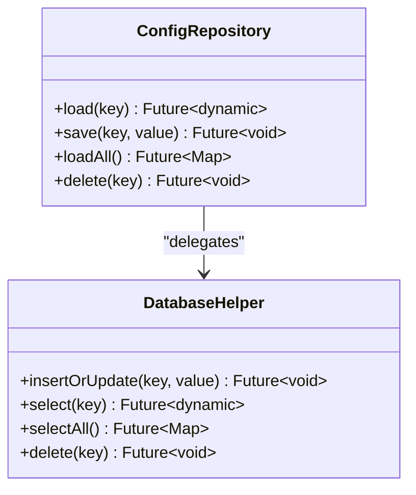
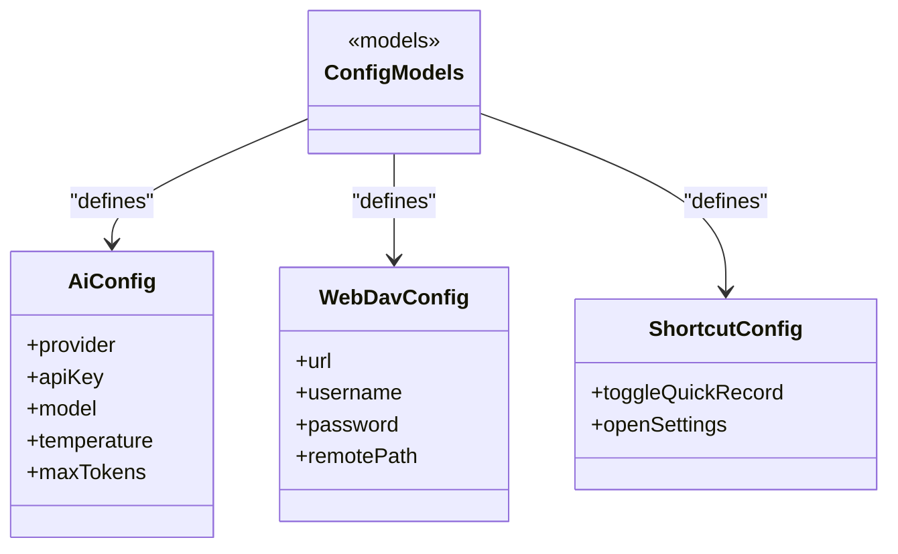
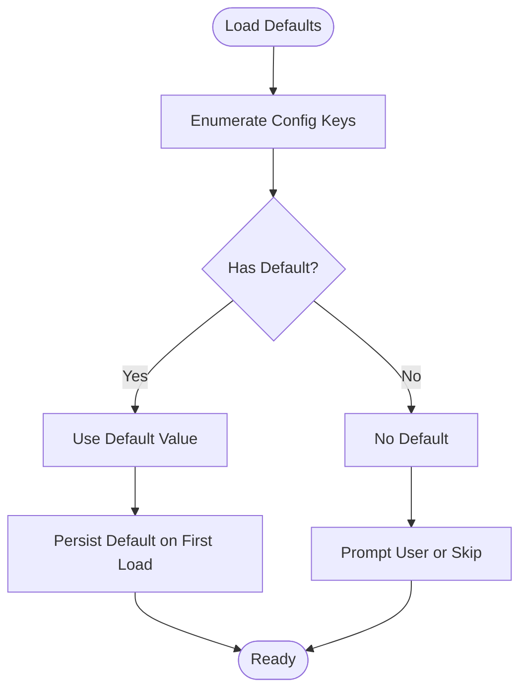
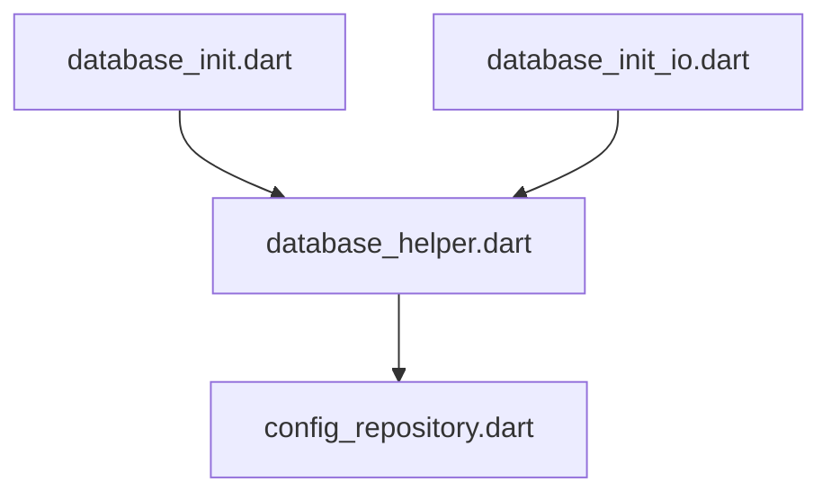
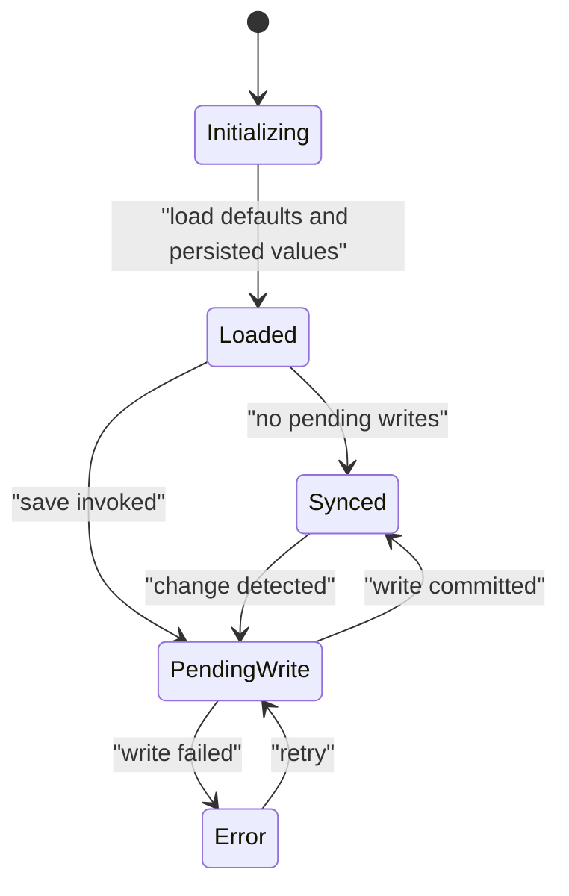
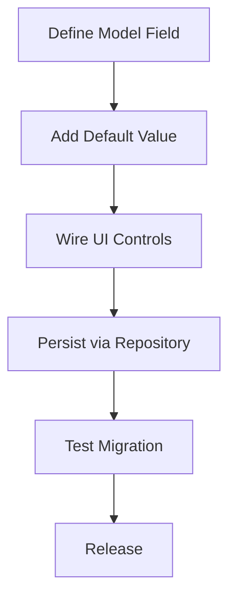
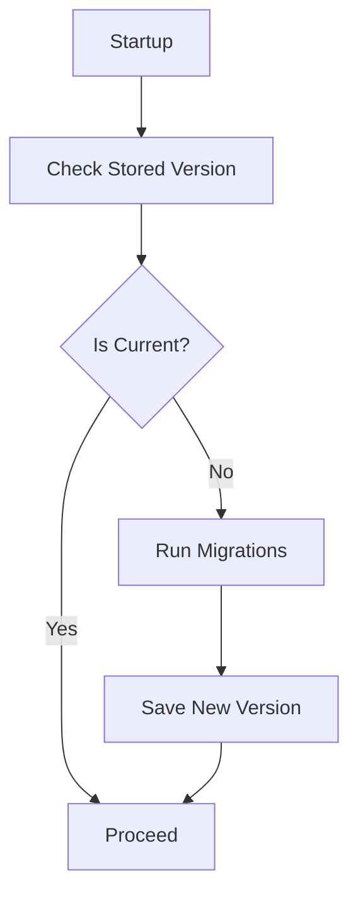
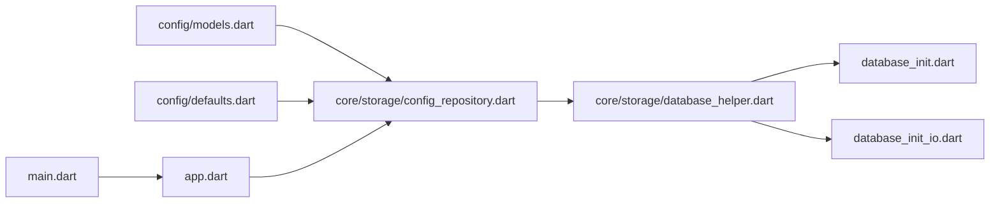

# User Preferences and Persistence

<cite>
**Referenced Files in This Document**
- [config_repository.dart](file://lib/core/storage/config_repository.dart)
- [defaults.dart](file://lib/config/defaults.dart)
- [models.dart](file://lib/config/models.dart)
- [ai_config.dart](file://lib/models/ai_config.dart)
- [shortcut_config.dart](file://lib/models/shortcut_config.dart)
- [webdav_config.dart](file://lib/models/webdav_config.dart)
- [ai_config_page.dart](file://lib/pages/settings/ai_config_page.dart)
- [database_helper.dart](file://lib/core/storage/database_helper.dart)
- [database_init.dart](file://lib/database_init.dart)
- [database_init_io.dart](file://lib/database_init_io.dart)
- [app.dart](file://lib/app.dart)
- [main.dart](file://lib/main.dart)
- [models_test.dart](file://test/config/models_test.dart)
</cite>

## Table of Contents
1. [Introduction](#introduction)
2. [Project Structure](#project-structure)
3. [Core Components](#core-components)
4. [Architecture Overview](#architecture-overview)
5. [Detailed Component Analysis](#detailed-component-analysis)
6. [Dependency Analysis](#dependency-analysis)
7. [Performance Considerations](#performance-considerations)
8. [Troubleshooting Guide](#troubleshooting-guide)
9. [Conclusion](#conclusion)

## Introduction
This document explains QNote Flutter’s user preferences and configuration persistence system. It covers how user settings are stored, retrieved, and synchronized across application restarts, the configuration repository pattern implementation, and data persistence strategies. It also documents preference categories (UI settings, functional preferences, and behavioral options), configuration migration and versioning mechanisms, and practical guidance for adding new configuration options, handling defaults, and managing updates. Finally, it addresses performance considerations and the relationship between runtime configuration state and persistent storage.

## Project Structure
QNote organizes configuration under a dedicated configuration module and a storage repository that persists settings to the device’s local database. Supporting model classes define typed configuration structures, while initialization helpers set up the underlying database. The application bootstraps configuration during startup.

**Diagram sources**
- [config_repository.dart](file://lib/core/storage/config_repository.dart)
- [defaults.dart](file://lib/config/defaults.dart)
- [models.dart](file://lib/config/models.dart)
- [database_helper.dart](file://lib/core/storage/database_helper.dart)
- [database_init.dart](file://lib/database_init.dart)
- [database_init_io.dart](file://lib/database_init_io.dart)
- [app.dart](file://lib/app.dart)
- [main.dart](file://lib/main.dart)

**Section sources**
- [config_repository.dart](file://lib/core/storage/config_repository.dart)
- [defaults.dart](file://lib/config/defaults.dart)
- [models.dart](file://lib/config/models.dart)
- [database_helper.dart](file://lib/core/storage/database_helper.dart)
- [database_init.dart](file://lib/database_init.dart)
- [database_init_io.dart](file://lib/database_init_io.dart)
- [app.dart](file://lib/app.dart)
- [main.dart](file://lib/main.dart)

## Core Components
- Configuration models: Strongly typed structures representing persisted configuration categories (e.g., AI, WebDAV, shortcuts).
- Defaults provider: Centralized default values for configuration keys.
- Configuration repository: Implements the repository pattern to load/save configurations from persistent storage.
- Storage backend: Local database abstraction via a helper and initialization modules.
- Application bootstrap: Initializes configuration early in the app lifecycle.

Key responsibilities:
- Define configuration schemas and defaults.
- Persist and retrieve configuration items reliably.
- Provide a unified interface for reading/writing preferences.
- Support migration/versioning of configuration records.

**Section sources**
- [models.dart](file://lib/config/models.dart)
- [defaults.dart](file://lib/config/defaults.dart)
- [config_repository.dart](file://lib/core/storage/config_repository.dart)
- [database_helper.dart](file://lib/core/storage/database_helper.dart)
- [database_init.dart](file://lib/database_init.dart)
- [database_init_io.dart](file://lib/database_init_io.dart)
- [app.dart](file://lib/app.dart)
- [main.dart](file://lib/main.dart)

## Architecture Overview
The configuration system follows a layered architecture:
- Presentation/UI: Settings screens update configuration values.
- Domain/Repository: Centralized logic for persistence and retrieval.
- Data/Storage: Local database abstraction with initialization.

**Diagram sources**
- [config_repository.dart](file://lib/core/storage/config_repository.dart)
- [database_helper.dart](file://lib/core/storage/database_helper.dart)
- [ai_config_page.dart](file://lib/pages/settings/ai_config_page.dart)
- [app.dart](file://lib/app.dart)

## Detailed Component Analysis

### Configuration Repository Pattern
The repository encapsulates persistence concerns and exposes a simple API for reading/writing configuration values. It coordinates with the database helper to perform inserts/updates and queries.

**Diagram sources**
- [config_repository.dart](file://lib/core/storage/config_repository.dart)
- [database_helper.dart](file://lib/core/storage/database_helper.dart)

**Section sources**
- [config_repository.dart](file://lib/core/storage/config_repository.dart)
- [database_helper.dart](file://lib/core/storage/database_helper.dart)

### Configuration Models and Defaults
Configuration models define structured settings for different domains (e.g., AI, WebDAV, shortcuts). Defaults provide fallback values when a setting is missing.

**Diagram sources**
- [models.dart](file://lib/config/models.dart)
- [ai_config.dart](file://lib/models/ai_config.dart)
- [webdav_config.dart](file://lib/models/webdav_config.dart)
- [shortcut_config.dart](file://lib/models/shortcut_config.dart)

**Section sources**
- [models.dart](file://lib/config/models.dart)
- [ai_config.dart](file://lib/models/ai_config.dart)
- [webdav_config.dart](file://lib/models/webdav_config.dart)
- [shortcut_config.dart](file://lib/models/shortcut_config.dart)

### Defaults Provider
Defaults centralize default values for configuration keys, ensuring consistent behavior when no persisted value exists.

**Diagram sources**
- [defaults.dart](file://lib/config/defaults.dart)

**Section sources**
- [defaults.dart](file://lib/config/defaults.dart)

### Database Initialization and Helper
Initialization modules set up the local database environment, and the helper abstracts CRUD operations for configuration entries.

**Diagram sources**
- [database_init.dart](file://lib/database_init.dart)
- [database_init_io.dart](file://lib/database_init_io.dart)
- [database_helper.dart](file://lib/core/storage/database_helper.dart)
- [config_repository.dart](file://lib/core/storage/config_repository.dart)

**Section sources**
- [database_init.dart](file://lib/database_init.dart)
- [database_init_io.dart](file://lib/database_init_io.dart)
- [database_helper.dart](file://lib/core/storage/database_helper.dart)

### Runtime State vs Persistent Storage
Runtime configuration state is typically held in memory and synchronized with persistent storage through the repository. This ensures fast reads and writes during UI interactions, while durability is guaranteed by the underlying database.

**Diagram sources**
- [config_repository.dart](file://lib/core/storage/config_repository.dart)
- [database_helper.dart](file://lib/core/storage/database_helper.dart)

**Section sources**
- [config_repository.dart](file://lib/core/storage/config_repository.dart)
- [database_helper.dart](file://lib/core/storage/database_helper.dart)

### Preference Categories
- UI settings: Theme, font size, color scheme, and layout preferences.
- Functional preferences: AI provider configuration, WebDAV synchronization settings, and shortcut bindings.
- Behavioral options: Quick record toggles, notification preferences, and sync scheduling.

These categories are represented by typed models and persisted via the repository.

**Section sources**
- [models.dart](file://lib/config/models.dart)
- [ai_config.dart](file://lib/models/ai_config.dart)
- [webdav_config.dart](file://lib/models/webdav_config.dart)
- [shortcut_config.dart](file://lib/models/shortcut_config.dart)

### Adding New Configuration Options
Steps to add a new configuration option:
1. Define a new model field or category in the configuration models.
2. Add a default value in the defaults provider.
3. Integrate UI to read/write the new setting.
4. Ensure the repository supports persistence for the new key.
5. Test migration and backward compatibility.

**Diagram sources**
- [models.dart](file://lib/config/models.dart)
- [defaults.dart](file://lib/config/defaults.dart)
- [config_repository.dart](file://lib/core/storage/config_repository.dart)

**Section sources**
- [models.dart](file://lib/config/models.dart)
- [defaults.dart](file://lib/config/defaults.dart)
- [config_repository.dart](file://lib/core/storage/config_repository.dart)

### Handling Default Values
- On first load, defaults are applied for missing keys.
- UI reads fall back to defaults when no persisted value exists.
- Defaults are written to storage on first encounter to avoid repeated computation.

**Section sources**
- [defaults.dart](file://lib/config/defaults.dart)
- [config_repository.dart](file://lib/core/storage/config_repository.dart)

### Managing Configuration Updates
- Incremental updates: Apply delta changes to existing records.
- Versioned migrations: Track schema/version and apply transformations.
- Validation: Ensure type safety and constraints before persisting.

**Section sources**
- [config_repository.dart](file://lib/core/storage/config_repository.dart)
- [models_test.dart](file://test/config/models_test.dart)

### Configuration Migration and Versioning
- Maintain a version number for the configuration schema.
- On startup, compare current version with stored version.
- Apply migration steps to transform older records to the new schema.
- Ensure idempotent migrations to prevent reapplication issues.

**Diagram sources**
- [config_repository.dart](file://lib/core/storage/config_repository.dart)

**Section sources**
- [config_repository.dart](file://lib/core/storage/config_repository.dart)

## Dependency Analysis
The configuration system exhibits low coupling and high cohesion:
- Models depend only on primitives and enums.
- Repository depends on the database helper.
- Initialization modules abstract platform-specific setup.
- UI pages depend on repository for persistence.

**Diagram sources**
- [models.dart](file://lib/config/models.dart)
- [defaults.dart](file://lib/config/defaults.dart)
- [config_repository.dart](file://lib/core/storage/config_repository.dart)
- [database_helper.dart](file://lib/core/storage/database_helper.dart)
- [database_init.dart](file://lib/database_init.dart)
- [database_init_io.dart](file://lib/database_init_io.dart)
- [app.dart](file://lib/app.dart)
- [main.dart](file://lib/main.dart)

**Section sources**
- [models.dart](file://lib/config/models.dart)
- [defaults.dart](file://lib/config/defaults.dart)
- [config_repository.dart](file://lib/core/storage/config_repository.dart)
- [database_helper.dart](file://lib/core/storage/database_helper.dart)
- [database_init.dart](file://lib/database_init.dart)
- [database_init_io.dart](file://lib/database_init_io.dart)
- [app.dart](file://lib/app.dart)
- [main.dart](file://lib/main.dart)

## Performance Considerations
- Minimize IO operations: Batch writes and coalesce frequent updates.
- Use in-memory caching: Keep a lightweight cache of recent values to reduce disk access.
- Lazy initialization: Load defaults lazily only when needed.
- Efficient serialization: Prefer compact binary or JSON encodings for complex models.
- Background writes: Perform persistence off the UI thread to avoid jank.
- Indexing: Ensure the configuration table is indexed by key for fast lookups.

[No sources needed since this section provides general guidance]

## Troubleshooting Guide
Common issues and resolutions:
- Missing defaults: Verify defaults provider includes all keys; initialize missing values on first load.
- Type mismatches: Validate deserialization against model schemas; handle unknown fields gracefully.
- Migration failures: Log version mismatch and rollback strategy; ensure migrations are idempotent.
- Concurrency: Serialize writes to prevent race conditions; use transactions for batch updates.
- Corruption: Implement checksums or version stamps; provide recovery paths.

**Section sources**
- [config_repository.dart](file://lib/core/storage/config_repository.dart)
- [models_test.dart](file://test/config/models_test.dart)

## Conclusion
QNote’s configuration system combines typed models, centralized defaults, and a repository pattern backed by a local database. This design ensures reliable persistence, clear separation of concerns, and extensibility for future preferences. By following the outlined patterns for adding options, handling defaults, and managing migrations, developers can maintain a robust and performant configuration layer.