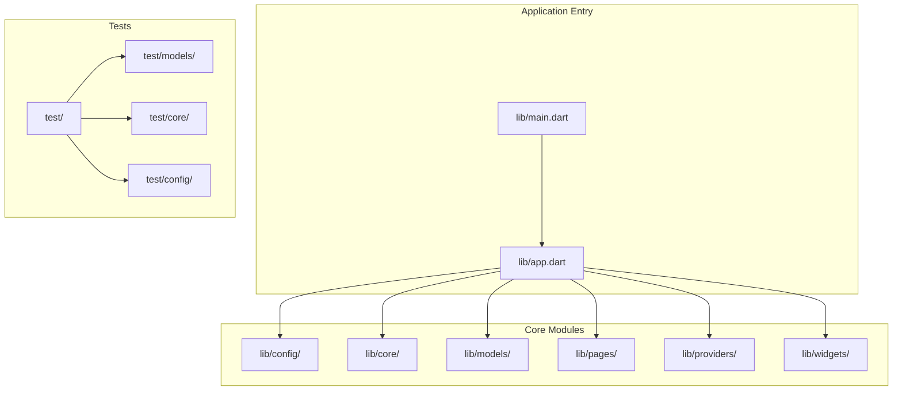

# Contributing Guidelines

<cite>
**Referenced Files in This Document**
- [analysis_options.yaml](file://analysis_options.yaml)
- [pubspec.yaml](file://pubspec.yaml)
- [README.md](file://README.md)
- [AGENTS.md](file://AGENTS.md)
- [main.dart](file://lib/main.dart)
- [app.dart](file://lib/app.dart)
- [build_install.bat](file://build_install.bat)
- [build_send.bat](file://build_send.bat)
- [build_send_mail.bat](file://build_send_mail.bat)
- [send_email.ps1](file://send_email.ps1)
- [send_email_split.ps1](file://send_email_split.ps1)
- [sync_to_share.ps1](file://sync_to_share.ps1)
- [01构建到手机命令.md](file://01构建到手机命令.md)
- [test/widget_test.dart](file://test/widget_test.dart)
- [test/models/diary_record_test.dart](file://test/models/diary_record_test.dart)
- [test/core/utils/schema_formatter_test.dart](file://test/core/utils/schema_formatter_test.dart)
- [test/config/models_test.dart](file://test/config/models_test.dart)
</cite>

## Table of Contents
1. [Introduction](#introduction)
2. [Project Structure](#project-structure)
3. [Development Workflow](#development-workflow)
4. [Coding Standards and Style Guidelines](#coding-standards-and-style-guidelines)
5. [Testing Requirements and Quality Assurance](#testing-requirements-and-quality-assurance)
6. [Continuous Integration and Automated Testing](#continuous-integration-and-automated-testing)
7. [Code Formatting and Documentation Standards](#code-formatting-and-documentation-standards)
8. [Commit Message Conventions](#commit-message-conventions)
9. [Bug Reports, Feature Requests, and Discussions](#bug-reports-feature-requests-and-discussions)
10. [Release Process and Integration](#release-process-and-integration)
11. [Onboarding and Mentorship](#onboarding-and-mentorship)
12. [Troubleshooting Guide](#troubleshooting-guide)
13. [Conclusion](#conclusion)

## Introduction
This document provides comprehensive contributing guidelines for QNote Flutter. It covers the development workflow, code contribution process, pull request guidelines, code review standards, coding standards, project structure, testing requirements, continuous integration, formatting and documentation standards, commit conventions, issue reporting, release process, and onboarding for new contributors.

## Project Structure
QNote follows a layered, feature-oriented structure under lib/. The application initializes core services and databases in main.dart, then renders the app via app.dart. The project includes dedicated directories for configuration, core logic, models, pages, providers (Riverpod), and widgets. Tests mirror lib’s structure under test/.

**Diagram sources**
- [main.dart](file://lib/main.dart)
- [app.dart](file://lib/app.dart)

**Section sources**
- [AGENTS.md](file://AGENTS.md)
- [main.dart](file://lib/main.dart)
- [app.dart](file://lib/app.dart)

## Development Workflow
- Fork and clone the repository.
- Create a feature branch for your work.
- Follow the coding standards and testing requirements outlined below.
- Run local checks (analyzer, tests) before opening a pull request.
- Open a Pull Request targeting the main branch with a clear description and references to related issues.
- Participate in code reviews and address feedback promptly.

## Coding Standards and Style Guidelines
- Linting is configured via analysis_options.yaml, which includes Flutter’s recommended lints.
- Internal style conventions documented in AGENTS.md:
  - Prefer single quotes, limit line width, use trailing commas for multiline parameters, and always use braces for control flow.
  - Group imports into four categories (Dart core, Flutter, third-party, project internal), separated by blank lines and sorted alphabetically.
  - Provide documentation comments for public APIs using ///.
  - Use Chinese for in-line comments to explain “why”.
  - Standardized TODO format: // TODO(name): description #issue.
- These conventions align with Flutter’s style but emphasize internal consistency and clarity.

**Section sources**
- [analysis_options.yaml](file://analysis_options.yaml)
- [AGENTS.md](file://AGENTS.md)

## Testing Requirements and Quality Assurance
- Test structure mirrors lib/: test/ mirrors lib/ with test files named xxx_test.dart.
- Recommended practice: add tests for new features and logic.
- Example test files:
  - [widget_test.dart](file://test/widget_test.dart)
  - [diary_record_test.dart](file://test/models/diary_record_test.dart)
  - [schema_formatter_test.dart](file://test/core/utils/schema_formatter_test.dart)
  - [models_test.dart](file://test/config/models_test.dart)
- Ensure tests are runnable locally and reflect the project’s testing approach.

**Section sources**
- [AGENTS.md](file://AGENTS.md)
- [test/widget_test.dart](file://test/widget_test.dart)
- [test/models/diary_record_test.dart](file://test/models/diary_record_test.dart)
- [test/core/utils/schema_formatter_test.dart](file://test/core/utils/schema_formatter_test.dart)
- [test/config/models_test.dart](file://test/config/models_test.dart)

## Continuous Integration and Automated Testing
- The repository includes scripts for building, sending builds, and automation tasks:
  - [build_install.bat](file://build_install.bat)
  - [build_send.bat](file://build_send.bat)
  - [build_send_mail.bat](file://build_send_mail.bat)
  - [send_email.ps1](file://send_email.ps1)
  - [send_email_split.ps1](file://send_email_split.ps1)
  - [sync_to_share.ps1](file://sync_to_share.ps1)
  - [01构建到手机命令.md](file://01构建到手机命令.md)
- CI pipelines should enforce:
  - Running the analyzer (flutter analyze).
  - Executing unit and widget tests.
  - Ensuring formatting and style compliance.
  - Verifying build artifacts for target platforms.
- Integrate these scripts into CI jobs to automate verification and distribution steps.

**Section sources**
- [build_install.bat](file://build_install.bat)
- [build_send.bat](file://build_send.bat)
- [build_send_mail.bat](file://build_send_mail.bat)
- [send_email.ps1](file://send_email.ps1)
- [send_email_split.ps1](file://send_email_split.ps1)
- [sync_to_share.ps1](file://sync_to_share.ps1)
- [01构建到手机命令.md](file://01构建到手机命令.md)

## Code Formatting and Documentation Standards
- Formatting:
  - Single quotes for strings.
  - Line width ≤ 120 characters.
  - Trailing commas for multiline parameters.
  - Braces for all control flow statements.
  - Import grouping and alphabetical ordering.
- Documentation:
  - Public APIs must include /// documentation comments.
  - In-line comments should be in Chinese and explain the “why.”
  - Standardized TODO format: // TODO(name): description #issue.
- These standards ensure readability, maintainability, and team alignment.

**Section sources**
- [AGENTS.md](file://AGENTS.md)

## Commit Message Conventions
- Use the conventional commit type with scope and description:
  - Types: feat, fix, refactor, style, docs, test, chore.
  - Format: <type>(<scope>): <description>.
- This improves traceability and supports automated changelog generation.

**Section sources**
- [AGENTS.md](file://AGENTS.md)

## Bug Reports, Feature Requests, and Discussions
- Use GitHub Issues for bug reports and feature requests.
- Provide clear reproduction steps, expected vs. actual behavior, and environment details.
- For design or architecture questions, open a Discussion or reference existing threads.
- Keep discussions constructive and aligned with project goals.

## Release Process and Integration
- Pull Requests should target the main branch and pass all checks.
- After approval, maintainers merge changes; avoid force-pushing to protected branches.
- Maintain CHANGELOG.md entries for significant changes with date and categorized bullet points.
- Build and distribute artifacts using the provided scripts and CI pipeline.

**Section sources**
- [AGENTS.md](file://AGENTS.md)

## Onboarding and Mentorship
- New contributors should:
  - Review the project structure and coding standards.
  - Start with small, well-scoped issues labeled “good first issue.”
  - Engage with maintainers during code review and ask questions early.
- Experienced contributors are encouraged to mentor newcomers and guide them through PRs.

## Troubleshooting Guide
- Local setup:
  - Ensure Flutter SDK and dependencies are installed per pubspec.yaml.
  - Verify analyzer passes after applying style changes.
- Build and distribution:
  - Use the provided batch and PowerShell scripts for local builds and sharing.
  - Confirm platform-specific configurations and assets are present.
- Application startup:
  - Review initialization order in main.dart and app.dart for service setup and routing.

**Section sources**
- [pubspec.yaml](file://pubspec.yaml)
- [analysis_options.yaml](file://analysis_options.yaml)
- [main.dart](file://lib/main.dart)
- [app.dart](file://lib/app.dart)
- [build_install.bat](file://build_install.bat)
- [build_send.bat](file://build_send.bat)
- [build_send_mail.bat](file://build_send_mail.bat)
- [send_email.ps1](file://send_email.ps1)
- [send_email_split.ps1](file://send_email_split.ps1)
- [sync_to_share.ps1](file://sync_to_share.ps1)
- [01构建到手机命令.md](file://01构建到手机命令.md)

## Conclusion
By following these guidelines—adhering to style and testing standards, engaging constructively in code review, and leveraging the provided scripts and conventions—you will help maintain QNote’s quality, consistency, and momentum. Thank you for contributing to QNote Flutter.