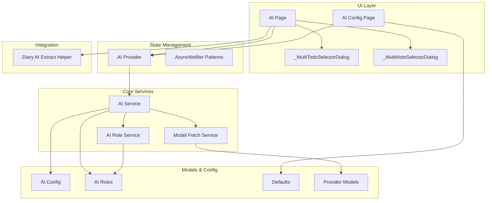
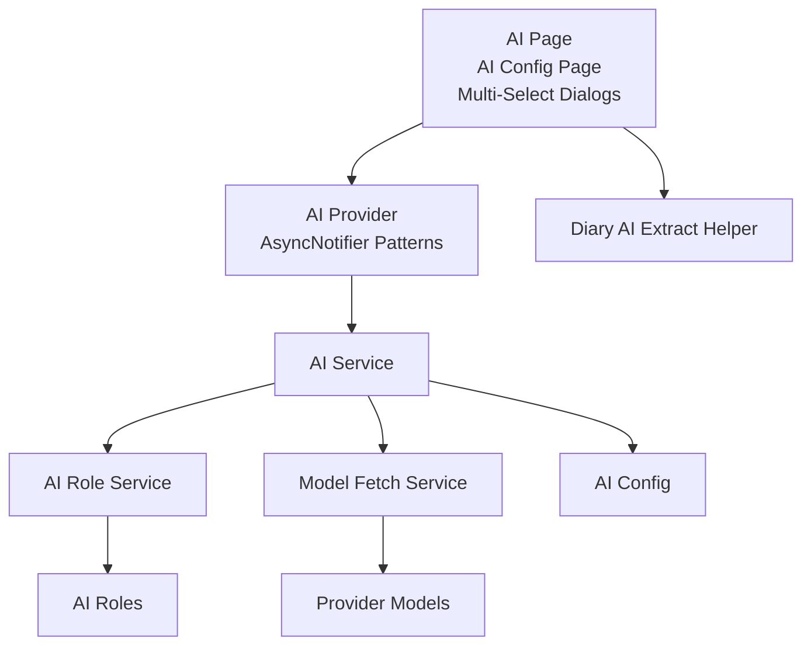
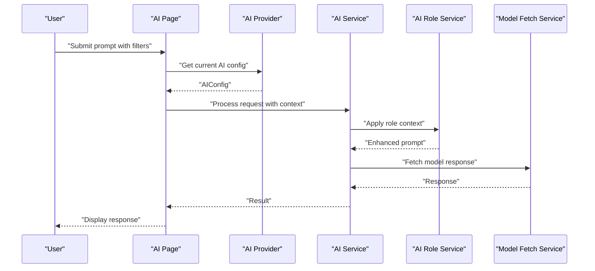
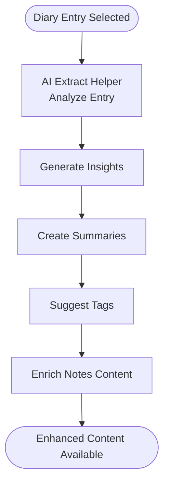
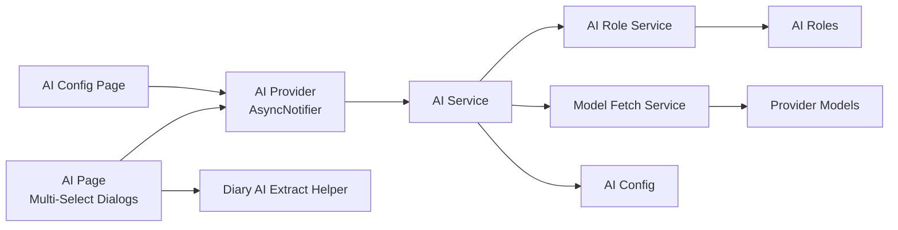

# AI Integration

<cite>
**Referenced Files in This Document**
- [ai_service.dart](file://lib/core/ai/ai_service.dart)
- [ai_role_service.dart](file://lib/core/ai/ai_role_service.dart)
- [model_fetch_service.dart](file://lib/core/ai/model_fetch_service.dart)
- [ai_provider.dart](file://lib/providers/ai_provider.dart)
- [ai_page.dart](file://lib/pages/ai_page.dart)
- [ai_config_page.dart](file://lib/pages/settings/ai_config_page.dart)
- [ai_config.dart](file://lib/models/ai_config.dart)
- [ai_roles.dart](file://lib/models/ai_roles.dart)
- [defaults.dart](file://lib/config/defaults.dart)
- [models.dart](file://lib/config/models.dart)
- [ai_extract_helper.dart](file://lib/widgets/diary/ai_extract_helper.dart)
- [app.dart](file://lib/app.dart)
</cite>

## Update Summary
**Changes Made**
- Enhanced AI page with comprehensive todo filtering capabilities through new `_MultiTodoSelectorDialog`
- Improved AI configuration with robust AsyncNotifier patterns for reactive state management
- Updated provider configuration to remove SenseNova AI service provider
- Added new multi-select dialogs for enhanced user interaction with AI features
- Strengthened state management with AsyncNotifierProvider implementations

## Table of Contents
1. [Introduction](#introduction)
2. [Project Structure](#project-structure)
3. [Core Components](#core-components)
4. [Architecture Overview](#architecture-overview)
5. [Detailed Component Analysis](#detailed-component-analysis)
6. [Enhanced Todo Filtering System](#enhanced-todo-filtering-system)
7. [AsyncNotifier Patterns Implementation](#asyncnotifier-patterns-implementation)
8. [Dependency Analysis](#dependency-analysis)
9. [Performance Considerations](#performance-considerations)
10. [Troubleshooting Guide](#troubleshooting-guide)
11. [Conclusion](#conclusion)

## Introduction
This document explains the AI Integration feature, covering AI service configuration, content generation workflows, and personalized assistance capabilities. It documents the AI provider for managing AI-related state, the AI service implementation for processing user requests, the AI role service for managing different AI personalities and contexts, and the model fetch service for handling AI model operations. It also describes the AI page interface for user interaction, integration with diary and notes for content enhancement, and configuration options for AI service customization.

**Updated** The AI Integration now features enhanced todo filtering capabilities and improved state management through AsyncNotifier patterns, providing a more robust and responsive user experience.

## Project Structure
The AI Integration feature is organized around core services, providers, models, configuration, and UI pages:
- Core AI services: AI service, AI role service, and model fetch service
- State management: AI provider with AsyncNotifier patterns
- UI: AI page with enhanced todo filtering and multi-select dialogs
- Models: AI configuration and roles
- Configuration: defaults and provider models
- Integration helpers: AI extract helper for diary

**Diagram sources**
- [ai_page.dart](file://lib/pages/ai_page.dart)
- [ai_config_page.dart](file://lib/pages/settings/ai_config_page.dart)
- [ai_provider.dart](file://lib/providers/ai_provider.dart)
- [ai_service.dart](file://lib/core/ai/ai_service.dart)
- [ai_role_service.dart](file://lib/core/ai/ai_role_service.dart)
- [model_fetch_service.dart](file://lib/core/ai/model_fetch_service.dart)
- [ai_config.dart](file://lib/models/ai_config.dart)
- [ai_roles.dart](file://lib/models/ai_roles.dart)
- [defaults.dart](file://lib/config/defaults.dart)
- [models.dart](file://lib/config/models.dart)
- [ai_extract_helper.dart](file://lib/widgets/diary/ai_extract_helper.dart)

**Section sources**
- [ai_service.dart](file://lib/core/ai/ai_service.dart)
- [ai_role_service.dart](file://lib/core/ai/ai_role_service.dart)
- [model_fetch_service.dart](file://lib/core/ai/model_fetch_service.dart)
- [ai_provider.dart](file://lib/providers/ai_provider.dart)
- [ai_page.dart](file://lib/pages/ai_page.dart)
- [ai_config_page.dart](file://lib/pages/settings/ai_config_page.dart)
- [ai_config.dart](file://lib/models/ai_config.dart)
- [ai_roles.dart](file://lib/models/ai_roles.dart)
- [defaults.dart](file://lib/config/defaults.dart)
- [models.dart](file://lib/config/models.dart)
- [ai_extract_helper.dart](file://lib/widgets/diary/ai_extract_helper.dart)

## Core Components
- AI Service: Orchestrates content generation, manages prompts, and coordinates with role and model services.
- AI Role Service: Manages AI personalities and contextual roles for different scenarios.
- Model Fetch Service: Handles AI model discovery and selection.
- AI Provider: Central state holder for AI configuration and runtime state using AsyncNotifier patterns.
- AI Page: User interface for interacting with AI features, enhanced with todo filtering capabilities.
- AI Config Page: Settings page for configuring AI providers, models, and temperatures.
- Models: AI configuration and roles data structures.
- Configuration: Defaults and provider models for AI service customization.

**Updated** Enhanced with AsyncNotifier patterns for improved reactive state management and new todo filtering capabilities.

**Section sources**
- [ai_service.dart](file://lib/core/ai/ai_service.dart)
- [ai_role_service.dart](file://lib/core/ai/ai_role_service.dart)
- [model_fetch_service.dart](file://lib/core/ai/model_fetch_service.dart)
- [ai_provider.dart](file://lib/providers/ai_provider.dart)
- [ai_page.dart](file://lib/pages/ai_page.dart)
- [ai_config_page.dart](file://lib/pages/settings/ai_config_page.dart)
- [ai_config.dart](file://lib/models/ai_config.dart)
- [ai_roles.dart](file://lib/models/ai_roles.dart)
- [defaults.dart](file://lib/config/defaults.dart)
- [models.dart](file://lib/config/models.dart)

## Architecture Overview
The AI Integration follows a layered architecture with enhanced state management:
- UI Layer: AI page with todo filtering, configuration page, and multi-select dialogs
- State Management: AI provider with AsyncNotifier patterns for reactive configuration and session management
- Core Services: AI service consumes configuration and roles, delegates model operations to model fetch service, and applies role-specific prompts via AI role service
- Models & Config: AI configuration and roles define provider, model, and personality settings; defaults provide initial values; provider models enumerate supported providers and models
- Integration: Diary helper enhances content by extracting insights and tagging

**Diagram sources**
- [ai_page.dart](file://lib/pages/ai_page.dart)
- [ai_config_page.dart](file://lib/pages/settings/ai_config_page.dart)
- [ai_provider.dart](file://lib/providers/ai_provider.dart)
- [ai_service.dart](file://lib/core/ai/ai_service.dart)
- [ai_role_service.dart](file://lib/core/ai/ai_role_service.dart)
- [model_fetch_service.dart](file://lib/core/ai/model_fetch_service.dart)
- [ai_config.dart](file://lib/models/ai_config.dart)
- [ai_roles.dart](file://lib/models/ai_roles.dart)
- [models.dart](file://lib/config/models.dart)
- [ai_extract_helper.dart](file://lib/widgets/diary/ai_extract_helper.dart)

## Detailed Component Analysis

### AI Service
Responsibilities:
- Accept user prompts and context
- Apply role-specific instructions via AI role service
- Select appropriate model and provider from AI configuration
- Invoke model operations through model fetch service
- Manage session state and error handling

Key behaviors:
- Prompt composition: combines user input with role context
- Provider/model resolution: reads from AI configuration
- Execution pipeline: orchestrates role application and model fetching

**Diagram sources**
- [ai_page.dart](file://lib/pages/ai_page.dart)
- [ai_provider.dart](file://lib/providers/ai_provider.dart)
- [ai_service.dart](file://lib/core/ai/ai_service.dart)
- [ai_role_service.dart](file://lib/core/ai/ai_role_service.dart)
- [model_fetch_service.dart](file://lib/core/ai/model_fetch_service.dart)

**Section sources**
- [ai_service.dart](file://lib/core/ai/ai_service.dart)

### AI Role Service
Responsibilities:
- Define and manage AI personalities and contextual roles
- Compose role-specific instructions and system messages
- Provide role-aware prompt templates for different use cases

Usage patterns:
- Timeline optimization role
- Assistant role
- Custom role composition

**Section sources**
- [ai_role_service.dart](file://lib/core/ai/ai_role_service.dart)
- [ai_roles.dart](file://lib/models/ai_roles.dart)

### Model Fetch Service
Responsibilities:
- Discover and select AI models based on provider configuration
- Resolve model endpoint and metadata
- Coordinate with provider models for supported models and endpoints

**Section sources**
- [model_fetch_service.dart](file://lib/core/ai/model_fetch_service.dart)
- [models.dart](file://lib/config/models.dart)

### AI Provider
Responsibilities:
- Hold current AI configuration (provider, model, temperature)
- Expose reactive state for UI binding using AsyncNotifier patterns
- Persist and update AI preferences
- Manage chat sessions and streaming responses

**Updated** Enhanced with AsyncNotifier patterns for improved reactive state management and automatic configuration refresh.

Integration points:
- Consumed by AI service for runtime decisions
- Updated by AI configuration page
- Provides reactive state for AI page filtering

**Section sources**
- [ai_provider.dart](file://lib/providers/ai_provider.dart)

### AI Page
Responsibilities:
- Present user interface for AI interactions
- Capture user prompts and context
- Display AI responses and progress
- Integrate with diary extraction helper for content enhancement
- **Enhanced** with comprehensive todo filtering capabilities

**Updated** Major enhancement with new todo filtering system and multi-select dialogs.

Example interactions:
- Asking a question: user submits a query; AI service resolves role and model; response is displayed
- Generating content: user provides a topic; AI service composes role-aware prompt; model generates content
- Receiving summaries: user requests summary; AI service applies summarization role; response returned
- Getting tag suggestions: user asks for tags; AI service applies tagging role; suggestions returned
- **New** Todo filtering: user can filter AI responses by specific todo items using `_MultiTodoSelectorDialog`

**Section sources**
- [ai_page.dart](file://lib/pages/ai_page.dart)
- [ai_extract_helper.dart](file://lib/widgets/diary/ai_extract_helper.dart)

### AI Configuration Page
Responsibilities:
- Allow users to configure AI provider, model, and temperature
- Validate selections against provider models
- Persist configuration to AI provider
- **Enhanced** with AsyncNotifier patterns for reactive configuration management

**Updated** Improved with AsyncNotifierProvider implementations for better state management and automatic refresh capabilities.

Configuration options:
- Provider selection
- Model selection
- Temperature setting

**Updated** Removed SenseNova AI provider from available options due to service provider removal

**Section sources**
- [ai_config_page.dart](file://lib/pages/settings/ai_config_page.dart)
- [defaults.dart](file://lib/config/defaults.dart)

### Models and Configuration
- AI Config: encapsulates provider, model, and temperature settings
- AI Roles: defines assistant and timeline optimization roles
- Defaults: provides initial AI configuration and role templates
- Provider Models: enumerates supported providers and their models

**Updated** Removed SenseNova AI provider and its associated model configurations from provider models

**Section sources**
- [ai_config.dart](file://lib/models/ai_config.dart)
- [ai_roles.dart](file://lib/models/ai_roles.dart)
- [defaults.dart](file://lib/config/defaults.dart)
- [models.dart](file://lib/config/models.dart)

### Integration with Diary and Notes
The AI extract helper integrates with diary entries to enhance content:
- Extract insights from diary entries
- Generate summaries and tag suggestions
- Provide enriched content for notes

**Diagram sources**
- [ai_extract_helper.dart](file://lib/widgets/diary/ai_extract_helper.dart)

**Section sources**
- [ai_extract_helper.dart](file://lib/widgets/diary/ai_extract_helper.dart)

## Enhanced Todo Filtering System

**New** The AI Integration now features comprehensive todo filtering capabilities through a sophisticated multi-select system.

### Multi-Todo Selector Dialog
The `_MultiTodoSelectorDialog` provides an intuitive interface for selecting multiple todo items:

Key Features:
- **Bulk Selection**: Full select/unselect functionality
- **Visual Feedback**: Clear indication of selected items
- **Filtering**: Automatic filtering of completed/incomplete todos
- **Responsive Design**: Adapts to different screen sizes

Implementation Details:
- Uses `CheckboxListTile` for individual item selection
- Supports completion status visualization
- Implements efficient state management with `_MultiTodoSelectorDialogState`
- Provides seamless integration with AI context filtering

### Todo Filtering Integration
The AI page integrates todo filtering through:

- **Context Filter Synchronization**: Automatically updates AI context when todo selections change
- **Real-time Updates**: Immediate reflection of todo filters in AI responses
- **Mixed Scenarios**: Supports combination of todo filters with other context filters (date, notes, tags)

**Section sources**
- [ai_page.dart](file://lib/pages/ai_page.dart)

## AsyncNotifier Patterns Implementation

**Enhanced** The AI Integration now implements robust AsyncNotifier patterns for improved state management and reactive UI updates.

### AsyncNotifierProvider Implementations
The AI provider uses AsyncNotifier patterns for:

- **AiConfigListNotifier**: Manages AI configuration lists with automatic refresh capabilities
- **ChatSessionListNotifier**: Handles chat session management with reactive updates
- **Reactive State Management**: Automatic UI updates when configuration changes

### Benefits of AsyncNotifier Patterns
- **Automatic Refresh**: Configuration changes trigger automatic UI updates
- **Error Handling**: Built-in error propagation and recovery mechanisms
- **Loading States**: Comprehensive loading state management
- **Type Safety**: Compile-time type checking for reactive state

### Implementation Examples
- **Configuration Management**: Automatic refresh when configs are added/updated/deleted
- **Session Management**: Real-time chat session updates
- **State Invalidation**: Efficient state invalidation patterns for optimal performance

**Section sources**
- [ai_provider.dart](file://lib/providers/ai_provider.dart)

## Dependency Analysis
The AI Integration components depend on each other as follows:
- AI Service depends on AI Role Service, Model Fetch Service, AI Config, and AI Roles
- AI Provider supplies AI Config to AI Service using AsyncNotifier patterns
- AI Config Page updates AI Provider with reactive state management
- AI Page binds to AI Provider and invokes AI Service with enhanced filtering
- Model Fetch Service relies on Provider Models
- AI Role Service relies on AI Roles
- AI Extract Helper integrates with Diary widgets

**Diagram sources**
- [ai_page.dart](file://lib/pages/ai_page.dart)
- [ai_config_page.dart](file://lib/pages/settings/ai_config_page.dart)
- [ai_provider.dart](file://lib/providers/ai_provider.dart)
- [ai_service.dart](file://lib/core/ai/ai_service.dart)
- [ai_role_service.dart](file://lib/core/ai/ai_role_service.dart)
- [model_fetch_service.dart](file://lib/core/ai/model_fetch_service.dart)
- [ai_config.dart](file://lib/models/ai_config.dart)
- [ai_roles.dart](file://lib/models/ai_roles.dart)
- [models.dart](file://lib/config/models.dart)
- [ai_extract_helper.dart](file://lib/widgets/diary/ai_extract_helper.dart)

**Section sources**
- [ai_service.dart](file://lib/core/ai/ai_service.dart)
- [ai_role_service.dart](file://lib/core/ai/ai_role_service.dart)
- [model_fetch_service.dart](file://lib/core/ai/model_fetch_service.dart)
- [ai_provider.dart](file://lib/providers/ai_provider.dart)
- [ai_page.dart](file://lib/pages/ai_page.dart)
- [ai_config_page.dart](file://lib/pages/settings/ai_config_page.dart)
- [ai_config.dart](file://lib/models/ai_config.dart)
- [ai_roles.dart](file://lib/models/ai_roles.dart)
- [models.dart](file://lib/config/models.dart)
- [ai_extract_helper.dart](file://lib/widgets/diary/ai_extract_helper.dart)

## Performance Considerations
- Minimize redundant model queries by caching recent responses and reusing role contexts
- Batch role application and model resolution to reduce overhead
- Use streaming responses when available to improve perceived latency
- Limit concurrent AI requests to avoid overwhelming the model provider
- Persist frequently used configurations to reduce startup initialization time
- **Enhanced** Utilize AsyncNotifier patterns for efficient state updates and reduced memory usage
- **New** Implement lazy loading for todo filtering to handle large datasets efficiently

## Troubleshooting Guide
Common issues and resolutions:
- Invalid provider or model: Verify selections match provider models and update configuration
- Role context not applied: Ensure AI roles are configured and active
- No response from model: Check network connectivity and provider credentials
- UI not updating: Confirm AI provider state is properly bound and updated after requests
- Diary integration not working: Validate diary entry selection and helper invocation
- **New** Todo filtering issues: Verify todo repository accessibility and dialog state management
- **Enhanced** AsyncNotifier problems: Check for proper notifier initialization and state invalidation patterns

**Updated** SenseNova AI provider is no longer available as a configuration option. Users should select from the remaining supported providers.

**Section sources**
- [ai_service.dart](file://lib/core/ai/ai_service.dart)
- [ai_provider.dart](file://lib/providers/ai_provider.dart)
- [ai_config_page.dart](file://lib/pages/settings/ai_config_page.dart)

## Conclusion
The AI Integration feature provides a cohesive system for personalized AI assistance with enhanced capabilities. It separates concerns across services, models, and UI while enabling flexible configuration and role-based personalization. The integration with diary and notes further enriches content creation workflows. 

**Updated** The system now operates with enhanced AsyncNotifier patterns for improved state management, comprehensive todo filtering capabilities for more precise AI interactions, and an updated provider configuration excluding SenseNova AI services. These enhancements ensure users can only select from the currently supported AI providers and their respective model offerings, providing a more reliable and feature-rich experience.

By leveraging the AI provider for state management and the AI service for orchestration, the system supports scalable enhancements to user productivity with improved responsiveness and user experience.