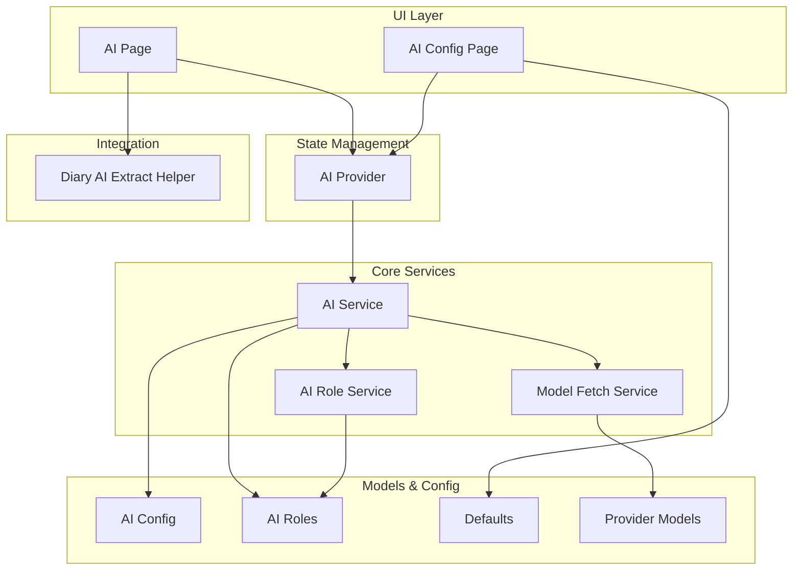
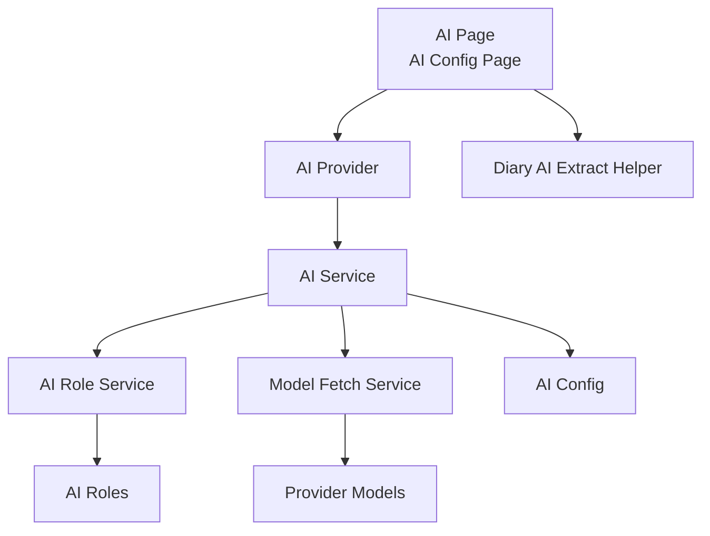
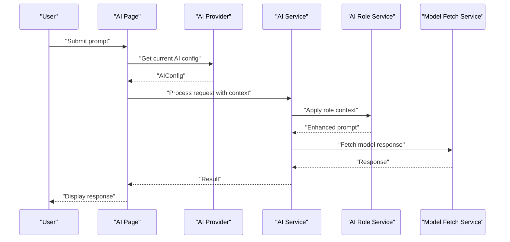
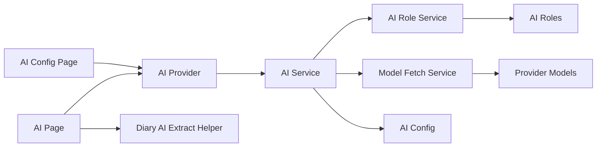

# AI Integration

<cite>
**Referenced Files in This Document**
- [ai_service.dart](file://lib/core/ai/ai_service.dart)
- [ai_role_service.dart](file://lib/core/ai/ai_role_service.dart)
- [model_fetch_service.dart](file://lib/core/ai/model_fetch_service.dart)
- [ai_provider.dart](file://lib/providers/ai_provider.dart)
- [ai_page.dart](file://lib/pages/ai_page.dart)
- [ai_config_page.dart](file://lib/pages/settings/ai_config_page.dart)
- [ai_config.dart](file://lib/models/ai_config.dart)
- [ai_roles.dart](file://lib/models/ai_roles.dart)
- [defaults.dart](file://lib/config/defaults.dart)
- [models.dart](file://lib/config/models.dart)
- [ai_extract_helper.dart](file://lib/widgets/diary/ai_extract_helper.dart)
- [app.dart](file://lib/app.dart)
</cite>

## Update Summary
**Changes Made**
- Updated provider configuration section to reflect removal of SenseNova AI service provider
- Removed SenseNova model configurations (sensenova-6.7-flash-lite, sensenova-6.7-flash, sensenova-6.7-pro, sensenova-6.5-flash, sensenova-6.5-pro) from documentation
- Updated configuration examples to show available providers after the removal
- Revised troubleshooting guidance to account for unavailable SenseNova options

## Table of Contents
1. [Introduction](#introduction)
2. [Project Structure](#project-structure)
3. [Core Components](#core-components)
4. [Architecture Overview](#architecture-overview)
5. [Detailed Component Analysis](#detailed-component-analysis)
6. [Dependency Analysis](#dependency-analysis)
7. [Performance Considerations](#performance-considerations)
8. [Troubleshooting Guide](#troubleshooting-guide)
9. [Conclusion](#conclusion)

## Introduction
This document explains the AI Integration feature, covering AI service configuration, content generation workflows, and personalized assistance capabilities. It documents the AI provider for managing AI-related state, the AI service implementation for processing user requests, the AI role service for managing different AI personalities and contexts, and the model fetch service for handling AI model operations. It also describes the AI page interface for user interaction, integration with diary and notes for content enhancement, and configuration options for AI service customization.

## Project Structure
The AI Integration feature is organized around core services, providers, models, configuration, and UI pages:
- Core AI services: AI service, AI role service, and model fetch service
- State management: AI provider
- UI: AI page and AI configuration page
- Models: AI configuration and roles
- Configuration: defaults and provider models
- Integration helpers: AI extract helper for diary

**Diagram sources**
- [ai_page.dart](file://lib/pages/ai_page.dart)
- [ai_config_page.dart](file://lib/pages/settings/ai_config_page.dart)
- [ai_provider.dart](file://lib/providers/ai_provider.dart)
- [ai_service.dart](file://lib/core/ai/ai_service.dart)
- [ai_role_service.dart](file://lib/core/ai/ai_role_service.dart)
- [model_fetch_service.dart](file://lib/core/ai/model_fetch_service.dart)
- [ai_config.dart](file://lib/models/ai_config.dart)
- [ai_roles.dart](file://lib/models/ai_roles.dart)
- [defaults.dart](file://lib/config/defaults.dart)
- [models.dart](file://lib/config/models.dart)
- [ai_extract_helper.dart](file://lib/widgets/diary/ai_extract_helper.dart)

**Section sources**
- [ai_service.dart](file://lib/core/ai/ai_service.dart)
- [ai_role_service.dart](file://lib/core/ai/ai_role_service.dart)
- [model_fetch_service.dart](file://lib/core/ai/model_fetch_service.dart)
- [ai_provider.dart](file://lib/providers/ai_provider.dart)
- [ai_page.dart](file://lib/pages/ai_page.dart)
- [ai_config_page.dart](file://lib/pages/settings/ai_config_page.dart)
- [ai_config.dart](file://lib/models/ai_config.dart)
- [ai_roles.dart](file://lib/models/ai_roles.dart)
- [defaults.dart](file://lib/config/defaults.dart)
- [models.dart](file://lib/config/models.dart)
- [ai_extract_helper.dart](file://lib/widgets/diary/ai_extract_helper.dart)

## Core Components
- AI Service: Orchestrates content generation, manages prompts, and coordinates with role and model services.
- AI Role Service: Manages AI personalities and contextual roles for different scenarios.
- Model Fetch Service: Handles AI model discovery and selection.
- AI Provider: Central state holder for AI configuration and runtime state.
- AI Page: User interface for interacting with AI features.
- AI Config Page: Settings page for configuring AI providers, models, and temperatures.
- Models: AI configuration and roles data structures.
- Configuration: Defaults and provider models for AI service customization.

**Section sources**
- [ai_service.dart](file://lib/core/ai/ai_service.dart)
- [ai_role_service.dart](file://lib/core/ai/ai_role_service.dart)
- [model_fetch_service.dart](file://lib/core/ai/model_fetch_service.dart)
- [ai_provider.dart](file://lib/providers/ai_provider.dart)
- [ai_page.dart](file://lib/pages/ai_page.dart)
- [ai_config_page.dart](file://lib/pages/settings/ai_config_page.dart)
- [ai_config.dart](file://lib/models/ai_config.dart)
- [ai_roles.dart](file://lib/models/ai_roles.dart)
- [defaults.dart](file://lib/config/defaults.dart)
- [models.dart](file://lib/config/models.dart)

## Architecture Overview
The AI Integration follows a layered architecture:
- UI Layer: AI page and configuration page
- State Management: AI provider exposes reactive state for configuration and current session
- Core Services: AI service consumes configuration and roles, delegates model operations to model fetch service, and applies role-specific prompts via AI role service
- Models & Config: AI configuration and roles define provider, model, and personality settings; defaults provide initial values; provider models enumerate supported providers and models
- Integration: Diary helper enhances content by extracting insights and tagging

**Diagram sources**
- [ai_page.dart](file://lib/pages/ai_page.dart)
- [ai_config_page.dart](file://lib/pages/settings/ai_config_page.dart)
- [ai_provider.dart](file://lib/providers/ai_provider.dart)
- [ai_service.dart](file://lib/core/ai/ai_service.dart)
- [ai_role_service.dart](file://lib/core/ai/ai_role_service.dart)
- [model_fetch_service.dart](file://lib/core/ai/model_fetch_service.dart)
- [ai_config.dart](file://lib/models/ai_config.dart)
- [ai_roles.dart](file://lib/models/ai_roles.dart)
- [models.dart](file://lib/config/models.dart)
- [ai_extract_helper.dart](file://lib/widgets/diary/ai_extract_helper.dart)

## Detailed Component Analysis

### AI Service
Responsibilities:
- Accept user prompts and context
- Apply role-specific instructions via AI role service
- Select appropriate model and provider from AI configuration
- Invoke model operations through model fetch service
- Manage session state and error handling

Key behaviors:
- Prompt composition: combines user input with role context
- Provider/model resolution: reads from AI configuration
- Execution pipeline: orchestrates role application and model fetching

**Diagram sources**
- [ai_page.dart](file://lib/pages/ai_page.dart)
- [ai_provider.dart](file://lib/providers/ai_provider.dart)
- [ai_service.dart](file://lib/core/ai/ai_service.dart)
- [ai_role_service.dart](file://lib/core/ai/ai_role_service.dart)
- [model_fetch_service.dart](file://lib/core/ai/model_fetch_service.dart)

**Section sources**
- [ai_service.dart](file://lib/core/ai/ai_service.dart)

### AI Role Service
Responsibilities:
- Define and manage AI personalities and contextual roles
- Compose role-specific instructions and system messages
- Provide role-aware prompt templates for different use cases

Usage patterns:
- Timeline optimization role
- Assistant role
- Custom role composition

**Section sources**
- [ai_role_service.dart](file://lib/core/ai/ai_role_service.dart)
- [ai_roles.dart](file://lib/models/ai_roles.dart)

### Model Fetch Service
Responsibilities:
- Discover and select AI models based on provider configuration
- Resolve model endpoint and metadata
- Coordinate with provider models for supported models and endpoints

**Section sources**
- [model_fetch_service.dart](file://lib/core/ai/model_fetch_service.dart)
- [models.dart](file://lib/config/models.dart)

### AI Provider
Responsibilities:
- Hold current AI configuration (provider, model, temperature)
- Expose reactive state for UI binding
- Persist and update AI preferences

Integration points:
- Consumed by AI service for runtime decisions
- Updated by AI configuration page

**Section sources**
- [ai_provider.dart](file://lib/providers/ai_provider.dart)

### AI Page
Responsibilities:
- Present user interface for AI interactions
- Capture user prompts and context
- Display AI responses and progress
- Integrate with diary extraction helper for content enhancement

Example interactions:
- Asking a question: user submits a query; AI service resolves role and model; response is displayed
- Generating content: user provides a topic; AI service composes role-aware prompt; model generates content
- Receiving summaries: user requests summary; AI service applies summarization role; response returned
- Getting tag suggestions: user asks for tags; AI service applies tagging role; suggestions returned

**Section sources**
- [ai_page.dart](file://lib/pages/ai_page.dart)
- [ai_extract_helper.dart](file://lib/widgets/diary/ai_extract_helper.dart)

### AI Configuration Page
Responsibilities:
- Allow users to configure AI provider, model, and temperature
- Validate selections against provider models
- Persist configuration to AI provider

Configuration options:
- Provider selection
- Model selection
- Temperature setting

**Updated** Removed SenseNova AI provider from available options due to service provider removal

**Section sources**
- [ai_config_page.dart](file://lib/pages/settings/ai_config_page.dart)
- [defaults.dart](file://lib/config/defaults.dart)

### Models and Configuration
- AI Config: encapsulates provider, model, and temperature settings
- AI Roles: defines assistant and timeline optimization roles
- Defaults: provides initial AI configuration and role templates
- Provider Models: enumerates supported providers and their models

**Updated** Removed SenseNova AI provider and its associated model configurations from provider models

**Section sources**
- [ai_config.dart](file://lib/models/ai_config.dart)
- [ai_roles.dart](file://lib/models/ai_roles.dart)
- [defaults.dart](file://lib/config/defaults.dart)
- [models.dart](file://lib/config/models.dart)

### Integration with Diary and Notes
The AI extract helper integrates with diary entries to enhance content:
- Extract insights from diary entries
- Generate summaries and tag suggestions
- Provide enriched content for notes

**Diagram sources**
- [ai_extract_helper.dart](file://lib/widgets/diary/ai_extract_helper.dart)

**Section sources**
- [ai_extract_helper.dart](file://lib/widgets/diary/ai_extract_helper.dart)

## Dependency Analysis
The AI Integration components depend on each other as follows:
- AI Service depends on AI Role Service, Model Fetch Service, AI Config, and AI Roles
- AI Provider supplies AI Config to AI Service
- AI Config Page updates AI Provider
- AI Page binds to AI Provider and invokes AI Service
- Model Fetch Service relies on Provider Models
- AI Role Service relies on AI Roles
- AI Extract Helper integrates with Diary widgets

**Diagram sources**
- [ai_page.dart](file://lib/pages/ai_page.dart)
- [ai_config_page.dart](file://lib/pages/settings/ai_config_page.dart)
- [ai_provider.dart](file://lib/providers/ai_provider.dart)
- [ai_service.dart](file://lib/core/ai/ai_service.dart)
- [ai_role_service.dart](file://lib/core/ai/ai_role_service.dart)
- [model_fetch_service.dart](file://lib/core/ai/model_fetch_service.dart)
- [ai_config.dart](file://lib/models/ai_config.dart)
- [ai_roles.dart](file://lib/models/ai_roles.dart)
- [models.dart](file://lib/config/models.dart)
- [ai_extract_helper.dart](file://lib/widgets/diary/ai_extract_helper.dart)

**Section sources**
- [ai_service.dart](file://lib/core/ai/ai_service.dart)
- [ai_role_service.dart](file://lib/core/ai/ai_role_service.dart)
- [model_fetch_service.dart](file://lib/core/ai/model_fetch_service.dart)
- [ai_provider.dart](file://lib/providers/ai_provider.dart)
- [ai_page.dart](file://lib/pages/ai_page.dart)
- [ai_config_page.dart](file://lib/pages/settings/ai_config_page.dart)
- [ai_config.dart](file://lib/models/ai_config.dart)
- [ai_roles.dart](file://lib/models/ai_roles.dart)
- [models.dart](file://lib/config/models.dart)
- [ai_extract_helper.dart](file://lib/widgets/diary/ai_extract_helper.dart)

## Performance Considerations
- Minimize redundant model queries by caching recent responses and reusing role contexts
- Batch role application and model resolution to reduce overhead
- Use streaming responses when available to improve perceived latency
- Limit concurrent AI requests to avoid overwhelming the model provider
- Persist frequently used configurations to reduce startup initialization time

## Troubleshooting Guide
Common issues and resolutions:
- Invalid provider or model: Verify selections match provider models and update configuration
- Role context not applied: Ensure AI roles are configured and active
- No response from model: Check network connectivity and provider credentials
- UI not updating: Confirm AI provider state is properly bound and updated after requests
- Diary integration not working: Validate diary entry selection and helper invocation

**Updated** SenseNova AI provider is no longer available as a configuration option. Users should select from the remaining supported providers.

**Section sources**
- [ai_service.dart](file://lib/core/ai/ai_service.dart)
- [ai_provider.dart](file://lib/providers/ai_provider.dart)
- [ai_config_page.dart](file://lib/pages/settings/ai_config_page.dart)

## Conclusion
The AI Integration feature provides a cohesive system for personalized AI assistance. It separates concerns across services, models, and UI while enabling flexible configuration and role-based personalization. The integration with diary and notes further enriches content creation workflows. By leveraging the AI provider for state management and the AI service for orchestration, the system supports scalable enhancements to user productivity.

**Updated** The system now operates with an updated provider configuration excluding SenseNova AI services, ensuring users can only select from the currently supported AI providers and their respective model offerings.