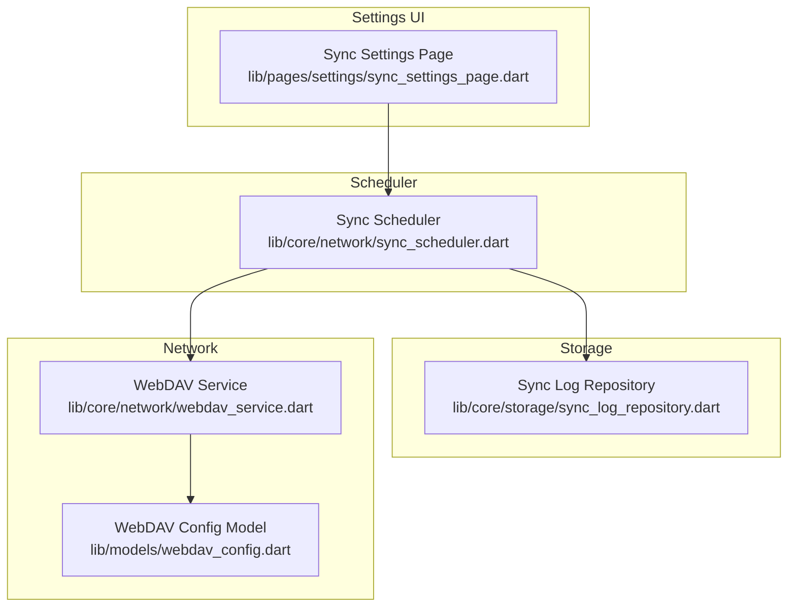
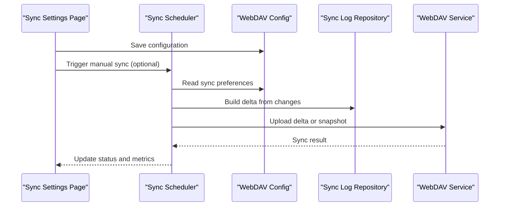
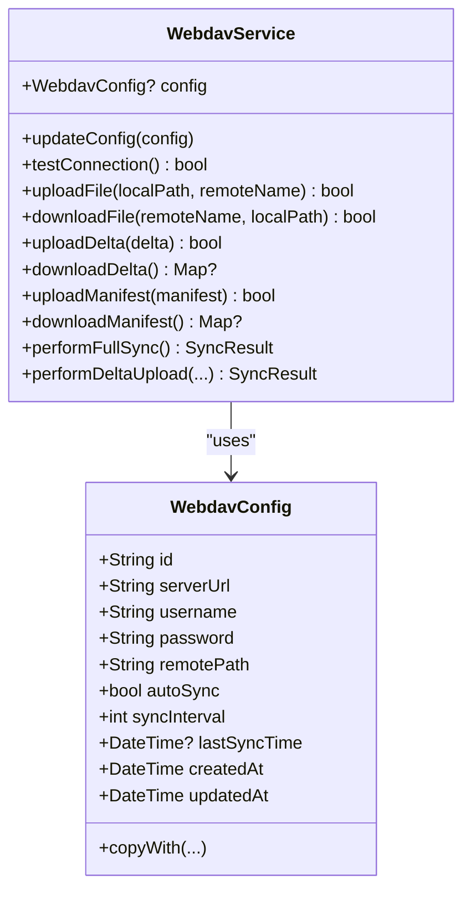
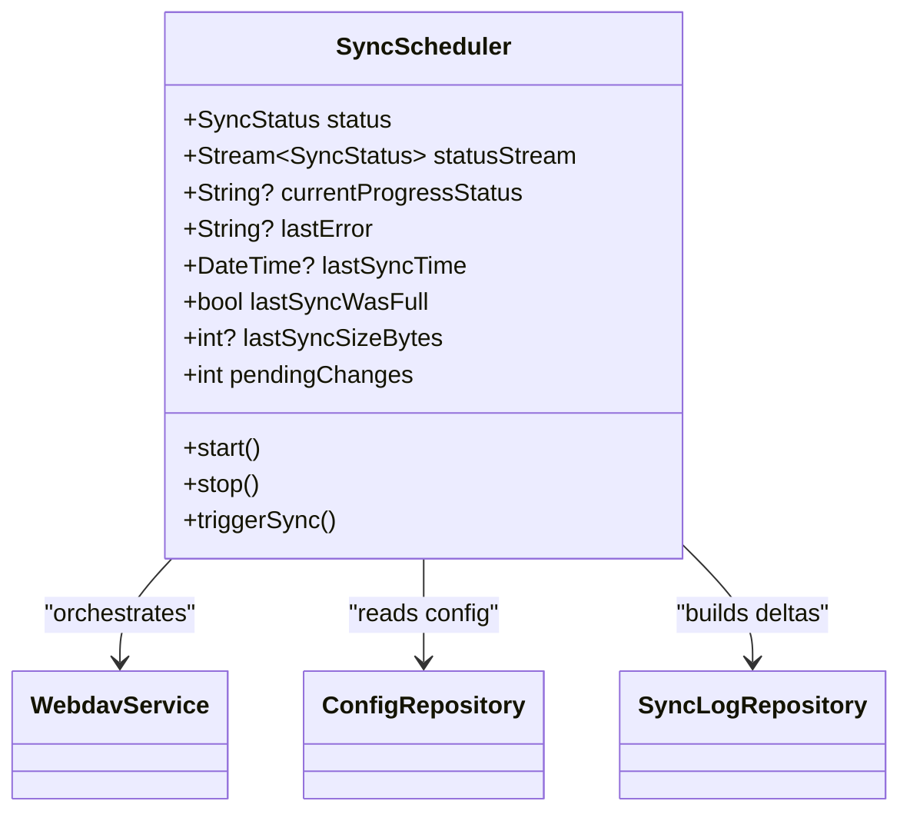
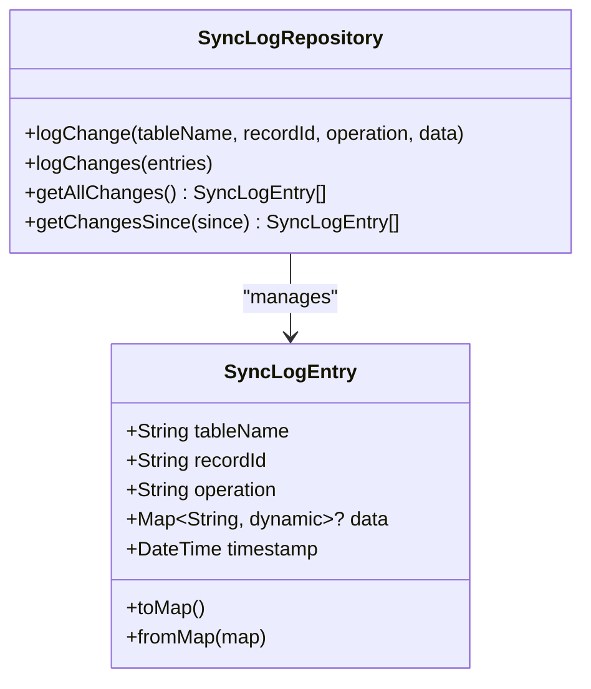
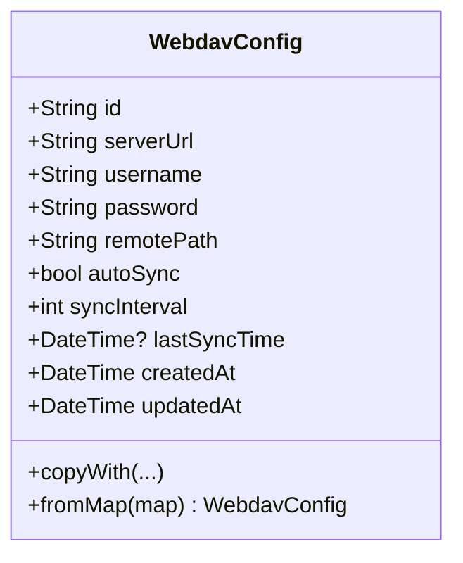
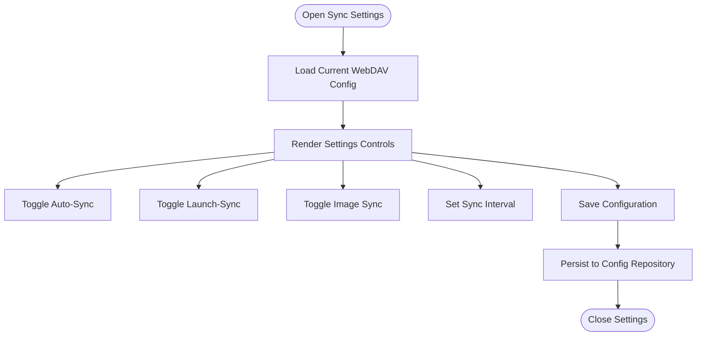
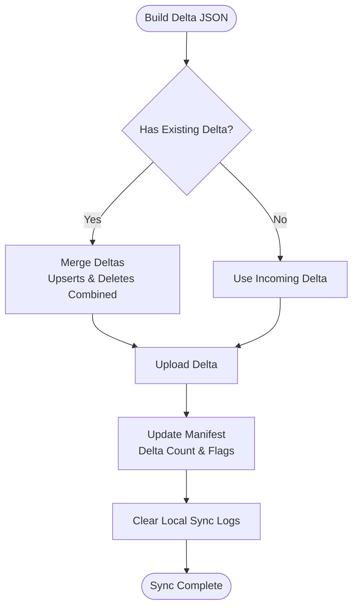
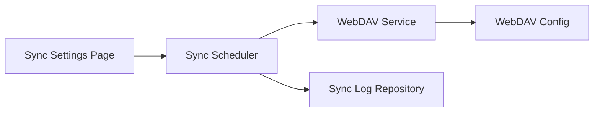

# Cloud Synchronization

<cite>
**Referenced Files in This Document**
- [webdav_service.dart](file://lib/core/network/webdav_service.dart)
- [webdav_config.dart](file://lib/models/webdav_config.dart)
- [sync_scheduler.dart](file://lib/core/network/sync_scheduler.dart)
- [sync_log_repository.dart](file://lib/core/storage/sync_log_repository.dart)
- [sync_settings_page.dart](file://lib/pages/settings/sync_settings_page.dart)
</cite>

## Table of Contents
1. [Introduction](#introduction)
2. [Project Structure](#project-structure)
3. [Core Components](#core-components)
4. [Architecture Overview](#architecture-overview)
5. [Detailed Component Analysis](#detailed-component-analysis)
6. [Dependency Analysis](#dependency-analysis)
7. [Performance Considerations](#performance-considerations)
8. [Troubleshooting Guide](#troubleshooting-guide)
9. [Conclusion](#conclusion)

## Introduction
This document explains the Cloud Synchronization feature built around WebDAV integration. It covers how the WebDAV service establishes cloud connectivity, how automatic sync scheduling is managed, and how conflicts are resolved during synchronization. It also documents the WebDAV configuration model, the sync scheduler, the sync log repository, and the sync settings page for user configuration. Finally, it describes the relationship with local database operations and the impact on cross-device data consistency.

## Project Structure
The cloud synchronization feature spans several modules:
- Network layer: WebDAV service for cloud connectivity and file transfer
- Storage layer: Sync log repository for tracking local changes
- Configuration model: WebDAV configuration with server settings, authentication, and sync preferences
- Scheduler: Automatic sync orchestration with periodic and on-launch triggers
- Settings UI: User interface for configuring sync behavior

**Diagram sources**
- [sync_settings_page.dart](file://lib/pages/settings/sync_settings_page.dart)
- [sync_scheduler.dart](file://lib/core/network/sync_scheduler.dart)
- [sync_log_repository.dart](file://lib/core/storage/sync_log_repository.dart)
- [webdav_service.dart](file://lib/core/network/webdav_service.dart)
- [webdav_config.dart](file://lib/models/webdav_config.dart)

**Section sources**
- [sync_settings_page.dart](file://lib/pages/settings/sync_settings_page.dart)
- [sync_scheduler.dart](file://lib/core/network/sync_scheduler.dart)
- [sync_log_repository.dart](file://lib/core/storage/sync_log_repository.dart)
- [webdav_service.dart](file://lib/core/network/webdav_service.dart)
- [webdav_config.dart](file://lib/models/webdav_config.dart)

## Core Components
- WebDAV Service: Manages connection, uploads, downloads, and maintains manifest/delta synchronization state
- WebDAV Config: Encapsulates server URL, credentials, remote path, and sync preferences
- Sync Scheduler: Orchestrates automatic sync timing and exposes status streams
- Sync Log Repository: Tracks local changes for delta computation and conflict resolution
- Sync Settings Page: Provides UI to configure auto-sync, intervals, and image sync behavior

**Section sources**
- [webdav_service.dart](file://lib/core/network/webdav_service.dart)
- [webdav_config.dart](file://lib/models/webdav_config.dart)
- [sync_scheduler.dart](file://lib/core/network/sync_scheduler.dart)
- [sync_log_repository.dart](file://lib/core/storage/sync_log_repository.dart)
- [sync_settings_page.dart](file://lib/pages/settings/sync_settings_page.dart)

## Architecture Overview
The system follows a layered architecture:
- UI layer updates configuration via the settings page
- Scheduler reads configuration and triggers sync operations
- WebDAV service performs network operations against the remote storage
- Sync log repository persists change records for delta computation
- Manifest and delta files coordinate incremental vs full snapshots

**Diagram sources**
- [sync_settings_page.dart](file://lib/pages/settings/sync_settings_page.dart)
- [sync_scheduler.dart](file://lib/core/network/sync_scheduler.dart)
- [sync_log_repository.dart](file://lib/core/storage/sync_log_repository.dart)
- [webdav_service.dart](file://lib/core/network/webdav_service.dart)
- [webdav_config.dart](file://lib/models/webdav_config.dart)

## Detailed Component Analysis

### WebDAV Service Implementation
The WebDAV service encapsulates:
- Configuration updates with normalized server URL and remote path
- Basic authentication header setup
- Connection testing via PROPFIND
- File upload/download operations
- Snapshot and delta synchronization with manifest coordination
- Delta merging logic to consolidate concurrent changes

Key responsibilities:
- Connection lifecycle and authentication
- Manifest-aware snapshot/delta selection
- Delta building, merging, and upload
- Logging and error reporting

**Diagram sources**
- [webdav_service.dart](file://lib/core/network/webdav_service.dart)
- [webdav_config.dart](file://lib/models/webdav_config.dart)

**Section sources**
- [webdav_service.dart](file://lib/core/network/webdav_service.dart)
- [webdav_config.dart](file://lib/models/webdav_config.dart)

### Sync Scheduler
The scheduler manages:
- Sync status lifecycle (idle, syncing, success, error)
- Periodic timer for automatic sync
- On-launch sync trigger
- Pending change count tracking
- Last sync metadata (time, size, full vs delta)

It exposes a broadcast stream for status updates and integrates with configuration and sync log repositories.

**Diagram sources**
- [sync_scheduler.dart](file://lib/core/network/sync_scheduler.dart)

**Section sources**
- [sync_scheduler.dart](file://lib/core/network/sync_scheduler.dart)

### Sync Log Repository
The sync log repository:
- Records individual changes with table name, record ID, operation type, optional data payload, and timestamp
- Supports batch logging for performance
- Retrieves changes ordered by timestamp for deterministic delta computation
- Provides filtered queries by time window

**Diagram sources**
- [sync_log_repository.dart](file://lib/core/storage/sync_log_repository.dart)

**Section sources**
- [sync_log_repository.dart](file://lib/core/storage/sync_log_repository.dart)

### WebDAV Configuration Model
The configuration model holds:
- Server URL, username, password, and remote path
- Auto-sync toggle and interval
- Timestamps for creation/update and last sync
- Copy-with pattern for immutable updates
- Factory from map for persistence deserialization

**Diagram sources**
- [webdav_config.dart](file://lib/models/webdav_config.dart)

**Section sources**
- [webdav_config.dart](file://lib/models/webdav_config.dart)

### Sync Settings Page
The settings page provides:
- Toggle for enabling/disabling WebDAV sync
- Option to sync on app launch
- Option to sync images
- Adjustable auto-sync interval
- Real-time sync status banner and last error display
- Save action to persist configuration

**Diagram sources**
- [sync_settings_page.dart](file://lib/pages/settings/sync_settings_page.dart)

**Section sources**
- [sync_settings_page.dart](file://lib/pages/settings/sync_settings_page.dart)

### Conflict Resolution Mechanisms
Conflict resolution is primarily handled through:
- Delta merging: Incoming and existing deltas are merged to preserve all changes
- Deterministic ordering: Changes are logged with timestamps and processed in ascending order
- Manifest coordination: Base snapshot version and delta counters guide merge decisions
- Atomic updates: After successful upload, local logs are cleared and counters updated

**Diagram sources**
- [webdav_service.dart](file://lib/core/network/webdav_service.dart)
- [sync_log_repository.dart](file://lib/core/storage/sync_log_repository.dart)

**Section sources**
- [webdav_service.dart](file://lib/core/network/webdav_service.dart)
- [sync_log_repository.dart](file://lib/core/storage/sync_log_repository.dart)

## Dependency Analysis
The components depend on each other as follows:
- Sync Settings Page depends on Sync Scheduler and WebDAV Config
- Sync Scheduler depends on WebDAV Service, Config Repository, and Sync Log Repository
- WebDAV Service depends on WebDAV Config and uses Sync Log Repository for delta building
- Sync Log Repository persists data used by WebDAV Service and Scheduler

**Diagram sources**
- [sync_settings_page.dart](file://lib/pages/settings/sync_settings_page.dart)
- [sync_scheduler.dart](file://lib/core/network/sync_scheduler.dart)
- [sync_log_repository.dart](file://lib/core/storage/sync_log_repository.dart)
- [webdav_service.dart](file://lib/core/network/webdav_service.dart)
- [webdav_config.dart](file://lib/models/webdav_config.dart)

**Section sources**
- [sync_settings_page.dart](file://lib/pages/settings/sync_settings_page.dart)
- [sync_scheduler.dart](file://lib/core/network/sync_scheduler.dart)
- [sync_log_repository.dart](file://lib/core/storage/sync_log_repository.dart)
- [webdav_service.dart](file://lib/core/network/webdav_service.dart)
- [webdav_config.dart](file://lib/models/webdav_config.dart)

## Performance Considerations
- Batch logging: Use batch insert for multiple sync log entries to reduce database overhead
- Incremental sync: Prefer delta uploads over full snapshots when possible to minimize bandwidth and time
- Delta merging: Consolidate deltas server-side to avoid redundant operations
- Authentication caching: Reuse configured headers after initial normalization
- Timely cleanup: Clear sync logs after successful uploads to prevent unbounded growth

## Troubleshooting Guide
Common issues and resolutions:
- Connection failures: Verify server URL, credentials, and network accessibility; use the connection test method
- Authentication errors: Confirm username/password correctness and WebDAV endpoint support for Basic Auth
- Permission problems: Ensure remote path exists and the account has write/read permissions
- Sync stuck in progress: Check scheduler status stream and last error messages exposed by the scheduler
- Excessive delta growth: Monitor delta count and consider triggering a full snapshot to reset state
- Offline mode: Disable auto-sync and rely on local logs; re-enable when connectivity is restored

**Section sources**
- [webdav_service.dart](file://lib/core/network/webdav_service.dart)
- [sync_scheduler.dart](file://lib/core/network/sync_scheduler.dart)

## Conclusion
The Cloud Synchronization feature provides robust WebDAV-based data synchronization with automatic scheduling, conflict-aware delta merging, and a configurable user interface. By leveraging the sync log repository for deterministic change tracking and manifest/delta coordination, the system ensures consistent data across devices while maintaining performance and reliability.