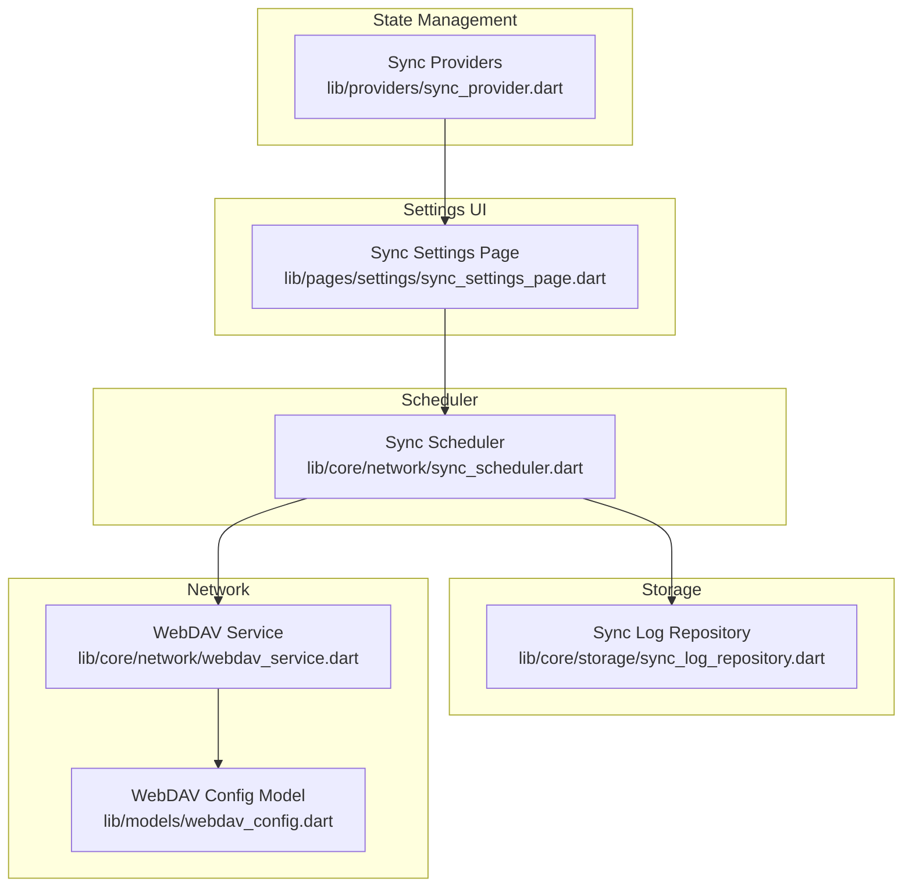
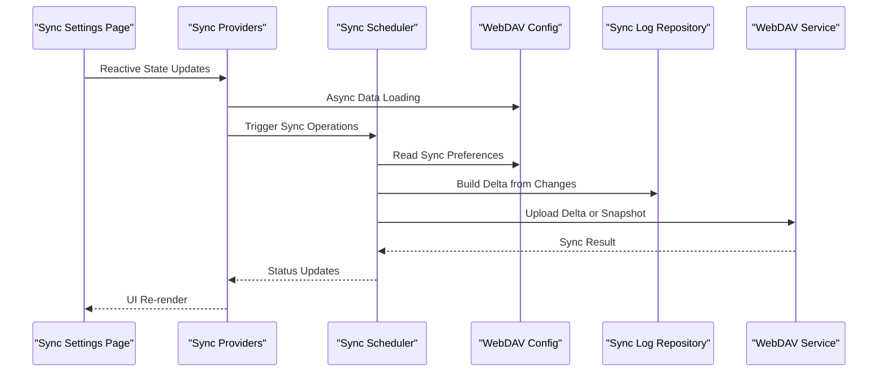
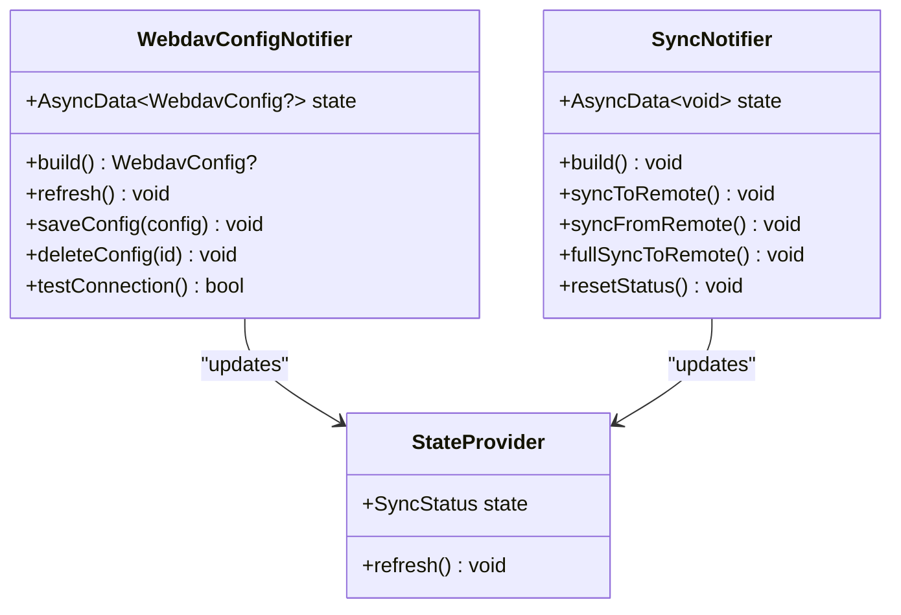
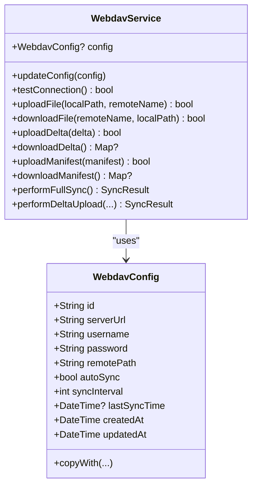
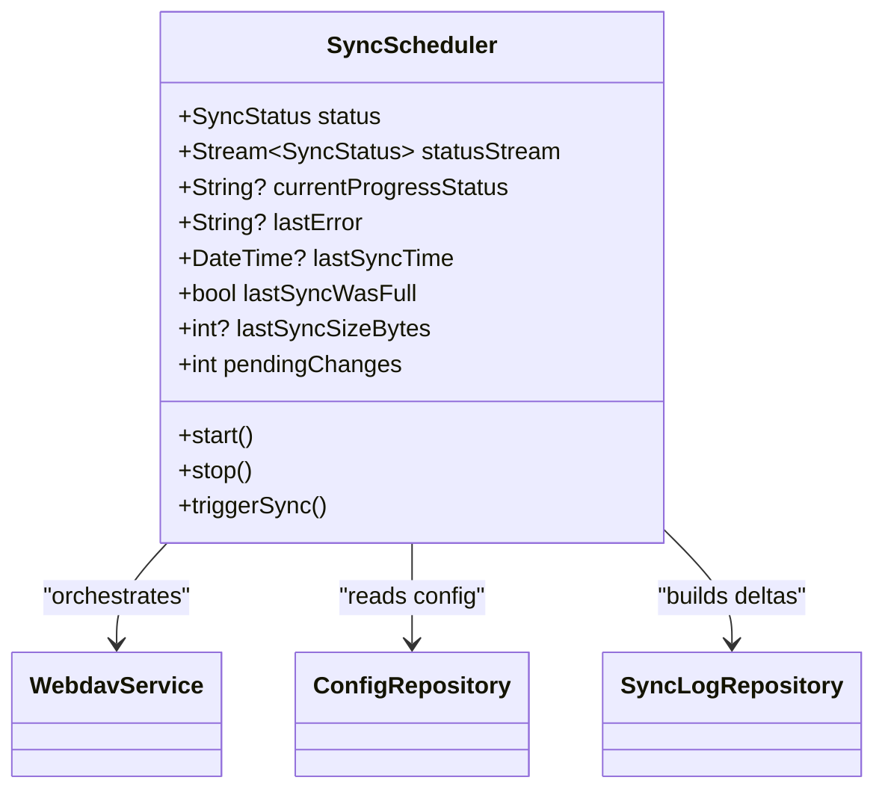
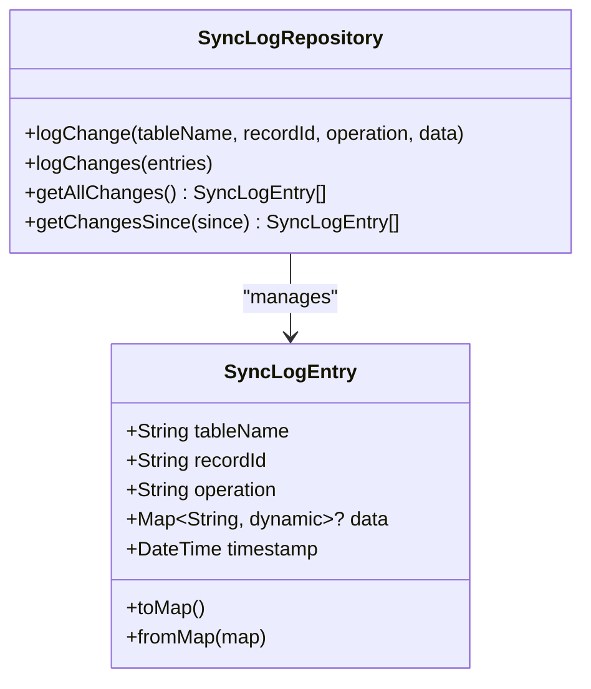
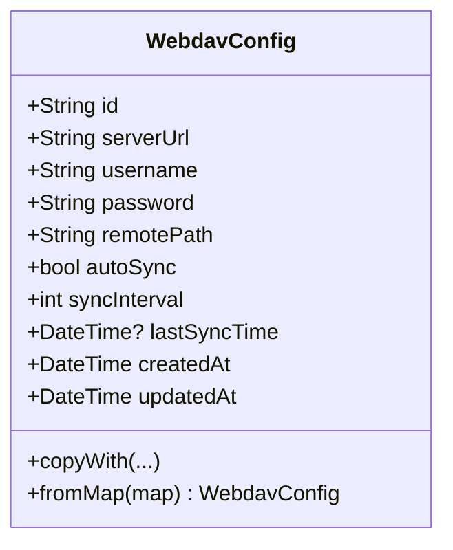
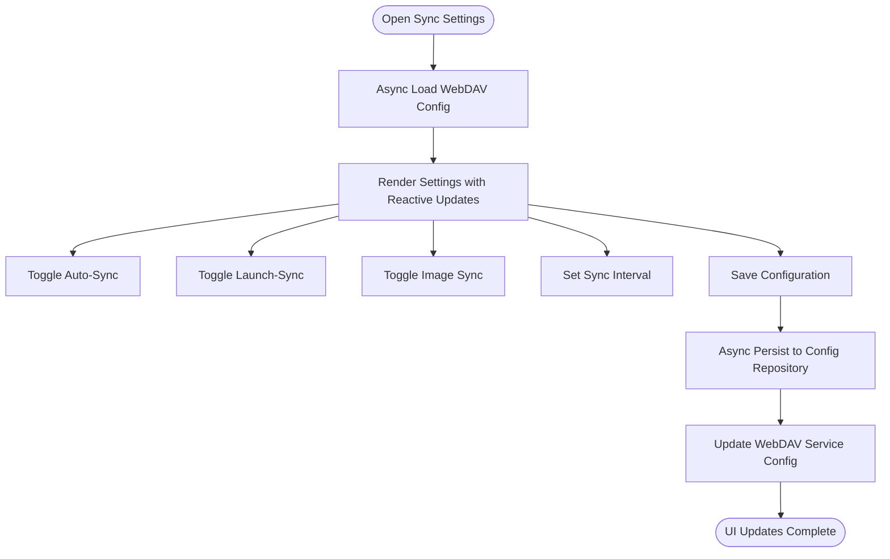
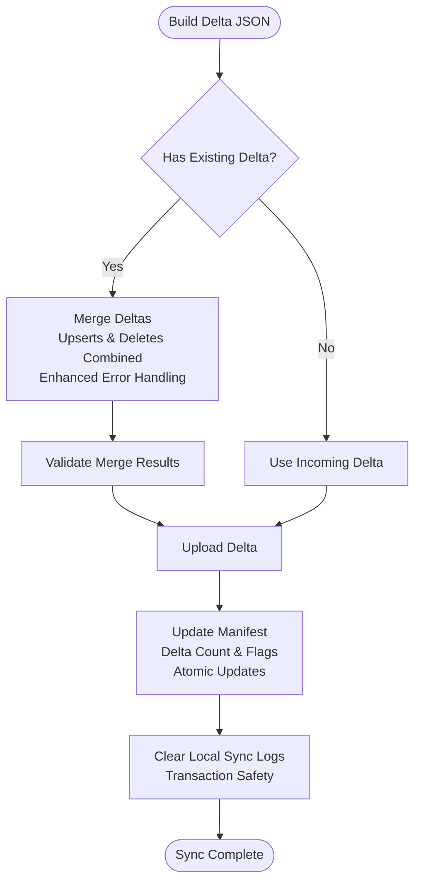
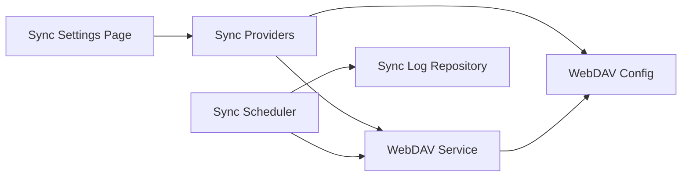

# Cloud Synchronization

<cite>
**Referenced Files in This Document**
- [sync_provider.dart](file://lib/providers/sync_provider.dart)
- [sync_settings_page.dart](file://lib/pages/settings/sync_settings_page.dart)
- [webdav_service.dart](file://lib/core/network/webdav_service.dart)
- [webdav_config.dart](file://lib/models/webdav_config.dart)
- [sync_scheduler.dart](file://lib/core/network/sync_scheduler.dart)
- [sync_log_repository.dart](file://lib/core/storage/sync_log_repository.dart)
</cite>

## Update Summary
**Changes Made**
- Updated to reflect modern Riverpod state management with AsyncNotifier patterns
- Enhanced error handling with improved UI feedback mechanisms
- Added comprehensive state management providers for WebDAV configuration and sync operations
- Updated UI components to leverage reactive state management for better user experience

## Table of Contents
1. [Introduction](#introduction)
2. [Project Structure](#project-structure)
3. [Core Components](#core-components)
4. [Architecture Overview](#architecture-overview)
5. [Detailed Component Analysis](#detailed-component-analysis)
6. [Dependency Analysis](#dependency-analysis)
7. [Performance Considerations](#performance-considerations)
8. [Troubleshooting Guide](#troubleshooting-guide)
9. [Conclusion](#conclusion)

## Introduction
This document explains the Cloud Synchronization feature built around WebDAV integration with modern Riverpod state management. The system now uses AsyncNotifier patterns for reactive state management, providing improved error handling and enhanced UI components. It covers how the WebDAV service establishes cloud connectivity, how automatic sync scheduling is managed, and how conflicts are resolved during synchronization. The documentation includes the WebDAV configuration model, sync scheduler, sync log repository, and the sync settings page for user configuration, along with the modern state management architecture.

## Project Structure
The cloud synchronization feature now follows a modern Riverpod-based architecture spanning several modules:
- **State Management Layer**: AsyncNotifier providers for reactive state management
- **Network Layer**: WebDAV service for cloud connectivity and file transfer
- **Storage Layer**: Sync log repository for tracking local changes
- **Configuration Model**: WebDAV configuration with server settings, authentication, and sync preferences
- **Scheduler**: Automatic sync orchestration with periodic and on-launch triggers
- **Settings UI**: Enhanced user interface with reactive state management

**Diagram sources**
- [sync_provider.dart](file://lib/providers/sync_provider.dart)
- [sync_settings_page.dart](file://lib/pages/settings/sync_settings_page.dart)
- [sync_scheduler.dart](file://lib/core/network/sync_scheduler.dart)
- [sync_log_repository.dart](file://lib/core/storage/sync_log_repository.dart)
- [webdav_service.dart](file://lib/core/network/webdav_service.dart)
- [webdav_config.dart](file://lib/models/webdav_config.dart)

**Section sources**
- [sync_provider.dart](file://lib/providers/sync_provider.dart)
- [sync_settings_page.dart](file://lib/pages/settings/sync_settings_page.dart)
- [sync_scheduler.dart](file://lib/core/network/sync_scheduler.dart)
- [sync_log_repository.dart](file://lib/core/storage/sync_log_repository.dart)
- [webdav_service.dart](file://lib/core/network/webdav_service.dart)
- [webdav_config.dart](file://lib/models/webdav_config.dart)

## Core Components
- **WebDAV Config Provider**: AsyncNotifier-based reactive configuration management with automatic state updates
- **Sync Provider**: AsyncNotifier-based sync operations with comprehensive error handling and status tracking
- **WebDAV Service**: Manages connection, uploads, downloads, and maintains manifest/delta synchronization state
- **WebDAV Config**: Encapsulates server URL, credentials, remote path, and sync preferences
- **Sync Scheduler**: Orchestrates automatic sync timing and exposes status streams
- **Sync Log Repository**: Tracks local changes for delta computation and conflict resolution
- **Sync Settings Page**: Enhanced UI with reactive state management and real-time status updates

**Section sources**
- [sync_provider.dart](file://lib/providers/sync_provider.dart)
- [webdav_service.dart](file://lib/core/network/webdav_service.dart)
- [webdav_config.dart](file://lib/models/webdav_config.dart)
- [sync_scheduler.dart](file://lib/core/network/sync_scheduler.dart)
- [sync_log_repository.dart](file://lib/core/storage/sync_log_repository.dart)
- [sync_settings_page.dart](file://lib/pages/settings/sync_settings_page.dart)

## Architecture Overview
The system follows a modern layered architecture with reactive state management:
- **State Management Layer**: AsyncNotifier providers handle reactive state updates and error propagation
- **UI Layer**: Consumer widgets react to state changes and provide real-time feedback
- **Scheduler Layer**: Reads configuration and triggers sync operations with enhanced error handling
- **WebDAV Service**: Performs network operations against the remote storage with improved logging
- **Sync Log Repository**: Persists change records for delta computation with batch operations
- **Manifest and Delta Coordination**: Coordinates incremental vs full snapshots with atomic updates

**Diagram sources**
- [sync_settings_page.dart](file://lib/pages/settings/sync_settings_page.dart)
- [sync_provider.dart](file://lib/providers/sync_provider.dart)
- [sync_scheduler.dart](file://lib/core/network/sync_scheduler.dart)
- [sync_log_repository.dart](file://lib/core/storage/sync_log_repository.dart)
- [webdav_service.dart](file://lib/core/network/webdav_service.dart)
- [webdav_config.dart](file://lib/models/webdav_config.dart)

## Detailed Component Analysis

### Modern Riverpod State Management
The system now uses AsyncNotifier patterns for reactive state management:

**WebDAV Config Provider**
- AsyncNotifier-based configuration loading with automatic state updates
- Provides reactive access to WebDAV configuration data
- Handles configuration persistence and service updates
- Supports connection testing and validation

**Sync Provider**
- AsyncNotifier-based sync operations with comprehensive error handling
- Manages sync status through StateProvider for UI state
- Provides multiple sync operation methods (to remote, from remote, full sync)
- Handles exception propagation and status updates

**Diagram sources**
- [sync_provider.dart](file://lib/providers/sync_provider.dart)

**Section sources**
- [sync_provider.dart](file://lib/providers/sync_provider.dart)

### Enhanced WebDAV Service Implementation
The WebDAV service maintains its core functionality with improved error handling:
- Configuration updates with normalized server URL and remote path
- Basic authentication header setup
- Connection testing via PROPFIND with comprehensive logging
- File upload/download operations with enhanced error reporting
- Snapshot and delta synchronization with manifest coordination
- Delta merging logic to consolidate concurrent changes

Key improvements:
- Enhanced logging with structured error reporting
- Improved timeout handling and retry mechanisms
- Better progress tracking for long-running operations
- Comprehensive error propagation to UI layer

**Diagram sources**
- [webdav_service.dart](file://lib/core/network/webdav_service.dart)
- [webdav_config.dart](file://lib/models/webdav_config.dart)

**Section sources**
- [webdav_service.dart](file://lib/core/network/webdav_service.dart)
- [webdav_config.dart](file://lib/models/webdav_config.dart)

### Enhanced Sync Scheduler
The scheduler maintains its core functionality with improved state management:
- Sync status lifecycle (idle, syncing, success, error) with reactive updates
- Periodic timer for automatic sync with enhanced error handling
- On-launch sync trigger with configuration validation
- Pending change count tracking with real-time updates
- Last sync metadata (time, size, full vs delta) with comprehensive logging

Enhanced features:
- Improved error propagation to UI layer
- Better progress tracking with status updates
- Enhanced logging for debugging and monitoring
- More robust state management with reactive updates

**Diagram sources**
- [sync_scheduler.dart](file://lib/core/network/sync_scheduler.dart)

**Section sources**
- [sync_scheduler.dart](file://lib/core/network/sync_scheduler.dart)

### Enhanced Sync Log Repository
The sync log repository maintains its core functionality with improved performance:
- Records individual changes with table name, record ID, operation type, optional data payload, and timestamp
- Supports batch logging for performance with transactional operations
- Retrieves changes ordered by timestamp for deterministic delta computation
- Provides filtered queries by time window with enhanced error handling

Performance improvements:
- Optimized batch operations for better database performance
- Enhanced error handling and recovery mechanisms
- Improved memory management for large datasets
- Better transaction handling for data integrity

**Diagram sources**
- [sync_log_repository.dart](file://lib/core/storage/sync_log_repository.dart)

**Section sources**
- [sync_log_repository.dart](file://lib/core/storage/sync_log_repository.dart)

### Enhanced WebDAV Configuration Model
The configuration model maintains its core structure with improved immutability:
- Server URL, username, password, and remote path with validation
- Auto-sync toggle and interval with configuration persistence
- Timestamps for creation/update and last sync with enhanced logging
- Copy-with pattern for immutable updates with better error handling
- Factory from map for persistence deserialization with validation

Enhanced features:
- Improved validation and sanitization
- Better error handling during deserialization
- Enhanced logging for configuration changes
- More robust copy-with pattern implementation

**Diagram sources**
- [webdav_config.dart](file://lib/models/webdav_config.dart)

**Section sources**
- [webdav_config.dart](file://lib/models/webdav_config.dart)

### Enhanced Sync Settings Page
The settings page now leverages modern state management with reactive updates:
- **Reactive Configuration**: Uses AsyncNotifierProvider for real-time configuration updates
- **Enhanced Error Handling**: Provides comprehensive error feedback and recovery
- **Improved UI Feedback**: Real-time status updates with visual indicators
- **Better User Experience**: Enhanced progress tracking and status reporting
- **Modern State Management**: Leverages Riverpod's reactive capabilities for optimal performance

Key enhancements:
- **Reactive State Updates**: Automatic UI updates when configuration changes
- **Comprehensive Error Handling**: Better error propagation and user feedback
- **Enhanced Progress Tracking**: Real-time progress indicators for long operations
- **Improved User Experience**: Better visual feedback and status reporting
- **Modern Architecture**: Leveraging Riverpod's reactive state management patterns

**Diagram sources**
- [sync_settings_page.dart](file://lib/pages/settings/sync_settings_page.dart)
- [sync_provider.dart](file://lib/providers/sync_provider.dart)

**Section sources**
- [sync_settings_page.dart](file://lib/pages/settings/sync_settings_page.dart)
- [sync_provider.dart](file://lib/providers/sync_provider.dart)

### Enhanced Conflict Resolution Mechanisms
Conflict resolution maintains its core approach with improved reliability:
- Delta merging: Incoming and existing deltas are merged to preserve all changes with enhanced error handling
- Deterministic ordering: Changes are logged with timestamps and processed in ascending order with validation
- Manifest coordination: Base snapshot version and delta counters guide merge decisions with atomic updates
- Atomic updates: After successful upload, local logs are cleared and counters updated with transaction safety

Enhanced reliability features:
- Improved error handling and recovery mechanisms
- Better validation of merge operations
- Enhanced atomicity guarantees for critical operations
- Comprehensive logging for debugging merge conflicts

**Diagram sources**
- [webdav_service.dart](file://lib/core/network/webdav_service.dart)
- [sync_log_repository.dart](file://lib/core/storage/sync_log_repository.dart)

**Section sources**
- [webdav_service.dart](file://lib/core/network/webdav_service.dart)
- [sync_log_repository.dart](file://lib/core/storage/sync_log_repository.dart)

## Dependency Analysis
The components now follow a modern dependency injection pattern with reactive state management:
- **Sync Providers** depend on WebDAV Service and configuration repositories
- **Sync Settings Page** depends on Sync Providers for reactive state management
- **Sync Scheduler** depends on WebDAV Service, Config Repository, and Sync Log Repository
- **WebDAV Service** depends on WebDAV Config and uses Sync Log Repository for delta building
- **Sync Log Repository** persists data used by WebDAV Service and Scheduler

**Diagram sources**
- [sync_provider.dart](file://lib/providers/sync_provider.dart)
- [sync_settings_page.dart](file://lib/pages/settings/sync_settings_page.dart)
- [sync_scheduler.dart](file://lib/core/network/sync_scheduler.dart)
- [sync_log_repository.dart](file://lib/core/storage/sync_log_repository.dart)
- [webdav_service.dart](file://lib/core/network/webdav_service.dart)
- [webdav_config.dart](file://lib/models/webdav_config.dart)

**Section sources**
- [sync_provider.dart](file://lib/providers/sync_provider.dart)
- [sync_settings_page.dart](file://lib/pages/settings/sync_settings_page.dart)
- [sync_scheduler.dart](file://lib/core/network/sync_scheduler.dart)
- [sync_log_repository.dart](file://lib/core/storage/sync_log_repository.dart)
- [webdav_service.dart](file://lib/core/network/webdav_service.dart)
- [webdav_config.dart](file://lib/models/webdav_config.dart)

## Performance Considerations
- **Batch Logging**: Use batch insert for multiple sync log entries to reduce database overhead with transaction optimization
- **Incremental Sync**: Prefer delta uploads over full snapshots when possible to minimize bandwidth and time with enhanced error handling
- **Delta Merging**: Consolidate deltas server-side to avoid redundant operations with improved validation
- **Authentication Caching**: Reuse configured headers after initial normalization with enhanced security
- **Timely Cleanup**: Clear sync logs after successful uploads to prevent unbounded growth with transaction safety
- **Reactive Updates**: Leverage Riverpod's efficient state management for optimal UI performance
- **Async Operations**: Use async/await patterns for non-blocking operations with proper error handling

## Troubleshooting Guide
Common issues and enhanced resolutions:
- **Connection Failures**: Verify server URL, credentials, and network accessibility; use the connection test method with comprehensive error reporting
- **Authentication Errors**: Confirm username/password correctness and WebDAV endpoint support for Basic Auth with enhanced logging
- **Permission Problems**: Ensure remote path exists and the account has write/read permissions with validation feedback
- **Sync Stuck in Progress**: Check scheduler status stream and last error messages exposed by the scheduler with reactive UI updates
- **Excessive Delta Growth**: Monitor delta count and consider triggering a full snapshot to reset state with enhanced progress tracking
- **Offline Mode**: Disable auto-sync and rely on local logs; re-enable when connectivity is restored with improved state persistence
- **State Management Issues**: Use reactive providers for automatic UI updates and proper error propagation with enhanced debugging capabilities

Enhanced troubleshooting features:
- **Reactive Error Propagation**: Better error handling and user feedback through state management
- **Enhanced Logging**: Comprehensive logging for debugging state management issues
- **Improved Progress Tracking**: Real-time progress indicators for better user experience
- **Automatic State Recovery**: Better state recovery mechanisms for resilient applications

**Section sources**
- [webdav_service.dart](file://lib/core/network/webdav_service.dart)
- [sync_scheduler.dart](file://lib/core/network/sync_scheduler.dart)
- [sync_provider.dart](file://lib/providers/sync_provider.dart)

## Conclusion
The Cloud Synchronization feature now provides robust WebDAV-based data synchronization with modern Riverpod state management, automatic scheduling, conflict-aware delta merging, and a highly responsive configurable user interface. The implementation leverages AsyncNotifier patterns for reactive state management, providing improved error handling and enhanced UI components. By utilizing the sync log repository for deterministic change tracking and manifest/delta coordination, the system ensures consistent data across devices while maintaining optimal performance, reliability, and user experience through modern state management patterns.