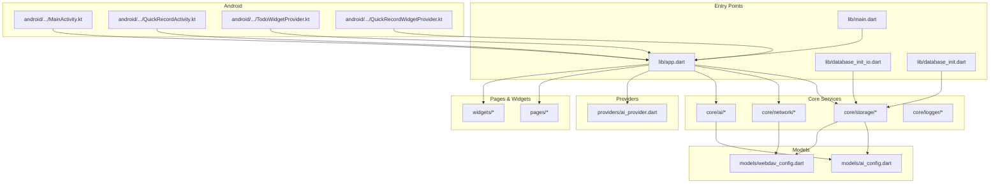
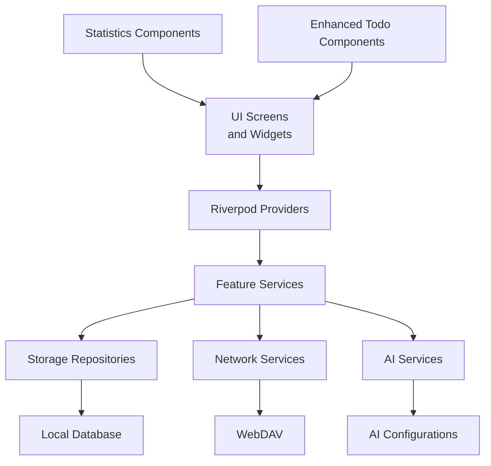
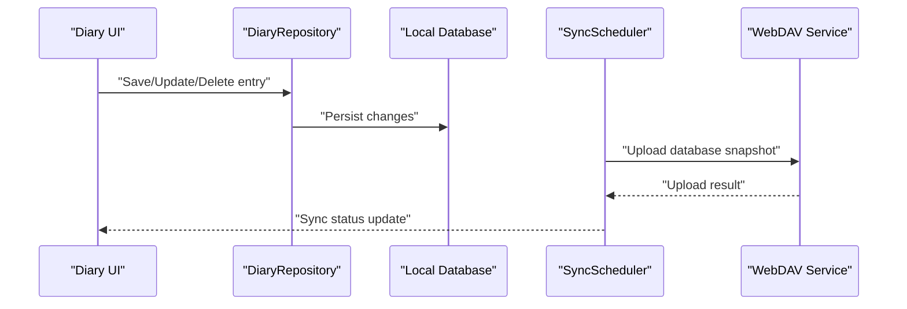
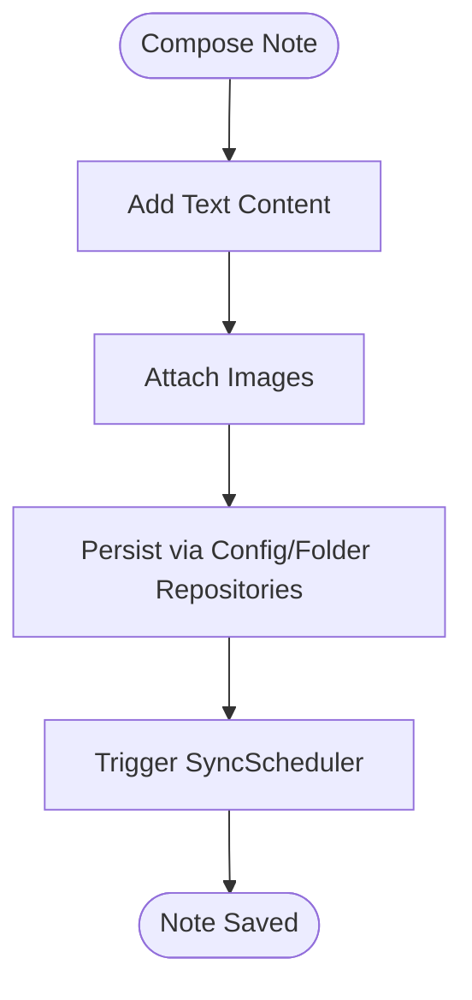
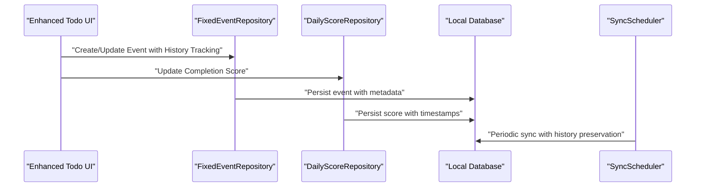
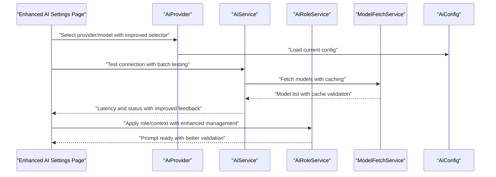
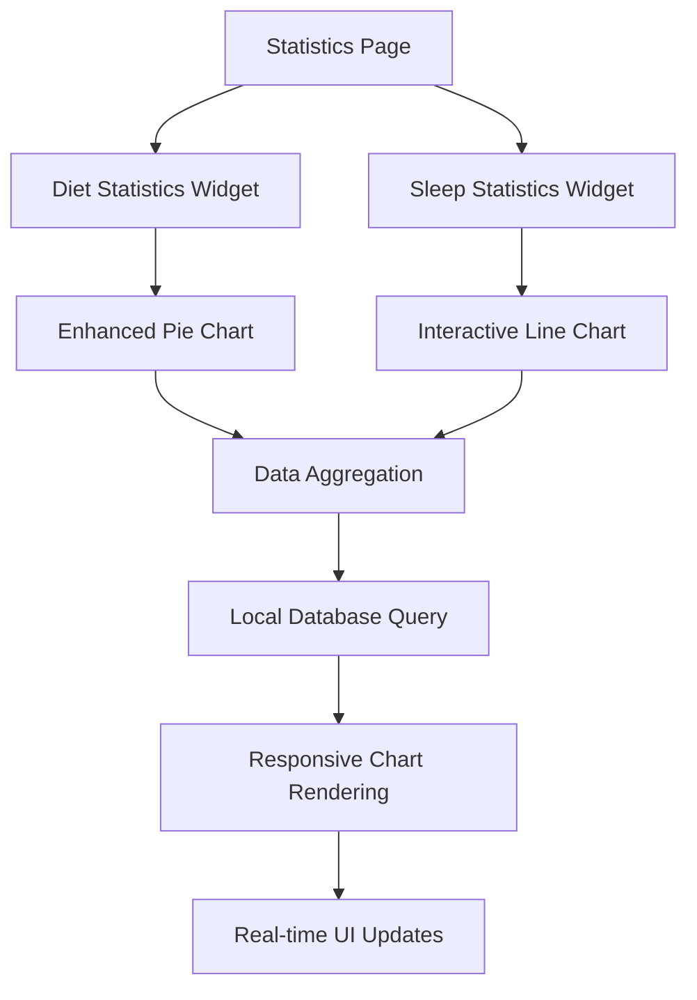
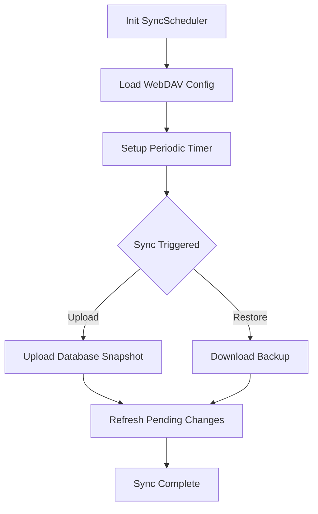
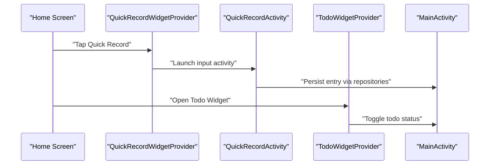
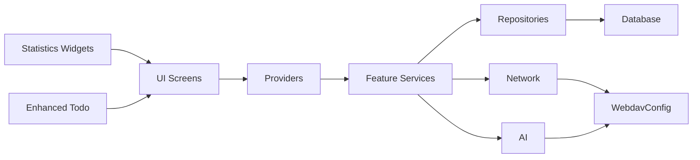

# Core Features

<cite>
**Referenced Files in This Document**
- [main.dart](file://lib/main.dart)
- [app.dart](file://lib/app.dart)
- [database_init.dart](file://lib/database_init.dart)
- [database_init_io.dart](file://lib/database_init_io.dart)
- [ai_service.dart](file://lib/core/ai/ai_service.dart)
- [ai_role_service.dart](file://lib/core/ai/ai_role_service.dart)
- [model_fetch_service.dart](file://lib/core/ai/model_fetch_service.dart)
- [sync_scheduler.dart](file://lib/core/network/sync_scheduler.dart)
- [webdav_service.dart](file://lib/core/network/webdav_service.dart)
- [diary_repository.dart](file://lib/core/storage/diary_repository.dart)
- [config_repository.dart](file://lib/core/storage/config_repository.dart)
- [folder_repository.dart](file://lib/core/storage/folder_repository.dart)
- [fixed_event_repository.dart](file://lib/core/storage/fixed_event_repository.dart)
- [daily_score_repository.dart](file://lib/core/storage/daily_score_repository.dart)
- [color_mark_repository.dart](file://lib/core/storage/color_mark_repository.dart)
- [image_repository.dart](file://lib/core/storage/image_repository.dart)
- [database_helper.dart](file://lib/core/storage/database_helper.dart)
- [ai_config.dart](file://lib/models/ai_config.dart)
- [webdav_config.dart](file://lib/models/webdav_config.dart)
- [ai_provider.dart](file://lib/providers/ai_provider.dart)
- [ai_config_page.dart](file://lib/pages/settings/ai_config_page.dart)
- [diary_input_bar.dart](file://lib/widgets/diary/diary_input_bar.dart)
- [diet_stats.dart](file://lib/widgets/statistics/diet_stats.dart)
- [sleep_stats.dart](file://lib/widgets/statistics/sleep_stats.dart)
- [statistics_page.dart](file://lib/pages/statistics_page.dart)
- [todo_page.dart](file://lib/pages/todo_page.dart)
- [MainActivity.kt](file://android/app/src/main/java/com/appone/qnote_flutter/MainActivity.kt)
- [QuickRecordActivity.kt](file://android/app/src/main/java/com/appone/qnote_flutter/QuickRecordActivity.kt)
- [TodoWidgetProvider.kt](file://android/app/src/main/java/com/appone/qnote_flutter/TodoWidgetProvider.kt)
- [QuickRecordWidgetProvider.kt](file://android/app/src/main/java/com/appone/qnote_flutter/QuickRecordWidgetProvider.kt)
</cite>

## Update Summary
**Changes Made**
- Enhanced AI configuration interface with improved model selection and batch testing capabilities
- Improved statistics page with updated visualization components including enhanced chart rendering
- Enhanced todo page with better task management features including improved history tracking and UI components

## Table of Contents
1. [Introduction](#introduction)
2. [Project Structure](#project-structure)
3. [Core Components](#core-components)
4. [Architecture Overview](#architecture-overview)
5. [Detailed Component Analysis](#detailed-component-analysis)
6. [Dependency Analysis](#dependency-analysis)
7. [Performance Considerations](#performance-considerations)
8. [Troubleshooting Guide](#troubleshooting-guide)
9. [Conclusion](#conclusion)
10. [Appendices](#appendices)

## Introduction
This document explains QNote Flutter's core features and how they integrate to deliver a cohesive productivity experience. The primary functional areas are:
- Diary Management: capture daily entries, organize by date and tags, and maintain structured logs
- Note Taking: flexible text-based notes with metadata and image support
- Todo Management: fixed events and daily tasks with completion tracking and enhanced history management
- AI Integration: configurable AI providers, role-based prompts, and model fetching with improved configuration interface
- Cloud Synchronization: automated WebDAV backup and restore with conflict-aware change logs
- Widget Support: Android home screen widgets for quick recording and todo lists
- Statistics Visualization: comprehensive data analytics with enhanced chart components

These features share a modular design with clear separation of concerns: storage repositories, network services, AI services, and UI providers. They interoperate via shared repositories and services, enabling independent development while maintaining system cohesion.

## Project Structure
The application follows a layered, feature-oriented structure:
- Entry points: main.dart initializes the app, app.dart defines routing and providers, database initialization files set up local persistence
- Core services: ai, network, storage, notification, router, logger
- Models: domain entities for AI configurations, WebDAV settings, and others
- Providers: Riverpod provider definitions for reactive state
- Pages: UI screens including settings, statistics, and feature-specific views
- Widgets: reusable components for diaries, statistics, and todo management
- Android integration: native activities and widget providers for home screen experiences

**Diagram sources**
- [main.dart](file://lib/main.dart)
- [app.dart](file://lib/app.dart)
- [database_init.dart](file://lib/database_init.dart)
- [database_init_io.dart](file://lib/database_init_io.dart)
- [ai_service.dart](file://lib/core/ai/ai_service.dart)
- [sync_scheduler.dart](file://lib/core/network/sync_scheduler.dart)
- [diary_repository.dart](file://lib/core/storage/diary_repository.dart)
- [config_repository.dart](file://lib/core/storage/config_repository.dart)
- [ai_config.dart](file://lib/models/ai_config.dart)
- [webdav_config.dart](file://lib/models/webdav_config.dart)
- [ai_provider.dart](file://lib/providers/ai_provider.dart)
- [MainActivity.kt](file://android/app/src/main/java/com/appone/qnote_flutter/MainActivity.kt)
- [QuickRecordActivity.kt](file://android/app/src/main/java/com/appone/qnote_flutter/QuickRecordActivity.kt)
- [TodoWidgetProvider.kt](file://android/app/src/main/java/com/appone/qnote_flutter/TodoWidgetProvider.kt)
- [QuickRecordWidgetProvider.kt](file://android/app/src/main/java/com/appone/qnote_flutter/QuickRecordWidgetProvider.kt)

**Section sources**
- [main.dart](file://lib/main.dart)
- [app.dart](file://lib/app.dart)
- [database_init.dart](file://lib/database_init.dart)
- [database_init_io.dart](file://lib/database_init_io.dart)

## Core Components
This section outlines the principal components and their responsibilities:

- Storage Layer
  - Repositories encapsulate CRUD operations for diaries, configs, folders, fixed events, daily scores, color marks, and images
  - DatabaseHelper centralizes database initialization and migrations
  - Example repositories: [diary_repository.dart](file://lib/core/storage/diary_repository.dart), [config_repository.dart](file://lib/core/storage/config_repository.dart), [folder_repository.dart](file://lib/core/storage/folder_repository.dart), [fixed_event_repository.dart](file://lib/core/storage/fixed_event_repository.dart), [daily_score_repository.dart](file://lib/core/storage/daily_score_repository.dart), [color_mark_repository.dart](file://lib/core/storage/color_mark_repository.dart), [image_repository.dart](file://lib/core/storage/image_repository.dart), [database_helper.dart](file://lib/core/storage/database_helper.dart)

- Network Layer
  - SyncScheduler orchestrates periodic and on-demand synchronization using WebDAV
  - WebDAV service handles upload/download and backup cleanup
  - Example: [sync_scheduler.dart](file://lib/core/network/sync_scheduler.dart), [webdav_service.dart](file://lib/core/network/webdav_service.dart)

- AI Layer
  - AiService manages chat interactions and integrates with configurable providers
  - AiRoleService supports role-based prompting and context filtering
  - ModelFetchService retrieves available models from providers
  - Enhanced AI configuration interface with improved model selection and batch testing
  - Example: [ai_service.dart](file://lib/core/ai/ai_service.dart), [ai_role_service.dart](file://lib/core/ai/ai_role_service.dart), [model_fetch_service.dart](file://lib/core/ai/model_fetch_service.dart), [ai_config_page.dart](file://lib/pages/settings/ai_config_page.dart)

- Models
  - AiConfig and WebdavConfig define persistent configuration structures
  - Example: [ai_config.dart](file://lib/models/ai_config.dart), [webdav_config.dart](file://lib/models/webdav_config.dart)

- Providers
  - Riverpod providers expose reactive state for AI configuration, roles, temperatures, and context filters
  - Example: [ai_provider.dart](file://lib/providers/ai_provider.dart)

- Pages & Widgets
  - Enhanced statistics visualization with improved chart components and data presentation
  - Enhanced todo management with better task history tracking and UI components
  - Improved AI configuration interface with model selector and batch testing
  - Example: [statistics_page.dart](file://lib/pages/statistics_page.dart), [todo_page.dart](file://lib/pages/todo_page.dart), [diet_stats.dart](file://lib/widgets/statistics/diet_stats.dart), [sleep_stats.dart](file://lib/widgets/statistics/sleep_stats.dart), [diary_input_bar.dart](file://lib/widgets/diary/diary_input_bar.dart)

- Android Integration
  - Native activities and widget providers enable quick recording and todo list widgets on the home screen
  - Example: [MainActivity.kt](file://android/app/src/main/java/com/appone/qnote_flutter/MainActivity.kt), [QuickRecordActivity.kt](file://android/app/src/main/java/com/appone/qnote_flutter/QuickRecordActivity.kt), [TodoWidgetProvider.kt](file://android/app/src/main/java/com/appone/qnote_flutter/TodoWidgetProvider.kt), [QuickRecordWidgetProvider.kt](file://android/app/src/main/java/com/appone/qnote_flutter/QuickRecordWidgetProvider.kt)

**Section sources**
- [diary_repository.dart](file://lib/core/storage/diary_repository.dart)
- [config_repository.dart](file://lib/core/storage/config_repository.dart)
- [folder_repository.dart](file://lib/core/storage/folder_repository.dart)
- [fixed_event_repository.dart](file://lib/core/storage/fixed_event_repository.dart)
- [daily_score_repository.dart](file://lib/core/storage/daily_score_repository.dart)
- [color_mark_repository.dart](file://lib/core/storage/color_mark_repository.dart)
- [image_repository.dart](file://lib/core/storage/image_repository.dart)
- [database_helper.dart](file://lib/core/storage/database_helper.dart)
- [sync_scheduler.dart](file://lib/core/network/sync_scheduler.dart)
- [webdav_service.dart](file://lib/core/network/webdav_service.dart)
- [ai_service.dart](file://lib/core/ai/ai_service.dart)
- [ai_role_service.dart](file://lib/core/ai/ai_role_service.dart)
- [model_fetch_service.dart](file://lib/core/ai/model_fetch_service.dart)
- [ai_config.dart](file://lib/models/ai_config.dart)
- [webdav_config.dart](file://lib/models/webdav_config.dart)
- [ai_provider.dart](file://lib/providers/ai_provider.dart)
- [ai_config_page.dart](file://lib/pages/settings/ai_config_page.dart)
- [diary_input_bar.dart](file://lib/widgets/diary/diary_input_bar.dart)
- [diet_stats.dart](file://lib/widgets/statistics/diet_stats.dart)
- [sleep_stats.dart](file://lib/widgets/statistics/sleep_stats.dart)
- [statistics_page.dart](file://lib/pages/statistics_page.dart)
- [todo_page.dart](file://lib/pages/todo_page.dart)
- [MainActivity.kt](file://android/app/src/main/java/com/appone/qnote_flutter/MainActivity.kt)
- [QuickRecordActivity.kt](file://android/app/src/main/java/com/appone/qnote_flutter/QuickRecordActivity.kt)
- [TodoWidgetProvider.kt](file://android/app/src/main/java/com/appone/qnote_flutter/TodoWidgetProvider.kt)
- [QuickRecordWidgetProvider.kt](file://android/app/src/main/java/com/appone/qnote_flutter/QuickRecordWidgetProvider.kt)

## Architecture Overview
The system architecture emphasizes modularity and separation of concerns:
- UI layer depends on Riverpod providers for reactive state
- Feature services depend on storage repositories for persistence
- Network and AI services are pluggable and configurable
- Android widgets integrate via native providers and activities
- Enhanced visualization components provide comprehensive data analytics

**Diagram sources**
- [app.dart](file://lib/app.dart)
- [ai_provider.dart](file://lib/providers/ai_provider.dart)
- [sync_scheduler.dart](file://lib/core/network/sync_scheduler.dart)
- [ai_service.dart](file://lib/core/ai/ai_service.dart)
- [diary_repository.dart](file://lib/core/storage/diary_repository.dart)
- [config_repository.dart](file://lib/core/storage/config_repository.dart)
- [statistics_page.dart](file://lib/pages/statistics_page.dart)
- [todo_page.dart](file://lib/pages/todo_page.dart)

## Detailed Component Analysis

### Diary Management
Diary management centers around capturing, organizing, and retrieving daily entries. The flow:
- UI captures diary content and metadata
- DiaryRepository persists entries and supports queries by date and tags
- SyncScheduler uploads changes to WebDAV for cloud backup
- On restore, entries are rehydrated locally

**Diagram sources**
- [diary_repository.dart](file://lib/core/storage/diary_repository.dart)
- [sync_scheduler.dart](file://lib/core/network/sync_scheduler.dart)
- [webdav_service.dart](file://lib/core/network/webdav_service.dart)

**Section sources**
- [diary_repository.dart](file://lib/core/storage/diary_repository.dart)
- [sync_scheduler.dart](file://lib/core/network/sync_scheduler.dart)
- [webdav_config.dart](file://lib/models/webdav_config.dart)

### Note Taking
Notes are flexible text-based records with optional metadata and images. The flow:
- UI composes notes and attaches images
- ImageRepository stores media assets
- ConfigRepository manages note-related preferences
- Changes are persisted via repositories and synchronized via WebDAV

**Diagram sources**
- [image_repository.dart](file://lib/core/storage/image_repository.dart)
- [config_repository.dart](file://lib/core/storage/config_repository.dart)
- [sync_scheduler.dart](file://lib/core/network/sync_scheduler.dart)

**Section sources**
- [image_repository.dart](file://lib/core/storage/image_repository.dart)
- [config_repository.dart](file://lib/core/storage/config_repository.dart)

### Enhanced Todo Management
Fixed events and daily tasks are managed through dedicated repositories with enhanced features:
- FixedEventRepository tracks recurring or scheduled events
- DailyScoreRepository maintains completion metrics
- Enhanced todo page provides improved task management with history tracking
- UI updates statuses and persists via repositories
- SyncScheduler ensures todos synchronize across devices

**Updated** Enhanced todo page now includes improved history tracking and UI components for better task management

**Diagram sources**
- [fixed_event_repository.dart](file://lib/core/storage/fixed_event_repository.dart)
- [daily_score_repository.dart](file://lib/core/storage/daily_score_repository.dart)
- [sync_scheduler.dart](file://lib/core/network/sync_scheduler.dart)
- [todo_page.dart](file://lib/pages/todo_page.dart)

**Section sources**
- [fixed_event_repository.dart](file://lib/core/storage/fixed_event_repository.dart)
- [daily_score_repository.dart](file://lib/core/storage/daily_score_repository.dart)
- [todo_page.dart](file://lib/pages/todo_page.dart)

### Enhanced AI Integration
AI integration supports configurable providers, role-based prompts, and model discovery with improved interface:
- AiConfig defines provider, model, base URL, and API key
- AiService coordinates chat requests and responses
- AiRoleService applies role templates and context filters
- ModelFetchService retrieves available models from providers
- Enhanced AI configuration interface with improved model selection and batch testing
- Settings page validates configurations and measures latency with better user experience

**Updated** Enhanced AI configuration interface now includes improved model selection with predefined model lists and batch testing capabilities

**Diagram sources**
- [ai_provider.dart](file://lib/providers/ai_provider.dart)
- [ai_service.dart](file://lib/core/ai/ai_service.dart)
- [ai_role_service.dart](file://lib/core/ai/ai_role_service.dart)
- [model_fetch_service.dart](file://lib/core/ai/model_fetch_service.dart)
- [ai_config_page.dart](file://lib/pages/settings/ai_config_page.dart)
- [ai_config.dart](file://lib/models/ai_config.dart)
- [diary_input_bar.dart](file://lib/widgets/diary/diary_input_bar.dart)

**Section sources**
- [ai_provider.dart](file://lib/providers/ai_provider.dart)
- [ai_service.dart](file://lib/core/ai/ai_service.dart)
- [ai_role_service.dart](file://lib/core/ai/ai_role_service.dart)
- [model_fetch_service.dart](file://lib/core/ai/model_fetch_service.dart)
- [ai_config_page.dart](file://lib/pages/settings/ai_config_page.dart)
- [ai_config.dart](file://lib/models/ai_config.dart)
- [diary_input_bar.dart](file://lib/widgets/diary/diary_input_bar.dart)

### Enhanced Statistics Visualization
Comprehensive data analytics with enhanced chart components and improved data presentation:
- Statistics page provides aggregated insights across all diary data
- Diet statistics widget offers detailed nutritional analysis with pie charts
- Sleep statistics widget presents sleep quality trends with interactive charts
- Enhanced visualization components with improved color schemes and responsive design
- Real-time data aggregation and chart rendering optimization

**Updated** Statistics page now includes enhanced visualization components with improved chart rendering and data presentation

**Diagram sources**
- [statistics_page.dart](file://lib/pages/statistics_page.dart)
- [diet_stats.dart](file://lib/widgets/statistics/diet_stats.dart)
- [sleep_stats.dart](file://lib/widgets/statistics/sleep_stats.dart)

**Section sources**
- [statistics_page.dart](file://lib/pages/statistics_page.dart)
- [diet_stats.dart](file://lib/widgets/statistics/diet_stats.dart)
- [sleep_stats.dart](file://lib/widgets/statistics/sleep_stats.dart)

### Cloud Synchronization
Cloud synchronization automates backup and restore:
- SyncScheduler reads WebDAV configuration and sets up periodic sync
- WebDAV service uploads database snapshots and downloads backups
- Change counts and pending logs drive conflict awareness
- UI surfaces sync status and errors

**Diagram sources**
- [sync_scheduler.dart](file://lib/core/network/sync_scheduler.dart)
- [webdav_service.dart](file://lib/core/network/webdav_service.dart)
- [webdav_config.dart](file://lib/models/webdav_config.dart)

**Section sources**
- [sync_scheduler.dart](file://lib/core/network/sync_scheduler.dart)
- [webdav_service.dart](file://lib/core/network/webdav_service.dart)
- [webdav_config.dart](file://lib/models/webdav_config.dart)

### Widget Support
Android home screen widgets provide quick actions:
- QuickRecordWidgetProvider enables instant diary entries
- TodoWidgetProvider displays and toggles todo items
- QuickRecordActivity supports voice or text input
- MainActivity integrates core navigation and settings

**Diagram sources**
- [QuickRecordWidgetProvider.kt](file://android/app/src/main/java/com/appone/qnote_flutter/QuickRecordWidgetProvider.kt)
- [QuickRecordActivity.kt](file://android/app/src/main/java/com/appone/qnote_flutter/QuickRecordActivity.kt)
- [TodoWidgetProvider.kt](file://android/app/src/main/java/com/appone/qnote_flutter/TodoWidgetProvider.kt)
- [MainActivity.kt](file://android/app/src/main/java/com/appone/qnote_flutter/MainActivity.kt)

**Section sources**
- [QuickRecordWidgetProvider.kt](file://android/app/src/main/java/com/appone/qnote_flutter/QuickRecordWidgetProvider.kt)
- [QuickRecordActivity.kt](file://android/app/src/main/java/com/appone/qnote_flutter/QuickRecordActivity.kt)
- [TodoWidgetProvider.kt](file://android/app/src/main/java/com/appone/qnote_flutter/TodoWidgetProvider.kt)
- [MainActivity.kt](file://android/app/src/main/java/com/appone/qnote_flutter/MainActivity.kt)

## Dependency Analysis
The following diagram shows key dependencies among modules:

**Diagram sources**
- [app.dart](file://lib/app.dart)
- [ai_provider.dart](file://lib/providers/ai_provider.dart)
- [sync_scheduler.dart](file://lib/core/network/sync_scheduler.dart)
- [ai_service.dart](file://lib/core/ai/ai_service.dart)
- [diary_repository.dart](file://lib/core/storage/diary_repository.dart)
- [config_repository.dart](file://lib/core/storage/config_repository.dart)
- [webdav_config.dart](file://lib/models/webdav_config.dart)
- [ai_config.dart](file://lib/models/ai_config.dart)
- [statistics_page.dart](file://lib/pages/statistics_page.dart)
- [todo_page.dart](file://lib/pages/todo_page.dart)

**Section sources**
- [app.dart](file://lib/app.dart)
- [ai_provider.dart](file://lib/providers/ai_provider.dart)
- [sync_scheduler.dart](file://lib/core/network/sync_scheduler.dart)
- [ai_service.dart](file://lib/core/ai/ai_service.dart)
- [diary_repository.dart](file://lib/core/storage/diary_repository.dart)
- [config_repository.dart](file://lib/core/storage/config_repository.dart)
- [webdav_config.dart](file://lib/models/webdav_config.dart)
- [ai_config.dart](file://lib/models/ai_config.dart)
- [statistics_page.dart](file://lib/pages/statistics_page.dart)
- [todo_page.dart](file://lib/pages/todo_page.dart)

## Performance Considerations
- Minimize UI rebuilds by using Riverpod selectors and efficient state updates
- Batch repository writes to reduce database contention during bulk operations
- Use incremental WebDAV sync strategies to avoid large transfers
- Cache frequently accessed AI models and configurations to reduce latency
- Optimize chart rendering with lazy loading and responsive design
- Implement efficient todo history tracking with pagination and virtualization
- Offload heavy computations to background threads and avoid blocking the UI thread

## Troubleshooting Guide
Common issues and resolutions:
- Sync fails silently
  - Verify WebDAV configuration and credentials
  - Check periodic timer setup and error logging
  - Review last sync time and pending change counts
  - Reference: [sync_scheduler.dart](file://lib/core/network/sync_scheduler.dart), [webdav_config.dart](file://lib/models/webdav_config.dart)

- AI configuration test fails
  - Confirm provider URL, API key, and model availability
  - Measure latency and log errors in the settings page
  - Check batch testing status and model caching
  - Reference: [ai_config_page.dart](file://lib/pages/settings/ai_config_page.dart), [ai_service.dart](file://lib/core/ai/ai_service.dart)

- Enhanced statistics visualization issues
  - Verify data aggregation queries and chart rendering
  - Check color schemes and responsive design compatibility
  - Ensure proper data types for chart components
  - Reference: [diet_stats.dart](file://lib/widgets/statistics/diet_stats.dart), [sleep_stats.dart](file://lib/widgets/statistics/sleep_stats.dart)

- Widget does not update
  - Ensure widget providers are registered and updated
  - Verify repository state after UI actions
  - Reference: [QuickRecordWidgetProvider.kt](file://android/app/src/main/java/com/appone/qnote_flutter/QuickRecordWidgetProvider.kt), [TodoWidgetProvider.kt](file://android/app/src/main/java/com/appone/qnote_flutter/TodoWidgetProvider.kt)

**Section sources**
- [sync_scheduler.dart](file://lib/core/network/sync_scheduler.dart)
- [webdav_config.dart](file://lib/models/webdav_config.dart)
- [ai_config_page.dart](file://lib/pages/settings/ai_config_page.dart)
- [ai_service.dart](file://lib/core/ai/ai_service.dart)
- [diet_stats.dart](file://lib/widgets/statistics/diet_stats.dart)
- [sleep_stats.dart](file://lib/widgets/statistics/sleep_stats.dart)
- [QuickRecordWidgetProvider.kt](file://android/app/src/main/java/com/appone/qnote_flutter/QuickRecordWidgetProvider.kt)
- [TodoWidgetProvider.kt](file://android/app/src/main/java/com/appone/qnote_flutter/TodoWidgetProvider.kt)

## Conclusion
QNote Flutter's modular architecture enables independent development of features while ensuring seamless integration. The storage, network, and AI layers provide robust foundations, while Riverpod and Android widgets enhance usability. Recent enhancements include improved AI configuration interfaces, comprehensive statistics visualization, and enhanced todo management features. By following the established patterns—repository-first persistence, provider-driven state, and pluggable services—new features can be introduced consistently and efficiently.

## Appendices
- Integration guidelines for new features
  - Define a repository under core/storage for persistence
  - Create a service under core/network or core/ai as appropriate
  - Expose reactive state via Riverpod providers
  - Wire UI screens to providers and repositories
  - Add tests for critical flows and edge cases
  - Implement enhanced visualization components with responsive design
  - Ensure proper data aggregation and chart rendering optimization