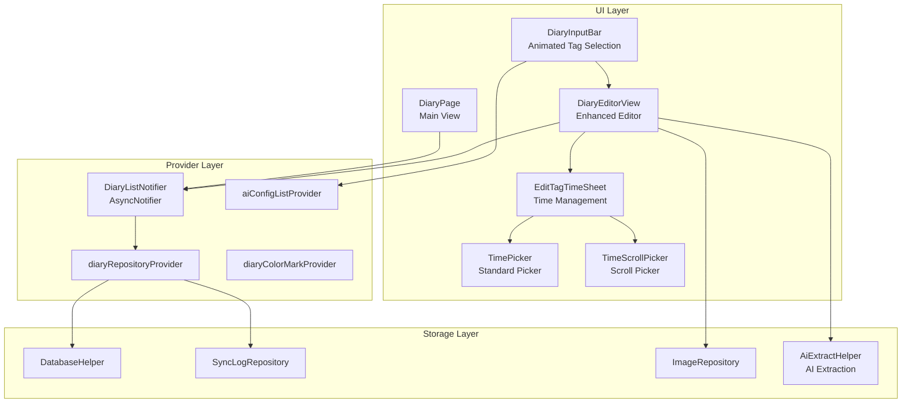
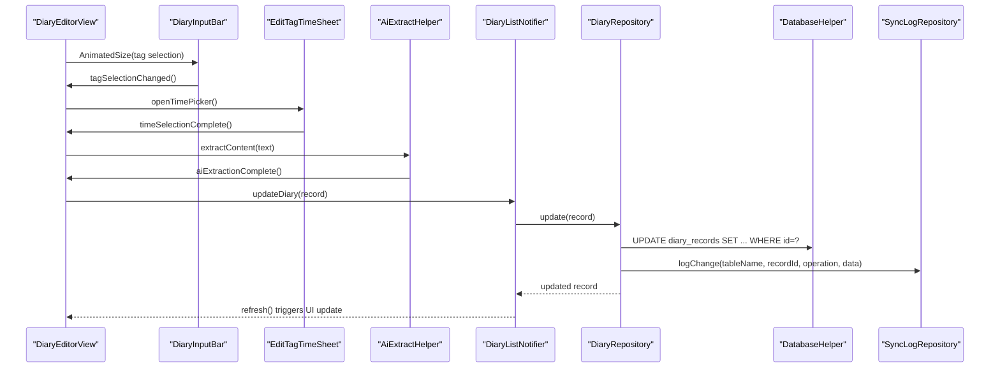
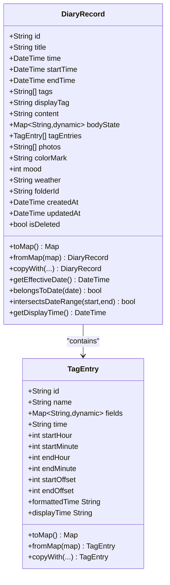
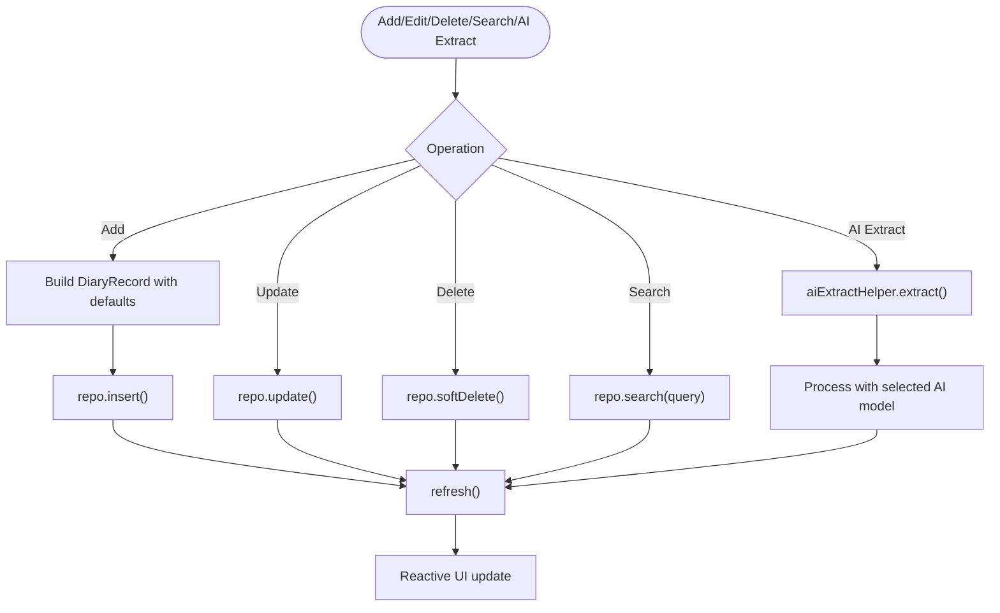
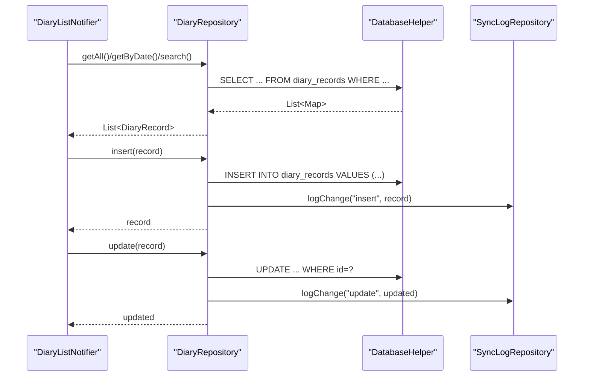
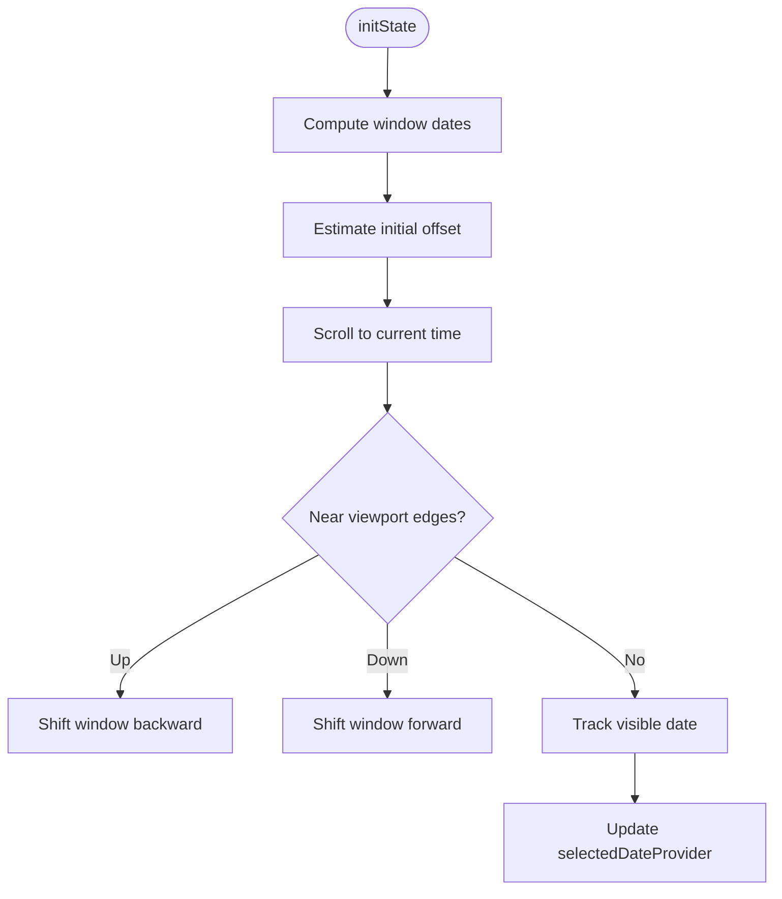
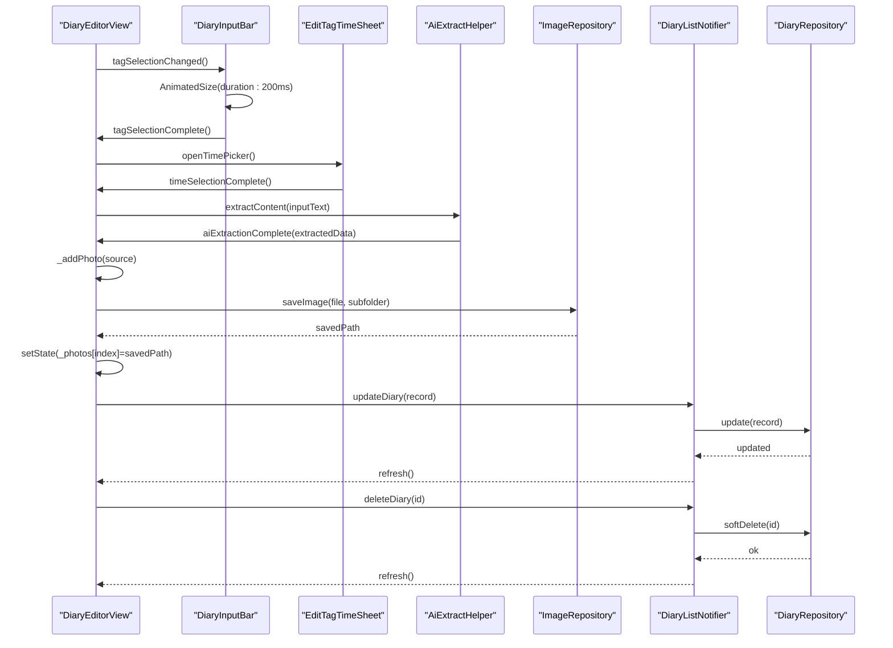
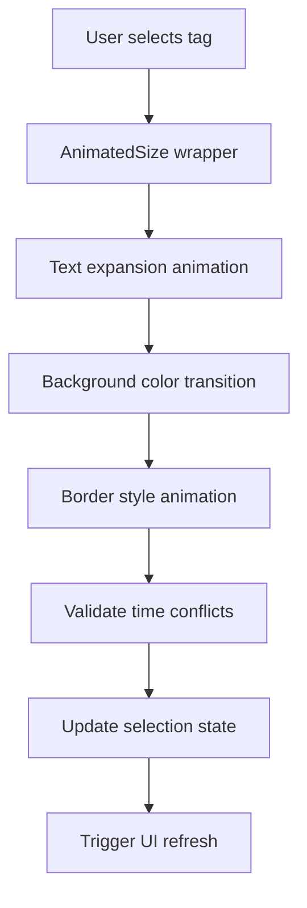
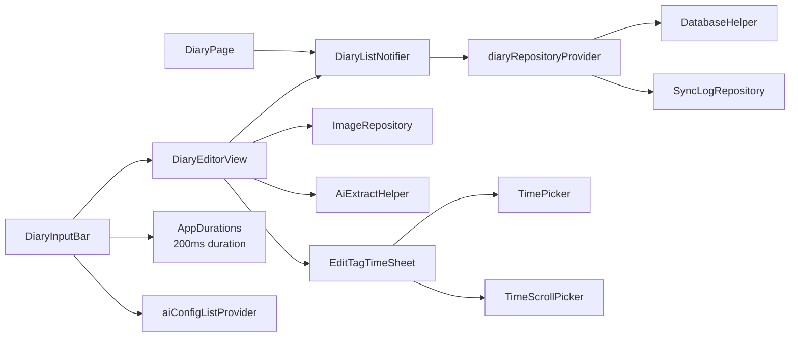

# Diary Management

<cite>
**Referenced Files in This Document**
- [diary_record.dart](file://lib/models/diary_record.dart)
- [tag_entry.dart](file://lib/models/tag_entry.dart)
- [diary_provider.dart](file://lib/providers/diary_provider.dart)
- [diary_repository.dart](file://lib/core/storage/diary_repository.dart)
- [diary_page.dart](file://lib/pages/diary_page.dart)
- [diary_editor_view.dart](file://lib/widgets/diary/diary_editor_view.dart)
- [diary_input_bar.dart](file://lib/widgets/diary/diary_input_bar.dart)
- [database_helper.dart](file://lib/core/storage/database_helper.dart)
- [sync_log_repository.dart](file://lib/core/storage/sync_log_repository.dart)
- [image_repository.dart](file://lib/core/storage/image_repository.dart)
- [app_durations.dart](file://lib/core/theme/app_durations.dart)
- [ai_extract_helper.dart](file://lib/widgets/diary/ai_extract_helper.dart)
- [edit_tag_time_sheet.dart](file://lib/widgets/diary/edit_tag_time_sheet.dart)
- [time_picker.dart](file://lib/widgets/time_picker.dart)
- [time_scroll_picker.dart](file://lib/widgets/time_scroll_picker.dart)
</cite>

## Update Summary
**Changes Made**
- Updated Editor View Functionality section to reflect enhanced time management features with new time picker widgets
- Enhanced Tag-Based Organization section with improved animated tag selection interface details
- Added new section on AI-Powered Extraction Capabilities documenting enhanced AI integration
- Updated Animated Tag Selection Interface section with specific implementation details for time management features
- Enhanced Time Management Features section with detailed coverage of new time picker widgets and timeline integration

## Table of Contents
1. [Introduction](#introduction)
2. [Project Structure](#project-structure)
3. [Core Components](#core-components)
4. [Architecture Overview](#architecture-overview)
5. [Detailed Component Analysis](#detailed-component-analysis)
6. [Dependency Analysis](#dependency-analysis)
7. [Performance Considerations](#performance-considerations)
8. [Troubleshooting Guide](#troubleshooting-guide)
9. [Conclusion](#conclusion)

## Introduction
This document explains the Diary Management feature, covering the diary creation workflow, mood tracking, tag-based organization, photo attachments, and search/filter capabilities. It documents the DiaryRecord model, the provider-based state management, the repository for data persistence, and the main UI components for viewing, editing, and organizing diary entries. It also describes integration with image processing for photo attachments and the relationship with cloud synchronization for backup purposes.

**Updated** Enhanced with sophisticated time management features, improved animated tag selection interface, and advanced AI-powered extraction capabilities for intelligent diary entry creation and enhancement.

## Project Structure
The Diary Management feature is organized around three layers:
- Model layer: Defines the DiaryRecord entity and supporting TagEntry structure.
- Provider layer: Implements state management using Riverpod for reactive UI updates.
- Repository and storage layer: Handles persistence via a local database and sync logging.

**Diagram sources**
- [diary_page.dart](file://lib/pages/diary_page.dart)
- [diary_editor_view.dart](file://lib/widgets/diary/diary_editor_view.dart)
- [diary_input_bar.dart](file://lib/widgets/diary/diary_input_bar.dart)
- [edit_tag_time_sheet.dart](file://lib/widgets/diary/edit_tag_time_sheet.dart)
- [time_picker.dart](file://lib/widgets/time_picker.dart)
- [time_scroll_picker.dart](file://lib/widgets/time_scroll_picker.dart)
- [diary_provider.dart](file://lib/providers/diary_provider.dart)
- [diary_repository.dart](file://lib/core/storage/diary_repository.dart)
- [database_helper.dart](file://lib/core/storage/database_helper.dart)
- [sync_log_repository.dart](file://lib/core/storage/sync_log_repository.dart)
- [image_repository.dart](file://lib/core/storage/image_repository.dart)
- [ai_extract_helper.dart](file://lib/widgets/diary/ai_extract_helper.dart)
- [ai_provider.dart](file://lib/providers/ai_provider.dart)

**Section sources**
- [diary_page.dart](file://lib/pages/diary_page.dart)
- [diary_provider.dart](file://lib/providers/diary_provider.dart)
- [diary_repository.dart](file://lib/core/storage/diary_repository.dart)

## Core Components
- DiaryRecord: The primary data model representing a diary entry with content, time window, mood/weather, tags, photos, and timestamps.
- TagEntry: A structured tag entry with optional time fields and associated fields for detailed entries.
- DiaryListNotifier: Riverpod notifier managing CRUD operations, search, and refresh for diary lists.
- DiaryRepository: Encapsulates database queries and writes, including soft-delete and search.
- DiaryPage: Main timeline view with virtualized scrolling and date navigation.
- DiaryEditorView: Enhanced editor with tag selection, time pickers, content composition, photo attachment, and AI extraction.
- DiaryInputBar: Animated input component with sophisticated tag selection interface and smooth transitions.
- EditTagTimeSheet: Specialized time management interface for tag-specific scheduling.
- AiExtractHelper: Advanced AI-powered extraction system for intelligent diary entry enhancement.
- TimePicker and TimeScrollPicker: Dual time selection widgets for flexible time management.

**Updated** Added EditTagTimeSheet for specialized time management, AiExtractHelper for AI-powered extraction, and enhanced time picker widgets for comprehensive time management capabilities.

**Section sources**
- [diary_record.dart](file://lib/models/diary_record.dart)
- [tag_entry.dart](file://lib/models/tag_entry.dart)
- [diary_provider.dart](file://lib/providers/diary_provider.dart)
- [diary_repository.dart](file://lib/core/storage/diary_repository.dart)
- [diary_page.dart](file://lib/pages/diary_page.dart)
- [diary_editor_view.dart](file://lib/widgets/diary/diary_editor_view.dart)
- [diary_input_bar.dart](file://lib/widgets/diary/diary_input_bar.dart)
- [edit_tag_time_sheet.dart](file://lib/widgets/diary/edit_tag_time_sheet.dart)
- [ai_extract_helper.dart](file://lib/widgets/diary/ai_extract_helper.dart)
- [time_picker.dart](file://lib/widgets/time_picker.dart)
- [time_scroll_picker.dart](file://lib/widgets/time_scroll_picker.dart)

## Architecture Overview
The system follows a layered architecture:
- UI components trigger actions via Riverpod providers.
- Providers delegate to repositories for data operations.
- Repositories persist data using a local database and log changes for synchronization.
- Image operations are handled by a dedicated repository for compression and storage.
- AI extraction operates through specialized helper components with configurable model support.

**Diagram sources**
- [diary_editor_view.dart](file://lib/widgets/diary/diary_editor_view.dart)
- [diary_input_bar.dart](file://lib/widgets/diary/diary_input_bar.dart)
- [edit_tag_time_sheet.dart](file://lib/widgets/diary/edit_tag_time_sheet.dart)
- [ai_extract_helper.dart](file://lib/widgets/diary/ai_extract_helper.dart)
- [diary_provider.dart](file://lib/providers/diary_provider.dart)
- [diary_repository.dart](file://lib/core/storage/diary_repository.dart)
- [database_helper.dart](file://lib/core/storage/database_helper.dart)
- [sync_log_repository.dart](file://lib/core/storage/sync_log_repository.dart)

## Detailed Component Analysis

### DiaryRecord Model
The DiaryRecord encapsulates all diary entry data:
- Identity: id, folderId
- Timing: time, startTime, endTime, displayTag
- Content: title, content, bodyState derived from tag entries
- Organization: tags, tagEntries, photos, colorMark
- Metadata: mood, weather, timestamps (createdAt, updatedAt), deletion flag

Key behaviors:
- Serialization to/from database maps with JSON encoding for complex fields.
- Effective date calculation and date-range intersection for timeline rendering.
- Display time determination for sorting and positioning.

**Diagram sources**
- [diary_record.dart](file://lib/models/diary_record.dart)
- [tag_entry.dart](file://lib/models/tag_entry.dart)

**Section sources**
- [diary_record.dart](file://lib/models/diary_record.dart)
- [tag_entry.dart](file://lib/models/tag_entry.dart)

### Provider and State Management
The provider layer manages:
- DiaryListNotifier: builds the list, handles add/update/delete/search, and refreshes state.
- Providers for repository, color marks, selected date, and drafts.
- AI configuration provider for model selection and management.
- Undo-delete support with last-deleted snapshot restoration.

**Diagram sources**
- [diary_provider.dart](file://lib/providers/diary_provider.dart)
- [ai_provider.dart](file://lib/providers/ai_provider.dart)

**Section sources**
- [diary_provider.dart](file://lib/providers/diary_provider.dart)

### Repository and Persistence
The repository:
- Queries by date, date range, folder, and tag.
- Supports soft-delete and hard-delete.
- Logs changes to a sync log for cloud backup and reconciliation.
- Uses DatabaseHelper for database operations.

**Diagram sources**
- [diary_repository.dart](file://lib/core/storage/diary_repository.dart)
- [database_helper.dart](file://lib/core/storage/database_helper.dart)
- [sync_log_repository.dart](file://lib/core/storage/sync_log_repository.dart)

**Section sources**
- [diary_repository.dart](file://lib/core/storage/diary_repository.dart)

### Main Diary Page Interface
The main timeline view:
- Virtualizes a long list with fixed-day layout and dynamic record heights.
- Estimates offsets for smooth programmatic scrolling to current time.
- Manages a sliding window of dates and updates selected date on scroll.
- Integrates with undo animations and batch operations.

**Diagram sources**
- [diary_page.dart](file://lib/pages/diary_page.dart)

**Section sources**
- [diary_page.dart](file://lib/pages/diary_page.dart)

### Enhanced Editor View Functionality
The editor now supports sophisticated time management and AI-powered features:

**Time Management Features:**
- Dual time picker integration with standard TimePicker and TimeScrollPicker widgets
- Timeline-aware time selection synchronized with EditTagTimeSheet
- Sleep tag synchronization for automatic time window adjustment
- Real-time validation and conflict detection for overlapping time entries

**Enhanced Tag Selection Interface:**
- AnimatedSize widgets with 200ms duration for smooth text expansion
- Enhanced visual feedback with color transitions and border animations
- Sophisticated state management for complex tag hierarchies

**AI-Powered Extraction Capabilities:**
- Intelligent content parsing and extraction from user input
- Automated tag recognition and categorization
- Smart time slot detection and scheduling suggestions
- Multi-model AI support with configurable extraction preferences

**Content Composition Enhancements:**
- Automatic merging of extracted notes with existing content
- Real-time preview and validation of AI-generated content
- Undo/redo support for AI extraction operations

**Diagram sources**
- [diary_editor_view.dart](file://lib/widgets/diary/diary_editor_view.dart)
- [diary_input_bar.dart](file://lib/widgets/diary/diary_input_bar.dart)
- [edit_tag_time_sheet.dart](file://lib/widgets/diary/edit_tag_time_sheet.dart)
- [ai_extract_helper.dart](file://lib/widgets/diary/ai_extract_helper.dart)
- [time_picker.dart](file://lib/widgets/time_picker.dart)
- [time_scroll_picker.dart](file://lib/widgets/time_scroll_picker.dart)
- [image_repository.dart](file://lib/core/storage/image_repository.dart)
- [diary_provider.dart](file://lib/providers/diary_provider.dart)
- [diary_repository.dart](file://lib/core/storage/diary_repository.dart)

**Section sources**
- [diary_editor_view.dart](file://lib/widgets/diary/diary_editor_view.dart)
- [diary_input_bar.dart](file://lib/widgets/diary/diary_input_bar.dart)
- [edit_tag_time_sheet.dart](file://lib/widgets/diary/edit_tag_time_sheet.dart)
- [ai_extract_helper.dart](file://lib/widgets/diary/ai_extract_helper.dart)
- [time_picker.dart](file://lib/widgets/time_picker.dart)
- [time_scroll_picker.dart](file://lib/widgets/time_scroll_picker.dart)

### Animated Tag Selection Interface
**Updated** The tag selection interface now features sophisticated animated transitions for enhanced user experience with comprehensive time management integration.

The animated tag selection system implements smooth visual feedback through AnimatedSize widgets with precise timing controls:

- **Animation Duration**: 200 milliseconds for responsive yet smooth transitions
- **Timing Curve**: ease-in-out for natural motion perception
- **Visual Feedback**: Text expansion effect when tags are selected
- **Container Animation**: AnimatedContainer with color transitions and border effects
- **Timeline Integration**: Seamless coordination with EditTagTimeSheet for time-aware tag selection

Key implementation aspects:
- AnimatedSize widgets wrap tag selection elements to provide smooth text expansion
- Duration constants from AppDurations ensure consistent animation timing
- Color transitions provide clear visual feedback for selection states
- Border animations distinguish selected versus unselected states
- Real-time validation prevents conflicting time selections

**Diagram sources**
- [diary_input_bar.dart](file://lib/widgets/diary/diary_input_bar.dart)
- [app_durations.dart](file://lib/core/theme/app_durations.dart)
- [edit_tag_time_sheet.dart](file://lib/widgets/diary/edit_tag_time_sheet.dart)

**Section sources**
- [diary_input_bar.dart](file://lib/widgets/diary/diary_input_bar.dart)
- [app_durations.dart](file://lib/core/theme/app_durations.dart)
- [edit_tag_time_sheet.dart](file://lib/widgets/diary/edit_tag_time_sheet.dart)

### AI-Powered Extraction Capabilities
**New** The system now includes advanced AI-powered extraction capabilities for intelligent diary entry enhancement.

The AI extraction system provides:

- **Intelligent Content Parsing**: Automatic extraction of tags, time slots, and content from user input text
- **Multi-Model Support**: Configurable AI models with different extraction capabilities and preferences
- **Real-Time Processing**: Instant feedback and validation of extracted content
- **Conflict Resolution**: Automatic handling of conflicting extractions and user overrides
- **Undo/Redo Support**: Complete transaction support for AI extraction operations

Key features:
- Automated tag recognition and categorization based on context
- Smart time slot detection with validation against existing schedule
- Content summarization and organization for better readability
- Model selection interface for choosing optimal extraction strategies

**Section sources**
- [ai_extract_helper.dart](file://lib/widgets/diary/ai_extract_helper.dart)
- [ai_provider.dart](file://lib/providers/ai_provider.dart)

### Enhanced Time Management Features
**New** Comprehensive time management capabilities integrated throughout the diary system.

The time management system includes:

- **Dual Time Picker Integration**: Standard TimePicker and TimeScrollPicker widgets for flexible time selection
- **Timeline-Aware Scheduling**: EditTagTimeSheet coordinates with the main timeline for conflict-free scheduling
- **Sleep Tag Synchronization**: Automatic time window adjustment based on sleep patterns and schedules
- **Real-Time Validation**: Instant detection and prevention of overlapping time conflicts
- **Smart Time Suggestions**: AI-powered recommendations for optimal time slot allocation

Implementation highlights:
- TimelineTimeSelectEvent state management for coordinated time selection
- Automatic time slot validation against existing diary entries
- Conflict resolution with user-friendly conflict dialogs
- Persistent time zone and daylight saving time awareness

**Section sources**
- [edit_tag_time_sheet.dart](file://lib/widgets/diary/edit_tag_time_sheet.dart)
- [time_picker.dart](file://lib/widgets/time_picker.dart)
- [time_scroll_picker.dart](file://lib/widgets/time_scroll_picker.dart)
- [diary_input_bar.dart](file://lib/widgets/diary/diary_input_bar.dart)

### Search and Filter Capabilities
- Keyword search across title, content, tags, and displayTag.
- Date-based filtering via repository methods.
- Tag-based filtering via SQL LIKE queries.
- Folder-based filtering for organizational boundaries.

**Section sources**
- [diary_repository.dart](file://lib/core/storage/diary_repository.dart)
- [diary_provider.dart](file://lib/providers/diary_provider.dart)

### Mood Tracking System
- DiaryRecord includes an integer mood field with a default value.
- UI components can present mood selection during creation or editing.
- No explicit mood aggregation logic is present in the analyzed files.

**Section sources**
- [diary_record.dart](file://lib/models/diary_record.dart)
- [diary_provider.dart](file://lib/providers/diary_provider.dart)

### Enhanced Tag-Based Organization
**Updated** Enhanced with sophisticated animated transitions, time management integration, and AI-powered organization capabilities.

The tag-based organization system now features:

- **AnimatedSize Widgets**: Provide smooth text expansion when tags are selected with 200ms duration
- **200ms Duration**: Precise timing for responsive yet smooth animations with ease-in-out curves
- **Visual State Changes**: Background color transitions and border animations for clear selection feedback
- **Timeline Integration**: Coordination with EditTagTimeSheet for time-aware tag selection
- **AI-Powered Organization**: Intelligent tag suggestion and categorization based on content analysis
- **Conflict Detection**: Real-time validation preventing overlapping time conflicts in tag scheduling

TagEntry supports time offsets and formatted time display, while the enhanced UI provides immediate visual feedback for user interactions and intelligent time management coordination.

**Section sources**
- [tag_entry.dart](file://lib/models/tag_entry.dart)
- [diary_input_bar.dart](file://lib/widgets/diary/diary_input_bar.dart)
- [app_durations.dart](file://lib/core/theme/app_durations.dart)
- [edit_tag_time_sheet.dart](file://lib/widgets/diary/edit_tag_time_sheet.dart)
- [ai_extract_helper.dart](file://lib/widgets/diary/ai_extract_helper.dart)

### Photo Attachment Capabilities
- Supports camera and gallery selection with constrained resolution and quality.
- Immediate UI feedback with temporary paths, followed by asynchronous compression and permanent storage.
- Automatic cleanup of failed uploads and removal of deleted images.
- Integration with ImageRepository for saving and deleting images.

**Section sources**
- [diary_editor_view.dart](file://lib/widgets/diary/diary_editor_view.dart)
- [image_repository.dart](file://lib/core/storage/image_repository.dart)

### Cloud Synchronization Integration
- Changes are logged via SyncLogRepository upon insert/update/delete.
- Log entries include table name, record ID, operation type, and serialized data for reconciliation.
- This enables backup and synchronization with cloud services.

**Section sources**
- [diary_repository.dart](file://lib/core/storage/diary_repository.dart)
- [sync_log_repository.dart](file://lib/core/storage/sync_log_repository.dart)

## Dependency Analysis
The following diagram shows key dependencies among components:

**Diagram sources**
- [diary_page.dart](file://lib/pages/diary_page.dart)
- [diary_editor_view.dart](file://lib/widgets/diary/diary_editor_view.dart)
- [diary_input_bar.dart](file://lib/widgets/diary/diary_input_bar.dart)
- [diary_provider.dart](file://lib/providers/diary_provider.dart)
- [diary_repository.dart](file://lib/core/storage/diary_repository.dart)
- [database_helper.dart](file://lib/core/storage/database_helper.dart)
- [sync_log_repository.dart](file://lib/core/storage/sync_log_repository.dart)
- [image_repository.dart](file://lib/core/storage/image_repository.dart)
- [ai_extract_helper.dart](file://lib/widgets/diary/ai_extract_helper.dart)
- [edit_tag_time_sheet.dart](file://lib/widgets/diary/edit_tag_time_sheet.dart)
- [time_picker.dart](file://lib/widgets/time_picker.dart)
- [time_scroll_picker.dart](file://lib/widgets/time_scroll_picker.dart)
- [app_durations.dart](file://lib/core/theme/app_durations.dart)
- [ai_provider.dart](file://lib/providers/ai_provider.dart)

**Section sources**
- [diary_provider.dart](file://lib/providers/diary_provider.dart)
- [diary_repository.dart](file://lib/core/storage/diary_repository.dart)

## Performance Considerations
- Virtualized scrolling with estimated item heights reduces memory footprint for large timelines.
- Programmatic jumps with fallback animations prevent jank during rapid navigation.
- Asynchronous image compression prevents UI blocking while maintaining responsive previews.
- Database queries filter out deleted records by default and use indexed time fields for ordering.
- **Enhanced** Optimized animation performance with 200ms duration for smooth yet efficient tag selection transitions.
- **New** AI extraction operations are optimized with background processing and real-time validation to prevent UI blocking.
- **New** Time management features implement efficient conflict detection algorithms to minimize computational overhead.

## Troubleshooting Guide
Common issues and resolutions:
- Images not appearing after capture: Verify compression tasks complete and temporary paths are replaced with saved paths.
- Deleted entries reappear unexpectedly: Confirm soft-delete logic and refresh after delete operations.
- Search returns unexpected results: Ensure query sanitization and LIKE pattern matching align with expected keywords.
- Sync inconsistencies: Check sync log entries for missing insert/update/delete records.
- **New** Animation performance issues: Verify AnimatedSize widgets are properly configured with 200ms duration and ease-in-out curves.
- **New** Tag selection not responding: Check AnimatedSize wrapper configuration and ensure proper state management for selection states.
- **New** AI extraction failures: Verify AI model configuration and network connectivity for extraction services.
- **New** Time conflict errors: Check EditTagTimeSheet validation and ensure no overlapping time slots exist in the schedule.
- **New** Time picker not working: Verify dual time picker integration and ensure proper state management for both TimePicker and TimeScrollPicker widgets.

**Section sources**
- [diary_editor_view.dart](file://lib/widgets/diary/diary_editor_view.dart)
- [diary_repository.dart](file://lib/core/storage/diary_repository.dart)
- [diary_input_bar.dart](file://lib/widgets/diary/diary_input_bar.dart)
- [ai_extract_helper.dart](file://lib/widgets/diary/ai_extract_helper.dart)
- [edit_tag_time_sheet.dart](file://lib/widgets/diary/edit_tag_time_sheet.dart)
- [time_picker.dart](file://lib/widgets/time_picker.dart)
- [time_scroll_picker.dart](file://lib/widgets/time_scroll_picker.dart)

## Conclusion
The Diary Management feature provides a robust, reactive system for creating, editing, organizing, and synchronizing diary entries. The layered architecture ensures clear separation of concerns, while Riverpod and repositories enable scalable state management and persistence. The integration of image processing and AI extraction enhances usability, and the sync logging infrastructure supports reliable cloud backup.

**Updated** Recent enhancements include sophisticated animated tag selection interfaces with smooth transitions, comprehensive time management capabilities with dual time picker integration, and advanced AI-powered extraction systems for intelligent diary entry enhancement. The implementation leverages AnimatedSize widgets with precise timing controls, EditTagTimeSheet for timeline coordination, and AiExtractHelper for automated content processing, delivering a modern, efficient, and user-friendly diary management experience.