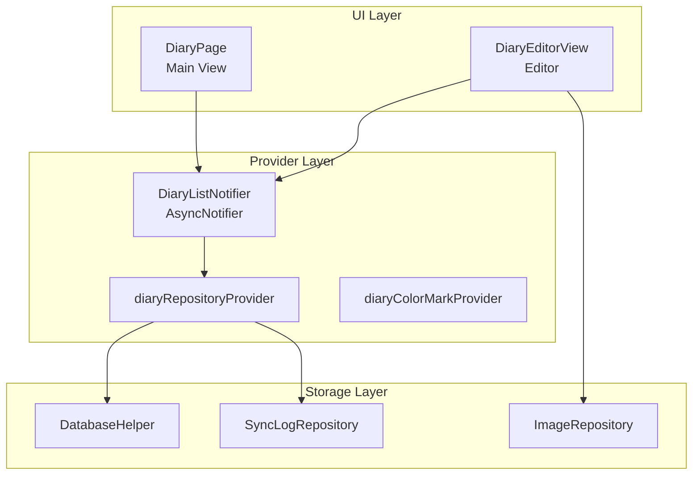
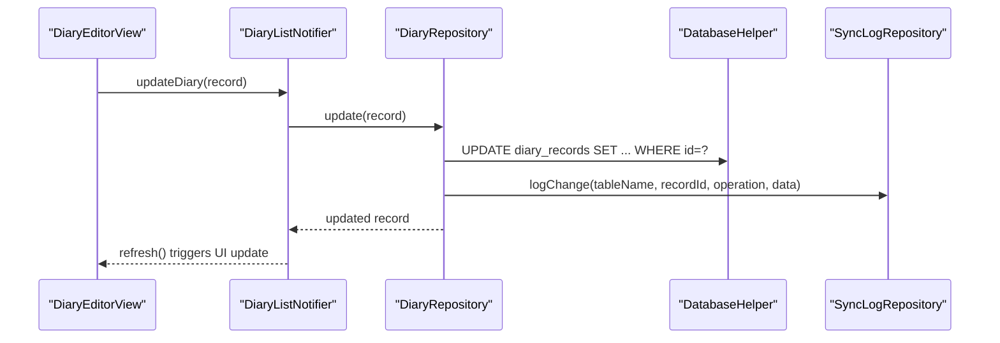
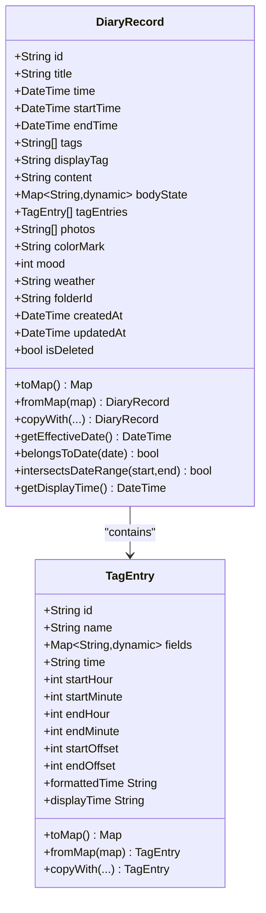
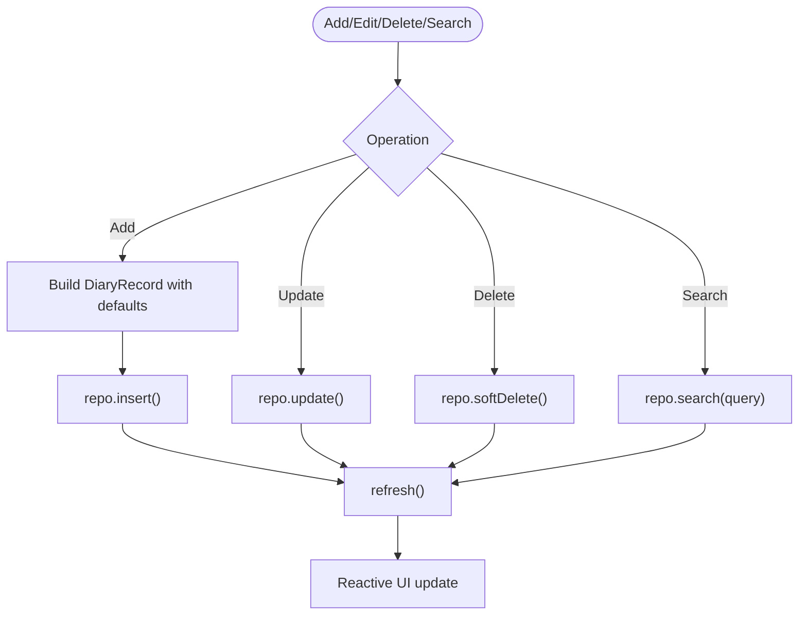
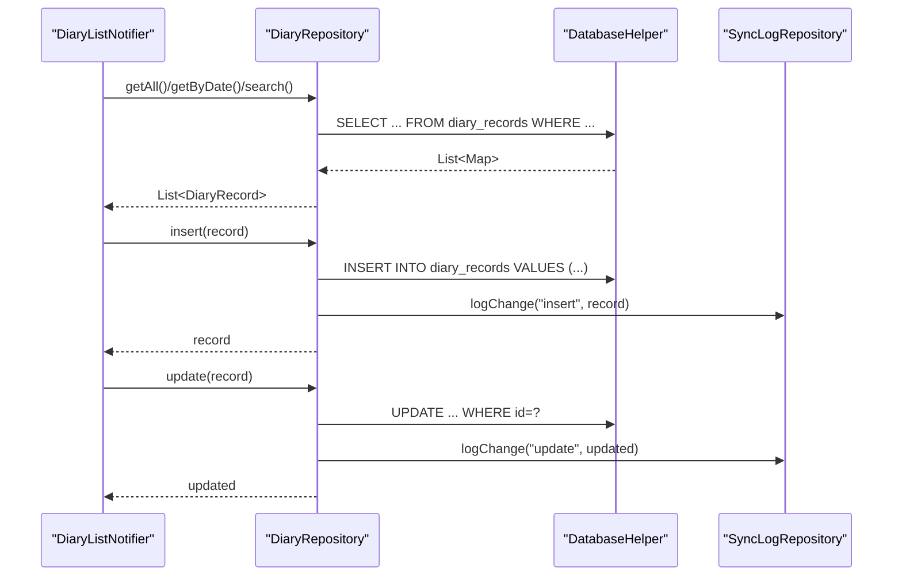
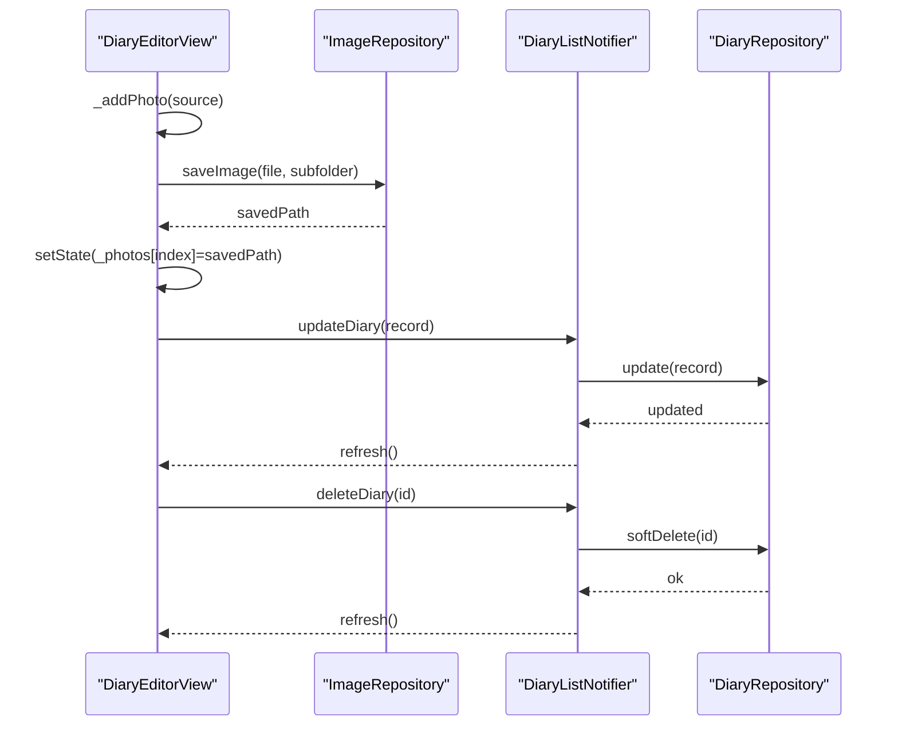
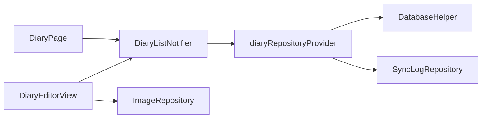

# Diary Management

<cite>
**Referenced Files in This Document**
- [diary_record.dart](file://lib/models/diary_record.dart)
- [tag_entry.dart](file://lib/models/tag_entry.dart)
- [diary_provider.dart](file://lib/providers/diary_provider.dart)
- [diary_repository.dart](file://lib/core/storage/diary_repository.dart)
- [diary_page.dart](file://lib/pages/diary_page.dart)
- [diary_editor_view.dart](file://lib/widgets/diary/diary_editor_view.dart)
- [database_helper.dart](file://lib/core/storage/database_helper.dart)
- [sync_log_repository.dart](file://lib/core/storage/sync_log_repository.dart)
- [image_repository.dart](file://lib/core/storage/image_repository.dart)
</cite>

## Table of Contents
1. [Introduction](#introduction)
2. [Project Structure](#project-structure)
3. [Core Components](#core-components)
4. [Architecture Overview](#architecture-overview)
5. [Detailed Component Analysis](#detailed-component-analysis)
6. [Dependency Analysis](#dependency-analysis)
7. [Performance Considerations](#performance-considerations)
8. [Troubleshooting Guide](#troubleshooting-guide)
9. [Conclusion](#conclusion)

## Introduction
This document explains the Diary Management feature, covering the diary creation workflow, mood tracking, tag-based organization, photo attachments, and search/filter capabilities. It documents the DiaryRecord model, the provider-based state management, the repository for data persistence, and the main UI components for viewing, editing, and organizing diary entries. It also describes integration with image processing for photo attachments and the relationship with cloud synchronization for backup purposes.

## Project Structure
The Diary Management feature is organized around three layers:
- Model layer: Defines the DiaryRecord entity and supporting TagEntry structure.
- Provider layer: Implements state management using Riverpod for reactive UI updates.
- Repository and storage layer: Handles persistence via a local database and sync logging.

**Diagram sources**
- [diary_page.dart](file://lib/pages/diary_page.dart)
- [diary_editor_view.dart](file://lib/widgets/diary/diary_editor_view.dart)
- [diary_provider.dart](file://lib/providers/diary_provider.dart)
- [diary_repository.dart](file://lib/core/storage/diary_repository.dart)
- [database_helper.dart](file://lib/core/storage/database_helper.dart)
- [sync_log_repository.dart](file://lib/core/storage/sync_log_repository.dart)
- [image_repository.dart](file://lib/core/storage/image_repository.dart)

**Section sources**
- [diary_page.dart](file://lib/pages/diary_page.dart)
- [diary_provider.dart](file://lib/providers/diary_provider.dart)
- [diary_repository.dart](file://lib/core/storage/diary_repository.dart)

## Core Components
- DiaryRecord: The primary data model representing a diary entry with content, time window, mood/weather, tags, photos, and timestamps.
- TagEntry: A structured tag entry with optional time fields and associated fields for detailed entries.
- DiaryListNotifier: Riverpod notifier managing CRUD operations, search, and refresh for diary lists.
- DiaryRepository: Encapsulates database queries and writes, including soft-delete and search.
- DiaryPage: Main timeline view with virtualized scrolling and date navigation.
- DiaryEditorView: Editor with tag selection, time pickers, content composition, photo attachment, and AI extraction.

**Section sources**
- [diary_record.dart](file://lib/models/diary_record.dart)
- [tag_entry.dart](file://lib/models/tag_entry.dart)
- [diary_provider.dart](file://lib/providers/diary_provider.dart)
- [diary_repository.dart](file://lib/core/storage/diary_repository.dart)
- [diary_page.dart](file://lib/pages/diary_page.dart)
- [diary_editor_view.dart](file://lib/widgets/diary/diary_editor_view.dart)

## Architecture Overview
The system follows a layered architecture:
- UI components trigger actions via Riverpod providers.
- Providers delegate to repositories for data operations.
- Repositories persist data using a local database and log changes for synchronization.
- Image operations are handled by a dedicated repository for compression and storage.

**Diagram sources**
- [diary_editor_view.dart](file://lib/widgets/diary/diary_editor_view.dart)
- [diary_provider.dart](file://lib/providers/diary_provider.dart)
- [diary_repository.dart](file://lib/core/storage/diary_repository.dart)
- [database_helper.dart](file://lib/core/storage/database_helper.dart)
- [sync_log_repository.dart](file://lib/core/storage/sync_log_repository.dart)

## Detailed Component Analysis

### DiaryRecord Model
The DiaryRecord encapsulates all diary entry data:
- Identity: id, folderId
- Timing: time, startTime, endTime, displayTag
- Content: title, content, bodyState derived from tag entries
- Organization: tags, tagEntries, photos, colorMark
- Metadata: mood, weather, timestamps (createdAt, updatedAt), deletion flag

Key behaviors:
- Serialization to/from database maps with JSON encoding for complex fields.
- Effective date calculation and date-range intersection for timeline rendering.
- Display time determination for sorting and positioning.

**Diagram sources**
- [diary_record.dart](file://lib/models/diary_record.dart)
- [tag_entry.dart](file://lib/models/tag_entry.dart)

**Section sources**
- [diary_record.dart](file://lib/models/diary_record.dart)
- [tag_entry.dart](file://lib/models/tag_entry.dart)

### Provider and State Management
The provider layer manages:
- DiaryListNotifier: builds the list, handles add/update/delete/search, and refreshes state.
- Providers for repository, color marks, selected date, and drafts.
- Undo-delete support with last-deleted snapshot restoration.

**Diagram sources**
- [diary_provider.dart](file://lib/providers/diary_provider.dart)

**Section sources**
- [diary_provider.dart](file://lib/providers/diary_provider.dart)

### Repository and Persistence
The repository:
- Queries by date, date range, folder, and tag.
- Supports soft-delete and hard-delete.
- Logs changes to a sync log for cloud backup and reconciliation.
- Uses DatabaseHelper for database operations.

**Diagram sources**
- [diary_repository.dart](file://lib/core/storage/diary_repository.dart)
- [database_helper.dart](file://lib/core/storage/database_helper.dart)
- [sync_log_repository.dart](file://lib/core/storage/sync_log_repository.dart)

**Section sources**
- [diary_repository.dart](file://lib/core/storage/diary_repository.dart)

### Main Diary Page Interface
The main timeline view:
- Virtualizes a long list with fixed-day layout and dynamic record heights.
- Estimates offsets for smooth programmatic scrolling to current time.
- Manages a sliding window of dates and updates selected date on scroll.
- Integrates with undo animations and batch operations.

**Diagram sources**
- [diary_page.dart](file://lib/pages/diary_page.dart)

**Section sources**
- [diary_page.dart](file://lib/pages/diary_page.dart)

### Editor View Functionality
The editor supports:
- Time selection with start/end time pickers and sleep tag synchronization.
- Tag selection with dynamic fields and shortcut-driven forms.
- Content composition with automatic merging of extracted notes.
- Photo attachment with immediate UI feedback and asynchronous compression.
- AI-powered extraction to populate tags, time, and content.
- Save and delete operations with image cleanup and sync logging.

**Diagram sources**
- [diary_editor_view.dart](file://lib/widgets/diary/diary_editor_view.dart)
- [image_repository.dart](file://lib/core/storage/image_repository.dart)
- [diary_provider.dart](file://lib/providers/diary_provider.dart)
- [diary_repository.dart](file://lib/core/storage/diary_repository.dart)

**Section sources**
- [diary_editor_view.dart](file://lib/widgets/diary/diary_editor_view.dart)

### Search and Filter Capabilities
- Keyword search across title, content, tags, and displayTag.
- Date-based filtering via repository methods.
- Tag-based filtering via SQL LIKE queries.
- Folder-based filtering for organizational boundaries.

**Section sources**
- [diary_repository.dart](file://lib/core/storage/diary_repository.dart)
- [diary_provider.dart](file://lib/providers/diary_provider.dart)

### Mood Tracking System
- DiaryRecord includes an integer mood field with a default value.
- UI components can present mood selection during creation or editing.
- No explicit mood aggregation logic is present in the analyzed files.

**Section sources**
- [diary_record.dart](file://lib/models/diary_record.dart)
- [diary_provider.dart](file://lib/providers/diary_provider.dart)

### Tag-Based Organization
- Tags stored as a list and as structured TagEntry objects with fields.
- TagEntry supports time offsets and formatted time display.
- Shortcut-driven tag configuration enables dynamic form generation.

**Section sources**
- [tag_entry.dart](file://lib/models/tag_entry.dart)
- [diary_editor_view.dart](file://lib/widgets/diary/diary_editor_view.dart)

### Photo Attachment Capabilities
- Supports camera and gallery selection with constrained resolution and quality.
- Immediate UI feedback with temporary paths, followed by asynchronous compression and permanent storage.
- Automatic cleanup of failed uploads and removal of deleted images.
- Integration with ImageRepository for saving and deleting images.

**Section sources**
- [diary_editor_view.dart](file://lib/widgets/diary/diary_editor_view.dart)
- [image_repository.dart](file://lib/core/storage/image_repository.dart)

### Cloud Synchronization Integration
- Changes are logged via SyncLogRepository upon insert/update/delete.
- Log entries include table name, record ID, operation type, and serialized data for reconciliation.
- This enables backup and synchronization with cloud services.

**Section sources**
- [diary_repository.dart](file://lib/core/storage/diary_repository.dart)
- [sync_log_repository.dart](file://lib/core/storage/sync_log_repository.dart)

## Dependency Analysis
The following diagram shows key dependencies among components:

**Diagram sources**
- [diary_page.dart](file://lib/pages/diary_page.dart)
- [diary_editor_view.dart](file://lib/widgets/diary/diary_editor_view.dart)
- [diary_provider.dart](file://lib/providers/diary_provider.dart)
- [diary_repository.dart](file://lib/core/storage/diary_repository.dart)
- [database_helper.dart](file://lib/core/storage/database_helper.dart)
- [sync_log_repository.dart](file://lib/core/storage/sync_log_repository.dart)
- [image_repository.dart](file://lib/core/storage/image_repository.dart)

**Section sources**
- [diary_provider.dart](file://lib/providers/diary_provider.dart)
- [diary_repository.dart](file://lib/core/storage/diary_repository.dart)

## Performance Considerations
- Virtualized scrolling with estimated item heights reduces memory footprint for large timelines.
- Programmatic jumps with fallback animations prevent jank during rapid navigation.
- Asynchronous image compression prevents UI blocking while maintaining responsive previews.
- Database queries filter out deleted records by default and use indexed time fields for ordering.

## Troubleshooting Guide
Common issues and resolutions:
- Images not appearing after capture: Verify compression tasks complete and temporary paths are replaced with saved paths.
- Deleted entries reappear unexpectedly: Confirm soft-delete logic and refresh after delete operations.
- Search returns unexpected results: Ensure query sanitization and LIKE pattern matching align with expected keywords.
- Sync inconsistencies: Check sync log entries for missing insert/update/delete records.

**Section sources**
- [diary_editor_view.dart](file://lib/widgets/diary/diary_editor_view.dart)
- [diary_repository.dart](file://lib/core/storage/diary_repository.dart)

## Conclusion
The Diary Management feature provides a robust, reactive system for creating, editing, organizing, and synchronizing diary entries. The layered architecture ensures clear separation of concerns, while Riverpod and repositories enable scalable state management and persistence. The integration of image processing and AI extraction enhances usability, and the sync logging infrastructure supports reliable cloud backup.