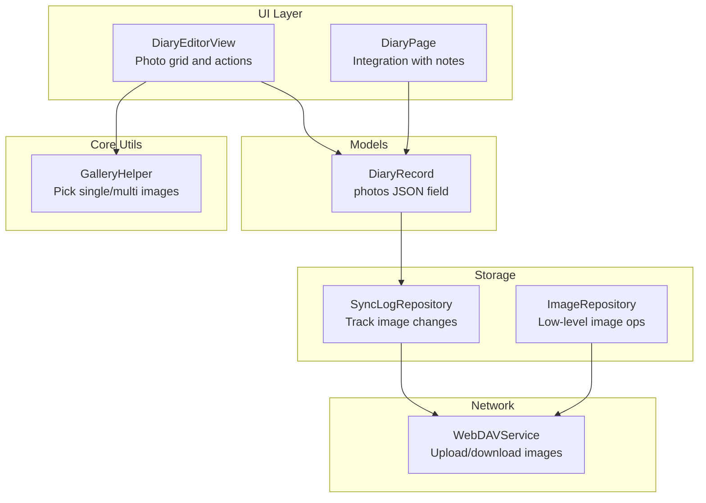
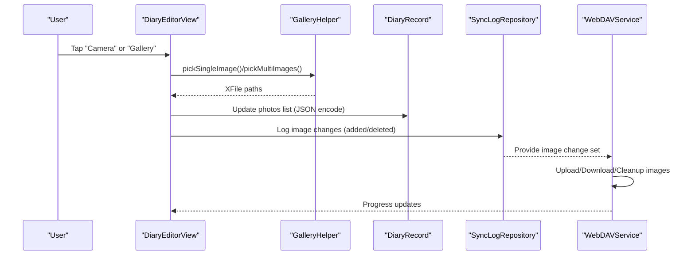
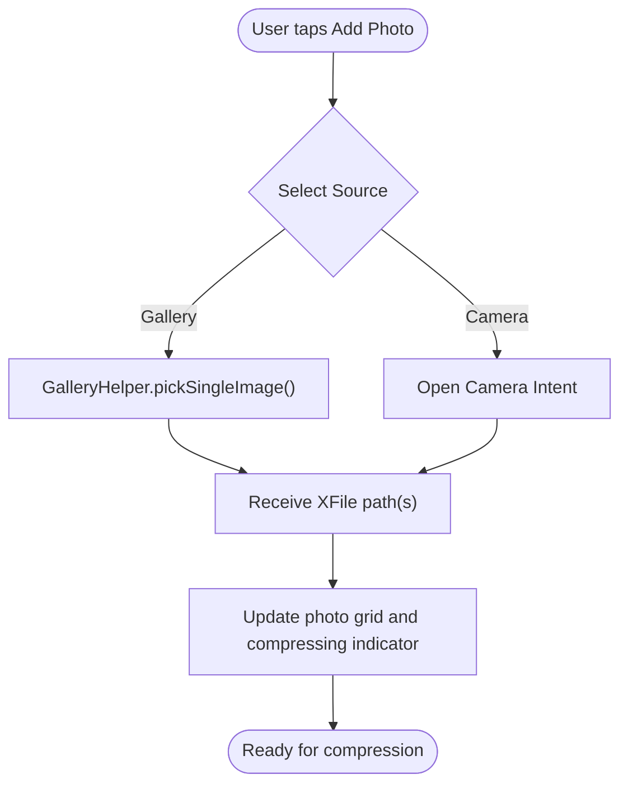
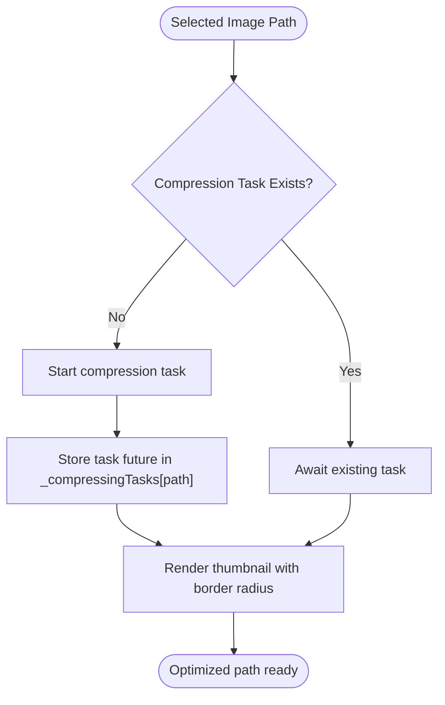
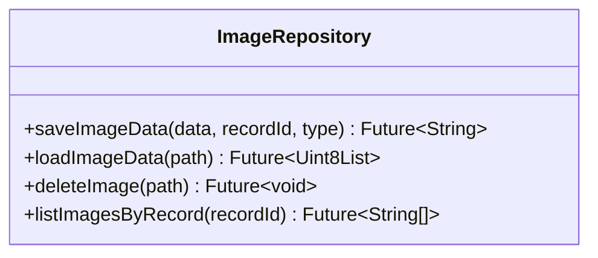
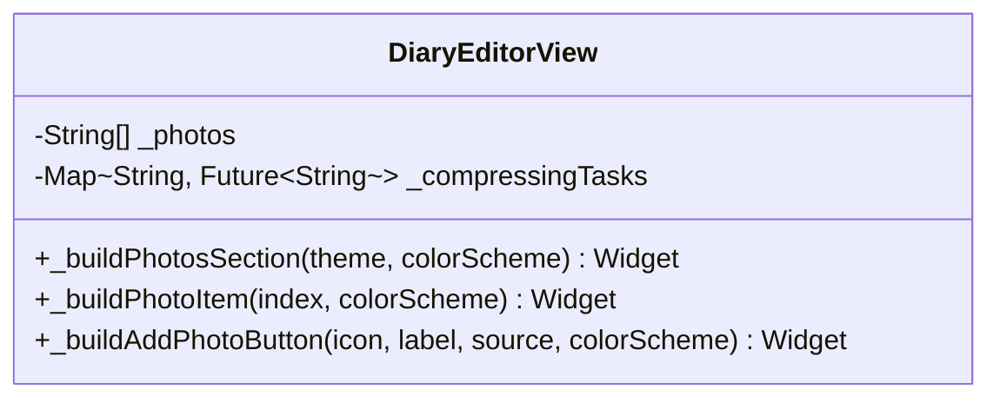
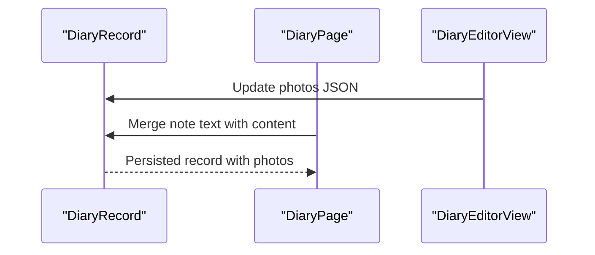
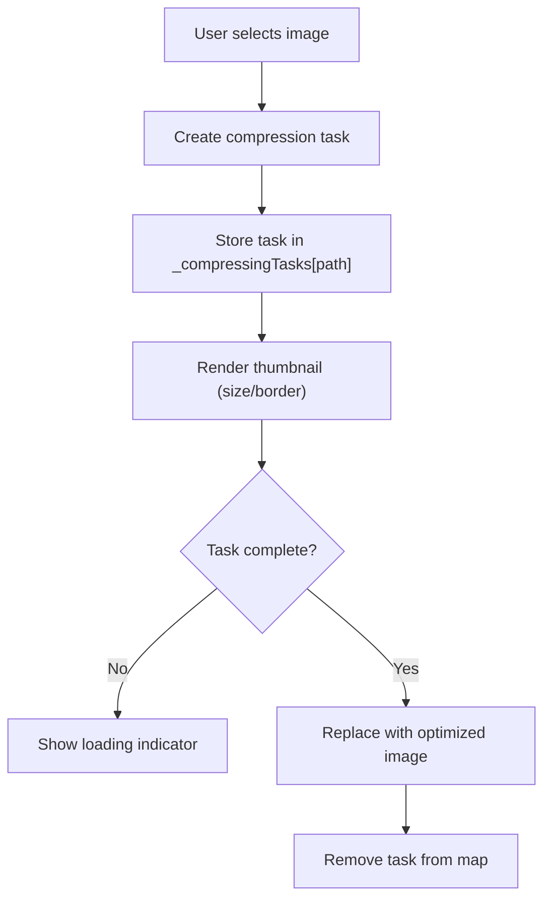
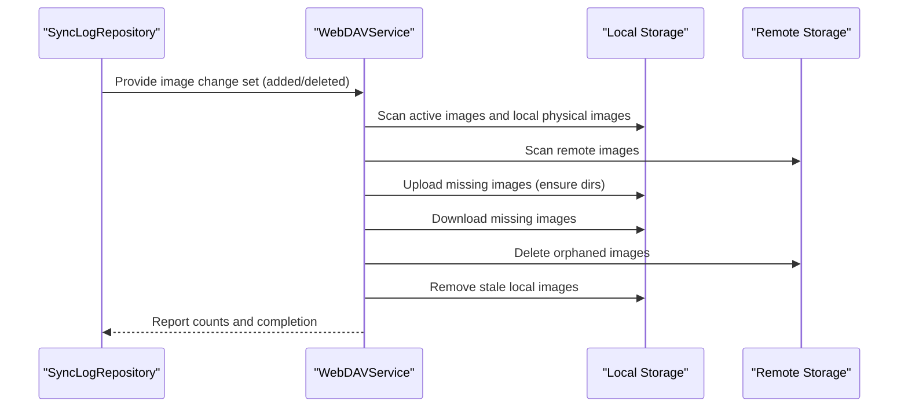
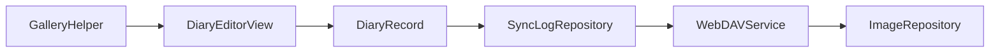

# Image Processing

<cite>
**Referenced Files in This Document**
- [diary_editor_view.dart](file://lib/widgets/diary/diary_editor_view.dart)
- [diary_page.dart](file://lib/pages/diary_page.dart)
- [diary_record.dart](file://lib/models/diary_record.dart)
- [gallery_helper.dart](file://lib/core/utils/gallery_helper.dart)
- [webdav_service.dart](file://lib/core/network/webdav_service.dart)
- [sync_log_repository.dart](file://lib/core/storage/sync_log_repository.dart)
- [image_repository.dart](file://lib/core/storage/image_repository.dart)
</cite>

## Table of Contents
1. [Introduction](#introduction)
2. [Project Structure](#project-structure)
3. [Core Components](#core-components)
4. [Architecture Overview](#architecture-overview)
5. [Detailed Component Analysis](#detailed-component-analysis)
6. [Dependency Analysis](#dependency-analysis)
7. [Performance Considerations](#performance-considerations)
8. [Troubleshooting Guide](#troubleshooting-guide)
9. [Conclusion](#conclusion)

## Introduction
This document explains the Image Processing feature in the application, focusing on:
- Photo capture and selection workflow
- Image compression and storage optimization
- Image repository implementation for managing image data
- Image picker widget for user interaction
- Integration with diary and note creation for attaching photos
- Image processing pipeline including compression algorithms, storage location management, and memory optimization
- Cloud synchronization for backing up images and handling large image files across devices

## Project Structure
The image processing feature spans several modules:
- UI widgets for photo selection and preview within the diary editor
- Utilities for picking images from camera or gallery
- Models for storing photo references in diary records
- Storage repositories for logging and coordinating sync operations
- Network service for uploading/downloading images via WebDAV
- Image repository for low-level image data management

**Diagram sources**
- [diary_editor_view.dart](file://lib/widgets/diary/diary_editor_view.dart)
- [diary_page.dart](file://lib/pages/diary_page.dart)
- [diary_record.dart](file://lib/models/diary_record.dart)
- [gallery_helper.dart](file://lib/core/utils/gallery_helper.dart)
- [sync_log_repository.dart](file://lib/core/storage/sync_log_repository.dart)
- [webdav_service.dart](file://lib/core/network/webdav_service.dart)
- [image_repository.dart](file://lib/core/storage/image_repository.dart)

**Section sources**
- [diary_editor_view.dart](file://lib/widgets/diary/diary_editor_view.dart)
- [gallery_helper.dart](file://lib/core/utils/gallery_helper.dart)
- [diary_record.dart](file://lib/models/diary_record.dart)
- [sync_log_repository.dart](file://lib/core/storage/sync_log_repository.dart)
- [webdav_service.dart](file://lib/core/network/webdav_service.dart)
- [image_repository.dart](file://lib/core/storage/image_repository.dart)

## Core Components
- Photo Picker Widget: Provides buttons to open the gallery or camera and displays thumbnails with optional compression indicators.
- Gallery Helper: Handles cross-platform image selection using platform-specific pickers and falls back gracefully.
- Diary Record Model: Stores photo paths as a JSON-encoded list for persistence.
- Sync Log Repository: Extracts image change deltas from diary and note records for synchronization.
- WebDAV Service: Manages image uploads/downloads and cleanup across devices.
- Image Repository: Low-level image data management interface for storage operations.

**Section sources**
- [diary_editor_view.dart](file://lib/widgets/diary/diary_editor_view.dart)
- [gallery_helper.dart](file://lib/core/utils/gallery_helper.dart)
- [diary_record.dart](file://lib/models/diary_record.dart)
- [sync_log_repository.dart](file://lib/core/storage/sync_log_repository.dart)
- [webdav_service.dart](file://lib/core/network/webdav_service.dart)
- [image_repository.dart](file://lib/core/storage/image_repository.dart)

## Architecture Overview
The image processing pipeline integrates UI, model persistence, storage coordination, and network synchronization.

**Diagram sources**
- [diary_editor_view.dart](file://lib/widgets/diary/diary_editor_view.dart)
- [gallery_helper.dart](file://lib/core/utils/gallery_helper.dart)
- [diary_record.dart](file://lib/models/diary_record.dart)
- [sync_log_repository.dart](file://lib/core/storage/sync_log_repository.dart)
- [webdav_service.dart](file://lib/core/network/webdav_service.dart)

## Detailed Component Analysis

### Photo Capture and Selection Workflow
- The widget presents two action buttons: one for gallery and one for camera. Selecting an option triggers the picker.
- On mobile, the gallery picker uses a native asset picker; on web, it falls back to a standard image picker.
- Selected images are returned as XFile objects and converted to file paths for display and later compression/upload.

**Diagram sources**
- [diary_editor_view.dart](file://lib/widgets/diary/diary_editor_view.dart)
- [gallery_helper.dart](file://lib/core/utils/gallery_helper.dart)

**Section sources**
- [diary_editor_view.dart](file://lib/widgets/diary/diary_editor_view.dart)
- [gallery_helper.dart](file://lib/core/utils/gallery_helper.dart)

### Image Compression and Storage Optimization
- The editor maintains a map of compression tasks keyed by image path to avoid redundant work.
- Thumbnails are rendered via a unified image component sized appropriately for the grid.
- Compression is indicated visually during processing to inform the user.

**Diagram sources**
- [diary_editor_view.dart](file://lib/widgets/diary/diary_editor_view.dart)

**Section sources**
- [diary_editor_view.dart](file://lib/widgets/diary/diary_editor_view.dart)

### Image Repository Implementation
- The image repository provides an abstraction for low-level image data operations. It encapsulates storage paths, metadata, and lifecycle operations for images associated with records.

**Diagram sources**
- [image_repository.dart](file://lib/core/storage/image_repository.dart)

**Section sources**
- [image_repository.dart](file://lib/core/storage/image_repository.dart)

### Image Picker Widget for User Interaction
- The widget renders a horizontal list allowing users to choose between gallery and camera, and displays existing photos as thumbnails.
- Each thumbnail shows a preview and indicates when compression is in progress.

**Diagram sources**
- [diary_editor_view.dart](file://lib/widgets/diary/diary_editor_view.dart)

**Section sources**
- [diary_editor_view.dart](file://lib/widgets/diary/diary_editor_view.dart)

### Integration with Diary and Note Creation
- Diary records persist a JSON-encoded list of photo paths.
- When integrating with notes, the page merges note content with existing diary content while preserving photo attachments.

**Diagram sources**
- [diary_record.dart](file://lib/models/diary_record.dart)
- [diary_page.dart](file://lib/pages/diary_page.dart)
- [diary_editor_view.dart](file://lib/widgets/diary/diary_editor_view.dart)

**Section sources**
- [diary_record.dart](file://lib/models/diary_record.dart)
- [diary_page.dart](file://lib/pages/diary_page.dart)
- [diary_editor_view.dart](file://lib/widgets/diary/diary_editor_view.dart)

### Image Processing Pipeline: Compression, Storage, Memory
- Compression tasks are tracked per path to prevent duplication.
- Thumbnails are rendered with fixed sizes and rounded corners for efficient memory usage.
- The compression state is visually indicated to improve UX.

**Diagram sources**
- [diary_editor_view.dart](file://lib/widgets/diary/diary_editor_view.dart)

**Section sources**
- [diary_editor_view.dart](file://lib/widgets/diary/diary_editor_view.dart)

### Cloud Synchronization and Large Image Handling
- The sync log repository extracts image change sets from diary and note records, generating unique image filenames based on record IDs and hash digests.
- The WebDAV service orchestrates:
  - Uploading images present locally but missing remotely
  - Downloading images referenced in records but missing locally
  - Cleaning up orphaned images both locally and remotely
  - Ensuring remote directories exist before upload

**Diagram sources**
- [sync_log_repository.dart](file://lib/core/storage/sync_log_repository.dart)
- [webdav_service.dart](file://lib/core/network/webdav_service.dart)

**Section sources**
- [sync_log_repository.dart](file://lib/core/storage/sync_log_repository.dart)
- [webdav_service.dart](file://lib/core/network/webdav_service.dart)

## Dependency Analysis
- UI depends on GalleryHelper for picking images.
- DiaryRecord persists photo references; SyncLogRepository consumes these to compute deltas.
- WebDAVService coordinates image synchronization across devices.
- ImageRepository provides foundational storage operations.

**Diagram sources**
- [gallery_helper.dart](file://lib/core/utils/gallery_helper.dart)
- [diary_editor_view.dart](file://lib/widgets/diary/diary_editor_view.dart)
- [diary_record.dart](file://lib/models/diary_record.dart)
- [sync_log_repository.dart](file://lib/core/storage/sync_log_repository.dart)
- [webdav_service.dart](file://lib/core/network/webdav_service.dart)
- [image_repository.dart](file://lib/core/storage/image_repository.dart)

**Section sources**
- [gallery_helper.dart](file://lib/core/utils/gallery_helper.dart)
- [diary_editor_view.dart](file://lib/widgets/diary/diary_editor_view.dart)
- [diary_record.dart](file://lib/models/diary_record.dart)
- [sync_log_repository.dart](file://lib/core/storage/sync_log_repository.dart)
- [webdav_service.dart](file://lib/core/network/webdav_service.dart)
- [image_repository.dart](file://lib/core/storage/image_repository.dart)

## Performance Considerations
- Prefer thumbnail rendering with constrained sizes to reduce memory footprint.
- Debounce or coalesce multiple selection events to minimize redundant compression tasks.
- Use incremental sync deltas to limit network and disk I/O during synchronization.
- Ensure remote directories are created before upload to avoid repeated failures.

## Troubleshooting Guide
- If gallery picker fails on mobile, the fallback to standard image picker ensures continued operation.
- If compression appears stuck, verify the compression task map does not retain stale futures.
- If images do not appear after sync, confirm the active image set and local/remote scans align with expected paths.

**Section sources**
- [gallery_helper.dart](file://lib/core/utils/gallery_helper.dart)
- [diary_editor_view.dart](file://lib/widgets/diary/diary_editor_view.dart)
- [webdav_service.dart](file://lib/core/network/webdav_service.dart)

## Conclusion
The Image Processing feature combines a responsive UI, robust image selection utilities, model persistence, and a reliable synchronization pipeline. By tracking image changes, optimizing storage, and coordinating uploads/downloads, the system supports seamless photo attachment across diary and note workflows while maintaining performance and reliability across devices.