# Note Taking

<cite>
**Referenced Files in This Document**
- [note.dart](file://lib/models/note.dart)
- [folder.dart](file://lib/models/folder.dart)
- [note_provider.dart](file://lib/providers/note_provider.dart)
- [folder_provider.dart](file://lib/providers/folder_provider.dart)
- [note_repository.dart](file://lib/core/storage/note_repository.dart)
- [folder_repository.dart](file://lib/core/storage/folder_repository.dart)
- [notes_page.dart](file://lib/pages/notes_page.dart)
- [note_editor_view.dart](file://lib/widgets/notes/note_editor_view.dart)
- [search_view.dart](file://lib/widgets/search_view.dart)
</cite>

## Update Summary
**Changes Made**
- Enhanced NotesPage with comprehensive batch editing capabilities
- Added selection mode with multi-selection support for notes and folders
- Implemented long-press gesture integration for improved user interaction
- Added confirmation-based batch deletion workflow
- Integrated checkbox-based selection controls in the UI

## Table of Contents
1. [Introduction](#introduction)
2. [Project Structure](#project-structure)
3. [Core Components](#core-components)
4. [Architecture Overview](#architecture-overview)
5. [Detailed Component Analysis](#detailed-component-analysis)
6. [Dependency Analysis](#dependency-analysis)
7. [Performance Considerations](#performance-considerations)
8. [Troubleshooting Guide](#troubleshooting-guide)
9. [Conclusion](#conclusion)

## Introduction
This document explains the Note Taking feature, covering note creation and editing, folder organization, rich text editing, and search integration. It documents the Note and Folder models, state management via Riverpod providers, data persistence through repositories, and the user interface for note listing and folder navigation. It also describes how images are attached, how tags are applied conceptually, and how search spans both notes and diary records.

**Updated** Enhanced with comprehensive batch editing capabilities, selection modes for bulk operations, and improved user interaction flow with long-press gestures and multi-selection support.

## Project Structure
The Note Taking feature is organized into models, providers, repositories, pages, and widgets:

- Models define the data structures for notes and folders.
- Providers manage reactive state for notes and folders.
- Repositories encapsulate data operations against the local database.
- Pages and widgets implement the UI for listing, editing, organizing, and searching notes.

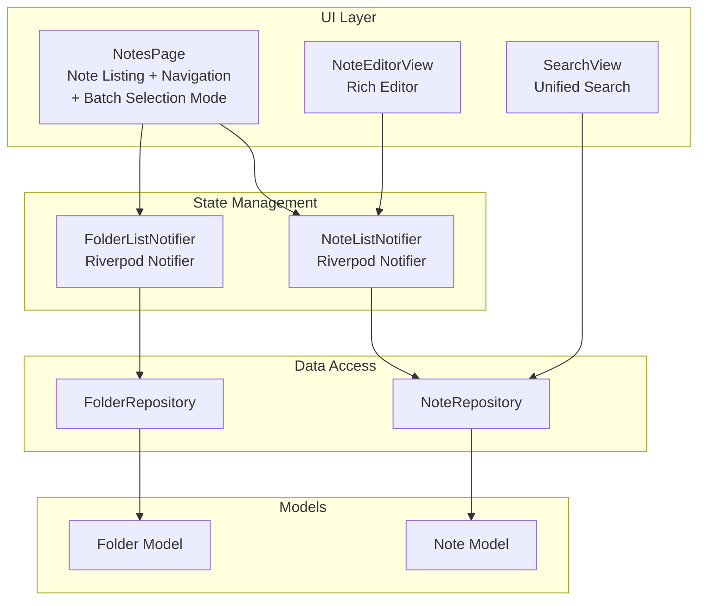

**Diagram sources**
- [notes_page.dart](file://lib/pages/notes_page.dart)
- [note_editor_view.dart](file://lib/widgets/notes/note_editor_view.dart)
- [search_view.dart](file://lib/widgets/search_view.dart)
- [note_provider.dart](file://lib/providers/note_provider.dart)
- [folder_provider.dart](file://lib/providers/folder_provider.dart)
- [note_repository.dart](file://lib/core/storage/note_repository.dart)
- [folder_repository.dart](file://lib/core/storage/folder_repository.dart)
- [note.dart](file://lib/models/note.dart)
- [folder.dart](file://lib/models/folder.dart)

**Section sources**
- [notes_page.dart](file://lib/pages/notes_page.dart)
- [note_provider.dart](file://lib/providers/note_provider.dart)
- [folder_provider.dart](file://lib/providers/folder_provider.dart)
- [note_repository.dart](file://lib/core/storage/note_repository.dart)
- [folder_repository.dart](file://lib/core/storage/folder_repository.dart)
- [note.dart](file://lib/models/note.dart)
- [folder.dart](file://lib/models/folder.dart)

## Core Components
- Note model: Holds note identity, title, content, folder association, tags, pinning, images, ordering, timestamps, and deletion flag. Includes serialization/deserialization and copyWith helpers.
- Folder model: Holds folder identity, name, parent, type, sort order, expansion state, and timestamps.
- Note provider: Reactive notifier for note lists, CRUD operations, search, pin toggling, moving notes to folders, and reordering.
- Folder provider: Reactive notifier for folder lists, CRUD operations, expanding/collapsing, moving folders, and reordering.
- Note repository: Database operations for notes including retrieval, insertion, updates, soft/hard deletes, pin toggling, batch updates, and search.
- Folder repository: Database operations for folders including retrieval, insertion, updates, deletes, sort order updates, and batch updates.
- Notes page: Orchestrates note listing, folder tree rendering, drag-and-drop reorganization, selection mode, batch deletion, and navigation to the editor.
- Note editor: Rich text editor supporting Markdown-like composition, inline styles, block prefixes, links with preview, images from camera/gallery, auto-save, undo/redo, and copy-to-clipboard.
- Search view: Unified search across notes and diary records with debounced queries and highlighted results.

**Updated** Enhanced NotesPage now includes comprehensive batch editing capabilities with selection mode, multi-selection support, and confirmation-based deletion workflow.

**Section sources**
- [note.dart](file://lib/models/note.dart)
- [folder.dart](file://lib/models/folder.dart)
- [note_provider.dart](file://lib/providers/note_provider.dart)
- [folder_provider.dart](file://lib/providers/folder_provider.dart)
- [note_repository.dart](file://lib/core/storage/note_repository.dart)
- [folder_repository.dart](file://lib/core/storage/folder_repository.dart)
- [notes_page.dart](file://lib/pages/notes_page.dart)
- [note_editor_view.dart](file://lib/widgets/notes/note_editor_view.dart)
- [search_view.dart](file://lib/widgets/search_view.dart)

## Architecture Overview
The system follows a layered architecture:
- UI layer (Pages and Widgets) renders views and captures user interactions.
- State management (Providers) exposes reactive state and orchestrates data mutations.
- Data access (Repositories) abstracts database operations and synchronization logging.
- Models define the canonical data structures.

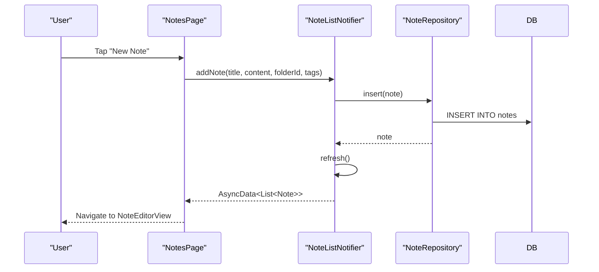

**Diagram sources**
- [notes_page.dart](file://lib/pages/notes_page.dart)
- [note_provider.dart](file://lib/providers/note_provider.dart)
- [note_repository.dart](file://lib/core/storage/note_repository.dart)

## Detailed Component Analysis

### Note Model
The Note model defines the core data structure and persistence contract:
- Identity and metadata: id, timestamps, deletion flag.
- Content and presentation: title, content (supports serialized rich content), images list, tags.
- Organization: folderId, isPinned, sortOrder.
- Serialization: toMap/fromMap for database storage; copyWith for immutable updates.

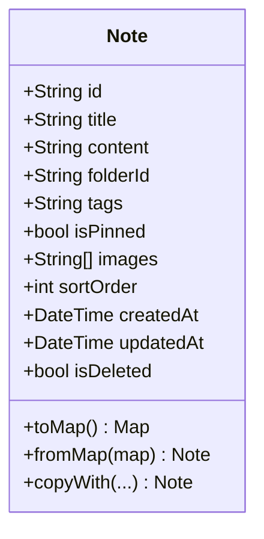

**Diagram sources**
- [note.dart](file://lib/models/note.dart)

**Section sources**
- [note.dart](file://lib/models/note.dart)

### Folder Model
The Folder model supports hierarchical organization:
- Identity and hierarchy: id, name, parentId.
- Type and ordering: type, sortOrder, isExpanded.
- Timestamps: createdAt, updatedAt.
- Serialization: toMap/fromMap and copyWith.

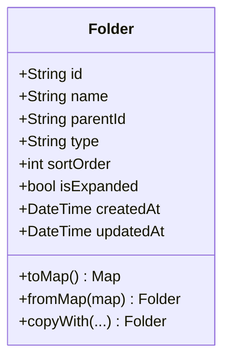

**Diagram sources**
- [folder.dart](file://lib/models/folder.dart)

**Section sources**
- [folder.dart](file://lib/models/folder.dart)

### Note Provider (State Management)
The NoteListNotifier manages reactive note state:
- Builds the initial list by fetching from NoteRepository.
- Provides addNote, updateNote, deleteNote (soft delete), togglePin, search, moveNoteToFolder, and reorderNotes.
- Refreshes state after mutations and batches updates for performance.

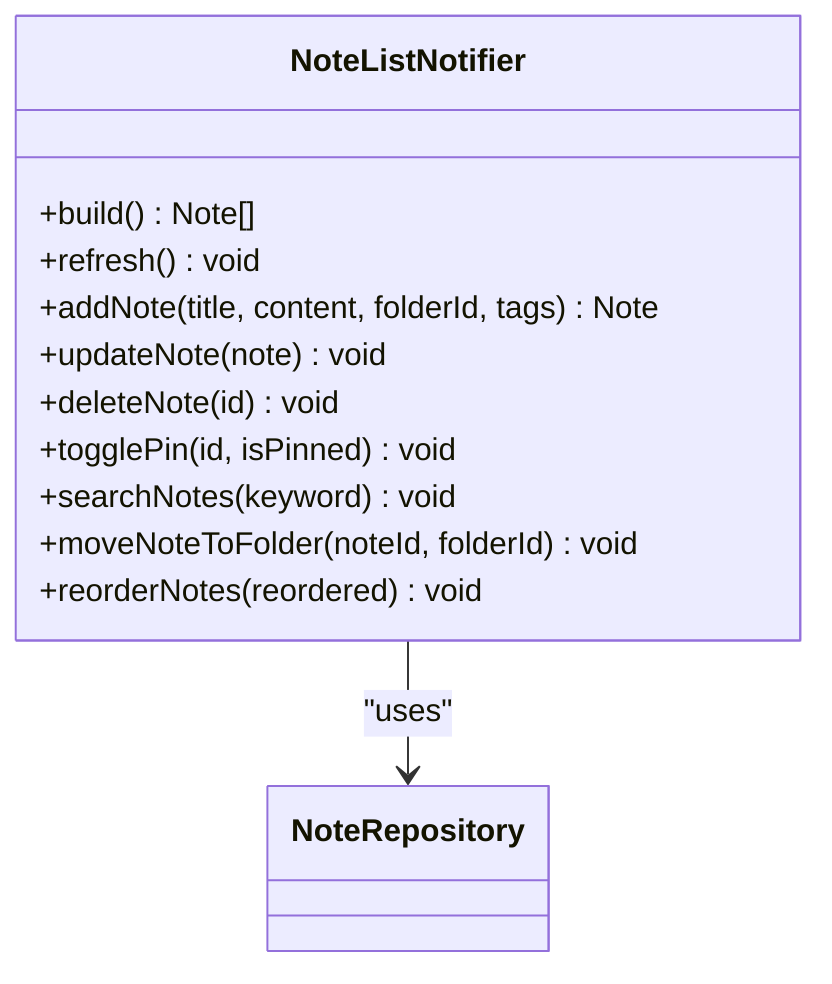

**Diagram sources**
- [note_provider.dart](file://lib/providers/note_provider.dart)
- [note_repository.dart](file://lib/core/storage/note_repository.dart)

**Section sources**
- [note_provider.dart](file://lib/providers/note_provider.dart)

### Folder Provider (State Management)
The FolderListNotifier manages reactive folder state:
- Builds the initial list filtered by type "note".
- Provides addFolder, updateFolder, deleteFolder, toggleExpanded, moveFolderToParent, and reorderFolders.
- Refreshes state after mutations and batches updates.

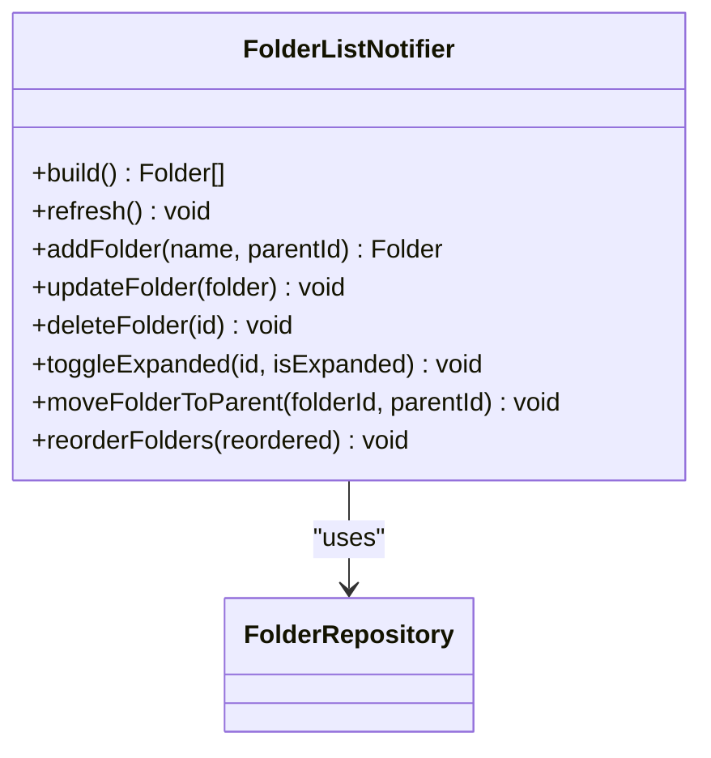

**Diagram sources**
- [folder_provider.dart](file://lib/providers/folder_provider.dart)
- [folder_repository.dart](file://lib/core/storage/folder_repository.dart)

**Section sources**
- [folder_provider.dart](file://lib/providers/folder_provider.dart)

### Note Repository (Data Operations)
The NoteRepository encapsulates database operations:
- Retrieval: getAll, getByFolder, getById.
- Persistence: insert, update, softDelete, hardDelete.
- Pinning and sorting: togglePin, batchUpdate.
- Search: search across title, content, and tags.

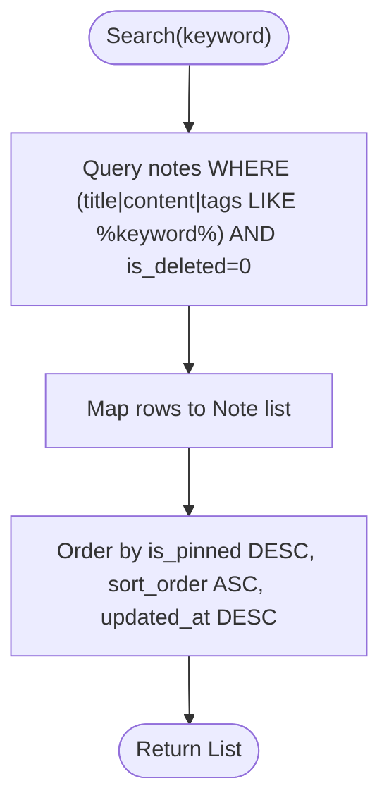

**Diagram sources**
- [note_repository.dart](file://lib/core/storage/note_repository.dart)

**Section sources**
- [note_repository.dart](file://lib/core/storage/note_repository.dart)

### Folder Repository (Data Operations)
The FolderRepository encapsulates folder database operations:
- Retrieval: getAll, getByType, getSubFolders, getById.
- Persistence: insert, update, delete.
- Ordering: updateSortOrder, batchUpdate.

**Section sources**
- [folder_repository.dart](file://lib/core/storage/folder_repository.dart)

### Notes Page (Enhanced Interface and Navigation)
The NotesPage provides comprehensive note management with enhanced batch editing capabilities:

#### Selection Mode and Multi-Selection
- **Selection State Management**: Tracks selected note IDs and folder IDs separately using Set collections.
- **Selection Toggle**: Individual items can be selected/unselected via checkbox controls or tap gestures.
- **Bulk Selection**: Full selection mode allows selecting all notes and folders with a single action.
- **Visual Feedback**: Selection mode displays a bottom navigation bar with selected count and batch delete button.

#### Batch Editing and Deletion Workflow
- **Confirmation System**: Batch deletion uses a 3-second confirmation timer to prevent accidental deletions.
- **Recursive Folder Deletion**: When deleting folders, all child folders and notes are recursively removed.
- **Batch Operations**: Supports simultaneous deletion of multiple notes and folders in a single operation.

#### Enhanced User Interaction
- **Long-Press Gestures**: Implements LongPressDraggable for improved drag-and-drop experience during selection mode.
- **Visual Indicators**: Hover states show before/after/inside drop positions with visual cues.
- **Selection Controls**: Checkbox-based selection with visual feedback for selected items.

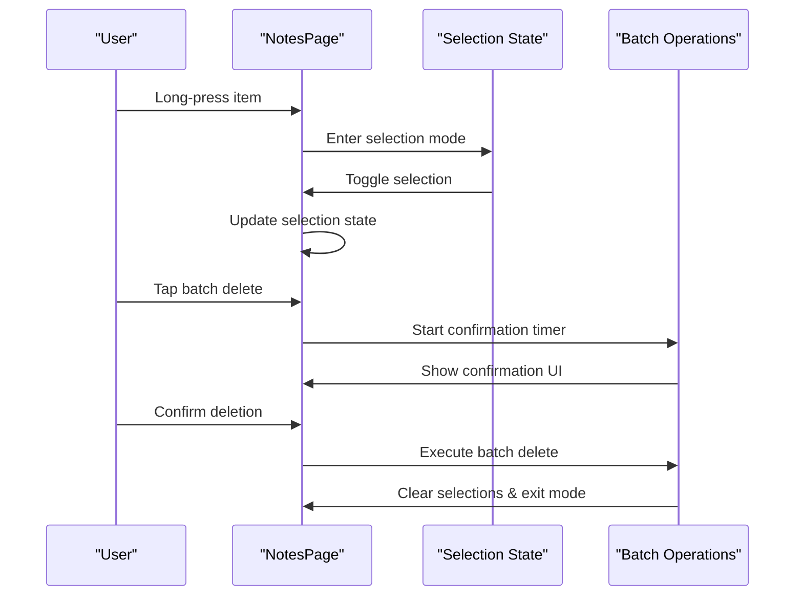

**Diagram sources**
- [notes_page.dart](file://lib/pages/notes_page.dart)

**Section sources**
- [notes_page.dart](file://lib/pages/notes_page.dart)

### Note Editor (Rich Text Editing)
The NoteEditorView implements:
- Segmented editing: text, images, links.
- Parsing and serialization to Markdown-compatible content.
- Inline and block formatting commands.
- Link previews with metadata fetching and editing/removal.
- Image insertion from camera/gallery with upload and cleanup.
- Auto-save, undo/redo history with snapshotting.
- Copy Markdown to clipboard.

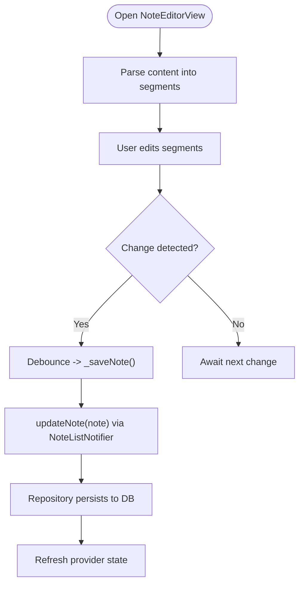

**Diagram sources**
- [note_editor_view.dart](file://lib/widgets/notes/note_editor_view.dart)
- [note_provider.dart](file://lib/providers/note_provider.dart)
- [note_repository.dart](file://lib/core/storage/note_repository.dart)

**Section sources**
- [note_editor_view.dart](file://lib/widgets/notes/note_editor_view.dart)

### Search Integration
The SearchView enables unified search across notes and diary records:
- Debounced input triggers search in NoteRepository and DiaryRepository.
- Results are highlighted and presented in grouped sections.
- Selection navigates back to the caller.

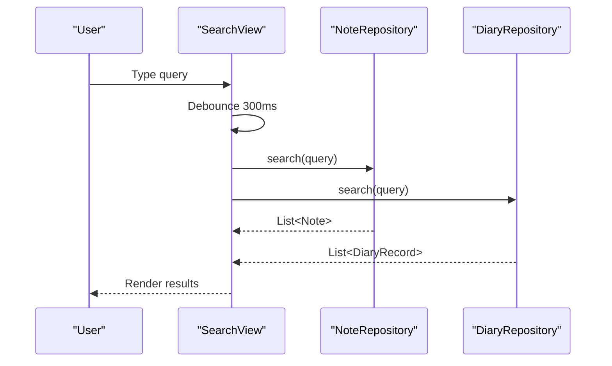

**Diagram sources**
- [search_view.dart](file://lib/widgets/search_view.dart)
- [note_repository.dart](file://lib/core/storage/note_repository.dart)

**Section sources**
- [search_view.dart](file://lib/widgets/search_view.dart)

## Dependency Analysis
The providers depend on repositories, which depend on the database helper and synchronization log. The UI depends on providers for reactive state.

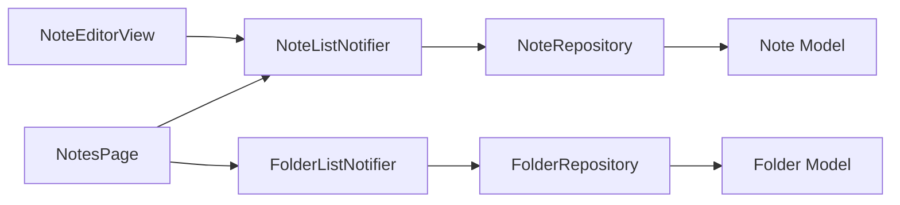

**Diagram sources**
- [note_provider.dart](file://lib/providers/note_provider.dart)
- [folder_provider.dart](file://lib/providers/folder_provider.dart)
- [note_repository.dart](file://lib/core/storage/note_repository.dart)
- [folder_repository.dart](file://lib/core/storage/folder_repository.dart)
- [note.dart](file://lib/models/note.dart)
- [folder.dart](file://lib/models/folder.dart)

**Section sources**
- [note_provider.dart](file://lib/providers/note_provider.dart)
- [folder_provider.dart](file://lib/providers/folder_provider.dart)
- [note_repository.dart](file://lib/core/storage/note_repository.dart)
- [folder_repository.dart](file://lib/core/storage/folder_repository.dart)

## Performance Considerations
- Batch updates: Both repositories support batch operations to minimize database round-trips during reordering.
- Debounced auto-save: Reduces frequent writes while preserving responsiveness.
- Debounced search: Prevents excessive queries during typing.
- Sorting and ordering: Database-level ordering ensures efficient rendering and drag-and-drop updates.
- Image handling: On web, base64 is used; on native, files are persisted and cleaned up on discard.
- **Selection State Optimization**: Uses Set collections for efficient selection tracking and reduces memory overhead during multi-selection operations.

## Troubleshooting Guide
- Notes not appearing after creation: Ensure refresh is called after insert/update and that the provider state is AsyncData.
- Drag-and-drop fails silently: Verify drop position validation and ancestor checks to prevent illegal moves.
- Images not saved: Confirm image upload path is recorded and that cleanup on discard removes only newly uploaded images.
- Search returns empty: Check debounce timing and ensure repository search filters out deleted notes.
- Pinning not reflected: Confirm togglePin updates both DB and provider state, and UI sorts by is_pinned first.
- **Batch deletion not working**: Verify selection state is properly tracked and confirmation timer is functioning correctly.
- **Selection mode issues**: Check that selection state clears properly after batch operations and that visual indicators update correctly.

**Section sources**
- [note_provider.dart](file://lib/providers/note_provider.dart)
- [note_repository.dart](file://lib/core/storage/note_repository.dart)
- [notes_page.dart](file://lib/pages/notes_page.dart)
- [note_editor_view.dart](file://lib/widgets/notes/note_editor_view.dart)
- [search_view.dart](file://lib/widgets/search_view.dart)

## Conclusion
The Note Taking feature combines a robust model layer, reactive state management, and efficient data access to deliver a seamless note-taking experience. Users can create, edit, organize, and search notes with rich content, including images and links. The folder system supports hierarchical organization with intuitive drag-and-drop reordering. 

**Updated** The enhanced NotesPage now provides comprehensive batch editing capabilities with selection modes, multi-selection support, and improved user interaction flow through long-press gestures. The confirmation-based deletion workflow prevents accidental data loss while maintaining efficient bulk operations. The architecture cleanly separates concerns and provides extensibility for future enhancements such as export functionality and advanced tagging.