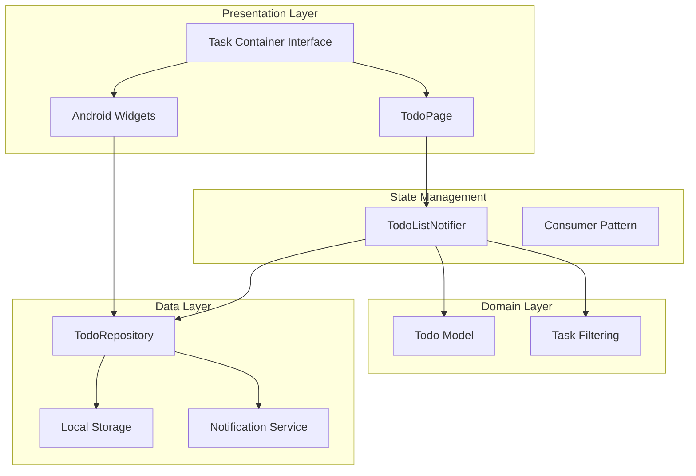
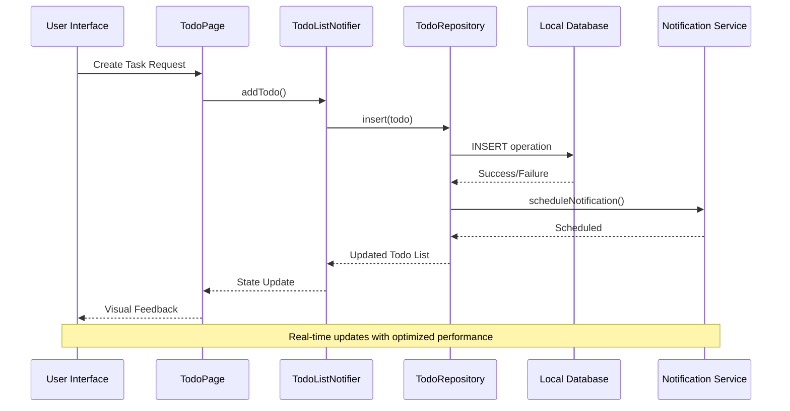
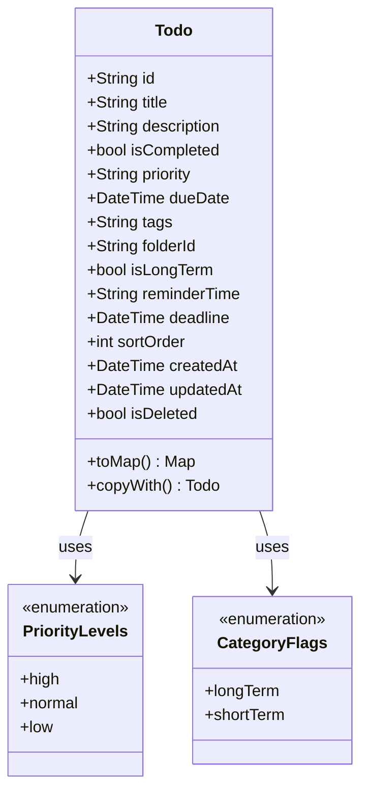
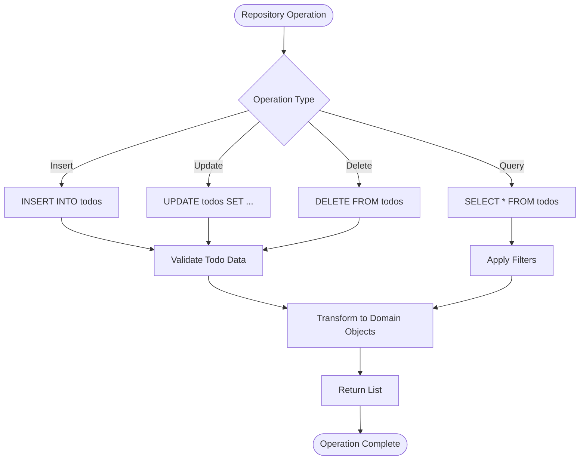
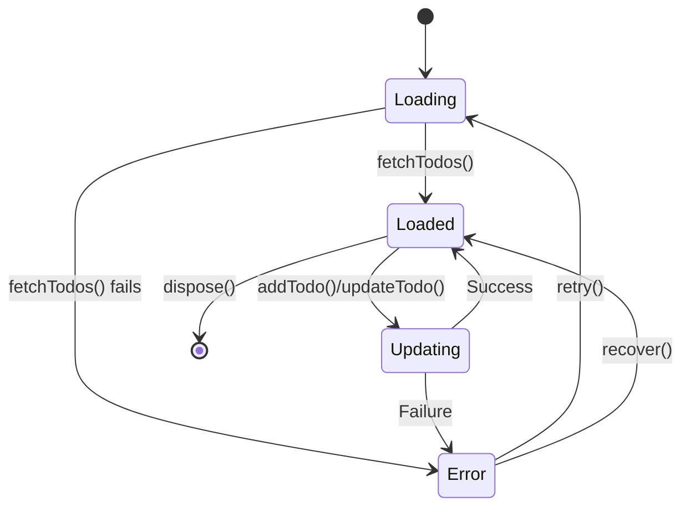
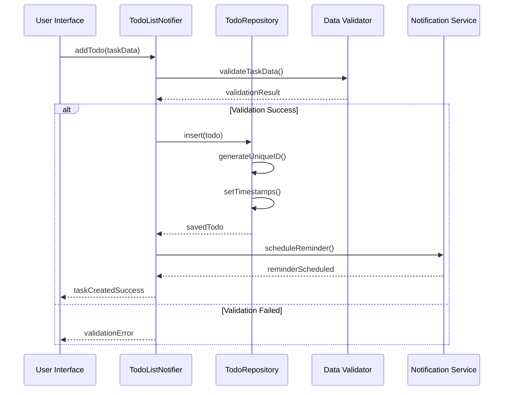
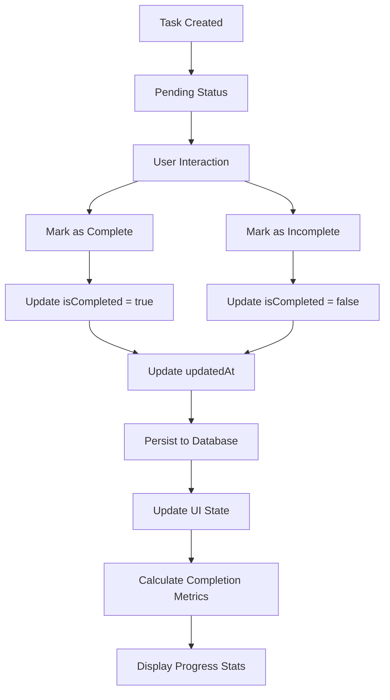

# Todo Management

<cite>
**Referenced Files in This Document**
- [todo.dart](file://lib/models/todo.dart)
- [todo_repository.dart](file://lib/core/storage/todo_repository.dart)
- [todo_provider.dart](file://lib/providers/todo_provider.dart)
- [todo_page.dart](file://lib/pages/todo_page.dart)
- [TodoWidgetProvider.kt](file://android/app/src/main/kotlin/com/appone/qnote_flutter/TodoWidgetProvider.kt)
- [todo_item_widget.xml](file://android/app/src/main/res/layout/todo_item_widget.xml)
- [widget_todo.xml](file://android/app/src/main/res/layout/widget_todo.xml)
- [widget_todo_info.xml](file://android/app/src/main/res/xml/widget_todo_info.xml)
- [app_durations.dart](file://lib/core/theme/app_durations.dart)
- [action_menu.dart](file://lib/widgets/action_menu.dart)
</cite>

## Update Summary
**Changes Made**
- Updated Todo Page Interface section to reflect simplified container-based design
- Revised Task Creation Workflow to remove complex animation dependencies
- Updated Todo Model Structure to reflect streamlined task properties
- Modified Todo Provider Implementation to focus on core state management
- Enhanced Performance Optimization guidance for simplified architecture

## Table of Contents
1. [Introduction](#introduction)
2. [Project Structure](#project-structure)
3. [Core Components](#core-components)
4. [Architecture Overview](#architecture-overview)
5. [Detailed Component Analysis](#detailed-component-analysis)
6. [Task Creation Workflow](#task-creation-workflow)
7. [Completion Tracking](#completion-tracking)
8. [Task Categorization](#task-categorization)
9. [Todo Model Structure](#todo-model-structure)
10. [Todo Provider Implementation](#todo-provider-implementation)
11. [Todo Repository](#todo-repository)
12. [Todo Page Interface](#todo-page-interface)
13. [Filtering and Progress Tracking](#filtering-and-progress-tracking)
14. [Notification Integration](#notification-integration)
15. [Cloud Synchronization](#cloud-synchronization)
16. [Android Widget Integration](#android-widget-integration)
17. [Performance Optimization](#performance-optimization)
18. [Troubleshooting Guide](#troubleshooting-guide)
19. [Conclusion](#conclusion)

## Introduction
The Todo Management feature provides a streamlined task management system optimized for performance and simplicity. The system focuses on essential task management capabilities including long-term and short-term task categorization, priority levels, due dates, completion tracking, and organizational features. Recent improvements have simplified the user interface by removing complex animations and sliding actions, resulting in a more responsive and efficient experience while maintaining full functionality.

## Project Structure
The Todo Management system follows a clean architecture pattern with clear separation of concerns across multiple layers, now optimized for performance:

**Diagram sources**
- [todo_page.dart:14](file://lib/pages/todo_page.dart#L14)
- [todo_provider.dart:36](file://lib/providers/todo_provider.dart#L36)
- [todo_repository.dart:4](file://lib/core/storage/todo_repository.dart#L4)
- [todo.dart:1](file://lib/models/todo.dart#L1)

**Section sources**
- [todo_page.dart:14](file://lib/pages/todo_page.dart#L14)
- [todo_provider.dart:36](file://lib/providers/todo_provider.dart#L36)
- [todo_repository.dart:4](file://lib/core/storage/todo_repository.dart#L4)
- [todo.dart:1](file://lib/models/todo.dart#L1)

## Core Components
The Todo Management system consists of four primary components working together with enhanced performance focus:

### Todo Model
Defines the streamlined task structure with essential properties for task management, including completion status, priority levels, due dates, and categorization flags optimized for performance.

### Todo Repository
Handles data persistence operations with efficient CRUD operations, filtering, and synchronization with external services using optimized query patterns.

### Todo List Notifier
Manages application state using Flutter's Riverpod framework with simplified state management focused on core functionality and performance.

### Todo Page
Implements the simplified user interface with task listing, filtering, and essential interactive controls for task management without complex animations.

**Section sources**
- [todo.dart:1-117](file://lib/models/todo.dart#L1-L117)
- [todo_repository.dart:4-200](file://lib/core/storage/todo_repository.dart#L4-L200)
- [todo_provider.dart:36-150](file://lib/providers/todo_provider.dart#L36-L150)
- [todo_page.dart:14-300](file://lib/pages/todo_page.dart#L14-L300)

## Architecture Overview
The system implements a layered architecture with clear separation between presentation, state management, domain, and data persistence layers, optimized for performance:

**Diagram sources**
- [todo_page.dart:14-300](file://lib/pages/todo_page.dart#L14-L300)
- [todo_provider.dart:36-150](file://lib/providers/todo_provider.dart#L36-L150)
- [todo_repository.dart:4-200](file://lib/core/storage/todo_repository.dart#L4-L200)

## Detailed Component Analysis

### Todo Model Analysis
The Todo model serves as the core data structure defining essential task properties with performance optimization in mind:

**Diagram sources**
- [todo.dart:1-117](file://lib/models/todo.dart#L1-L117)

**Section sources**
- [todo.dart:1-117](file://lib/models/todo.dart#L1-L117)

### Todo Repository Implementation
The repository handles all data persistence operations with comprehensive CRUD functionality optimized for performance:

**Diagram sources**
- [todo_repository.dart:4-200](file://lib/core/storage/todo_repository.dart#L4-L200)

**Section sources**
- [todo_repository.dart:4-200](file://lib/core/storage/todo_repository.dart#L4-L200)

### Todo Provider State Management
The provider implements reactive state management using Riverpod's AsyncNotifier pattern with simplified state handling:

**Diagram sources**
- [todo_provider.dart:36-150](file://lib/providers/todo_provider.dart#L36-L150)

**Section sources**
- [todo_provider.dart:36-150](file://lib/providers/todo_provider.dart#L36-L150)

## Task Creation Workflow
The task creation process involves streamlined steps ensuring data integrity and optimal state management:

**Diagram sources**
- [todo_provider.dart:36-150](file://lib/providers/todo_provider.dart#L36-L150)
- [todo_repository.dart:4-200](file://lib/core/storage/todo_repository.dart#L4-L200)

**Section sources**
- [todo_provider.dart:36-150](file://lib/providers/todo_provider.dart#L36-L150)
- [todo_repository.dart:4-200](file://lib/core/storage/todo_repository.dart#L4-L200)

## Completion Tracking
The system provides streamlined completion tracking with essential visual indicators and progress metrics:

**Diagram sources**
- [todo.dart:1-117](file://lib/models/todo.dart#L1-L117)
- [todo_provider.dart:36-150](file://lib/providers/todo_provider.dart#L36-L150)

**Section sources**
- [todo.dart:1-117](file://lib/models/todo.dart#L1-L117)
- [todo_provider.dart:36-150](file://lib/providers/todo_provider.dart#L36-L150)

## Task Categorization
The system supports flexible categorization between long-term and short-term tasks with priority levels:

| Category | Duration | Priority Focus | Typical Examples |
|----------|----------|----------------|------------------|
| Long-term | > 30 days | Strategic | Career goals, learning objectives, major projects |
| Short-term | <= 30 days | Tactical | Daily tasks, weekly goals, immediate deadlines |

Priority Levels:
- High: Critical tasks requiring immediate attention
- Normal: Standard priority tasks
- Low: Low-priority or maintenance tasks

**Section sources**
- [todo.dart:1-117](file://lib/models/todo.dart#L1-L117)

## Todo Model Structure
The Todo model defines essential task properties with detailed specifications optimized for performance:

### Core Properties
- **id**: Unique identifier for each task
- **title**: Task name or subject
- **description**: Detailed task description
- **isCompleted**: Boolean completion status
- **priority**: Task priority level (high/normal/low)
- **dueDate**: Task deadline date and time
- **tags**: Comma-separated tag identifiers
- **folderId**: Organizational folder association

### Advanced Properties
- **isLongTerm**: Category flag for long-term vs short-term tasks
- **reminderTime**: Scheduled notification time
- **deadline**: Hard deadline constraint
- **sortOrder**: Custom sorting preference
- **createdAt/updatedAt**: Timestamp tracking
- **isDeleted**: Soft deletion support

### Data Transformation
The model provides conversion methods for database storage and API communication:
- `toMap()`: Converts to database-ready map format
- `copyWith()`: Creates modified copies with selective property updates

**Section sources**
- [todo.dart:1-117](file://lib/models/todo.dart#L1-L117)

## Todo Provider Implementation
The TodoListNotifier extends AsyncNotifier to manage asynchronous state loading and updates with streamlined functionality:

### Key Features
- **Async Loading**: Handles initial data loading with proper error states
- **Reactive Updates**: Automatic UI updates when task lists change
- **Error Handling**: Comprehensive error management and recovery
- **State Management**: Maintains current filter state and selection
- **Performance Focus**: Optimized for minimal computational overhead

### Provider Methods
- `loadTodos()`: Loads all tasks from repository
- `addTodo()`: Creates new tasks with validation
- `updateTodo()`: Modifies existing tasks
- `deleteTodo()`: Removes tasks with soft delete support
- `toggleCompletion()`: Switches completion status

**Section sources**
- [todo_provider.dart:36-150](file://lib/providers/todo_provider.dart#L36-L150)

## Todo Repository
The TodoRepository implements data persistence with comprehensive CRUD operations optimized for performance:

### Repository Operations
- **Insert**: Creates new tasks with unique ID generation
- **Update**: Modifies existing tasks with timestamp updates
- **Delete**: Supports soft deletion with isDeleted flag
- **Query**: Retrieves tasks with various filter criteria
- **Search**: Implements text-based search functionality

### Data Access Patterns
- **Filtering**: Supports category, priority, completion status filters
- **Sorting**: Implements multi-column sorting with sort order
- **Pagination**: Handles large datasets with efficient queries
- **Caching**: Optimizes frequent access patterns

**Section sources**
- [todo_repository.dart:4-200](file://lib/core/storage/todo_repository.dart#L4-L200)

## Todo Page Interface
The TodoPage provides a simplified user interface with essential task management capabilities:

### Simplified Interface Components
- **Task List**: Streamlined list displaying all tasks with basic container styling
- **Filter Controls**: Essential category, priority, and completion status filters
- **Add Task Button**: Floating action button for new tasks
- **Search Bar**: Text-based task search functionality
- **Progress Indicators**: Basic completion metrics and statistics

### Streamlined Interactive Features
- **Task Selection**: Simple tap interaction for viewing details
- **Basic Operations**: Essential completion toggling and editing
- **Real-time Updates**: Immediate UI feedback for all changes
- **Offline Support**: Works without network connectivity
- **Performance Focus**: Optimized rendering and interaction patterns

**Section sources**
- [todo_page.dart:14-300](file://lib/pages/todo_page.dart#L14-L300)

## Filtering and Progress Tracking
The system provides essential filtering and progress tracking capabilities optimized for performance:

### Filtering Options
- **Category Filter**: Separate long-term and short-term tasks
- **Priority Filter**: High, normal, and low priority tasks
- **Status Filter**: Completed, pending, overdue tasks
- **Date Range Filter**: Tasks due within specific date ranges
- **Tag Filter**: Tasks associated with specific tags

### Progress Tracking
- **Completion Percentage**: Overall task completion rate
- **Category Statistics**: Completion rates per task category
- **Priority Metrics**: Distribution across priority levels
- **Timeline Analysis**: Completion trends over time periods

**Section sources**
- [todo_page.dart:14-300](file://lib/pages/todo_page.dart#L14-L300)

## Notification Integration
The system integrates with notification services for task reminders and alerts:

### Notification Types
- **Due Date Reminders**: Pre-reminder notifications before deadlines
- **Overdue Alerts**: Notifications for missed deadlines
- **Completion Acknowledgments**: Confirmation for task completion
- **Schedule Changes**: Alerts for task modification notifications

### Notification Configuration
- **Reminder Timing**: Configurable pre-notification intervals
- **Repeat Settings**: Recurring reminders for recurring tasks
- **Channel Management**: Organized notification channels
- **Do Not Disturb**: Integration with system quiet hours

**Section sources**
- [todo_repository.dart:4-200](file://lib/core/storage/todo_repository.dart#L4-L200)

## Cloud Synchronization
The Todo Management system supports cross-device synchronization through cloud services:

### Sync Capabilities
- **Automatic Sync**: Background synchronization of task changes
- **Conflict Resolution**: Intelligent handling of concurrent modifications
- **Offline Mode**: Full functionality without network connectivity
- **Sync Status**: Visual indicators for sync progress and errors

### Data Consistency
- **Version Control**: Track task modification history
- **Delta Sync**: Efficient incremental synchronization
- **Backup Support**: Automatic backup of task data
- **Restore Functionality**: Easy recovery from data loss

**Section sources**
- [todo_repository.dart:4-200](file://lib/core/storage/todo_repository.dart#L4-L200)

## Android Widget Integration
The system includes Android widgets for quick task access and management:

### Widget Components
- **Todo List Widget**: Displays upcoming tasks on home screen
- **Quick Add Widget**: Fast task creation interface
- **Progress Widget**: Shows completion statistics
- **Filter Widget**: Quick access to filtered task views

### Widget Features
- **Live Updates**: Real-time task list updates
- **Direct Actions**: One-tap completion and modification
- **Customization**: Configurable widget appearance and behavior
- **Battery Optimization**: Efficient background updates

**Section sources**
- [TodoWidgetProvider.kt:343-379](file://android/app/src/main/kotlin/com/appone/qnote_flutter/TodoWidgetProvider.kt#L343-L379)
- [todo_item_widget.xml](file://android/app/src/main/res/layout/todo_item_widget.xml)
- [widget_todo.xml](file://android/app/src/main/res/layout/widget_todo.xml)
- [widget_todo_info.xml](file://android/app/src/main/res/xml/widget_todo_info.xml)

## Performance Optimization
The simplified Todo Management system includes several performance optimizations:

### Rendering Optimizations
- **Reduced Animations**: Eliminated complex entry/exit animations for faster rendering
- **Simplified Containers**: Streamlined UI containers with minimal styling overhead
- **Efficient Lists**: Optimized list rendering with basic container interfaces
- **Lazy Loading**: Implemented selective loading for better memory usage

### State Management Performance
- **Minimal Rebuilds**: Reduced widget rebuild cycles through efficient state updates
- **Optimized Providers**: Streamlined provider implementations with essential functionality
- **Cache Strategies**: Implemented intelligent caching for frequently accessed data
- **Memory Management**: Improved memory allocation and garbage collection patterns

### Network and Storage Efficiency
- **Batch Operations**: Grouped database operations for better performance
- **Index Optimization**: Enhanced database indexing for faster queries
- **Connection Pooling**: Optimized database connection management
- **Background Processing**: Offloaded non-critical operations to background threads

**Section sources**
- [todo_page.dart:14-300](file://lib/pages/todo_page.dart#L14-L300)
- [todo_provider.dart:36-150](file://lib/providers/todo_provider.dart#L36-L150)
- [app_durations.dart:1-6](file://lib/core/theme/app_durations.dart#L1-L6)

## Troubleshooting Guide
Common issues and their solutions for the simplified Todo Management system:

### Task Creation Issues
- **Validation Errors**: Check required fields and data types
- **Duplicate IDs**: Verify unique ID generation
- **Database Conflicts**: Handle concurrent access scenarios

### State Management Problems
- **Provider Disposal**: Ensure proper cleanup of async operations
- **Memory Leaks**: Monitor subscription lifecycle
- **State Inconsistencies**: Implement proper state synchronization

### Performance Optimization
- **Large Dataset Handling**: Implement pagination and lazy loading
- **Network Latency**: Optimize async operations and caching
- **UI Responsiveness**: Minimize blocking operations
- **Animation Performance**: Removed complex animations for better responsiveness

**Section sources**
- [todo_provider.dart:36-150](file://lib/providers/todo_provider.dart#L36-L150)
- [todo_repository.dart:4-200](file://lib/core/storage/todo_repository.dart#L4-L200)

## Conclusion
The Todo Management feature provides a robust, scalable solution for task management with comprehensive functionality including categorization, completion tracking, notification integration, and cross-platform synchronization. The recent simplification has resulted in improved performance while maintaining all essential features. The streamlined architecture ensures maintainability with excellent user experience through optimized state management and efficient rendering. The Android widget integration extends functionality beyond the main application, enabling quick task access and management with enhanced performance characteristics.