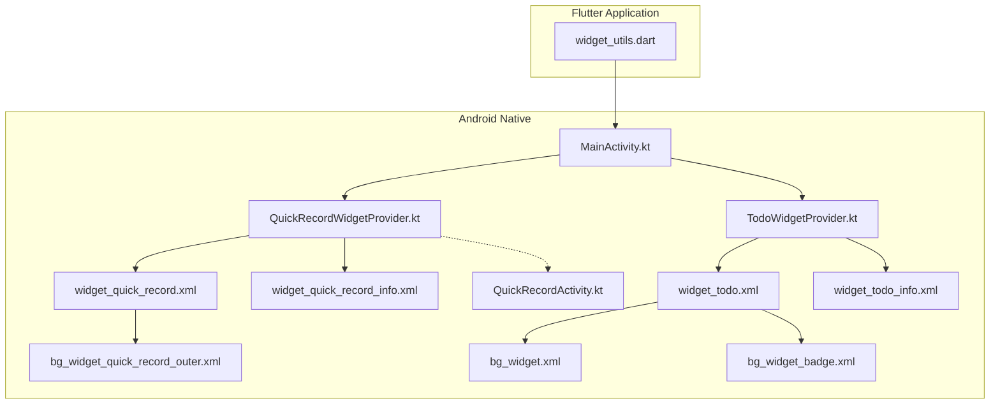
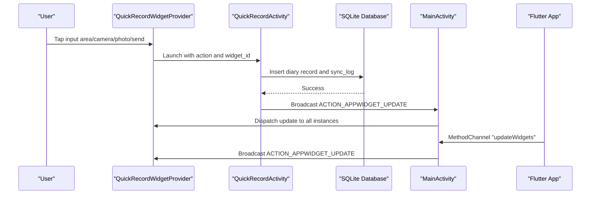
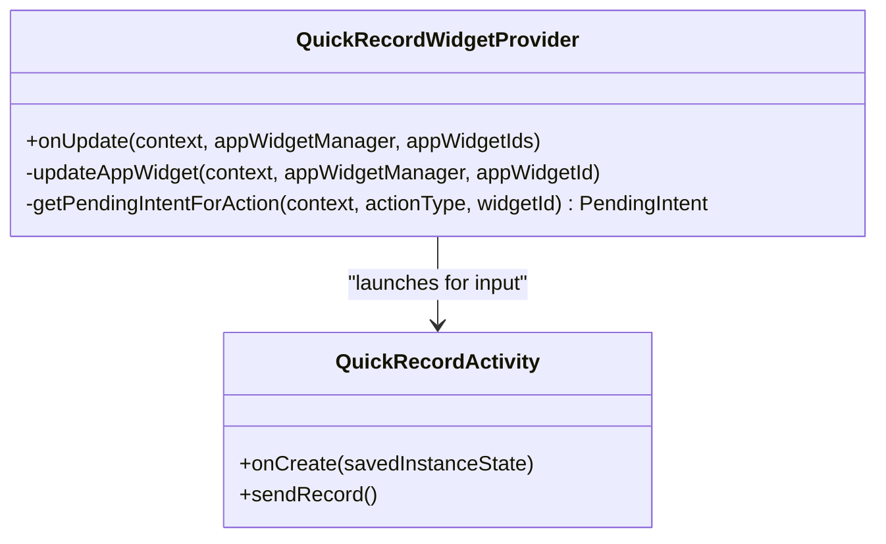
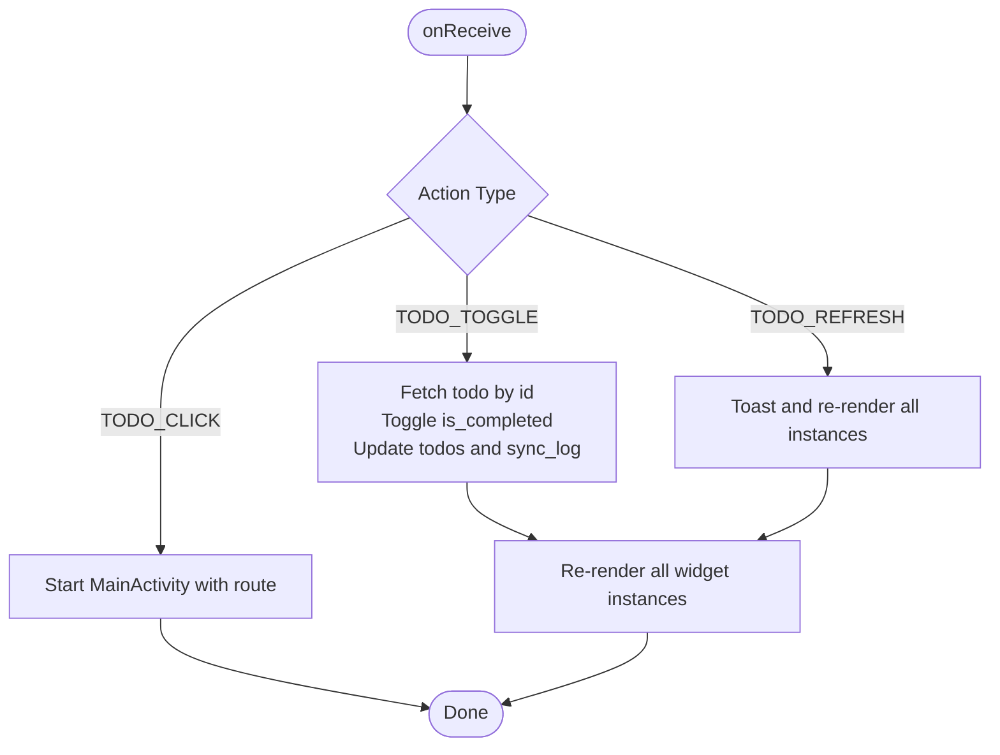
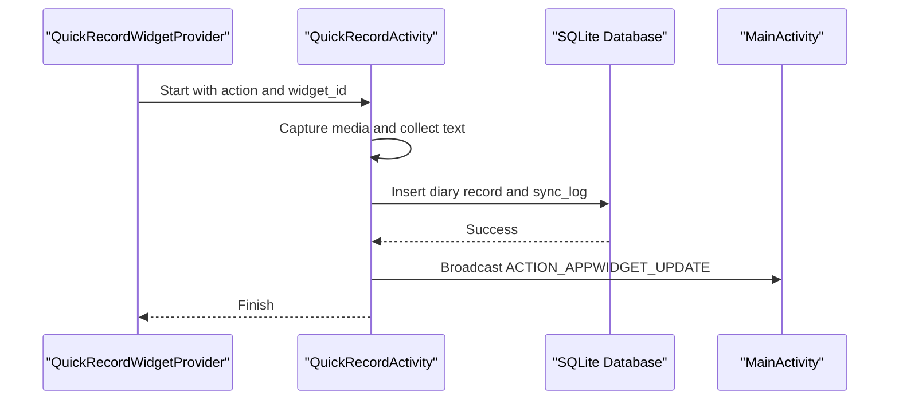
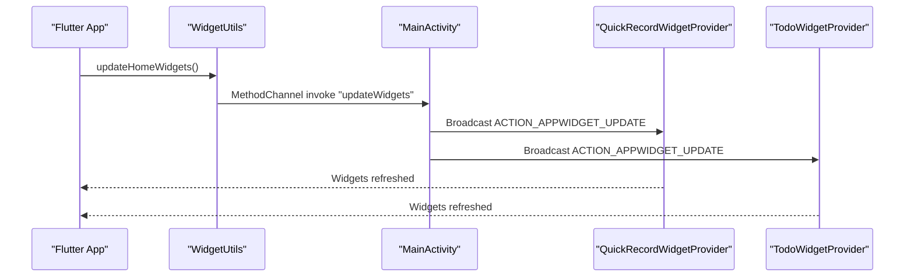
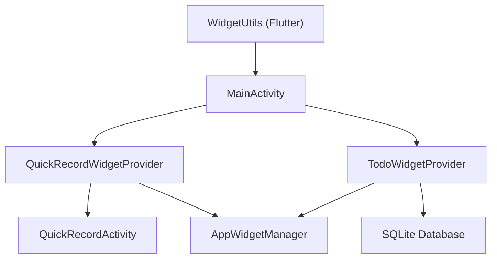

# Widget System

<cite>
**Referenced Files in This Document**
- [QuickRecordWidgetProvider.kt](file://android/app/src/main/kotlin/com/appone/qnote_flutter/QuickRecordWidgetProvider.kt)
- [TodoWidgetProvider.kt](file://android/app/src/main/kotlin/com/appone/qnote_flutter/TodoWidgetProvider.kt)
- [widget_quick_record.xml](file://android/app/src/main/res/layout/widget_quick_record.xml)
- [widget_todo.xml](file://android/app/src/main/res/layout/widget_todo.xml)
- [widget_quick_record_info.xml](file://android/app/src/main/res/xml/widget_quick_record_info.xml)
- [widget_todo_info.xml](file://android/app/src/main/res/xml/widget_todo_info.xml)
- [bg_widget.xml](file://android/app/src/main/res/drawable/bg_widget.xml)
- [bg_widget_quick_record_outer.xml](file://android/app/src/main/res/drawable/bg_widget_quick_record_outer.xml)
- [bg_widget_badge.xml](file://android/app/src/main/res/drawable/bg_widget_badge.xml)
- [MainActivity.kt](file://android/app/src/main/kotlin/com/appone/qnote_flutter/MainActivity.kt)
- [QuickRecordActivity.kt](file://android/app/src/main/kotlin/com/appone/qnote_flutter/QuickRecordActivity.kt)
- [widget_utils.dart](file://lib/core/utils/widget_utils.dart)
</cite>

## Table of Contents
1. [Introduction](#introduction)
2. [Project Structure](#project-structure)
3. [Core Components](#core-components)
4. [Architecture Overview](#architecture-overview)
5. [Detailed Component Analysis](#detailed-component-analysis)
6. [Dependency Analysis](#dependency-analysis)
7. [Performance Considerations](#performance-considerations)
8. [Troubleshooting Guide](#troubleshooting-guide)
9. [Conclusion](#conclusion)

## Introduction
This document explains the Widget System feature that powers quick record and todo functionalities on the Android home screen. It covers the implementation of two home screen widgets:
- Quick Record Widget: A compact floating input bar that allows instant diary entries with optional media attachments.
- Todo Widget: A dynamic list widget that displays today's pending tasks, supports inline completion toggling, and links to the full application.

The documentation details the Android-specific lifecycle management, update mechanisms, user interactions, and the integration with the main application via a MethodChannel. It also describes the widget layouts and resources used for rendering.

## Project Structure
The Widget System spans Android native code and Flutter application logic:
- Android providers define widget behavior and UI rendering.
- XML resources describe widget metadata and layouts.
- Flutter utilities communicate with native providers to trigger updates.

**Diagram sources**
- [QuickRecordWidgetProvider.kt:10-62](file://android/app/src/main/kotlin/com/appone/qnote_flutter/QuickRecordWidgetProvider.kt#L10-L62)
- [TodoWidgetProvider.kt:19-321](file://android/app/src/main/kotlin/com/appone/qnote_flutter/TodoWidgetProvider.kt#L19-L321)
- [widget_quick_record.xml:1-76](file://android/app/src/main/res/layout/widget_quick_record.xml#L1-L76)
- [widget_todo.xml:1-253](file://android/app/src/main/res/layout/widget_todo.xml#L1-L253)
- [widget_quick_record_info.xml:1-10](file://android/app/src/main/res/xml/widget_quick_record_info.xml#L1-L10)
- [widget_todo_info.xml:1-10](file://android/app/src/main/res/xml/widget_todo_info.xml#L1-L10)
- [bg_widget.xml:1-7](file://android/app/src/main/res/drawable/bg_widget.xml#L1-L7)
- [bg_widget_quick_record_outer.xml:1-7](file://android/app/src/main/res/drawable/bg_widget_quick_record_outer.xml#L1-L7)
- [bg_widget_badge.xml:1-6](file://android/app/src/main/res/drawable/bg_widget_badge.xml#L1-L6)
- [MainActivity.kt:61-84](file://android/app/src/main/kotlin/com/appone/qnote_flutter/MainActivity.kt#L61-L84)
- [QuickRecordActivity.kt:354-365](file://android/app/src/main/kotlin/com/appone/qnote_flutter/QuickRecordActivity.kt#L354-L365)
- [widget_utils.dart:1-17](file://lib/core/utils/widget_utils.dart#L1-L17)

**Section sources**
- [QuickRecordWidgetProvider.kt:10-62](file://android/app/src/main/kotlin/com/appone/qnote_flutter/QuickRecordWidgetProvider.kt#L10-L62)
- [TodoWidgetProvider.kt:19-321](file://android/app/src/main/kotlin/com/appone/qnote_flutter/TodoWidgetProvider.kt#L19-L321)
- [widget_quick_record.xml:1-76](file://android/app/src/main/res/layout/widget_quick_record.xml#L1-L76)
- [widget_todo.xml:1-253](file://android/app/src/main/res/layout/widget_todo.xml#L1-L253)
- [widget_quick_record_info.xml:1-10](file://android/app/src/main/res/xml/widget_quick_record_info.xml#L1-L10)
- [widget_todo_info.xml:1-10](file://android/app/src/main/res/xml/widget_todo_info.xml#L1-L10)
- [MainActivity.kt:61-84](file://android/app/src/main/kotlin/com/appone/qnote_flutter/MainActivity.kt#L61-L84)
- [QuickRecordActivity.kt:354-365](file://android/app/src/main/kotlin/com/appone/qnote_flutter/QuickRecordActivity.kt#L354-L365)
- [widget_utils.dart:1-17](file://lib/core/utils/widget_utils.dart#L1-L17)

## Core Components
- QuickRecordWidgetProvider: Handles the lifecycle and user interactions for the Quick Record widget, launching QuickRecordActivity for input actions.
- TodoWidgetProvider: Manages the Todo widget lifecycle, renders up to four pending items, handles inline toggling, and refreshes data on demand.
- QuickRecordActivity: Full-screen dialog-style activity that captures text and media, writes records to the database, and triggers widget updates.
- MainActivity: Exposes a MethodChannel to receive Flutter-triggered update requests and broadcasts widget refresh intents.
- Flutter WidgetUtils: Provides a simple API to notify native widgets to refresh from the Flutter app.

Key responsibilities:
- Widget lifecycle: onCreate/onUpdate/onReceive, updateAppWidget, and broadcast refresh.
- User interactions: PendingIntents for buttons and list items, navigation to routes, and media selection.
- Data synchronization: Direct SQLite access for read/write and logging changes to sync_log.

**Section sources**
- [QuickRecordWidgetProvider.kt:10-62](file://android/app/src/main/kotlin/com/appone/qnote_flutter/QuickRecordWidgetProvider.kt#L10-L62)
- [TodoWidgetProvider.kt:19-321](file://android/app/src/main/kotlin/com/appone/qnote_flutter/TodoWidgetProvider.kt#L19-L321)
- [QuickRecordActivity.kt:268-375](file://android/app/src/main/kotlin/com/appone/qnote_flutter/QuickRecordActivity.kt#L268-L375)
- [MainActivity.kt:43-84](file://android/app/src/main/kotlin/com/appone/qnote_flutter/MainActivity.kt#L43-L84)
- [widget_utils.dart:8-15](file://lib/core/utils/widget_utils.dart#L8-L15)

## Architecture Overview
The Widget System follows a hybrid architecture:
- Native Android widgets render UI and handle user input.
- Flutter app communicates via MethodChannel to request widget refresh.
- Both widgets access the shared SQLite database to read/write data and maintain consistency through sync_log.

**Diagram sources**
- [QuickRecordWidgetProvider.kt:17-51](file://android/app/src/main/kotlin/com/appone/qnote_flutter/QuickRecordWidgetProvider.kt#L17-L51)
- [QuickRecordActivity.kt:354-365](file://android/app/src/main/kotlin/com/appone/qnote_flutter/QuickRecordActivity.kt#L354-L365)
- [MainActivity.kt:61-84](file://android/app/src/main/kotlin/com/appone/qnote_flutter/MainActivity.kt#L61-L84)

## Detailed Component Analysis

### Quick Record Widget Provider
Implements the home screen widget for instant diary entry creation. It sets click handlers for:
- Whole widget background and input target area
- Photo button
- Camera button
- Send button

Each click creates a PendingIntent targeting QuickRecordActivity with extras indicating the action and widget ID. The provider updates the widget UI via RemoteViews.

**Diagram sources**
- [QuickRecordWidgetProvider.kt:10-62](file://android/app/src/main/kotlin/com/appone/qnote_flutter/QuickRecordWidgetProvider.kt#L10-L62)
- [QuickRecordActivity.kt:59-90](file://android/app/src/main/kotlin/com/appone/qnote_flutter/QuickRecordActivity.kt#L59-L90)

**Section sources**
- [QuickRecordWidgetProvider.kt:10-62](file://android/app/src/main/kotlin/com/appone/qnote_flutter/QuickRecordWidgetProvider.kt#L10-L62)
- [widget_quick_record.xml:1-76](file://android/app/src/main/res/layout/widget_quick_record.xml#L1-L76)
- [widget_quick_record_info.xml:1-10](file://android/app/src/main/res/xml/widget_quick_record_info.xml#L1-L10)

### Todo Widget Provider
Manages the home screen todo widget with:
- Lifecycle callbacks: onReceive handles toggle, click, and refresh actions.
- Data loading: queries pending todos from SQLite, limits to top 4 items.
- UI rendering: shows counts, empty state, priority indicators, and "more" badge.
- Interactions: inline checkbox toggles, header refresh, and item clicks navigate to the app.

**Diagram sources**
- [TodoWidgetProvider.kt:28-66](file://android/app/src/main/kotlin/com/appone/qnote_flutter/TodoWidgetProvider.kt#L28-L66)
- [TodoWidgetProvider.kt:75-166](file://android/app/src/main/kotlin/com/appone/qnote_flutter/TodoWidgetProvider.kt#L75-L166)

**Section sources**
- [TodoWidgetProvider.kt:19-321](file://android/app/src/main/kotlin/com/appone/qnote_flutter/TodoWidgetProvider.kt#L19-L321)
- [widget_todo.xml:1-253](file://android/app/src/main/res/layout/widget_todo.xml#L1-L253)
- [widget_todo_info.xml:1-10](file://android/app/src/main/res/xml/widget_todo_info.xml#L1-L10)

### QuickRecordActivity
Handles the full-screen quick record dialog:
- Permissions for camera/gallery.
- Media selection from gallery or camera capture.
- Text input with soft keyboard focus.
- Asynchronous database write to diary_records and sync_log.
- Triggers widget update broadcast after successful save.

**Diagram sources**
- [QuickRecordWidgetProvider.kt:53-62](file://android/app/src/main/kotlin/com/appone/qnote_flutter/QuickRecordWidgetProvider.kt#L53-L62)
- [QuickRecordActivity.kt:268-375](file://android/app/src/main/kotlin/com/appone/qnote_flutter/QuickRecordActivity.kt#L268-L375)
- [MainActivity.kt:65-72](file://android/app/src/main/kotlin/com/appone/qnote_flutter/MainActivity.kt#L65-L72)

**Section sources**
- [QuickRecordActivity.kt:59-90](file://android/app/src/main/kotlin/com/appone/qnote_flutter/QuickRecordActivity.kt#L59-L90)
- [QuickRecordActivity.kt:268-375](file://android/app/src/main/kotlin/com/appone/qnote_flutter/QuickRecordActivity.kt#L268-L375)

### Flutter Integration via MethodChannel
The Flutter app communicates with native widgets using a MethodChannel:
- WidgetUtils.updateHomeWidgets invokes "updateWidgets" on the native side.
- MainActivity listens for the method and broadcasts ACTION_APPWIDGET_UPDATE to both providers.
- The providers then refresh their UI by rebuilding RemoteViews.

**Diagram sources**
- [widget_utils.dart:8-15](file://lib/core/utils/widget_utils.dart#L8-L15)
- [MainActivity.kt:43-58](file://android/app/src/main/kotlin/com/appone/qnote_flutter/MainActivity.kt#L43-L58)
- [MainActivity.kt:61-84](file://android/app/src/main/kotlin/com/appone/qnote_flutter/MainActivity.kt#L61-L84)

**Section sources**
- [widget_utils.dart:1-17](file://lib/core/utils/widget_utils.dart#L1-L17)
- [MainActivity.kt:43-84](file://android/app/src/main/kotlin/com/appone/qnote_flutter/MainActivity.kt#L43-L84)

## Dependency Analysis
- QuickRecordWidgetProvider depends on:
  - QuickRecordActivity for input handling.
  - RemoteViews and PendingIntent for UI and navigation.
  - AppWidgetManager for updates.
- TodoWidgetProvider depends on:
  - SQLite database for read/write and sync_log.
  - RemoteViews and PendingIntent for UI and navigation.
  - AppWidgetManager for updates.
- MainActivity bridges Flutter and native widgets via MethodChannel and broadcasts update intents.
- QuickRecordActivity depends on:
  - SQLite for writing records.
  - FileProvider for camera capture.
  - AppWidgetManager to trigger widget refresh.

**Diagram sources**
- [widget_utils.dart:8-15](file://lib/core/utils/widget_utils.dart#L8-L15)
- [MainActivity.kt:61-84](file://android/app/src/main/kotlin/com/appone/qnote_flutter/MainActivity.kt#L61-L84)
- [QuickRecordWidgetProvider.kt:17-51](file://android/app/src/main/kotlin/com/appone/qnote_flutter/QuickRecordWidgetProvider.kt#L17-L51)
- [TodoWidgetProvider.kt:174-321](file://android/app/src/main/kotlin/com/appone/qnote_flutter/TodoWidgetProvider.kt#L174-L321)

**Section sources**
- [QuickRecordWidgetProvider.kt:10-62](file://android/app/src/main/kotlin/com/appone/qnote_flutter/QuickRecordWidgetProvider.kt#L10-L62)
- [TodoWidgetProvider.kt:19-321](file://android/app/src/main/kotlin/com/appone/qnote_flutter/TodoWidgetProvider.kt#L19-L321)
- [MainActivity.kt:61-84](file://android/app/src/main/kotlin/com/appone/qnote_flutter/MainActivity.kt#L61-L84)
- [QuickRecordActivity.kt:354-365](file://android/app/src/main/kotlin/com/appone/qnote_flutter/QuickRecordActivity.kt#L354-L365)

## Performance Considerations
- Background threading: Both providers and QuickRecordActivity perform database operations on background threads to keep UI responsive.
- Efficient updates: Providers use targeted broadcasts and update only visible widget instances.
- Resource constraints: Widget layouts use lightweight containers and minimal drawables to reduce memory footprint.
- Permission handling: QuickRecordActivity defers permission checks until needed to avoid unnecessary prompts.

## Troubleshooting Guide
Common issues and resolutions:
- Widgets not updating after data change:
  - Ensure Flutter calls WidgetUtils.updateHomeWidgets and MainActivity receives the "updateWidgets" method.
  - Verify that AppWidgetManager broadcasts ACTION_APPWIDGET_UPDATE to both providers.
- Todo widget shows stale data:
  - Trigger manual refresh by tapping the header refresh button; this broadcasts TODO_REFRESH and re-renders all instances.
- Quick Record widget click does nothing:
  - Confirm PendingIntent flags and action strings match the launched activity.
  - Ensure QuickRecordActivity handles incoming intent extras correctly.
- Database errors during write:
  - Check that the database file exists and is readable/writable.
  - Verify sync_log insertion succeeds alongside data insertions.

**Section sources**
- [MainActivity.kt:43-58](file://android/app/src/main/kotlin/com/appone/qnote_flutter/MainActivity.kt#L43-L58)
- [TodoWidgetProvider.kt:46-66](file://android/app/src/main/kotlin/com/appone/qnote_flutter/TodoWidgetProvider.kt#L46-L66)
- [QuickRecordWidgetProvider.kt:53-62](file://android/app/src/main/kotlin/com/appone/qnote_flutter/QuickRecordWidgetProvider.kt#L53-L62)
- [QuickRecordActivity.kt:276-375](file://android/app/src/main/kotlin/com/appone/qnote_flutter/QuickRecordActivity.kt#L276-L375)

## Conclusion
The Widget System delivers efficient, real-time home screen experiences for quick diary entry and todo management. By combining native Android widgets with Flutter-driven orchestration, it ensures fast interactions, reliable data synchronization, and seamless navigation to the full application. The architecture supports scalable enhancements such as additional widget types, richer interactions, and improved offline synchronization strategies.