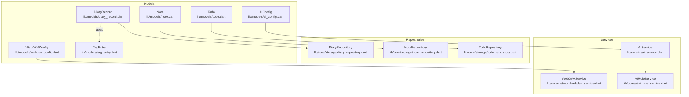
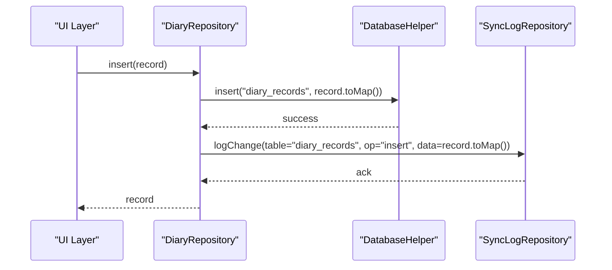
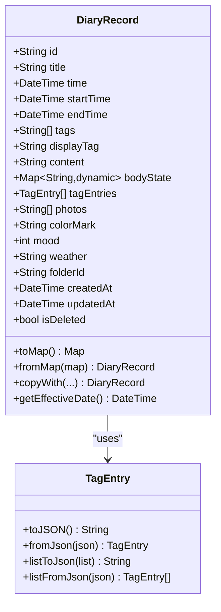
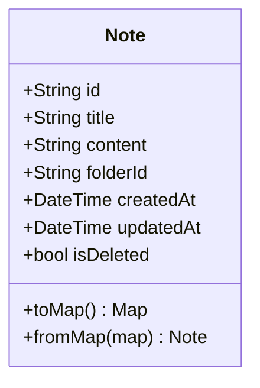
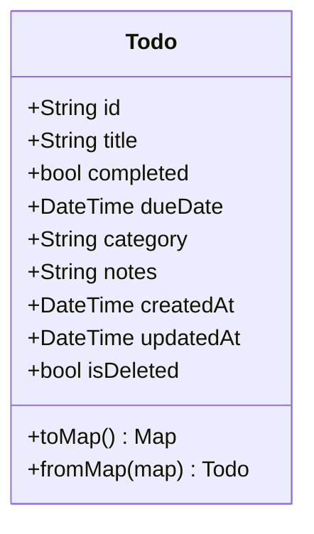
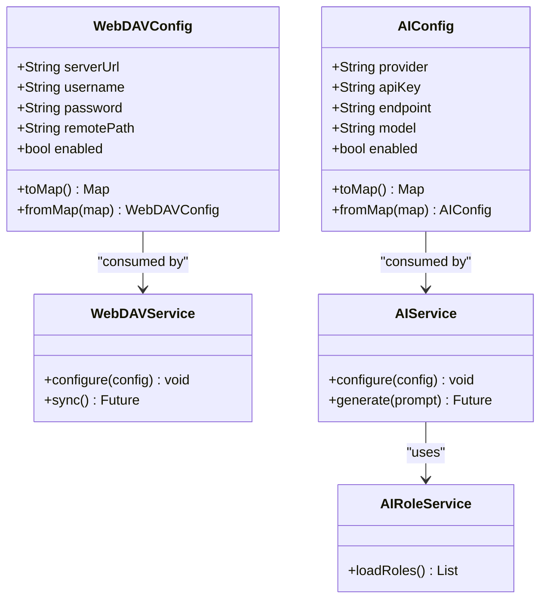
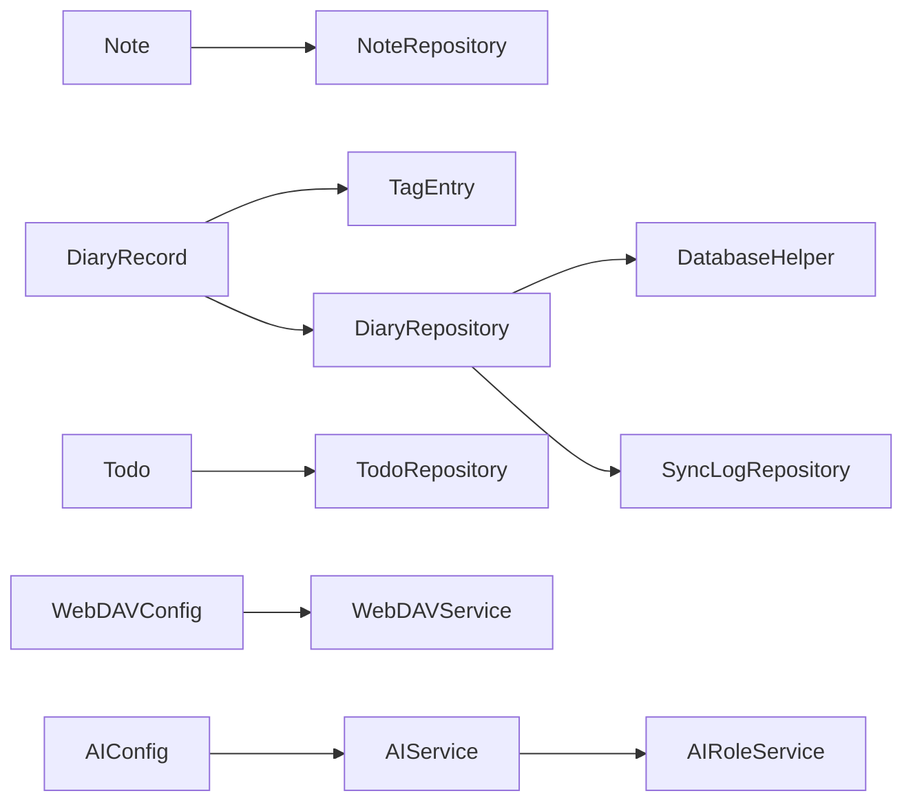

# Core Entities

<cite>
**Referenced Files in This Document**
- [diary_record.dart](file://lib/models/diary_record.dart)
- [diary_repository.dart](file://lib/core/storage/diary_repository.dart)
- [note.dart](file://lib/models/note.dart)
- [note_repository.dart](file://lib/core/storage/note_repository.dart)
- [todo.dart](file://lib/models/todo.dart)
- [todo_repository.dart](file://lib/core/storage/todo_repository.dart)
- [webdav_config.dart](file://lib/models/webdav_config.dart)
- [webdav_service.dart](file://lib/core/network/webdav_service.dart)
- [ai_config.dart](file://lib/models/ai_config.dart)
- [ai_service.dart](file://lib/core/ai/ai_service.dart)
- [ai_role_service.dart](file://lib/core/ai/ai_role_service.dart)
- [tag_entry.dart](file://lib/models/tag_entry.dart)
</cite>

## Table of Contents
1. [Introduction](#introduction)
2. [Project Structure](#project-structure)
3. [Core Components](#core-components)
4. [Architecture Overview](#architecture-overview)
5. [Detailed Component Analysis](#detailed-component-analysis)
6. [Dependency Analysis](#dependency-analysis)
7. [Performance Considerations](#performance-considerations)
8. [Troubleshooting Guide](#troubleshooting-guide)
9. [Conclusion](#conclusion)

## Introduction
This document describes QNote Flutter's core data entities and their supporting infrastructure. It focuses on:
- DiaryRecord: daily journal entries with content, mood, weather, tags, photos, and timestamps
- Note: rich-text notes associated with folders and metadata
- Todo: task items with completion, due dates, and categorization
- WebDAVConfig and AIConfig: configuration models for cloud synchronization and AI services
It explains field definitions, data types, validation rules, business constraints, instantiation patterns, serialization, and common operations. Entity relationships and how they support core functionality are also covered.

## Project Structure
The core entities live under lib/models, with repositories under lib/core/storage managing persistence and operations. Configuration models reside under lib/models and are consumed by services under lib/core.

**Diagram sources**
- [diary_record.dart:1-168](file://lib/models/diary_record.dart#L1-L168)
- [note.dart](file://lib/models/note.dart)
- [todo.dart](file://lib/models/todo.dart)
- [webdav_config.dart](file://lib/models/webdav_config.dart)
- [ai_config.dart](file://lib/models/ai_config.dart)
- [tag_entry.dart](file://lib/models/tag_entry.dart)
- [diary_repository.dart:1-128](file://lib/core/storage/diary_repository.dart#L1-L128)
- [note_repository.dart](file://lib/core/storage/note_repository.dart)
- [todo_repository.dart](file://lib/core/storage/todo_repository.dart)
- [webdav_service.dart](file://lib/core/network/webdav_service.dart)
- [ai_service.dart](file://lib/core/ai/ai_service.dart)
- [ai_role_service.dart](file://lib/core/ai/ai_role_service.dart)

**Section sources**
- [diary_record.dart:1-168](file://lib/models/diary_record.dart#L1-L168)
- [note.dart](file://lib/models/note.dart)
- [todo.dart](file://lib/models/todo.dart)
- [webdav_config.dart](file://lib/models/webdav_config.dart)
- [ai_config.dart](file://lib/models/ai_config.dart)
- [tag_entry.dart](file://lib/models/tag_entry.dart)
- [diary_repository.dart:1-128](file://lib/core/storage/diary_repository.dart#L1-L128)
- [note_repository.dart](file://lib/core/storage/note_repository.dart)
- [todo_repository.dart](file://lib/core/storage/todo_repository.dart)
- [webdav_service.dart](file://lib/core/network/webdav_service.dart)
- [ai_service.dart](file://lib/core/ai/ai_service.dart)
- [ai_role_service.dart](file://lib/core/ai/ai_role_service.dart)

## Core Components
This section defines each entity, its fields, types, validation rules, constraints, and typical operations.

### DiaryRecord
- Purpose: Daily journal entries with optional time range, tags, photos, mood, weather, and folder association.
- Key fields and types:
  - id: String (primary key)
  - title: String
  - time: DateTime (entry date/time)
  - startTime?: DateTime
  - endTime?: DateTime
  - tags: List<String>
  - displayTag: String
  - content: String
  - bodyState?: Map<String, dynamic>
  - tagEntries: List<TagEntry>
  - photos: List<String>
  - colorMark: String
  - mood: int
  - weather: String
  - folderId?: String
  - createdAt: DateTime
  - updatedAt: DateTime
  - isDeleted: bool
- Validation and constraints:
  - Effective date calculation considers startTime/endTime when present; otherwise uses time date part.
  - JSON encoding/decoding for tags, bodyState, tagEntries, and photos.
  - Default values: empty lists/strings for collections, safe default for mood, timestamps required.
  - Business rule: isDeleted flag supports soft deletion; queries filter by is_deleted = 0 by default.
- Serialization:
  - toMap(): serializes to database map with ISO 8601 strings for DateTime fields and JSON-encoded arrays/maps.
  - fromMap(): reconstructs from persisted map, decoding JSON fields and TagEntry list.
  - copyWith(): immutable updates for selected fields.
- Common operations:
  - Insert/update via DiaryRepository with automatic updatedAt and sync log recording.
  - Query by date range, tag, or ID.
- Examples (paths):
  - Instantiation and serialization: [diary_record.dart:24-66](file://lib/models/diary_record.dart#L24-L66)
  - Copy with updates: [diary_record.dart:120-160](file://lib/models/diary_record.dart#L120-L160)
  - Repository insert/update: [diary_repository.dart:100-128](file://lib/core/storage/diary_repository.dart#L100-L128)
  - Query by date: [diary_repository.dart:23-37](file://lib/core/storage/diary_repository.dart#L23-L37)
  - Query by tag: [diary_repository.dart:78-87](file://lib/core/storage/diary_repository.dart#L78-L87)
  - Query by ID: [diary_repository.dart:89-98](file://lib/core/storage/diary_repository.dart#L89-L98)

**Section sources**
- [diary_record.dart:1-168](file://lib/models/diary_record.dart#L1-L168)
- [diary_repository.dart:1-128](file://lib/core/storage/diary_repository.dart#L1-L128)
- [tag_entry.dart](file://lib/models/tag_entry.dart)

### Note
- Purpose: Rich-text notes organized by folders with metadata.
- Key fields and types:
  - id: String (primary key)
  - title: String
  - content: String (rich text)
  - folderId?: String
  - createdAt: DateTime
  - updatedAt: DateTime
  - isDeleted: bool
- Validation and constraints:
  - Soft delete via isDeleted flag.
  - Association via folderId to a Folder entity (repository pattern implies existence).
- Serialization:
  - toMap()/fromMap() for persistence (fields align with typical note schema).
- Common operations:
  - CRUD via NoteRepository with updatedAt managed on updates.
- Examples (paths):
  - Model definition: [note.dart](file://lib/models/note.dart)
  - Repository operations: [note_repository.dart](file://lib/core/storage/note_repository.dart)

**Section sources**
- [note.dart](file://lib/models/note.dart)
- [note_repository.dart](file://lib/core/storage/note_repository.dart)

### Todo
- Purpose: Task items with completion, due dates, and categorization.
- Key fields and types:
  - id: String (primary key)
  - title: String
  - completed: bool
  - dueDate?: DateTime
  - category?: String
  - notes?: String
  - createdAt: DateTime
  - updatedAt: DateTime
  - isDeleted: bool
- Validation and constraints:
  - Soft delete via isDeleted flag.
  - Optional dueDate enables time-based filtering and scheduling.
- Serialization:
  - toMap()/fromMap() for persistence.
- Common operations:
  - CRUD via TodoRepository with updatedAt managed on updates.
- Examples (paths):
  - Model definition: [todo.dart](file://lib/models/todo.dart)
  - Repository operations: [todo_repository.dart](file://lib/core/storage/todo_repository.dart)

**Section sources**
- [todo.dart](file://lib/models/todo.dart)
- [todo_repository.dart](file://lib/core/storage/todo_repository.dart)

### WebDAVConfig
- Purpose: Configuration for WebDAV-based cloud synchronization.
- Key fields and types:
  - serverUrl: String
  - username: String
  - password: String
  - remotePath: String
  - enabled: bool
- Validation and constraints:
  - Required fields for authentication and remote path when enabled.
  - Secure handling recommended for credentials.
- Serialization:
  - Typically stored as encrypted preferences or secure storage; serialized to/from JSON for persistence.
- Examples (paths):
  - Model definition: [webdav_config.dart](file://lib/models/webdav_config.dart)
  - Service consumption: [webdav_service.dart](file://lib/core/network/webdav_service.dart)

**Section sources**
- [webdav_config.dart](file://lib/models/webdav_config.dart)
- [webdav_service.dart](file://lib/core/network/webdav_service.dart)

### AIConfig
- Purpose: Configuration for AI services used within the app.
- Key fields and types:
  - provider: String
  - apiKey: String
  - endpoint: String
  - model: String
  - enabled: bool
- Validation and constraints:
  - Provider-specific validation and required fields when enabled.
  - Secure handling recommended for API keys.
- Serialization:
  - Stored securely; serialized to/from JSON for persistence.
- Examples (paths):
  - Model definition: [ai_config.dart](file://lib/models/ai_config.dart)
  - Service usage: [ai_service.dart](file://lib/core/ai/ai_service.dart)
  - Role management: [ai_role_service.dart](file://lib/core/ai/ai_role_service.dart)

**Section sources**
- [ai_config.dart](file://lib/models/ai_config.dart)
- [ai_service.dart](file://lib/core/ai/ai_service.dart)
- [ai_role_service.dart](file://lib/core/ai/ai_role_service.dart)

## Architecture Overview
The entities are persisted via repositories that encapsulate SQL operations and maintain sync logs. Services consume configuration models to enable cloud sync and AI features.

**Diagram sources**
- [diary_repository.dart:100-110](file://lib/core/storage/diary_repository.dart#L100-L110)
- [diary_record.dart:45-66](file://lib/models/diary_record.dart#L45-L66)

## Detailed Component Analysis

### DiaryRecord Analysis
- Class structure and relationships:
  - Uses TagEntry for structured tagging.
  - Supports effective date computation for scheduling and grouping.
- Serialization flow:
  - Dates serialized as ISO 8601 strings.
  - Collections serialized as JSON strings; deserialized on load.
- Typical operations:
  - Insert: sets timestamps, persists, logs change.
  - Update: refreshes updatedAt, persists, logs change.
  - Query: by date range, tag, or ID.

**Diagram sources**
- [diary_record.dart:1-168](file://lib/models/diary_record.dart#L1-L168)
- [tag_entry.dart](file://lib/models/tag_entry.dart)

**Section sources**
- [diary_record.dart:1-168](file://lib/models/diary_record.dart#L1-L168)
- [tag_entry.dart](file://lib/models/tag_entry.dart)

### Note Analysis
- Class structure and relationships:
  - Associated with Folder via folderId.
  - Rich-text content stored as string; rendering handled by UI.
- Persistence:
  - CRUD via NoteRepository with updatedAt on updates.

**Diagram sources**
- [note.dart](file://lib/models/note.dart)

**Section sources**
- [note.dart](file://lib/models/note.dart)
- [note_repository.dart](file://lib/core/storage/note_repository.dart)

### Todo Analysis
- Class structure and relationships:
  - Completion status, optional due date, category, and notes.
- Persistence:
  - CRUD via TodoRepository with updatedAt on updates.

**Diagram sources**
- [todo.dart](file://lib/models/todo.dart)

**Section sources**
- [todo.dart](file://lib/models/todo.dart)
- [todo_repository.dart](file://lib/core/storage/todo_repository.dart)

### WebDAVConfig and AIConfig Analysis
- Configuration models:
  - Encapsulate connection details and flags for enabling features.
- Service integration:
  - WebDAVService consumes WebDAVConfig for sync operations.
  - AIConfig drives AIService and AIRoleService for AI-powered features.

**Diagram sources**
- [webdav_config.dart](file://lib/models/webdav_config.dart)
- [webdav_service.dart](file://lib/core/network/webdav_service.dart)
- [ai_config.dart](file://lib/models/ai_config.dart)
- [ai_service.dart](file://lib/core/ai/ai_service.dart)
- [ai_role_service.dart](file://lib/core/ai/ai_role_service.dart)

**Section sources**
- [webdav_config.dart](file://lib/models/webdav_config.dart)
- [webdav_service.dart](file://lib/core/network/webdav_service.dart)
- [ai_config.dart](file://lib/models/ai_config.dart)
- [ai_service.dart](file://lib/core/ai/ai_service.dart)
- [ai_role_service.dart](file://lib/core/ai/ai_role_service.dart)

## Dependency Analysis
- Entities depend on TagEntry for structured tagging.
- Repositories depend on DatabaseHelper and SyncLogRepository for persistence and change logging.
- Services depend on configuration models for runtime behavior.
- No circular dependencies observed among core entities and repositories.

**Diagram sources**
- [diary_record.dart:1-168](file://lib/models/diary_record.dart#L1-L168)
- [tag_entry.dart](file://lib/models/tag_entry.dart)
- [note.dart](file://lib/models/note.dart)
- [todo.dart](file://lib/models/todo.dart)
- [diary_repository.dart:1-128](file://lib/core/storage/diary_repository.dart#L1-L128)
- [note_repository.dart](file://lib/core/storage/note_repository.dart)
- [todo_repository.dart](file://lib/core/storage/todo_repository.dart)
- [webdav_config.dart](file://lib/models/webdav_config.dart)
- [webdav_service.dart](file://lib/core/network/webdav_service.dart)
- [ai_config.dart](file://lib/models/ai_config.dart)
- [ai_service.dart](file://lib/core/ai/ai_service.dart)
- [ai_role_service.dart](file://lib/core/ai/ai_role_service.dart)

**Section sources**
- [diary_record.dart:1-168](file://lib/models/diary_record.dart#L1-L168)
- [note.dart](file://lib/models/note.dart)
- [todo.dart](file://lib/models/todo.dart)
- [webdav_config.dart](file://lib/models/webdav_config.dart)
- [ai_config.dart](file://lib/models/ai_config.dart)
- [diary_repository.dart:1-128](file://lib/core/storage/diary_repository.dart#L1-L128)
- [note_repository.dart](file://lib/core/storage/note_repository.dart)
- [todo_repository.dart](file://lib/core/storage/todo_repository.dart)
- [webdav_service.dart](file://lib/core/network/webdav_service.dart)
- [ai_service.dart](file://lib/core/ai/ai_service.dart)
- [ai_role_service.dart](file://lib/core/ai/ai_role_service.dart)

## Performance Considerations
- Prefer batch operations for bulk inserts/updates to reduce database overhead.
- Use indexed queries for frequent filters (date ranges, tags, categories).
- Cache frequently accessed entities in memory to minimize disk reads.
- Avoid large bodyState maps; serialize only essential UI state.
- Compress or store large media references rather than embedding binary data.

## Troubleshooting Guide
- Serialization errors:
  - Verify JSON encoding/decoding for tags, bodyState, tagEntries, and photos.
  - Ensure DateTime fields are serialized to ISO 8601 strings.
- Query anomalies:
  - Confirm date boundary calculations and time zone handling.
  - Check LIKE patterns for tag queries and ID existence.
- Sync issues:
  - Validate WebDAVConfig credentials and remote path.
  - Review sync logs for failed operations.
- AI configuration problems:
  - Confirm provider-specific fields and API key validity.
  - Ensure endpoint and model compatibility.

**Section sources**
- [diary_record.dart:45-86](file://lib/models/diary_record.dart#L45-L86)
- [diary_repository.dart:23-37](file://lib/core/storage/diary_repository.dart#L23-L37)
- [webdav_config.dart](file://lib/models/webdav_config.dart)
- [webdav_service.dart](file://lib/core/network/webdav_service.dart)
- [ai_config.dart](file://lib/models/ai_config.dart)
- [ai_service.dart](file://lib/core/ai/ai_service.dart)

## Conclusion
QNote’s core entities provide a robust foundation for journaling, note-taking, task management, and extensibility via cloud sync and AI features. Their design emphasizes immutability through copyWith, explicit serialization, soft deletion, and repository-driven persistence. Proper configuration of WebDAVConfig and AIConfig unlocks powerful integrations while maintaining clear separation of concerns across models, repositories, and services.