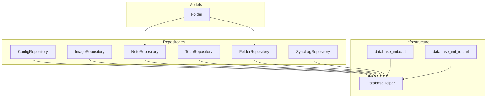
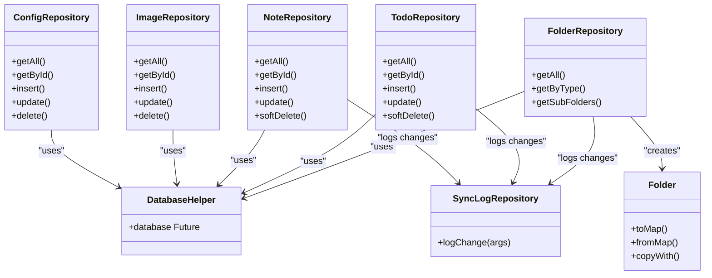
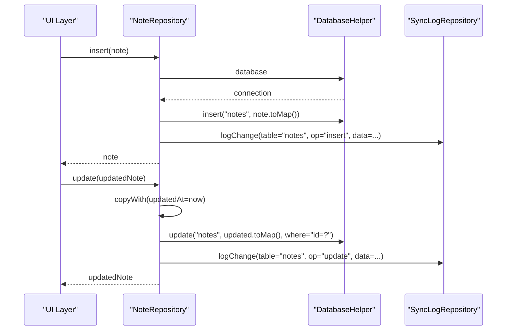
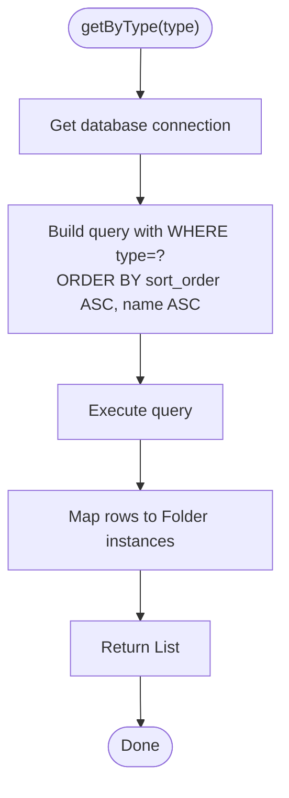
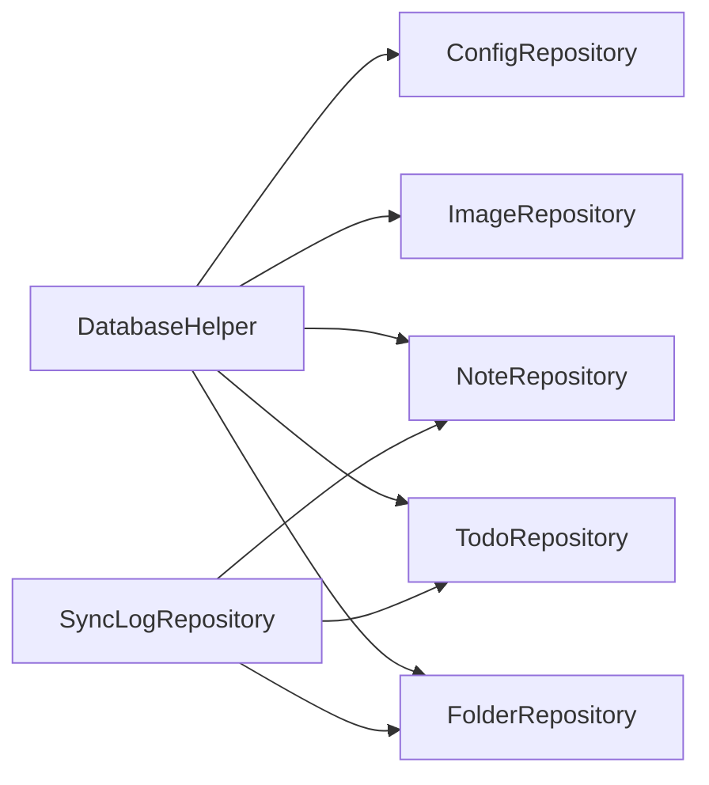

# Data Access Patterns and Repository Implementation

<cite>
**Referenced Files in This Document**
- [AGENTS.md](file://AGENTS.md)
- [database_init.dart](file://lib/database_init.dart)
- [database_init_io.dart](file://lib/database_init_io.dart)
- [database_helper.dart](file://lib/core/storage/database_helper.dart)
- [config_repository.dart](file://lib/core/storage/config_repository.dart)
- [image_repository.dart](file://lib/core/storage/image_repository.dart)
- [note_repository.dart](file://lib/core/storage/note_repository.dart)
- [todo_repository.dart](file://lib/core/storage/todo_repository.dart)
- [folder_repository.dart](file://lib/core/storage/folder_repository.dart)
- [sync_log_repository.dart](file://lib/core/storage/sync_log_repository.dart)
- [folder.dart](file://lib/models/folder.dart)
- [note_repository.dart](file://应用分享/lib/core/storage/note_repository.dart)
- [folder_repository.dart](file://应用分享/lib/core/storage/folder_repository.dart)
- [folder.dart](file://应用分享/lib/models/folder.dart)
</cite>

## Table of Contents
1. [Introduction](#introduction)
2. [Project Structure](#project-structure)
3. [Core Components](#core-components)
4. [Architecture Overview](#architecture-overview)
5. [Detailed Component Analysis](#detailed-component-analysis)
6. [Dependency Analysis](#dependency-analysis)
7. [Performance Considerations](#performance-considerations)
8. [Troubleshooting Guide](#troubleshooting-guide)
9. [Conclusion](#conclusion)

## Introduction
This document explains QNote Flutter's data access patterns and repository implementation. It focuses on the repository pattern applied to core entities, covering CRUD operations, query methods, data transformation, configuration management, image/media handling, asynchronous operations, error handling, transactions, caching, validation, business rules, thread safety, and performance optimization. The guidance is grounded in the repository implementations and architectural conventions documented in the repository.

## Project Structure
QNote organizes data access under a layered structure:
- Models define typed domain entities with serialization/deserialization and immutable copy semantics.
- Repositories encapsulate persistence logic per entity, using a shared database helper and synchronization logging.
- Configuration and image repositories handle application settings and media management respectively.
- A central database initialization module sets up the underlying database factory.

**Diagram sources**
- [database_init.dart](file://lib/database_init.dart)
- [database_init_io.dart](file://lib/database_init_io.dart)
- [database_helper.dart](file://lib/core/storage/database_helper.dart)
- [config_repository.dart](file://lib/core/storage/config_repository.dart)
- [image_repository.dart](file://lib/core/storage/image_repository.dart)
- [note_repository.dart](file://lib/core/storage/note_repository.dart)
- [todo_repository.dart](file://lib/core/storage/todo_repository.dart)
- [folder_repository.dart](file://lib/core/storage/folder_repository.dart)
- [sync_log_repository.dart](file://lib/core/storage/sync_log_repository.dart)
- [folder.dart](file://lib/models/folder.dart)

**Section sources**
- [AGENTS.md:82-91](file://AGENTS.md#L82-L91)

## Core Components
This section outlines the foundational components and their roles in the data access layer.

- DatabaseHelper: Centralized access to the underlying database connection used by all repositories.
- SyncLogRepository: Records change events for synchronization and audit trails.
- ConfigRepository: Manages application settings and user preferences.
- ImageRepository: Handles photo attachments and media-related operations.
- Entity Repositories (NoteRepository, TodoRepository, FolderRepository): Encapsulate CRUD and query operations for each domain entity.

Key conventions observed:
- Singleton repositories via factory constructors.
- Unified method signatures: getAll(), getById(), insert(), update(), softDelete(), hardDelete(), search().
- Write operations log changes via SyncLogRepository.
- Soft delete semantics with is_deleted filtering in queries.
- Models implement id (immutable primary key), toMap(), fromMap(), and copyWith().

**Section sources**
- [AGENTS.md:82-91](file://AGENTS.md#L82-L91)
- [database_helper.dart](file://lib/core/storage/database_helper.dart)
- [sync_log_repository.dart](file://lib/core/storage/sync_log_repository.dart)
- [config_repository.dart](file://lib/core/storage/config_repository.dart)
- [image_repository.dart](file://lib/core/storage/image_repository.dart)
- [note_repository.dart](file://lib/core/storage/note_repository.dart)
- [todo_repository.dart](file://lib/core/storage/todo_repository.dart)
- [folder_repository.dart](file://lib/core/storage/folder_repository.dart)

## Architecture Overview
The data access architecture follows a repository pattern with explicit separation of concerns:
- Repositories depend on DatabaseHelper for database operations.
- SyncLogRepository is invoked after write operations to maintain auditability.
- Models are responsible for data transformation and immutability via copyWith().
- Asynchronous operations are used consistently for IO-bound tasks.

**Diagram sources**
- [database_helper.dart](file://lib/core/storage/database_helper.dart)
- [sync_log_repository.dart](file://lib/core/storage/sync_log_repository.dart)
- [config_repository.dart](file://lib/core/storage/config_repository.dart)
- [image_repository.dart](file://lib/core/storage/image_repository.dart)
- [note_repository.dart](file://lib/core/storage/note_repository.dart)
- [todo_repository.dart](file://lib/core/storage/todo_repository.dart)
- [folder_repository.dart](file://lib/core/storage/folder_repository.dart)
- [folder.dart](file://lib/models/folder.dart)

## Detailed Component Analysis

### Database Initialization
- The database factory is initialized through platform-specific entry points. On non-web platforms, a dedicated initializer exists; on web, the initialization is a no-op placeholder.
- This ensures the underlying database engine is ready before any repository performs IO operations.

**Section sources**
- [database_init.dart](file://lib/database_init.dart)
- [database_init_io.dart](file://lib/database_init_io.dart)

### DatabaseHelper
- Provides centralized access to the database connection used by all repositories.
- Repositories obtain the database instance asynchronously and execute queries against it.

**Section sources**
- [database_helper.dart](file://lib/core/storage/database_helper.dart)

### SyncLogRepository
- After each write operation, repositories call SyncLogRepository.logChange() to record the event with metadata such as table name, record id, operation type, and serialized data.
- This enables audit trails and synchronization support.

**Section sources**
- [sync_log_repository.dart](file://lib/core/storage/sync_log_repository.dart)

### ConfigRepository
- Responsibilities:
  - Manage application settings and user preferences.
  - Provide unified CRUD operations aligned with the repository pattern.
- Data transformation:
  - Uses model-like structures to serialize/deserialize settings to/from storage.
- Concurrency and thread safety:
  - All operations are asynchronous; callers should coordinate access via Riverpod providers as recommended in the style guide.

**Section sources**
- [config_repository.dart](file://lib/core/storage/config_repository.dart)
- [AGENTS.md:82-91](file://AGENTS.md#L82-L91)

### ImageRepository
- Responsibilities:
  - Persist and manage photo attachments and media entries.
  - Provide retrieval and lifecycle operations for media items.
- Data transformation:
  - Converts media records to/from storage-friendly maps.
- Concurrency and thread safety:
  - Asynchronous IO; use provider invalidation to refresh UI after updates.

**Section sources**
- [image_repository.dart](file://lib/core/storage/image_repository.dart)
- [AGENTS.md:82-91](file://AGENTS.md#L82-L91)

### NoteRepository
- Operations:
  - getAll(): Fetch all notes with default filtering for non-deleted items.
  - getById(id): Retrieve a single note by id.
  - insert(note): Persist a new note and log the change.
  - update(note): Update an existing note (updates timestamps via copyWith), then persist and log.
  - softDelete(id): Mark a note as deleted with updated timestamps and log the change.
- Data transformation:
  - Uses Note model’s toMap(), fromMap(), and copyWith() for serialization and immutability.
- Business rules:
  - Soft deletion sets an is_deleted flag and updates timestamps.
  - Queries exclude deleted records by default.

**Diagram sources**
- [note_repository.dart](file://lib/core/storage/note_repository.dart)
- [sync_log_repository.dart](file://lib/core/storage/sync_log_repository.dart)
- [database_helper.dart](file://lib/core/storage/database_helper.dart)

**Section sources**
- [note_repository.dart](file://lib/core/storage/note_repository.dart)
- [AGENTS.md:82-91](file://AGENTS.md#L82-L91)

### TodoRepository
- Operations:
  - getById(id), insert(todo), update(todo), softDelete(id), hardDelete(id), getAll(), search().
  - Follows the same pattern as NoteRepository with logging and soft-delete semantics.
- Data transformation:
  - Todo model supports toMap(), fromMap(), and copyWith().

**Section sources**
- [todo_repository.dart](file://lib/core/storage/todo_repository.dart)
- [AGENTS.md:82-91](file://AGENTS.md#L82-L91)

### FolderRepository
- Operations:
  - getAll(): Returns folders ordered by sort order and name.
  - getByType(type): Filters folders by type.
  - getSubFolders(parentId): Retrieves child folders for a given parent.
- Data transformation:
  - Uses Folder model with toMap(), fromMap(), and copyWith().

**Diagram sources**
- [folder_repository.dart](file://lib/core/storage/folder_repository.dart)
- [folder.dart](file://lib/models/folder.dart)

**Section sources**
- [folder_repository.dart](file://lib/core/storage/folder_repository.dart)
- [folder.dart](file://lib/models/folder.dart)
- [AGENTS.md:82-91](file://AGENTS.md#L82-L91)

### Model Transformation and Validation
- All models implement:
  - toMap(): Serializes the instance to a map suitable for database insertion/update.
  - fromMap(): Deserializes a map row into a model instance.
  - copyWith(): Immutable update helper returning a new instance with specified fields changed.
- Validation and business rules:
  - Timestamps are updated during writes (e.g., copyWith(updatedAt=...)).
  - Soft delete toggles is_deleted and updates timestamps.
  - Ordering and filtering (e.g., sort_order, name, is_deleted) are enforced in queries.

**Section sources**
- [folder.dart](file://lib/models/folder.dart)
- [note_repository.dart](file://lib/core/storage/note_repository.dart)
- [folder_repository.dart](file://lib/core/storage/folder_repository.dart)

## Dependency Analysis
Repositories share common dependencies and exhibit low coupling through DatabaseHelper and SyncLogRepository.

**Diagram sources**
- [database_helper.dart](file://lib/core/storage/database_helper.dart)
- [sync_log_repository.dart](file://lib/core/storage/sync_log_repository.dart)
- [config_repository.dart](file://lib/core/storage/config_repository.dart)
- [image_repository.dart](file://lib/core/storage/image_repository.dart)
- [note_repository.dart](file://lib/core/storage/note_repository.dart)
- [todo_repository.dart](file://lib/core/storage/todo_repository.dart)
- [folder_repository.dart](file://lib/core/storage/folder_repository.dart)

**Section sources**
- [AGENTS.md:82-91](file://AGENTS.md#L82-L91)

## Performance Considerations
- Asynchronous IO: All repository operations are asynchronous; avoid blocking the UI thread by using Riverpod AsyncNotifierProvider for state management.
- Query ordering and filtering: Use ORDER BY and WHERE clauses judiciously to minimize result set sizes and leverage indexes where available.
- Logging overhead: SyncLogRepository.logChange() adds minimal overhead but is essential for auditability; batch operations can reduce redundant logs if needed.
- Data transformation cost: Prefer copyWith() for immutable updates to avoid unnecessary allocations; reuse transformed lists when possible.
- Caching: While not explicitly implemented in the shown code, consider caching frequently accessed entities (e.g., folders) in memory and invalidating via provider invalidation on changes.

[No sources needed since this section provides general guidance]

## Troubleshooting Guide
Common issues and remedies:
- Database connection errors: Ensure database_init.dart and platform-specific initializers are called before any repository operation.
- Missing records: Verify soft-delete filters and is_deleted semantics; queries should exclude deleted items by default.
- Change logging failures: Confirm SyncLogRepository.logChange() is invoked after each write operation.
- Thread safety: Use Riverpod providers to manage state and invalidate on changes; avoid direct synchronous IO on the UI thread.

**Section sources**
- [AGENTS.md:94-99](file://AGENTS.md#L94-L99)
- [database_init.dart](file://lib/database_init.dart)
- [sync_log_repository.dart](file://lib/core/storage/sync_log_repository.dart)

## Conclusion
QNote Flutter employs a clean repository pattern with consistent method signatures, robust data transformation via models, and mandatory change logging for auditability. The architecture supports asynchronous operations, soft deletes, and clear separation of concerns. By adhering to the documented conventions and leveraging Riverpod for state management, developers can extend repositories for new entities while maintaining performance, thread safety, and data consistency.