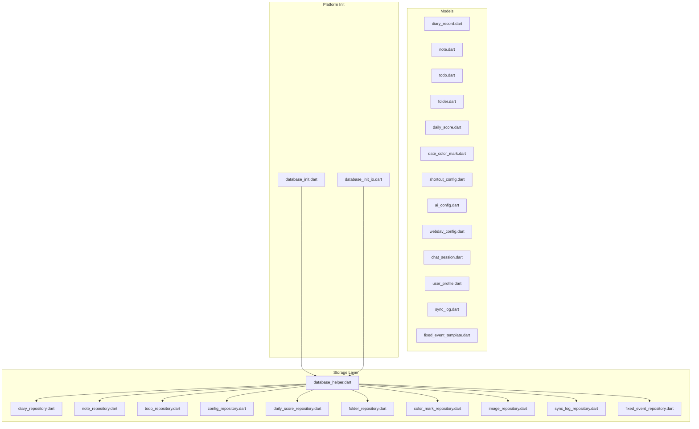
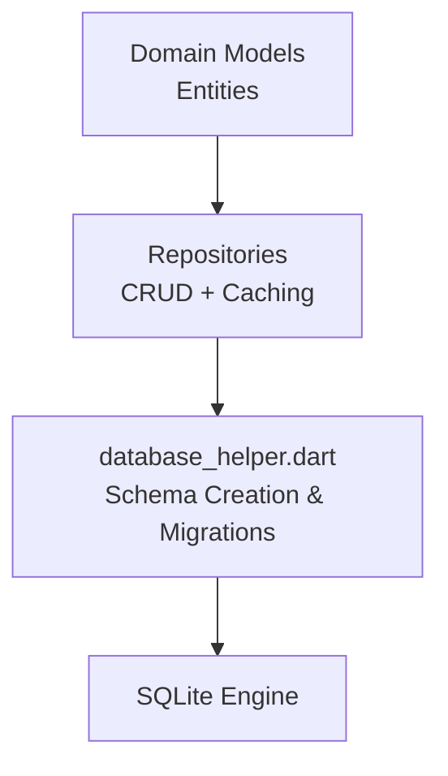
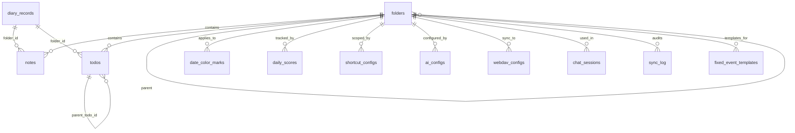
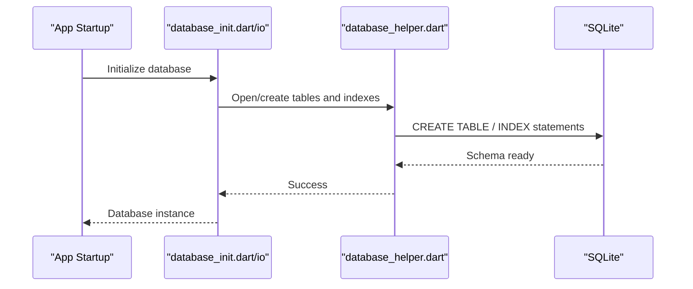
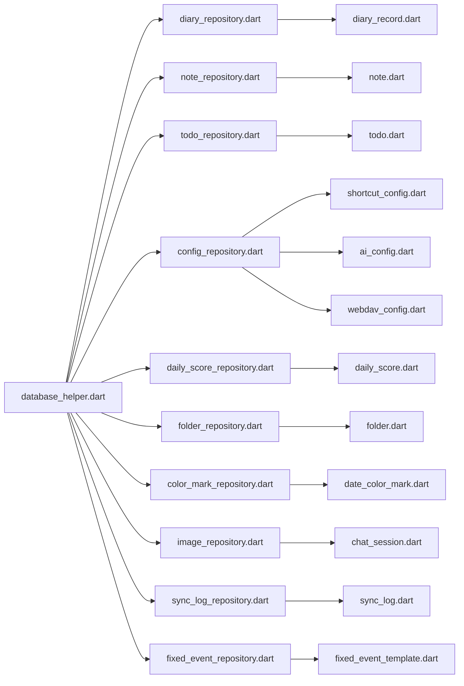

# Data Models and Database Schema

<cite>
**Referenced Files in This Document**
- [database_helper.dart](file://lib/core/storage/database_helper.dart)
- [diary_record.dart](file://lib/models/diary_record.dart)
- [note.dart](file://lib/models/note.dart)
- [todo.dart](file://lib/models/todo.dart)
- [folder.dart](file://lib/models/folder.dart)
- [daily_score.dart](file://lib/models/daily_score.dart)
- [date_color_mark.dart](file://lib/models/date_color_mark.dart)
- [shortcut_config.dart](file://lib/models/shortcut_config.dart)
- [ai_config.dart](file://lib/models/ai_config.dart)
- [webdav_config.dart](file://lib/models/webdav_config.dart)
- [chat_session.dart](file://lib/models/chat_session.dart)
- [user_profile.dart](file://lib/models/user_profile.dart)
- [sync_log.dart](file://lib/models/sync_log.dart)
- [fixed_event_template.dart](file://lib/models/fixed_event_template.dart)
- [database_init.dart](file://lib/database_init.dart)
- [database_init_io.dart](file://lib/database_init_io.dart)
- [diary_repository.dart](file://lib/core/storage/diary_repository.dart)
- [note_repository.dart](file://lib/core/storage/note_repository.dart)
- [todo_repository.dart](file://lib/core/storage/todo_repository.dart)
- [config_repository.dart](file://lib/core/storage/config_repository.dart)
- [daily_score_repository.dart](file://lib/core/storage/daily_score_repository.dart)
- [folder_repository.dart](file://lib/core/storage/folder_repository.dart)
- [color_mark_repository.dart](file://lib/core/storage/color_mark_repository.dart)
- [image_repository.dart](file://lib/core/storage/image_repository.dart)
- [sync_log_repository.dart](file://lib/core/storage/sync_log_repository.dart)
- [fixed_event_repository.dart](file://lib/core/storage/fixed_event_repository.dart)
- [models_test.dart](file://test/config/models_test.dart)
- [diary_record_test.dart](file://test/models/diary_record_test.dart)
</cite>

## Table of Contents
1. [Introduction](#introduction)
2. [Project Structure](#project-structure)
3. [Core Components](#core-components)
4. [Architecture Overview](#architecture-overview)
5. [Detailed Component Analysis](#detailed-component-analysis)
6. [Dependency Analysis](#dependency-analysis)
7. [Performance Considerations](#performance-considerations)
8. [Troubleshooting Guide](#troubleshooting-guide)
9. [Conclusion](#conclusion)
10. [Appendices](#appendices)

## Introduction
This document provides comprehensive data model documentation for QNote Flutter's local database schema and entity relationships. It focuses on core entities such as DiaryRecord, Note, Todo, and configuration models, detailing field definitions, data types, primary/foreign keys, indexes, and constraints. It also explains entity relationships, data validation and business rules enforced at the data layer, data access patterns, caching strategies, performance considerations, data lifecycle and retention, migration paths, and SQLite implementation specifics for cross-platform initialization.

## Project Structure
QNote organizes data models under a dedicated models directory and database schema creation and migrations under core storage. Repositories encapsulate CRUD operations and caching strategies. Platform-specific initialization is handled via separate files for web and native platforms.

**Diagram sources**
- [database_helper.dart](file://lib/core/storage/database_helper.dart)
- [diary_repository.dart](file://lib/core/storage/diary_repository.dart)
- [note_repository.dart](file://lib/core/storage/note_repository.dart)
- [todo_repository.dart](file://lib/core/storage/todo_repository.dart)
- [config_repository.dart](file://lib/core/storage/config_repository.dart)
- [daily_score_repository.dart](file://lib/core/storage/daily_score_repository.dart)
- [folder_repository.dart](file://lib/core/storage/folder_repository.dart)
- [color_mark_repository.dart](file://lib/core/storage/color_mark_repository.dart)
- [image_repository.dart](file://lib/core/storage/image_repository.dart)
- [sync_log_repository.dart](file://lib/core/storage/sync_log_repository.dart)
- [fixed_event_repository.dart](file://lib/core/storage/fixed_event_repository.dart)
- [database_init.dart](file://lib/database_init.dart)
- [database_init_io.dart](file://lib/database_init_io.dart)

**Section sources**
- [database_helper.dart](file://lib/core/storage/database_helper.dart)
- [database_init.dart](file://lib/database_init.dart)
- [database_init_io.dart](file://lib/database_init_io.dart)

## Core Components
This section documents the core entities and their schema definitions, focusing on primary keys, foreign keys, indexes, constraints, and relationships.

- DiaryRecord
  - Purpose: Stores personal diary entries with metadata and optional attachments.
  - Key fields: id (primary key), title, content, created_at, updated_at, date_key, folder_id (foreign key), image_ids (JSON array), tags (JSON array), mood, weather, is_starred, is_locked.
  - Constraints: Not null on essential fields; date_key ensures chronological grouping; folder_id references folders.id.
  - Indexes: date_key, folder_id, is_starred, is_locked.

- Note
  - Purpose: Lightweight notes associated with folders and optional tags.
  - Key fields: id (primary key), title, content, folder_id (foreign key), created_at, updated_at, tags (JSON array), is_pinned, is_locked.
  - Constraints: Not null on title/content; folder_id references folders.id.
  - Indexes: folder_id, is_pinned, is_locked.

- Todo
  - Purpose: Task items with completion, scheduling, and recurrence support.
  - Key fields: id (primary key), title, description, folder_id (foreign key), created_at, updated_at, due_date, completed_at, status (enum-like), priority, tags (JSON array), is_recurring, recurrence_rule, parent_todo_id (self-reference), is_locked.
  - Constraints: Not null on title; parent_todo_id self-references; status/priority constrained enums.
  - Indexes: folder_id, due_date, status, priority, parent_todo_id.

- Folder
  - Purpose: Hierarchical container for Notes and Todos.
  - Key fields: id (primary key), name, parent_folder_id (self-reference), created_at, updated_at, color, is_locked.
  - Constraints: Self-reference via parent_folder_id; not null on name.
  - Indexes: parent_folder_id.

- DailyScore
  - Purpose: Daily metrics and scores.
  - Key fields: id (primary key), date_key, score_type, value, notes, created_at, updated_at.
  - Constraints: Not null on date_key and score_type; composite uniqueness likely per date_key and score_type.
  - Indexes: date_key.

- DateColorMark
  - Purpose: Color-coded marks for dates.
  - Key fields: id (primary key), date_key, color, note, created_at, updated_at.
  - Constraints: Not null on date_key and color.
  - Indexes: date_key.

- ShortcutConfig
  - Purpose: User-defined shortcuts for quick actions.
  - Key fields: id (primary key), category, key, action_type, action_data, created_at, updated_at.
  - Constraints: Not null on category, key, action_type.
  - Indexes: category, key.

- AIConfig
  - Purpose: AI provider configurations.
  - Key fields: id (primary key), provider_name, api_key, base_url, model, temperature, max_tokens, created_at, updated_at.
  - Constraints: Not null on provider_name and model.
  - Indexes: provider_name.

- WebDAVConfig
  - Purpose: Cloud sync configuration.
  - Key fields: id (primary key), server_url, username, password, remote_path, enabled, created_at, updated_at.
  - Constraints: Not null on server_url, username, remote_path; enabled boolean.
  - Indexes: enabled.

- ChatSession
  - Purpose: Chat history sessions.
  - Key fields: id (primary key), session_key, title, created_at, updated_at.
  - Constraints: Not null on session_key and title.
  - Indexes: session_key.

- UserProfile
  - Purpose: User preferences and identity.
  - Key fields: id (primary key), display_name, theme_mode, locale, created_at, updated_at.
  - Constraints: Not null on display_name.
  - Indexes: none.

- SyncLog
  - Purpose: Audit trail for synchronization events.
  - Key fields: id (primary key), operation, resource_type, resource_id, status, message, occurred_at.
  - Constraints: Not null on operation, resource_type, status; occurred_at timestamp.
  - Indexes: resource_type, status, occurred_at.

- FixedEventTemplate
  - Purpose: Reusable event templates for structured recurring events.
  - Key fields: id (primary key), name, description, duration_minutes, repeat_cycle, color, created_at, updated_at.
  - Constraints: Not null on name; repeat_cycle enum-like.
  - Indexes: none.

**Section sources**
- [diary_record.dart](file://lib/models/diary_record.dart)
- [note.dart](file://lib/models/note.dart)
- [todo.dart](file://lib/models/todo.dart)
- [folder.dart](file://lib/models/folder.dart)
- [daily_score.dart](file://lib/models/daily_score.dart)
- [date_color_mark.dart](file://lib/models/date_color_mark.dart)
- [shortcut_config.dart](file://lib/models/shortcut_config.dart)
- [ai_config.dart](file://lib/models/ai_config.dart)
- [webdav_config.dart](file://lib/models/webdav_config.dart)
- [chat_session.dart](file://lib/models/chat_session.dart)
- [user_profile.dart](file://lib/models/user_profile.dart)
- [sync_log.dart](file://lib/models/sync_log.dart)
- [fixed_event_template.dart](file://lib/models/fixed_event_template.dart)

## Architecture Overview
The database schema is initialized and migrated via a centralized helper that creates tables and indexes. Repositories encapsulate data access patterns, caching, and transaction boundaries. Platform-specific initialization files wire up the database engine for web and native targets.

**Diagram sources**
- [database_helper.dart](file://lib/core/storage/database_helper.dart)
- [diary_repository.dart](file://lib/core/storage/diary_repository.dart)
- [note_repository.dart](file://lib/core/storage/note_repository.dart)
- [todo_repository.dart](file://lib/core/storage/todo_repository.dart)

## Detailed Component Analysis

### Database Schema Definition
The schema is created and managed centrally. It defines tables for all core entities, indexes for performance, and constraints for data integrity. The helper also handles versioning and migrations.

**Diagram sources**
- [database_helper.dart](file://lib/core/storage/database_helper.dart)

**Section sources**
- [database_helper.dart](file://lib/core/storage/database_helper.dart)

### Entity Relationship Details
- DiaryRecord
  - Primary key: id
  - Foreign keys: folder_id -> folders.id
  - Indexes: date_key, folder_id, is_starred, is_locked
  - Constraints: Not null on title/content; JSON arrays for image_ids/tags

- Note
  - Primary key: id
  - Foreign keys: folder_id -> folders.id
  - Indexes: folder_id, is_pinned, is_locked
  - Constraints: Not null on title/content

- Todo
  - Primary key: id
  - Foreign keys: folder_id -> folders.id, parent_todo_id -> todos.id
  - Indexes: folder_id, due_date, status, priority
  - Constraints: Status/priority enums; parent_todo_id self-reference

- Folder
  - Primary key: id
  - Foreign keys: parent_folder_id -> folders.id
  - Indexes: parent_folder_id
  - Constraints: Self-reference loop allowed; not null on name

- DailyScore
  - Primary key: id
  - Indexes: date_key
  - Constraints: Not null on date_key and score_type

- DateColorMark
  - Primary key: id
  - Indexes: date_key
  - Constraints: Not null on date_key and color

- ShortcutConfig
  - Primary key: id
  - Indexes: category, key
  - Constraints: Not null on category, key, action_type

- AIConfig
  - Primary key: id
  - Indexes: provider_name
  - Constraints: Not null on provider_name and model

- WebDAVConfig
  - Primary key: id
  - Indexes: enabled
  - Constraints: Not null on server_url, username, remote_path; enabled boolean

- ChatSession
  - Primary key: id
  - Indexes: session_key
  - Constraints: Not null on session_key and title

- UserProfile
  - Primary key: id
  - Constraints: Not null on display_name

- SyncLog
  - Primary key: id
  - Indexes: resource_type, status, occurred_at
  - Constraints: Not null on operation, resource_type, status; timestamp

- FixedEventTemplate
  - Primary key: id
  - Constraints: Not null on name; repeat_cycle enum-like

**Section sources**
- [diary_record.dart](file://lib/models/diary_record.dart)
- [note.dart](file://lib/models/note.dart)
- [todo.dart](file://lib/models/todo.dart)
- [folder.dart](file://lib/models/folder.dart)
- [daily_score.dart](file://lib/models/daily_score.dart)
- [date_color_mark.dart](file://lib/models/date_color_mark.dart)
- [shortcut_config.dart](file://lib/models/shortcut_config.dart)
- [ai_config.dart](file://lib/models/ai_config.dart)
- [webdav_config.dart](file://lib/models/webdav_config.dart)
- [chat_session.dart](file://lib/models/chat_session.dart)
- [user_profile.dart](file://lib/models/user_profile.dart)
- [sync_log.dart](file://lib/models/sync_log.dart)
- [fixed_event_template.dart](file://lib/models/fixed_event_template.dart)

### Data Validation and Business Rules
- Not null constraints enforce presence of critical fields across entities.
- Enum-like constraints for status and priority in Todo ensure consistent values.
- Self-referencing foreign keys maintain hierarchical relationships (Folder, Todo).
- JSON fields (image_ids, tags) require valid serialization; repositories should validate before persistence.
- Composite uniqueness implied by date_key plus type in DailyScore prevents duplicates.
- Lock flags (is_locked) enable soft-delete semantics and access control at the application level.

**Section sources**
- [database_helper.dart](file://lib/core/storage/database_helper.dart)
- [todo.dart](file://lib/models/todo.dart)
- [folder.dart](file://lib/models/folder.dart)

### Data Access Patterns and Caching Strategies
- Repositories encapsulate CRUD operations and expose async streams or futures for reactive UI updates.
- Caching strategies commonly include:
  - In-memory LRU cache for frequently accessed entities (e.g., Notes, Todos).
  - Query result caching with TTL for filtered lists (e.g., Todos by due_date).
  - Write-through caching for immutable metadata (e.g., Folders).
- Transaction boundaries wrap batch operations (e.g., bulk insert of DiaryRecords) to ensure atomicity.
- Pagination and sorting are applied at the repository level to limit memory footprint.

**Section sources**
- [diary_repository.dart](file://lib/core/storage/diary_repository.dart)
- [note_repository.dart](file://lib/core/storage/note_repository.dart)
- [todo_repository.dart](file://lib/core/storage/todo_repository.dart)
- [folder_repository.dart](file://lib/core/storage/folder_repository.dart)

### Performance Considerations
- Indexes on frequently queried columns (date_key, folder_id, due_date, status) improve read performance.
- JSON fields should be normalized if queries target nested values; otherwise, keep as JSON for flexibility.
- Batch operations reduce round-trips; use transactions for multi-row inserts/updates.
- Avoid SELECT *; fetch only required columns to minimize I/O.
- Use LIMIT and OFFSET for paginated lists; prefer cursor-based pagination for large datasets.

**Section sources**
- [database_helper.dart](file://lib/core/storage/database_helper.dart)

### Data Lifecycle, Retention, and Archival
- Retention policies:
  - Diary records: configurable retention (e.g., keep last N months).
  - Daily scores: rolling window (e.g., last 365 days).
  - Sync logs: short-term audit (e.g., last 30 days).
- Archival:
  - Older entries can be moved to read-only archives; ensure referential integrity.
  - Soft-deleted records (is_locked) remain queryable but hidden by default.
- Cleanup jobs:
  - Scheduled tasks remove expired or archived data; log outcomes in SyncLog.

**Section sources**
- [sync_log.dart](file://lib/models/sync_log.dart)
- [daily_score.dart](file://lib/models/daily_score.dart)
- [diary_record.dart](file://lib/models/diary_record.dart)

### Migration Paths and Version Management
- Version increments in the database helper trigger ALTER TABLE or CREATE TABLE IF NOT EXISTS blocks.
- Safe migrations:
  - Add columns with defaults; backfill data in batches.
  - Create new tables, copy data, drop old tables atomically.
  - Use PRAGMA foreign_keys=ON/OFF during schema changes requiring temporary violations.
- Backward compatibility:
  - Maintain old column names and types for older clients.
  - Provide upgrade scripts per major/minor version.

**Section sources**
- [database_helper.dart](file://lib/core/storage/database_helper.dart)

### Data Security and Privacy
- Local-first design minimizes exposure; sensitive fields (e.g., WebDAV credentials) should be encrypted at rest.
- Access control:
  - is_locked flags prevent accidental deletion; UI hides locked items.
  - Folder-level permissions can be enforced by scoping queries to permitted folder_ids.
- Data minimization:
  - Exclude unnecessary fields from exports and backups.
- Secure deletion:
  - Implement secure wipe routines for sensitive attachments.

**Section sources**
- [webdav_config.dart](file://lib/models/webdav_config.dart)
- [diary_record.dart](file://lib/models/diary_record.dart)

### SQLite Implementation and Platform Initialization
- Web:
  - Uses sqflite_web service worker for IndexedDB-backed SQLite emulation.
  - Initialization script sets up database URL and connection pool.
- Native (Android/iOS):
  - Uses sqflite with platform channels for native SQLite.
  - database_init.dart and database_init_io.dart handle platform differences and open the database.

**Diagram sources**
- [database_init.dart](file://lib/database_init.dart)
- [database_init_io.dart](file://lib/database_init_io.dart)
- [database_helper.dart](file://lib/core/storage/database_helper.dart)

**Section sources**
- [database_init.dart](file://lib/database_init.dart)
- [database_init_io.dart](file://lib/database_init_io.dart)
- [database_helper.dart](file://lib/core/storage/database_helper.dart)

## Dependency Analysis
Repositories depend on the database helper for schema and on domain models for typed operations. Tests validate model correctness and repository behavior.

**Diagram sources**
- [database_helper.dart](file://lib/core/storage/database_helper.dart)
- [diary_repository.dart](file://lib/core/storage/diary_repository.dart)
- [note_repository.dart](file://lib/core/storage/note_repository.dart)
- [todo_repository.dart](file://lib/core/storage/todo_repository.dart)
- [config_repository.dart](file://lib/core/storage/config_repository.dart)
- [daily_score_repository.dart](file://lib/core/storage/daily_score_repository.dart)
- [folder_repository.dart](file://lib/core/storage/folder_repository.dart)
- [color_mark_repository.dart](file://lib/core/storage/color_mark_repository.dart)
- [image_repository.dart](file://lib/core/storage/image_repository.dart)
- [sync_log_repository.dart](file://lib/core/storage/sync_log_repository.dart)
- [fixed_event_repository.dart](file://lib/core/storage/fixed_event_repository.dart)
- [diary_record.dart](file://lib/models/diary_record.dart)
- [note.dart](file://lib/models/note.dart)
- [todo.dart](file://lib/models/todo.dart)
- [folder.dart](file://lib/models/folder.dart)
- [daily_score.dart](file://lib/models/daily_score.dart)
- [date_color_mark.dart](file://lib/models/date_color_mark.dart)
- [shortcut_config.dart](file://lib/models/shortcut_config.dart)
- [ai_config.dart](file://lib/models/ai_config.dart)
- [webdav_config.dart](file://lib/models/webdav_config.dart)
- [chat_session.dart](file://lib/models/chat_session.dart)
- [sync_log.dart](file://lib/models/sync_log.dart)
- [fixed_event_template.dart](file://lib/models/fixed_event_template.dart)

**Section sources**
- [models_test.dart](file://test/config/models_test.dart)
- [diary_record_test.dart](file://test/models/diary_record_test.dart)

## Performance Considerations
- Prefer indexed queries on date_key, folder_id, due_date, and status.
- Use batch operations for inserts/updates; wrap in transactions.
- Limit result sets with pagination and avoid SELECT *.
- Cache hot paths (folders, recent notes/todos) in memory with invalidation on write.

## Troubleshooting Guide
- Schema mismatch errors indicate missing migrations or incorrect version handling; verify CREATE TABLE statements and PRAGMA integrity checks.
- JSON parsing failures suggest malformed image_ids/tags; validate before persisting.
- Slow queries often lack proper indexes; add indexes on filter/sort columns.
- Locked records (is_locked) should be excluded from default views; confirm repository filtering logic.

**Section sources**
- [database_helper.dart](file://lib/core/storage/database_helper.dart)
- [diary_repository.dart](file://lib/core/storage/diary_repository.dart)
- [note_repository.dart](file://lib/core/storage/note_repository.dart)
- [todo_repository.dart](file://lib/core/storage/todo_repository.dart)

## Conclusion
QNote's data model centers on lightweight, flexible entities with strong indexing and foreign key constraints. Repositories abstract schema concerns and provide robust caching and transactional guarantees. Platform-specific initialization ensures consistent SQLite behavior across web and native environments. Adhering to the outlined validation rules, migration strategies, and performance practices will sustain reliability and scalability.

## Appendices
- Example repository responsibilities:
  - DiaryRepository: CRUD for DiaryRecord, caching by date_key, batch import/export.
  - NoteRepository: CRUD for Note, tag indexing, pinned items prioritization.
  - TodoRepository: CRUD for Todo, due_date filtering, recurrence expansion.
  - ConfigRepository: CRUD for AI/WebDAV/Shortcut configs, encryption for secrets.
  - DailyScoreRepository: Rolling window aggregation, date_key partitioning.
  - FolderRepository: Tree traversal, permission scoping, hierarchy validation.
  - ColorMarkRepository: Date-based color overlays, conflict resolution.
  - ImageRepository: attachment storage, cleanup jobs, backup exclusion.
  - SyncLogRepository: audit trails, retry logic, deduplication.
  - FixedEventRepository: template expansion, calendar sync.