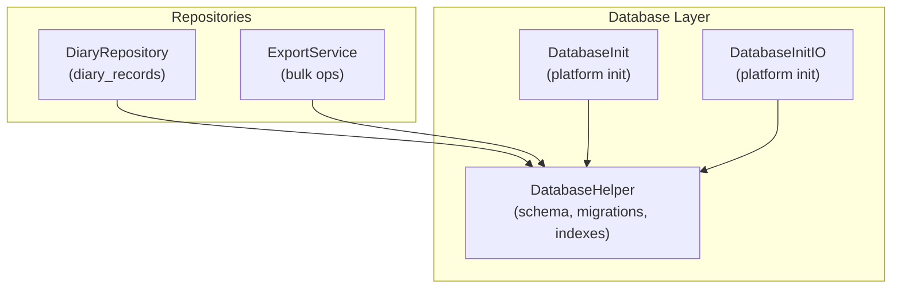
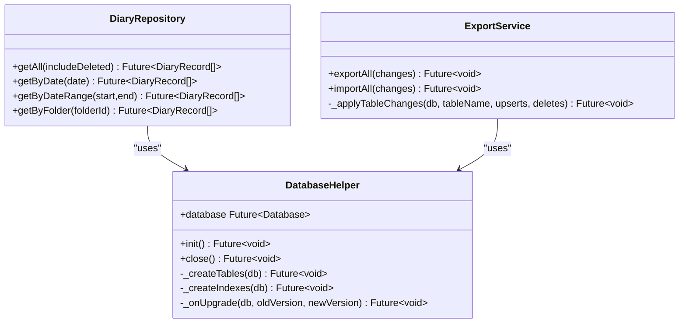
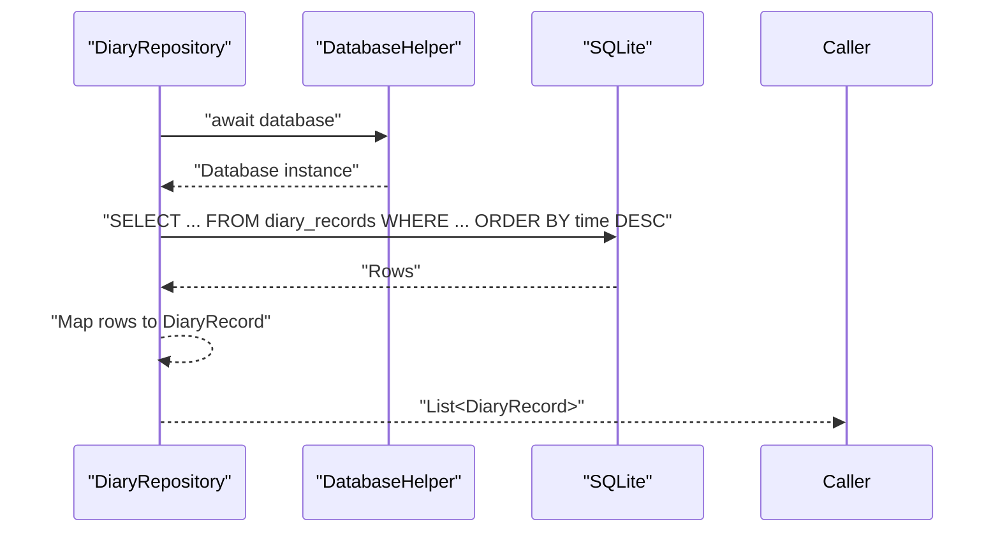
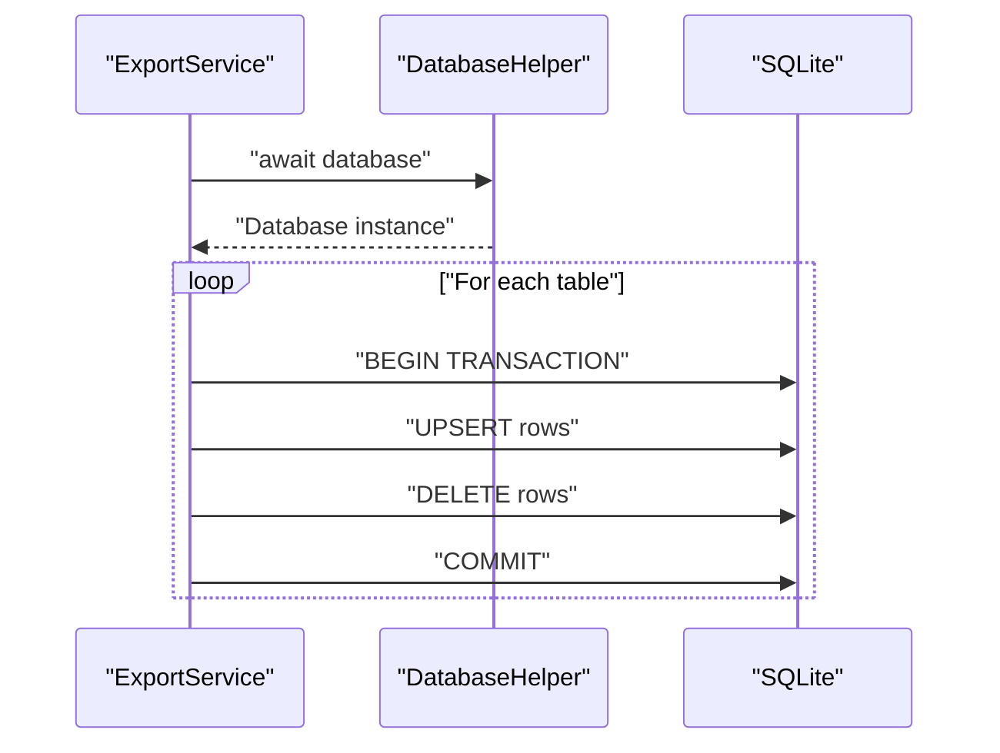
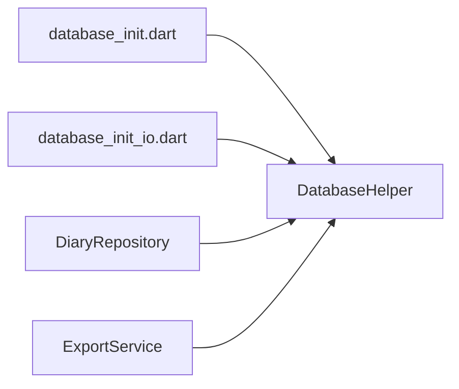

# Database Schema and Relationships

<cite>
**Referenced Files in This Document**
- [database_helper.dart](file://lib/core/storage/database_helper.dart)
- [database_init.dart](file://lib/database_init.dart)
- [database_init_io.dart](file://lib/database_init_io.dart)
- [diary_repository.dart](file://lib/core/storage/diary_repository.dart)
- [export_service.dart](file://lib/core/export/export_service.dart)
</cite>

## Table of Contents
1. [Introduction](#introduction)
2. [Project Structure](#project-structure)
3. [Core Components](#core-components)
4. [Architecture Overview](#architecture-overview)
5. [Detailed Component Analysis](#detailed-component-analysis)
6. [Dependency Analysis](#dependency-analysis)
7. [Performance Considerations](#performance-considerations)
8. [Troubleshooting Guide](#troubleshooting-guide)
9. [Conclusion](#conclusion)

## Introduction
This document describes the SQLite database schema and relationships used by QNote Flutter. It covers table definitions, primary and foreign key constraints, indexing strategies, platform-specific initialization, migration management, and practical query patterns. Security and backup considerations are also addressed.

## Project Structure
The database layer is organized around a central helper that manages schema creation, migrations, and indexes, and repositories that encapsulate data access patterns for domain entities.

**Diagram sources**
- [database_helper.dart:323-401](file://lib/core/storage/database_helper.dart#L323-L401)
- [database_init.dart](file://lib/database_init.dart)
- [database_init_io.dart](file://lib/database_init_io.dart)
- [diary_repository.dart:13-76](file://lib/core/storage/diary_repository.dart#L13-L76)
- [export_service.dart:98-1017](file://lib/core/export/export_service.dart#L98-L1017)

**Section sources**
- [database_helper.dart:323-401](file://lib/core/storage/database_helper.dart#L323-L401)
- [database_init.dart](file://lib/database_init.dart)
- [database_init_io.dart](file://lib/database_init_io.dart)
- [diary_repository.dart:13-76](file://lib/core/storage/diary_repository.dart#L13-L76)
- [export_service.dart:98-1017](file://lib/core/export/export_service.dart#L98-L1017)

## Core Components
- DatabaseHelper: Creates tables, indexes, and applies schema upgrades.
- Repositories: Encapsulate CRUD and query logic per entity.
- ExportService: Performs bulk insert/update/delete across tables.
- Platform initializers: Configure database factory per platform.

Key responsibilities:
- Schema definition and enforcement via CREATE TABLE statements.
- Index maintenance for performance-sensitive queries.
- Migration handling for evolving schema versions.
- Cross-platform database initialization hooks.

**Section sources**
- [database_helper.dart:275-321](file://lib/core/storage/database_helper.dart#L275-L321)
- [database_helper.dart:323-401](file://lib/core/storage/database_helper.dart#L323-L401)
- [database_helper.dart:358-401](file://lib/core/storage/database_helper.dart#L358-L401)
- [diary_repository.dart:13-76](file://lib/core/storage/diary_repository.dart#L13-L76)
- [export_service.dart:98-1017](file://lib/core/export/export_service.dart#L98-L1017)

## Architecture Overview
The database architecture centers on a singleton helper that ensures schema consistency and performance. Repositories depend on the helper for database access, while export operations coordinate multi-table updates.

**Diagram sources**
- [database_helper.dart:323-401](file://lib/core/storage/database_helper.dart#L323-L401)
- [diary_repository.dart:13-76](file://lib/core/storage/diary_repository.dart#L13-L76)
- [export_service.dart:98-1017](file://lib/core/export/export_service.dart#L98-L1017)

## Detailed Component Analysis

### Database Schema Definition
The helper creates core tables and enforces primary keys. Below are the table definitions derived from the schema creation routine.

- diary_records
  - Columns: id (TEXT, PK), time (TEXT), content (TEXT), folder_id (TEXT), is_deleted (INTEGER), tag_entries (TEXT), color_mark (TEXT), display_tag (TEXT), body_state (TEXT), created_at (TEXT), updated_at (TEXT)
  - Notes: Uses TEXT for timestamps; indexes optimized for time range queries and filtering by deletion status and folder.

- notes
  - Columns: id (TEXT, PK), title (TEXT), content (TEXT), folder_id (TEXT), is_deleted (INTEGER), sort_order (INTEGER), created_at (TEXT), updated_at (TEXT)
  - Notes: Includes sort_order for ordering within folders.

- todos
  - Columns: id (TEXT, PK), title (TEXT), is_completed (INTEGER), is_long_term (INTEGER), folder_id (TEXT), is_deleted (INTEGER), created_at (TEXT), updated_at (TEXT)
  - Notes: Flags for completion and long-term tasks; indexed for fast filtering.

- folders
  - Columns: id (TEXT, PK), name (TEXT), type (TEXT), parent_id (TEXT), created_at (TEXT), updated_at (TEXT)
  - Notes: Hierarchical structure via parent_id; indexed by type and parent_id.

- chat_sessions
  - Columns: id (TEXT, PK), title (TEXT), created_at (TEXT), updated_at (TEXT)
  - Notes: Indexed by updated_at for recent sessions.

- date_color_marks
  - Columns: id (TEXT, PK), date (TEXT), color (TEXT), created_at (TEXT), updated_at (TEXT)
  - Notes: Indexed by date for quick lookups.

- sync_log
  - Columns: id (TEXT, PK), timestamp (TEXT), operation (TEXT), table_name (TEXT), row_id (TEXT), payload (TEXT), status (TEXT)
  - Notes: Indexed by timestamp for audit trails.

- daily_scores
  - Columns: id (TEXT, PK), date (TEXT), total_score (INTEGER), dimension_scores (TEXT), summary (TEXT), suggestions (TEXT), record_count (INTEGER), created_at (TEXT), updated_at (TEXT)
  - Notes: Indexed by date for aggregation queries.

- body_states
  - Columns: id (TEXT, PK), name (TEXT), severity (TEXT), duration (TEXT), triggers (TEXT), notes (TEXT), timestamp (TEXT), created_at (TEXT), updated_at (TEXT)

- fixed_event_templates
  - Columns: id (TEXT, PK), name (TEXT), start_time (TEXT), end_time (TEXT), content (TEXT), tags (TEXT), tag_fields (TEXT), sort_order (INTEGER), is_enabled (INTEGER), created_at (TEXT), updated_at (TEXT)

Constraints:
- Primary keys are defined per table.
- No explicit foreign keys are declared in the provided schema; referential integrity is enforced at the application level.

**Section sources**
- [database_helper.dart:275-321](file://lib/core/storage/database_helper.dart#L275-L321)
- [database_helper.dart:382-396](file://lib/core/storage/database_helper.dart#L382-L396)

### Indexing Strategy
Indexes are created to optimize frequent queries:
- diary_records: time, is_deleted, display_tag, folder_id, updated_at
- notes: folder_id, is_deleted, updated_at
- todos: is_completed, is_deleted, is_long_term, folder_id
- folders: type, parent_id
- chat_sessions: updated_at
- date_color_marks: date
- sync_log: timestamp
- daily_scores: date

These indexes support:
- Chronological retrieval (time-based sorting and range scans)
- Deletion filtering and soft-delete semantics
- Folder-scoped queries
- Completion and long-term task filtering
- Recent activity and audit logging

**Section sources**
- [database_helper.dart:323-358](file://lib/core/storage/database_helper.dart#L323-L358)

### Migration Management
Schema evolves through versioned upgrades:
- Version 11: Adds sort_order to notes.
- Version 12: Adds tag_entries, color_mark, display_tag, body_state to diary_records; introduces daily_scores table and its index.

Upgrade logic is guarded with try/catch blocks to tolerate idempotent operations and handle potential failures gracefully.

**Section sources**
- [database_helper.dart:358-401](file://lib/core/storage/database_helper.dart#L358-L401)
- [database_helper.dart:341-384](file://lib/core/storage/database_helper.dart#L341-L384)

### Query Patterns and Joins
Representative query patterns observed in repositories:

- Get all diary entries with optional inclusion of deleted items, ordered by time descending.
- Range queries on diary_records using time boundaries and is_deleted filter.
- Filtering by folder_id for both notes and todos.
- Aggregation-style grouping by date for daily scores.

While explicit JOINs are not shown in the examined files, the schema supports:
- Folder hierarchy navigation via folders.parent_id
- Tag-based filtering via display_tag and tag_entries fields
- Color marking associations via date_color_marks.date

**Diagram sources**
- [diary_repository.dart:13-21](file://lib/core/storage/diary_repository.dart#L13-L21)

**Section sources**
- [diary_repository.dart:13-76](file://lib/core/storage/diary_repository.dart#L13-L76)

### Bulk Operations and Transactions
ExportService coordinates bulk inserts/updates/deletes across multiple tables. It:
- Parses change sets per table (diary_records, notes, todos, folders, ai_configs).
- Applies upserts and deletes atomically per table.
- Uses database transactions to maintain consistency during large-scale sync/import.

**Diagram sources**
- [export_service.dart:98-1017](file://lib/core/export/export_service.dart#L98-L1017)

**Section sources**
- [export_service.dart:98-1017](file://lib/core/export/export_service.dart#L98-L1017)

### Platform Initialization
- database_init.dart: Entry point for initializing database factory on supported platforms.
- database_init_io.dart: Placeholder for IO-specific initialization hook.

These files integrate with sqflite to configure the database engine per platform.

**Section sources**
- [database_init.dart](file://lib/database_init.dart)
- [database_init_io.dart](file://lib/database_init_io.dart)

## Dependency Analysis
- Repositories depend on DatabaseHelper for database access.
- ExportService depends on DatabaseHelper for transactional bulk operations.
- Platform initialization files depend on the database factory configuration.

**Diagram sources**
- [database_init.dart](file://lib/database_init.dart)
- [database_init_io.dart](file://lib/database_init_io.dart)
- [database_helper.dart:323-401](file://lib/core/storage/database_helper.dart#L323-L401)
- [diary_repository.dart:10-11](file://lib/core/storage/diary_repository.dart#L10-L11)
- [export_service.dart:98-1017](file://lib/core/export/export_service.dart#L98-L1017)

**Section sources**
- [database_helper.dart:323-401](file://lib/core/storage/database_helper.dart#L323-L401)
- [diary_repository.dart:10-11](file://lib/core/storage/diary_repository.dart#L10-L11)
- [export_service.dart:98-1017](file://lib/core/export/export_service.dart#L98-L1017)

## Performance Considerations
- Index coverage: Time-based queries benefit from indexes on time, updated_at, and date fields.
- Soft-deleted records: Filter by is_deleted to avoid scanning tombstoned rows.
- Range scans: Use boundary conditions on time/date to leverage indexes effectively.
- Bulk operations: Wrap multiple writes in transactions to reduce overhead.
- JSON/text fields: tag_entries, tag_fields, dimension_scores are stored as TEXT; consider normalization if query complexity grows.

[No sources needed since this section provides general guidance]

## Troubleshooting Guide
- Upgrade failures: The upgrade routine catches exceptions and logs debug messages; check logs for ALTER TABLE errors and verify column existence.
- Missing indexes: If queries become slow, confirm index creation succeeded and re-run initialization if needed.
- Transaction conflicts: ExportService wraps operations in transactions; ensure proper rollback on errors.
- Platform-specific issues: Verify database_init and database_init_io are invoked appropriately for each platform.

**Section sources**
- [database_helper.dart:358-401](file://lib/core/storage/database_helper.dart#L358-L401)

## Conclusion
QNote Flutter’s SQLite schema emphasizes flexibility and performance through strategic indexing and versioned migrations. The repository pattern isolates query logic, while bulk operations ensure reliable synchronization. The absence of explicit foreign keys relies on application-level referential integrity, which is manageable given the modest relational scope.

[No sources needed since this section summarizes without analyzing specific files]