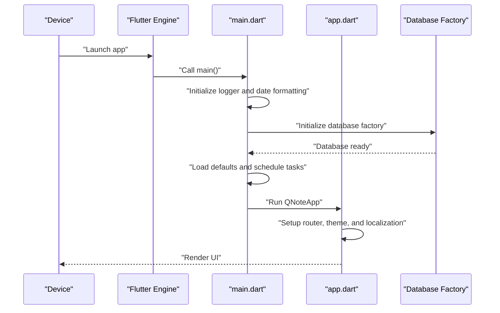
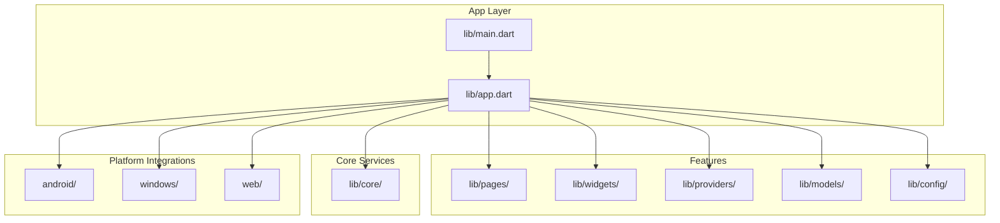

# Getting Started

<cite>
**Referenced Files in This Document**
- [pubspec.yaml](file://pubspec.yaml)
- [README.md](file://README.md)
- [lib/main.dart](file://lib/main.dart)
- [lib/app.dart](file://lib/app.dart)
- [android/app/src/main/AndroidManifest.xml](file://android/app/src/main/AndroidManifest.xml)
- [windows/flutter/CMakeLists.txt](file://windows/flutter/CMakeLists.txt)
- [analysis_options.yaml](file://analysis_options.yaml)
</cite>

## Table of Contents
1. [Introduction](#introduction)
2. [Prerequisites and System Requirements](#prerequisites-and-system-requirements)
3. [Installation Steps](#installation-steps)
4. [Development Environment Setup](#development-environment-setup)
5. [First Run and Initial Walkthrough](#first-run-and-initial-walkthrough)
6. [Running on Different Platforms](#running-on-different-platforms)
7. [Project Structure Overview](#project-structure-overview)
8. [Common Setup Issues and Troubleshooting](#common-setup-issues-and-troubleshooting)
9. [Basic Usage Examples](#basic-usage-examples)
10. [Conclusion](#conclusion)

## Introduction
This guide helps you set up and run QNote Flutter, a personal knowledge management application built with Flutter. It covers prerequisites, installation, environment configuration, platform-specific setup, and first-time usage. Whether you're new to Flutter or an experienced developer, you can quickly get QNote running on Android, iOS, Web, and Windows.

## Prerequisites and System Requirements
- Operating System:
  - Windows, macOS, or Linux
- Flutter SDK:
  - Flutter version compatible with the project's SDK constraint
- Dart SDK:
  - Matches the Flutter SDK requirement
- Android Development:
  - Android Studio or VS Code with Flutter/Dart extensions
  - Android SDK, Android Emulator, or a physical Android device
- iOS Development:
  - Xcode (macOS required)
  - iOS Simulator or a physical iOS device
- Web Development:
  - Modern web browser for testing
- Windows Desktop:
  - Visual Studio 2022 or later with CMake tools
  - Windows 10 or higher

Key references:
- Flutter SDK constraint and dependencies are defined in the project configuration.
- Platform support is indicated by the presence of platform-specific folders and manifests.

**Section sources**
- [pubspec.yaml:6-42](file://pubspec.yaml#L6-L42)
- [README.md:1-18](file://README.md#L1-L18)

## Installation Steps
Follow these steps to prepare your development environment and install dependencies:

1. Install Flutter SDK
   - Download and install Flutter from the official site.
   - Ensure the Flutter toolchain is added to your PATH.
   - Verify installation with the Flutter doctor command.

2. Install IDE
   - Install Android Studio or VS Code.
   - Install the Flutter and Dart extensions/plugins.

3. Clone or open the project
   - Open the project folder in your IDE.
   - Ensure the working directory matches the repository root.

4. Install dependencies
   - Navigate to the project root.
   - Run the package manager to fetch dependencies defined in the configuration.

5. Configure platform-specific tools
   - Android: Install Android Studio, Android SDK, and set up an emulator or connect a device.
   - iOS: Install Xcode and set up a simulator or connect a device.
   - Web: Enable web target if needed.
   - Windows: Install Visual Studio 2022 with CMake and appropriate workload components.

6. Verify setup
   - Run the Flutter doctor command to check for missing tools or misconfigurations.

Key references:
- Dependencies and SDK constraints are declared in the project configuration.
- Linting rules and analysis options are configured for code quality.

**Section sources**
- [pubspec.yaml:6-42](file://pubspec.yaml#L6-L42)
- [analysis_options.yaml:8-29](file://analysis_options.yaml#L8-L29)

## Development Environment Setup
Configure your development environment for smooth building and testing:

- Android
  - Use Android Studio to create or manage AVDs.
  - Ensure the emulator runs with sufficient performance settings.
  - Connect a physical Android device via USB with developer options enabled.

- iOS
  - Use Xcode to create or select a simulator.
  - Ensure your Apple ID and provisioning profiles are configured if deploying to a physical device.

- Web
  - Enable the web device in Flutter and run the app in a browser.
  - Some plugins may require additional web configuration.

- Windows
  - Use Visual Studio to build and run the Windows desktop app.
  - Ensure CMake and the required Windows SDK components are installed.

Platform-specific configuration highlights:
- Android permissions and app components are declared in the Android manifest.
- Windows build integration is handled via the Flutter wrapper CMake configuration.

**Section sources**
- [android/app/src/main/AndroidManifest.xml:1-112](file://android/app/src/main/AndroidManifest.xml#L1-L112)
- [windows/flutter/CMakeLists.txt:1-110](file://windows/flutter/CMakeLists.txt#L1-L110)

## First Run and Initial Walkthrough
After installing dependencies and configuring your environment, run the application:

1. Start the app
   - Select your target platform (Android, iOS, Web, or Windows).
   - Launch the app from your IDE or use the Flutter CLI.

2. Understand initialization
   - The app initializes logging, date formatting, database factory, and default configurations.
   - Notifications and scheduled synchronization are prepared during startup.

3. Explore the main UI
   - The app sets up routing, theming, localization delegates, and lifecycle-aware navigation.
   - Providers handle state for diary entries and todos.

4. Review key startup flow
   - The main entrypoint ensures initialization tasks complete before launching the UI.
   - The app checks for auto-sync settings and starts reminder checks.

**Diagram sources**
- [lib/main.dart:12-30](file://lib/main.dart#L12-L30)
- [lib/app.dart:78-121](file://lib/app.dart#L78-L121)

**Section sources**
- [lib/main.dart:12-30](file://lib/main.dart#L12-L30)
- [lib/app.dart:19-121](file://lib/app.dart#L19-L121)

## Running on Different Platforms
QNote supports multiple platforms. Use the following guidance to run on each:

- Android
  - Ensure Android Studio and an emulator/device are available.
  - The Android manifest declares permissions and components required by the app.

- iOS
  - Use Xcode to run on a simulator or device.
  - Ensure signing and provisioning profiles are configured if targeting physical devices.

- Web
  - Enable the web device and run the app in a browser.
  - Some native plugins may require polyfills or alternative implementations.

- Windows
  - Use Visual Studio to build and run the Windows desktop app.
  - The Flutter wrapper CMake configuration integrates with the Windows build system.

Platform capabilities and permissions:
- Android manifest defines internet access, storage, camera, notifications, and app widgets.
- Windows build integration is managed via the Flutter-generated CMake files.

**Section sources**
- [android/app/src/main/AndroidManifest.xml:1-112](file://android/app/src/main/AndroidManifest.xml#L1-L112)
- [windows/flutter/CMakeLists.txt:1-110](file://windows/flutter/CMakeLists.txt#L1-L110)

## Project Structure Overview
QNote follows a layered structure typical of Flutter applications. Key areas include:

- lib/main.dart: Application entrypoint and initialization sequence
- lib/app.dart: Root widget with routing, theming, localization, and lifecycle handling
- lib/core/: Core services and utilities (storage, notifications, network)
- lib/pages/, lib/widgets/, lib/providers/: Feature modules and reusable UI components
- lib/models/: Data models
- lib/config/: Configuration helpers
- android/: Android-specific code and resources
- windows/: Windows desktop integration
- web/: Web assets and service worker configuration
- pubspec.yaml: Dependencies and Flutter configuration
- analysis_options.yaml: Linting and analysis rules

**Diagram sources**
- [lib/main.dart:1-31](file://lib/main.dart#L1-L31)
- [lib/app.dart:1-124](file://lib/app.dart#L1-L124)
- [pubspec.yaml:56-70](file://pubspec.yaml#L56-L70)

**Section sources**
- [lib/main.dart:1-31](file://lib/main.dart#L1-L31)
- [lib/app.dart:1-124](file://lib/app.dart#L1-L124)
- [pubspec.yaml:56-70](file://pubspec.yaml#L56-L70)

## Common Setup Issues and Troubleshooting
Below are frequent setup problems and their resolutions:

- Flutter doctor reports missing tools
  - Install missing SDKs or IDE components as indicated by the doctor output.
  - Ensure PATH includes Flutter and platform SDK locations.

- Android build failures
  - Verify Android Studio, SDK, and emulator are properly installed.
  - Accept licenses and update SDK components.
  - Check Android manifest permissions and Gradle configuration.

- iOS build failures
  - Ensure Xcode is installed and up to date.
  - Configure signing and provisioning profiles for device deployment.
  - Clean derived data if needed.

- Web build warnings
  - Some plugins may require web-specific configuration or polyfills.
  - Test in multiple browsers to confirm compatibility.

- Windows build integration issues
  - Confirm Visual Studio 2022 with CMake and Windows SDK components are installed.
  - Rebuild the Windows runner after updating Flutter.

- Dependency resolution errors
  - Run the package manager to refresh dependencies.
  - Clear caches if stale lockfiles cause conflicts.

- Localization and theming issues
  - Ensure font assets and localization delegates are correctly configured.
  - Verify supported locales and theme providers.

- Database initialization errors
  - Confirm database factory initialization completes before use.
  - Check platform-specific initialization files for IO vs non-IO targets.

**Section sources**
- [pubspec.yaml:6-42](file://pubspec.yaml#L6-L42)
- [android/app/src/main/AndroidManifest.xml:1-112](file://android/app/src/main/AndroidManifest.xml#L1-L112)
- [windows/flutter/CMakeLists.txt:1-110](file://windows/flutter/CMakeLists.txt#L1-L110)
- [lib/main.dart:12-30](file://lib/main.dart#L12-L30)
- [lib/app.dart:78-121](file://lib/app.dart#L78-L121)

## Basic Usage Examples
Once the app is running, here are common tasks you can perform:

- View and navigate the main screens
  - Use the router to move between diary, notes, todos, AI, and statistics shells.
  - The app prevents accidental back navigation from shell routes.

- Manage entries and todos
  - Use providers to refresh and update lists when the app resumes.
  - Toggle reminders and scheduled notifications.

- Customize appearance
  - Switch between light and dark themes.
  - Adjust accent color via theme providers.

- Handle lifecycle events
  - Providers refresh automatically when the app becomes active.

These behaviors are implemented in the root widget and initialization sequence.

**Section sources**
- [lib/app.dart:19-121](file://lib/app.dart#L19-L121)
- [lib/main.dart:12-30](file://lib/main.dart#L12-L30)

## Conclusion
You now have the essentials to install, configure, and run QNote Flutter across Android, iOS, Web, and Windows. Start with Flutter doctor and platform SDKs, install dependencies, and launch the app. Explore the UI, providers, and core services to become familiar with the codebase. Refer to the troubleshooting section for quick fixes and consult the project configuration files for platform-specific details.