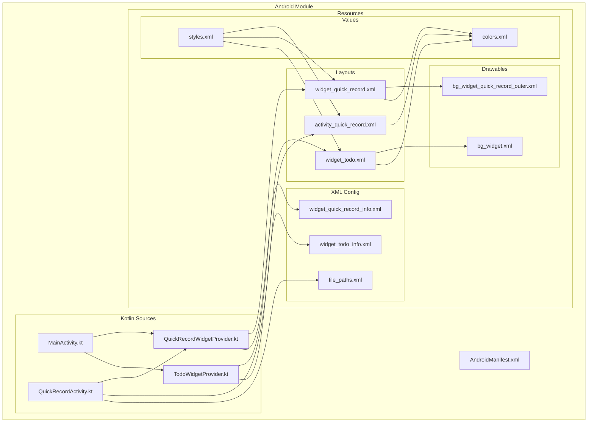
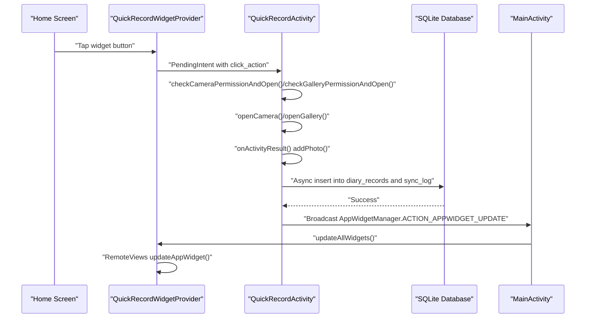
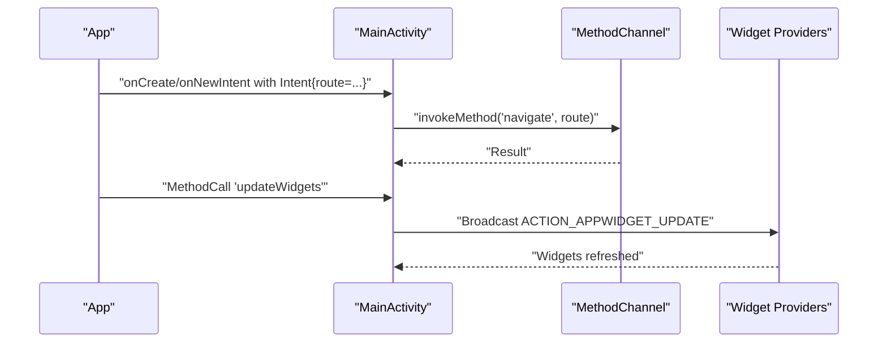
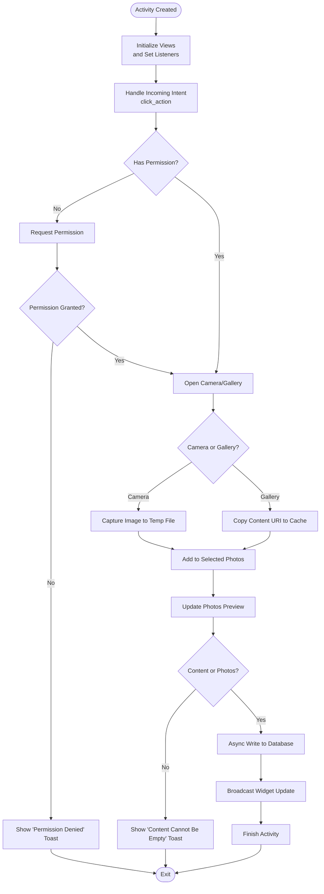
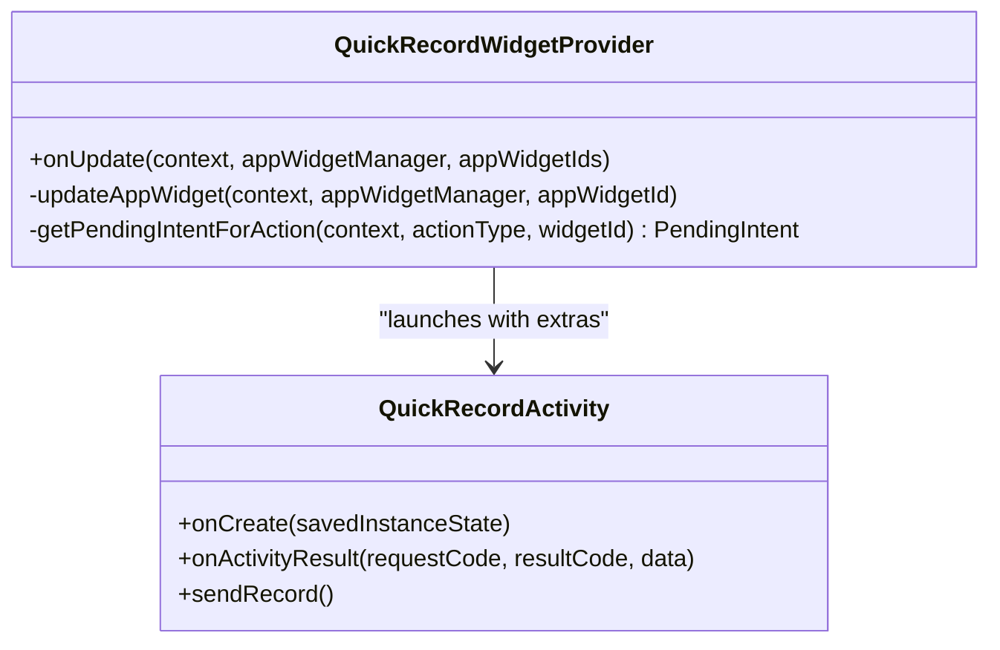
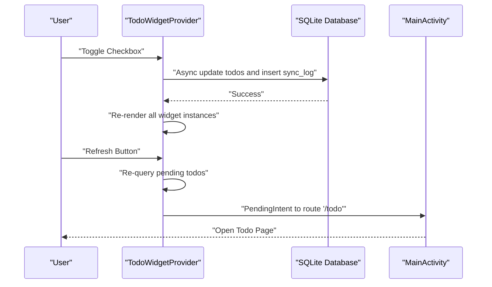
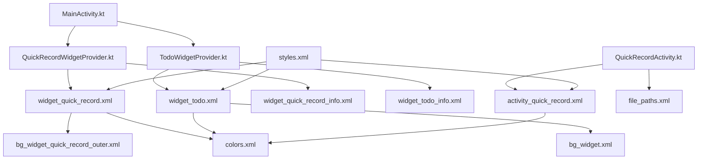

# Android Implementation

<cite>
**Referenced Files in This Document**
- [MainActivity.kt](file://android/app/src/main/kotlin/com/appone/qnote_flutter/MainActivity.kt)
- [QuickRecordActivity.kt](file://android/app/src/main/kotlin/com/appone/qnote_flutter/QuickRecordActivity.kt)
- [QuickRecordWidgetProvider.kt](file://android/app/src/main/kotlin/com/appone/qnote_flutter/QuickRecordWidgetProvider.kt)
- [TodoWidgetProvider.kt](file://android/app/src/main/kotlin/com/appone/qnote_flutter/TodoWidgetProvider.kt)
- [AndroidManifest.xml](file://android/app/src/main/AndroidManifest.xml)
- [activity_quick_record.xml](file://android/app/src/main/res/layout/activity_quick_record.xml)
- [widget_quick_record.xml](file://android/app/src/main/res/layout/widget_quick_record.xml)
- [widget_todo.xml](file://android/app/src/main/res/layout/widget_todo.xml)
- [widget_quick_record_info.xml](file://android/app/src/main/res/xml/widget_quick_record_info.xml)
- [widget_todo_info.xml](file://android/app/src/main/res/xml/widget_todo_info.xml)
- [colors.xml](file://android/app/src/main/res/values/colors.xml)
- [styles.xml](file://android/app/src/main/res/values/styles.xml)
- [bg_widget.xml](file://android/app/src/main/res/drawable/bg_widget.xml)
- [bg_widget_quick_record_outer.xml](file://android/app/src/main/res/drawable/bg_widget_quick_record_outer.xml)
- [file_paths.xml](file://android/app/src/main/res/xml/file_paths.xml)
</cite>

## Table of Contents
1. [Introduction](#introduction)
2. [Project Structure](#project-structure)
3. [Core Components](#core-components)
4. [Architecture Overview](#architecture-overview)
5. [Detailed Component Analysis](#detailed-component-analysis)
6. [Dependency Analysis](#dependency-analysis)
7. [Performance Considerations](#performance-considerations)
8. [Troubleshooting Guide](#troubleshooting-guide)
9. [Conclusion](#conclusion)

## Introduction
This document provides comprehensive technical documentation for QNote Flutter's Android implementation. It covers the native Kotlin architecture, AndroidManifest configuration, widget system for home screen integration, UI themes and resources, and Android-specific features such as camera access, gallery integration, and file picker support. Guidance for debugging, testing, and performance optimization is also included.

## Project Structure
The Android module follows a standard Flutter embedding structure with Kotlin-based native components and Android resources organized under app/src/main. Key areas include:
- Native activities and widget providers under kotlin/com/appone/qnote_flutter
- Layout resources for dialogs and widgets under res/layout
- XML configuration for widgets and file provider under res/xml
- Color and style definitions under res/values
- Drawable backgrounds and icons under res/drawable

**Diagram sources**
- [MainActivity.kt:1-86](file://android/app/src/main/kotlin/com/appone/qnote_flutter/MainActivity.kt#L1-L86)
- [QuickRecordActivity.kt:1-413](file://android/app/src/main/kotlin/com/appone/qnote_flutter/QuickRecordActivity.kt#L1-L413)
- [QuickRecordWidgetProvider.kt:1-64](file://android/app/src/main/kotlin/com/appone/qnote_flutter/QuickRecordWidgetProvider.kt#L1-L64)
- [TodoWidgetProvider.kt:1-380](file://android/app/src/main/kotlin/com/appone/qnote_flutter/TodoWidgetProvider.kt#L1-L380)
- [AndroidManifest.xml:1-112](file://android/app/src/main/AndroidManifest.xml#L1-L112)
- [activity_quick_record.xml:1-128](file://android/app/src/main/res/layout/activity_quick_record.xml#L1-L128)
- [widget_quick_record.xml:1-76](file://android/app/src/main/res/layout/widget_quick_record.xml#L1-L76)
- [widget_todo.xml:1-253](file://android/app/src/main/res/layout/widget_todo.xml#L1-L253)
- [widget_quick_record_info.xml:1-10](file://android/app/src/main/res/xml/widget_quick_record_info.xml#L1-L10)
- [widget_todo_info.xml:1-10](file://android/app/src/main/res/xml/widget_todo_info.xml#L1-L10)
- [colors.xml:1-13](file://android/app/src/main/res/values/colors.xml#L1-L13)
- [styles.xml:1-28](file://android/app/src/main/res/values/styles.xml#L1-L28)
- [bg_widget.xml:1-7](file://android/app/src/main/res/drawable/bg_widget.xml#L1-L7)
- [bg_widget_quick_record_outer.xml:1-7](file://android/app/src/main/res/drawable/bg_widget_quick_record_outer.xml#L1-L7)
- [file_paths.xml:1-7](file://android/app/src/main/res/xml/file_paths.xml#L1-L7)

**Section sources**
- [AndroidManifest.xml:1-112](file://android/app/src/main/AndroidManifest.xml#L1-L112)

## Core Components
This section outlines the primary Android components and their responsibilities:
- MainActivity: Hosts the Flutter engine, handles deep-link navigation via MethodChannel, and triggers widget updates.
- QuickRecordActivity: Provides a dialog-style overlay for quick journal entry with optional photo attachments, camera/gallery integration, and asynchronous database writes.
- QuickRecordWidgetProvider: Home screen widget that launches QuickRecordActivity actions and updates UI via RemoteViews.
- TodoWidgetProvider: Home screen widget displaying pending todos, supporting toggling completion and refreshing data.

Key implementation highlights:
- MethodChannel communication enables Flutter-to-native coordination for navigation and widget refresh.
- RemoteViews-based widget rendering ensures consistent UI across Android versions.
- Permissions and FileProvider configuration enable secure camera and gallery access.

**Section sources**
- [MainActivity.kt:11-86](file://android/app/src/main/kotlin/com/appone/qnote_flutter/MainActivity.kt#L11-L86)
- [QuickRecordActivity.kt:40-413](file://android/app/src/main/kotlin/com/appone/qnote_flutter/QuickRecordActivity.kt#L40-L413)
- [QuickRecordWidgetProvider.kt:10-64](file://android/app/src/main/kotlin/com/appone/qnote_flutter/QuickRecordWidgetProvider.kt#L10-L64)
- [TodoWidgetProvider.kt:19-380](file://android/app/src/main/kotlin/com/appone/qnote_flutter/TodoWidgetProvider.kt#L19-L380)

## Architecture Overview
The Android implementation integrates Flutter embedding with native Kotlin components and Android widgets. The flow below illustrates how intents, permissions, and MethodChannel orchestrate the system.

**Diagram sources**
- [QuickRecordWidgetProvider.kt:17-51](file://android/app/src/main/kotlin/com/appone/qnote_flutter/QuickRecordWidgetProvider.kt#L17-L51)
- [QuickRecordActivity.kt:100-189](file://android/app/src/main/kotlin/com/appone/qnote_flutter/QuickRecordActivity.kt#L100-L189)
- [MainActivity.kt:61-84](file://android/app/src/main/kotlin/com/appone/qnote_flutter/MainActivity.kt#L61-L84)

## Detailed Component Analysis

### MainActivity
Responsibilities:
- Configure Flutter engine and register MethodChannel handlers.
- Handle incoming intents with route extras for deep linking.
- Trigger broadcast updates for all registered widgets.

Key behaviors:
- MethodChannel methods:
  - updateWidgets: Triggers broadcasts to refresh QuickRecordWidgetProvider and TodoWidgetProvider instances.
  - getPendingRoute: Returns and clears deferred route from intent handling.

Intent handling:
- Reads "route" extra from intents and forwards to Flutter via MethodChannel.
- Supports both initial onCreate and onNewIntent scenarios.

**Diagram sources**
- [MainActivity.kt:26-59](file://android/app/src/main/kotlin/com/appone/qnote_flutter/MainActivity.kt#L26-L59)
- [MainActivity.kt:61-84](file://android/app/src/main/kotlin/com/appone/qnote_flutter/MainActivity.kt#L61-L84)

**Section sources**
- [MainActivity.kt:11-86](file://android/app/src/main/kotlin/com/appone/qnote_flutter/MainActivity.kt#L11-L86)

### QuickRecordActivity
Responsibilities:
- Present a dialog overlay for quick journal entries.
- Manage photo attachment via camera or gallery selection.
- Write records to SQLite asynchronously and notify widgets.

Core flows:
- Permission checks for CAMERA and READ_MEDIA_IMAGES (or READ_EXTERNAL_STORAGE on older versions).
- Camera capture using FileProvider with secure URI grants.
- Gallery selection with content URI copying to app cache.
- Asynchronous database insertion with JSON serialization for sync logs.
- Widget update broadcast after successful write.

UI and UX:
- Auto-focus and soft keyboard activation for immediate input.
- Horizontal preview of selected photos with per-item delete controls.
- Max 3 photos constraint enforced.

**Diagram sources**
- [QuickRecordActivity.kt:67-90](file://android/app/src/main/kotlin/com/appone/qnote_flutter/QuickRecordActivity.kt#L67-L90)
- [QuickRecordActivity.kt:100-132](file://android/app/src/main/kotlin/com/appone/qnote_flutter/QuickRecordActivity.kt#L100-L132)
- [QuickRecordActivity.kt:134-166](file://android/app/src/main/kotlin/com/appone/qnote_flutter/QuickRecordActivity.kt#L134-L166)
- [QuickRecordActivity.kt:168-189](file://android/app/src/main/kotlin/com/appone/qnote_flutter/QuickRecordActivity.kt#L168-L189)
- [QuickRecordActivity.kt:212-266](file://android/app/src/main/kotlin/com/appone/qnote_flutter/QuickRecordActivity.kt#L212-L266)
- [QuickRecordActivity.kt:268-375](file://android/app/src/main/kotlin/com/appone/qnote_flutter/QuickRecordActivity.kt#L268-L375)

**Section sources**
- [QuickRecordActivity.kt:40-413](file://android/app/src/main/kotlin/com/appone/qnote_flutter/QuickRecordActivity.kt#L40-L413)

### Widget Providers

#### QuickRecordWidgetProvider
Responsibilities:
- Render a compact home screen widget with input, photo, camera, and send actions.
- Launch QuickRecordActivity with appropriate click_action extras.

Implementation details:
- Uses RemoteViews to inflate widget_quick_record layout.
- Sets PendingIntent targets for:
  - Root container and input target area
  - Photo and camera buttons
  - Send button
- Generates unique PendingIntents per widget instance to avoid conflicts.

**Diagram sources**
- [QuickRecordWidgetProvider.kt:10-64](file://android/app/src/main/kotlin/com/appone/qnote_flutter/QuickRecordWidgetProvider.kt#L10-L64)
- [QuickRecordActivity.kt:59-98](file://android/app/src/main/kotlin/com/appone/qnote_flutter/QuickRecordActivity.kt#L59-L98)

**Section sources**
- [QuickRecordWidgetProvider.kt:10-64](file://android/app/src/main/kotlin/com/appone/qnote_flutter/QuickRecordWidgetProvider.kt#L10-L64)

#### TodoWidgetProvider
Responsibilities:
- Display up to four pending todos from the SQLite database.
- Support toggling completion status, refreshing data, and launching the app to the todo page.

Key behaviors:
- Receives broadcast actions:
  - TODO_TOGGLE: Toggle completion status and update sync_log.
  - TODO_CLICK: Launch MainActivity with a route extra.
  - TODO_REFRESH: Re-render widget instances with latest data.
- Asynchronous database operations to maintain UI responsiveness.
- Dynamic visibility control for empty state and "more" badge.

**Diagram sources**
- [TodoWidgetProvider.kt:28-66](file://android/app/src/main/kotlin/com/appone/qnote_flutter/TodoWidgetProvider.kt#L28-L66)
- [TodoWidgetProvider.kt:75-166](file://android/app/src/main/kotlin/com/appone/qnote_flutter/TodoWidgetProvider.kt#L75-L166)
- [TodoWidgetProvider.kt:168-321](file://android/app/src/main/kotlin/com/appone/qnote_flutter/TodoWidgetProvider.kt#L168-L321)

**Section sources**
- [TodoWidgetProvider.kt:19-380](file://android/app/src/main/kotlin/com/appone/qnote_flutter/TodoWidgetProvider.kt#L19-L380)

### AndroidManifest Configuration and Permissions
Permissions declared:
- INTERNET, POST_NOTIFICATIONS, WRITE_EXTERNAL_STORAGE, READ_EXTERNAL_STORAGE, READ_MEDIA_IMAGES, VIBRATE, SCHEDULE_EXACT_ALARM, RECEIVE_BOOT_COMPLETED, CAMERA, FOREGROUND_SERVICE

Activities and receivers:
- MainActivity with singleTop launch mode and hardware acceleration.
- QuickRecordActivity as a dialog overlay with singleInstance launch mode.
- ScheduledNotificationReceiver and ScheduledNotificationBootReceiver for notification scheduling persistence.
- UCropActivity for image cropping.
- QuickRecordWidgetProvider and TodoWidgetProvider with appwidget metadata.
- FileProvider with authorities and file_paths.xml.

Intent filters and queries:
- Queries for text processing, SEND actions, and HTTPS VIEW actions.

**Section sources**
- [AndroidManifest.xml:1-112](file://android/app/src/main/AndroidManifest.xml#L1-L112)

### Layout Resources and Widget XML Configurations
Widget layouts:
- widget_quick_record.xml: Compact horizontal layout with input target, photo, camera, and send buttons.
- widget_todo.xml: Header with title, count, and refresh button; static slots for up to four items; empty state and "more" badge.
- activity_quick_record.xml: Dialog overlay with content input, photo preview, and action buttons.

Widget metadata:
- widget_quick_record_info.xml: Minimum sizes, update period, initial layout, resize modes, and category.
- widget_todo_info.xml: Minimum sizes, update period, initial layout, resize modes, and category.

Drawable backgrounds:
- bg_widget.xml: Rounded corners with border stroke for todo widget.
- bg_widget_quick_record_outer.xml: Rounded outer container for quick record widget.

Colors and styles:
- colors.xml: Widget and dialog color palette.
- styles.xml: LaunchTheme, NormalTheme, and QuickRecordDialogTheme for transparent dialog overlay.

**Section sources**
- [widget_quick_record.xml:1-76](file://android/app/src/main/res/layout/widget_quick_record.xml#L1-L76)
- [widget_todo.xml:1-253](file://android/app/src/main/res/layout/widget_todo.xml#L1-L253)
- [activity_quick_record.xml:1-128](file://android/app/src/main/res/layout/activity_quick_record.xml#L1-L128)
- [widget_quick_record_info.xml:1-10](file://android/app/src/main/res/xml/widget_quick_record_info.xml#L1-L10)
- [widget_todo_info.xml:1-10](file://android/app/src/main/res/xml/widget_todo_info.xml#L1-L10)
- [bg_widget.xml:1-7](file://android/app/src/main/res/drawable/bg_widget.xml#L1-L7)
- [bg_widget_quick_record_outer.xml:1-7](file://android/app/src/main/res/drawable/bg_widget_quick_record_outer.xml#L1-L7)
- [colors.xml:1-13](file://android/app/src/main/res/values/colors.xml#L1-L13)
- [styles.xml:1-28](file://android/app/src/main/res/values/styles.xml#L1-L28)

## Dependency Analysis
The following diagram maps key dependencies among components and resources:

**Diagram sources**
- [MainActivity.kt:11-86](file://android/app/src/main/kotlin/com/appone/qnote_flutter/MainActivity.kt#L11-L86)
- [QuickRecordWidgetProvider.kt:10-64](file://android/app/src/main/kotlin/com/appone/qnote_flutter/QuickRecordWidgetProvider.kt#L10-L64)
- [TodoWidgetProvider.kt:19-380](file://android/app/src/main/kotlin/com/appone/qnote_flutter/TodoWidgetProvider.kt#L19-L380)
- [QuickRecordActivity.kt:40-413](file://android/app/src/main/kotlin/com/appone/qnote_flutter/QuickRecordActivity.kt#L40-L413)
- [widget_quick_record.xml:1-76](file://android/app/src/main/res/layout/widget_quick_record.xml#L1-L76)
- [widget_todo.xml:1-253](file://android/app/src/main/res/layout/widget_todo.xml#L1-L253)
- [widget_quick_record_info.xml:1-10](file://android/app/src/main/res/xml/widget_quick_record_info.xml#L1-L10)
- [widget_todo_info.xml:1-10](file://android/app/src/main/res/xml/widget_todo_info.xml#L1-L10)
- [activity_quick_record.xml:1-128](file://android/app/src/main/res/layout/activity_quick_record.xml#L1-L128)
- [file_paths.xml:1-7](file://android/app/src/main/res/xml/file_paths.xml#L1-L7)
- [bg_widget.xml:1-7](file://android/app/src/main/res/drawable/bg_widget.xml#L1-L7)
- [bg_widget_quick_record_outer.xml:1-7](file://android/app/src/main/res/drawable/bg_widget_quick_record_outer.xml#L1-L7)
- [colors.xml:1-13](file://android/app/src/main/res/values/colors.xml#L1-L13)
- [styles.xml:1-28](file://android/app/src/main/res/values/styles.xml#L1-L28)

**Section sources**
- [AndroidManifest.xml:56-94](file://android/app/src/main/AndroidManifest.xml#L56-L94)

## Performance Considerations
- Asynchronous database operations: Both QuickRecordActivity and TodoWidgetProvider perform database writes and updates on background threads to prevent UI blocking.
- Efficient widget rendering: RemoteViews updates are scoped to widget instances and use minimal view updates.
- Resource scaling: Density-aware sizing for previews and margins to maintain consistent appearance across devices.
- Permission handling: Defer heavy operations until after permission grants to avoid redundant work.
- Memory management: Temporary image files are cleaned up after successful writes.

[No sources needed since this section provides general guidance]

## Troubleshooting Guide
Common issues and resolutions:
- Camera permission denied: Verify Manifest declares CAMERA permission and runtime request flow executes. Confirm FileProvider authority matches package name.
- Gallery permission on Android 13+: READ_MEDIA_IMAGES is required; ensure runtime permission is granted before opening gallery.
- Widget not updating: Ensure broadcast intents are sent with correct actions and extras. Confirm AppWidgetManager IDs are retrieved and passed in extras.
- FileProvider errors: Validate file_paths.xml includes cache-path, files-path, and external-path entries. Confirm authority string matches provider declaration.
- SQLite access failures: Verify database file exists and is readable/writable. Check thread safety of database operations.

**Section sources**
- [AndroidManifest.xml:1-12](file://android/app/src/main/AndroidManifest.xml#L1-L12)
- [AndroidManifest.xml:86-94](file://android/app/src/main/AndroidManifest.xml#L86-L94)
- [QuickRecordActivity.kt:100-132](file://android/app/src/main/kotlin/com/appone/qnote_flutter/QuickRecordActivity.kt#L100-L132)
- [QuickRecordActivity.kt:134-166](file://android/app/src/main/kotlin/com/appone/qnote_flutter/QuickRecordActivity.kt#L134-L166)
- [TodoWidgetProvider.kt:75-166](file://android/app/src/main/kotlin/com/appone/qnote_flutter/TodoWidgetProvider.kt#L75-L166)
- [file_paths.xml:1-7](file://android/app/src/main/res/xml/file_paths.xml#L1-L7)

## Conclusion
QNote Flutter's Android implementation combines Flutter embedding with native Kotlin components to deliver seamless home screen integration and efficient journaling workflows. The architecture leverages MethodChannel for navigation, RemoteViews for widgets, and robust permission handling for camera and gallery access. With careful attention to asynchronous operations, resource scaling, and manifest configuration, the system provides a responsive and reliable user experience across diverse Android devices.