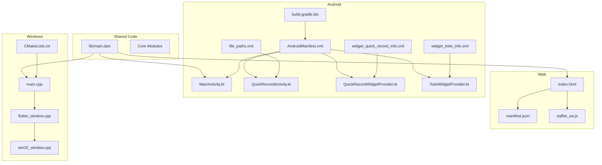
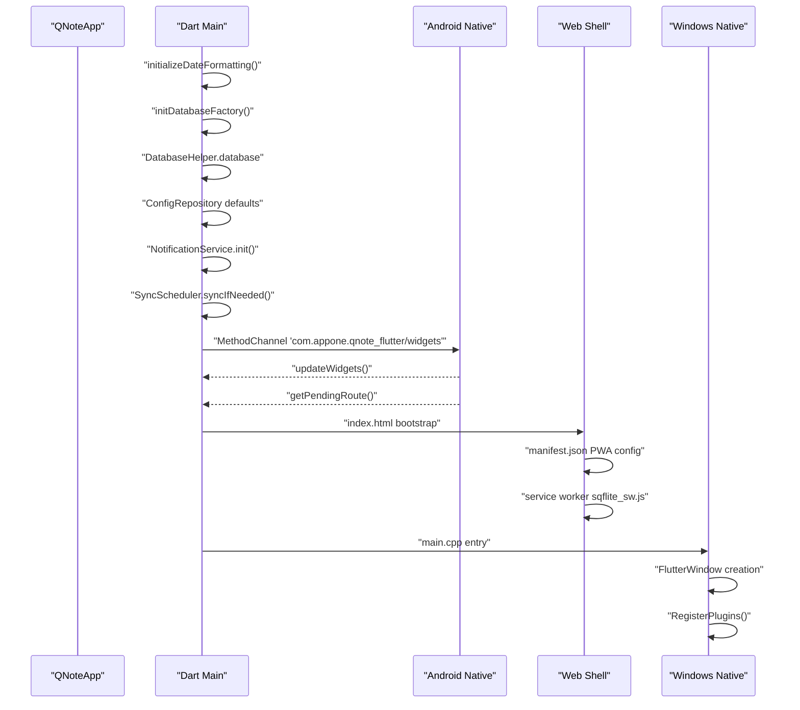
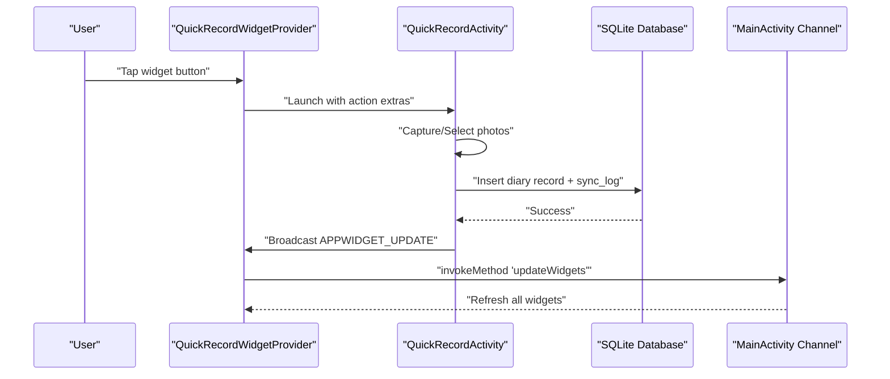
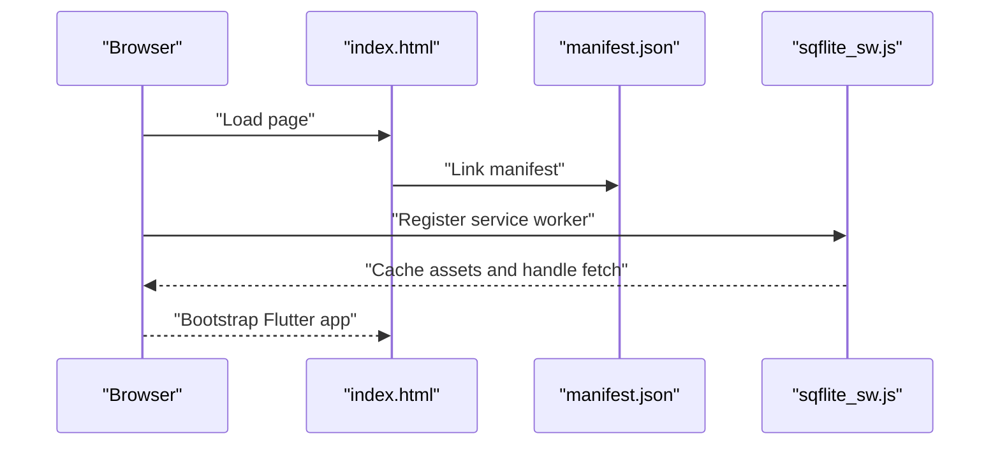
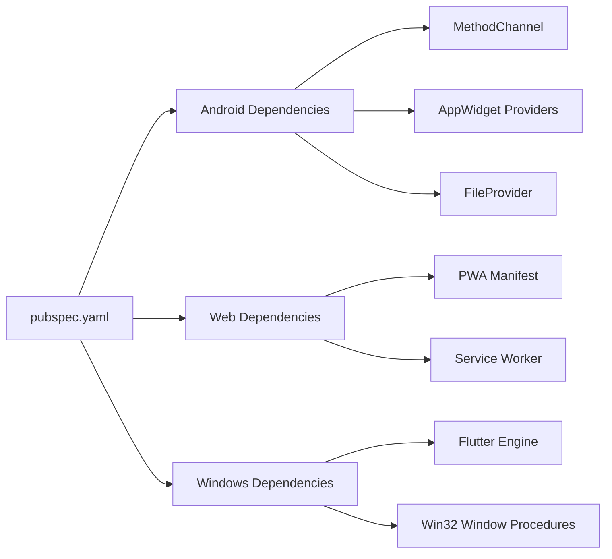

# Platform-Specific Implementation

<cite>
**Referenced Files in This Document**
- [AndroidManifest.xml](file://android/app/src/main/AndroidManifest.xml)
- [build.gradle.kts](file://android/app/build.gradle.kts)
- [MainActivity.kt](file://android/app/src/main/kotlin/com/appone/qnote_flutter/MainActivity.kt)
- [QuickRecordActivity.kt](file://android/app/src/main/kotlin/com/appone/qnote_flutter/QuickRecordActivity.kt)
- [QuickRecordWidgetProvider.kt](file://android/app/src/main/kotlin/com/appone/qnote_flutter/QuickRecordWidgetProvider.kt)
- [TodoWidgetProvider.kt](file://android/app/src/main/kotlin/com/appone/qnote_flutter/TodoWidgetProvider.kt)
- [widget_quick_record_info.xml](file://android/app/src/main/res/xml/widget_quick_record_info.xml)
- [widget_todo_info.xml](file://android/app/src/main/res/xml/widget_todo_info.xml)
- [file_paths.xml](file://android/app/src/main/res/xml/file_paths.xml)
- [main.dart](file://lib/main.dart)
- [index.html](file://web/index.html)
- [manifest.json](file://web/manifest.json)
- [sqflite_sw.js](file://web/sqflite_sw.js)
- [CMakeLists.txt](file://windows/CMakeLists.txt)
- [main.cpp](file://windows/runner/main.cpp)
- [flutter_window.cpp](file://windows/runner/flutter_window.cpp)
- [win32_window.cpp](file://windows/runner/win32_window.cpp)
- [pubspec.yaml](file://pubspec.yaml)
</cite>

## Table of Contents
1. [Introduction](#introduction)
2. [Project Structure](#project-structure)
3. [Core Components](#core-components)
4. [Architecture Overview](#architecture-overview)
5. [Detailed Component Analysis](#detailed-component-analysis)
6. [Dependency Analysis](#dependency-analysis)
7. [Performance Considerations](#performance-considerations)
8. [Troubleshooting Guide](#troubleshooting-guide)
9. [Conclusion](#conclusion)

## Introduction
This document provides comprehensive coverage of QNote Flutter's platform-specific implementations across Android, iOS (via Flutter framework), Web, and Windows desktop. It explains native integrations, widget systems, build configurations, signing requirements, deployment processes, UI adaptations, and performance considerations. The goal is to help developers understand how the codebase adapts to each platform while maintaining cross-platform consistency.

## Project Structure
The project follows a standard Flutter structure with platform-specific folders:
- android/: Android application code, manifests, Gradle configuration, and native Kotlin widgets/providers
- lib/: Shared Dart application entry point and core logic
- web/: Progressive Web App assets, service worker, and HTML shell
- windows/: Windows desktop native implementation using C++ and Flutter engine integration
- pubspec.yaml: Cross-platform dependencies and Flutter configuration

**Diagram sources**
- [AndroidManifest.xml:1-112](file://android/app/src/main/AndroidManifest.xml#L1-L112)
- [build.gradle.kts:1-52](file://android/app/build.gradle.kts#L1-L52)
- [MainActivity.kt:1-86](file://android/app/src/main/kotlin/com/appone/qnote_flutter/MainActivity.kt#L1-L86)
- [QuickRecordActivity.kt:1-413](file://android/app/src/main/kotlin/com/appone/qnote_flutter/QuickRecordActivity.kt#L1-L413)
- [QuickRecordWidgetProvider.kt:1-64](file://android/app/src/main/kotlin/com/appone/qnote_flutter/QuickRecordWidgetProvider.kt#L1-L64)
- [TodoWidgetProvider.kt:1-380](file://android/app/src/main/kotlin/com/appone/qnote_flutter/TodoWidgetProvider.kt#L1-L380)
- [widget_quick_record_info.xml:1-10](file://android/app/src/main/res/xml/widget_quick_record_info.xml#L1-L10)
- [widget_todo_info.xml:1-10](file://android/app/src/main/res/xml/widget_todo_info.xml#L1-L10)
- [file_paths.xml:1-7](file://android/app/src/main/res/xml/file_paths.xml#L1-L7)
- [main.dart:1-31](file://lib/main.dart#L1-L31)
- [index.html:1-47](file://web/index.html#L1-L47)
- [manifest.json:1-36](file://web/manifest.json#L1-L36)
- [sqflite_sw.js:1-800](file://web/sqflite_sw.js#L1-L800)
- [CMakeLists.txt:1-109](file://windows/CMakeLists.txt#L1-L109)
- [main.cpp:1-44](file://windows/runner/main.cpp#L1-L44)
- [flutter_window.cpp:1-72](file://windows/runner/flutter_window.cpp#L1-L72)
- [win32_window.cpp:1-289](file://windows/runner/win32_window.cpp#L1-L289)

**Section sources**
- [AndroidManifest.xml:1-112](file://android/app/src/main/AndroidManifest.xml#L1-L112)
- [build.gradle.kts:1-52](file://android/app/build.gradle.kts#L1-L52)
- [main.dart:1-31](file://lib/main.dart#L1-L31)
- [index.html:1-47](file://web/index.html#L1-L47)
- [manifest.json:1-36](file://web/manifest.json#L1-L36)
- [sqflite_sw.js:1-800](file://web/sqflite_sw.js#L1-L800)
- [CMakeLists.txt:1-109](file://windows/CMakeLists.txt#L1-L109)
- [main.cpp:1-44](file://windows/runner/main.cpp#L1-L44)
- [flutter_window.cpp:1-72](file://windows/runner/flutter_window.cpp#L1-L72)
- [win32_window.cpp:1-289](file://windows/runner/win32_window.cpp#L1-L289)

## Core Components
- Android platform integrates native Kotlin activities and AppWidget providers for quick recording and todo management, with MethodChannel communication between Flutter and native code.
- Web platform supports PWA features via manifest and service worker for offline capabilities and caching.
- Windows desktop implements native window management with DPI scaling, dark mode adaptation, and Flutter engine integration.

**Section sources**
- [MainActivity.kt:1-86](file://android/app/src/main/kotlin/com/appone/qnote_flutter/MainActivity.kt#L1-L86)
- [QuickRecordActivity.kt:1-413](file://android/app/src/main/kotlin/com/appone/qnote_flutter/QuickRecordActivity.kt#L1-L413)
- [TodoWidgetProvider.kt:1-380](file://android/app/src/main/kotlin/com/appone/qnote_flutter/TodoWidgetProvider.kt#L1-L380)
- [index.html:1-47](file://web/index.html#L1-L47)
- [manifest.json:1-36](file://web/manifest.json#L1-L36)
- [sqflite_sw.js:1-800](file://web/sqflite_sw.js#L1-L800)
- [win32_window.cpp:1-289](file://windows/runner/win32_window.cpp#L1-L289)

## Architecture Overview
The application initializes platform-specific services and database factories, then starts notification and synchronization services. Android adds native widget support and MethodChannel bridges. Web provides PWA shell and service worker. Windows creates a native window and registers Flutter plugins.

**Diagram sources**
- [main.dart:12-30](file://lib/main.dart#L12-L30)
- [MainActivity.kt:38-59](file://android/app/src/main/kotlin/com/appone/qnote_flutter/MainActivity.kt#L38-L59)
- [index.html:32-34](file://web/index.html#L32-L34)
- [manifest.json:1-36](file://web/manifest.json#L1-L36)
- [sqflite_sw.js:1-800](file://web/sqflite_sw.js#L1-L800)
- [main.cpp:8-43](file://windows/runner/main.cpp#L8-L43)

## Detailed Component Analysis

### Android Implementation

#### AndroidManifest Configuration
The manifest defines permissions for network, storage, camera, notifications, alarms, boot completion, foreground services, and vibration. It declares the main activity, notification receivers, UCrop activity for image cropping, two AppWidget providers, a single-instance QuickRecord dialog activity, and a FileProvider for secure file sharing.

Key elements:
- Permissions for media/image access, external storage, camera, notifications, alarms, boot events, and foreground services
- Activities and receivers for notifications and image cropping
- AppWidget providers with metadata pointing to XML descriptors
- FileProvider authorities and path mappings

**Section sources**
- [AndroidManifest.xml:2-111](file://android/app/src/main/AndroidManifest.xml#L2-L111)

#### Gradle Build Configuration
The Android Gradle plugin applies Kotlin and Flutter Gradle plugin. Compile and target SDK versions are managed by Flutter. Java 17 compatibility is enforced with desugaring enabled. MultiDex is enabled. Release signing uses debug config by default.

Optimization highlights:
- Desugaring for modern Java APIs on older Android versions
- MultiDex support for large applications
- Explicit JVM target for Kotlin compilation

**Section sources**
- [build.gradle.kts:1-52](file://android/app/build.gradle.kts#L1-L52)

#### MainActivity MethodChannel Bridge
MainActivity sets up a MethodChannel to communicate with Flutter. It handles navigation requests from native widgets and exposes methods to update all widgets and retrieve pending routes. It also forwards intents containing route extras to Flutter via the channel.

Integration points:
- Channel name: "com.appone.qnote_flutter/widgets"
- Methods: "updateWidgets", "getPendingRoute"
- Intent extras: "route" for deep linking

**Section sources**
- [MainActivity.kt:11-86](file://android/app/src/main/kotlin/com/appone/qnote_flutter/MainActivity.kt#L11-L86)

#### QuickRecordActivity Native Flow
QuickRecordActivity provides a floating dialog-like UI for quick note entry with optional photos. It manages:
- Permission checks for camera and gallery (including runtime permissions for Android 13+)
- Camera capture using FileProvider and gallery selection
- Image preview with removal capability
- Asynchronous database insertion into SQLite with JSON logging for sync
- Broadcast updates to QuickRecord widget upon successful write

UI and UX:
- Auto-focus and soft keyboard activation
- Max 3 photos per record
- Immediate toast feedback and widget refresh

**Section sources**
- [QuickRecordActivity.kt:40-413](file://android/app/src/main/kotlin/com/appone/qnote_flutter/QuickRecordActivity.kt#L40-L413)

#### AppWidget Providers
Two AppWidget providers render home screen widgets:
- QuickRecordWidgetProvider: Launches QuickRecordActivity with action-specific extras
- TodoWidgetProvider: Renders pending todos, supports toggling completion, refresh broadcast, and deep-link routing

Both providers:
- Inflate layouts and register PendingIntent handlers for clicks
- Use AppWidgetManager to update views
- Broadcast updates to refresh data

**Section sources**
- [QuickRecordWidgetProvider.kt:10-64](file://android/app/src/main/kotlin/com/appone/qnote_flutter/QuickRecordWidgetProvider.kt#L10-L64)
- [TodoWidgetProvider.kt:19-380](file://android/app/src/main/kotlin/com/appone/qnote_flutter/TodoWidgetProvider.kt#L19-L380)

#### Widget XML Descriptors
Widget metadata defines minimum sizes, update periods, initial layouts, resize modes, and categories. These files are referenced by the respective AppWidget providers.

**Section sources**
- [widget_quick_record_info.xml:1-10](file://android/app/src/main/res/xml/widget_quick_record_info.xml#L1-L10)
- [widget_todo_info.xml:1-10](file://android/app/src/main/res/xml/widget_todo_info.xml#L1-L10)

#### FileProvider Paths
Defines secure paths for cache, internal files, and external files to support camera captures and gallery selections.

**Section sources**
- [file_paths.xml:1-7](file://android/app/src/main/res/xml/file_paths.xml#L1-L7)

#### Android Widget Update Flow

**Diagram sources**
- [QuickRecordWidgetProvider.kt:53-62](file://android/app/src/main/kotlin/com/appone/qnote_flutter/QuickRecordWidgetProvider.kt#L53-L62)
- [QuickRecordActivity.kt:353-365](file://android/app/src/main/kotlin/com/appone/qnote_flutter/QuickRecordActivity.kt#L353-L365)
- [MainActivity.kt:43-58](file://android/app/src/main/kotlin/com/appone/qnote_flutter/MainActivity.kt#L43-L58)

### Web Platform Implementation

#### Progressive Web App Features
The web implementation includes:
- index.html with base href, Apple touch icons, favicon, and manifest link
- manifest.json defining display mode, background/theme colors, orientation, and icon sets
- sqflite_sw.js service worker for offline capabilities and database caching

Deployment considerations:
- Base href handling for non-root deployments
- Standalone display mode for PWA installation
- Maskable icons for adaptive icons on supported platforms

**Section sources**
- [index.html:17-34](file://web/index.html#L17-L34)
- [manifest.json:1-36](file://web/manifest.json#L1-L36)
- [sqflite_sw.js:1-800](file://web/sqflite_sw.js#L1-L800)

#### Web Initialization Flow

**Diagram sources**
- [index.html:32-34](file://web/index.html#L32-L34)
- [manifest.json:1-36](file://web/manifest.json#L1-L36)
- [sqflite_sw.js:1-800](file://web/sqflite_sw.js#L1-L800)

### Windows Desktop Implementation

#### Native Window Management
Windows desktop uses C++ to create and manage the main window:
- main.cpp initializes console, COM, and Flutter project, then creates a FlutterWindow
- flutter_window.cpp sets up FlutterViewController, registers plugins, and forces redraw
- win32_window.cpp handles DPI scaling, dark mode detection, WM_SIZE, WM_DPICHANGED, and theme updates

Build system:
- CMakeLists.txt defines build types, compiler settings, Flutter managed directories, and installation steps for assets and plugins

**Section sources**
- [main.cpp:8-43](file://windows/runner/main.cpp#L8-L43)
- [flutter_window.cpp:12-71](file://windows/runner/flutter_window.cpp#L12-L71)
- [win32_window.cpp:123-289](file://windows/runner/win32_window.cpp#L123-L289)
- [CMakeLists.txt:1-109](file://windows/CMakeLists.txt#L1-L109)

#### Windows Build and Deployment
- Multi-config build types: Debug, Profile, Release
- Compiler flags enforce C++17, warnings, and exception handling
- Assets and plugins installed alongside the executable
- AOT library included in Profile/Release builds

**Section sources**
- [CMakeLists.txt:14-109](file://windows/CMakeLists.txt#L14-L109)

## Dependency Analysis
Cross-platform dependencies are declared in pubspec.yaml. Platform-specific implementations rely on:
- Android: MethodChannel, AppWidgetManager, FileProvider, BroadcastReceiver
- Web: PWA manifest, service worker, and Flutter web bootstrap
- Windows: Flutter engine integration, Win32 window procedures, and CMake build system

**Diagram sources**
- [pubspec.yaml:9-43](file://pubspec.yaml#L9-L43)
- [AndroidManifest.xml:36-94](file://android/app/src/main/AndroidManifest.xml#L36-L94)
- [index.html:32-34](file://web/index.html#L32-L34)
- [manifest.json:1-36](file://web/manifest.json#L1-L36)
- [CMakeLists.txt:48-58](file://windows/CMakeLists.txt#L48-L58)

**Section sources**
- [pubspec.yaml:9-43](file://pubspec.yaml#L9-L43)
- [AndroidManifest.xml:36-94](file://android/app/src/main/AndroidManifest.xml#L36-L94)
- [index.html:32-34](file://web/index.html#L32-L34)
- [manifest.json:1-36](file://web/manifest.json#L1-L36)
- [CMakeLists.txt:48-58](file://windows/CMakeLists.txt#L48-L58)

## Performance Considerations
- Android
  - Use background threads for database writes in QuickRecordActivity to keep UI responsive
  - Minimize widget update broadcasts; batch updates when possible
  - Enable desugaring and Java 17 for improved compatibility and performance on older devices
- Web
  - Service worker caching reduces repeated asset loading; ensure proper cache invalidation strategies
  - PWA manifest improves installability and offline readiness
- Windows
  - DPI-aware window sizing prevents repainting overhead
  - Dark mode registry polling updates window attributes efficiently

[No sources needed since this section provides general guidance]

## Troubleshooting Guide
- Android
  - If widgets do not update, verify broadcast actions and AppWidgetManager IDs are correctly set in the providers
  - For camera/gallery failures, confirm runtime permissions and FileProvider configuration
  - MethodChannel not receiving messages: ensure channel name matches and setMethodCallHandler is invoked before navigation
- Web
  - PWA not installing: verify manifest.json fields and HTTPS deployment
  - Service worker not caching: check base href and service worker registration
- Windows
  - Window not resizing properly: ensure WM_SIZE and WM_DPICHANGED handlers are active
  - Dark mode not applying: verify registry keys and DWMWA_USE_IMMERSIVE_DARK_MODE support

**Section sources**
- [QuickRecordWidgetProvider.kt:53-62](file://android/app/src/main/kotlin/com/appone/qnote_flutter/QuickRecordWidgetProvider.kt#L53-L62)
- [TodoWidgetProvider.kt:68-166](file://android/app/src/main/kotlin/com/appone/qnote_flutter/TodoWidgetProvider.kt#L68-L166)
- [QuickRecordActivity.kt:100-132](file://android/app/src/main/kotlin/com/appone/qnote_flutter/QuickRecordActivity.kt#L100-L132)
- [MainActivity.kt:43-58](file://android/app/src/main/kotlin/com/appone/qnote_flutter/MainActivity.kt#L43-L58)
- [index.html:17-34](file://web/index.html#L17-L34)
- [manifest.json:1-36](file://web/manifest.json#L1-L36)
- [win32_window.cpp:190-222](file://windows/runner/win32_window.cpp#L190-L222)

## Conclusion
QNote Flutter leverages platform-specific strengths while maintaining a unified Dart codebase. Android benefits from native widgets and MethodChannel bridging, Web gains PWA capabilities with service workers, and Windows delivers native window management with DPI and theme awareness. Build configurations and dependency declarations ensure consistent behavior across platforms, with targeted optimizations for performance and user experience.