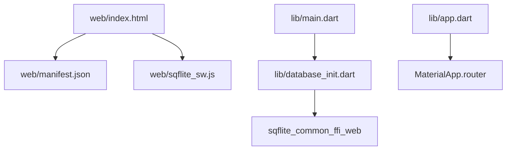
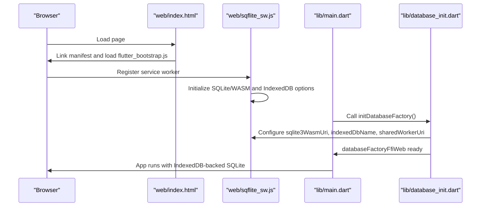
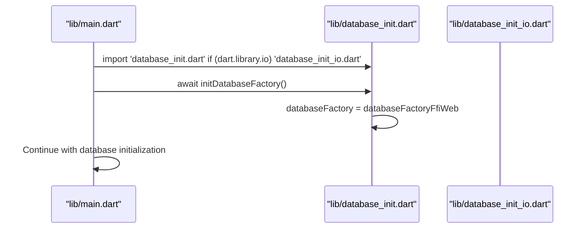
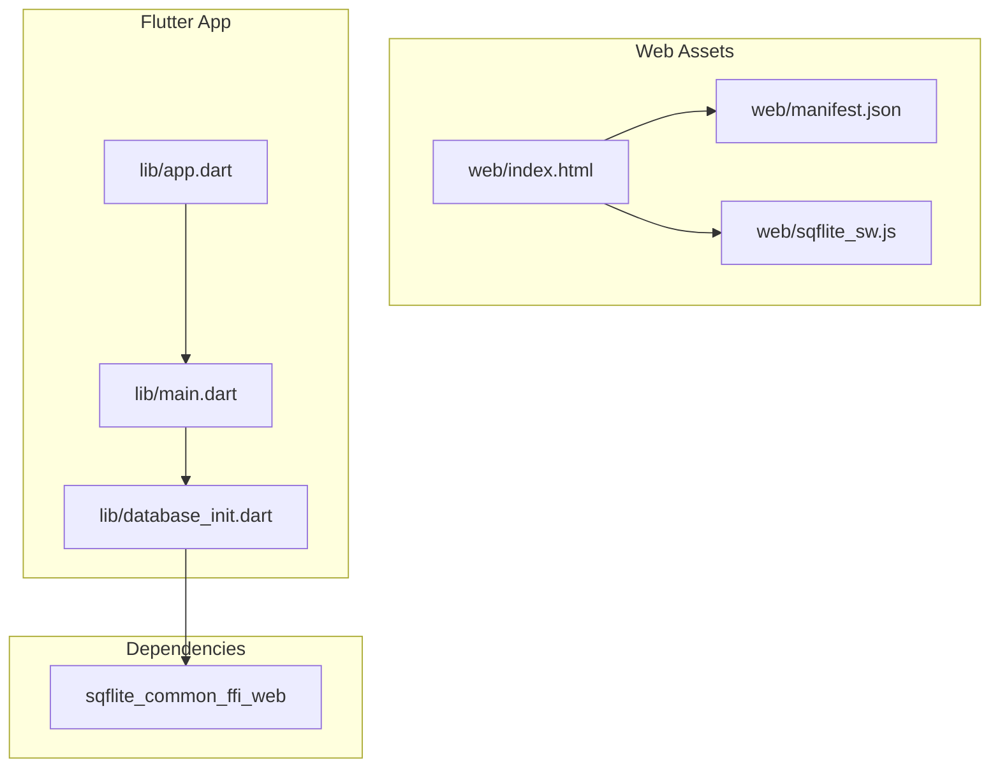

# Web Implementation

<cite>
**Referenced Files in This Document**
- [index.html](file://web/index.html)
- [manifest.json](file://web/manifest.json)
- [sqflite_sw.js](file://web/sqflite_sw.js)
- [pubspec.yaml](file://pubspec.yaml)
- [main.dart](file://lib/main.dart)
- [database_init.dart](file://lib/database_init.dart)
- [database_init_io.dart](file://lib/database_init_io.dart)
- [app.dart](file://lib/app.dart)
</cite>

## Table of Contents
1. [Introduction](#introduction)
2. [Project Structure](#project-structure)
3. [Core Components](#core-components)
4. [Architecture Overview](#architecture-overview)
5. [Detailed Component Analysis](#detailed-component-analysis)
6. [Dependency Analysis](#dependency-analysis)
7. [Performance Considerations](#performance-considerations)
8. [Troubleshooting Guide](#troubleshooting-guide)
9. [Conclusion](#conclusion)

## Introduction
This document provides comprehensive documentation for QNote Flutter's web implementation. It covers Progressive Web App (PWA) configuration, service worker setup, offline capabilities, web-specific HTML structure and SEO optimizations, browser storage management, deployment considerations, performance optimization, browser compatibility, and web-specific UI adaptations. The focus is on the web directory assets, Flutter web configuration, and the underlying technologies enabling offline-first behavior via IndexedDB and WebAssembly.

## Project Structure
The web implementation centers around three primary assets:
- HTML entry point with meta tags and PWA manifest linkage
- PWA manifest defining app identity, display mode, and icon assets
- Service worker script implementing SQLite WebAssembly integration and IndexedDB-backed persistence

**Diagram sources**
- [index.html:1-47](file://web/index.html#L1-L47)
- [manifest.json:1-36](file://web/manifest.json#L1-L36)
- [sqflite_sw.js:1-800](file://web/sqflite_sw.js#L1-L800)
- [main.dart:1-31](file://lib/main.dart#L1-L31)
- [database_init.dart:1-7](file://lib/database_init.dart#L1-L7)
- [app.dart:78-121](file://lib/app.dart#L78-L121)

**Section sources**
- [index.html:1-47](file://web/index.html#L1-L47)
- [manifest.json:1-36](file://web/manifest.json#L1-L36)
- [sqflite_sw.js:1-800](file://web/sqflite_sw.js#L1-L800)
- [main.dart:1-31](file://lib/main.dart#L1-L31)
- [database_init.dart:1-7](file://lib/database_init.dart#L1-L7)
- [app.dart:78-121](file://lib/app.dart#L78-L121)

## Core Components
- PWA Manifest: Defines standalone display, theme/background colors, orientation, and icon sets for desktop and mobile contexts.
- HTML Template: Provides base href, meta tags for viewport and compatibility, Apple touch icons, favicon, and links to the manifest and bootstrap script.
- Service Worker: Implements SQLite WebAssembly integration, IndexedDB-backed database persistence, and inter-process communication for database operations.
- Database Factory Initialization: Selects the FFI Web adapter for SQLite on the web platform while maintaining native behavior on other platforms.

Key responsibilities:
- Manifest and HTML: Enable PWA installation, offline detection, and proper app presentation across browsers.
- Service Worker: Manage SQLite/WASM lifecycle, IndexedDB storage, and database options synchronization with the Flutter app.
- Database Factory: Ensure the web app uses the correct SQLite backend for IndexedDB-backed persistence.

**Section sources**
- [manifest.json:1-36](file://web/manifest.json#L1-L36)
- [index.html:1-47](file://web/index.html#L1-L47)
- [sqflite_sw.js:3519-3632](file://web/sqflite_sw.js#L3519-L3632)
- [database_init.dart:1-7](file://lib/database_init.dart#L1-L7)
- [database_init_io.dart:1-2](file://lib/database_init_io.dart#L1-L2)

## Architecture Overview
The web architecture integrates Flutter web with a service worker that hosts SQLite via WebAssembly and persists data in IndexedDB. The Flutter app initializes the database factory for the web platform and relies on the service worker for database operations.

**Diagram sources**
- [index.html:33-33](file://web/index.html#L33-L33)
- [sqflite_sw.js:3587-3596](file://web/sqflite_sw.js#L3587-L3596)
- [main.dart:16-16](file://lib/main.dart#L16-L16)
- [database_init.dart:4-6](file://lib/database_init.dart#L4-L6)

## Detailed Component Analysis

### PWA Manifest Configuration
The manifest defines:
- App name and short name
- Standalone display mode for desktop/mobile installation
- Background and theme colors
- Description and orientation preferences
- Icon assets including maskable variants for modern browsers

These settings enable installation prompts, themed app shells, and consistent branding across devices.

**Section sources**
- [manifest.json:1-36](file://web/manifest.json#L1-L36)

### HTML Template and Meta Tags
The HTML template provides:
- Base href for routing and asset resolution
- Charset and IE compatibility meta tags
- Mobile and Apple touch icon support
- Favicon definition
- Link to manifest for PWA features
- Bootstrap script for Flutter initialization

Meta tags and icons contribute to SEO and installation readiness.

**Section sources**
- [index.html:1-47](file://web/index.html#L1-L47)

### Service Worker Implementation
The service worker script implements:
- SQLite/WASM integration and initialization
- IndexedDB-backed database configuration
- Shared worker or basic worker selection
- Inter-process communication for database options and operations
- WebAssembly module loading and exports mapping

It exposes methods to set and retrieve web options, ensuring the Flutter app can configure the database backend dynamically.

```mermaid
flowchart TD
Start(["Service Worker Loaded"]) --> Options["Receive setWebOptions Message"]
Options --> Parse["Parse sqlite3WasmUri, indexedDbName, sharedWorkerUri"]
Parse --> Init["Initialize SQLite/WASM and IndexedDB"]
Init --> Ready["Ready for Database Operations"]
Ready --> IPC["Listen for IPC Messages"]
IPC --> VarSet{"varSet?"}
VarSet --> |Yes| Store["Store Option Value"]
VarSet --> |No| VarGet{"varGet?"}
VarGet --> |Yes| Reply["Reply with Stored Value"]
VarGet --> |No| Unknown["Log Unknown Message"]
Store --> IPC
Reply --> IPC
Unknown --> IPC
```

**Diagram sources**
- [sqflite_sw.js:3567-3596](file://web/sqflite_sw.js#L3567-L3596)
- [sqflite_sw.js:3598-3604](file://web/sqflite_sw.js#L3598-L3604)

**Section sources**
- [sqflite_sw.js:3519-3632](file://web/sqflite_sw.js#L3519-L3632)
- [sqflite_sw.js:3587-3596](file://web/sqflite_sw.js#L3587-L3596)
- [sqflite_sw.js:3598-3604](file://web/sqflite_sw.js#L3598-L3604)

### Database Factory Initialization
On the web platform, the app selects the FFI Web adapter for SQLite, enabling IndexedDB-backed persistence. On native platforms, the initialization is a no-op.

**Diagram sources**
- [main.dart:10-10](file://lib/main.dart#L10-L10)
- [database_init.dart:4-6](file://lib/database_init.dart#L4-L6)
- [database_init_io.dart:1-2](file://lib/database_init_io.dart#L1-L2)

**Section sources**
- [main.dart:10-10](file://lib/main.dart#L10-L10)
- [database_init.dart:1-7](file://lib/database_init.dart#L1-L7)
- [database_init_io.dart:1-2](file://lib/database_init_io.dart#L1-L2)

### App Shell and Routing
The Flutter app configures Material Router with localization delegates, theme modes, and a gesture wrapper to handle global taps and navigation behavior. This establishes the UI foundation for web interactions.

**Section sources**
- [app.dart:78-121](file://lib/app.dart#L78-L121)

## Dependency Analysis
The web implementation relies on:
- sqflite_common_ffi_web for SQLite/WASM and IndexedDB integration
- Flutter web bootstrap and service worker registration
- PWA manifest and HTML meta tags for installation and SEO

**Diagram sources**
- [pubspec.yaml:34-34](file://pubspec.yaml#L34-L34)
- [main.dart:1-31](file://lib/main.dart#L1-L31)
- [database_init.dart:1-7](file://lib/database_init.dart#L1-L7)
- [app.dart:78-121](file://lib/app.dart#L78-L121)

**Section sources**
- [pubspec.yaml:34-34](file://pubspec.yaml#L34-L34)
- [main.dart:1-31](file://lib/main.dart#L1-L31)
- [database_init.dart:1-7](file://lib/database_init.dart#L1-L7)
- [app.dart:78-121](file://lib/app.dart#L78-L121)

## Performance Considerations
- Service worker caching: The service worker script manages SQLite/WASM assets and IndexedDB storage. Ensure minimal network requests by leveraging cached WASM binaries and preloading database initialization.
- Lazy initialization: Defer heavy operations until after the app is initialized to improve perceived performance.
- Asset optimization: Compress and cache static assets referenced by the HTML template and manifest.
- IndexedDB sizing: Monitor IndexedDB quotas and implement eviction strategies if necessary to prevent storage pressure.
- WebAssembly memory: Tune WASM memory allocation and avoid frequent reallocations to reduce GC overhead.

## Troubleshooting Guide
Common issues and resolutions:
- Service worker not registering: Verify the HTML template links to the service worker and that the path matches the built output. Check browser console for errors.
- SQLite/WASM initialization failures: Confirm the sqlite3WasmUri option is correctly set and the WASM file is accessible. Validate IndexedDB availability and permissions.
- Database factory mismatch: Ensure the web import path resolves to the FFI Web adapter and not the native initialization on non-web platforms.
- PWA installation prompts: Validate manifest.json entries and ensure HTTPS delivery. Test installation on target browsers.

**Section sources**
- [index.html:33-33](file://web/index.html#L33-L33)
- [sqflite_sw.js:3587-3596](file://web/sqflite_sw.js#L3587-L3596)
- [database_init.dart:4-6](file://lib/database_init.dart#L4-L6)

## Conclusion
QNote Flutter's web implementation leverages a PWA-friendly HTML template, a comprehensive manifest, and a service worker that integrates SQLite via WebAssembly with IndexedDB-backed persistence. The database factory initialization ensures the correct backend is selected per platform, while the app shell provides a responsive UI framework. By following the deployment and optimization guidelines, the application achieves reliable offline behavior, fast loading, and broad browser compatibility.