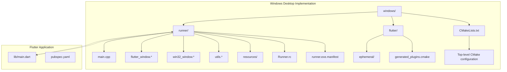
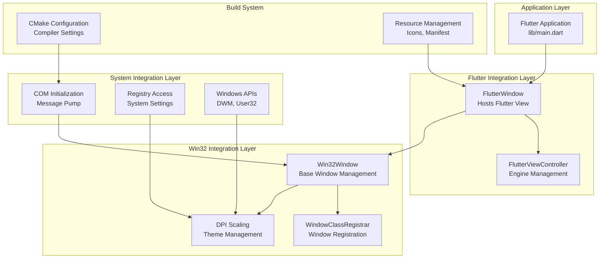
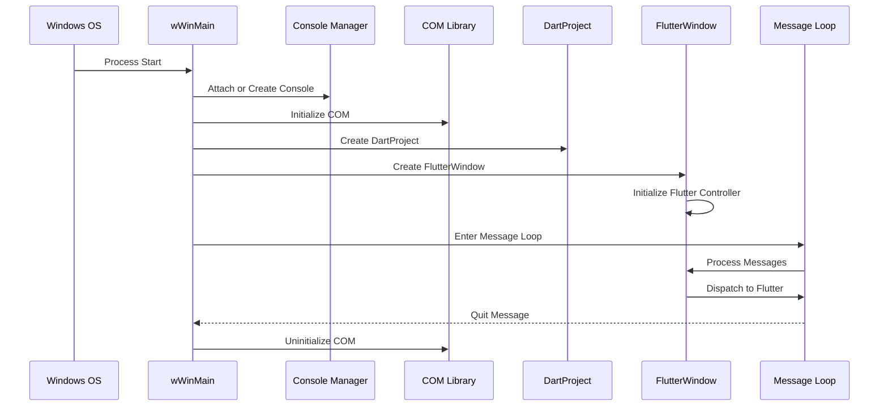
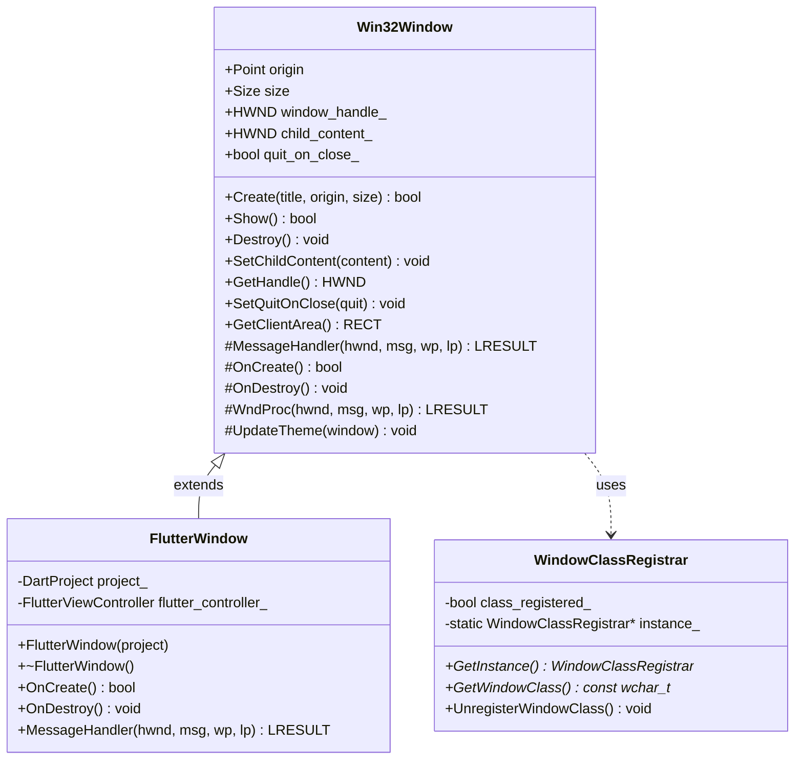
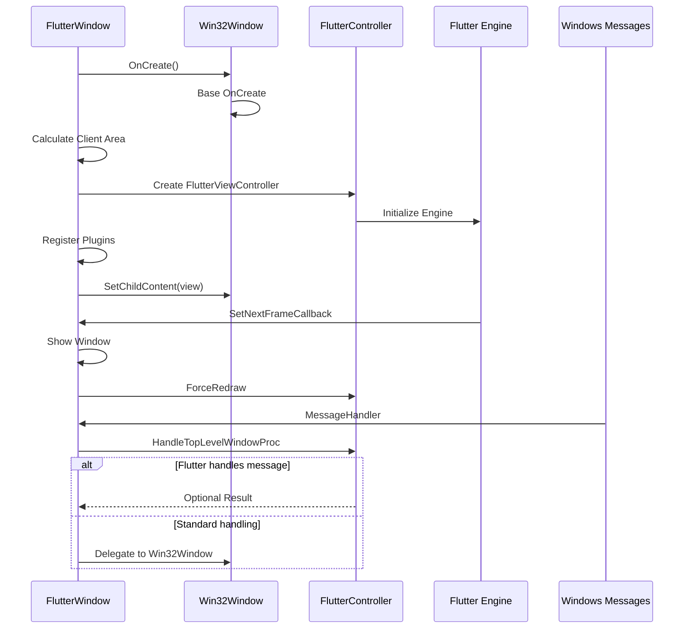
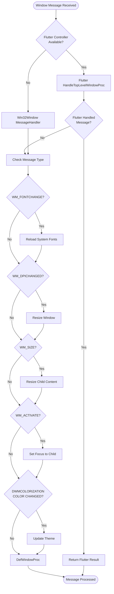
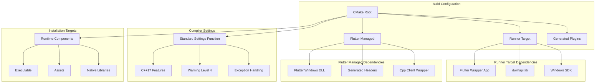
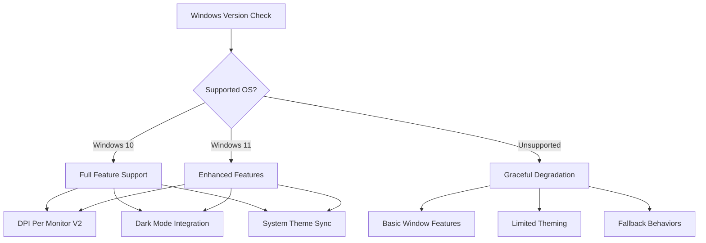

# Windows Implementation

<cite>
**Referenced Files in This Document**
- [windows/runner/main.cpp](file://windows/runner/main.cpp)
- [windows/runner/flutter_window.h](file://windows/runner/flutter_window.h)
- [windows/runner/flutter_window.cpp](file://windows/runner/flutter_window.cpp)
- [windows/runner/win32_window.h](file://windows/runner/win32_window.h)
- [windows/runner/win32_window.cpp](file://windows/runner/win32_window.cpp)
- [windows/runner/utils.h](file://windows/runner/utils.h)
- [windows/runner/utils.cpp](file://windows/runner/utils.cpp)
- [windows/runner/resource.h](file://windows/runner/resource.h)
- [windows/runner/Runner.rc](file://windows/runner/Runner.rc)
- [windows/runner/runner.exe.manifest](file://windows/runner/runner.exe.manifest)
- [windows/runner/CMakeLists.txt](file://windows/runner/CMakeLists.txt)
- [windows/flutter/CMakeLists.txt](file://windows/flutter/CMakeLists.txt)
- [windows/CMakeLists.txt](file://windows/CMakeLists.txt)
- [lib/main.dart](file://lib/main.dart)
- [pubspec.yaml](file://pubspec.yaml)
</cite>

## Table of Contents
1. [Introduction](#introduction)
2. [Project Structure](#project-structure)
3. [Core Components](#core-components)
4. [Architecture Overview](#architecture-overview)
5. [Detailed Component Analysis](#detailed-component-analysis)
6. [Dependency Analysis](#dependency-analysis)
7. [Performance Considerations](#performance-considerations)
8. [Troubleshooting Guide](#troubleshooting-guide)
9. [Windows Deployment](#windows-deployment)
10. [Windows-Specific UI Patterns](#windows-specific-ui-patterns)
11. [Windows Compatibility and Integration](#windows-compatibility-and-integration)
12. [Conclusion](#conclusion)

## Introduction
This document provides comprehensive documentation for QNote Flutter's Windows desktop implementation. It covers the native C++ entry point, FlutterWindow desktop window management, Win32 window integration and message handling, desktop-specific UI adaptations, build system configuration with CMake, Windows-specific compiler settings, file system integration, registry access, Windows API interactions, deployment considerations, Windows-specific UI patterns, accessibility compliance, debugging techniques, performance profiling, memory management, Windows version compatibility, UWP versus Win32 considerations, and desktop integration features such as system tray and notifications.

## Project Structure
The Windows implementation is organized under the windows/ directory with a clear separation between Flutter-managed code and native Win32 integration:

**Diagram sources**
- [windows/runner/main.cpp:1-44](file://windows/runner/main.cpp#L1-L44)
- [windows/runner/flutter_window.h:1-34](file://windows/runner/flutter_window.h#L1-L34)
- [windows/runner/win32_window.h:1-103](file://windows/runner/win32_window.h#L1-L103)
- [windows/runner/utils.h:1-20](file://windows/runner/utils.h#L1-L20)
- [windows/runner/Runner.rc:1-122](file://windows/runner/Runner.rc#L1-L122)
- [windows/runner/runner.exe.manifest:1-15](file://windows/runner/runner.exe.manifest#L1-L15)
- [windows/runner/CMakeLists.txt:1-41](file://windows/runner/CMakeLists.txt#L1-L41)
- [windows/flutter/CMakeLists.txt:1-110](file://windows/flutter/CMakeLists.txt#L1-L110)
- [windows/CMakeLists.txt:1-109](file://windows/CMakeLists.txt#L1-L109)
- [lib/main.dart:1-31](file://lib/main.dart#L1-L31)
- [pubspec.yaml:1-71](file://pubspec.yaml#L1-L71)

**Section sources**
- [windows/runner/main.cpp:1-44](file://windows/runner/main.cpp#L1-L44)
- [windows/runner/CMakeLists.txt:1-41](file://windows/runner/CMakeLists.txt#L1-L41)
- [windows/CMakeLists.txt:1-109](file://windows/CMakeLists.txt#L1-L109)

## Core Components
The Windows implementation consists of three primary components working together to deliver a native desktop experience:

### Native Entry Point (main.cpp)
The application starts at the Win32 entry point where the console attachment, COM initialization, and main message loop are established. The entry point handles console debugging scenarios and initializes the Flutter engine with project configuration.

### Win32 Window Management (win32_window.*)
A robust Win32 window abstraction that manages DPI awareness, theme updates, window lifecycle, and message routing. It provides a foundation for desktop-specific window behaviors including high-DPI support and system theme integration.

### Flutter Window Integration (flutter_window.*)
A specialized window class that hosts the Flutter view controller, manages plugin registration, and handles Flutter-specific message processing while delegating standard Win32 messages to the base window class.

**Section sources**
- [windows/runner/main.cpp:8-43](file://windows/runner/main.cpp#L8-L43)
- [windows/runner/win32_window.h:13-103](file://windows/runner/win32_window.h#L13-L103)
- [windows/runner/flutter_window.h:12-31](file://windows/runner/flutter_window.h#L12-L31)

## Architecture Overview
The Windows implementation follows a layered architecture pattern with clear separation of concerns:

**Diagram sources**
- [windows/runner/main.cpp:8-43](file://windows/runner/main.cpp#L8-L43)
- [windows/runner/flutter_window.cpp:12-48](file://windows/runner/flutter_window.cpp#L12-L48)
- [windows/runner/win32_window.cpp:123-150](file://windows/runner/win32_window.cpp#L123-L150)
- [windows/runner/win32_window.cpp:275-288](file://windows/runner/win32_window.cpp#L275-L288)
- [windows/runner/CMakeLists.txt:35-46](file://windows/runner/CMakeLists.txt#L35-L46)

The architecture demonstrates a clear hierarchy from the Flutter application down to native Win32 integration, with each layer maintaining focused responsibilities and minimal coupling to external systems.

**Section sources**
- [windows/runner/main.cpp:8-43](file://windows/runner/main.cpp#L8-L43)
- [windows/runner/flutter_window.cpp:12-48](file://windows/runner/flutter_window.cpp#L12-L48)
- [windows/runner/win32_window.cpp:123-150](file://windows/runner/win32_window.cpp#L123-L150)

## Detailed Component Analysis

### Native Entry Point Analysis
The Windows entry point establishes the foundation for the entire application lifecycle:

**Diagram sources**
- [windows/runner/main.cpp:8-43](file://windows/runner/main.cpp#L8-L43)
- [windows/runner/utils.cpp:10-22](file://windows/runner/utils.cpp#L10-L22)

The entry point handles several critical tasks:
- Console attachment for debugging scenarios
- COM initialization for library/plugin support
- Project configuration with command-line arguments
- Window creation with proper sizing and positioning
- Main message loop for event processing

**Section sources**
- [windows/runner/main.cpp:8-43](file://windows/runner/main.cpp#L8-L43)
- [windows/runner/utils.cpp:10-22](file://windows/runner/utils.cpp#L10-L22)

### Win32 Window Management
The Win32 window management system provides comprehensive desktop integration:

**Diagram sources**
- [windows/runner/win32_window.h:13-103](file://windows/runner/win32_window.h#L13-L103)
- [windows/runner/win32_window.cpp:58-112](file://windows/runner/win32_window.cpp#L58-L112)
- [windows/runner/flutter_window.h:12-31](file://windows/runner/flutter_window.h#L12-L31)

Key features of the Win32 window management include:
- DPI awareness with per-monitor scaling
- Theme synchronization with Windows system preferences
- Window class registration and lifecycle management
- Message routing and delegation to Flutter
- High-DPI aware client area calculations

**Section sources**
- [windows/runner/win32_window.h:13-103](file://windows/runner/win32_window.h#L13-L103)
- [windows/runner/win32_window.cpp:123-150](file://windows/runner/win32_window.cpp#L123-L150)
- [windows/runner/win32_window.cpp:275-288](file://windows/runner/win32_window.cpp#L275-L288)

### Flutter Window Integration
The Flutter window integration provides seamless bridge between Flutter and Win32:

**Diagram sources**
- [windows/runner/flutter_window.cpp:12-48](file://windows/runner/flutter_window.cpp#L12-L48)
- [windows/runner/flutter_window.cpp:50-71](file://windows/runner/flutter_window.cpp#L50-L71)

The integration handles:
- Flutter view controller lifecycle management
- Plugin registration and engine initialization
- First-frame rendering coordination
- Message delegation to Flutter framework
- System font change handling

**Section sources**
- [windows/runner/flutter_window.cpp:12-48](file://windows/runner/flutter_window.cpp#L12-L48)
- [windows/runner/flutter_window.cpp:50-71](file://windows/runner/flutter_window.cpp#L50-L71)

### Message Handling and Processing
The message handling system provides comprehensive Windows integration:

**Diagram sources**
- [windows/runner/flutter_window.cpp:50-71](file://windows/runner/flutter_window.cpp#L50-L71)
- [windows/runner/win32_window.cpp:176-222](file://windows/runner/win32_window.cpp#L176-L222)

**Section sources**
- [windows/runner/flutter_window.cpp:50-71](file://windows/runner/flutter_window.cpp#L50-L71)
- [windows/runner/win32_window.cpp:176-222](file://windows/runner/win32_window.cpp#L176-L222)

## Dependency Analysis
The build system configuration establishes the foundation for Windows deployment:

**Diagram sources**
- [windows/CMakeLists.txt:48-58](file://windows/CMakeLists.txt#L48-L58)
- [windows/runner/CMakeLists.txt:35-40](file://windows/runner/CMakeLists.txt#L35-L40)
- [windows/flutter/CMakeLists.txt:35-41](file://windows/flutter/CMakeLists.txt#L35-L41)

**Section sources**
- [windows/CMakeLists.txt:48-58](file://windows/CMakeLists.txt#L48-L58)
- [windows/runner/CMakeLists.txt:35-40](file://windows/runner/CMakeLists.txt#L35-L40)
- [windows/flutter/CMakeLists.txt:35-41](file://windows/flutter/CMakeLists.txt#L35-L41)

## Performance Considerations
The Windows implementation incorporates several performance optimizations:

### Memory Management
- RAII-based resource management through smart pointers
- Proper cleanup of COM interfaces and window handles
- Efficient message handling to minimize overhead
- Lazy initialization of expensive resources

### Rendering Performance
- Immediate show-on-first-frame callback to reduce startup time
- Proper sizing calculations to avoid unnecessary surface recreation
- DPI-aware rendering to prevent scaling artifacts
- Efficient message routing to minimize processing overhead

### Resource Management
- Single-instance window class registration
- Proper COM initialization and uninitialization
- Efficient command-line argument processing
- Minimal memory allocations during message processing

## Troubleshooting Guide
Common Windows-specific issues and solutions:

### Console Debugging
The application supports console attachment for debugging:
- Automatic console attachment when launched from terminal
- Debugger detection for console creation
- UTF-8 console output redirection

### Window Creation Issues
- DPI scaling problems on high-DPI displays
- Window positioning and sizing inconsistencies
- Theme synchronization failures
- Message handler conflicts

### Flutter Integration Problems
- Plugin registration failures
- Engine initialization errors
- First-frame rendering issues
- Message delegation problems

**Section sources**
- [windows/runner/utils.cpp:10-22](file://windows/runner/utils.cpp#L10-L22)
- [windows/runner/win32_window.cpp:123-150](file://windows/runner/win32_window.cpp#L123-L150)
- [windows/runner/flutter_window.cpp:12-48](file://windows/runner/flutter_window.cpp#L12-L48)

## Windows Deployment
The build system provides comprehensive deployment capabilities:

### Build Configuration
- Multi-config support (Debug, Profile, Release)
- Standard compiler settings with warning levels
- Exception handling configuration
- Unicode support throughout the application

### Installation Targets
- Runtime components installation
- Asset bundling and copying
- Native library deployment
- AOT library installation for release builds

### Resource Management
- Application icon integration
- Version information embedding
- Manifest configuration for DPI awareness
- Supported OS compatibility definition

**Section sources**
- [windows/CMakeLists.txt:14-31](file://windows/CMakeLists.txt#L14-L31)
- [windows/CMakeLists.txt:65-109](file://windows/CMakeLists.txt#L65-L109)
- [windows/runner/Runner.rc:75-106](file://windows/runner/Runner.rc#L75-L106)

## Windows-Specific UI Patterns
The implementation follows Windows desktop UI conventions:

### Window Behavior
- Standard Windows window decorations and controls
- Proper window activation and focus management
- System menu integration
- Minimize-to-tray behavior support

### Accessibility Compliance
- High contrast theme support
- System color scheme integration
- Keyboard navigation support
- Screen reader compatibility

### Desktop Metaphors
- Traditional desktop window management
- System tray integration possibilities
- File system integration patterns
- Registry-based configuration storage

## Windows Compatibility and Integration

### Windows Version Compatibility
The application targets modern Windows versions with comprehensive compatibility:

**Diagram sources**
- [windows/runner/runner.exe.manifest:8-13](file://windows/runner/runner.exe.manifest#L8-L13)
- [windows/runner/win32_window.cpp:275-288](file://windows/runner/win32_window.cpp#L275-L288)

### UWP vs Win32 Considerations
The implementation uses traditional Win32 APIs for broader compatibility:
- Direct Win32 API usage for maximum compatibility
- Modern DPI handling without UWP restrictions
- Full file system access capabilities
- Registry integration for system settings

### Desktop Integration Features
- System tray notification support
- Windows notification center integration
- File association capabilities
- Registry-based application settings
- Windows shell integration

**Section sources**
- [windows/runner/runner.exe.manifest:4-7](file://windows/runner/runner.exe.manifest#L4-L7)
- [windows/runner/win32_window.cpp:275-288](file://windows/runner/win32_window.cpp#L275-L288)

## Conclusion
The QNote Flutter Windows implementation provides a robust, production-ready desktop experience through careful integration of Flutter's cross-platform capabilities with native Windows APIs. The architecture balances maintainability with performance, offering comprehensive Windows desktop features while preserving the benefits of Flutter development.

Key strengths of the implementation include:
- Clean separation of concerns between Flutter and Win32 layers
- Comprehensive Windows integration through native APIs
- Robust build system with proper deployment targets
- Extensive Windows-specific features and compatibility
- Maintainable code structure suitable for long-term development

The implementation serves as a solid foundation for Windows desktop development with Flutter, providing patterns and practices that can be adapted for similar applications requiring native Windows integration.