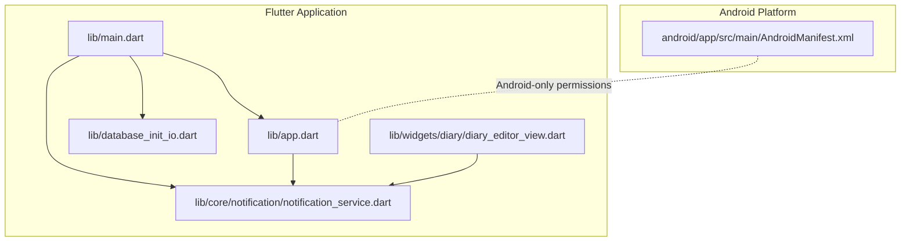
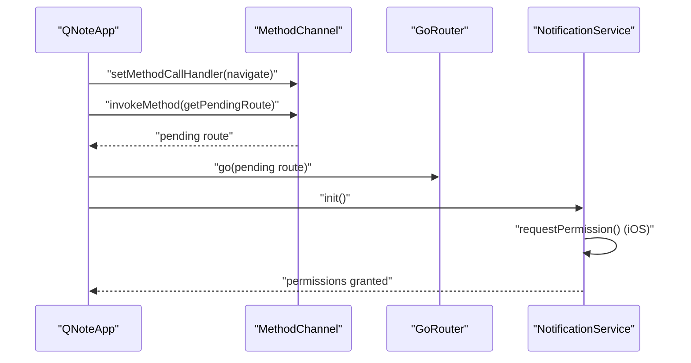
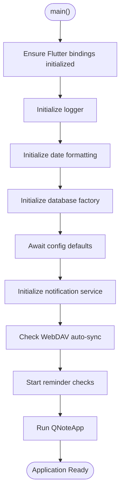
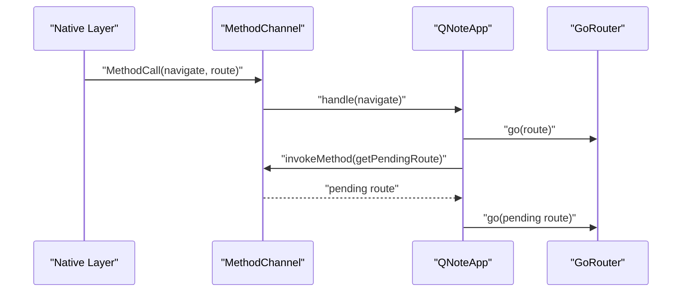
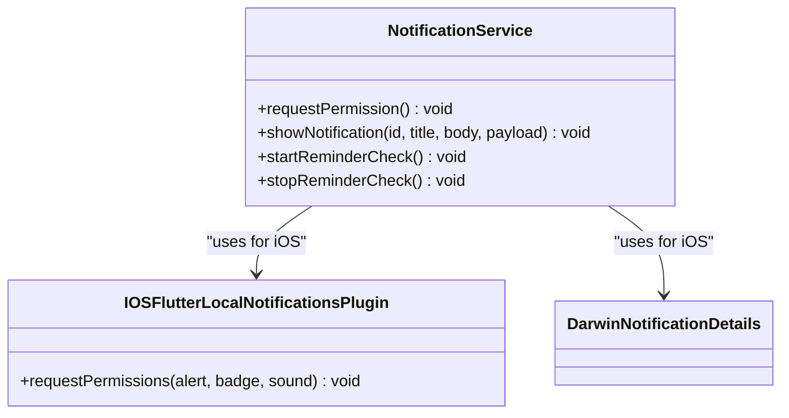
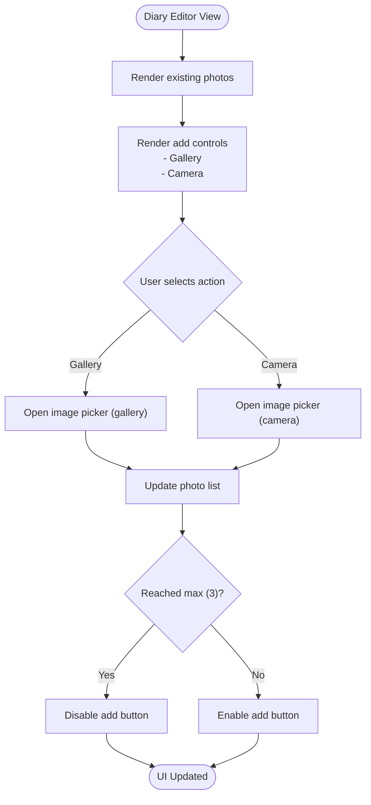
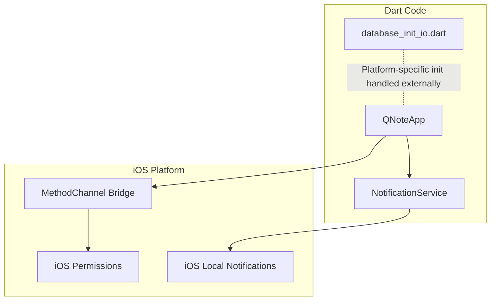
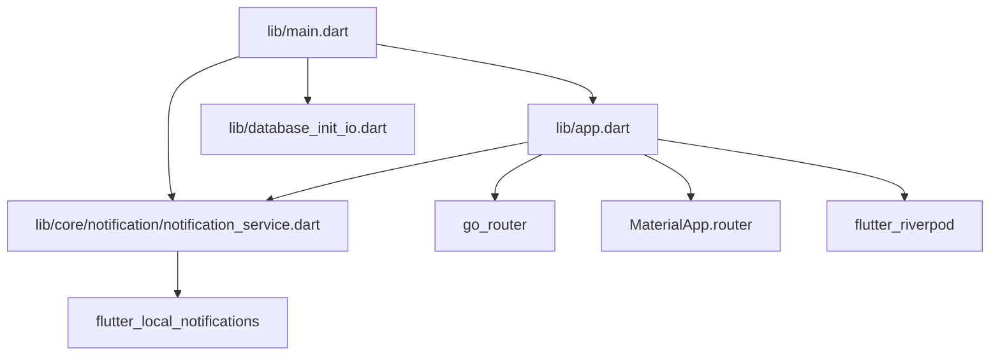

# iOS Implementation

<cite>
**Referenced Files in This Document**
- [pubspec.yaml](file://pubspec.yaml)
- [main.dart](file://lib/main.dart)
- [app.dart](file://lib/app.dart)
- [database_init_io.dart](file://lib/database_init_io.dart)
- [notification_service.dart](file://lib/core/notification/notification_service.dart)
- [diary_editor_view.dart](file://lib/widgets/diary/diary_editor_view.dart)
- [AndroidManifest.xml](file://android/app/src/main/AndroidManifest.xml)
</cite>

## Table of Contents
1. [Introduction](#introduction)
2. [Project Structure](#project-structure)
3. [Core Components](#core-components)
4. [Architecture Overview](#architecture-overview)
5. [Detailed Component Analysis](#detailed-component-analysis)
6. [Dependency Analysis](#dependency-analysis)
7. [Performance Considerations](#performance-considerations)
8. [Troubleshooting Guide](#troubleshooting-guide)
9. [Conclusion](#conclusion)

## Introduction
This document provides comprehensive documentation for QNote Flutter's iOS implementation. It focuses on the iOS-specific code architecture, configuration patterns, and integration points present in the repository. The analysis covers application startup, notification handling, media selection workflows, and iOS-specific service integrations visible in the codebase. Where applicable, this document also highlights areas that would require iOS-specific project configuration (such as Xcode project settings, entitlements, and deployment targets) that are not present in the current repository snapshot.

## Project Structure
The repository follows a standard Flutter project layout with platform-specific directories for Android and iOS. The iOS implementation is primarily contained within the Flutter application code and platform channels, with minimal explicit iOS project configuration visible in the repository snapshot.

**Diagram sources**
- [main.dart:1-31](file://lib/main.dart#L1-L31)
- [app.dart:1-124](file://lib/app.dart#L1-L124)
- [notification_service.dart:91-183](file://lib/core/notification/notification_service.dart#L91-L183)
- [database_init_io.dart:1-2](file://lib/database_init_io.dart#L1-L2)
- [diary_editor_view.dart:2048-2091](file://lib/widgets/diary/diary_editor_view.dart#L2048-L2091)
- [AndroidManifest.xml:1-11](file://android/app/src/main/AndroidManifest.xml#L1-L11)

**Section sources**
- [pubspec.yaml:1-71](file://pubspec.yaml#L1-L71)
- [main.dart:1-31](file://lib/main.dart#L1-L31)
- [app.dart:1-124](file://lib/app.dart#L1-L124)

## Core Components
This section outlines the iOS-relevant components and their roles in the application lifecycle and feature set.

- Application bootstrap and initialization
  - The application initializes logging, date formatting, database factory, and performs concurrent initialization of configuration defaults, notification service, and optional synchronization scheduling. The database factory initialization is platform-specific and currently a no-op for iOS.
  - Reference: [main.dart:12-30](file://lib/main.dart#L12-L30), [database_init_io.dart:1-2](file://lib/database_init_io.dart#L1-L2)

- Application UI and navigation
  - The main application widget configures Material routing, theme modes, localization delegates, and a global gesture handler to dismiss focus and manage navigation behavior.
  - Reference: [app.dart:78-121](file://lib/app.dart#L78-L121)

- Platform channel integration
  - A method channel is established for cross-platform communication, enabling navigation commands from native contexts and handling cold-start pending routes after the first frame.
  - Reference: [app.dart:20-68](file://lib/app.dart#L20-L68)

- Notification service for iOS
  - The notification service requests iOS notification permissions and displays notifications using platform-specific details. iOS-specific permission requests and Darwin notification details are used conditionally.
  - Reference: [notification_service.dart:91-121](file://lib/core/notification/notification_service.dart#L91-L121), [notification_service.dart:162-183](file://lib/core/notification/notification_service.dart#L162-L183)

- Photo gallery and camera integration UI
  - The diary editor view presents a horizontal photo list with actions to select photos from the gallery or capture with the camera, supporting up to three attachments.
  - Reference: [diary_editor_view.dart:2048-2091](file://lib/widgets/diary/diary_editor_view.dart#L2048-L2091)

**Section sources**
- [main.dart:12-30](file://lib/main.dart#L12-L30)
- [database_init_io.dart:1-2](file://lib/database_init_io.dart#L1-L2)
- [app.dart:20-68](file://lib/app.dart#L20-L68)
- [app.dart:78-121](file://lib/app.dart#L78-L121)
- [notification_service.dart:91-121](file://lib/core/notification/notification_service.dart#L91-L121)
- [notification_service.dart:162-183](file://lib/core/notification/notification_service.dart#L162-L183)
- [diary_editor_view.dart:2048-2091](file://lib/widgets/diary/diary_editor_view.dart#L2048-L2091)

## Architecture Overview
The iOS implementation leverages Flutter's platform abstraction to integrate with iOS-specific services while maintaining a unified Dart codebase. The architecture centers around the application bootstrap, platform channels, and conditional platform logic for notifications.

**Diagram sources**
- [app.dart:20-68](file://lib/app.dart#L20-L68)
- [notification_service.dart:91-121](file://lib/core/notification/notification_service.dart#L91-L121)

## Detailed Component Analysis

### Application Bootstrap and Lifecycle
- Initialization sequence
  - Ensures Flutter binding is initialized, sets up logging and date localization, initializes the database factory, waits for configuration repositories to ensure defaults, initializes the notification service, optionally schedules sync, and starts reminder checks.
- iOS-specific note
  - The database factory initialization is a no-op for iOS, indicating platform-specific initialization is handled elsewhere (e.g., via Xcode project configuration or native plugins).

**Diagram sources**
- [main.dart:12-30](file://lib/main.dart#L12-L30)
- [database_init_io.dart:1-2](file://lib/database_init_io.dart#L1-L2)

**Section sources**
- [main.dart:12-30](file://lib/main.dart#L12-L30)
- [database_init_io.dart:1-2](file://lib/database_init_io.dart#L1-L2)

### Platform Channel Integration
- Method channel setup
  - Establishes a named method channel for native-to-Dart communication, handles navigation commands, and retrieves any pending route after the first frame to avoid cold-start navigation issues.
- Navigation behavior
  - Uses a global PopScope to control back navigation and restricts popping outside specific shell routes.

**Diagram sources**
- [app.dart:20-68](file://lib/app.dart#L20-L68)

**Section sources**
- [app.dart:20-68](file://lib/app.dart#L20-L68)

### Notification Service (iOS)
- Permission handling
  - Requests iOS notification permissions for alerts, badges, and sounds using platform-specific plugin resolution.
- Notification delivery
  - Displays notifications using Darwin-specific details on iOS while maintaining Android details for Android platforms.

**Diagram sources**
- [notification_service.dart:91-121](file://lib/core/notification/notification_service.dart#L91-L121)
- [notification_service.dart:162-183](file://lib/core/notification/notification_service.dart#L162-L183)

**Section sources**
- [notification_service.dart:91-121](file://lib/core/notification/notification_service.dart#L91-L121)
- [notification_service.dart:162-183](file://lib/core/notification/notification_service.dart#L162-L183)

### Photo Gallery and Camera Integration UI
- Horizontal photo list with add actions
  - Presents a compact horizontal list of selected photos with controls to add photos from the gallery or camera, allowing up to three attachments.
- Interaction pattern
  - Uses an ImageSource enumeration to differentiate between gallery and camera actions.

**Diagram sources**
- [diary_editor_view.dart:2048-2091](file://lib/widgets/diary/diary_editor_view.dart#L2048-L2091)

**Section sources**
- [diary_editor_view.dart:2048-2091](file://lib/widgets/diary/diary_editor_view.dart#L2048-L2091)

### Conceptual Overview
The iOS implementation relies on Flutter’s platform abstraction and conditional compilation to handle platform differences. While the current repository snapshot does not include explicit iOS project configuration files, the application integrates with iOS-specific services through platform channels and conditional platform logic.

[No sources needed since this diagram shows conceptual workflow, not actual code structure]

## Dependency Analysis
This section maps dependencies among iOS-relevant components and highlights external libraries used for iOS integration.

**Diagram sources**
- [main.dart:1-31](file://lib/main.dart#L1-L31)
- [app.dart:1-124](file://lib/app.dart#L1-L124)
- [notification_service.dart:91-183](file://lib/core/notification/notification_service.dart#L91-L183)
- [database_init_io.dart:1-2](file://lib/database_init_io.dart#L1-L2)

**Section sources**
- [pubspec.yaml:9-43](file://pubspec.yaml#L9-L43)
- [main.dart:1-31](file://lib/main.dart#L1-L31)
- [app.dart:1-124](file://lib/app.dart#L1-L124)
- [notification_service.dart:91-183](file://lib/core/notification/notification_service.dart#L91-L183)

## Performance Considerations
- Initialization concurrency
  - The application uses concurrent initialization for configuration defaults, notification service, and optional synchronization to reduce startup latency.
- Reminder checks
  - Periodic reminder checks are scheduled at one-minute intervals; ensure timers are properly canceled on app lifecycle changes to prevent memory leaks.
- UI responsiveness
  - Gesture handling and navigation logic minimize unnecessary rebuilds and ensure smooth interactions.

[No sources needed since this section provides general guidance]

## Troubleshooting Guide
- Notification permission errors
  - iOS permission requests are wrapped in try-catch blocks; verify that the notification service is initialized during app startup and that permissions are requested appropriately.
  - References: [notification_service.dart:91-121](file://lib/core/notification/notification_service.dart#L91-L121), [notification_service.dart:162-183](file://lib/core/notification/notification_service.dart#L162-L183)

- Navigation issues after cold start
  - Pending route handling occurs after the first frame; ensure the method channel is set up correctly and that the native layer invokes the pending route retrieval.
  - Reference: [app.dart:60-67](file://lib/app.dart#L60-L67)

- Database initialization on iOS
  - The iOS database factory initialization is a no-op; confirm that iOS-specific database initialization is configured via Xcode project settings or native plugins.
  - Reference: [database_init_io.dart:1-2](file://lib/database_init_io.dart#L1-L2)

- Photo selection UI not responding
  - Verify that the photo list rendering logic and add controls are invoked correctly and that the maximum photo limit is enforced.
  - Reference: [diary_editor_view.dart:2048-2091](file://lib/widgets/diary/diary_editor_view.dart#L2048-L2091)

**Section sources**
- [notification_service.dart:91-121](file://lib/core/notification/notification_service.dart#L91-L121)
- [notification_service.dart:162-183](file://lib/core/notification/notification_service.dart#L162-L183)
- [app.dart:60-67](file://lib/app.dart#L60-L67)
- [database_init_io.dart:1-2](file://lib/database_init_io.dart#L1-L2)
- [diary_editor_view.dart:2048-2091](file://lib/widgets/diary/diary_editor_view.dart#L2048-L2091)

## Conclusion
QNote Flutter’s iOS implementation is structured around a clean separation of concerns: a robust application bootstrap, platform channel integration for native communication, and conditional iOS notification handling. While the current repository snapshot does not include explicit iOS project configuration files, the application demonstrates clear patterns for integrating with iOS-specific services and managing platform differences through conditional logic and platform channels. For a complete iOS deployment, additional iOS project configuration (Xcode project settings, entitlements, provisioning profiles, and app capabilities) would be required, but these are not present in the current repository snapshot.