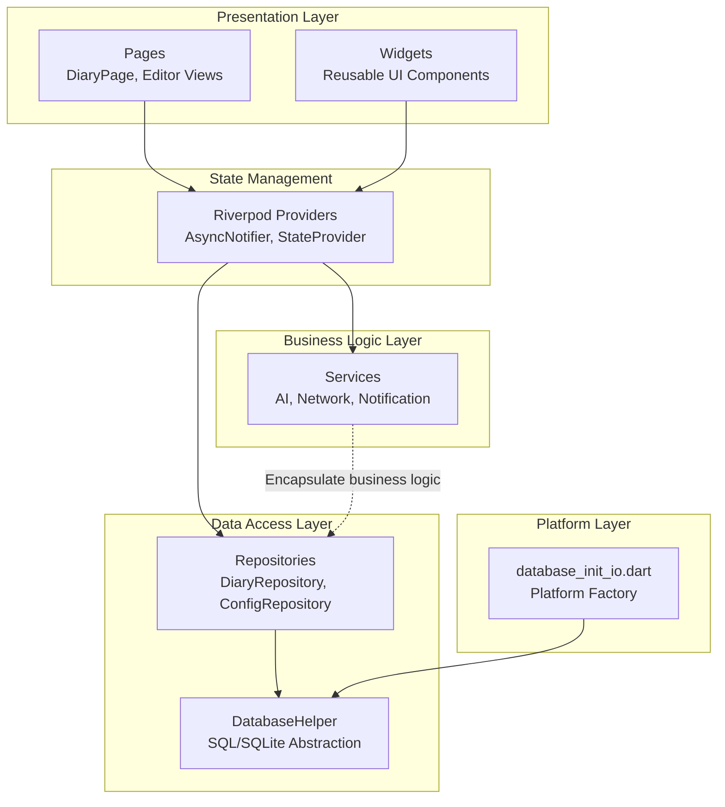
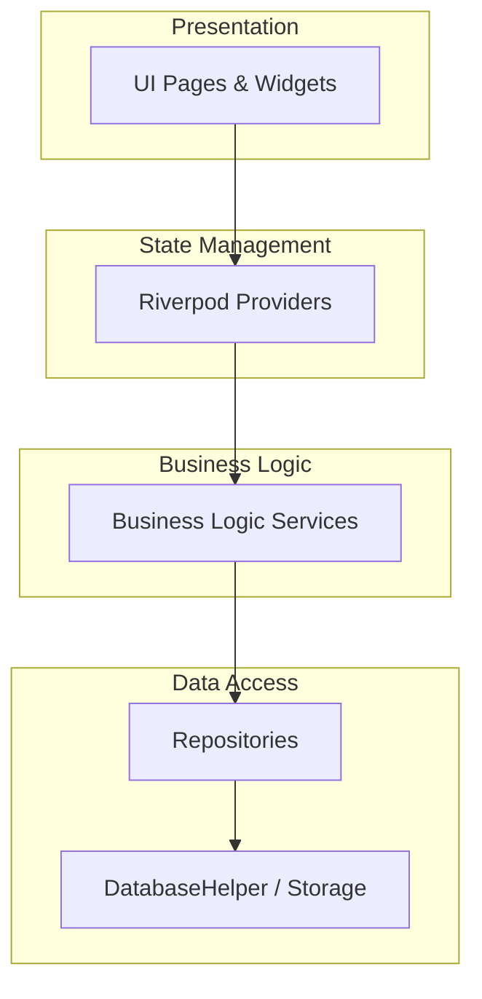
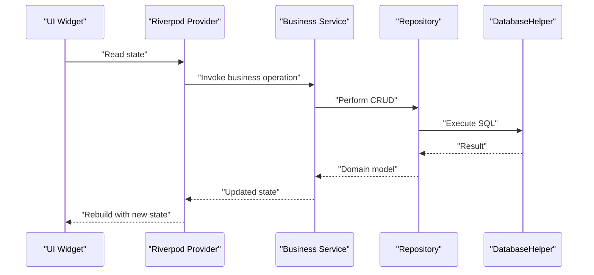
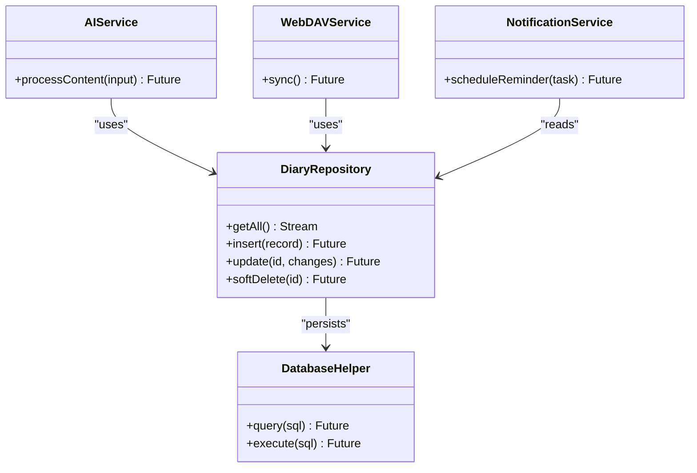
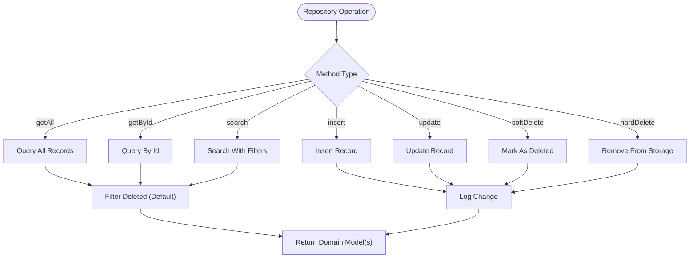
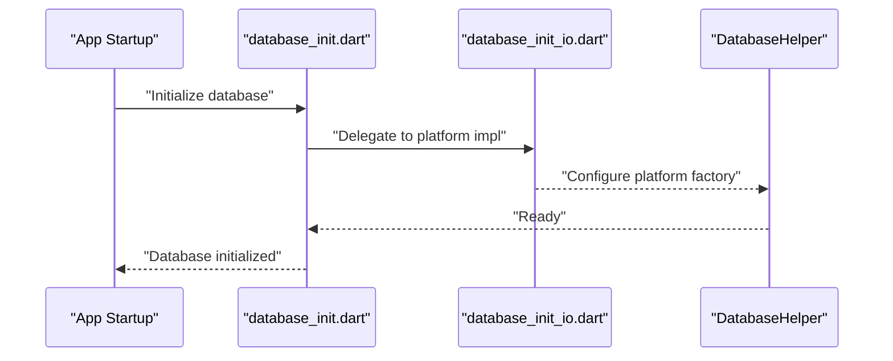
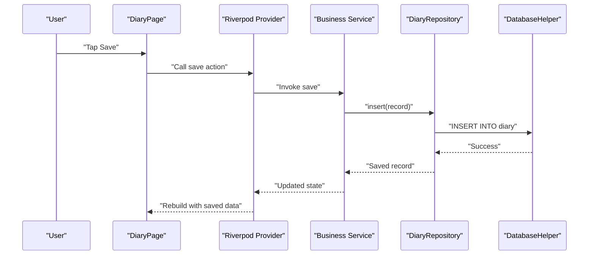
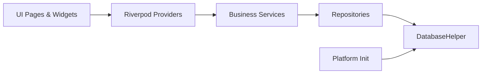

# Architecture Overview

<cite>
**Referenced Files in This Document**
- [app.dart](file://lib/app.dart)
- [main.dart](file://lib/main.dart)
- [app_router.dart](file://lib/core/router/app_router.dart)
- [database_init.dart](file://lib/database_init.dart)
- [database_init_io.dart](file://lib/database_init_io.dart)
- [diary_repository.dart](file://lib/core/storage/diary_repository.dart)
- [database_helper.dart](file://lib/core/storage/database_helper.dart)
- [ai_service.dart](file://lib/core/ai/ai_service.dart)
- [webdav_service.dart](file://lib/core/network/webdav_service.dart)
- [notification_service.dart](file://lib/core/notification/notification_service.dart)
- [AGENTS.md](file://AGENTS.md)
</cite>

## Table of Contents
1. [Introduction](#introduction)
2. [Project Structure](#project-structure)
3. [Core Components](#core-components)
4. [Architecture Overview](#architecture-overview)
5. [Detailed Component Analysis](#detailed-component-analysis)
6. [Dependency Analysis](#dependency-analysis)
7. [Performance Considerations](#performance-considerations)
8. [Troubleshooting Guide](#troubleshooting-guide)
9. [Conclusion](#conclusion)

## Introduction
This document presents QNote Flutter's architectural overview, emphasizing clean architecture principles with a repository pattern implementation. The system separates concerns across four layers:
- Presentation layer (UI pages)
- Business logic layer (services)
- Data access layer (repositories)
- Data models

It also documents state management via Riverpod providers, the service layer pattern for encapsulating business logic, and observer-style reactive updates. The data flow is illustrated from user interactions through pages → providers → repositories → database and the reverse for updates. Design patterns include MVVM-like structure, factory patterns for platform-specific implementations, and observer patterns for real-time updates.

## Project Structure
QNote Flutter organizes code by functional domains and architectural layers:
- lib/config: configuration and constants
- lib/core: cross-cutting services (AI, network, storage, notification, router)
- lib/pages: UI pages implementing presentation logic
- lib/widgets: reusable UI components
- lib/providers: Riverpod provider definitions
- lib/models: data models and domain entities
- lib/database_init.dart and lib/database_init_io.dart: platform-specific database initialization
- lib/app.dart and lib/main.dart: application bootstrap and routing

**Diagram sources**
- [app_router.dart:27-57](file://lib/core/router/app_router.dart#L27-L57)
- [database_init.dart](file://lib/database_init.dart)
- [database_init_io.dart:1-1](file://lib/database_init_io.dart#L1-L1)
- [database_helper.dart](file://lib/core/storage/database_helper.dart)
- [diary_repository.dart](file://lib/core/storage/diary_repository.dart)

**Section sources**
- [app.dart](file://lib/app.dart)
- [main.dart](file://lib/main.dart)
- [app_router.dart:27-57](file://lib/core/router/app_router.dart#L27-L57)

## Core Components
This section outlines the primary architectural components and their responsibilities.

- Application bootstrap and routing:
  - The app initializes routing and navigation using a dedicated router provider, defining shell routes and nested routes for pages like the diary editor.
  - The main entry point sets up the application shell and navigation scaffold.

- State management with Riverpod:
  - Async data is managed using AsyncNotifierProvider and AsyncNotifier.
  - Simple state uses StateProvider.
  - One-off reads use FutureProvider.family.
  - Service instances are provided via Provider.
  - Providers are invalidated or refreshed after data changes to trigger reactive updates.

- Business logic services:
  - AI service encapsulates AI-related operations.
  - WebDAV service handles synchronization tasks.
  - Notification service manages push notifications and reminders.

- Data access layer:
  - Repositories implement CRUD operations with unified method signatures (getAll, getById, insert, update, softDelete, hardDelete, search).
  - Soft delete semantics filter out deleted records by default.
  - All write operations log changes for synchronization.

- Platform-specific initialization:
  - Platform-specific database factory initialization is handled separately to support different platforms.

**Section sources**
- [AGENTS.md:71-102](file://AGENTS.md#L71-L102)
- [app_router.dart:27-57](file://lib/core/router/app_router.dart#L27-L57)
- [database_init.dart](file://lib/database_init.dart)
- [database_init_io.dart:1-1](file://lib/database_init_io.dart#L1-L1)
- [diary_repository.dart](file://lib/core/storage/diary_repository.dart)
- [database_helper.dart](file://lib/core/storage/database_helper.dart)
- [ai_service.dart](file://lib/core/ai/ai_service.dart)
- [webdav_service.dart](file://lib/core/network/webdav_service.dart)
- [notification_service.dart](file://lib/core/notification/notification_service.dart)

## Architecture Overview
QNote Flutter follows a layered architecture with clear separation of concerns:
- Presentation layer: UI pages and widgets consume Riverpod providers to render state and handle user interactions.
- State management: Riverpod providers orchestrate state transitions and coordinate between UI and services.
- Business logic: Services encapsulate domain-specific logic and coordinate with repositories.
- Data access: Repositories abstract persistence and expose a consistent interface to the business logic.
- Data models: Entities define the shape of stored data and provide serialization helpers.

**Diagram sources**
- [app_router.dart:27-57](file://lib/core/router/app_router.dart#L27-L57)
- [AGENTS.md:71-102](file://AGENTS.md#L71-L102)
- [diary_repository.dart](file://lib/core/storage/diary_repository.dart)
- [database_helper.dart](file://lib/core/storage/database_helper.dart)

## Detailed Component Analysis

### State Management with Riverpod
- Async data loading uses AsyncNotifierProvider with AsyncNotifier to manage loading, data, and error states.
- Simple state updates use StateProvider.
- One-off reads use FutureProvider.family for parameterized queries.
- Service instances are provided via Provider to maintain singletons.
- After data mutations, providers are invalidated or refreshed to propagate changes reactively.

**Diagram sources**
- [AGENTS.md:71-102](file://AGENTS.md#L71-L102)
- [diary_repository.dart](file://lib/core/storage/diary_repository.dart)
- [database_helper.dart](file://lib/core/storage/database_helper.dart)

**Section sources**
- [AGENTS.md:71-102](file://AGENTS.md#L71-L102)

### Service Layer Pattern
- Services encapsulate business logic and coordinate between UI and repositories.
- Examples include AI service for AI-driven features, WebDAV service for synchronization, and notification service for reminders.

**Diagram sources**
- [ai_service.dart](file://lib/core/ai/ai_service.dart)
- [webdav_service.dart](file://lib/core/network/webdav_service.dart)
- [notification_service.dart](file://lib/core/notification/notification_service.dart)
- [diary_repository.dart](file://lib/core/storage/diary_repository.dart)
- [database_helper.dart](file://lib/core/storage/database_helper.dart)

**Section sources**
- [ai_service.dart](file://lib/core/ai/ai_service.dart)
- [webdav_service.dart](file://lib/core/network/webdav_service.dart)
- [notification_service.dart](file://lib/core/notification/notification_service.dart)

### Repository Pattern Implementation
- Repositories provide a unified interface for data operations with consistent method signatures.
- Soft delete semantics and change logging ensure data integrity and synchronization readiness.
- Model contracts require id, toMap/fromMap, and copyWith for immutability and serialization.

**Diagram sources**
- [AGENTS.md:84-91](file://AGENTS.md#L84-L91)
- [diary_repository.dart](file://lib/core/storage/diary_repository.dart)

**Section sources**
- [AGENTS.md:84-91](file://AGENTS.md#L84-L91)
- [diary_repository.dart](file://lib/core/storage/diary_repository.dart)

### Platform-Specific Initialization (Factory Pattern)
- Platform-specific database factory initialization is isolated to platform files, enabling factory-style selection of implementations per platform.
- This supports consistent behavior across iOS/Android/Web/Windows targets.

**Diagram sources**
- [database_init.dart](file://lib/database_init.dart)
- [database_init_io.dart:1-1](file://lib/database_init_io.dart#L1-L1)
- [database_helper.dart](file://lib/core/storage/database_helper.dart)

**Section sources**
- [database_init.dart](file://lib/database_init.dart)
- [database_init_io.dart:1-1](file://lib/database_init_io.dart#L1-L1)

### Data Flow: User Interactions to Persistence
- User interactions in pages trigger provider updates.
- Providers invoke services, which coordinate repositories.
- Repositories persist changes via DatabaseHelper and log modifications.
- Reverse flow occurs for updates and refreshes, propagating reactive changes to UI.

**Diagram sources**
- [app_router.dart:27-57](file://lib/core/router/app_router.dart#L27-L57)
- [AGENTS.md:71-102](file://AGENTS.md#L71-L102)
- [diary_repository.dart](file://lib/core/storage/diary_repository.dart)
- [database_helper.dart](file://lib/core/storage/database_helper.dart)

**Section sources**
- [app_router.dart:27-57](file://lib/core/router/app_router.dart#L27-L57)
- [AGENTS.md:71-102](file://AGENTS.md#L71-L102)

## Dependency Analysis
The system exhibits low coupling and high cohesion across layers:
- Presentation depends on Riverpod providers, not on services or repositories directly.
- Services depend on repositories, not on UI.
- Repositories depend on DatabaseHelper, not on UI or services.
- Platform initialization is decoupled and injected at startup.

**Diagram sources**
- [app_router.dart:27-57](file://lib/core/router/app_router.dart#L27-L57)
- [AGENTS.md:71-102](file://AGENTS.md#L71-L102)
- [diary_repository.dart](file://lib/core/storage/diary_repository.dart)
- [database_helper.dart](file://lib/core/storage/database_helper.dart)
- [database_init.dart](file://lib/database_init.dart)

**Section sources**
- [AGENTS.md:71-102](file://AGENTS.md#L71-L102)

## Performance Considerations
- Prefer asynchronous loading with Riverpod AsyncNotifier to avoid blocking the UI thread.
- Use provider invalidation judiciously to minimize unnecessary rebuilds.
- Batch repository operations where possible to reduce database round-trips.
- Leverage platform-specific initialization to optimize database factory configuration.

## Troubleshooting Guide
- State not updating after mutation:
  - Ensure providers are invalidated or refreshed after repository writes.
  - Verify that services rethrow exceptions for proper error propagation to UI.
- Repository errors:
  - Confirm unified method signatures and soft-delete filtering defaults.
  - Check that change logging is invoked for all write operations.
- Platform initialization issues:
  - Validate platform-specific database factory initialization is called during app startup.

**Section sources**
- [AGENTS.md:71-102](file://AGENTS.md#L71-L102)
- [AGENTS.md:94-102](file://AGENTS.md#L94-L102)

## Conclusion
QNote Flutter employs a clean architecture with Riverpod-driven state management, a robust repository pattern, and service-layer encapsulation. The design promotes separation of concerns, testability, and scalability while supporting platform-specific implementations. Reactive updates are achieved through observer-style provider invalidation, ensuring a responsive and consistent user experience.