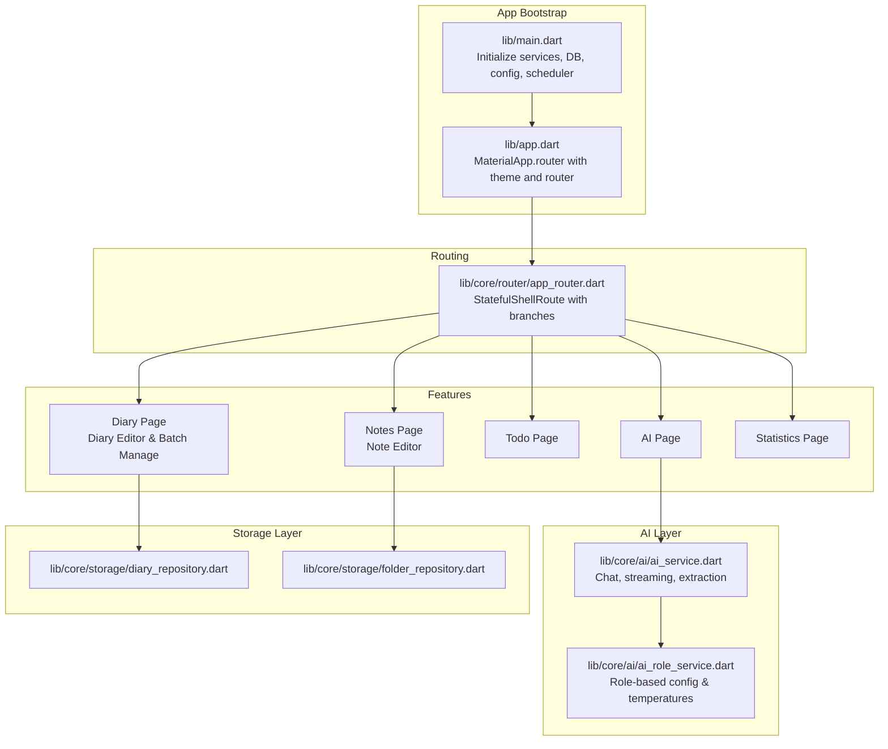
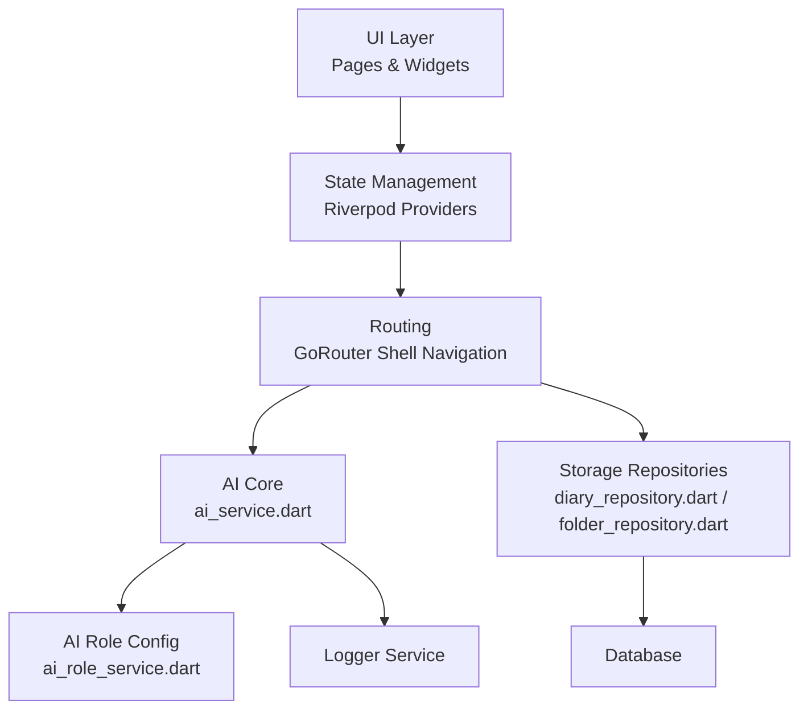
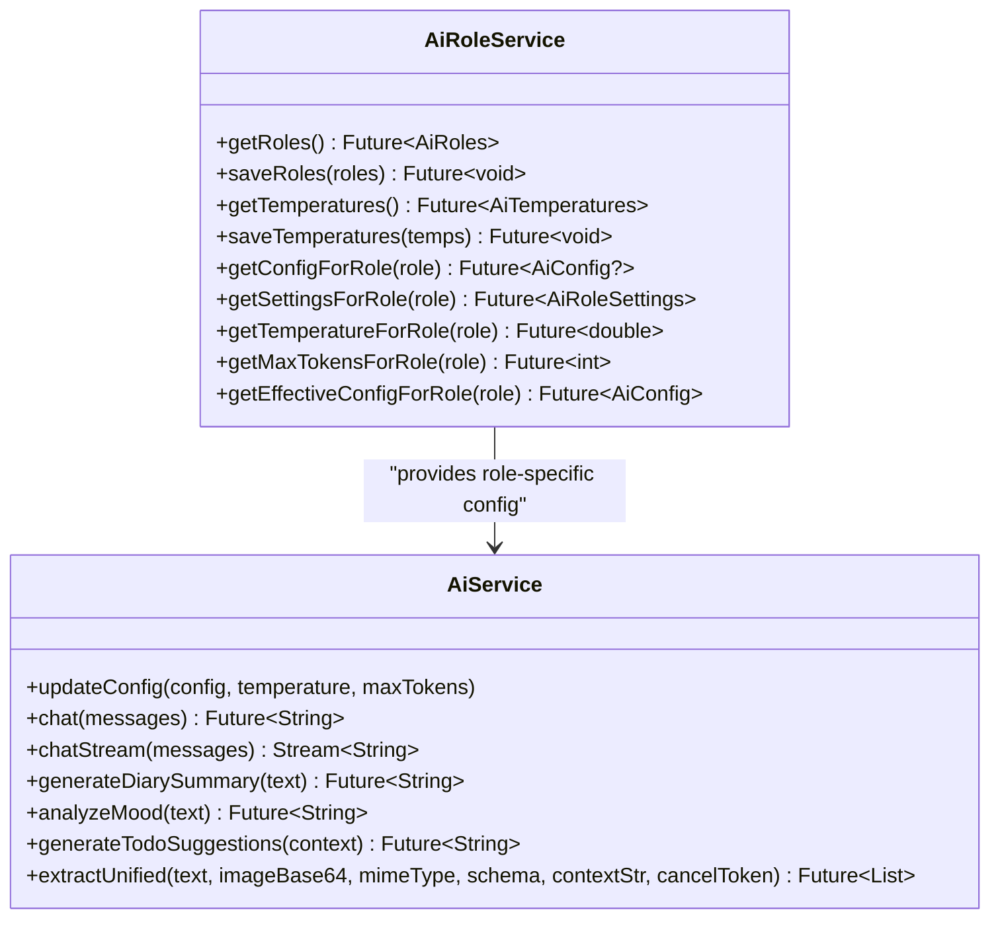
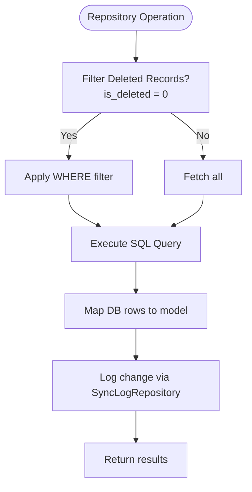
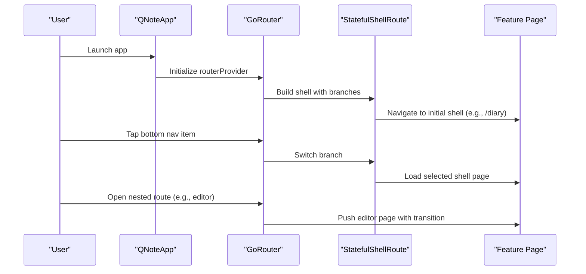
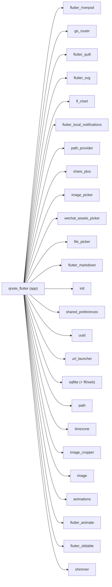

# Introduction

<cite>
**Referenced Files in This Document**
- [README.md](file://README.md)
- [AGENTS.md](file://AGENTS.md)
- [pubspec.yaml](file://pubspec.yaml)
- [lib/main.dart](file://lib/main.dart)
- [lib/app.dart](file://lib/app.dart)
- [lib/core/ai/ai_service.dart](file://lib/core/ai/ai_service.dart)
- [lib/core/ai/ai_role_service.dart](file://lib/core/ai/ai_role_service.dart)
- [lib/core/storage/diary_repository.dart](file://lib/core/storage/diary_repository.dart)
- [lib/core/storage/folder_repository.dart](file://lib/core/storage/folder_repository.dart)
- [lib/core/router/app_router.dart](file://lib/core/router/app_router.dart)
</cite>

## Table of Contents
1. [Introduction](#introduction)
2. [Project Structure](#project-structure)
3. [Core Components](#core-components)
4. [Architecture Overview](#architecture-overview)
5. [Detailed Component Analysis](#detailed-component-analysis)
6. [Dependency Analysis](#dependency-analysis)
7. [Performance Considerations](#performance-considerations)
8. [Troubleshooting Guide](#troubleshooting-guide)
9. [Conclusion](#conclusion)

## Introduction
QNote is a cross-platform note-taking and productivity application built with Flutter. Its mission is to help users organize their daily lives through intelligent note-taking, diary management, and task tracking. QNote combines traditional productivity features with advanced AI capabilities to generate content, summarize experiences, analyze mood, and suggest actionable tasks. It aims to become a comprehensive personal productivity companion that works seamlessly across multiple devices—Android, iOS, Web, and Windows—so users can capture thoughts, reflect on experiences, manage priorities, and gain insights from their data anytime, anywhere.

QNote’s vision is to unify fragmented productivity workflows into a cohesive, AI-enhanced experience. By centralizing notes, diaries, todos, and insights, QNote empowers users to maintain clarity, track progress, and evolve through continuous reflection and intelligent suggestions.

## Project Structure
At a high level, QNote follows a layered, feature-oriented structure:
- Entry point initializes platform services, database, configuration, and scheduling, then launches the app.
- The app defines routing with a bottom shell navigation for core features and settings.
- Core modules encapsulate AI services, storage repositories, networking, notifications, and logging.
- Feature modules include pages and widgets for diary, notes, todos, AI insights, and statistics.
- Providers manage state via Riverpod for reactive UI updates.

**Diagram sources**
- [lib/main.dart:12-30](file://lib/main.dart#L12-L30)
- [lib/app.dart:78-121](file://lib/app.dart#L78-L121)
- [lib/core/router/app_router.dart:27-187](file://lib/core/router/app_router.dart#L27-L187)
- [lib/core/ai/ai_service.dart:22-79](file://lib/core/ai/ai_service.dart#L22-L79)
- [lib/core/ai/ai_role_service.dart:5-79](file://lib/core/ai/ai_role_service.dart#L5-L79)
- [lib/core/storage/diary_repository.dart:5-182](file://lib/core/storage/diary_repository.dart#L5-L182)
- [lib/core/storage/folder_repository.dart:5-135](file://lib/core/storage/folder_repository.dart#L5-L135)

**Section sources**
- [AGENTS.md:27-39](file://AGENTS.md#L27-L39)
- [lib/main.dart:12-30](file://lib/main.dart#L12-L30)
- [lib/app.dart:78-121](file://lib/app.dart#L78-L121)
- [lib/core/router/app_router.dart:27-187](file://lib/core/router/app_router.dart#L27-L187)

## Core Components
- Application bootstrap and lifecycle: Initializes logging, date formatting, database factory, database connection, default configurations, notification service, and scheduled synchronization. On resume, it refreshes providers to keep UI state consistent.
- Routing and navigation: Uses a Material 3 themed router with a shell-based bottom navigation for core shells (diary, notes, todo, ai, statistics) and dedicated settings routes with smooth transitions.
- AI services: Provides chat, streaming chat, structured extraction from text and images, and specialized helpers for diary summaries, mood analysis, and todo suggestions. Supports configurable providers and models with robust error logging.
- Storage repositories: Encapsulate CRUD operations for diary records and folders, with consistent method signatures, soft/hard deletes, and sync log integration.
- State management: Riverpod-based providers drive UI updates and orchestrate asynchronous data flows.

**Section sources**
- [lib/main.dart:12-30](file://lib/main.dart#L12-L30)
- [lib/app.dart:19-47](file://lib/app.dart#L19-L47)
- [lib/app.dart:78-121](file://lib/app.dart#L78-L121)
- [lib/core/ai/ai_service.dart:22-79](file://lib/core/ai/ai_service.dart#L22-L79)
- [lib/core/ai/ai_service.dart:393-445](file://lib/core/ai/ai_service.dart#L393-L445)
- [lib/core/storage/diary_repository.dart:100-162](file://lib/core/storage/diary_repository.dart#L100-L162)
- [lib/core/storage/folder_repository.dart:48-86](file://lib/core/storage/folder_repository.dart#L48-L86)

## Architecture Overview
QNote adopts a modular architecture:
- Presentation layer: Pages and widgets driven by Riverpod providers and routed via GoRouter.
- Domain layer: AI services and role-based configuration for provider/model selection.
- Data layer: Repositories abstract database operations and integrate with a sync log for change tracking.

**Diagram sources**
- [lib/app.dart:78-121](file://lib/app.dart#L78-L121)
- [lib/core/ai/ai_service.dart:22-79](file://lib/core/ai/ai_service.dart#L22-L79)
- [lib/core/ai/ai_role_service.dart:5-79](file://lib/core/ai/ai_role_service.dart#L5-L79)
- [lib/core/storage/diary_repository.dart:5-182](file://lib/core/storage/diary_repository.dart#L5-L182)
- [lib/core/storage/folder_repository.dart:5-135](file://lib/core/storage/folder_repository.dart#L5-L135)

## Detailed Component Analysis

### AI Services and Role-Based Configuration
QNote’s AI layer supports multiple providers and models, with role-based configuration and adjustable generation parameters. It provides:
- Synchronous and streaming chat APIs
- Structured extraction from text and images
- Specialized prompts for diary summarization, mood analysis, and todo suggestions

**Diagram sources**
- [lib/core/ai/ai_service.dart:22-80](file://lib/core/ai/ai_service.dart#L22-L80)
- [lib/core/ai/ai_role_service.dart:5-79](file://lib/core/ai/ai_role_service.dart#L5-L79)

**Section sources**
- [lib/core/ai/ai_service.dart:88-217](file://lib/core/ai/ai_service.dart#L88-L217)
- [lib/core/ai/ai_service.dart:219-369](file://lib/core/ai/ai_service.dart#L219-L369)
- [lib/core/ai/ai_service.dart:393-445](file://lib/core/ai/ai_service.dart#L393-L445)
- [lib/core/ai/ai_service.dart:518-699](file://lib/core/ai/ai_service.dart#L518-L699)
- [lib/core/ai/ai_role_service.dart:28-79](file://lib/core/ai/ai_role_service.dart#L28-L79)

### Data Access Patterns and Sync Logging
Repositories implement a consistent contract for data access, including filtering deleted records, search, and logging changes for synchronization.

**Diagram sources**
- [lib/core/storage/diary_repository.dart:13-21](file://lib/core/storage/diary_repository.dart#L13-L21)
- [lib/core/storage/diary_repository.dart:100-128](file://lib/core/storage/diary_repository.dart#L100-L128)
- [lib/core/storage/diary_repository.dart:130-162](file://lib/core/storage/diary_repository.dart#L130-L162)
- [lib/core/storage/folder_repository.dart:48-76](file://lib/core/storage/folder_repository.dart#L48-L76)

**Section sources**
- [lib/core/storage/diary_repository.dart:13-21](file://lib/core/storage/diary_repository.dart#L13-L21)
- [lib/core/storage/diary_repository.dart:100-162](file://lib/core/storage/diary_repository.dart#L100-L162)
- [lib/core/storage/folder_repository.dart:48-86](file://lib/core/storage/folder_repository.dart#L48-L86)

### Routing and Navigation Flow
QNote uses a shell-based navigation with five primary shells and nested routes for editors and batch operations. Settings routes use smooth horizontal transitions.

**Diagram sources**
- [lib/app.dart:78-121](file://lib/app.dart#L78-L121)
- [lib/core/router/app_router.dart:27-187](file://lib/core/router/app_router.dart#L27-L187)

**Section sources**
- [lib/app.dart:78-121](file://lib/app.dart#L78-L121)
- [lib/core/router/app_router.dart:32-144](file://lib/core/router/app_router.dart#L32-L144)

## Dependency Analysis
QNote leverages a curated set of Flutter packages for productivity, AI connectivity, persistence, and UI polish. The dependency graph highlights key integrations across platforms and features.

**Diagram sources**
- [pubspec.yaml:9-42](file://pubspec.yaml#L9-L42)

**Section sources**
- [pubspec.yaml:1-71](file://pubspec.yaml#L1-L71)

## Performance Considerations
- AI requests: Streaming support reduces perceived latency for long-form generation; ensure timeouts and cancellation tokens are configured appropriately for user experience.
- Database operations: Use batch updates for bulk folder sorting and limit large queries with pagination or range filters.
- UI responsiveness: Keep heavy computations off the UI thread; leverage Riverpod for efficient state invalidation and selective rebuilds.
- Asset handling: Compress images and use lazy loading for galleries to minimize memory footprint.
- Network reliability: Implement retry and exponential backoff for AI endpoints; cache defaults locally to reduce cold-start delays.

## Troubleshooting Guide
- AI configuration errors: Verify provider, base URL, and API key; ensure URLs start with http/https and are parseable. Check logs for payload and response diagnostics during failures.
- Database initialization: Confirm database factory initialization and that the database future resolves before UI rendering.
- Notifications and reminders: Ensure notification service initialization completes and reminder checks are scheduled after app resume.
- Navigation issues: Confirm router provider is initialized and pending routes are handled via the method channel bridge.

**Section sources**
- [lib/core/ai/ai_service.dart:36-79](file://lib/core/ai/ai_service.dart#L36-L79)
- [lib/main.dart:12-30](file://lib/main.dart#L12-L30)
- [lib/app.dart:49-75](file://lib/app.dart#L49-L75)

## Conclusion
QNote delivers a unified, AI-enhanced productivity experience across platforms. By combining robust note-taking, diary reflection, task management, and intelligent insights, it helps users capture, organize, and evolve through their daily lives. The modular architecture, consistent data access patterns, and role-based AI configuration enable both user empowerment and developer maintainability. As QNote continues to mature, it aims to be the go-to personal productivity companion that learns from your habits and helps you achieve more with less friction.