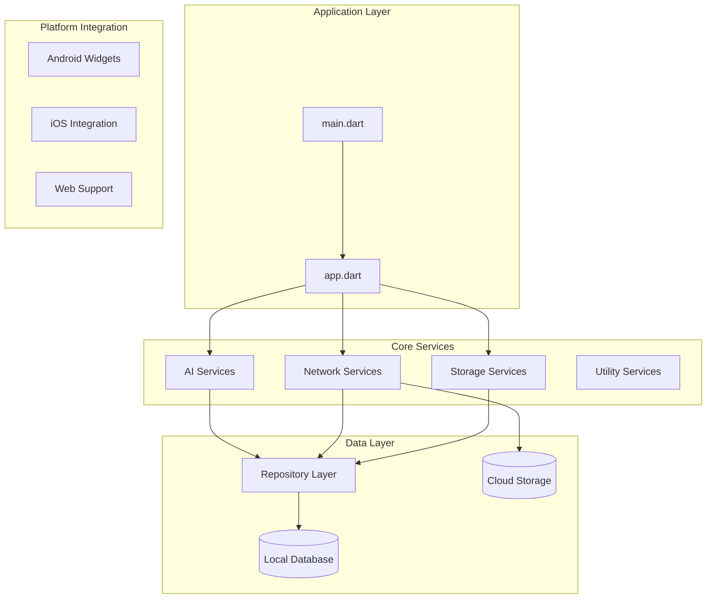
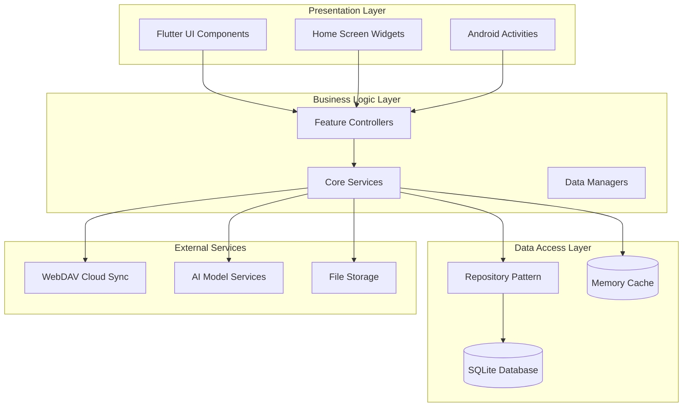
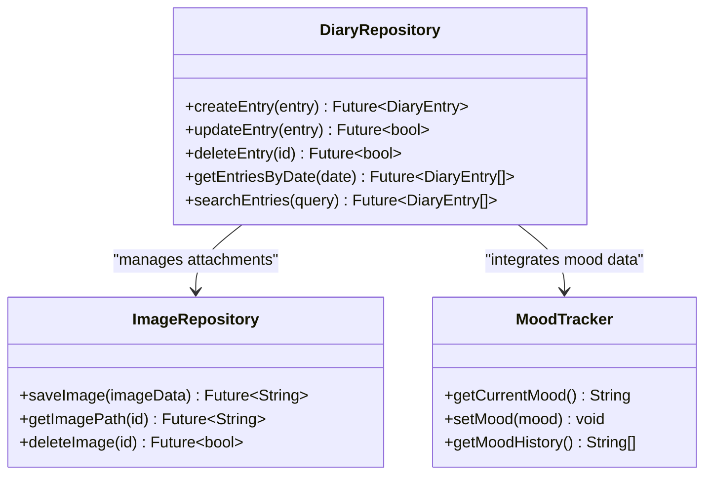
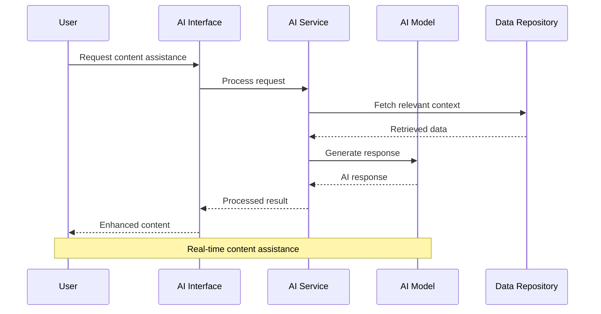
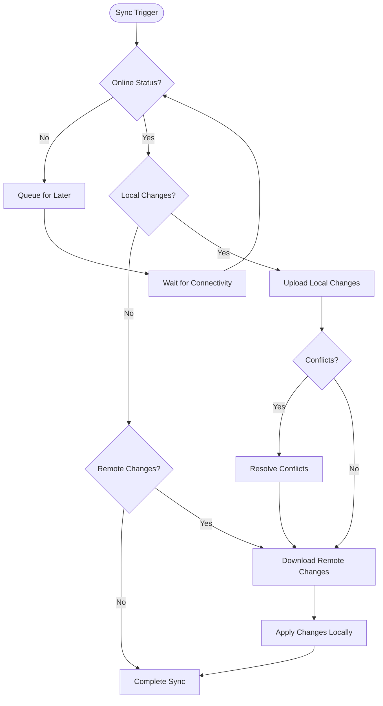
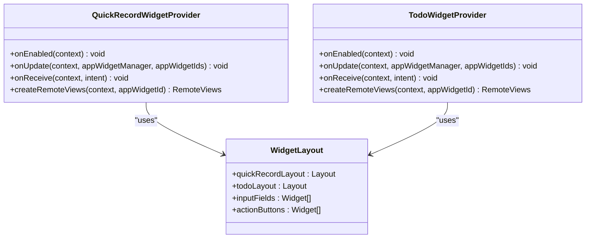
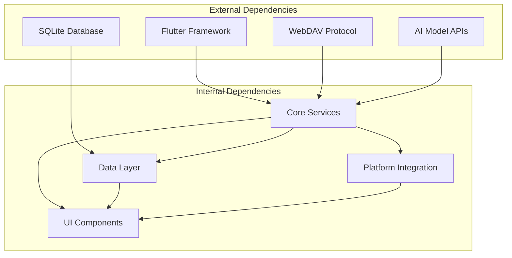

# Key Features

<cite>
**Referenced Files in This Document**
- [main.dart](file://main.dart)
- [app.dart](file://app.dart)
- [ai_service.dart](file://lib/core/ai/ai_service.dart)
- [model_fetch_service.dart](file://lib/core/ai/model_fetch_service.dart)
- [webdav_service.dart](file://lib/core/network/webdav_service.dart)
- [sync_scheduler.dart](file://lib/core/network/sync_scheduler.dart)
- [diary_repository.dart](file://lib/core/storage/diary_repository.dart)
- [folder_repository.dart](file://lib/core/storage/folder_repository.dart)
- [image_repository.dart](file://lib/core/storage/image_repository.dart)
- [database_helper.dart](file://lib/core/storage/database_helper.dart)
- [quick_record_widget_provider.kt](file://android/app/src/main/java/com/appone/qnote_flutter/QuickRecordWidgetProvider.kt)
- [todo_widget_provider.kt](file://android/app/src/main/java/com/appone/qnote_flutter/TodoWidgetProvider.kt)
- [activity_quick_record.xml](file://android/app/src/main/res/layout/activity_quick_record.xml)
- [widget_quick_record.xml](file://android/app/src/main/res/layout/widget_quick_record.xml)
- [widget_todo.xml](file://android/app/src/main/res/layout/widget_todo.xml)
- [widget_quick_record_info.xml](file://android/app/src/main/res/xml/widget_quick_record_info.xml)
- [widget_todo_info.xml](file://android/app/src/main/res/xml/widget_todo_info.xml)
- [ic_camera.xml](file://android/app/src/main/res/drawable/ic_camera.xml)
- [ic_gallery.xml](file://android/app/src/main/res/drawable/ic_gallery.xml)
- [ic_checkbox_checked.xml](file://android/app/src/main/res/drawable/ic_checkbox_unchecked.xml)
- [ic_checkbox_unchecked.xml](file://android/app/src/main/res/drawable/ic_checkbox_unchecked.xml)
- [MainActivity.kt](file://android/app/src/main/java/com/appone/qnote_flutter/MainActivity.kt)
- [QuickRecordActivity.kt](file://android/app/src/main/java/com/appone/qnote_flutter/QuickRecordActivity.kt)
- [AndroidManifest.xml](file://android/app/src/main/AndroidManifest.xml)
</cite>

## Table of Contents
1. [Introduction](#introduction)
2. [Project Structure](#project-structure)
3. [Core Components](#core-components)
4. [Architecture Overview](#architecture-overview)
5. [Detailed Feature Documentation](#detailed-feature-documentation)
6. [Dependency Analysis](#dependency-analysis)
7. [Performance Considerations](#performance-considerations)
8. [Troubleshooting Guide](#troubleshooting-guide)
9. [Conclusion](#conclusion)

## Introduction
QNote Flutter is a comprehensive productivity application designed to help users capture thoughts, organize daily life, and enhance creativity through intelligent features. The application provides a unified platform for diary management with mood tracking, rich text note-taking with folder organization, interactive todo lists, AI-powered content generation, cloud synchronization via WebDAV, optimized image handling, and interactive home screen widgets for quick access.

The application follows a modular architecture with clear separation of concerns, enabling maintainability and extensibility while providing a seamless user experience across multiple platforms including Android, iOS, and web.

## Project Structure
The application is organized into several key modules that handle different aspects of functionality:

**Diagram sources**
- [main.dart](file://main.dart)
- [app.dart](file://app.dart)

**Section sources**
- [main.dart](file://main.dart)
- [app.dart](file://app.dart)

## Core Components
The application's core functionality is built around several interconnected service layers that handle different aspects of data management and user interaction.

### AI Content Generation Services
The AI system provides intelligent content creation and assistance capabilities through dedicated service components that manage model selection, content generation, and response handling.

### Cloud Synchronization Services
WebDAV-based synchronization ensures seamless multi-device access by maintaining consistent data states across all connected devices through scheduled sync operations and conflict resolution mechanisms.

### Storage Management Services
A comprehensive repository pattern handles all data persistence operations, including diary entries, folders, images, and user configurations with robust transaction support and data integrity guarantees.

### Widget Integration Services
Native Android widgets provide quick access to frequently used features, allowing users to capture notes and manage tasks directly from their home screen without launching the full application.

**Section sources**
- [ai_service.dart](file://lib/core/ai/ai_service.dart)
- [webdav_service.dart](file://lib/core/network/webdav_service.dart)
- [diary_repository.dart](file://lib/core/storage/diary_repository.dart)
- [quick_record_widget_provider.kt](file://android/app/src/main/java/com/appone/qnote_flutter/QuickRecordWidgetProvider.kt)

## Architecture Overview
The application follows a layered architecture pattern with clear separation between presentation, business logic, and data access layers:

**Diagram sources**
- [app.dart](file://app.dart)
- [database_helper.dart](file://lib/core/storage/database_helper.dart)
- [webdav_service.dart](file://lib/core/network/webdav_service.dart)

## Detailed Feature Documentation

### Diary Management with Mood Tracking and Photo Attachments
The diary management system provides comprehensive personal journaling capabilities with integrated mood tracking and multimedia support.

#### Core Functionality
- **Mood Tracking Integration**: Users can associate emotional states with diary entries through intuitive selection interfaces
- **Photo Attachment Support**: Integrated camera and gallery access enables rich media diary entries
- **Rich Text Formatting**: Advanced text editing capabilities with formatting options and media embedding
- **Search and Organization**: Powerful search functionality with date-based filtering and tagging systems

#### User Benefits
- Comprehensive life documentation with emotional context
- Visual memory enhancement through photo integration
- Flexible formatting options for creative expression
- Efficient organization and retrieval of personal memories

#### Technical Implementation
The diary system utilizes a repository pattern with dedicated CRUD operations, supporting both structured data entry and unstructured content creation.

**Diagram sources**
- [diary_repository.dart](file://lib/core/storage/diary_repository.dart)
- [image_repository.dart](file://lib/core/storage/image_repository.dart)

**Section sources**
- [diary_repository.dart](file://lib/core/storage/diary_repository.dart)
- [image_repository.dart](file://lib/core/storage/image_repository.dart)

### Note Taking with Rich Text Editing and Folder Organization
The note-taking system provides sophisticated document management with advanced formatting capabilities and hierarchical organization.

#### Key Capabilities
- **Rich Text Editor**: Full-featured text editing with formatting, links, lists, and media insertion
- **Hierarchical Folders**: Nested folder structure for logical note organization
- **Cross-Reference Links**: Internal linking between notes and diary entries
- **Search and Filter**: Advanced search with tag-based filtering and content indexing

#### Power User Features
- **Keyboard Shortcuts**: Streamlined editing workflow for experienced users
- **Template System**: Predefined templates for common note types
- **Export Options**: Multiple format exports for external sharing and backup
- **Batch Operations**: Bulk editing and organization capabilities

#### Integration Points
The note system seamlessly integrates with the diary system for cross-referencing and with the AI assistant for content enhancement.

**Section sources**
- [folder_repository.dart](file://lib/core/storage/folder_repository.dart)

### Todo List Management with Completion Tracking
The task management system provides comprehensive project organization with progress tracking and deadline management.

#### Advanced Features
- **Hierarchical Task Structure**: Parent-child relationships for complex projects
- **Progress Visualization**: Interactive charts and progress indicators
- **Deadline Management**: Calendar integration with reminder systems
- **Priority Assignment**: Multi-level priority sorting and filtering

#### User Experience Enhancements
- **Drag-and-Drop Interface**: Intuitive task reordering and organization
- **Batch Operations**: Select multiple tasks for collective updates
- **Statistics Dashboard**: Progress analytics and productivity insights
- **Offline Synchronization**: Local work with automatic cloud sync

#### Integration with Other Systems
Tasks can be linked to diary entries for contextual logging and to notes for detailed planning documentation.

**Section sources**
- [folder_repository.dart](file://lib/core/storage/folder_repository.dart)

### AI-Powered Content Generation and Assistance
The AI integration provides intelligent assistance for content creation, editing, and organization.

#### Content Generation Capabilities
- **Automated Summarization**: Intelligent summarization of long documents and diary entries
- **Content Enhancement**: Suggestions for improving writing quality and structure
- **Translation Services**: Real-time translation between supported languages
- **Pattern Recognition**: Automatic categorization and tagging based on content analysis

#### User Interaction Models
The AI system supports multiple interaction modes including chat-style conversations, suggestion-based editing, and automated content generation.

**Diagram sources**
- [ai_service.dart](file://lib/core/ai/ai_service.dart)
- [model_fetch_service.dart](file://lib/core/ai/model_fetch_service.dart)

**Section sources**
- [ai_service.dart](file://lib/core/ai/ai_service.dart)
- [model_fetch_service.dart](file://lib/core/ai/model_fetch_service.dart)

### Cloud Synchronization via WebDAV
The WebDAV synchronization system ensures data consistency across all devices through automated background syncing.

#### Synchronization Features
- **Automatic Background Sync**: Seamless data updates without user intervention
- **Conflict Resolution**: Intelligent handling of simultaneous edits across devices
- **Selective Sync**: Choose which data categories to sync for privacy and performance
- **Offline Mode**: Local work with automatic conflict-free merging when online

#### Security and Reliability
- **End-to-End Encryption**: Secure data transmission and storage encryption
- **Sync History**: Complete audit trail of all synchronization activities
- **Error Recovery**: Automatic retry mechanisms for failed sync attempts
- **Bandwidth Optimization**: Efficient delta sync to minimize data transfer

**Diagram sources**
- [webdav_service.dart](file://lib/core/network/webdav_service.dart)
- [sync_scheduler.dart](file://lib/core/network/sync_scheduler.dart)

**Section sources**
- [webdav_service.dart](file://lib/core/network/webdav_service.dart)
- [sync_scheduler.dart](file://lib/core/network/sync_scheduler.dart)

### Image Optimization and Gallery Integration
The image management system provides efficient handling of photos and media with optimization and seamless gallery integration.

#### Optimization Features
- **Automatic Compression**: Intelligent compression reduces storage usage while maintaining quality
- **Format Conversion**: Support for multiple image formats with optimal encoding
- **Thumbnail Generation**: Fast loading thumbnails for gallery browsing
- **Memory Management**: Efficient caching and cleanup of image resources

#### Gallery Integration
- **Native Gallery Access**: Direct integration with device photo galleries
- **Camera Integration**: One-tap camera access from within the application
- **Batch Operations**: Select and process multiple images efficiently
- **Metadata Preservation**: EXIF data and location information handling

#### Advanced Image Features
- **Face Detection**: Automatic cropping and focus on detected faces
- **HDR Processing**: Enhanced dynamic range for improved image quality
- **Filter Application**: Built-in filters and adjustment tools
- **Cloud Backup**: Automatic backup of images to cloud storage

**Section sources**
- [image_repository.dart](file://lib/core/storage/image_repository.dart)

### Interactive Home Screen Widgets
The home screen widget system provides quick access to frequently used features directly from the device home screen.

#### Widget Types and Capabilities
- **Quick Record Widget**: Instant note capture with minimal interface
- **Todo List Widget**: Interactive task management with completion tracking
- **Mood Tracker Widget**: Quick emotional state recording
- **Search Widget**: Direct access to search functionality

#### Widget Implementation Details
The widgets utilize Android's AppWidget framework with native Kotlin implementation for optimal performance and system integration.

**Diagram sources**
- [quick_record_widget_provider.kt](file://android/app/src/main/java/com/appone/qnote_flutter/QuickRecordWidgetProvider.kt)
- [todo_widget_provider.kt](file://android/app/src/main/java/com/appone/qnote_flutter/TodoWidgetProvider.kt)

#### Widget User Interface Elements
- **Quick Record Activity**: Minimal interface for instant note capture
- **Widget Layout XML**: Optimized layouts for different widget sizes
- **Action Handling**: Touch interactions and button callbacks
- **Data Binding**: Real-time updates and state synchronization

**Section sources**
- [quick_record_widget_provider.kt](file://android/app/src/main/java/com/appone/qnote_flutter/QuickRecordWidgetProvider.kt)
- [todo_widget_provider.kt](file://android/app/src/main/java/com/appone/qnote_flutter/TodoWidgetProvider.kt)
- [activity_quick_record.xml](file://android/app/src/main/res/layout/activity_quick_record.xml)
- [widget_quick_record.xml](file://android/app/src/main/res/layout/widget_quick_record.xml)
- [widget_todo.xml](file://android/app/src/main/res/layout/widget_todo.xml)

## Dependency Analysis
The application maintains clean dependency relationships through well-defined interfaces and service layers.

**Diagram sources**
- [main.dart](file://main.dart)
- [app.dart](file://app.dart)

**Section sources**
- [main.dart](file://main.dart)
- [app.dart](file://app.dart)

## Performance Considerations
The application implements several optimization strategies to ensure smooth performance across different device capabilities:

### Memory Management
- **Lazy Loading**: Images and large content are loaded on-demand
- **Efficient Caching**: Strategic caching of frequently accessed data
- **Background Processing**: Heavy computations performed off the main thread

### Network Optimization
- **Delta Sync**: Only changed data is synchronized between devices
- **Compression**: Data is compressed during transfer to reduce bandwidth usage
- **Connection Pooling**: Efficient management of network connections

### Storage Optimization
- **Database Indexing**: Strategic indexing for fast query performance
- **File Organization**: Efficient file system organization for media storage
- **Cleanup Automation**: Regular cleanup of temporary and orphaned data

## Troubleshooting Guide
Common issues and their solutions:

### Synchronization Issues
- **Symptom**: Data not updating across devices
- **Solution**: Check network connectivity and WebDAV server accessibility
- **Prevention**: Regular maintenance of sync settings and credentials

### Widget Not Updating
- **Symptom**: Home screen widgets show stale data
- **Solution**: Remove and re-add widgets to refresh data binding
- **Prevention**: Ensure proper widget update scheduling

### Image Loading Problems
- **Symptom**: Slow image loading or display issues
- **Solution**: Clear image cache and optimize storage space
- **Prevention**: Regular cleanup of unnecessary media files

**Section sources**
- [webdav_service.dart](file://lib/core/network/webdav_service.dart)
- [image_repository.dart](file://lib/core/storage/image_repository.dart)

## Conclusion
QNote Flutter provides a comprehensive solution for personal productivity and content management through its integrated suite of features. The application's modular architecture, combined with robust cloud synchronization and native platform integration, creates a seamless experience across all user devices and interaction modes.

The combination of AI-powered assistance, rich media support, and intelligent organization tools positions QNote Flutter as a powerful platform for both casual users seeking simple note-taking and power users requiring advanced organizational capabilities. The extensive widget support and offline-first design ensure that users can capture ideas and manage tasks efficiently regardless of their current context or connectivity status.

Through careful attention to performance optimization, security considerations, and user experience design, QNote Flutter delivers a reliable and enjoyable productivity platform that grows with its users' needs and evolves with new technological capabilities.