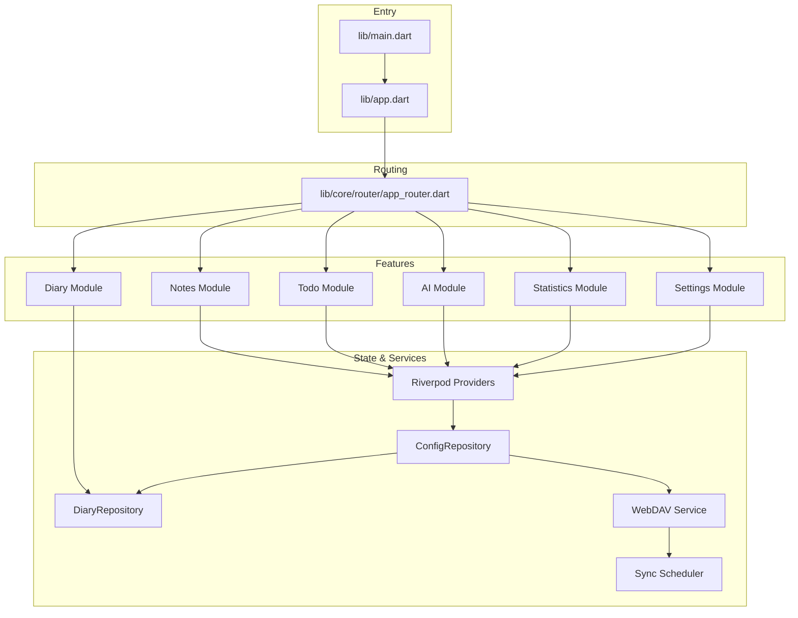
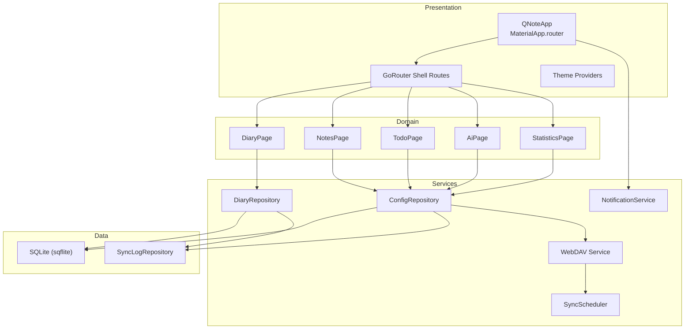
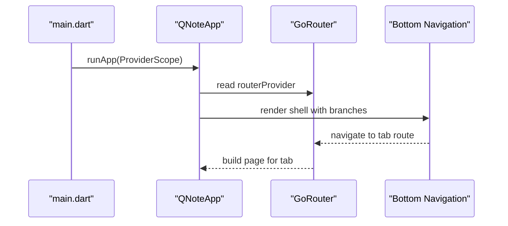
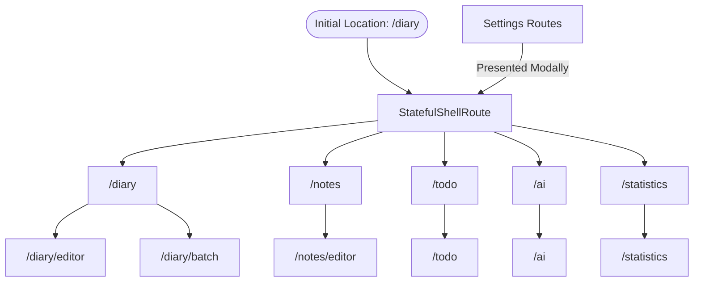
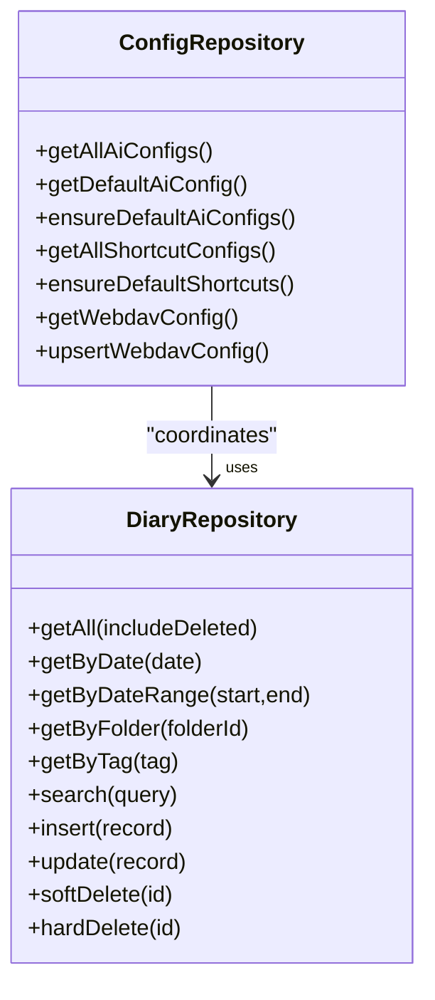
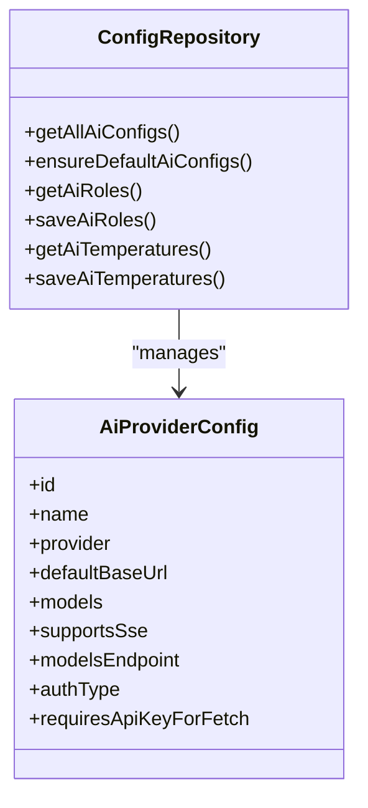
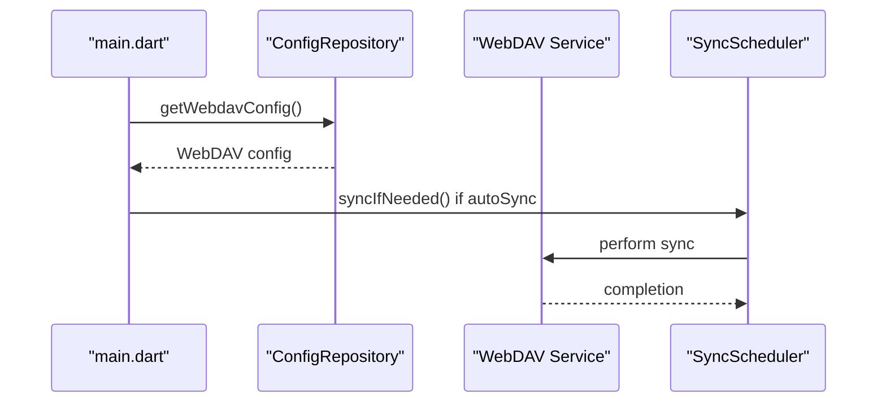
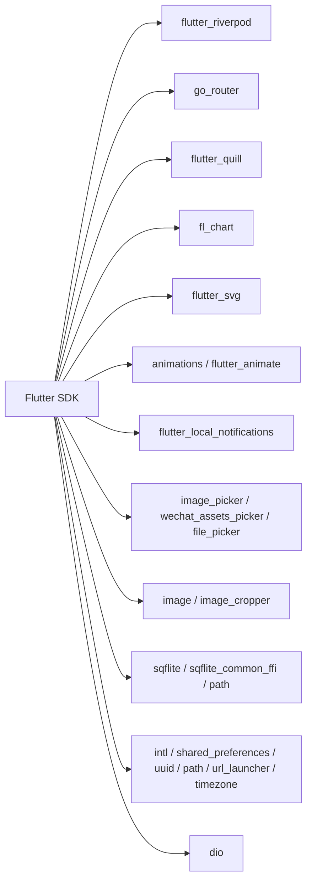

# Project Overview

<cite>
**Referenced Files in This Document**
- [README.md](file://README.md)
- [pubspec.yaml](file://pubspec.yaml)
- [lib/main.dart](file://lib/main.dart)
- [lib/app.dart](file://lib/app.dart)
- [lib/core/router/app_router.dart](file://lib/core/router/app_router.dart)
- [lib/core/storage/config_repository.dart](file://lib/core/storage/config_repository.dart)
- [lib/core/storage/diary_repository.dart](file://lib/core/storage/diary_repository.dart)
- [lib/config/defaults.dart](file://lib/config/defaults.dart)
- [lib/config/models.dart](file://lib/config/models.dart)
</cite>

## Table of Contents
1. [Introduction](#introduction)
2. [Project Structure](#project-structure)
3. [Core Components](#core-components)
4. [Architecture Overview](#architecture-overview)
5. [Detailed Component Analysis](#detailed-component-analysis)
6. [Dependency Analysis](#dependency-analysis)
7. [Performance Considerations](#performance-considerations)
8. [Troubleshooting Guide](#troubleshooting-guide)
9. [Conclusion](#conclusion)

## Introduction
QNote is a cross-platform note-taking and productivity application built with Flutter. It blends traditional note-taking with advanced AI capabilities and cloud synchronization. The app enables users to maintain daily diaries, capture notes, manage tasks, leverage AI for insights and automation, synchronize data via WebDAV, process images, and extend functionality through home screen widgets.

Target audience and use cases:
- Health-conscious individuals tracking sleep, diet, activities, and symptoms while generating daily scores and suggestions.
- Productivity-focused users organizing thoughts, tasks, and knowledge with AI-powered summarization and tagging.
- Power users who benefit from cloud backup and synchronization across devices and home screen widgets for quick actions.

## Project Structure
The project follows a layered structure:
- Application bootstrap and lifecycle orchestration in the entrypoint.
- UI shell with bottom navigation routing via a modern router library.
- Feature modules for diary, notes, todos, AI, statistics, and settings.
- Providers for state management and UI composition.
- Core services for storage, networking, notifications, and scheduling.
- Models and configuration for defaults, AI providers, and shortcuts.

**Diagram sources**
- [lib/main.dart:12-30](file://lib/main.dart#L12-L30)
- [lib/app.dart:78-121](file://lib/app.dart#L78-L121)
- [lib/core/router/app_router.dart:27-187](file://lib/core/router/app_router.dart#L27-L187)
- [lib/core/storage/config_repository.dart:13-360](file://lib/core/storage/config_repository.dart#L13-L360)
- [lib/core/storage/diary_repository.dart:5-183](file://lib/core/storage/diary_repository.dart#L5-L183)

**Section sources**
- [lib/main.dart:12-30](file://lib/main.dart#L12-L30)
- [lib/app.dart:78-121](file://lib/app.dart#L78-L121)
- [lib/core/router/app_router.dart:27-187](file://lib/core/router/app_router.dart#L27-L187)

## Core Components
- State Management: Riverpod-based providers power reactive UI updates and cross-feature state sharing.
- Routing: GoRouter manages nested shell routes for bottom navigation and modal/editor overlays.
- Storage: Local SQLite via sqflite for structured data persistence and change logging for synchronization.
- AI Integration: Extensible AI provider configuration supporting multiple vendors and model lists.
- Cloud Sync: WebDAV configuration and scheduler for automatic synchronization.
- Image Processing: Integrated image picker, cropper, and gallery utilities for diary and notes.
- Widgets: Android home screen widgets for quick recording and todo items.

Key feature highlights:
- Diary management with temporal queries, tagging, and batch operations.
- Notes editor with rich text support.
- Todo lists with lifecycle and reminders.
- AI assistant with role-based prompts and extraction templates.
- Statistics dashboard for trends and insights.
- Settings for personalization, AI configuration, shortcuts, and sync.

**Section sources**
- [pubspec.yaml:9-43](file://pubspec.yaml#L9-L43)
- [lib/config/defaults.dart:7-285](file://lib/config/defaults.dart#L7-L285)
- [lib/config/models.dart:31-241](file://lib/config/models.dart#L31-L241)
- [lib/core/storage/config_repository.dart:188-204](file://lib/core/storage/config_repository.dart#L188-L204)

## Architecture Overview
The system architecture separates concerns across layers:
- Presentation Layer: Material App with router-driven shell navigation and providers for theming and routing.
- Domain Layer: Feature pages and views for diary, notes, todos, AI, and statistics.
- Services Layer: Repositories for domain-specific persistence, configuration, and synchronization.
- Data Layer: SQLite-backed repositories with change logs for incremental sync.
- External Integrations: WebDAV service and scheduler, AI provider configuration, notification service.

**Diagram sources**
- [lib/app.dart:78-121](file://lib/app.dart#L78-L121)
- [lib/core/router/app_router.dart:32-144](file://lib/core/router/app_router.dart#L32-L144)
- [lib/core/storage/config_repository.dart:13-360](file://lib/core/storage/config_repository.dart#L13-L360)
- [lib/core/storage/diary_repository.dart:5-183](file://lib/core/storage/diary_repository.dart#L5-L183)

## Detailed Component Analysis

### State Management and UI Composition
- QNoteApp composes the app shell with Material router, localization, and theme providers.
- Bottom navigation uses a stateful shell branch pattern for persistent tabs.
- A method channel bridges native Android widgets to app navigation.

**Diagram sources**
- [lib/main.dart:29](file://lib/main.dart#L29)
- [lib/app.dart:78-121](file://lib/app.dart#L78-L121)
- [lib/core/router/app_router.dart:32-144](file://lib/core/router/app_router.dart#L32-L144)

**Section sources**
- [lib/app.dart:19-121](file://lib/app.dart#L19-L121)
- [lib/core/router/app_router.dart:27-187](file://lib/core/router/app_router.dart#L27-L187)

### Routing and Navigation
- Shell routes define five primary tabs: diary, notes, todo, ai, statistics.
- Nested routes support editor modals and batch management for diary.
- Settings routes are presented with smooth shared-axis transitions.

**Diagram sources**
- [lib/core/router/app_router.dart:32-187](file://lib/core/router/app_router.dart#L32-L187)

**Section sources**
- [lib/core/router/app_router.dart:27-187](file://lib/core/router/app_router.dart#L27-L187)

### Data Persistence and Synchronization
- ConfigRepository centralizes app-wide configurations, AI settings, shortcuts, profiles, and WebDAV settings.
- DiaryRepository encapsulates CRUD and temporal queries for diary entries with soft deletion and search.
- Change logs enable incremental synchronization.

**Diagram sources**
- [lib/core/storage/config_repository.dart:13-360](file://lib/core/storage/config_repository.dart#L13-L360)
- [lib/core/storage/diary_repository.dart:5-183](file://lib/core/storage/diary_repository.dart#L5-L183)

**Section sources**
- [lib/core/storage/config_repository.dart:13-360](file://lib/core/storage/config_repository.dart#L13-L360)
- [lib/core/storage/diary_repository.dart:5-183](file://lib/core/storage/diary_repository.dart#L5-L183)

### AI Integration and Configuration
- AI providers are modeled with configurable endpoints, auth types, and model lists.
- Defaults include system prompts for assistant, extraction, and daily scoring.
- ConfigRepository persists AI roles and temperatures alongside provider configs.

**Diagram sources**
- [lib/config/models.dart:1-241](file://lib/config/models.dart#L1-L241)
- [lib/config/defaults.dart:7-87](file://lib/config/defaults.dart#L7-L87)
- [lib/core/storage/config_repository.dart:56-308](file://lib/core/storage/config_repository.dart#L56-L308)

**Section sources**
- [lib/config/models.dart:31-241](file://lib/config/models.dart#L31-L241)
- [lib/config/defaults.dart:7-87](file://lib/config/defaults.dart#L7-L87)
- [lib/core/storage/config_repository.dart:56-308](file://lib/core/storage/config_repository.dart#L56-L308)

### Cloud Synchronization via WebDAV
- WebDAV configuration is stored and retrieved through ConfigRepository.
- On startup, auto-sync checks are triggered if enabled.
- SyncScheduler coordinates periodic synchronization.

**Diagram sources**
- [lib/main.dart:24-27](file://lib/main.dart#L24-L27)
- [lib/core/storage/config_repository.dart:188-204](file://lib/core/storage/config_repository.dart#L188-L204)

**Section sources**
- [lib/main.dart:24-27](file://lib/main.dart#L24-L27)
- [lib/core/storage/config_repository.dart:188-204](file://lib/core/storage/config_repository.dart#L188-L204)

### Image Processing and Media Utilities
- Dependencies include image picker, cropper, gallery pickers, and SVG support.
- Used primarily in diary and notes for capturing and editing media.

**Section sources**
- [pubspec.yaml:24-38](file://pubspec.yaml#L24-L38)

### Widgets Support
- Android widgets for quick recording and todo items integrate via platform channels.
- Widget layouts and metadata are defined in Android resources.

**Section sources**
- [lib/app.dart:20-76](file://lib/app.dart#L20-L76)
- [android/app/src/main/kotlin/com/appone/qnote_flutter/QuickRecordWidgetProvider.kt](file://android/app/src/main/kotlin/com/appone/qnote_flutter/QuickRecordWidgetProvider.kt)
- [android/app/src/main/kotlin/com/appone/qnote_flutter/TodoWidgetProvider.kt](file://android/app/src/main/kotlin/com/appone/qnote_flutter/TodoWidgetProvider.kt)

## Dependency Analysis
Technology stack summary:
- Flutter SDK: Cross-platform UI framework.
- State Management: Riverpod for scalable provider-based state.
- Routing: GoRouter for declarative navigation and shell routes.
- Networking: Dio for HTTP requests.
- Rich Text: Flutter Quill for editor experiences.
- Charts and UI: Fl_chart, SVG, animations.
- Notifications: Local notifications.
- File and Paths: Path provider, URL launcher.
- Storage: SQLite via sqflite with FFI/Web variants.
- Image: Image processing and cropping.
- Widgets: Android app widgets.

**Diagram sources**
- [pubspec.yaml:9-43](file://pubspec.yaml#L9-L43)

**Section sources**
- [pubspec.yaml:9-43](file://pubspec.yaml#L9-L43)

## Performance Considerations
- Use Riverpod selectors and notifier refresh patterns judiciously to avoid unnecessary rebuilds.
- Prefer incremental queries and pagination for large datasets (e.g., diary entries).
- Defer heavy AI operations to background threads and cache results where appropriate.
- Minimize synchronous disk writes; batch updates and use transactions.
- Leverage WebDAV delta sync strategies to reduce bandwidth and improve responsiveness.

## Troubleshooting Guide
Common areas to inspect:
- Initialization order: Ensure logger initialization, date formatting, database factory, and repositories are ready before navigation.
- Navigation failures: Verify router provider availability and route existence when navigating from widgets.
- Sync issues: Confirm WebDAV credentials and auto-sync flag; check scheduler invocation after startup.
- Repository errors: Validate database readiness and query parameters for date ranges and tags.

**Section sources**
- [lib/main.dart:12-30](file://lib/main.dart#L12-L30)
- [lib/app.dart:42-76](file://lib/app.dart#L42-L76)
- [lib/core/storage/config_repository.dart:188-204](file://lib/core/storage/config_repository.dart#L188-L204)

## Conclusion
QNote delivers a cohesive, extensible productivity suite combining traditional note-taking with AI-driven insights and robust cloud synchronization. Its modular architecture, layered repositories, and provider-based state management enable maintainability and scalability. The routing and widget integrations streamline daily workflows, while the AI configuration system supports diverse provider ecosystems. This foundation invites further enhancements in analytics, offline-first strategies, and expanded AI capabilities.