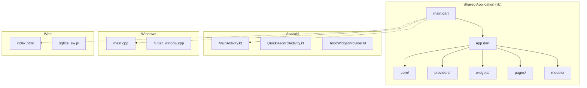
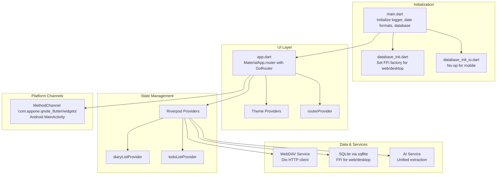
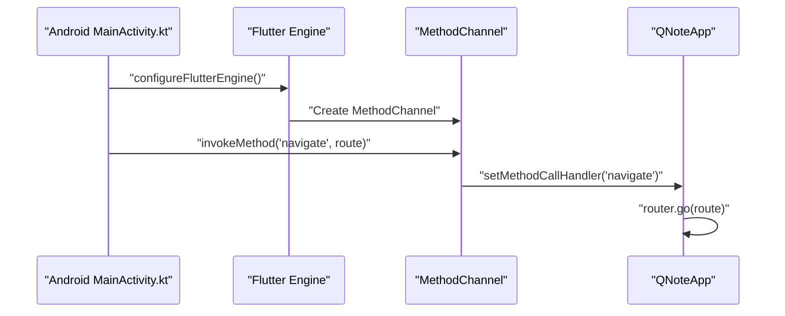

# Technology Stack

<cite>
**Referenced Files in This Document**
- [pubspec.yaml](file://pubspec.yaml)
- [main.dart](file://lib/main.dart)
- [app.dart](file://lib/app.dart)
- [database_init.dart](file://lib/database_init.dart)
- [database_init_io.dart](file://lib/database_init_io.dart)
- [MainActivity.kt](file://android/app/src/main/kotlin/com/appone/qnote_flutter/MainActivity.kt)
- [main.cpp](file://windows/runner/main.cpp)
- [index.html](file://web/index.html)
- [webdav_service.dart](file://lib/core/network/webdav_service.dart)
- [ai_service.dart](file://lib/core/ai/ai_service.dart)
- [diary_input_bar.dart](file://lib/widgets/diary/diary_input_bar.dart)
- [diary_page.dart](file://lib/pages/diary_page.dart)
</cite>

## Table of Contents
1. [Introduction](#introduction)
2. [Project Structure](#project-structure)
3. [Core Technologies](#core-technologies)
4. [Architecture Overview](#architecture-overview)
5. [Platform Implementations](#platform-implementations)
6. [Development Environment Setup](#development-environment-setup)
7. [Technology Rationale](#technology-rationale)
8. [Performance Considerations](#performance-considerations)
9. [Troubleshooting Guide](#troubleshooting-guide)
10. [Conclusion](#conclusion)

## Introduction
This document provides a comprehensive overview of QNote Flutter's technology stack, detailing the cross-platform development framework built on Flutter, the Dart programming language, and supporting libraries. It explains the rationale behind each technology choice, how they integrate to deliver a cohesive development experience, and outlines platform-specific implementations for Android, Windows, and Web. The stack emphasizes maintainability, performance, and extensibility through modern Flutter practices, structured routing, robust state management, reliable cloud synchronization via WebDAV, efficient local persistence with SQLite, and intelligent AI-powered content extraction.

## Project Structure
The project follows a conventional Flutter structure with platform-specific implementations and modularized core functionality:
- Shared application code resides under lib/, organized by features (core, models, pages, providers, widgets)
- Platform-specific code:
  - Android Kotlin activities and widgets under android/app/src/main/kotlin/
  - Windows C++ native runner under windows/runner/
  - Web assets and service worker under web/
- Dependencies and configuration managed via pubspec.yaml

**Diagram sources**
- [main.dart:12-30](file://lib/main.dart#L12-L30)
- [app.dart:78-121](file://lib/app.dart#L78-L121)
- [MainActivity.kt:11-85](file://android/app/src/main/kotlin/com/appone/qnote_flutter/MainActivity.kt#L11-L85)
- [main.cpp:8-43](file://windows/runner/main.cpp#L8-L43)
- [index.html:1-47](file://web/index.html#L1-L47)

**Section sources**
- [pubspec.yaml:1-71](file://pubspec.yaml#L1-L71)
- [main.dart:12-30](file://lib/main.dart#L12-L30)
- [app.dart:19-121](file://lib/app.dart#L19-L121)

## Core Technologies
This section documents the primary technologies powering QNote Flutter and their roles in the application architecture.

- Flutter SDK: Cross-platform UI framework enabling deployment to Android, iOS, Web, Windows, macOS, and Linux from a single codebase.
- Dart Programming Language: Strongly-typed language optimized for Flutter with modern language features, reactive programming support, and excellent tooling.
- Riverpod: Predictable state management solution providing scalable, testable, and efficient state updates without boilerplate.
- GoRouter: Declarative routing library offering type-safe navigation, nested routes, and deep linking capabilities.
- WebDAV Client Libraries: Cloud synchronization powered by HTTP-based WebDAV protocol using Dio for network requests and structured delta/snapshot synchronization.
- SQLite with sqflite: Local relational database for offline-first data storage, with platform-specific FFI implementations for desktop and web compatibility.
- AI Service Integrations: Unified extraction pipeline supporting text, image, and multimodal inputs via configurable AI providers and structured JSON responses.

**Section sources**
- [pubspec.yaml:9-43](file://pubspec.yaml#L9-L43)
- [main.dart:12-30](file://lib/main.dart#L12-L30)
- [app.dart:3-11](file://lib/app.dart#L3-L11)

## Architecture Overview
The application initializes core services, sets up state management and routing, and integrates platform channels for Android widgets. Navigation is handled declaratively via GoRouter, while Riverpod manages global state. Data persistence uses SQLite via sqflite with platform-specific factory selection. Cloud synchronization leverages WebDAV through Dio, and AI extraction integrates with configurable providers.

**Diagram sources**
- [main.dart:12-30](file://lib/main.dart#L12-L30)
- [database_init.dart:4-6](file://lib/database_init.dart#L4-L6)
- [database_init_io.dart:1](file://lib/database_init_io.dart#L1)
- [app.dart:3-11](file://lib/app.dart#L3-L11)
- [MainActivity.kt:12-59](file://android/app/src/main/kotlin/com/appone/qnote_flutter/MainActivity.kt#L12-L59)
- [webdav_service.dart:29-77](file://lib/core/network/webdav_service.dart#L29-L77)
- [ai_service.dart:518-643](file://lib/core/ai/ai_service.dart#L518-L643)

## Platform Implementations
QNote Flutter targets multiple platforms with tailored implementations:

- Android (Kotlin):
  - MainActivity establishes a MethodChannel to communicate with Flutter and coordinate widget updates.
  - Handles intents for deep links and inter-process navigation.
  - Implements widget update broadcasts for Quick Record and Todo widgets.

- Windows (C++):
  - Native Win32 entry point initializes Flutter engine, creates window, and runs the event loop.
  - Uses Flutter's C++ embedding APIs for rendering and lifecycle management.

- Web (HTML/CSS/JavaScript):
  - index.html serves as the bootstrap page with manifest and service worker support.
  - Service worker enables offline caching and PWA features.

**Diagram sources**
- [MainActivity.kt:38-59](file://android/app/src/main/kotlin/com/appone/qnote_flutter/MainActivity.kt#L38-L59)
- [app.dart:50-75](file://lib/app.dart#L50-L75)

**Section sources**
- [MainActivity.kt:11-85](file://android/app/src/main/kotlin/com/appone/qnote_flutter/MainActivity.kt#L11-L85)
- [main.cpp:8-43](file://windows/runner/main.cpp#L8-L43)
- [index.html:1-47](file://web/index.html#L1-L47)

## Development Environment Setup
To set up the development environment for QNote Flutter, ensure the following versions and configurations:

- Flutter SDK: Compatible with Dart SDK ^3.11.5 as defined in the environment configuration.
- Android:
  - Minimum SDK level configured to 21 via launcher icons configuration.
  - Kotlin-based MainActivity with MethodChannel integration for widget communication.
- Windows:
  - C++ native runner initializing Flutter project and window lifecycle.
- Web:
  - HTML entry point with manifest and service worker for PWA support.
- Dependencies:
  - Riverpod for state management.
  - GoRouter for navigation.
  - Dio for HTTP/WebDAV operations.
  - sqflite/sqflite_common_ffi/sqflite_common_ffi_web for SQLite persistence.
  - Additional UI and utility packages for features like Markdown, charts, notifications, and image handling.

Recommended steps:
1. Install Flutter SDK matching the environment SDK constraint.
2. Set up Android Studio with Android SDK and minimum SDK 21.
3. Install Visual Studio or preferred IDE for Windows development.
4. Enable web development and install web-specific tools.
5. Run pub get to fetch dependencies defined in pubspec.yaml.
6. Verify platform-specific configurations in android/, windows/, and web/.

**Section sources**
- [pubspec.yaml:6-7](file://pubspec.yaml#L6-L7)
- [pubspec.yaml:50-54](file://pubspec.yaml#L50-L54)
- [MainActivity.kt:11-14](file://android/app/src/main/kotlin/com/appone/qnote_flutter/MainActivity.kt#L11-L14)
- [main.cpp:20-25](file://windows/runner/main.cpp#L20-L25)
- [index.html:32-33](file://web/index.html#L32-L33)

## Technology Rationale
Each technology choice aligns with cross-platform goals, performance, and maintainability:

- Flutter + Dart:
  - Single codebase across platforms reduces maintenance overhead.
  - Strong typing and reactive ecosystem improve reliability and developer productivity.
- Riverpod:
  - Eliminates boilerplate compared to provider while maintaining testability and scalability.
  - Enables fine-grained reactivity and easy mocking for unit tests.
- GoRouter:
  - Declarative routing improves navigation predictability and deep-linking support.
  - Type-safe navigation reduces runtime errors and enhances refactoring safety.
- WebDAV + Dio:
  - HTTP-based protocol ensures broad compatibility with existing cloud services.
  - Structured snapshot/delta synchronization minimizes bandwidth and conflict risk.
- SQLite + sqflite:
  - ACID-compliant local storage supports offline-first design.
  - FFI implementations enable consistent behavior across mobile, desktop, and web.
- AI Integration:
  - Unified extraction interface supports text, image, and multimodal inputs.
  - Configurable providers and structured JSON responses simplify downstream processing.

**Section sources**
- [pubspec.yaml:9-43](file://pubspec.yaml#L9-L43)
- [webdav_service.dart:29-77](file://lib/core/network/webdav_service.dart#L29-L77)
- [ai_service.dart:518-643](file://lib/core/ai/ai_service.dart#L518-L643)

## Performance Considerations
- State Management Efficiency:
  - Riverpod's provider-based architecture avoids unnecessary rebuilds by isolating state slices.
  - Use of notifier providers for mutable state prevents excessive widget rebuilds.
- Network Operations:
  - WebDAV requests leverage Dio with timeout configurations to prevent hanging operations.
  - Delta-based synchronization limits payload sizes and reduces conflicts.
- Database Access:
  - Platform-specific database factory selection ensures optimal SQLite performance per OS.
  - Asynchronous operations and batched writes minimize UI thread blocking.
- AI Extraction:
  - Cancellable requests and structured logging help manage long-running operations.
  - Optional image preprocessing reduces payload sizes when extracting from photos.

[No sources needed since this section provides general guidance]

## Troubleshooting Guide
Common issues and resolutions:

- WebDAV Connection Failures:
  - Verify server URL formatting and trailing slashes normalization.
  - Check credentials and authorization headers; ensure proper base64 encoding.
  - Use PROPFIND depth checks to confirm endpoint accessibility.

- SQLite Initialization Problems:
  - Confirm platform-specific factory initialization for web/desktop builds.
  - Ensure database migrations and schema compatibility across platforms.

- AI Extraction Errors:
  - Validate API configuration completeness and endpoint reachability.
  - Handle network timeouts, unauthorized responses, and CORS-related failures gracefully.
  - Monitor cancellation tokens to abort long-running extractions.

- Android Widget Navigation:
  - Confirm MethodChannel registration and pending route retrieval after cold start.
  - Ensure widget update broadcasts are sent for both Quick Record and Todo widgets.

**Section sources**
- [webdav_service.dart:50-77](file://lib/core/network/webdav_service.dart#L50-L77)
- [webdav_service.dart:79-95](file://lib/core/network/webdav_service.dart#L79-L95)
- [database_init.dart:4-6](file://lib/database_init.dart#L4-L6)
- [diary_input_bar.dart:1208-1236](file://lib/widgets/diary/diary_input_bar.dart#L1208-L1236)
- [MainActivity.kt:26-36](file://android/app/src/main/kotlin/com/appone/qnote_flutter/MainActivity.kt#L26-L36)
- [MainActivity.kt:61-84](file://android/app/src/main/kotlin/com/appone/qnote_flutter/MainActivity.kt#L61-L84)

## Conclusion
QNote Flutter's technology stack combines Flutter's cross-platform strengths with Dart's modern features, Riverpod's scalable state management, GoRouter's robust navigation, WebDAV-powered synchronization, SQLite-backed persistence, and flexible AI integration. Together, these technologies deliver a maintainable, performant, and extensible foundation suitable for personal knowledge management applications across Android, Windows, and Web platforms.