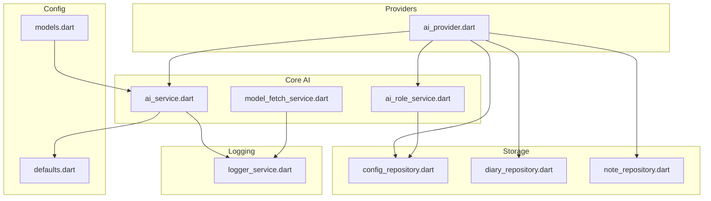
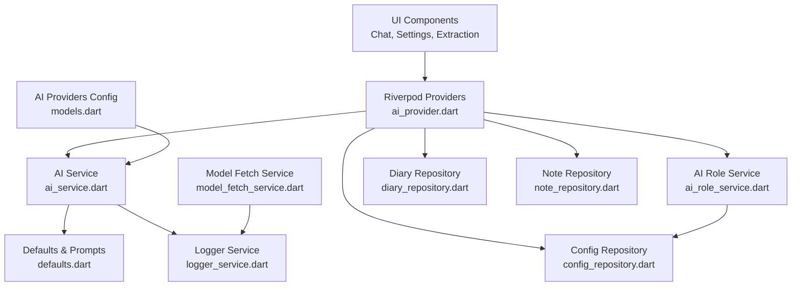
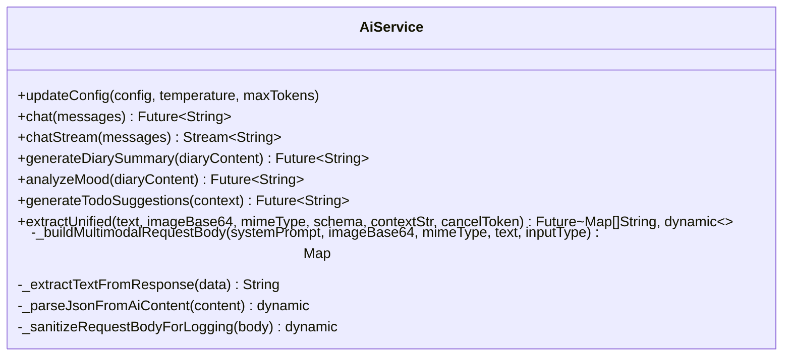
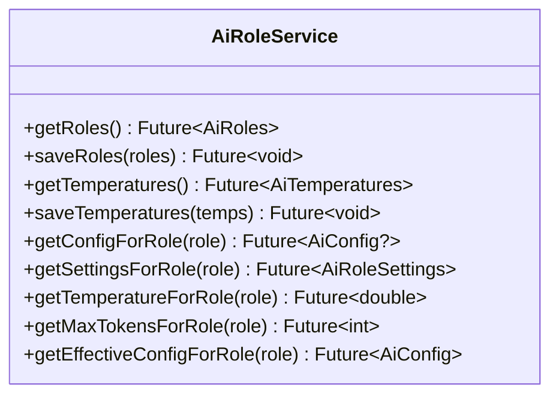
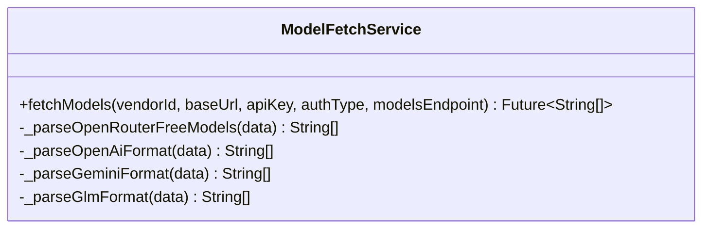
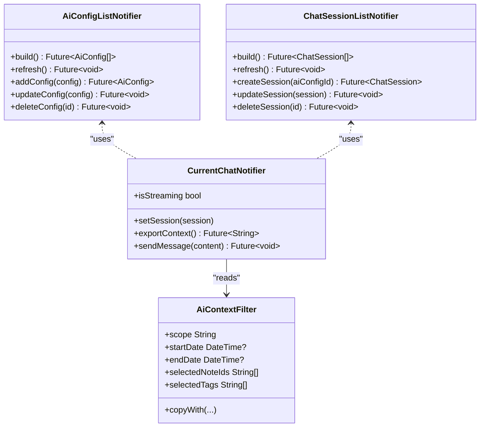
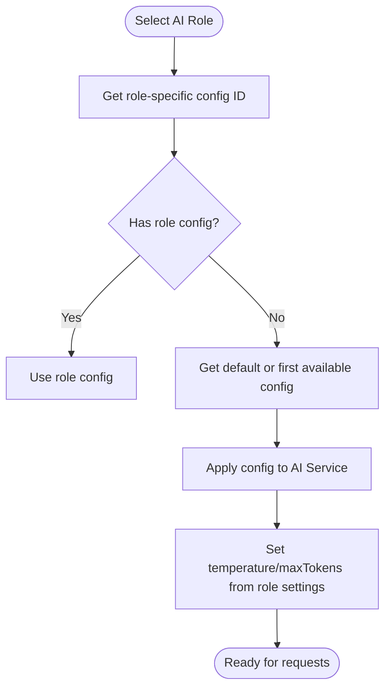
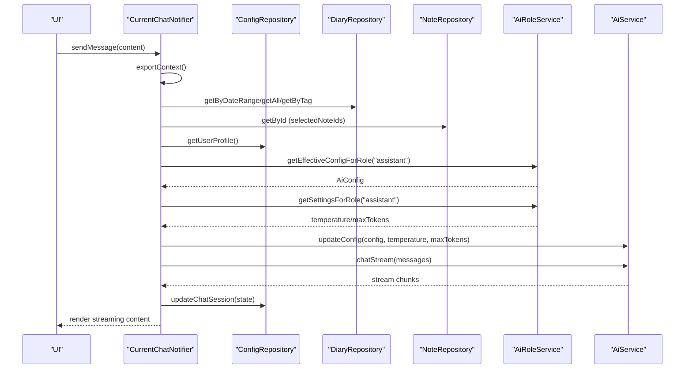
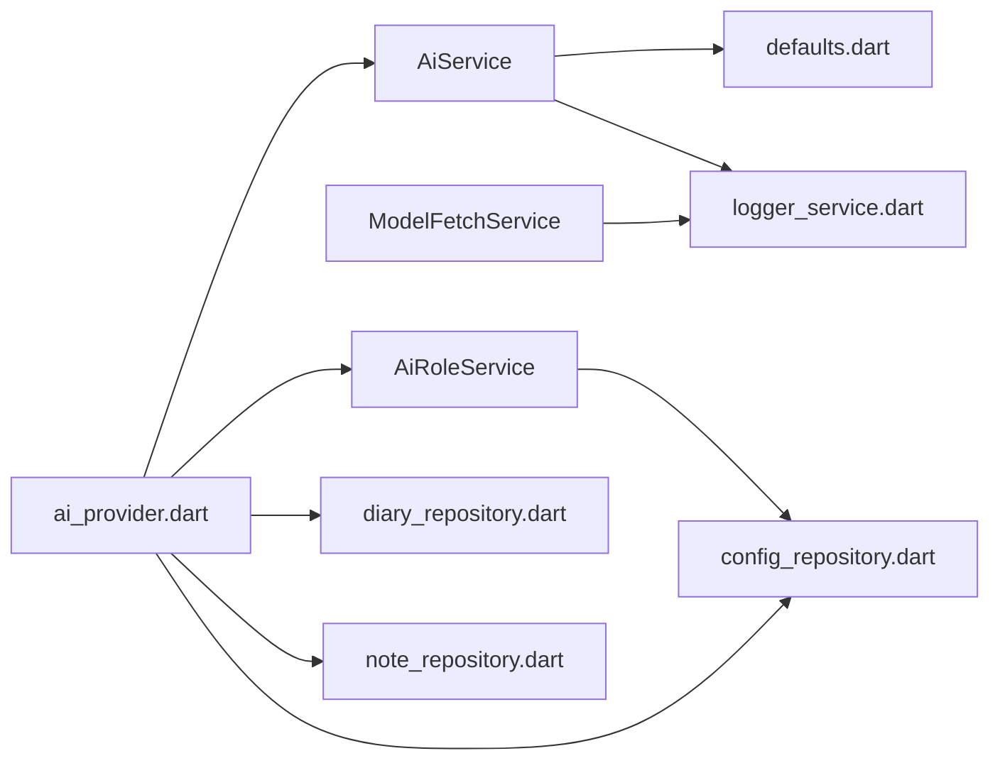

# AI Services

<cite>
**Referenced Files in This Document**
- [ai_provider.dart](file://lib/providers/ai_provider.dart)
- [ai_service.dart](file://lib/core/ai/ai_service.dart)
- [ai_role_service.dart](file://lib/core/ai/ai_role_service.dart)
- [model_fetch_service.dart](file://lib/core/ai/model_fetch_service.dart)
- [defaults.dart](file://lib/config/defaults.dart)
- [models.dart](file://lib/config/models.dart)
- [logger_service.dart](file://lib/core/logger/logger_service.dart)
- [config_repository.dart](file://lib/core/storage/config_repository.dart)
- [diary_repository.dart](file://lib/core/storage/diary_repository.dart)
- [note_repository.dart](file://lib/core/storage/note_repository.dart)
</cite>

## Table of Contents
1. [Introduction](#introduction)
2. [Project Structure](#project-structure)
3. [Core Components](#core-components)
4. [Architecture Overview](#architecture-overview)
5. [Detailed Component Analysis](#detailed-component-analysis)
6. [Dependency Analysis](#dependency-analysis)
7. [Performance Considerations](#performance-considerations)
8. [Troubleshooting Guide](#troubleshooting-guide)
9. [Conclusion](#conclusion)
10. [Appendices](#appendices)

## Introduction
This document describes QNote Flutter's AI services implementation, focusing on content generation, summarization, and personalized assistance. It explains the AI role service for managing different AI personalities and contexts, the model fetch service for dynamic model loading, and the AI provider for state management. It also covers AI configuration management, model selection strategies, and content processing workflows. Practical examples include AI-assisted note creation, diary enhancement, and smart suggestions. Integration patterns, error handling, performance optimization, and extensibility guidelines are included to help extend the system with new AI capabilities following established patterns.

## Project Structure
The AI services are organized around four primary areas:
- Providers: State management for AI configuration, chat sessions, and streaming responses
- Core AI: AI service orchestration, role-based configuration resolution, and model fetching
- Config: Default prompts, AI provider configurations, and model lists
- Storage: Repositories for configuration, diary, and note persistence

**Diagram sources**
- [ai_provider.dart:51-53](file://lib/providers/ai_provider.dart#L51-L53)
- [ai_service.dart:22-79](file://lib/core/ai/ai_service.dart#L22-L79)
- [ai_role_service.dart:5-8](file://lib/core/ai/ai_role_service.dart#5-L8)
- [model_fetch_service.dart:4-8](file://lib/core/ai/model_fetch_service.dart#L4-L8)
- [defaults.dart:7-87](file://lib/config/defaults.dart#L7-L87)
- [models.dart:31-232](file://lib/config/models.dart#L31-L232)
- [config_repository.dart](file://lib/core/storage/config_repository.dart)
- [diary_repository.dart](file://lib/core/storage/diary_repository.dart)
- [note_repository.dart](file://lib/core/storage/note_repository.dart)
- [logger_service.dart](file://lib/core/logger/logger_service.dart)

**Section sources**
- [ai_provider.dart:1-533](file://lib/providers/ai_provider.dart#L1-L533)
- [ai_service.dart:1-1189](file://lib/core/ai/ai_service.dart#L1-L1189)
- [ai_role_service.dart:1-80](file://lib/core/ai/ai_role_service.dart#L1-L80)
- [model_fetch_service.dart:1-236](file://lib/core/ai/model_fetch_service.dart#L1-L236)
- [defaults.dart:1-285](file://lib/config/defaults.dart#L1-L285)
- [models.dart:1-241](file://lib/config/models.dart#L1-L241)

## Core Components
- AI Service: Central orchestrator for chat, streaming, multimodal extraction, and content generation. Handles provider-specific request/response normalization, SSE streaming, and robust error logging.
- AI Role Service: Resolves effective AI configuration and role-specific temperature/maxTokens settings from persisted roles and temperatures.
- Model Fetch Service: Dynamically loads model lists from AI providers via standardized endpoints, supporting bearer/query/no auth modes and vendor-specific parsing.
- AI Provider (Riverpod): Manages AI configuration lists, default config, chat sessions, current chat state, and streaming message accumulation. Provides context filtering for diary/notes and user profile enrichment.

Key responsibilities:
- AI Service: chat, chatStream, generateDiarySummary, analyzeMood, generateTodoSuggestions, extractUnified, and internal request builders and parsers.
- AI Role Service: getConfigForRole, getSettingsForRole, getEffectiveConfigForRole.
- Model Fetch Service: fetchModels with vendor-specific parsing.
- AI Provider: AiConfigListNotifier, ChatSessionListNotifier, CurrentChatNotifier, contextFilterProvider, and streaming message provider.

**Section sources**
- [ai_service.dart:22-391](file://lib/core/ai/ai_service.dart#L22-L391)
- [ai_role_service.dart:5-79](file://lib/core/ai/ai_role_service.dart#L5-L79)
- [model_fetch_service.dart:4-140](file://lib/core/ai/model_fetch_service.dart#L4-L140)
- [ai_provider.dart:69-168](file://lib/providers/ai_provider.dart#L69-L168)

## Architecture Overview
The AI architecture integrates Riverpod state management with provider-agnostic AI orchestration. Providers expose reactive state for configuration, sessions, and streaming. The AI Service encapsulates network requests, provider-specific formatting, and response parsing. The Role Service resolves effective configuration and tuning parameters per role. The Model Fetch Service dynamically updates model catalogs.

**Diagram sources**
- [ai_provider.dart:51-168](file://lib/providers/ai_provider.dart#L51-L168)
- [ai_service.dart:22-79](file://lib/core/ai/ai_service.dart#L22-L79)
- [ai_role_service.dart:5-26](file://lib/core/ai/ai_role_service.dart#L5-L26)
- [model_fetch_service.dart:4-14](file://lib/core/ai/model_fetch_service.dart#L4-L14)
- [defaults.dart:7-87](file://lib/config/defaults.dart#L7-L87)
- [models.dart:31-232](file://lib/config/models.dart#L31-L232)
- [config_repository.dart](file://lib/core/storage/config_repository.dart)
- [diary_repository.dart](file://lib/core/storage/diary_repository.dart)
- [note_repository.dart](file://lib/core/storage/note_repository.dart)
- [logger_service.dart](file://lib/core/logger/logger_service.dart)

## Detailed Component Analysis

### AI Service
Responsibilities:
- Validates and applies AI configuration (provider, base URL, API key).
- Builds provider-specific request bodies for chat, streaming, and generateContent.
- Normalizes responses across providers (OpenAI-compatible vs Gemini).
- Implements streaming via SSE/DIO streams with incremental yields.
- Provides specialized methods: generateDiarySummary, analyzeMood, generateTodoSuggestions, and extractUnified (multimodal JSON extraction).
- Robust error logging and diagnostics for network failures.

Key behaviors:
- Endpoint selection based on provider and base URL suffix.
- Temperature and maxTokens applied from role settings or explicit overrides.
- Multimodal support with structured request building for images/text combinations.
- JSON extraction with fallback parsing for non-standard AI responses.

**Diagram sources**
- [ai_service.dart:22-79](file://lib/core/ai/ai_service.dart#L22-L79)
- [ai_service.dart:88-217](file://lib/core/ai/ai_service.dart#L88-L217)
- [ai_service.dart:219-369](file://lib/core/ai/ai_service.dart#L219-L369)
- [ai_service.dart:393-445](file://lib/core/ai/ai_service.dart#L393-L445)
- [ai_service.dart:518-699](file://lib/core/ai/ai_service.dart#L518-L699)
- [ai_service.dart:701-786](file://lib/core/ai/ai_service.dart#L701-L786)

**Section sources**
- [ai_service.dart:22-391](file://lib/core/ai/ai_service.dart#L22-L391)
- [ai_service.dart:393-445](file://lib/core/ai/ai_service.dart#L393-L445)
- [ai_service.dart:518-699](file://lib/core/ai/ai_service.dart#L518-L699)

### AI Role Service
Responsibilities:
- Persists and retrieves AI roles and temperature settings.
- Resolves effective configuration for a given role, falling back to default or first available config.
- Supplies role-specific temperature and maxTokens settings.

**Diagram sources**
- [ai_role_service.dart:5-79](file://lib/core/ai/ai_role_service.dart#L5-L79)

**Section sources**
- [ai_role_service.dart:12-79](file://lib/core/ai/ai_role_service.dart#L12-L79)

### Model Fetch Service
Responsibilities:
- Fetches model lists from AI providers using standardized endpoints.
- Supports three auth modes: bearer, query, none.
- Parses vendor-specific response formats (OpenAI-compatible, Gemini, GLM, OpenRouter).
- Merges base URL and endpoint segments safely.

**Diagram sources**
- [model_fetch_service.dart:4-140](file://lib/core/ai/model_fetch_service.dart#L4-L140)
- [model_fetch_service.dart:142-235](file://lib/core/ai/model_fetch_service.dart#L142-L235)

**Section sources**
- [model_fetch_service.dart:10-140](file://lib/core/ai/model_fetch_service.dart#L10-L140)

### AI Provider (State Management)
Responsibilities:
- Exposes reactive state for AI configuration lists, default config, and chat sessions.
- Manages current chat session, streaming message accumulation, and context filters.
- Constructs contextualized prompts by exporting diary/notes/user profile data.
- Integrates with repositories for persistence and retrieval.

**Diagram sources**
- [ai_provider.dart:74-104](file://lib/providers/ai_provider.dart#L74-L104)
- [ai_provider.dart:126-168](file://lib/providers/ai_provider.dart#L126-L168)
- [ai_provider.dart:177-533](file://lib/providers/ai_provider.dart#L177-L533)
- [ai_provider.dart:19-49](file://lib/providers/ai_provider.dart#L19-L49)

**Section sources**
- [ai_provider.dart:69-168](file://lib/providers/ai_provider.dart#L69-L168)
- [ai_provider.dart:177-533](file://lib/providers/ai_provider.dart#L177-L533)

### AI Configuration Management and Model Selection
- Default prompts and system instructions are centralized for unified extraction, daily scoring, and assistant behavior.
- AI provider configurations define supported models, endpoints, and auth modes.
- Effective configuration resolution follows role mapping to a specific AI config, with fallback to default or first available config.
- Model fetching uses provider-specific parsing to keep the model catalog up-to-date.

**Diagram sources**
- [ai_role_service.dart:28-78](file://lib/core/ai/ai_role_service.dart#L28-L78)
- [ai_provider.dart:461-471](file://lib/providers/ai_provider.dart#L461-L471)

**Section sources**
- [defaults.dart:7-87](file://lib/config/defaults.dart#L7-L87)
- [models.dart:31-232](file://lib/config/models.dart#L31-L232)
- [ai_role_service.dart:28-78](file://lib/core/ai/ai_role_service.dart#L28-L78)
- [ai_provider.dart:461-471](file://lib/providers/ai_provider.dart#L461-L471)

### Content Processing Workflows
- Unified extraction: constructs multimodal request bodies, sends to provider, parses JSON with fallback, converts simplified fields to standard format.
- Chat streaming: builds contextualized messages, streams deltas, batches updates, persists session.
- Context export: aggregates diary entries, notes, and user profile into a structured prompt.

**Diagram sources**
- [ai_provider.dart:364-531](file://lib/providers/ai_provider.dart#L364-L531)
- [ai_provider.dart:191-358](file://lib/providers/ai_provider.dart#L191-L358)
- [ai_role_service.dart:48-78](file://lib/core/ai/ai_role_service.dart#L48-L78)
- [ai_service.dart:36-79](file://lib/core/ai/ai_service.dart#L36-L79)
- [ai_service.dart:219-369](file://lib/core/ai/ai_service.dart#L219-L369)

**Section sources**
- [ai_provider.dart:191-358](file://lib/providers/ai_provider.dart#L191-L358)
- [ai_provider.dart:364-531](file://lib/providers/ai_provider.dart#L364-L531)
- [ai_service.dart:219-369](file://lib/core/ai/ai_service.dart#L219-L369)

### Examples of AI-Assisted Workflows
- AI-assisted note creation: Use unified extraction to parse user input and images into structured diary tags and fields, then enrich with notes and timestamps.
- Diary enhancement: Export contextual diary data, append user info and time context, and send to AI for insights or summaries.
- Smart suggestions: Provide timeline context and role-specific settings to generate actionable todo suggestions.

These workflows leverage the existing context export, role-based configuration, and streaming chat capabilities.

**Section sources**
- [ai_provider.dart:191-358](file://lib/providers/ai_provider.dart#L191-L358)
- [ai_service.dart:518-699](file://lib/core/ai/ai_service.dart#L518-L699)
- [ai_service.dart:393-445](file://lib/core/ai/ai_service.dart#L393-L445)

## Dependency Analysis
- AI Service depends on:
  - Defaults for system prompts and unified extraction templates
  - Logger for diagnostics
  - Dio for HTTP/SSE requests
- AI Role Service depends on Config Repository for persistence
- Model Fetch Service depends on Dio and Logger
- AI Provider depends on repositories for data export and session management

**Diagram sources**
- [ai_service.dart:5-11](file://lib/core/ai/ai_service.dart#L5-L11)
- [ai_role_service.dart](file://lib/core/ai/ai_role_service.dart#L3)
- [model_fetch_service.dart](file://lib/core/ai/model_fetch_service.dart#L2)
- [ai_provider.dart:5-17](file://lib/providers/ai_provider.dart#L5-L17)

**Section sources**
- [ai_service.dart:5-11](file://lib/core/ai/ai_service.dart#L5-L11)
- [ai_role_service.dart](file://lib/core/ai/ai_role_service.dart#L3)
- [model_fetch_service.dart](file://lib/core/ai/model_fetch_service.dart#L2)
- [ai_provider.dart:5-17](file://lib/providers/ai_provider.dart#L5-L17)

## Performance Considerations
- Streaming updates: UI receives incremental chunks at ~50ms intervals to maintain responsiveness during long generations.
- Request batching: Accumulates streaming content and updates UI periodically to reduce render overhead.
- Timeout tuning: Connect/send/receive timeouts configured in the HTTP client to balance reliability and latency.
- Model endpoint normalization: Ensures consistent endpoint selection across providers to avoid redundant retries.
- Image compression: While not part of AI services, image handling impacts extraction throughput; offload heavy operations to background isolates when applicable.

[No sources needed since this section provides general guidance]

## Troubleshooting Guide
Common failure scenarios and handling:
- AI configuration errors: Missing API key or invalid base URL trigger argument errors; ensure provider-specific header configuration is applied.
- Network failures: Dio exceptions captured with request/response diagnostics; log sanitized request bodies for debugging.
- Empty or malformed responses: Unified extraction includes fallback parsing to locate JSON within markdown code blocks.
- Streaming interruptions: SSE stream decoding handles partial chunks and [DONE] terminators gracefully.

Recommended actions:
- Verify provider configuration and API key validity.
- Check base URL formatting and endpoint compatibility.
- Review logs for request/response payloads and error traces.
- Validate model availability via model fetch service.

**Section sources**
- [ai_service.dart:36-79](file://lib/core/ai/ai_service.dart#L36-L79)
- [ai_service.dart:190-217](file://lib/core/ai/ai_service.dart#L190-L217)
- [ai_service.dart:354-369](file://lib/core/ai/ai_service.dart#L354-L369)
- [ai_service.dart:795-800](file://lib/core/ai/ai_service.dart#L795-L800)

## Conclusion
QNote Flutter’s AI services combine a flexible provider-agnostic AI Service, role-aware configuration resolution, dynamic model fetching, and reactive state management to deliver robust AI-assisted experiences. The architecture supports multimodal extraction, streaming chat, and contextual personalization while maintaining strong error handling and observability. Extensibility is achieved by adding new providers, roles, and model endpoints following the established patterns.

[No sources needed since this section summarizes without analyzing specific files]

## Appendices

### AI Service Integration Patterns
- Use AiRoleService to resolve effective configuration and role-specific parameters before invoking AiService.
- For streaming, subscribe to the streaming message provider and render incremental content.
- For extraction, construct unified prompts with context strings and schemas; handle empty results gracefully.

**Section sources**
- [ai_role_service.dart:48-78](file://lib/core/ai/ai_role_service.dart#L48-L78)
- [ai_provider.dart:492-502](file://lib/providers/ai_provider.dart#L492-L502)
- [ai_service.dart:518-699](file://lib/core/ai/ai_service.dart#L518-L699)

### Extensibility Guidelines
- Adding a new AI provider:
  - Define AiProviderConfig with id, name, defaultBaseUrl, models, modelsEndpoint, authType, requiresApiKeyForFetch.
  - Update models.dart and ensure fetchModels supports the new auth mode.
- Adding a new role:
  - Extend AiRoles and AiTemperatures to include the new role mapping and settings.
  - Update AiRoleService getters and fallback logic.
- Adding a new extraction schema:
  - Provide system prompts in defaults.dart and adjust unified extraction logic as needed.

**Section sources**
- [models.dart:31-232](file://lib/config/models.dart#L31-L232)
- [defaults.dart:15-86](file://lib/config/defaults.dart#L15-L86)
- [ai_role_service.dart:28-78](file://lib/core/ai/ai_role_service.dart#L28-L78)