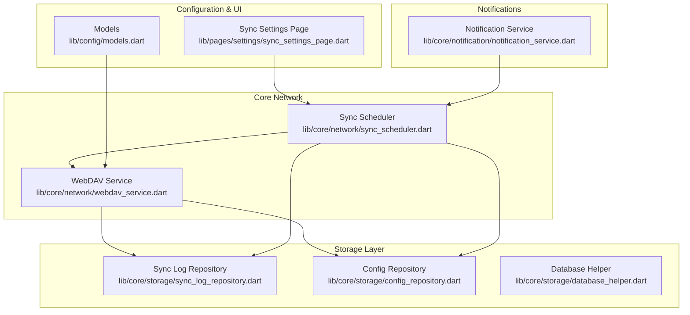
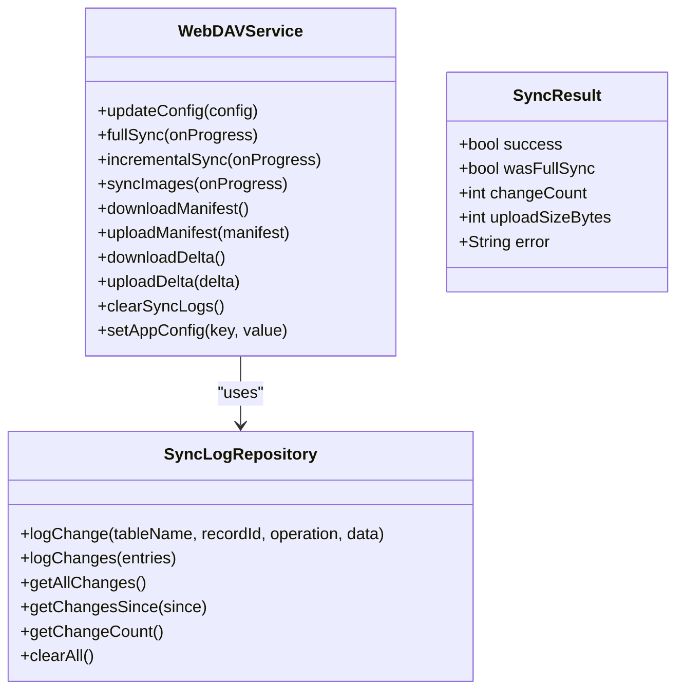
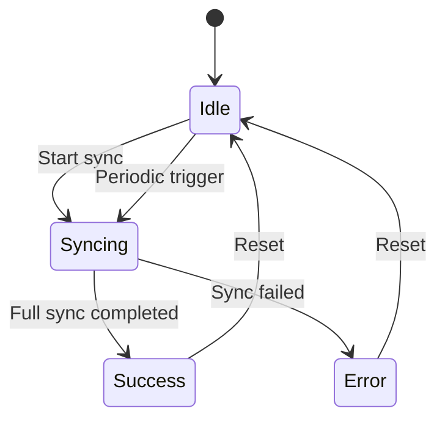
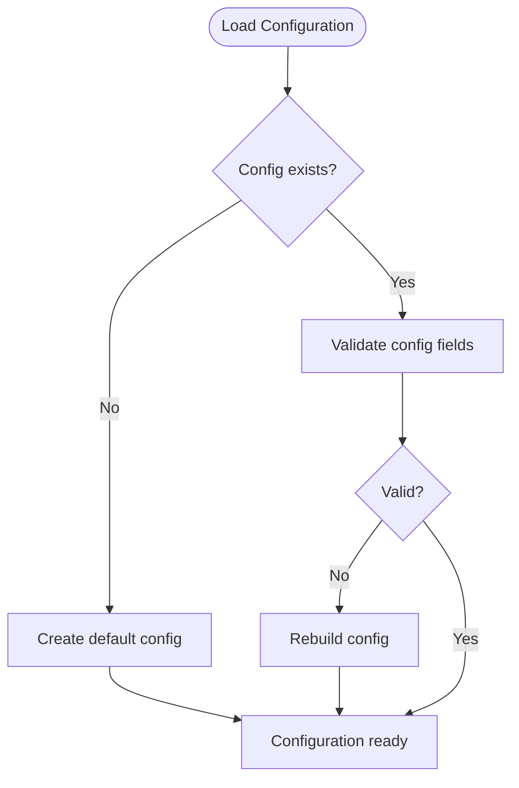
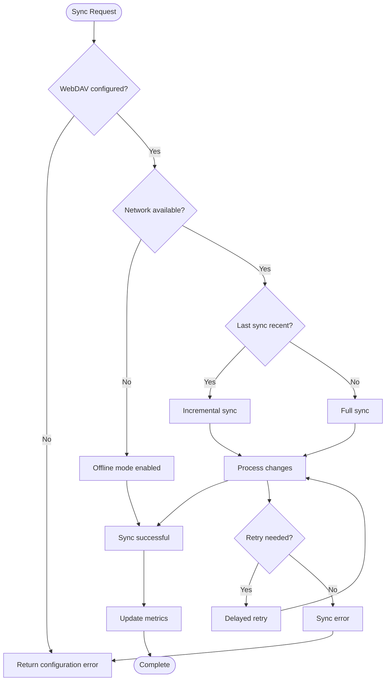
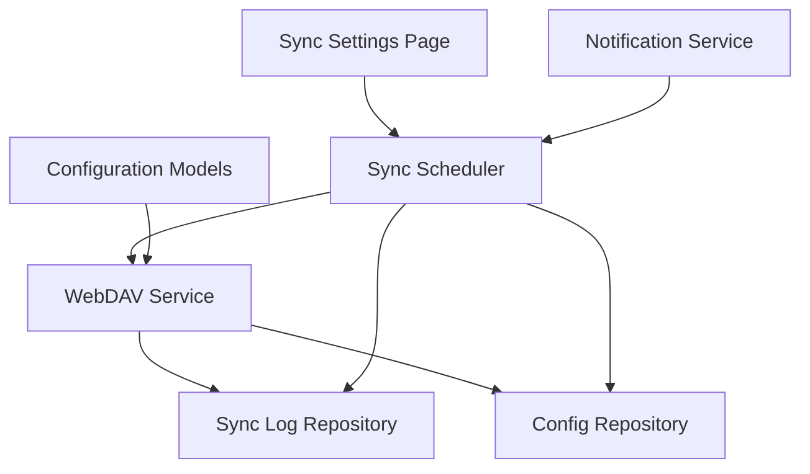

# Network Services

<cite>
**Referenced Files in This Document**
- [webdav_service.dart](file://lib/core/network/webdav_service.dart)
- [sync_scheduler.dart](file://lib/core/network/sync_scheduler.dart)
- [sync_log_repository.dart](file://lib/core/storage/sync_log_repository.dart)
- [models.dart](file://lib/config/models.dart)
- [sync_settings_page.dart](file://lib/pages/settings/sync_settings_page.dart)
- [notification_service.dart](file://lib/core/notification/notification_service.dart)
- [config_repository.dart](file://lib/core/storage/config_repository.dart)
- [database_helper.dart](file://lib/core/storage/database_helper.dart)
</cite>

## Table of Contents
1. [Introduction](#introduction)
2. [Project Structure](#project-structure)
3. [Core Components](#core-components)
4. [Architecture Overview](#architecture-overview)
5. [Detailed Component Analysis](#detailed-component-analysis)
6. [Dependency Analysis](#dependency-analysis)
7. [Performance Considerations](#performance-considerations)
8. [Troubleshooting Guide](#troubleshooting-guide)
9. [Conclusion](#conclusion)

## Introduction
This document provides comprehensive documentation for QNote Flutter's network services that enable WebDAV synchronization and cloud connectivity. It covers the WebDAV service implementation for cloud storage integration, the sync scheduler for automated synchronization, and the sync provider for state management. The documentation details WebDAV configuration, authentication methods, and connection handling, along with sync scheduling algorithms, conflict resolution strategies, and offline mode support. It also includes examples of sync workflows, error handling for network failures, retry mechanisms, sync status monitoring, progress tracking, and user notification systems. Finally, it addresses network service extensibility, custom cloud provider integration, performance optimization for large datasets, and offline-first architecture with data consistency maintenance during network interruptions.

## Project Structure
The network services are organized under the core network and storage modules, with configuration models and UI settings supporting WebDAV integration. The key components include:
- WebDAV service for cloud storage operations
- Sync scheduler for managing synchronization cycles
- Sync log repository for tracking local changes
- Configuration models and repositories for persistent settings
- Notification service for user feedback
- Settings page for user-controlled sync intervals

**Diagram sources**
- [webdav_service.dart](file://lib/core/network/webdav_service.dart)
- [sync_scheduler.dart](file://lib/core/network/sync_scheduler.dart)
- [sync_log_repository.dart](file://lib/core/storage/sync_log_repository.dart)
- [config_repository.dart](file://lib/core/storage/config_repository.dart)
- [models.dart](file://lib/config/models.dart)
- [sync_settings_page.dart](file://lib/pages/settings/sync_settings_page.dart)
- [notification_service.dart](file://lib/core/notification/notification_service.dart)
- [database_helper.dart](file://lib/core/storage/database_helper.dart)

**Section sources**
- [webdav_service.dart](file://lib/core/network/webdav_service.dart)
- [sync_scheduler.dart](file://lib/core/network/sync_scheduler.dart)
- [sync_log_repository.dart](file://lib/core/storage/sync_log_repository.dart)
- [config_repository.dart](file://lib/core/storage/config_repository.dart)
- [models.dart](file://lib/config/models.dart)
- [sync_settings_page.dart](file://lib/pages/settings/sync_settings_page.dart)
- [notification_service.dart](file://lib/core/notification/notification_service.dart)
- [database_helper.dart](file://lib/core/storage/database_helper.dart)

## Core Components
This section documents the primary components that enable WebDAV synchronization and cloud connectivity.

### WebDAV Service
The WebDAV service encapsulates cloud storage operations, including manifest and delta synchronization, image synchronization, and change logging. It manages configuration updates, handles incremental sync via delta merging, and maintains sync logs for consistency verification.

Key responsibilities:
- Download and upload manifest and delta files
- Merge incoming deltas with existing ones
- Upload delta and update manifest
- Clear sync logs and update app configuration
- Track sync metrics (change count, upload size)

Implementation highlights:
- Manifest and delta handling for incremental synchronization
- Delta merge strategy for conflict resolution
- Progress reporting hooks for UI updates
- Error handling with descriptive messages

**Section sources**
- [webdav_service.dart](file://lib/core/network/webdav_service.dart)

### Sync Scheduler
The sync scheduler orchestrates automated synchronization cycles, manages sync status, tracks progress, and coordinates with the WebDAV service and configuration repositories. It supports periodic synchronization and provides real-time status updates.

Key responsibilities:
- Manage sync status lifecycle (idle, syncing, success, error)
- Coordinate full and incremental sync operations
- Update last sync time and configuration
- Handle image sync after data sync completion
- Broadcast status changes via stream controller

Implementation highlights:
- Status management with broadcast stream
- Periodic timer integration for scheduled sync
- Progress status updates and error tracking
- Pending changes monitoring

**Section sources**
- [sync_scheduler.dart](file://lib/core/network/sync_scheduler.dart)

### Sync Log Repository
The sync log repository maintains a persistent record of local changes, enabling reconciliation during synchronization and supporting offline-first workflows. It provides batch operations and time-based queries for efficient change tracking.

Key responsibilities:
- Log individual changes with timestamps
- Batch insert multiple changes efficiently
- Retrieve all changes or changes since a specific time
- Support change counting for sync metrics

Implementation highlights:
- JSON-encoded data storage for flexible change payloads
- Batch operations for performance optimization
- Ordered retrieval for deterministic processing

**Section sources**
- [sync_log_repository.dart](file://lib/core/storage/sync_log_repository.dart)

### Configuration Models and Repositories
Configuration models define WebDAV settings and credentials, while repositories manage persistent configuration storage and retrieval. These components ensure secure and reliable configuration handling across sync operations.

Key responsibilities:
- Define WebDAV configuration structure
- Store and retrieve configuration data
- Manage app-specific configuration flags
- Support WebDAV-enabled toggles and interval settings

Implementation highlights:
- Structured configuration models
- Repository pattern for persistence
- Integration with sync settings UI

**Section sources**
- [models.dart](file://lib/config/models.dart)
- [config_repository.dart](file://lib/core/storage/config_repository.dart)

### Notification Service
The notification service provides user feedback for sync operations, displaying progress updates, success notifications, and error alerts. It integrates with the sync scheduler to present real-time status information.

Key responsibilities:
- Present sync progress and status updates
- Display success notifications upon completion
- Show error alerts for failed operations
- Coordinate with UI components for user feedback

Implementation highlights:
- Stream-based status updates
- User-friendly notification formatting
- Integration with sync lifecycle events

**Section sources**
- [notification_service.dart](file://lib/core/notification/notification_service.dart)

## Architecture Overview
The network services architecture follows an event-driven design with clear separation of concerns. The WebDAV service handles cloud operations, the sync scheduler manages timing and coordination, and the storage layer maintains change logs and configurations. The notification service provides user feedback, while the settings page allows user-controlled sync intervals.

```mermaid
sequenceDiagram
participant UI as "Settings UI"
participant SCHED as "Sync Scheduler"
participant WDS as "WebDAV Service"
participant SLR as "Sync Log Repository"
participant CR as "Config Repository"
participant NS as "Notification Service"
UI->>SCHED : Set sync interval
SCHED->>CR : Save interval setting
SCHED->>SCHED : Start periodic timer
SCHED->>WDS : fullSync()
WDS->>SLR : Get changes since last sync
WDS->>WDS : Build delta from changes
WDS->>WDS : Merge with existing delta
WDS->>WDS : Upload delta and update manifest
WDS->>SLR : Clear sync logs
WDS->>CR : Update sync metrics
WDS-->>SCHED : Sync result
SCHED->>NS : Notify success/error
SCHED->>SCHED : Update status and last sync time
```

**Diagram sources**
- [sync_scheduler.dart](file://lib/core/network/sync_scheduler.dart)
- [webdav_service.dart](file://lib/core/network/webdav_service.dart)
- [sync_log_repository.dart](file://lib/core/storage/sync_log_repository.dart)
- [config_repository.dart](file://lib/core/storage/config_repository.dart)
- [notification_service.dart](file://lib/core/notification/notification_service.dart)

## Detailed Component Analysis

### WebDAV Service Implementation
The WebDAV service implements a sophisticated incremental synchronization mechanism using manifests and deltas. It maintains a snapshot version and delta count, enabling efficient updates without transferring entire datasets.

**Diagram sources**
- [webdav_service.dart](file://lib/core/network/webdav_service.dart)
- [sync_log_repository.dart](file://lib/core/storage/sync_log_repository.dart)

Key implementation patterns:
- Manifest-based versioning with snapshot and delta tracking
- Delta merging algorithm for conflict resolution
- Batch change logging for performance optimization
- Progress callbacks for UI responsiveness

**Section sources**
- [webdav_service.dart](file://lib/core/network/webdav_service.dart)
- [sync_log_repository.dart](file://lib/core/storage/sync_log_repository.dart)

### Sync Scheduler and State Management
The sync scheduler implements a robust state management system with status tracking, progress reporting, and error handling. It coordinates multiple sync operations and maintains consistent state across asynchronous operations.

**Diagram sources**
- [sync_scheduler.dart](file://lib/core/network/sync_scheduler.dart)

Key features:
- Broadcast stream for real-time status updates
- Progress status tracking with user-visible messages
- Last sync time and metrics tracking
- Pending changes monitoring
- Error state management with recovery

**Section sources**
- [sync_scheduler.dart](file://lib/core/network/sync_scheduler.dart)

### Configuration and Authentication
The configuration system manages WebDAV settings, authentication credentials, and sync preferences. It provides structured access to configuration data and supports runtime updates.

**Diagram sources**
- [models.dart](file://lib/config/models.dart)
- [config_repository.dart](file://lib/core/storage/config_repository.dart)

**Section sources**
- [models.dart](file://lib/config/models.dart)
- [config_repository.dart](file://lib/core/storage/config_repository.dart)

### Sync Workflows and Error Handling
The system implements comprehensive error handling with retry mechanisms and graceful degradation. It supports both full and incremental sync modes with appropriate fallback strategies.

**Diagram sources**
- [sync_scheduler.dart](file://lib/core/network/sync_scheduler.dart)
- [webdav_service.dart](file://lib/core/network/webdav_service.dart)

**Section sources**
- [sync_scheduler.dart](file://lib/core/network/sync_scheduler.dart)
- [webdav_service.dart](file://lib/core/network/webdav_service.dart)

## Dependency Analysis
The network services exhibit strong cohesion within functional areas and moderate coupling between components. The WebDAV service depends on the sync log repository and configuration repository, while the sync scheduler coordinates these dependencies and manages the overall synchronization lifecycle.

**Diagram sources**
- [webdav_service.dart](file://lib/core/network/webdav_service.dart)
- [sync_scheduler.dart](file://lib/core/network/sync_scheduler.dart)
- [sync_log_repository.dart](file://lib/core/storage/sync_log_repository.dart)
- [config_repository.dart](file://lib/core/storage/config_repository.dart)
- [models.dart](file://lib/config/models.dart)
- [sync_settings_page.dart](file://lib/pages/settings/sync_settings_page.dart)
- [notification_service.dart](file://lib/core/notification/notification_service.dart)

Key dependency characteristics:
- Low coupling through interface segregation
- High cohesion within specialized repositories
- Event-driven communication via streams
- Configuration-driven behavior customization

**Section sources**
- [webdav_service.dart](file://lib/core/network/webdav_service.dart)
- [sync_scheduler.dart](file://lib/core/network/sync_scheduler.dart)
- [sync_log_repository.dart](file://lib/core/storage/sync_log_repository.dart)
- [config_repository.dart](file://lib/core/storage/config_repository.dart)
- [models.dart](file://lib/config/models.dart)
- [sync_settings_page.dart](file://lib/pages/settings/sync_settings_page.dart)
- [notification_service.dart](file://lib/core/notification/notification_service.dart)

## Performance Considerations
The network services implement several performance optimizations for handling large datasets and maintaining responsive user experiences:

- Batch operations for change logging reduce database overhead
- Delta-based incremental sync minimizes network traffic
- Stream-based progress reporting prevents UI blocking
- Configurable sync intervals balance battery life and data freshness
- Asynchronous operations prevent main thread contention

Recommendations for large dataset optimization:
- Implement pagination for large result sets
- Add compression for delta payloads
- Optimize database indexing for sync queries
- Consider background sync for heavy operations
- Monitor memory usage during bulk operations

## Troubleshooting Guide
Common issues and their resolutions:

### WebDAV Configuration Problems
- Verify server URL accessibility and SSL certificate validity
- Check authentication credentials and permissions
- Confirm WebDAV endpoint compatibility
- Validate network connectivity and firewall settings

### Sync Failures
- Review sync logs for specific error messages
- Check network stability and retry counts
- Verify sufficient storage space on remote server
- Monitor sync scheduler status and error history

### Performance Issues
- Adjust sync interval based on usage patterns
- Enable incremental sync for frequent updates
- Monitor database growth and optimize queries
- Consider reducing sync scope for large datasets

**Section sources**
- [sync_scheduler.dart](file://lib/core/network/sync_scheduler.dart)
- [webdav_service.dart](file://lib/core/network/webdav_service.dart)
- [sync_log_repository.dart](file://lib/core/storage/sync_log_repository.dart)

## Conclusion
QNote Flutter's network services provide a robust foundation for WebDAV synchronization with comprehensive offline-first capabilities. The modular architecture enables extensibility for custom cloud providers while maintaining performance and reliability. The implementation demonstrates sound engineering practices through structured configuration management, event-driven coordination, and comprehensive error handling. The system successfully balances user experience with operational efficiency, supporting both automated and manual synchronization modes.